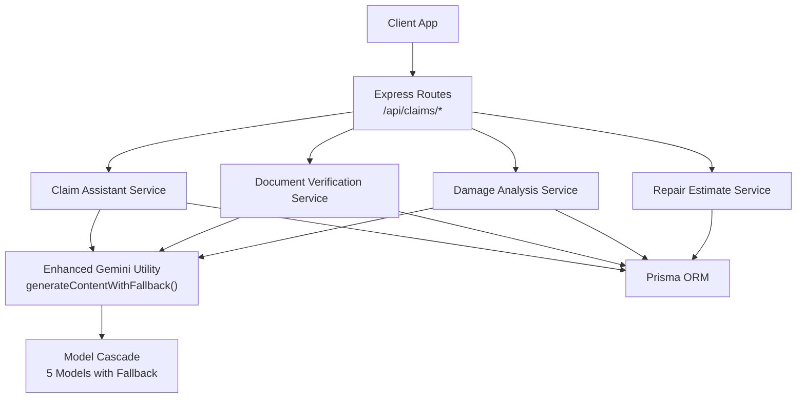
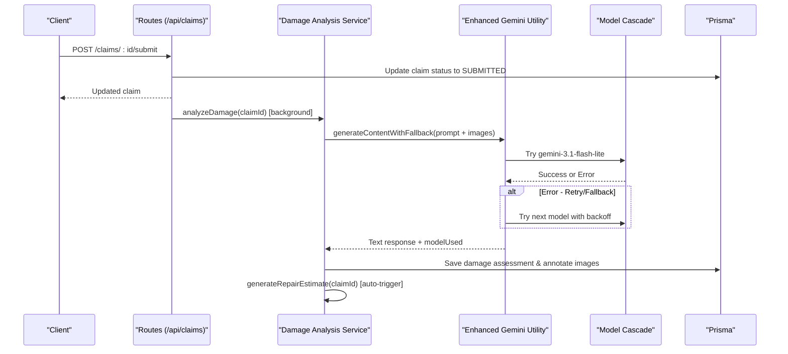
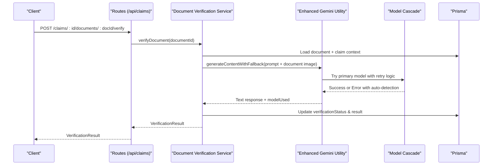
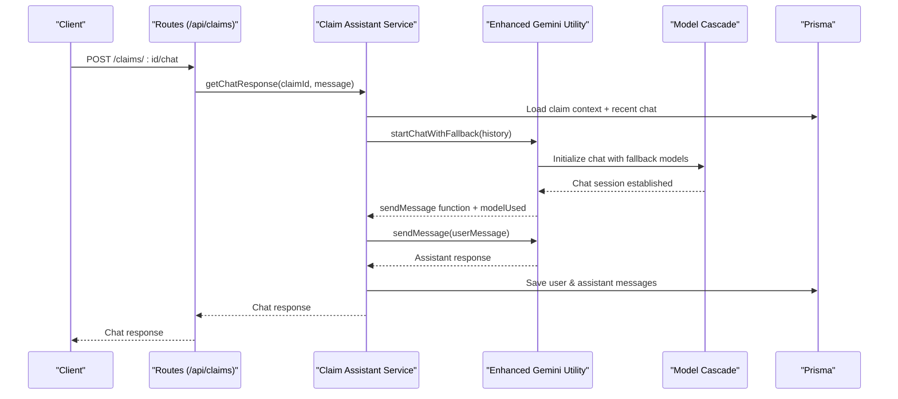
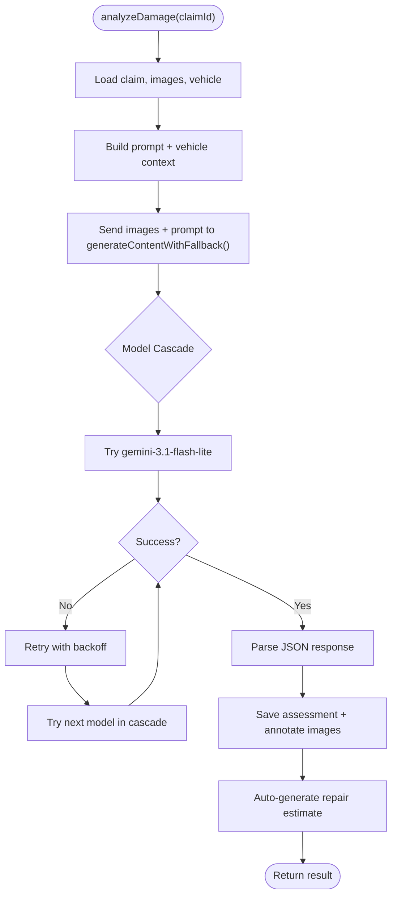
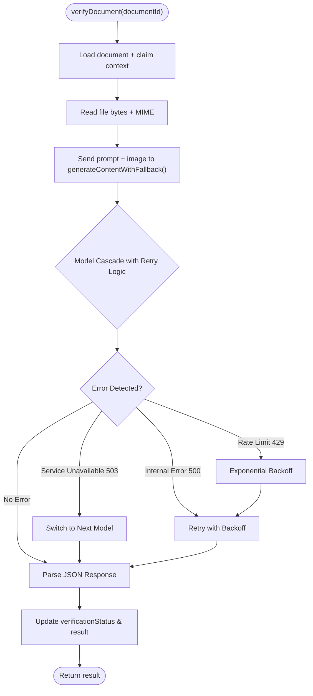
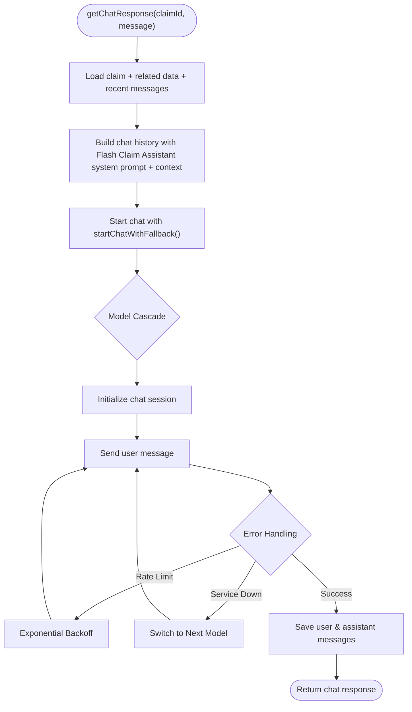
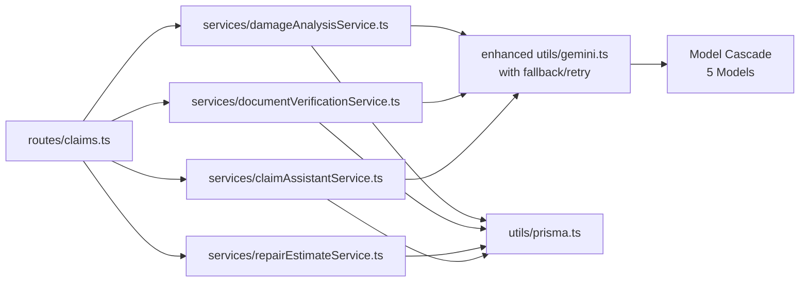

# AI Services Integration

<cite>
**Referenced Files in This Document**
- [damageAnalysisService.ts](file://backend/src/services/damageAnalysisService.ts)
- [documentVerificationService.ts](file://backend/src/services/documentVerificationService.ts)
- [repairEstimateService.ts](file://backend/src/services/repairEstimateService.ts)
- [claimAssistantService.ts](file://backend/src/services/claimAssistantService.ts)
- [gemini.ts](file://backend/src/utils/gemini.ts)
- [index.ts](file://backend/src/index.ts)
- [claims.ts](file://backend/src/routes/claims.ts)
- [errorHandler.ts](file://backend/src/middleware/errorHandler.ts)
- [index.ts (types)](file://backend/src/types/index.ts)
</cite>

## Update Summary
**Changes Made**
- Enhanced Gemini Utility section to document comprehensive fallback and retry system
- Updated all service sections to reflect new model cascade functionality
- Added detailed documentation for error detection and automatic retry mechanisms
- Updated configuration options to include model cascade details
- Enhanced troubleshooting guide with new error handling patterns

## Table of Contents
1. [Introduction](#introduction)
2. [Project Structure](#project-structure)
3. [Core Components](#core-components)
4. [Architecture Overview](#architecture-overview)
5. [Detailed Component Analysis](#detailed-component-analysis)
6. [Dependency Analysis](#dependency-analysis)
7. [Performance Considerations](#performance-considerations)
8. [Troubleshooting Guide](#troubleshooting-guide)
9. [Conclusion](#conclusion)
10. [Appendices](#appendices)

## Introduction
This document explains how the system integrates Google Gemini API to power AI-driven services for vehicle insurance claims:
- Damage analysis service for image processing and vehicle damage detection
- Document verification service for authenticity checking and OCR-like extraction
- Repair estimate service for cost calculation, parts/labor estimation, and payout projection
- Chat assistant service for conversational AI support during claims processing

The system features an enhanced Gemini integration with comprehensive fallback mechanisms, automatic error detection, and intelligent model cascading to ensure maximum reliability and availability.

It also covers configuration options, fallback mechanisms when APIs are unavailable, rate limiting strategies, error handling patterns, and guidance for customizing prompts and integrating additional AI capabilities.

## Project Structure
The backend exposes REST endpoints under /api/claims that orchestrate AI services. The core AI integration lives in a shared utility that initializes the Gemini client with advanced fallback capabilities, while each service encapsulates a specific capability.

**Diagram sources**
- [claims.ts:152-314](file://backend/src/routes/claims.ts#L152-L314)
- [damageAnalysisService.ts:50-153](file://backend/src/services/damageAnalysisService.ts#L50-L153)
- [documentVerificationService.ts:41-106](file://backend/src/services/documentVerificationService.ts#L41-L106)
- [repairEstimateService.ts:104-199](file://backend/src/services/repairEstimateService.ts#L104-L199)
- [claimAssistantService.ts:19-129](file://backend/src/services/claimAssistantService.ts#L19-L129)
- [gemini.ts:52-91](file://backend/src/utils/gemini.ts#L52-L91)

**Section sources**
- [index.ts:14-45](file://backend/src/index.ts#L14-L45)
- [claims.ts:152-314](file://backend/src/routes/claims.ts#L152-L314)

## Core Components
- Damage Analysis Service: Reads claim images, sends them to Gemini with a structured prompt using enhanced fallback system, parses JSON output into damage items, updates assessments, annotates images, and triggers repair estimates.
- Document Verification Service: Reads uploaded documents, sends them to Gemini with context using model cascade, extracts key fields, assesses readability/authenticity, and persists results.
- Repair Estimate Service: Uses deterministic algorithms over damage items to compute parts, labor, materials, totals, estimated days, and projected payouts based on policy deductibles.
- Claim Assistant Service: Builds rich context from claim data and conversation history, uses Gemini chat with fallback system to answer user questions as the Flash Claim Assistant, and persists messages.
- Enhanced Gemini Utility: Centralized initialization of GoogleGenerativeAI with comprehensive fallback mechanisms, model cascade, automatic error detection, and exponential backoff retry logic.

**Section sources**
- [damageAnalysisService.ts:50-153](file://backend/src/services/damageAnalysisService.ts#L50-L153)
- [documentVerificationService.ts:41-106](file://backend/src/services/documentVerificationService.ts#L41-L106)
- [repairEstimateService.ts:104-199](file://backend/src/services/repairEstimateService.ts#L104-L199)
- [claimAssistantService.ts:19-129](file://backend/src/services/claimAssistantService.ts#L19-L129)
- [gemini.ts:52-139](file://backend/src/utils/gemini.ts#L52-L139)

## Architecture Overview
End-to-end flows for key operations with enhanced fallback mechanisms:

**Diagram sources**
- [claims.ts:152-193](file://backend/src/routes/claims.ts#L152-L193)
- [damageAnalysisService.ts:50-153](file://backend/src/services/damageAnalysisService.ts#L50-L153)
- [gemini.ts:52-91](file://backend/src/utils/gemini.ts#L52-L91)

**Diagram sources**
- [claims.ts:379-397](file://backend/src/routes/claims.ts#L379-L397)
- [documentVerificationService.ts:41-106](file://backend/src/services/documentVerificationService.ts#L41-L106)
- [gemini.ts:52-91](file://backend/src/utils/gemini.ts#L52-L91)

**Diagram sources**
- [claims.ts:423-447](file://backend/src/routes/claims.ts#L423-L447)
- [claimAssistantService.ts:19-129](file://backend/src/services/claimAssistantService.ts#L19-L129)
- [gemini.ts:97-139](file://backend/src/utils/gemini.ts#L97-L139)

## Detailed Component Analysis

### Damage Analysis Service
- Purpose: Analyze vehicle images to detect damages, assess severity, drivability, and overall impact.
- Prompt engineering: Structured instructions enforce JSON-only responses with explicit fields for damage type, severity, location, description, affected parts, drivability assessment, and overall severity.
- Response parsing: Attempts to extract JSON from markdown code blocks if present; falls back to a safe default when parsing fails.
- Data persistence: Creates or updates damage assessments and annotates images based on whether they are full-vehicle or close-up shots.
- Workflow integration: Automatically triggers repair estimate generation after successful analysis.
- **Enhanced**: Now uses `generateContentWithFallback()` which automatically handles model failures, rate limits, and retries across 5 different Gemini models.

**Diagram sources**
- [damageAnalysisService.ts:50-153](file://backend/src/services/damageAnalysisService.ts#L50-L153)
- [gemini.ts:52-91](file://backend/src/utils/gemini.ts#L52-L91)

**Section sources**
- [damageAnalysisService.ts:7-48](file://backend/src/services/damageAnalysisService.ts#L7-L48)
- [damageAnalysisService.ts:50-153](file://backend/src/services/damageAnalysisService.ts#L50-L153)

### Document Verification Service
- Purpose: Verify uploaded documents for authenticity, completeness, and readability; extract key information via OCR-like capabilities.
- Prompt engineering: Instructs the model to check readability, identify document type, validate presence of required fields, flag issues, and return a strict JSON schema.
- Context injection: Adds document type and claim context (vehicle details, policyholder name) to improve accuracy.
- Response parsing: Extracts JSON from potential markdown formatting; provides a safe fallback indicating manual review is needed.
- Persistence: Updates verification status and result on the document record.
- **Enhanced**: Utilizes `generateContentWithFallback()` for robust error handling and automatic model switching when encountering rate limits or service unavailability.

**Diagram sources**
- [documentVerificationService.ts:41-106](file://backend/src/services/documentVerificationService.ts#L41-L106)
- [gemini.ts:27-41](file://backend/src/utils/gemini.ts#L27-L41)

**Section sources**
- [documentVerificationService.ts:7-39](file://backend/src/services/documentVerificationService.ts#L7-L39)
- [documentVerificationService.ts:41-106](file://backend/src/services/documentVerificationService.ts#L41-L106)

### Repair Estimate Service
- Purpose: Convert AI-detected damages into itemized cost estimates including parts, labor hours/rates, paint/materials, totals, and estimated repair duration.
- Algorithm highlights:
  - Deterministic lookup tables map damage types and severities to parts and labor ranges.
  - Midpoint calculations derive representative costs.
  - Labor rates and paint/materials vary by severity.
  - Estimated days derived from total labor hours assuming an 8-hour workday.
- Policy-aware payout projection: If a policy exists, applies deductible to compute covered amount and estimated payout.
- Persistence: Creates or updates repair estimates and insurance payout records.

**Diagram sources**
- [repairEstimateService.ts:104-199](file://backend/src/services/repairEstimateService.ts#L104-L199)

**Section sources**
- [repairEstimateService.ts:4-58](file://backend/src/services/repairEstimateService.ts#L4-L58)
- [repairEstimateService.ts:60-102](file://backend/src/services/repairEstimateService.ts#L60-L102)
- [repairEstimateService.ts:104-199](file://backend/src/services/repairEstimateService.ts#L104-L199)

### Claim Assistant Service
- Purpose: Provide conversational AI support tailored to the claim context, explaining assessments, estimates, next steps, and safety advice as the Flash Claim Assistant.
- Identity: Operates as the Flash Claim Assistant, a helpful and knowledgeable AI that assists policyholders with their vehicle insurance claims.
- Context assembly: Aggregates claim status, vehicle info, incident details, policy coverage/deductible, damage assessment summary, repair estimate totals, payout projections, and document statuses.
- Conversation memory: Loads recent chat messages and constructs a chat session with system context and history for coherent multi-turn interactions.
- Persistence: Saves both user and assistant messages to maintain conversation history per claim.
- **Enhanced**: Uses `startChatWithFallback()` for resilient chat sessions with automatic model switching and retry logic.

**Diagram sources**
- [claimAssistantService.ts:19-129](file://backend/src/services/claimAssistantService.ts#L19-L129)
- [gemini.ts:97-139](file://backend/src/utils/gemini.ts#L97-L139)

**Section sources**
- [claimAssistantService.ts:4-17](file://backend/src/services/claimAssistantService.ts#L4-L17)
- [claimAssistantService.ts:19-129](file://backend/src/services/claimAssistantService.ts#L19-L129)

### Enhanced Gemini Utility
- Purpose: Centralize initialization of GoogleGenerativeAI using environment variables and provide enhanced AI inference capabilities with comprehensive fallback mechanisms.
- **Model Cascade System**: Implements a sophisticated fallback strategy with 5 different Gemini models in order of preference:
  - `gemini-3.1-flash-lite` (15 RPM, 500 RPD) - Primary model with highest rate limits
  - `gemini-2.5-flash` (5 RPM, 20 RPD) - Best quality model
  - `gemini-3-flash` (5 RPM, 20 RPD) - Standard performance
  - `gemini-3.7-flash` (5 RPM, 20 RPD) - Latest flash model
  - `gemini-2.5-flash-lite` (10 RPM, 20 RPD) - Final fallback option
- **Automatic Error Detection**: Intelligent detection of various error conditions:
  - Rate limits (HTTP 429) - Temporary throttling
  - Service unavailability (HTTP 503) - Server maintenance or overload
  - Internal errors (HTTP 500) - Server-side failures
  - Quota exceeded scenarios - API usage limits
  - Network timeouts and connection issues
- **Exponential Backoff Retry**: Sophisticated retry mechanism with increasing delays between attempts to avoid overwhelming services during outages.
- **Two Core Functions**:
  - `generateContentWithFallback()`: For single-shot content generation with automatic model switching
  - `startChatWithFallback()`: For chat sessions with persistent model selection and retry logic

**Updated** The Gemini utility now provides comprehensive resilience through model cascading, automatic error detection, and intelligent retry mechanisms to ensure maximum availability and reliability.

**Section sources**
- [gemini.ts:1-142](file://backend/src/utils/gemini.ts#L1-L142)

## Dependency Analysis
- Routes depend on services to perform business logic and interact with Prisma.
- Services depend on:
  - Prisma for reading/writing claim-related entities
  - Enhanced Gemini utility for resilient AI inference with fallback mechanisms
  - Filesystem for reading uploaded images/documents
- Error handling is centralized via Express middleware; services throw errors that bubble up to be handled uniformly.

**Diagram sources**
- [claims.ts:1-11](file://backend/src/routes/claims.ts#L1-L11)
- [damageAnalysisService.ts:1-5](file://backend/src/services/damageAnalysisService.ts#L1-L5)
- [documentVerificationService.ts:1-5](file://backend/src/services/documentVerificationService.ts#L1-L5)
- [repairEstimateService.ts:1-2](file://backend/src/services/repairEstimateService.ts#L1-L2)
- [claimAssistantService.ts:1-2](file://backend/src/services/claimAssistantService.ts#L1-L2)
- [gemini.ts:1-142](file://backend/src/utils/gemini.ts#L1-L142)

**Section sources**
- [claims.ts:1-11](file://backend/src/routes/claims.ts#L1-L11)
- [gemini.ts:1-142](file://backend/src/utils/gemini.ts#L1-L142)

## Performance Considerations
- Image handling: Images are read into memory and base64-encoded before sending to Gemini. For large batches, consider streaming or chunking to reduce memory pressure.
- Background processing: Damage analysis is triggered asynchronously upon claim submission to avoid blocking the request cycle.
- Estimation algorithm: Deterministic computations are O(n) over detected damages; efficient for typical claim sizes.
- Chat history: Only recent messages are loaded to keep context manageable.
- **Enhanced Performance**: Model cascade system optimizes performance by starting with high-throughput models and falling back to higher-quality models only when necessary. Exponential backoff prevents resource exhaustion during service degradation.

[No sources needed since this section provides general guidance]

## Troubleshooting Guide
Common issues and resolutions:
- Missing or invalid API key: Ensure GEMINI_API_KEY is set in environment; without it, Gemini calls will fail.
- Unreadable or malformed AI responses: Both damage analysis and document verification parse JSON and fall back to safe defaults when parsing fails; review logs for raw responses.
- File not found: Services resolve paths relative to uploads directory; ensure files exist and permissions allow reading.
- **Enhanced Error Handling**: The system now automatically detects and handles various error conditions:
  - Rate limits (429): Automatic retry with exponential backoff
  - Service unavailability (503): Immediate fallback to next model in cascade
  - Internal errors (500): Retry with backoff before model switching
  - Quota exceeded: Automatic model switching to alternatives
- **Model Cascade Monitoring**: Check console logs for model usage patterns and fallback activations to understand service health.
- **Retry Mechanism**: Monitor retry attempts and backoff delays to diagnose transient vs. persistent issues.
- Error handling: All unhandled exceptions are caught by the Express error handler, which returns standardized error payloads.

**Section sources**
- [gemini.ts:27-41](file://backend/src/utils/gemini.ts#L27-L41)
- [gemini.ts:52-91](file://backend/src/utils/gemini.ts#L52-L91)
- [gemini.ts:97-139](file://backend/src/utils/gemini.ts#L97-L139)
- [damageAnalysisService.ts:85-103](file://backend/src/services/damageAnalysisService.ts#L85-L103)
- [documentVerificationService.ts:78-94](file://backend/src/services/documentVerificationService.ts#L78-L94)
- [errorHandler.ts:13-27](file://backend/src/middleware/errorHandler.ts#L13-L27)

## Conclusion
The system integrates Google Gemini across multiple services with enhanced reliability through comprehensive fallback mechanisms and intelligent model cascading. It combines robust prompt engineering, resilient response parsing, deterministic cost estimation, and conversational AI through the Flash Claim Assistant to streamline workflows. With clear configuration points, automatic error detection, exponential backoff retry logic, and centralized error handling, the architecture supports extensibility and operational reliability even under adverse API conditions.

[No sources needed since this section summarizes without analyzing specific files]

## Appendices

### Configuration Options
- Environment variables:
  - GEMINI_API_KEY: Required for Gemini access
  - PORT: Server port
  - CORS_ORIGIN: Allowed origins for cross-origin requests
  - UPLOAD_DIR: Directory for static upload serving
- **Enhanced Model Selection**: 
  - Default model cascade order configured in MODEL_CASCADE array
  - Primary model: gemini-3.1-flash-lite (highest throughput)
  - Fallback models: gemini-2.5-flash, gemini-3-flash, gemini-3.7-flash, gemini-2.5-flash-lite
  - Custom model names can be passed to getGeminiModel to override cascade behavior

**Section sources**
- [index.ts:14-27](file://backend/src/index.ts#L14-L27)
- [gemini.ts:7-13](file://backend/src/utils/gemini.ts#L7-L13)
- [gemini.ts:23-25](file://backend/src/utils/gemini.ts#L23-L25)

### Fallback Mechanisms
- **Enhanced Model Cascade**: Automatic switching between 5 Gemini models based on availability and performance
- **Intelligent Error Detection**: Automatic identification of rate limits, service unavailability, internal errors, and quota exceeded scenarios
- **Exponential Backoff**: Progressive delay increases between retry attempts to prevent service overload
- **Service-Level Fallbacks**:
  - Damage analysis: On JSON parse failure, returns a minimal assessment indicating manual review is required
  - Document verification: On parse failure, marks status as unreadable with recommendations to retry with clearer images
  - Chat assistant: Errors propagate to the error handler with automatic model switching
- **Logging and Monitoring**: Comprehensive logging of model usage, fallback activations, and retry attempts

**Section sources**
- [gemini.ts:27-41](file://backend/src/utils/gemini.ts#L27-L41)
- [gemini.ts:52-91](file://backend/src/utils/gemini.ts#L52-L91)
- [gemini.ts:97-139](file://backend/src/utils/gemini.ts#L97-L139)
- [damageAnalysisService.ts:85-103](file://backend/src/services/damageAnalysisService.ts#L85-L103)
- [documentVerificationService.ts:78-94](file://backend/src/services/documentVerificationService.ts#L78-L94)
- [errorHandler.ts:13-27](file://backend/src/middleware/errorHandler.ts#L13-L27)

### Rate Limiting Strategies
Recommended approaches:
- Per-user token bucket or sliding window limiter around Gemini calls
- Global queue with concurrency limits to prevent bursts
- Circuit breaker pattern to short-circuit calls when upstream errors persist
- **Enhanced Built-in Protection**: The model cascade system inherently provides rate limiting protection by distributing load across multiple models
- **Exponential Backoff**: Already implemented in the fallback system for handling transient rate limits
- **Model-Specific Limits**: Each model in the cascade has different rate limits, providing natural load distribution

[No sources needed since this section provides general guidance]

### Customizing Prompts and Extending Capabilities
- Damage analysis prompt: Extend categories (e.g., add new damage types), refine severity guidelines, or include region-specific terminology.
- Document verification prompt: Add checks for additional document types or regulatory requirements; expand extractedInfo fields.
- Chat assistant system prompt: Adjust tone, add domain-specific knowledge, or integrate policy rules for more precise guidance as the Flash Claim Assistant.
- **Enhanced Model Configuration**: Customize the MODEL_CASCADE array to add new Gemini models or adjust priority order based on your needs.
- **Custom Error Handling**: Extend the isRetryable function to handle additional error types specific to your deployment environment.
- Additional AI capabilities: Integrate vision-language features for enhanced scene understanding or add multilingual support by adjusting prompts and locale settings.

**Section sources**
- [damageAnalysisService.ts:7-48](file://backend/src/services/damageAnalysisService.ts#L7-L48)
- [documentVerificationService.ts:7-39](file://backend/src/services/documentVerificationService.ts#L7-L39)
- [claimAssistantService.ts:4-17](file://backend/src/services/claimAssistantService.ts#L4-L17)
- [gemini.ts:7-13](file://backend/src/utils/gemini.ts#L7-L13)
- [gemini.ts:27-41](file://backend/src/utils/gemini.ts#L27-L41)