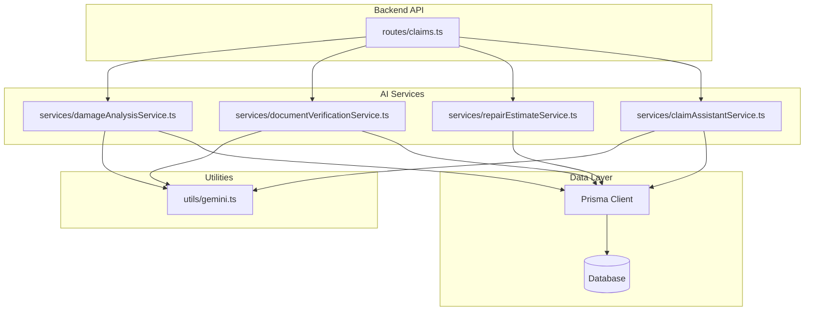
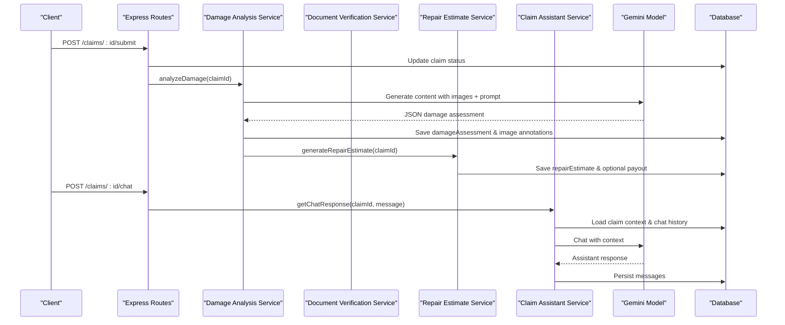
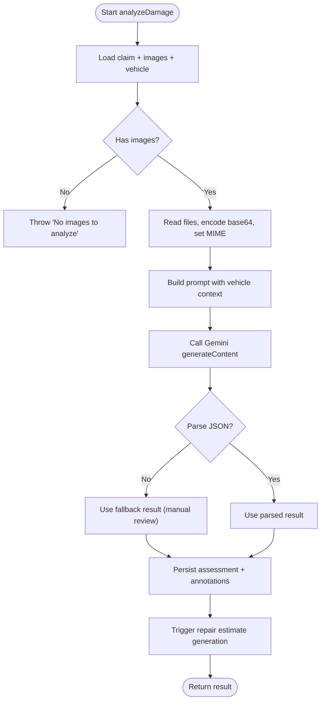
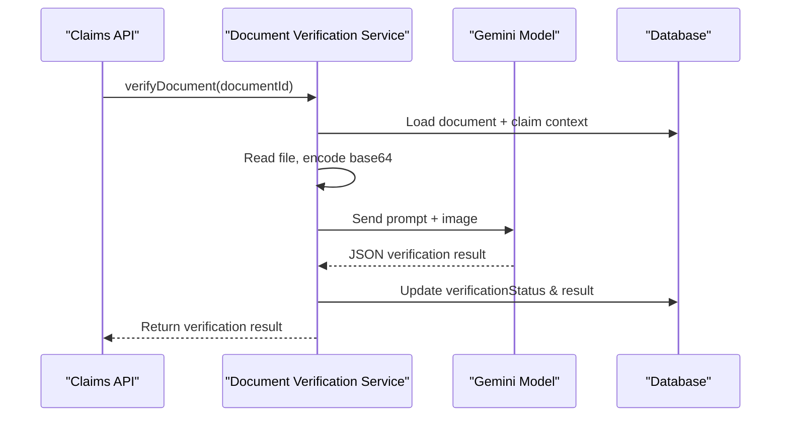
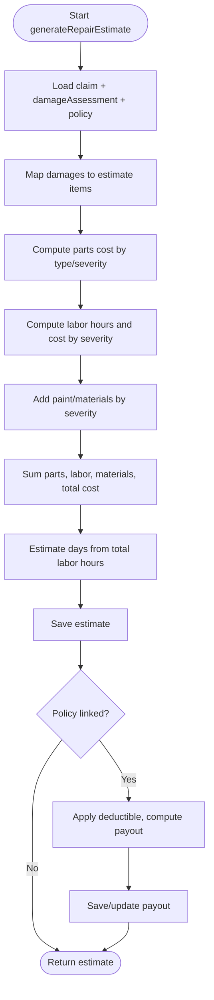
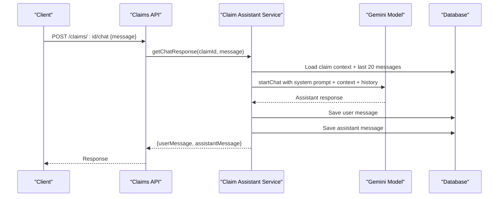
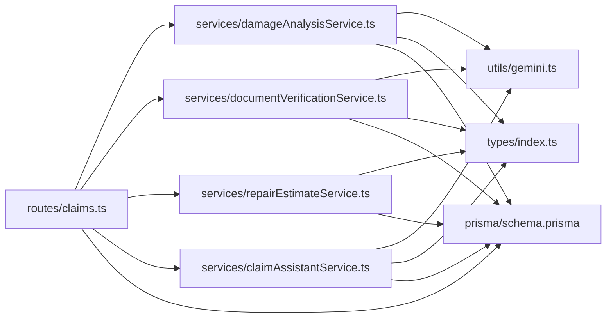

# AI Services Integration

<cite>
**Referenced Files in This Document**
- [damageAnalysisService.ts](file://backend/src/services/damageAnalysisService.ts)
- [documentVerificationService.ts](file://backend/src/services/documentVerificationService.ts)
- [repairEstimateService.ts](file://backend/src/services/repairEstimateService.ts)
- [claimAssistantService.ts](file://backend/src/services/claimAssistantService.ts)
- [gemini.ts](file://backend/src/utils/gemini.ts)
- [claims.ts](file://backend/src/routes/claims.ts)
- [index.ts](file://backend/src/types/index.ts)
- [schema.prisma](file://backend/prisma/schema.prisma)
- [package.json](file://backend/package.json)
</cite>

## Table of Contents
1. [Introduction](#introduction)
2. [Project Structure](#project-structure)
3. [Core Components](#core-components)
4. [Architecture Overview](#architecture-overview)
5. [Detailed Component Analysis](#detailed-component-analysis)
6. [Dependency Analysis](#dependency-analysis)
7. [Performance Considerations](#performance-considerations)
8. [Troubleshooting Guide](#troubleshooting-guide)
9. [Conclusion](#conclusion)
10. [Appendices](#appendices)

## Introduction
This document explains how the Smart Vehicle Insurance Claim System integrates Google Gemini AI to automate and enhance key claim workflows:
- Computer vision for damage detection, severity classification, and drivability assessment
- Document verification using OCR-like capabilities and pattern recognition
- Repair cost estimation based on AI-detected damages
- A context-aware claim assistant chat service that answers policyholder questions with live claim data

It also covers configuration options, error handling, performance considerations, rate limiting, caching strategies, and cost optimization techniques suitable for production deployments.

## Project Structure
The AI services are implemented as backend modules under src/services, with a shared utility for Gemini model access and Express routes exposing endpoints that orchestrate these services. Data persistence is handled via Prisma models defined in schema.prisma.

**Diagram sources**
- [claims.ts:1-20](file://backend/src/routes/claims.ts#L1-L20)
- [damageAnalysisService.ts:1-10](file://backend/src/services/damageAnalysisService.ts#L1-L10)
- [documentVerificationService.ts:1-10](file://backend/src/services/documentVerificationService.ts#L1-L10)
- [repairEstimateService.ts:1-10](file://backend/src/services/repairEstimateService.ts#L1-L10)
- [claimAssistantService.ts:1-10](file://backend/src/services/claimAssistantService.ts#L1-L10)
- [gemini.ts:1-13](file://backend/src/utils/gemini.ts#L1-L13)

**Section sources**
- [claims.ts:1-20](file://backend/src/routes/claims.ts#L1-L20)
- [package.json:18-30](file://backend/package.json#L18-L30)

## Core Components
- Damage analysis service: Uses Gemini to analyze vehicle images, detect damage types, classify severity, assess drivability, and annotate images. It persists results and triggers repair estimate generation.
- Document verification service: Analyzes uploaded documents (e.g., license, registration, accident report) to verify authenticity, completeness, and readability, extracting key fields and issuing recommendations.
- Repair estimate service: Converts AI-detected damages into itemized parts, labor, materials, total cost, and estimated repair days; optionally calculates insurance payout estimates based on policy deductible.
- Claim assistant service: Provides conversational assistance grounded in the current claim’s context, including status, damage assessment, repair estimate, and document verification outcomes.

**Section sources**
- [damageAnalysisService.ts:50-153](file://backend/src/services/damageAnalysisService.ts#L50-L153)
- [documentVerificationService.ts:41-106](file://backend/src/services/documentVerificationService.ts#L41-L106)
- [repairEstimateService.ts:104-199](file://backend/src/services/repairEstimateService.ts#L104-L199)
- [claimAssistantService.ts:19-129](file://backend/src/services/claimAssistantService.ts#L19-L129)

## Architecture Overview
The system exposes REST endpoints that call specialized AI services. Each service interacts with the Gemini model via a shared utility and persists intermediate or final results through Prisma.

**Diagram sources**
- [claims.ts:152-193](file://backend/src/routes/claims.ts#L152-L193)
- [claims.ts:423-447](file://backend/src/routes/claims.ts#L423-L447)
- [damageAnalysisService.ts:50-153](file://backend/src/services/damageAnalysisService.ts#L50-L153)
- [repairEstimateService.ts:104-199](file://backend/src/services/repairEstimateService.ts#L104-L199)
- [claimAssistantService.ts:19-129](file://backend/src/services/claimAssistantService.ts#L19-L129)

## Detailed Component Analysis

### Google Gemini Integration Utility
- Initializes the Gemini client from environment variables and provides a factory to obtain a configured model instance.
- Default model name is set, but can be overridden by callers if needed.

Configuration notes:
- API key is loaded from environment variables.
- Model selection is centralized; change default or pass alternative model names at call sites.

**Section sources**
- [gemini.ts:1-13](file://backend/src/utils/gemini.ts#L1-L13)

### Damage Analysis Service
Responsibilities:
- Retrieve claim with images and vehicle details.
- Encode images as base64 inline data with correct MIME type.
- Build a structured prompt instructing Gemini to output strict JSON describing damages, severity, location, affected parts, drivability assessment, and overall severity.
- Parse JSON responses with fallback to a safe default when parsing fails.
- Persist assessment and update per-image AI annotations.
- Auto-trigger repair estimate generation.

Error handling and fallbacks:
- Throws clear errors for missing claims or images.
- On parse failure, returns a minimal result indicating manual review is required.

Performance considerations:
- Image reading and base64 encoding occur per request; consider caching or pre-processing large batches.
- Background processing after claim submission avoids blocking user flow.

Extensibility:
- Prompt can be extended to include additional visual features or region-based outputs.
- Severity thresholds and part mappings can be tuned via constants or external config.

**Section sources**
- [damageAnalysisService.ts:7-48](file://backend/src/services/damageAnalysisService.ts#L7-L48)
- [damageAnalysisService.ts:50-153](file://backend/src/services/damageAnalysisService.ts#L50-L153)

**Diagram sources**
- [damageAnalysisService.ts:50-153](file://backend/src/services/damageAnalysisService.ts#L50-L153)

### Document Verification Service
Responsibilities:
- Load document metadata and related claim context (vehicle, policyholder).
- Read file from disk and encode as base64 with appropriate MIME type.
- Prompt Gemini to evaluate readability, identify document type, extract key information, detect issues (blurry, expired, tampered), and provide recommendations.
- Persist verification status and results.

Error handling and fallbacks:
- Throws errors for missing documents or files.
- On parse failure, returns an UNREADABLE status with guidance to retry with clearer images.

Extensibility:
- Add new document types and required fields in the prompt and extraction logic.
- Integrate additional checks (e.g., watermark detection) by extending prompts.

**Section sources**
- [documentVerificationService.ts:7-39](file://backend/src/services/documentVerificationService.ts#L7-L39)
- [documentVerificationService.ts:41-106](file://backend/src/services/documentVerificationService.ts#L41-L106)

**Diagram sources**
- [documentVerificationService.ts:41-106](file://backend/src/services/documentVerificationService.ts#L41-L106)

### Repair Cost Estimation Service
Responsibilities:
- Convert AI-detected damages into itemized estimates:
  - Parts cost ranges by damage type and severity
  - Labor hours by damage type and severity
  - Labor rates and paint/material costs by severity
- Aggregate totals for parts, labor, materials, and overall cost.
- Estimate repair timeline based on total labor hours.
- Optionally calculate insurance payout by applying deductible.

Algorithm highlights:
- Uses lookup tables for parts and labor ranges keyed by damage type and severity.
- Computes midpoints for ranges and derives labor cost from hours and severity-based rates.
- Persists items and totals; updates or creates insurance payout records when linked to a policy.

Extensibility:
- Adjust cost ranges, labor rates, and material costs to reflect regional pricing or vendor contracts.
- Add new damage categories or severity modifiers.

**Section sources**
- [repairEstimateService.ts:4-58](file://backend/src/services/repairEstimateService.ts#L4-L58)
- [repairEstimateService.ts:60-102](file://backend/src/services/repairEstimateService.ts#L60-L102)
- [repairEstimateService.ts:104-199](file://backend/src/services/repairEstimateService.ts#L104-L199)

**Diagram sources**
- [repairEstimateService.ts:104-199](file://backend/src/services/repairEstimateService.ts#L104-L199)

### Claim Assistant Chat Service
Responsibilities:
- Gather rich context from the claim: status, vehicle info, incident details, policy coverage, damage assessment, repair estimate, payout, and document verification statuses.
- Maintain conversation history by loading recent messages.
- Initialize a Gemini chat session with a system prompt and claim context, then send user messages and persist both user and assistant messages.

Context awareness:
- Dynamically includes damage details, severities, locations, descriptions, and drivability assessments.
- Reflects real-time document verification statuses and repair timelines.

Extensibility:
- Expand system prompt to support additional domains (e.g., towing, rental car guidance).
- Add guardrails or moderation layers before sending to Gemini.

**Section sources**
- [claimAssistantService.ts:4-17](file://backend/src/services/claimAssistantService.ts#L4-L17)
- [claimAssistantService.ts:19-129](file://backend/src/services/claimAssistantService.ts#L19-L129)

**Diagram sources**
- [claims.ts:423-447](file://backend/src/routes/claims.ts#L423-L447)
- [claimAssistantService.ts:19-129](file://backend/src/services/claimAssistantService.ts#L19-L129)

## Dependency Analysis
- Services depend on Prisma for data access and on the Gemini utility for model access.
- Routes orchestrate service calls and handle HTTP concerns.
- Types define shared interfaces for damage items, assessments, estimates, and verification results.
- Database schema defines entities such as claims, images, damage assessments, repair estimates, and payouts.

**Diagram sources**
- [index.ts:12-50](file://backend/src/types/index.ts#L12-L50)
- [schema.prisma:90-141](file://backend/prisma/schema.prisma#L90-L141)
- [claims.ts:1-20](file://backend/src/routes/claims.ts#L1-L20)
- [damageAnalysisService.ts:1-10](file://backend/src/services/damageAnalysisService.ts#L1-L10)
- [documentVerificationService.ts:1-10](file://backend/src/services/documentVerificationService.ts#L1-L10)
- [repairEstimateService.ts:1-10](file://backend/src/services/repairEstimateService.ts#L1-L10)
- [claimAssistantService.ts:1-10](file://backend/src/services/claimAssistantService.ts#L1-L10)
- [gemini.ts:1-13](file://backend/src/utils/gemini.ts#L1-L13)

**Section sources**
- [index.ts:12-50](file://backend/src/types/index.ts#L12-L50)
- [schema.prisma:90-141](file://backend/prisma/schema.prisma#L90-L141)

## Performance Considerations
- Image I/O: Reading and encoding images per request can be costly. Consider:
  - Pre-validating image sizes and formats before upload
  - Caching encoded buffers for repeated analyses
  - Using streaming or background workers for heavy tasks
- Gemini API calls:
  - Batch multiple images where possible to reduce round-trips
  - Implement retries with exponential backoff for transient failures
  - Monitor token usage and adjust model choice for cost/performance trade-offs
- Database operations:
  - Minimize N+1 queries by selecting only necessary fields
  - Use transactions for multi-step writes (e.g., assessment + annotations)
- Concurrency:
  - Offload long-running AI tasks to background jobs to keep APIs responsive
  - Rate-limit concurrent Gemini requests per process or globally

[No sources needed since this section provides general guidance]

## Troubleshooting Guide
Common issues and resolutions:
- Missing claim or images:
  - Ensure claim exists and has at least one image before analysis
  - Check file paths and storage permissions
- Parsing failures from Gemini:
  - Inspect raw responses stored in aiRawResponse
  - Improve prompt constraints and validate outputs with schema checks
- File not found:
  - Verify uploads directory structure and path resolution
  - Confirm file existence before reading
- Chat errors:
  - Validate claim ownership and message payload
  - Review database connectivity and message persistence

Operational tips:
- Log errors with context (claimId, userId, timestamps)
- Surface user-friendly messages while retaining detailed logs for debugging
- Use health checks to monitor Gemini availability and database connectivity

**Section sources**
- [damageAnalysisService.ts:56-62](file://backend/src/services/damageAnalysisService.ts#L56-L62)
- [damageAnalysisService.ts:85-103](file://backend/src/services/damageAnalysisService.ts#L85-L103)
- [documentVerificationService.ts:47-55](file://backend/src/services/documentVerificationService.ts#L47-L55)
- [documentVerificationService.ts:78-94](file://backend/src/services/documentVerificationService.ts#L78-L94)
- [claims.ts:423-447](file://backend/src/routes/claims.ts#L423-L447)

## Conclusion
The AI services integrate Google Gemini to automate damage detection, document verification, cost estimation, and customer support within the claim lifecycle. The design emphasizes robust error handling, clear fallback behaviors, and extensible prompts and algorithms. For production, adopt rate limiting, caching, monitoring, and cost controls to ensure reliability and efficiency.

[No sources needed since this section summarizes without analyzing specific files]

## Appendices

### Configuration Options
- Gemini model:
  - Default model name is set in the utility; override by passing a different model name to the factory function at call sites.
- Environment variables:
  - API key must be provided via environment configuration.
- Severity and cost parameters:
  - Repair cost ranges, labor rates, and material costs are defined in constants; adjust to reflect regional pricing or vendor agreements.
- Confidence thresholds:
  - Not currently enforced; implement threshold checks on parsed outputs (e.g., require minimum confidence scores) before accepting results.
- Fallback behaviors:
  - Damage analysis and document verification return safe defaults on parse failures; extend to include explicit fallback models or manual review queues.

**Section sources**
- [gemini.ts:6-10](file://backend/src/utils/gemini.ts#L6-L10)
- [repairEstimateService.ts:4-58](file://backend/src/services/repairEstimateService.ts#L4-L58)
- [damageAnalysisService.ts:85-103](file://backend/src/services/damageAnalysisService.ts#L85-L103)
- [documentVerificationService.ts:78-94](file://backend/src/services/documentVerificationService.ts#L78-L94)

### Extending AI Capabilities
- Additional computer vision tasks:
  - Add new damage categories and update prompts and lookup tables accordingly.
  - Introduce region-specific detection by enhancing prompts with positional cues.
- New document types:
  - Extend prompts to recognize and extract fields for new document categories.
- Enhanced chat assistant:
  - Enrich system prompt with policy-specific rules and safety guidelines.
  - Add intent classification to route queries to specialized handlers.

**Section sources**
- [damageAnalysisService.ts:7-48](file://backend/src/services/damageAnalysisService.ts#L7-L48)
- [documentVerificationService.ts:7-39](file://backend/src/services/documentVerificationService.ts#L7-L39)
- [claimAssistantService.ts:4-17](file://backend/src/services/claimAssistantService.ts#L4-L17)

### API Rate Limiting, Caching, and Cost Optimization
- Rate limiting:
  - Implement global or per-user rate limits on AI endpoints to prevent abuse and manage quotas.
  - Use middleware to enforce request throttling and queue excess requests.
- Caching strategies:
  - Cache Gemini responses for identical inputs (e.g., same images and prompts) with short TTLs to reduce redundant calls.
  - Cache document verification results for unchanged files.
- Cost optimization:
  - Choose cost-effective models for batch tasks; use faster models for chat and slower models for complex analysis.
  - Reduce input size by compressing images or cropping to regions of interest.
  - Monitor token usage and set alerts for budget thresholds.

[No sources needed since this section provides general guidance]