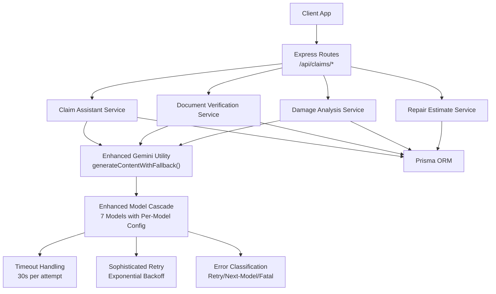
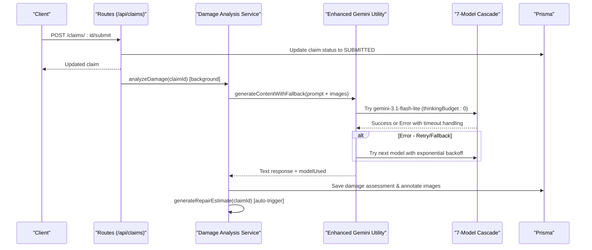
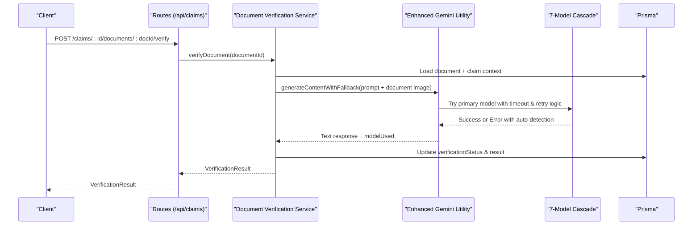
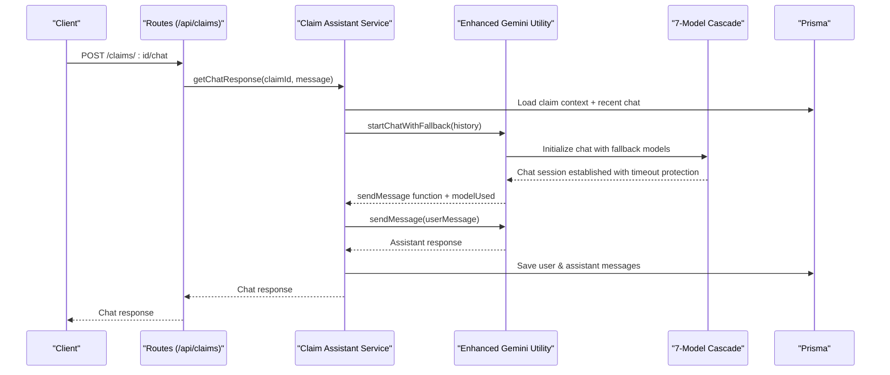
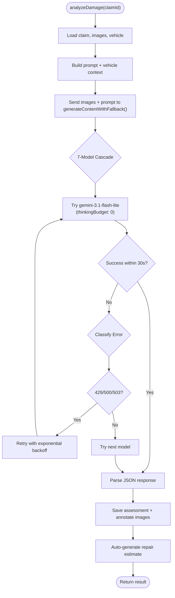
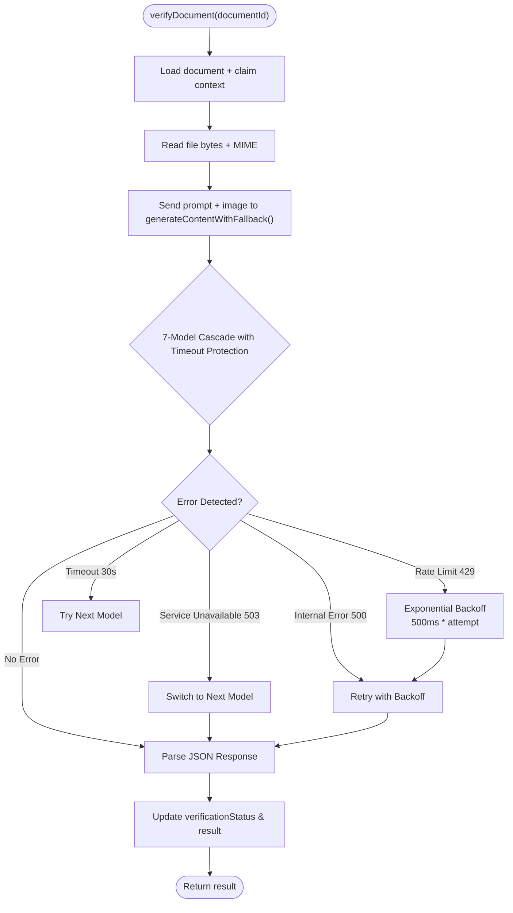
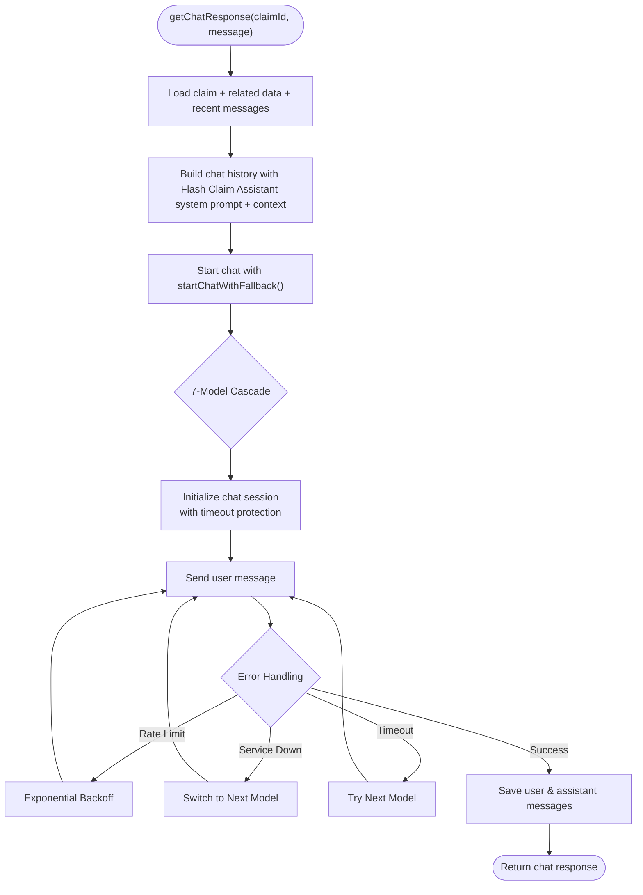
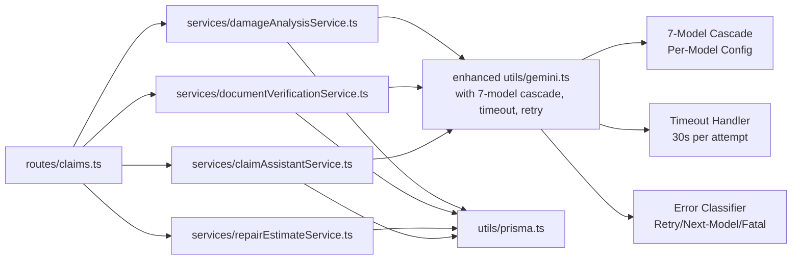

# AI Services Integration

<cite>
**Referenced Files in This Document**
- [damageAnalysisService.ts](file://backend/src/services/damageAnalysisService.ts)
- [documentVerificationService.ts](file://backend/src/services/documentVerificationService.ts)
- [repairEstimateService.ts](file://backend/src/services/repairEstimateService.ts)
- [claimAssistantService.ts](file://backend/src/services/claimAssistantService.ts)
- [gemini.ts](file://backend/src/utils/gemini.ts)
- [index.ts](file://backend/src/index.ts)
- [claims.ts](file://backend/src/routes/claims.ts)
- [errorHandler.ts](file://backend/src/middleware/errorHandler.ts)
- [index.ts (types)](file://backend/src/types/index.ts)
</cite>

## Update Summary
**Changes Made**
- Enhanced Gemini Utility section to document comprehensive model cascade system with 7 models
- Updated all service sections to reflect improved fallback mechanisms and per-model configuration
- Added detailed documentation for sophisticated retry mechanisms and timeout handling
- Updated configuration options to include per-model thinking token configuration
- Enhanced troubleshooting guide with new error classification and handling patterns
- Added comprehensive timeout handling documentation

## Table of Contents
1. [Introduction](#introduction)
2. [Project Structure](#project-structure)
3. [Core Components](#core-components)
4. [Architecture Overview](#architecture-overview)
5. [Detailed Component Analysis](#detailed-component-analysis)
6. [Dependency Analysis](#dependency-analysis)
7. [Performance Considerations](#performance-considerations)
8. [Troubleshooting Guide](#troubleshooting-guide)
9. [Conclusion](#conclusion)
10. [Appendices](#appendices)

## Introduction
This document explains how the system integrates Google Gemini API to power AI-driven services for vehicle insurance claims:
- Damage analysis service for image processing and vehicle damage detection
- Document verification service for authenticity checking and OCR-like extraction
- Repair estimate service for cost calculation, parts/labor estimation, and payout projection
- Chat assistant service for conversational AI support during claims processing

The system features an enhanced Gemini integration with comprehensive fallback mechanisms, intelligent model cascading across 7 different models, sophisticated retry logic with exponential backoff, per-model configuration including thinking token disabling, and comprehensive timeout handling to ensure maximum reliability and availability.

It also covers configuration options, fallback mechanisms when APIs are unavailable, rate limiting strategies, error handling patterns, and guidance for customizing prompts and integrating additional AI capabilities.

## Project Structure
The backend exposes REST endpoints under /api/claims that orchestrate AI services. The core AI integration lives in a shared utility that initializes the Gemini client with advanced fallback capabilities, while each service encapsulates a specific capability.

**Diagram sources**
- [claims.ts:253-296](file://backend/src/routes/claims.ts#L253-L296)
- [damageAnalysisService.ts:110-199](file://backend/src/services/damageAnalysisService.ts#L110-L199)
- [documentVerificationService.ts:40-99](file://backend/src/services/documentVerificationService.ts#L40-L99)
- [repairEstimateService.ts:108-171](file://backend/src/services/repairEstimateService.ts#L108-L171)
- [claimAssistantService.ts:20-128](file://backend/src/services/claimAssistantService.ts#L20-L128)
- [gemini.ts:91-142](file://backend/src/utils/gemini.ts#L91-L142)

**Section sources**
- [index.ts:14-45](file://backend/src/index.ts#L14-L45)
- [claims.ts:253-296](file://backend/src/routes/claims.ts#L253-L296)

## Core Components
- Damage Analysis Service: Reads claim images, sends them to Gemini with structured prompts using enhanced fallback system, parses JSON output into damage items, updates assessments, annotates images, and triggers repair estimates.
- Document Verification Service: Reads uploaded documents, sends them to Gemini with context using model cascade, extracts key fields, assesses readability/authenticity, and persists results.
- Repair Estimate Service: Uses deterministic algorithms over damage items to compute parts, labor, materials, totals, estimated days, and projected payouts based on policy deductibles.
- Claim Assistant Service: Builds rich context from claim data and conversation history, uses Gemini chat with fallback system to answer user questions as the Flash Claim Assistant, and persists messages.
- Enhanced Gemini Utility: Centralized initialization of GoogleGenerativeAI with comprehensive fallback mechanisms, 7-model cascade with per-model configuration, automatic error detection, exponential backoff retry logic, and timeout handling.

**Section sources**
- [damageAnalysisService.ts:110-199](file://backend/src/services/damageAnalysisService.ts#L110-L199)
- [documentVerificationService.ts:40-99](file://backend/src/services/documentVerificationService.ts#L40-L99)
- [repairEstimateService.ts:108-171](file://backend/src/services/repairEstimateService.ts#L108-L171)
- [claimAssistantService.ts:20-128](file://backend/src/services/claimAssistantService.ts#L20-L128)
- [gemini.ts:91-183](file://backend/src/utils/gemini.ts#L91-L183)

## Architecture Overview
End-to-end flows for key operations with enhanced fallback mechanisms:

**Diagram sources**
- [claims.ts:253-296](file://backend/src/routes/claims.ts#L253-L296)
- [damageAnalysisService.ts:110-199](file://backend/src/services/damageAnalysisService.ts#L110-L199)
- [gemini.ts:91-142](file://backend/src/utils/gemini.ts#L91-L142)

**Diagram sources**
- [claims.ts:490-508](file://backend/src/routes/claims.ts#L490-L508)
- [documentVerificationService.ts:40-99](file://backend/src/services/documentVerificationService.ts#L40-L99)
- [gemini.ts:91-142](file://backend/src/utils/gemini.ts#L91-L142)

**Diagram sources**
- [claims.ts:534-558](file://backend/src/routes/claims.ts#L534-L558)
- [claimAssistantService.ts:20-128](file://backend/src/services/claimAssistantService.ts#L20-L128)
- [gemini.ts:148-183](file://backend/src/utils/gemini.ts#L148-L183)

## Detailed Component Analysis

### Damage Analysis Service
- Purpose: Analyze vehicle images to detect damages, assess severity, drivability, and overall impact.
- Prompt engineering: Structured instructions enforce JSON-only responses with explicit fields for damage type, severity, location, description, affected parts, drivability assessment, and overall severity.
- Response parsing: Attempts to extract JSON from markdown code blocks if present; falls back to a safe default when parsing fails.
- Data persistence: Creates or updates damage assessments and annotates images based on whether they are full-vehicle or close-up shots.
- Workflow integration: Automatically triggers repair estimate generation after successful analysis.
- **Enhanced**: Now uses `generateContentWithFallback()` which automatically handles model failures, rate limits, timeouts, and retries across 7 different Gemini models with per-model configuration.

**Diagram sources**
- [damageAnalysisService.ts:110-199](file://backend/src/services/damageAnalysisService.ts#L110-L199)
- [gemini.ts:91-142](file://backend/src/utils/gemini.ts#L91-L142)

**Section sources**
- [damageAnalysisService.ts:110-199](file://backend/src/services/damageAnalysisService.ts#L110-L199)

### Document Verification Service
- Purpose: Verify uploaded documents for authenticity, completeness, and readability; extract key information via OCR-like capabilities.
- Prompt engineering: Instructs the model to check readability, identify document type, validate presence of required fields, flag issues, and return a strict JSON schema.
- Context injection: Adds document type and claim context (vehicle details, policyholder name) to improve accuracy.
- Response parsing: Extracts JSON from potential markdown formatting; provides a safe fallback indicating manual review is needed.
- Persistence: Updates verification status and result on the document record.
- **Enhanced**: Utilizes `generateContentWithFallback()` for robust error handling, automatic model switching, timeout protection, and intelligent retry logic when encountering rate limits or service unavailability.

**Diagram sources**
- [documentVerificationService.ts:40-99](file://backend/src/services/documentVerificationService.ts#L40-L99)
- [gemini.ts:91-142](file://backend/src/utils/gemini.ts#L91-L142)

**Section sources**
- [documentVerificationService.ts:40-99](file://backend/src/services/documentVerificationService.ts#L40-L99)

### Repair Estimate Service
- Purpose: Convert AI-detected damages into itemized cost estimates including parts, labor hours/rates, paint/materials, totals, and estimated repair duration.
- Algorithm highlights:
  - Deterministic lookup tables map damage types and severities to parts and labor ranges.
  - Midpoint calculations derive representative costs.
  - Labor rates and paint/materials vary by severity.
  - Estimated days derived from total labor hours assuming an 8-hour workday.
- Policy-aware payout projection: If a policy exists, applies deductible to compute covered amount and estimated payout.
- Persistence: Creates or updates repair estimates and insurance payout records.

**Diagram sources**
- [repairEstimateService.ts:108-171](file://backend/src/services/repairEstimateService.ts#L108-L171)

**Section sources**
- [repairEstimateService.ts:108-171](file://backend/src/services/repairEstimateService.ts#L108-L171)

### Claim Assistant Service
- Purpose: Provide conversational AI support tailored to the claim context, explaining assessments, estimates, next steps, and safety advice as the Flash Claim Assistant.
- Identity: Operates as the Flash Claim Assistant, a helpful and knowledgeable AI that assists policyholders with their vehicle insurance claims.
- Context assembly: Aggregates claim status, vehicle info, incident details, policy coverage/deductible, damage assessment summary, repair estimate totals, payout projections, and document statuses.
- Conversation memory: Loads recent chat messages and constructs a chat session with system context and history for coherent multi-turn interactions.
- Persistence: Saves both user and assistant messages to maintain conversation history per claim.
- **Enhanced**: Uses `startChatWithFallback()` for resilient chat sessions with automatic model switching, retry logic, and timeout protection.

**Diagram sources**
- [claimAssistantService.ts:20-128](file://backend/src/services/claimAssistantService.ts#L20-L128)
- [gemini.ts:148-183](file://backend/src/utils/gemini.ts#L148-L183)

**Section sources**
- [claimAssistantService.ts:20-128](file://backend/src/services/claimAssistantService.ts#L20-L128)

### Enhanced Gemini Utility
- Purpose: Centralize initialization of GoogleGenerativeAI using environment variables and provide enhanced AI inference capabilities with comprehensive fallback mechanisms.
- **Enhanced Model Cascade System**: Implements a sophisticated fallback strategy with 7 different Gemini models in order of preference:
  - `gemini-3.1-flash-lite` (15 RPM, 500 RPD) - Primary model with highest rate limits and thinking disabled
  - `gemini-3.5-flash-lite` - Secondary high-performance option
  - `gemini-3.5-flash` (thinkingBudget: 0) - Stronger model with thinking disabled for speed
  - `gemini-3.6-flash` - Latest flash model without thinking config
  - `gemini-2.5-flash-lite` - Reliable fallback option
  - `gemini-2.5-flash` - Final backup model
- **Per-Model Configuration**: Each model can have specific settings like `thinkingBudget: 0` to disable thinking tokens for faster processing where supported.
- **Intelligent Error Classification**: Sophisticated error detection categorizes failures into three types:
  - `retry`: Transient errors (429/500/503/timeouts) - same model may recover
  - `next-model`: Model-specific incompatibilities (400/404) - requires different model
  - `fatal`: Authentication problems (401/403) - no model will work
- **Comprehensive Timeout Handling**: All API calls protected with 30-second timeout to prevent hanging requests.
- **Exponential Backoff Retry**: Sophisticated retry mechanism with increasing delays between attempts to avoid overwhelming services during outages.
- **Two Core Functions**:
  - `generateContentWithFallback()`: For single-shot content generation with automatic model switching and timeout protection
  - `startChatWithFallback()`: For chat sessions with persistent model selection, retry logic, and timeout protection

**Updated** The Gemini utility now provides comprehensive resilience through 7-model cascading, per-model configuration, intelligent error classification, timeout handling, and sophisticated retry mechanisms to ensure maximum availability and reliability.

**Section sources**
- [gemini.ts:1-183](file://backend/src/utils/gemini.ts#L1-L183)

## Dependency Analysis
- Routes depend on services to perform business logic and interact with Prisma.
- Services depend on:
  - Prisma for reading/writing claim-related entities
  - Enhanced Gemini utility for resilient AI inference with fallback mechanisms, timeout protection, and per-model configuration
  - Filesystem for reading uploaded images/documents
- Error handling is centralized via Express middleware; services throw errors that bubble up to be handled uniformly.

**Diagram sources**
- [claims.ts:1-11](file://backend/src/routes/claims.ts#L1-L11)
- [damageAnalysisService.ts:1-5](file://backend/src/services/damageAnalysisService.ts#L1-L5)
- [documentVerificationService.ts:1-5](file://backend/src/services/documentVerificationService.ts#L1-L5)
- [repairEstimateService.ts:1-4](file://backend/src/services/repairEstimateService.ts#L1-L4)
- [claimAssistantService.ts:1-3](file://backend/src/services/claimAssistantService.ts#L1-L3)
- [gemini.ts:1-183](file://backend/src/utils/gemini.ts#L1-L183)

**Section sources**
- [claims.ts:1-11](file://backend/src/routes/claims.ts#L1-L11)
- [gemini.ts:1-183](file://backend/src/utils/gemini.ts#L1-L183)

## Performance Considerations
- Image handling: Images are read into memory and base64-encoded before sending to Gemini. For large batches, consider streaming or chunking to reduce memory pressure.
- Background processing: Damage analysis is triggered asynchronously upon claim submission to avoid blocking the request cycle.
- Estimation algorithm: Deterministic computations are O(n) over detected damages; efficient for typical claim sizes.
- Chat history: Only recent messages are loaded to keep context manageable.
- **Enhanced Performance**: 
  - 7-model cascade system optimizes performance by starting with high-throughput models and falling back to higher-quality models only when necessary
  - Per-model thinking token disabling reduces processing time for structured extraction tasks
  - 30-second timeout prevents resource exhaustion from hanging requests
  - Exponential backoff prevents resource exhaustion during service degradation
  - Intelligent error classification minimizes unnecessary model switches

[No sources needed since this section provides general guidance]

## Troubleshooting Guide
Common issues and resolutions:
- Missing or invalid API key: Ensure GEMINI_API_KEY is set in environment; without it, Gemini calls will fail.
- Unreadable or malformed AI responses: Both damage analysis and document verification parse JSON and fall back to safe defaults when parsing fails; review logs for raw responses.
- File not found: Services resolve paths relative to uploads directory; ensure files exist and permissions allow reading.
- **Enhanced Error Handling**: The system now automatically detects and handles various error conditions with intelligent classification:
  - Rate limits (429): Automatic retry with exponential backoff (500ms * attempt number)
  - Service unavailability (503): Immediate fallback to next model in cascade
  - Internal errors (500): Retry with backoff before model switching
  - Quota exceeded: Automatic model switching to alternatives
  - Timeouts (30s): Automatic retry or model switching
  - Authentication errors (401/403): Immediate failure with clear error message
- **Model Cascade Monitoring**: Check console logs for model usage patterns and fallback activations to understand service health. Logs show which model was used and when fallbacks occurred.
- **Retry Mechanism**: Monitor retry attempts and backoff delays to diagnose transient vs. persistent issues. Each retry includes exponential delay scaling.
- **Timeout Handling**: All API calls are protected with 30-second timeouts to prevent hanging requests and resource exhaustion.
- Error handling: All unhandled exceptions are caught by the Express error handler, which returns standardized error payloads.

**Section sources**
- [gemini.ts:64-80](file://backend/src/utils/gemini.ts#L64-L80)
- [gemini.ts:91-142](file://backend/src/utils/gemini.ts#L91-L142)
- [gemini.ts:148-183](file://backend/src/utils/gemini.ts#L148-L183)
- [damageAnalysisService.ts:110-199](file://backend/src/services/damageAnalysisService.ts#L110-L199)
- [documentVerificationService.ts:40-99](file://backend/src/services/documentVerificationService.ts#L40-L99)
- [errorHandler.ts:13-27](file://backend/src/middleware/errorHandler.ts#L13-L27)

## Conclusion
The system integrates Google Gemini across multiple services with enhanced reliability through comprehensive 7-model cascading, per-model configuration, intelligent error classification, timeout protection, and sophisticated retry mechanisms. It combines robust prompt engineering, resilient response parsing, deterministic cost estimation, and conversational AI through the Flash Claim Assistant to streamline workflows. With clear configuration points, automatic error detection, exponential backoff retry logic, 30-second timeout protection, and centralized error handling, the architecture supports extensibility and operational reliability even under adverse API conditions.

[No sources needed since this section summarizes without analyzing specific files]

## Appendices

### Configuration Options
- Environment variables:
  - GEMINI_API_KEY: Required for Gemini access
  - PORT: Server port
  - CORS_ORIGIN: Allowed origins for cross-origin requests
  - UPLOAD_DIR: Directory for static upload serving
  - GEMINI_MODEL: Optional override to move specific model to front of cascade
- **Enhanced Model Selection**: 
  - Default 7-model cascade order configured in BASE_CASCADE array
  - Primary model: gemini-3.1-flash-lite (highest throughput, thinking disabled)
  - Fallback models: gemini-3.5-flash-lite, gemini-3.5-flash (thinking disabled), gemini-3.6-flash, gemini-2.5-flash-lite, gemini-2.5-flash
  - Per-model configuration: Each model can specify thinkingBudget to disable thinking tokens for faster processing
  - Custom model names can be passed via GEMINI_MODEL to override cascade behavior

**Section sources**
- [index.ts:14-27](file://backend/src/index.ts#L14-L27)
- [gemini.ts:18-32](file://backend/src/utils/gemini.ts#L18-L32)
- [gemini.ts:34-36](file://backend/src/utils/gemini.ts#L34-L36)

### Fallback Mechanisms
- **Enhanced 7-Model Cascade**: Automatic switching between 7 Gemini models based on availability, performance, and compatibility
- **Intelligent Error Classification**: Automatic identification and categorization of errors into retry, next-model, or fatal categories
- **Per-Model Configuration**: Each model can have specific settings like thinkingBudget for optimized performance
- **Comprehensive Timeout Protection**: 30-second timeout on all API calls to prevent hanging requests
- **Exponential Backoff**: Progressive delay increases between retry attempts (500ms * attempt number) to prevent service overload
- **Service-Level Fallbacks**:
  - Damage analysis: On JSON parse failure, throws error for upstream debugging
  - Document verification: On parse failure, marks status as unreadable with recommendations to retry with clearer images
  - Chat assistant: Errors propagate to the error handler with automatic model switching
- **Logging and Monitoring**: Comprehensive logging of model usage, fallback activations, retry attempts, and timeout events

**Section sources**
- [gemini.ts:64-80](file://backend/src/utils/gemini.ts#L64-L80)
- [gemini.ts:91-142](file://backend/src/utils/gemini.ts#L91-L142)
- [gemini.ts:148-183](file://backend/src/utils/gemini.ts#L148-L183)
- [damageAnalysisService.ts:110-199](file://backend/src/services/damageAnalysisService.ts#L110-L199)
- [documentVerificationService.ts:40-99](file://backend/src/services/documentVerificationService.ts#L40-L99)
- [errorHandler.ts:13-27](file://backend/src/middleware/errorHandler.ts#L13-L27)

### Rate Limiting Strategies
Recommended approaches:
- Per-user token bucket or sliding window limiter around Gemini calls
- Global queue with concurrency limits to prevent bursts
- Circuit breaker pattern to short-circuit calls when upstream errors persist
- **Enhanced Built-in Protection**: The 7-model cascade system inherently provides rate limiting protection by distributing load across multiple models with different rate limits
- **Exponential Backoff**: Already implemented in the fallback system for handling transient rate limits with progressive delays
- **Model-Specific Limits**: Each model in the cascade has different rate limits (15 RPM to 5 RPM), providing natural load distribution
- **Timeout Protection**: 30-second timeouts prevent resource exhaustion during slow responses

[No sources needed since this section provides general guidance]

### Customizing Prompts and Extending Capabilities
- Damage analysis prompt: Extend categories (e.g., add new damage types), refine severity guidelines, or include region-specific terminology.
- Document verification prompt: Add checks for additional document types or regulatory requirements; expand extractedInfo fields.
- Chat assistant system prompt: Adjust tone, add domain-specific knowledge, or integrate policy rules for more precise guidance as the Flash Claim Assistant.
- **Enhanced Model Configuration**: Customize the BASE_CASCADE array to add new Gemini models, adjust priority order, or configure per-model settings like thinkingBudget based on your needs.
- **Custom Error Handling**: Extend the classifyError function to handle additional error types specific to your deployment environment.
- **Timeout Configuration**: Adjust ATTEMPT_TIMEOUT_MS constant to modify the 30-second timeout threshold based on your application requirements.
- Additional AI capabilities: Integrate vision-language features for enhanced scene understanding or add multilingual support by adjusting prompts and locale settings.

**Section sources**
- [damageAnalysisService.ts:41-48](file://backend/src/services/damageAnalysisService.ts#L41-L48)
- [documentVerificationService.ts:6-38](file://backend/src/services/documentVerificationService.ts#L6-L38)
- [claimAssistantService.ts:4-18](file://backend/src/services/claimAssistantService.ts#L4-L18)
- [gemini.ts:18-32](file://backend/src/utils/gemini.ts#L18-L32)
- [gemini.ts:64-80](file://backend/src/utils/gemini.ts#L64-L80)
- [gemini.ts:34-36](file://backend/src/utils/gemini.ts#L34-L36)