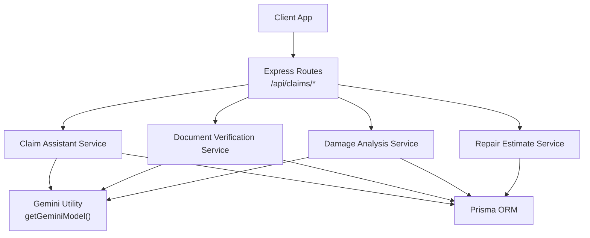
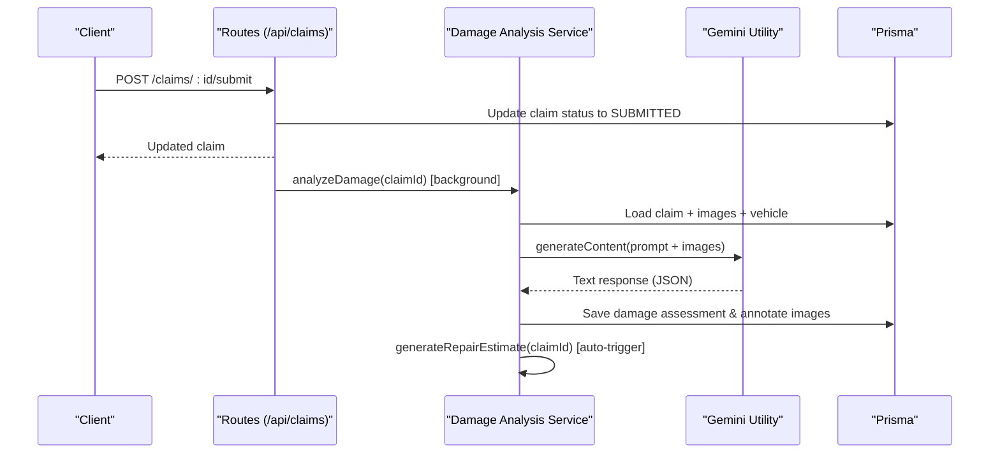
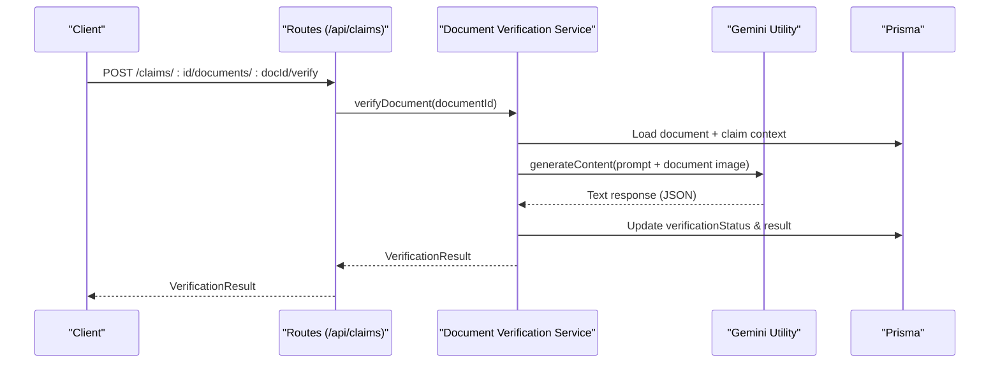
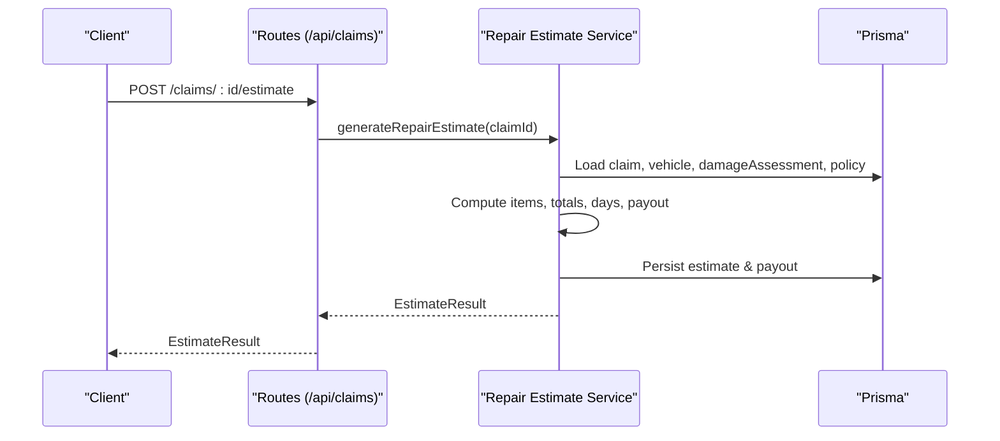
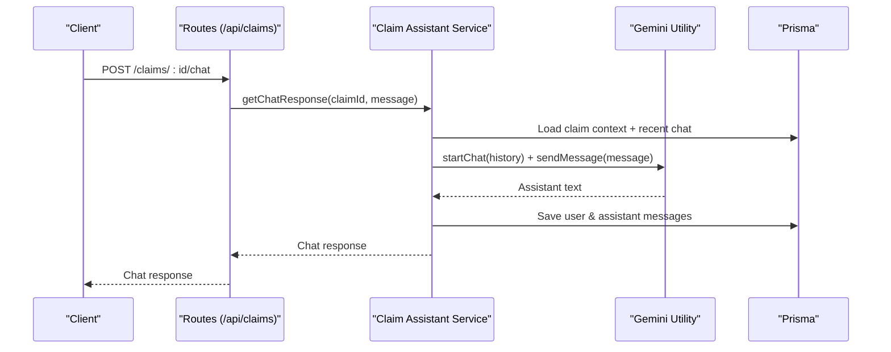
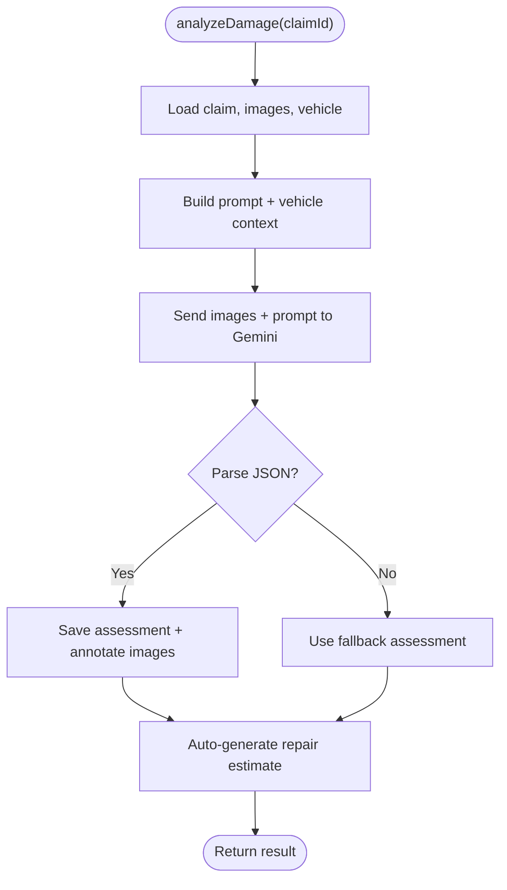
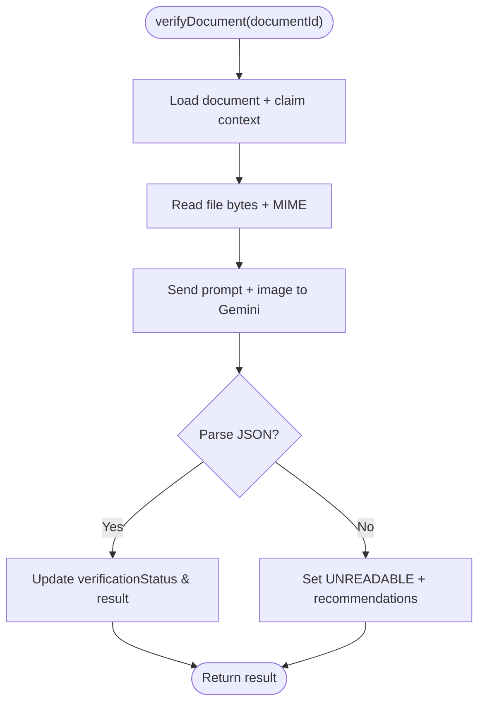
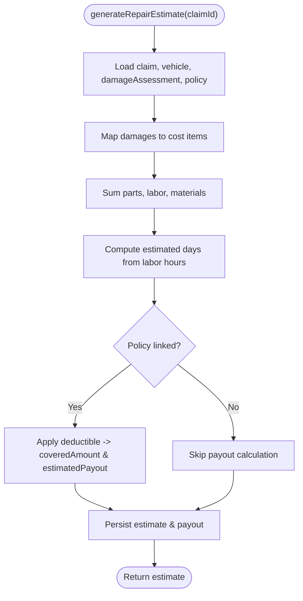
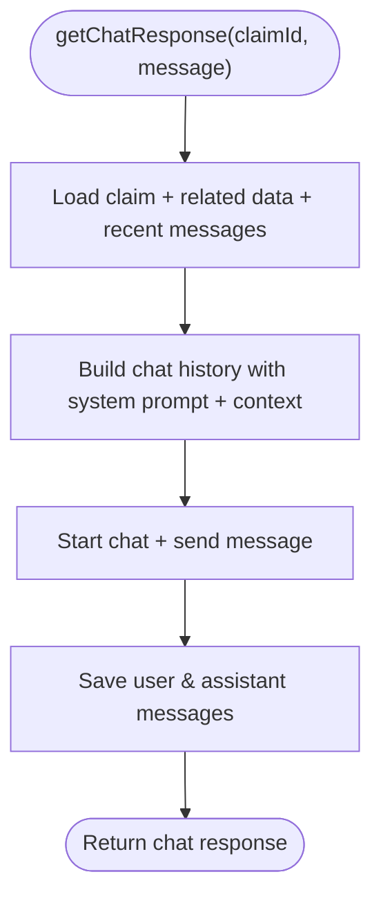
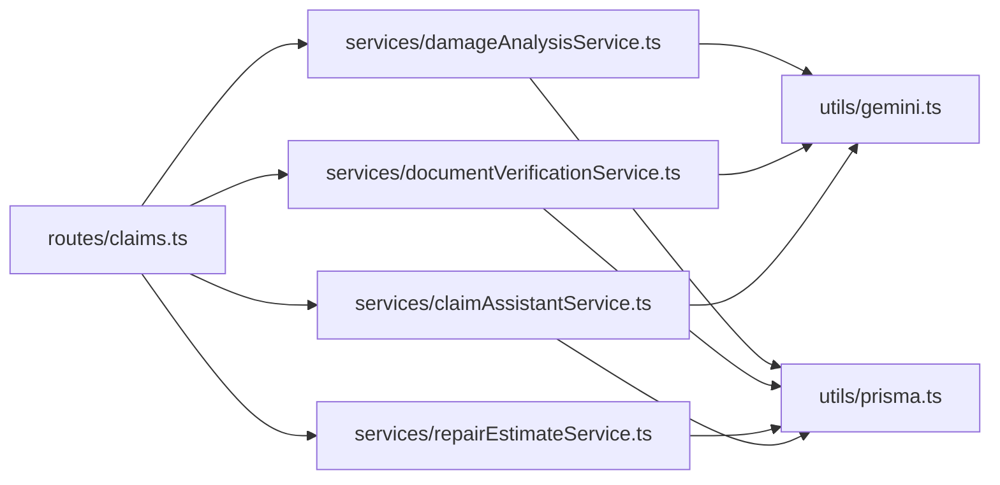

# AI Services Integration

<cite>
**Referenced Files in This Document**
- [damageAnalysisService.ts](file://backend/src/services/damageAnalysisService.ts)
- [documentVerificationService.ts](file://backend/src/services/documentVerificationService.ts)
- [repairEstimateService.ts](file://backend/src/services/repairEstimateService.ts)
- [claimAssistantService.ts](file://backend/src/services/claimAssistantService.ts)
- [gemini.ts](file://backend/src/utils/gemini.ts)
- [index.ts](file://backend/src/index.ts)
- [claims.ts](file://backend/src/routes/claims.ts)
- [errorHandler.ts](file://backend/src/middleware/errorHandler.ts)
- [index.ts (types)](file://backend/src/types/index.ts)
</cite>

## Table of Contents
1. [Introduction](#introduction)
2. [Project Structure](#project-structure)
3. [Core Components](#core-components)
4. [Architecture Overview](#architecture-overview)
5. [Detailed Component Analysis](#detailed-component-analysis)
6. [Dependency Analysis](#dependency-analysis)
7. [Performance Considerations](#performance-considerations)
8. [Troubleshooting Guide](#troubleshooting-guide)
9. [Conclusion](#conclusion)
10. [Appendices](#appendices)

## Introduction
This document explains how the system integrates Google Gemini API to power AI-driven services for vehicle insurance claims:
- Damage analysis service for image processing and vehicle damage detection
- Document verification service for authenticity checking and OCR-like extraction
- Repair estimate service for cost calculation, parts/labor estimation, and payout projection
- Chat assistant service for conversational AI support during claims processing

It also covers configuration options, fallback mechanisms when APIs are unavailable, rate limiting strategies, error handling patterns, and guidance for customizing prompts and integrating additional AI capabilities.

## Project Structure
The backend exposes REST endpoints under /api/claims that orchestrate AI services. The core AI integration lives in a shared utility that initializes the Gemini client, while each service encapsulates a specific capability.

**Diagram sources**
- [claims.ts:152-314](file://backend/src/routes/claims.ts#L152-L314)
- [damageAnalysisService.ts:50-153](file://backend/src/services/damageAnalysisService.ts#L50-L153)
- [documentVerificationService.ts:41-106](file://backend/src/services/documentVerificationService.ts#L41-L106)
- [repairEstimateService.ts:104-199](file://backend/src/services/repairEstimateService.ts#L104-L199)
- [claimAssistantService.ts:19-129](file://backend/src/services/claimAssistantService.ts#L19-L129)
- [gemini.ts:6-9](file://backend/src/utils/gemini.ts#L6-L9)

**Section sources**
- [index.ts:14-45](file://backend/src/index.ts#L14-L45)
- [claims.ts:152-314](file://backend/src/routes/claims.ts#L152-L314)

## Core Components
- Damage Analysis Service: Reads claim images, sends them to Gemini with a structured prompt, parses JSON output into damage items, updates assessments, annotates images, and triggers repair estimates.
- Document Verification Service: Reads uploaded documents, sends them to Gemini with context, extracts key fields, assesses readability/authenticity, and persists results.
- Repair Estimate Service: Uses deterministic algorithms over damage items to compute parts, labor, materials, totals, estimated days, and projected payouts based on policy deductibles.
- Claim Assistant Service: Builds rich context from claim data and conversation history, uses Gemini chat to answer user questions, and persists messages.
- Gemini Utility: Centralized initialization of GoogleGenerativeAI using environment variables; supports model selection.

**Section sources**
- [damageAnalysisService.ts:50-153](file://backend/src/services/damageAnalysisService.ts#L50-L153)
- [documentVerificationService.ts:41-106](file://backend/src/services/documentVerificationService.ts#L41-L106)
- [repairEstimateService.ts:104-199](file://backend/src/services/repairEstimateService.ts#L104-L199)
- [claimAssistantService.ts:19-129](file://backend/src/services/claimAssistantService.ts#L19-L129)
- [gemini.ts:6-9](file://backend/src/utils/gemini.ts#L6-L9)

## Architecture Overview
End-to-end flows for key operations:

**Diagram sources**
- [claims.ts:152-193](file://backend/src/routes/claims.ts#L152-L193)
- [damageAnalysisService.ts:50-153](file://backend/src/services/damageAnalysisService.ts#L50-L153)
- [gemini.ts:6-9](file://backend/src/utils/gemini.ts#L6-L9)

**Diagram sources**
- [claims.ts:379-397](file://backend/src/routes/claims.ts#L379-L397)
- [documentVerificationService.ts:41-106](file://backend/src/services/documentVerificationService.ts#L41-L106)
- [gemini.ts:6-9](file://backend/src/utils/gemini.ts#L6-L9)

**Diagram sources**
- [claims.ts:290-314](file://backend/src/routes/claims.ts#L290-L314)
- [repairEstimateService.ts:104-199](file://backend/src/services/repairEstimateService.ts#L104-L199)

**Diagram sources**
- [claims.ts:423-447](file://backend/src/routes/claims.ts#L423-L447)
- [claimAssistantService.ts:19-129](file://backend/src/services/claimAssistantService.ts#L19-L129)
- [gemini.ts:6-9](file://backend/src/utils/gemini.ts#L6-L9)

## Detailed Component Analysis

### Damage Analysis Service
- Purpose: Analyze vehicle images to detect damages, assess severity, drivability, and overall impact.
- Prompt engineering: Structured instructions enforce JSON-only responses with explicit fields for damage type, severity, location, description, affected parts, drivability assessment, and overall severity.
- Response parsing: Attempts to extract JSON from markdown code blocks if present; falls back to a safe default when parsing fails.
- Data persistence: Creates or updates damage assessments and annotates images based on whether they are full-vehicle or close-up shots.
- Workflow integration: Automatically triggers repair estimate generation after successful analysis.

**Diagram sources**
- [damageAnalysisService.ts:50-153](file://backend/src/services/damageAnalysisService.ts#L50-L153)

**Section sources**
- [damageAnalysisService.ts:7-48](file://backend/src/services/damageAnalysisService.ts#L7-L48)
- [damageAnalysisService.ts:50-153](file://backend/src/services/damageAnalysisService.ts#L50-L153)

### Document Verification Service
- Purpose: Verify uploaded documents for authenticity, completeness, and readability; extract key information via OCR-like capabilities.
- Prompt engineering: Instructs the model to check readability, identify document type, validate presence of required fields, flag issues, and return a strict JSON schema.
- Context injection: Adds document type and claim context (vehicle details, policyholder name) to improve accuracy.
- Response parsing: Extracts JSON from potential markdown formatting; provides a safe fallback indicating manual review is needed.
- Persistence: Updates verification status and result on the document record.

**Diagram sources**
- [documentVerificationService.ts:41-106](file://backend/src/services/documentVerificationService.ts#L41-L106)

**Section sources**
- [documentVerificationService.ts:7-39](file://backend/src/services/documentVerificationService.ts#L7-L39)
- [documentVerificationService.ts:41-106](file://backend/src/services/documentVerificationService.ts#L41-L106)

### Repair Estimate Service
- Purpose: Convert AI-detected damages into itemized cost estimates including parts, labor hours/rates, paint/materials, totals, and estimated repair duration.
- Algorithm highlights:
  - Deterministic lookup tables map damage types and severities to parts and labor ranges.
  - Midpoint calculations derive representative costs.
  - Labor rates and paint/materials vary by severity.
  - Estimated days derived from total labor hours assuming an 8-hour workday.
- Policy-aware payout projection: If a policy exists, applies deductible to compute covered amount and estimated payout.
- Persistence: Creates or updates repair estimates and insurance payout records.

**Diagram sources**
- [repairEstimateService.ts:104-199](file://backend/src/services/repairEstimateService.ts#L104-L199)

**Section sources**
- [repairEstimateService.ts:4-58](file://backend/src/services/repairEstimateService.ts#L4-L58)
- [repairEstimateService.ts:60-102](file://backend/src/services/repairEstimateService.ts#L60-L102)
- [repairEstimateService.ts:104-199](file://backend/src/services/repairEstimateService.ts#L104-L199)

### Claim Assistant Service
- Purpose: Provide conversational AI support tailored to the claim context, explaining assessments, estimates, next steps, and safety advice.
- Context assembly: Aggregates claim status, vehicle info, incident details, policy coverage/deductible, damage assessment summary, repair estimate totals, payout projections, and document statuses.
- Conversation memory: Loads recent chat messages and constructs a chat session with system context and history for coherent multi-turn interactions.
- Persistence: Saves both user and assistant messages to maintain conversation history per claim.

**Diagram sources**
- [claimAssistantService.ts:19-129](file://backend/src/services/claimAssistantService.ts#L19-L129)

**Section sources**
- [claimAssistantService.ts:4-17](file://backend/src/services/claimAssistantService.ts#L4-L17)
- [claimAssistantService.ts:19-129](file://backend/src/services/claimAssistantService.ts#L19-L129)

### Gemini Utility
- Purpose: Centralize initialization of GoogleGenerativeAI using environment variables and provide a reusable model getter with configurable model name.
- Configuration: Reads API key from environment; defaults to a specified model name.

**Section sources**
- [gemini.ts:1-12](file://backend/src/utils/gemini.ts#L1-L12)

## Dependency Analysis
- Routes depend on services to perform business logic and interact with Prisma.
- Services depend on:
  - Prisma for reading/writing claim-related entities
  - Gemini utility for AI inference
  - Filesystem for reading uploaded images/documents
- Error handling is centralized via Express middleware; services throw errors that bubble up to be handled uniformly.

**Diagram sources**
- [claims.ts:1-11](file://backend/src/routes/claims.ts#L1-L11)
- [damageAnalysisService.ts:1-5](file://backend/src/services/damageAnalysisService.ts#L1-L5)
- [documentVerificationService.ts:1-5](file://backend/src/services/documentVerificationService.ts#L1-L5)
- [repairEstimateService.ts:1-2](file://backend/src/services/repairEstimateService.ts#L1-L2)
- [claimAssistantService.ts:1-2](file://backend/src/services/claimAssistantService.ts#L1-L2)
- [gemini.ts:1-12](file://backend/src/utils/gemini.ts#L1-L12)

**Section sources**
- [claims.ts:1-11](file://backend/src/routes/claims.ts#L1-L11)
- [gemini.ts:1-12](file://backend/src/utils/gemini.ts#L1-L12)

## Performance Considerations
- Image handling: Images are read into memory and base64-encoded before sending to Gemini. For large batches, consider streaming or chunking to reduce memory pressure.
- Background processing: Damage analysis is triggered asynchronously upon claim submission to avoid blocking the request cycle.
- Estimation algorithm: Deterministic computations are O(n) over detected damages; efficient for typical claim sizes.
- Chat history: Only recent messages are loaded to keep context manageable.

[No sources needed since this section provides general guidance]

## Troubleshooting Guide
Common issues and resolutions:
- Missing or invalid API key: Ensure GEMINI_API_KEY is set in environment; without it, Gemini calls will fail.
- Unreadable or malformed AI responses: Both damage analysis and document verification parse JSON and fall back to safe defaults when parsing fails; review logs for raw responses.
- File not found: Services resolve paths relative to uploads directory; ensure files exist and permissions allow reading.
- Rate limits and throttling: Implement application-level rate limiting around Gemini calls (e.g., per-user or global queues) to respect provider quotas.
- Error handling: All unhandled exceptions are caught by the Express error handler, which returns standardized error payloads.

**Section sources**
- [gemini.ts:6-9](file://backend/src/utils/gemini.ts#L6-L9)
- [damageAnalysisService.ts:85-103](file://backend/src/services/damageAnalysisService.ts#L85-L103)
- [documentVerificationService.ts:78-94](file://backend/src/services/documentVerificationService.ts#L78-L94)
- [errorHandler.ts:13-27](file://backend/src/middleware/errorHandler.ts#L13-L27)

## Conclusion
The system integrates Google Gemini across multiple services to automate and enhance vehicle insurance claims processing. It combines robust prompt engineering, resilient response parsing, deterministic cost estimation, and conversational AI to streamline workflows. With clear configuration points, fallback behaviors, and centralized error handling, the architecture supports extensibility and operational reliability.

[No sources needed since this section summarizes without analyzing specific files]

## Appendices

### Configuration Options
- Environment variables:
  - GEMINI_API_KEY: Required for Gemini access
  - PORT: Server port
  - CORS_ORIGIN: Allowed origins for cross-origin requests
  - UPLOAD_DIR: Directory for static upload serving
- Model selection:
  - Default model name can be passed to getGeminiModel to switch models (e.g., gemini-2.5-flash).

**Section sources**
- [index.ts:14-27](file://backend/src/index.ts#L14-L27)
- [gemini.ts:6-9](file://backend/src/utils/gemini.ts#L6-L9)

### Fallback Mechanisms
- Damage analysis: On JSON parse failure, returns a minimal assessment indicating manual review is required.
- Document verification: On parse failure, marks status as unreadable with recommendations to retry with clearer images.
- Chat assistant: Errors propagate to the error handler; ensure retries or graceful degradation at the route layer if needed.

**Section sources**
- [damageAnalysisService.ts:85-103](file://backend/src/services/damageAnalysisService.ts#L85-L103)
- [documentVerificationService.ts:78-94](file://backend/src/services/documentVerificationService.ts#L78-L94)
- [errorHandler.ts:13-27](file://backend/src/middleware/errorHandler.ts#L13-L27)

### Rate Limiting Strategies
Recommended approaches:
- Per-user token bucket or sliding window limiter around Gemini calls
- Global queue with concurrency limits to prevent bursts
- Circuit breaker pattern to short-circuit calls when upstream errors persist
- Exponential backoff with jitter for retries on transient failures

[No sources needed since this section provides general guidance]

### Customizing Prompts and Extending Capabilities
- Damage analysis prompt: Extend categories (e.g., add new damage types), refine severity guidelines, or include region-specific terminology.
- Document verification prompt: Add checks for additional document types or regulatory requirements; expand extractedInfo fields.
- Chat assistant system prompt: Adjust tone, add domain-specific knowledge, or integrate policy rules for more precise guidance.
- Additional AI capabilities: Integrate vision-language features for enhanced scene understanding or add multilingual support by adjusting prompts and locale settings.

**Section sources**
- [damageAnalysisService.ts:7-48](file://backend/src/services/damageAnalysisService.ts#L7-L48)
- [documentVerificationService.ts:7-39](file://backend/src/services/documentVerificationService.ts#L7-L39)
- [claimAssistantService.ts:4-17](file://backend/src/services/claimAssistantService.ts#L4-L17)