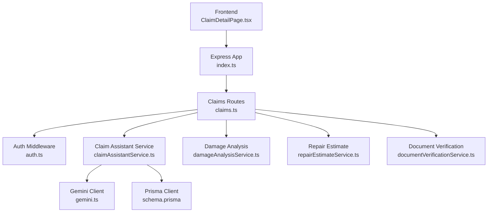
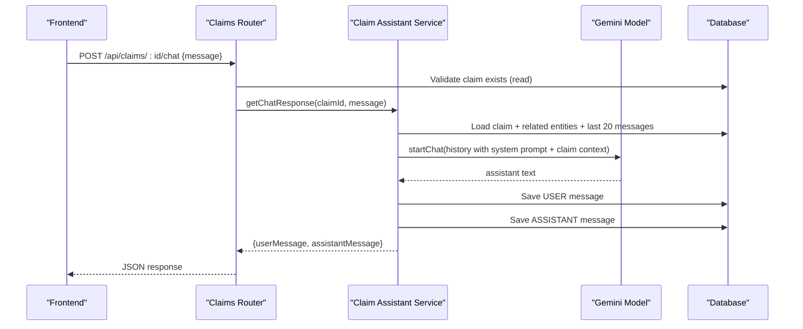
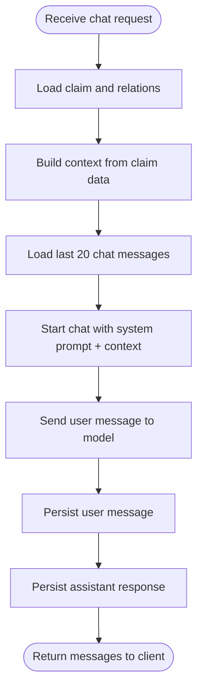
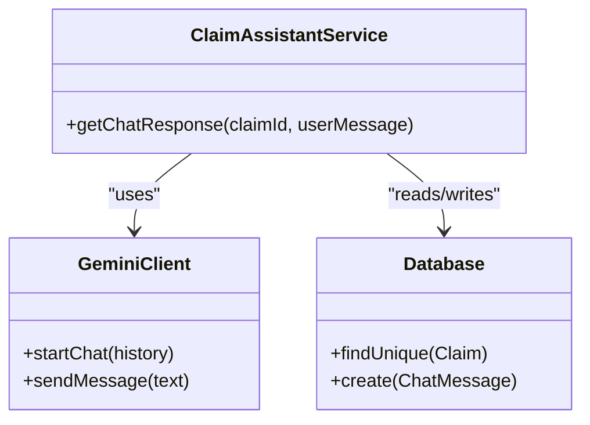
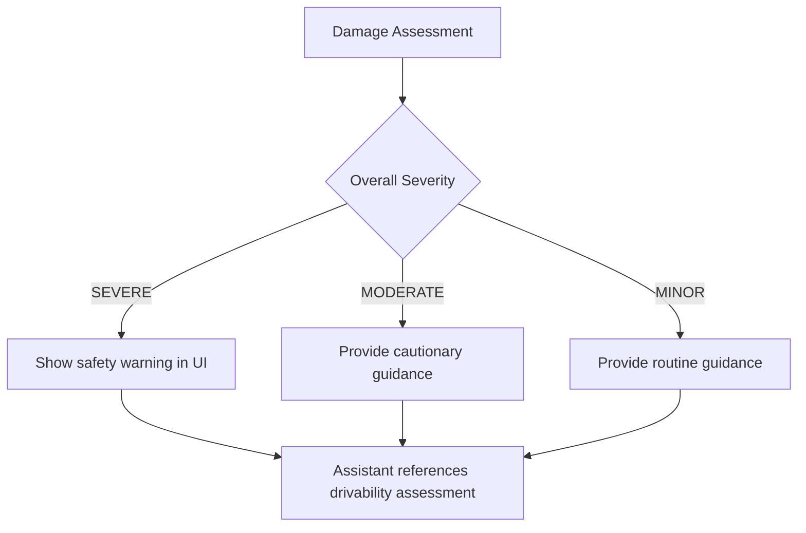
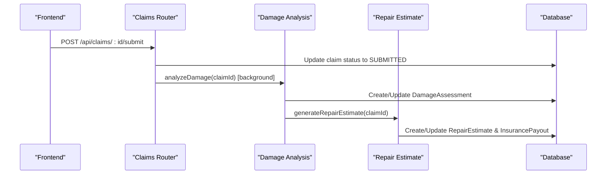
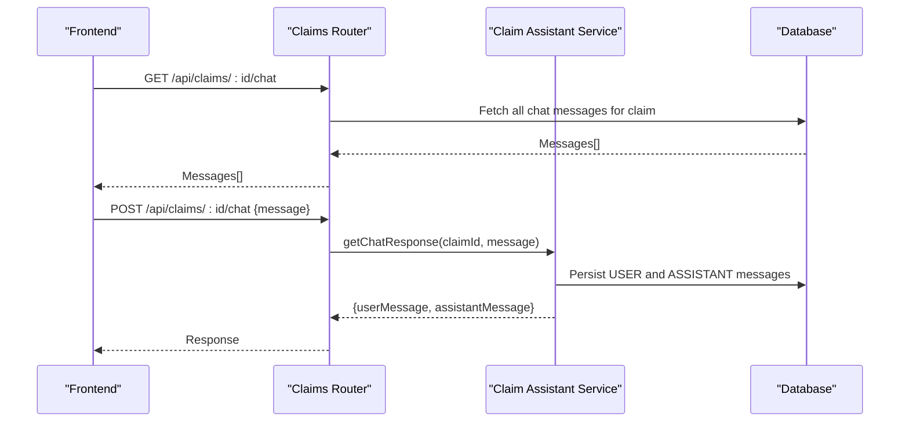
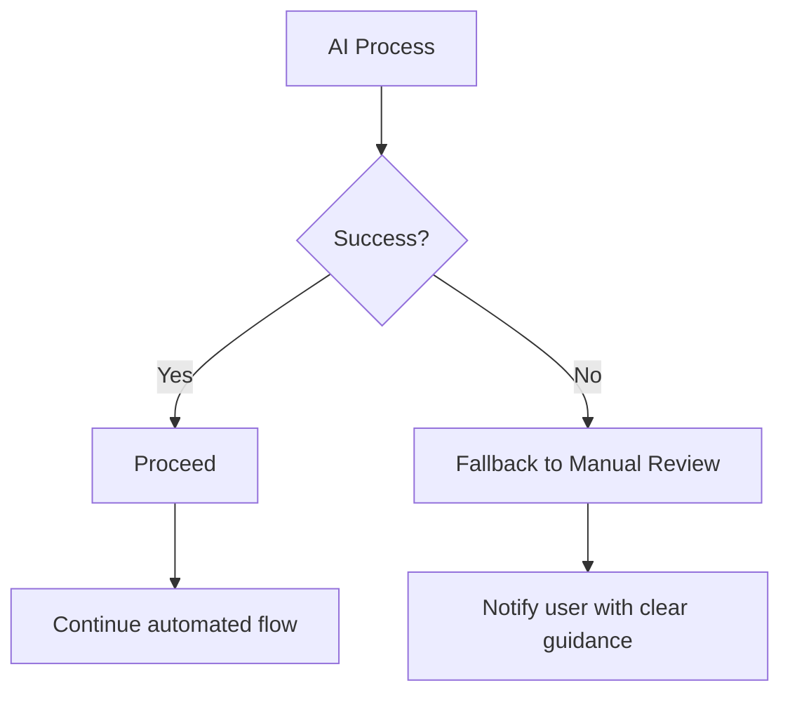
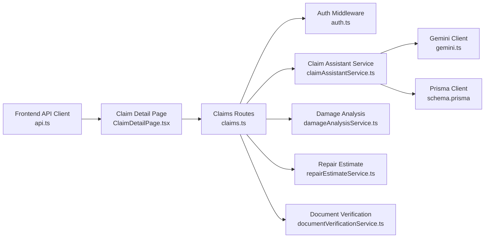

# Claim Assistant Chat Service

<cite>
**Referenced Files in This Document**
- [claimAssistantService.ts](file://backend/src/services/claimAssistantService.ts)
- [gemini.ts](file://backend/src/utils/gemini.ts)
- [claims.ts](file://backend/src/routes/claims.ts)
- [schema.prisma](file://backend/prisma/schema.prisma)
- [damageAnalysisService.ts](file://backend/src/services/damageAnalysisService.ts)
- [repairEstimateService.ts](file://backend/src/services/repairEstimateService.ts)
- [documentVerificationService.ts](file://backend/src/services/documentVerificationService.ts)
- [auth.ts](file://backend/src/middleware/auth.ts)
- [errorHandler.ts](file://backend/src/middleware/errorHandler.ts)
- [index.ts](file://backend/src/index.ts)
- [ClaimDetailPage.tsx](file://frontend/src/pages/ClaimDetailPage.tsx)
- [api.ts](file://frontend/src/services/api.ts)
</cite>

## Table of Contents
1. [Introduction](#introduction)
2. [Project Structure](#project-structure)
3. [Core Components](#core-components)
4. [Architecture Overview](#architecture-overview)
5. [Detailed Component Analysis](#detailed-component-analysis)
6. [Dependency Analysis](#dependency-analysis)
7. [Performance Considerations](#performance-considerations)
8. [Troubleshooting Guide](#troubleshooting-guide)
9. [Conclusion](#conclusion)
10. [Appendices](#appendices)

## Introduction
This document explains the Claim Assistant Chat Service that provides context-aware AI guidance throughout the insurance claim process. It covers conversation management per claim, natural language processing for claim-related questions, safety recommendations based on damage severity and claim type, integration with claim data and real-time updates, multi-turn conversations, privacy and retention considerations, response quality assurance, and fallback mechanisms when AI responses are insufficient or inappropriate.

## Project Structure
The backend exposes REST endpoints under /api/claims, including chat endpoints that persist messages and orchestrate AI-assisted responses. The frontend displays a per-claim chat panel integrated into the claim detail view.

**Diagram sources**
- [index.ts:13-32](file://backend/src/index.ts#L13-L32)
- [claims.ts:1-15](file://backend/src/routes/claims.ts#L1-L15)
- [claimAssistantService.ts:1-3](file://backend/src/services/claimAssistantService.ts#L1-L3)
- [gemini.ts:1-10](file://backend/src/utils/gemini.ts#L1-L10)
- [schema.prisma:70-93](file://backend/prisma/schema.prisma#L70-L93)

**Section sources**
- [index.ts:13-32](file://backend/src/index.ts#L13-L32)
- [claims.ts:1-15](file://backend/src/routes/claims.ts#L1-L15)

## Core Components
- Conversation Management: Persists user and assistant messages per claim, loads recent history to maintain context across turns.
- Natural Language Processing: Uses a large language model to answer policyholder questions about status, next steps, documents, coverage, and estimates.
- Safety Recommendation Engine: Derives safety guidance from damage assessment severity and drivability assessment.
- Integration Points: Reads claim, vehicle, policy, images, documents, assessments, estimates, payouts; writes chat messages.
- Frontend Chat UI: Displays conversation, quick prompts, and integrates with backend chat endpoints.

**Section sources**
- [claimAssistantService.ts:19-129](file://backend/src/services/claimAssistantService.ts#L19-L129)
- [claims.ts:399-447](file://backend/src/routes/claims.ts#L399-L447)
- [ClaimDetailPage.tsx:57-67](file://frontend/src/pages/ClaimDetailPage.tsx#L57-L67)

## Architecture Overview
The chat service composes a rich context from the claim’s relational data and feeds it to an LLM along with recent conversation history. Responses are persisted as chat messages and returned to the client.

**Diagram sources**
- [claims.ts:423-447](file://backend/src/routes/claims.ts#L423-L447)
- [claimAssistantService.ts:19-129](file://backend/src/services/claimAssistantService.ts#L19-L129)
- [gemini.ts:6-10](file://backend/src/utils/gemini.ts#L6-L10)
- [schema.prisma:187-200](file://backend/prisma/schema.prisma#L187-L200)

## Detailed Component Analysis

### Conversation Management System
- Loads full claim context including vehicle, policy, damage assessment, repair estimate, payout, and documents.
- Retrieves up to 20 recent chat messages ordered by creation time to preserve conversational continuity.
- Builds a structured context string combining claim status, incident details, policy coverage, damage items, costs, and document statuses.
- Initializes a chat session with a system prompt defining assistant responsibilities and tone.
- Persists both user and assistant messages to enable multi-turn conversations and auditability.

**Diagram sources**
- [claimAssistantService.ts:19-129](file://backend/src/services/claimAssistantService.ts#L19-L129)

**Section sources**
- [claimAssistantService.ts:19-129](file://backend/src/services/claimAssistantService.ts#L19-L129)
- [schema.prisma:70-93](file://backend/prisma/schema.prisma#L70-L93)
- [schema.prisma:187-200](file://backend/prisma/schema.prisma#L187-L200)

### Natural Language Processing Capabilities
- System prompt instructs the assistant to explain claim status, damage results, repair estimates, missing documents, next steps, safety advice, and general insurance questions.
- Context includes:
  - Claim status and incident details
  - Vehicle identity and color
  - Policy provider, number, coverage type, deductible
  - Damage assessment summary and itemized damages
  - Repair estimate totals and timeline
  - Estimated payout and deductible
  - Required document verification statuses
- Multi-turn handling is achieved by appending previous messages to the chat history sent to the model.

**Diagram sources**
- [claimAssistantService.ts:1-129](file://backend/src/services/claimAssistantService.ts#L1-L129)
- [gemini.ts:1-10](file://backend/src/utils/gemini.ts#L1-L10)
- [schema.prisma:187-200](file://backend/prisma/schema.prisma#L187-L200)

**Section sources**
- [claimAssistantService.ts:4-17](file://backend/src/services/claimAssistantService.ts#L4-L17)
- [claimAssistantService.ts:40-104](file://backend/src/services/claimAssistantService.ts#L40-L104)

### Safety Recommendation Engine
- Safety guidance is derived from the damage assessment:
  - Overall severity levels: MINOR, MODERATE, SEVERE
  - Drivability assessment text describing whether the vehicle is safe to drive
- The frontend highlights severe cases with a safety warning banner.
- The assistant can reference these fields to provide tailored safety advice in its responses.

**Diagram sources**
- [damageAnalysisService.ts:7-48](file://backend/src/services/damageAnalysisService.ts#L7-L48)
- [damageAnalysisService.ts:105-130](file://backend/src/services/damageAnalysisService.ts#L105-L130)
- [ClaimDetailPage.tsx:99-108](file://frontend/src/pages/ClaimDetailPage.tsx#L99-L108)

**Section sources**
- [damageAnalysisService.ts:7-48](file://backend/src/services/damageAnalysisService.ts#L7-L48)
- [ClaimDetailPage.tsx:99-108](file://frontend/src/pages/ClaimDetailPage.tsx#L99-L108)

### Integration with Claim Data and Real-Time Updates
- Chat endpoint reads the latest claim state and persists new messages, enabling near-real-time updates in the UI after each exchange.
- Related services integrate with claim lifecycle:
  - Damage analysis runs asynchronously after submission and auto-generates repair estimates.
  - Document verification updates verification status and issues.
  - Repair estimates compute parts/labor costs and estimated payout based on policy deductible.

**Diagram sources**
- [claims.ts:152-193](file://backend/src/routes/claims.ts#L152-L193)
- [damageAnalysisService.ts:144-150](file://backend/src/services/damageAnalysisService.ts#L144-L150)
- [repairEstimateService.ts:104-199](file://backend/src/services/repairEstimateService.ts#L104-L199)

**Section sources**
- [claims.ts:152-193](file://backend/src/routes/claims.ts#L152-L193)
- [damageAnalysisService.ts:144-150](file://backend/src/services/damageAnalysisService.ts#L144-L150)
- [repairEstimateService.ts:104-199](file://backend/src/services/repairEstimateService.ts#L104-L199)

### Multi-Turn Conversation Handling
- The service loads the last 20 messages per claim and constructs a chat history with roles mapped to model/user.
- Each turn appends the new user message and persists the assistant’s reply, ensuring continuity across sessions.

**Diagram sources**
- [claims.ts:399-447](file://backend/src/routes/claims.ts#L399-L447)
- [claimAssistantService.ts:86-129](file://backend/src/services/claimAssistantService.ts#L86-L129)

**Section sources**
- [claims.ts:399-447](file://backend/src/routes/claims.ts#L399-L447)
- [claimAssistantService.ts:86-129](file://backend/src/services/claimAssistantService.ts#L86-L129)

### Examples of Common User Interactions and Response Templates
Common interactions supported by the assistant include:
- “What’s my claim status?”
- “Explain the estimate”
- “What documents do I need?”
- “What are the next steps?”
- “Is my car safe to drive?”

The assistant uses the built context to tailor answers:
- Status queries return current claim status and next actions.
- Estimate explanations break down parts, labor, paint/materials, and total cost.
- Document guidance lists required types and their verification status.
- Next steps reflect workflow stage (e.g., submit images, upload documents, await review).
- Safety guidance references overall severity and drivability assessment.

These behaviors are driven by the system prompt and contextual data assembled in the service.

**Section sources**
- [claimAssistantService.ts:4-17](file://backend/src/services/claimAssistantService.ts#L4-L17)
- [claimAssistantService.ts:40-84](file://backend/src/services/claimAssistantService.ts#L40-L84)
- [ClaimDetailPage.tsx:69-69](file://frontend/src/pages/ClaimDetailPage.tsx#L69-L69)

### Escalation Protocols for Complex Situations
- When automated processes fail or produce ambiguous results, the system falls back to manual review:
  - Damage analysis parsing failures set a fallback result indicating manual review.
  - Document verification failures mark the document unreadable and recommend re-upload.
  - The assistant is instructed to suggest contacting the insurance provider directly if unsure.

**Diagram sources**
- [damageAnalysisService.ts:85-103](file://backend/src/services/damageAnalysisService.ts#L85-L103)
- [documentVerificationService.ts:78-94](file://backend/src/services/documentVerificationService.ts#L78-L94)
- [claimAssistantService.ts:14-17](file://backend/src/services/claimAssistantService.ts#L14-L17)

**Section sources**
- [damageAnalysisService.ts:85-103](file://backend/src/services/damageAnalysisService.ts#L85-L103)
- [documentVerificationService.ts:78-94](file://backend/src/services/documentVerificationService.ts#L78-L94)
- [claimAssistantService.ts:14-17](file://backend/src/services/claimAssistantService.ts#L14-L17)

## Dependency Analysis
- Routes depend on middleware for authentication and on services for business logic.
- Services depend on Prisma for data access and on the Gemini client for AI capabilities.
- The frontend depends on the API client which injects auth tokens and handles 401 redirects.

**Diagram sources**
- [api.ts:1-33](file://frontend/src/services/api.ts#L1-L33)
- [ClaimDetailPage.tsx:1-67](file://frontend/src/pages/ClaimDetailPage.tsx#L1-L67)
- [claims.ts:1-15](file://backend/src/routes/claims.ts#L1-L15)
- [auth.ts:1-23](file://backend/src/middleware/auth.ts#L1-L23)
- [claimAssistantService.ts:1-3](file://backend/src/services/claimAssistantService.ts#L1-L3)
- [gemini.ts:1-10](file://backend/src/utils/gemini.ts#L1-L10)
- [schema.prisma:70-93](file://backend/prisma/schema.prisma#L70-L93)

**Section sources**
- [api.ts:1-33](file://frontend/src/services/api.ts#L1-L33)
- [claims.ts:1-15](file://backend/src/routes/claims.ts#L1-L15)
- [auth.ts:1-23](file://backend/src/middleware/auth.ts#L1-L23)

## Performance Considerations
- Chat history limit: The service retrieves the last 20 messages to balance context richness with performance.
- Background processing: Damage analysis triggers asynchronously upon claim submission to avoid blocking the user flow.
- Database queries: Rich includes are used to minimize round trips but should be monitored for large datasets.
- File handling: Image and document processing reads files from disk; ensure efficient storage and caching strategies at scale.

[No sources needed since this section provides general guidance]

## Troubleshooting Guide
- Authentication failures:
  - Missing or invalid JWT returns 401; the frontend clears session and redirects to login.
- Chat errors:
  - If the claim is not found or message is missing, appropriate error responses are returned.
  - Unexpected errors log server-side and return generic error messages.
- AI processing failures:
  - Damage analysis parsing errors fall back to a minimal result and trigger manual review.
  - Document verification parsing errors mark the document unreadable and provide retry guidance.
- Health check:
  - Use the health endpoint to verify service availability.

**Section sources**
- [auth.ts:5-22](file://backend/src/middleware/auth.ts#L5-L22)
- [api.ts:19-30](file://frontend/src/services/api.ts#L19-L30)
- [claims.ts:423-447](file://backend/src/routes/claims.ts#L423-L447)
- [errorHandler.ts:13-27](file://backend/src/middleware/errorHandler.ts#L13-L27)
- [index.ts:34-37](file://backend/src/index.ts#L34-L37)
- [damageAnalysisService.ts:85-103](file://backend/src/services/damageAnalysisService.ts#L85-L103)
- [documentVerificationService.ts:78-94](file://backend/src/services/documentVerificationService.ts#L78-L94)

## Conclusion
The Claim Assistant Chat Service delivers a robust, context-aware conversational experience that integrates deeply with claim data, AI-driven analysis, and policy information. It supports multi-turn conversations, safety recommendations grounded in damage severity, and resilient fallbacks for complex scenarios. The architecture balances usability and performance while maintaining clear separation between routes, services, and external integrations.

[No sources needed since this section summarizes without analyzing specific files]

## Appendices

### API Endpoints for Chat
- GET /api/claims/:id/chat
  - Returns all chat messages for a claim in chronological order.
- POST /api/claims/:id/chat
  - Accepts a message payload and returns both user and assistant messages.

**Section sources**
- [claims.ts:399-447](file://backend/src/routes/claims.ts#L399-L447)

### Data Models Relevant to Chat
- Claim: Central entity linking to vehicle, policy, images, assessments, estimates, payouts, documents, and chat messages.
- ChatMessage: Stores role (USER/ASSISTANT), content, and timestamp per claim.

**Section sources**
- [schema.prisma:70-93](file://backend/prisma/schema.prisma#L70-L93)
- [schema.prisma:187-200](file://backend/prisma/schema.prisma#L187-L200)

### Security and Privacy Notes
- All chat endpoints require authentication via JWT; unauthorized requests are rejected.
- Chat messages are stored per claim, enabling retrieval and audit within the claim context.
- Ensure environment variables for secrets (JWT secret, API keys) are managed securely.

**Section sources**
- [auth.ts:5-22](file://backend/src/middleware/auth.ts#L5-L22)
- [schema.prisma:187-200](file://backend/prisma/schema.prisma#L187-L200)