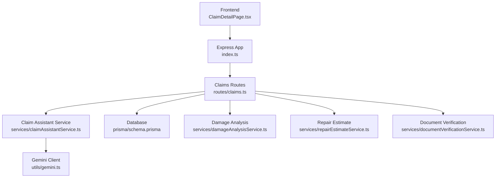
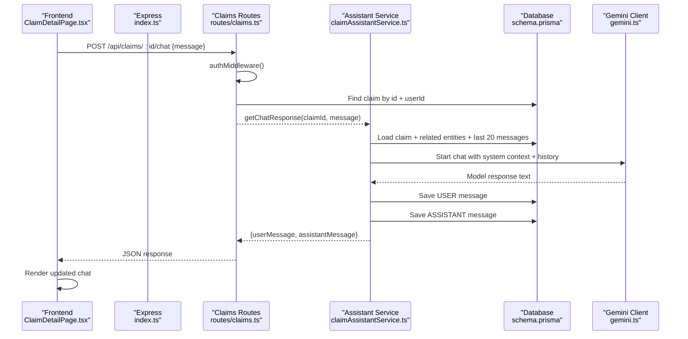
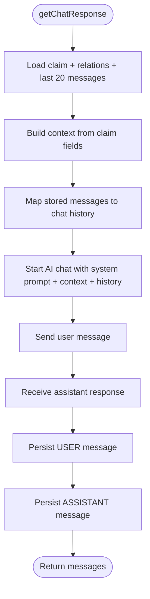
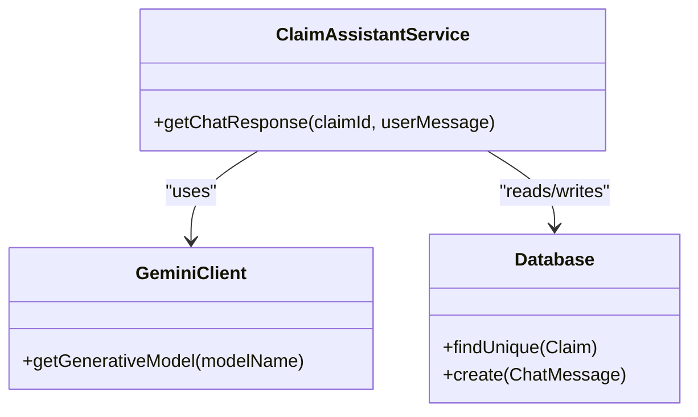
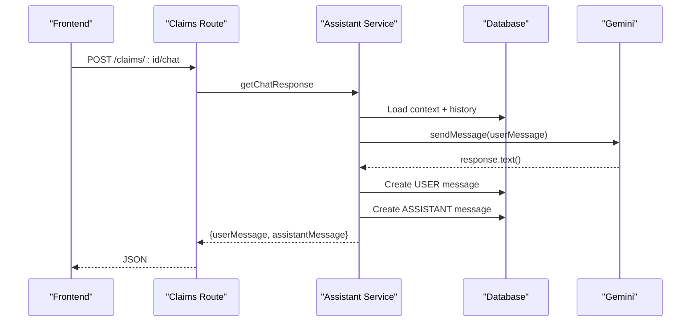
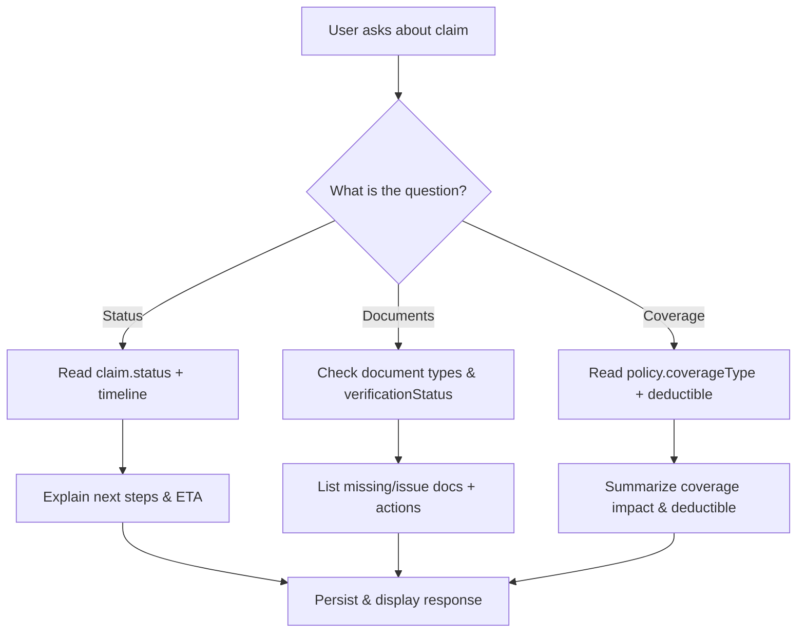
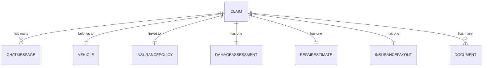
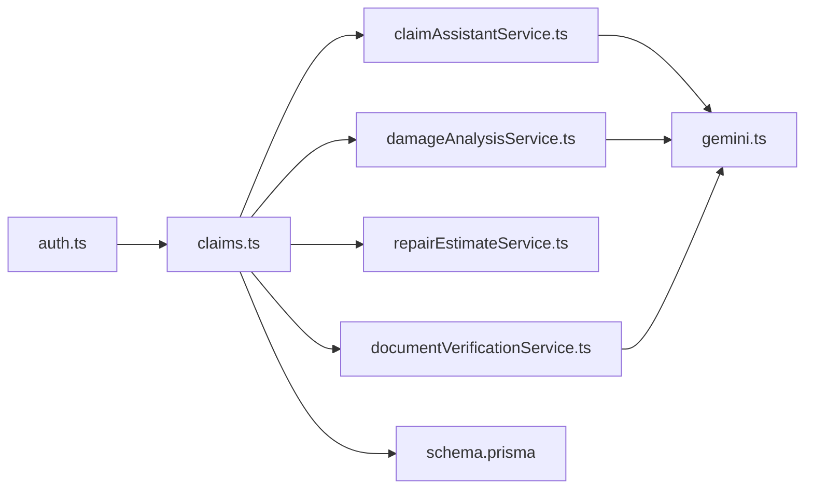

# Claim Assistant Chat Service

<cite>
**Referenced Files in This Document**
- [index.ts](file://backend/src/index.ts)
- [claims.ts](file://backend/src/routes/claims.ts)
- [claimAssistantService.ts](file://backend/src/services/claimAssistantService.ts)
- [gemini.ts](file://backend/src/utils/gemini.ts)
- [damageAnalysisService.ts](file://backend/src/services/damageAnalysisService.ts)
- [repairEstimateService.ts](file://backend/src/services/repairEstimateService.ts)
- [documentVerificationService.ts](file://backend/src/services/documentVerificationService.ts)
- [schema.prisma](file://backend/prisma/schema.prisma)
- [auth.ts](file://backend/src/middleware/auth.ts)
- [ClaimDetailPage.tsx](file://frontend/src/pages/ClaimDetailPage.tsx)
- [api.ts](file://frontend/src/services/api.ts)
</cite>

## Table of Contents
1. Introduction
2. Project Structure
3. Core Components
4. Architecture Overview
5. Detailed Component Analysis
6. Dependency Analysis
7. Performance Considerations
8. Troubleshooting Guide
9. Conclusion

## Introduction
This document explains the AI-powered chat assistant service that provides conversational support during vehicle insurance claims. It covers how conversation context is maintained across interactions, how natural language processing understands user queries about claim status, required documents, and policy coverage, and how responses are generated with appropriate disclaimers. It also details the conversation flows for common scenarios (filing new claims, checking status updates, resolving issues), integration with claim data for personalized assistance, and safety measures to prevent incorrect legal or financial advice.

## Project Structure
The backend exposes REST endpoints under /api/claims, including chat endpoints that persist messages and call an AI model to generate contextual responses. The frontend integrates a chat sidebar on the claim detail page, sending messages to the backend and displaying both user and assistant messages.

**Diagram sources**
- [index.ts:25-45](file://backend/src/index.ts#L25-L45)
- [claims.ts:400-447](file://backend/src/routes/claims.ts#L400-L447)
- [claimAssistantService.ts:19-129](file://backend/src/services/claimAssistantService.ts#L19-L129)
- [gemini.ts:6-11](file://backend/src/utils/gemini.ts#L6-L11)
- [damageAnalysisService.ts:50-153](file://backend/src/services/damageAnalysisService.ts#L50-L153)
- [repairEstimateService.ts:104-199](file://backend/src/services/repairEstimateService.ts#L104-L199)
- [documentVerificationService.ts:41-107](file://backend/src/services/documentVerificationService.ts#L41-L107)
- [schema.prisma:71-201](file://backend/prisma/schema.prisma#L71-L201)

**Section sources**
- [index.ts:25-45](file://backend/src/index.ts#L25-L45)
- [claims.ts:400-447](file://backend/src/routes/claims.ts#L400-L447)
- [ClaimDetailPage.tsx:57-67](file://frontend/src/pages/ClaimDetailPage.tsx#L57-L67)

## Core Components
- Conversation management: Persists per-claim chat history and reconstructs context from claim data before calling the AI model.
- Natural language understanding: Uses a system prompt and claim-specific context to guide the model’s responses about status, documents, and coverage.
- Response generation: Returns structured messages and persists them for UI rendering; includes guidance to avoid giving definitive legal/financial advice.
- Data integration: Reads vehicle, policy, damage assessment, repair estimate, payout, and document statuses to tailor answers.
- Safety measures: System prompt instructs cautious, non-binding guidance and directs users to contact their provider for authoritative decisions.

**Section sources**
- [claimAssistantService.ts:4-17](file://backend/src/services/claimAssistantService.ts#L4-L17)
- [claimAssistantService.ts:19-129](file://backend/src/services/claimAssistantService.ts#L19-L129)
- [schema.prisma:188-201](file://backend/prisma/schema.prisma#L188-L201)

## Architecture Overview
The chat flow begins at the frontend, which posts a message to the claims chat endpoint. The route validates ownership via authentication middleware, loads the claim and recent chat history, builds a rich context block, and calls the assistant service. The assistant service constructs a chat session with the AI model, sends the user message, receives a response, persists both messages, and returns them to the client.

**Diagram sources**
- [claims.ts:423-447](file://backend/src/routes/claims.ts#L423-L447)
- [claimAssistantService.ts:19-129](file://backend/src/services/claimAssistantService.ts#L19-L129)
- [gemini.ts:6-11](file://backend/src/utils/gemini.ts#L6-L11)
- [schema.prisma:71-201](file://backend/prisma/schema.prisma#L71-L201)

## Detailed Component Analysis

### Conversation Management System
- Context construction: Aggregates claim status, vehicle details, incident info, policy coverage, damage assessment summary, repair estimate totals, estimated payout, and document verification statuses into a single context string.
- History handling: Loads up to 20 recent messages per claim, reverses order for proper chat sequencing, and maps roles to model/user format for the AI session.
- Persistence: Stores each user and assistant message with role and timestamp, enabling persistent multi-turn conversations per claim.

**Diagram sources**
- [claimAssistantService.ts:19-129](file://backend/src/services/claimAssistantService.ts#L19-L129)

**Section sources**
- [claimAssistantService.ts:19-129](file://backend/src/services/claimAssistantService.ts#L19-L129)
- [schema.prisma:188-201](file://backend/prisma/schema.prisma#L188-L201)

### Natural Language Processing Capabilities
- System prompt: Defines the assistant’s role, responsibilities, tone, and boundaries (e.g., suggest contacting the provider when unsure).
- Context injection: Supplies claim-specific facts so the model can answer questions about status, documents, and coverage accurately.
- Model usage: Uses a configurable Gemini model instance to process prompts and return text responses.

**Diagram sources**
- [claimAssistantService.ts:1-129](file://backend/src/services/claimAssistantService.ts#L1-L129)
- [gemini.ts:6-11](file://backend/src/utils/gemini.ts#L6-L11)
- [schema.prisma:71-201](file://backend/prisma/schema.prisma#L71-L201)

**Section sources**
- [claimAssistantService.ts:4-17](file://backend/src/services/claimAssistantService.ts#L4-L17)
- [gemini.ts:6-11](file://backend/src/utils/gemini.ts#L6-L11)

### Response Generation System
- Personalized replies: Uses claim context to explain current status, next steps, missing documents, and coverage implications.
- Disclaimers and safety: System prompt instructs cautious guidance and defers to the insurer for binding decisions.
- Message persistence: Both user and assistant messages are saved to maintain continuity across sessions.

**Diagram sources**
- [claims.ts:423-447](file://backend/src/routes/claims.ts#L423-L447)
- [claimAssistantService.ts:94-129](file://backend/src/services/claimAssistantService.ts#L94-L129)

**Section sources**
- [claimAssistantService.ts:94-129](file://backend/src/services/claimAssistantService.ts#L94-L129)

### Conversation Flow Design for Common Scenarios
- Filing a new claim: Frontend guides users through uploading images and submitting; background AI analyzes damage and generates estimates; chat assistant explains next steps and required documents.
- Checking status updates: Users ask about current status; assistant reads claim status and related entities to provide clear updates.
- Resolving issues: If documents are unreadable or missing, assistant suggests re-uploading or clarifies requirements based on verification results.

**Diagram sources**
- [claimAssistantService.ts:40-84](file://backend/src/services/claimAssistantService.ts#L40-L84)
- [claims.ts:423-447](file://backend/src/routes/claims.ts#L423-L447)

**Section sources**
- [claimAssistantService.ts:40-84](file://backend/src/services/claimAssistantService.ts#L40-L84)
- [claims.ts:423-447](file://backend/src/routes/claims.ts#L423-L447)

### Integration with Claim Data
- Entities used: Vehicle, policy, damage assessment, repair estimate, insurance payout, documents, and chat messages.
- Real-time personalization: Responses reflect current state (e.g., severity, drivability, estimated payout) to tailor guidance.

**Diagram sources**
- [schema.prisma:71-201](file://backend/prisma/schema.prisma#L71-L201)

**Section sources**
- [schema.prisma:71-201](file://backend/prisma/schema.prisma#L71-L201)

### Safety Measures and Disclaimers
- System prompt enforces cautious, non-binding guidance and encourages contacting the insurer for definitive decisions.
- Frontend displays safety warnings for severe damage assessments.
- Error paths avoid exposing internal errors to clients; generic error messages are returned.

**Section sources**
- [claimAssistantService.ts:4-17](file://backend/src/services/claimAssistantService.ts#L4-L17)
- [ClaimDetailPage.tsx:158-167](file://frontend/src/pages/ClaimDetailPage.tsx#L158-L167)
- [claims.ts:423-447](file://backend/src/routes/claims.ts#L423-L447)

## Dependency Analysis
- Authentication: All claims routes require a valid JWT via middleware.
- External services: Gemini model is used for chat responses, damage analysis, and document verification.
- Data layer: Prisma schema defines relationships between claims, vehicles, policies, assessments, estimates, payouts, documents, and chat messages.

**Diagram sources**
- [auth.ts:5-22](file://backend/src/middleware/auth.ts#L5-L22)
- [claims.ts:1-15](file://backend/src/routes/claims.ts#L1-L15)
- [claimAssistantService.ts:1-129](file://backend/src/services/claimAssistantService.ts#L1-L129)
- [damageAnalysisService.ts:1-154](file://backend/src/services/damageAnalysisService.ts#L1-L154)
- [repairEstimateService.ts:1-199](file://backend/src/services/repairEstimateService.ts#L1-L199)
- [documentVerificationService.ts:1-107](file://backend/src/services/documentVerificationService.ts#L1-L107)
- [gemini.ts:6-11](file://backend/src/utils/gemini.ts#L6-L11)
- [schema.prisma:71-201](file://backend/prisma/schema.prisma#L71-L201)

**Section sources**
- [auth.ts:5-22](file://backend/src/middleware/auth.ts#L5-L22)
- [claims.ts:1-15](file://backend/src/routes/claims.ts#L1-L15)

## Performance Considerations
- Chat history window: Only the last 20 messages are loaded to control payload size and latency.
- Background processing: Damage analysis triggers asynchronously after submission to avoid blocking the submit flow.
- Efficient queries: Selective includes reduce over-fetching while still providing necessary context for the assistant.

[No sources needed since this section provides general guidance]

## Troubleshooting Guide
- Missing environment variables: Startup validates required env vars and exits if any are absent.
- Authentication failures: Middleware rejects requests without a valid Bearer token.
- Chat errors: Route catches exceptions and returns a generic error; ensure claim exists and message is provided.
- File access issues: Damage analysis and document verification read files from disk; ensure upload paths exist and are accessible.

**Section sources**
- [index.ts:15-22](file://backend/src/index.ts#L15-L22)
- [auth.ts:5-22](file://backend/src/middleware/auth.ts#L5-L22)
- [claims.ts:423-447](file://backend/src/routes/claims.ts#L423-L447)
- [damageAnalysisService.ts:50-83](file://backend/src/services/damageAnalysisService.ts#L50-L83)
- [documentVerificationService.ts:41-74](file://backend/src/services/documentVerificationService.ts#L41-L74)

## Conclusion
The claim assistant chat service delivers personalized, context-aware support throughout the claims lifecycle. It maintains conversation history per claim, leverages AI to understand and respond to user queries, and integrates deeply with claim data to provide accurate guidance. Built-in safeguards and disclaimers help ensure responsible communication, while robust error handling and background processing improve reliability and performance.