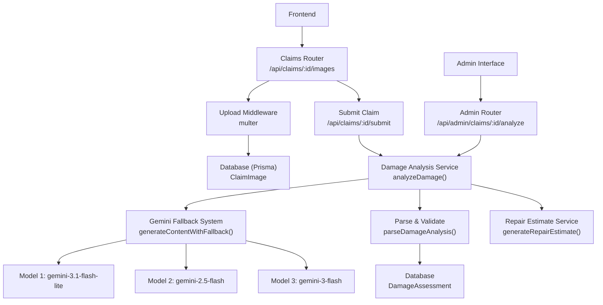
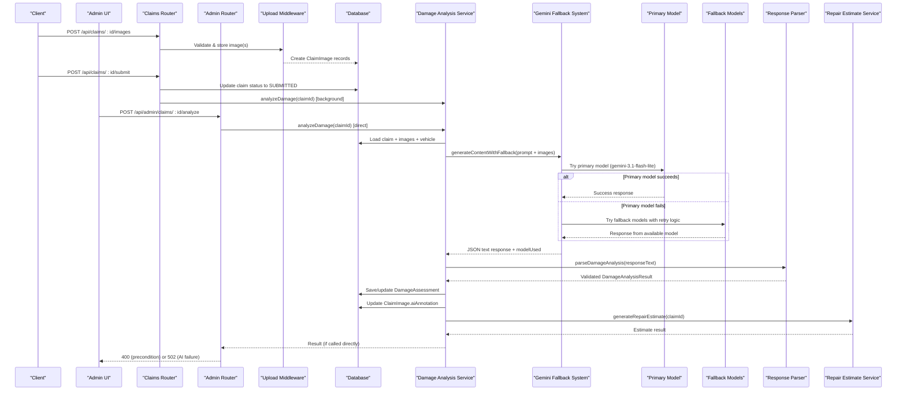
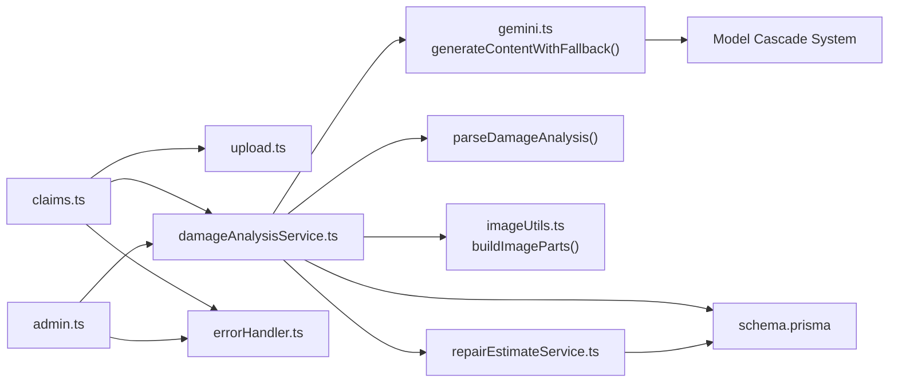

# Damage Analysis Service

<cite>
**Referenced Files in This Document**
- [damageAnalysisService.ts](file://backend/src/services/damageAnalysisService.ts)
- [gemini.ts](file://backend/src/utils/gemini.ts)
- [claims.ts](file://backend/src/routes/claims.ts)
- [admin.ts](file://backend/src/routes/admin.ts)
- [upload.ts](file://backend/src/middleware/upload.ts)
- [index.ts](file://backend/src/types/index.ts)
- [schema.prisma](file://backend/prisma/schema.prisma)
- [repairEstimateService.ts](file://backend/src/services/repairEstimateService.ts)
- [errorHandler.ts](file://backend/src/middleware/errorHandler.ts)
- [imageUtils.ts](file://backend/src/utils/imageUtils.ts)
- [AdminClaimDetailPage.tsx](file://frontend/src/pages/admin/AdminClaimDetailPage.tsx)
</cite>

## Update Summary
**Changes Made**
- Added admin-triggered re-analysis endpoint with proper error handling
- Implemented differentiated error mapping between precondition issues (400) and AI service failures (502)
- Enhanced admin interface with re-analysis capabilities and error feedback
- Updated architecture diagrams to reflect admin re-analysis workflow
- Extended troubleshooting guide to cover admin-specific scenarios

## Table of Contents
1. [Introduction](#introduction)
2. [Project Structure](#project-structure)
3. [Core Components](#core-components)
4. [Architecture Overview](#architecture-overview)
5. [Detailed Component Analysis](#detailed-component-analysis)
6. [Dependency Analysis](#dependency-analysis)
7. [Performance Considerations](#performance-considerations)
8. [Troubleshooting Guide](#troubleshooting-guide)
9. [Conclusion](#conclusion)
10. [Appendices](#appendices)

## Introduction
This document explains the AI-powered damage analysis service that processes vehicle images to detect and classify damage for insurance claims. The system has been completely modernized with structured JSON schema enforcement, explicit damage type definitions, standardized severity levels, and robust response validation. It covers the image upload workflow, Google Gemini API integration with automatic model switching, prompt engineering approach, response parsing into structured data models, confidence scoring considerations, fallback mechanisms when AI services are unavailable, error handling strategies, and guidance for customizing prompts and extending capabilities. **Updated** The system now includes admin-triggered re-analysis capabilities with proper error differentiation between precondition issues and AI service failures.

## Project Structure
The backend exposes claim-related endpoints, including image upload, AI-driven damage analysis, and admin re-analysis. The core flow is:
- Frontend uploads images via a protected endpoint.
- Images are stored on disk and recorded in the database.
- On claim submission or explicit analyze call, the system invokes the damage analysis service.
- **Updated** Admins can trigger re-analysis through a dedicated endpoint with proper error handling.
- The service reads images, calls Google Gemini with automatic model switching and fallback support, parses the JSON response using structured schemas, persists results, updates per-image annotations, and triggers repair estimate generation.

**Diagram sources**
- [claims.ts:298-336](file://backend/src/routes/claims.ts#L298-L336)
- [claims.ts:253-296](file://backend/src/routes/claims.ts#L253-L296)
- [admin.ts:548-570](file://backend/src/routes/admin.ts#L548-L570)
- [damageAnalysisService.ts:110-199](file://backend/src/services/damageAnalysisService.ts#L110-L199)
- [gemini.ts:91-142](file://backend/src/utils/gemini.ts#L91-L142)
- [repairEstimateService.ts:108-171](file://backend/src/services/repairEstimateService.ts#L108-L171)

**Section sources**
- [claims.ts:298-336](file://backend/src/routes/claims.ts#L298-L336)
- [claims.ts:253-296](file://backend/src/routes/claims.ts#L253-L296)
- [admin.ts:548-570](file://backend/src/routes/admin.ts#L548-L570)
- [damageAnalysisService.ts:110-199](file://backend/src/services/damageAnalysisService.ts#L110-L199)
- [gemini.ts:91-142](file://backend/src/utils/gemini.ts#L91-L142)
- [repairEstimateService.ts:108-171](file://backend/src/services/repairEstimateService.ts#L108-L171)

## Core Components
- Claims router: Handles image uploads, claim submission, and triggers analysis.
- **Updated** Admin router: Provides admin-only re-analysis endpoint with proper error handling.
- Upload middleware: Validates file types and sizes, stores files under /uploads/images or /uploads/documents.
- Damage analysis service: Orchestrates reading images, calling Gemini with automatic model switching, parsing results using structured schemas, persisting assessments, annotating images, and triggering estimates.
- Gemini utility: Provides robust model initialization with cascading fallback support and retry logic.
- Types: Defines structured interfaces for damage items and analysis results with strict typing.
- Repair estimate service: Converts damage items into cost estimates and optional payout calculations.
- Error handler: Centralized error handling with standardized responses.

**Section sources**
- [claims.ts:298-336](file://backend/src/routes/claims.ts#L298-L336)
- [admin.ts:548-570](file://backend/src/routes/admin.ts#L548-L570)
- [upload.ts:1-54](file://backend/src/middleware/upload.ts#L1-L54)
- [damageAnalysisService.ts:110-199](file://backend/src/services/damageAnalysisService.ts#L110-L199)
- [gemini.ts:91-142](file://backend/src/utils/gemini.ts#L91-L142)
- [index.ts:12-24](file://backend/src/types/index.ts#L12-L24)
- [repairEstimateService.ts:108-171](file://backend/src/services/repairEstimateService.ts#L108-L171)
- [errorHandler.ts:1-28](file://backend/src/middleware/errorHandler.ts#L1-L28)

## Architecture Overview
The end-to-end flow integrates frontend uploads, backend storage, AI vision analysis with automatic model switching, structured JSON schema validation, and downstream estimate generation. **Updated** Admin users can now trigger re-analysis with differentiated error handling.

**Diagram sources**
- [claims.ts:298-336](file://backend/src/routes/claims.ts#L298-L336)
- [claims.ts:253-296](file://backend/src/routes/claims.ts#L253-L296)
- [admin.ts:548-570](file://backend/src/routes/admin.ts#L548-L570)
- [damageAnalysisService.ts:110-199](file://backend/src/services/damageAnalysisService.ts#L110-L199)
- [gemini.ts:91-142](file://backend/src/utils/gemini.ts#L91-L142)
- [repairEstimateService.ts:108-171](file://backend/src/services/repairEstimateService.ts#L108-L171)

## Detailed Component Analysis

### Image Upload Workflow
- Endpoint: POST /api/claims/:id/images
- Uses multer with strict file type filtering (JPEG, PNG, WebP) and size limits.
- Stores files under /uploads/images with unique filenames and records them in the database with type FULL_VEHICLE or DAMAGE_CLOSEUP.
- Returns created image records.

Key behaviors:
- Validates claim ownership.
- Persists multiple images in parallel.
- Enforces allowed MIME types and size caps.

**Section sources**
- [claims.ts:298-336](file://backend/src/routes/claims.ts#L298-L336)
- [upload.ts:17-47](file://backend/src/middleware/upload.ts#L17-L47)

### Claim Submission and Background Analysis Trigger
- Endpoint: POST /api/claims/:id/submit
- Updates claim status to SUBMITTED only if at least one image exists.
- Invokes analyzeDamage asynchronously in the background so submission remains fast.

Error handling:
- If no images exist, returns a 400 error.
- Errors during background analysis are logged without blocking submission.

**Section sources**
- [claims.ts:253-296](file://backend/src/routes/claims.ts#L253-L296)

### Admin Re-Analysis Endpoint
**New Section** The admin re-analysis endpoint allows administrators to manually trigger damage analysis for any claim with proper error handling and differentiation.

Key features:
- **Endpoint**: POST /api/admin/claims/:id/analyze
- **Authentication**: Requires admin authentication
- **Error Differentiation**: 
  - 400 Bad Request: Precondition issues (e.g., missing images, invalid claim)
  - 502 Bad Gateway: AI service failures (temporary issues worth retrying)
- **User Experience**: Clear error messages for different failure types

Implementation details:
- Validates claim existence before processing
- Calls the same `analyzeDamage()` function as user-facing endpoints
- Implements intelligent error mapping based on error message content
- Provides actionable feedback for precondition errors vs. retryable AI failures

**Section sources**
- [admin.ts:548-570](file://backend/src/routes/admin.ts#L548-L570)

### Damage Analysis Service
Responsibilities:
- Loads claim, associated images, and vehicle context from the database.
- Reads each image file and encodes it as base64 with correct MIME type using optimized image processing.
- Builds a detailed prompt instructing Gemini to return a strict JSON schema describing damages, severity, location, affected parts, drivability assessment, and overall severity.
- Calls Gemini with automatic model switching using `generateContentWithFallback()`.
- Parses the response using structured schema validation through `parseDamageAnalysis()` function.
- Persists the assessment and raw AI response; updates per-image annotations based on image type.
- Triggers automatic repair estimate generation.

**Updated** The service now uses structured JSON schemas and explicit damage type definitions for reliable parsing and validation.

Prompt engineering highlights:
- Explicit enumeration of damage categories and closeup vs full vehicle instructions.
- Strict JSON-only output requirement with defined fields and enumerated values enforced by responseSchema.
- Severity guidelines to standardize MINOR/MODERATE/SEVERE classification.

Response parsing and validation:
- Uses `parseDamageAnalysis()` function for robust validation and normalization.
- Implements type normalization with `normalizeType()` for consistent damage categorization.
- Applies severity normalization with `normalizeSeverity()` for standardized severity levels.
- Includes comprehensive error handling for malformed responses.

Data persistence:
- Creates or updates DamageAssessment with validated damages, drivability assessment, overall severity, and raw AI response.
- Updates ClaimImage.aiAnnotation with relevant damage items filtered by image type.

Automatic estimate generation:
- Dynamically imports and calls repair estimate generation after analysis. Failures are logged but do not block analysis completion.

Confidence scoring:
- No explicit confidence score is returned by the current implementation. The overallSeverity field serves as a coarse indicator. To add confidence, extend the prompt to include a numeric confidence per damage item and update the types and parsing logic accordingly.

**Section sources**
- [damageAnalysisService.ts:6-48](file://backend/src/services/damageAnalysisService.ts#L6-L48)
- [damageAnalysisService.ts:80-108](file://backend/src/services/damageAnalysisService.ts#L80-L108)
- [damageAnalysisService.ts:110-199](file://backend/src/services/damageAnalysisService.ts#L110-L199)

### Google Gemini Integration with Automatic Model Switching
**Updated** The Gemini integration now uses a sophisticated fallback system that automatically switches between multiple models to ensure reliability during image processing.

Key features:
- **Model Cascade**: Tries models in order of preference: gemini-3.1-flash-lite (primary), gemini-3.5-flash-lite, gemini-3.5-flash, gemini-3.6-flash, gemini-2.5-flash-lite, gemini-2.5-flash
- **Automatic Retry Logic**: Retries failed requests once per model with exponential backoff
- **Retryable Error Detection**: Identifies rate limiting (429), service unavailability (503), server errors (500), and quota issues
- **Fallback Logging**: Tracks which model was actually used for debugging and monitoring
- **Graceful Degradation**: Continues trying other models if the primary fails

Configuration notes:
- Ensure GEMINI_API_KEY is set in the environment.
- Model selection is managed automatically through the cascade system.
- The system logs which model was used for each request.

Reliability improvements:
- Handles resource-intensive image processing tasks more gracefully
- Reduces single points of failure in AI service availability
- Provides better performance optimization by starting with high-rate-limit models
- Maintains service continuity during API throttling or outages

**Section sources**
- [gemini.ts:6-32](file://backend/src/utils/gemini.ts#L6-L32)
- [gemini.ts:91-142](file://backend/src/utils/gemini.ts#L91-L142)

### Data Models and Schema
**Updated** The data models now include explicit damage type definitions and standardized severity levels.

Key components:
- **DamageItem Interface**: Defines structured damage information with type, severity, location, description, and optional affected parts
- **DamageAnalysisResult Interface**: Contains array of damages, drivability assessment, and overall severity
- **Structured JSON Schema**: Enforces exact response format with enum constraints for damage types and severity levels
- **Prisma Schema**: Defines entities for Claim, ClaimImage, DamageAssessment, RepairEstimate, InsurancePolicy, Vehicle, and related relationships

**Updated** The system now uses centralized constants for damage types and severity levels:
- `DAMAGE_TYPES`: Array of predefined damage categories (dent, scratch, crack, broken_light, bumper_damage, glass_damage, panel_deformation, wheel_damage, structural_damage, other)
- `SEVERITIES`: Standardized severity levels (MINOR, MODERATE, SEVERE)
- `DAMAGE_SCHEMA`: JSON schema enforcing response structure with enum validation

Key relationships:
- Claim has many ClaimImages and one DamageAssessment.
- DamageAssessment links to RepairEstimate.
- RepairEstimate includes itemized costs and totals.

**Section sources**
- [index.ts:12-24](file://backend/src/types/index.ts#L12-L24)
- [damageAnalysisService.ts:6-12](file://backend/src/services/damageAnalysisService.ts#L6-L12)
- [damageAnalysisService.ts:17-37](file://backend/src/services/damageAnalysisService.ts#L17-L37)
- [schema.prisma:145-162](file://backend/prisma/schema.prisma#L145-L162)

### Repair Estimate Generation
- Converts AI-detected damages into line-item estimates using predefined cost ranges and labor rates.
- Calculates total parts, labor, paint materials, and estimated days.
- Optionally computes insurance payout based on policy deductible.

Integration point:
- Called automatically after successful damage analysis; also exposed via a dedicated endpoint.

**Section sources**
- [repairEstimateService.ts:5-107](file://backend/src/services/repairEstimateService.ts#L5-L107)
- [repairEstimateService.ts:108-171](file://backend/src/services/repairEstimateService.ts#L108-L171)

### Error Handling Strategy
**Updated** Enhanced error handling now includes comprehensive fallback mechanisms for AI service failures, robust response validation, and differentiated error responses for admin operations.

Key improvements:
- **Automatic Model Switching**: When the primary Gemini model fails, the system automatically tries alternative models
- **Retry Logic**: Implements exponential backoff for transient errors like rate limiting and temporary unavailability
- **Comprehensive Error Detection**: Identifies various error types including HTTP status codes, rate limits, and service-specific messages
- **Graceful Degradation**: Ensures the system continues functioning even when AI services are partially unavailable
- **Enhanced Logging**: Provides detailed information about which models were attempted and why they failed
- **Structured Response Validation**: Robust parsing with `parseDamageAnalysis()` ensures data integrity
- **Updated** **Admin Error Differentiation**: Properly maps precondition issues to 400 status codes and AI service failures to 502 status codes

Operational guidance:
- Use AppError for known failure cases with specific status codes.
- Log unexpected errors for debugging and monitoring.
- Monitor fallback usage patterns to optimize model selection.
- Track parse validation failures for response quality monitoring.
- **Updated** For admin operations, distinguish between actionable precondition errors (400) and retryable AI failures (502).

**Section sources**
- [errorHandler.ts:1-28](file://backend/src/middleware/errorHandler.ts#L1-L28)
- [claims.ts:374-399](file://backend/src/routes/claims.ts#L374-L399)
- [admin.ts:548-570](file://backend/src/routes/admin.ts#L548-L570)
- [gemini.ts:64-80](file://backend/src/utils/gemini.ts#L64-L80)
- [damageAnalysisService.ts:80-108](file://backend/src/services/damageAnalysisService.ts#L80-L108)

## Dependency Analysis
High-level dependencies between modules:

**Diagram sources**
- [claims.ts:298-336](file://backend/src/routes/claims.ts#L298-L336)
- [admin.ts:548-570](file://backend/src/routes/admin.ts#L548-L570)
- [damageAnalysisService.ts:110-199](file://backend/src/services/damageAnalysisService.ts#L110-L199)
- [gemini.ts:91-142](file://backend/src/utils/gemini.ts#L91-L142)
- [repairEstimateService.ts:108-171](file://backend/src/services/repairEstimateService.ts#L108-L171)
- [errorHandler.ts:1-28](file://backend/src/middleware/errorHandler.ts#L1-L28)

**Section sources**
- [claims.ts:298-336](file://backend/src/routes/claims.ts#L298-L336)
- [admin.ts:548-570](file://backend/src/routes/admin.ts#L548-L570)
- [damageAnalysisService.ts:110-199](file://backend/src/services/damageAnalysisService.ts#L110-L199)
- [gemini.ts:91-142](file://backend/src/utils/gemini.ts#L91-L142)
- [repairEstimateService.ts:108-171](file://backend/src/services/repairEstimateService.ts#L108-L171)
- [errorHandler.ts:1-28](file://backend/src/middleware/errorHandler.ts#L1-L28)

## Performance Considerations
**Updated** Performance considerations now include the impact of automatic model switching, structured schema validation, and admin re-analysis operations.

Key optimizations:
- **Asynchronous Background Analysis**: Background analysis on claim submission avoids blocking user requests.
- **Intelligent Model Selection**: Starts with high-rate-limit models (gemini-3.1-flash-lite) for optimal performance.
- **Efficient Retry Logic**: Exponential backoff prevents overwhelming APIs during transient failures.
- **Resource Management**: Image I/O uses sharp for efficient resizing and compression; considers streaming or async I/O for large batches to reduce latency.
- **Payload Optimization**: Base64 encoding of images increases payload size; ensure adequate timeouts and memory settings.
- **Cost Control**: Prompt length and number of images affect Gemini API latency and cost; limit concurrent analyses or queue them.
- **Fallback Efficiency**: Repair estimate calculation is CPU-bound but lightweight; batch processing can be considered for bulk re-estimates.
- **Schema Validation**: Structured JSON schema reduces parsing overhead and improves response consistency.
- **Updated** **Admin Re-analysis Caching**: Consider implementing caching for frequently accessed claim data to reduce database load during admin re-analysis operations.

Monitoring recommendations:
- Track which models are being used most frequently
- Monitor fallback trigger frequency to identify problematic models
- Log response times per model to optimize selection strategy
- Monitor parse validation success rates for response quality
- **Updated** Monitor admin re-analysis frequency and success rates to identify potential abuse or system issues.

[No sources needed since this section provides general guidance]

## Troubleshooting Guide
**Updated** Troubleshooting guide now includes guidance for diagnosing model switching, fallback issues, response validation problems, and admin-specific scenarios.

Common issues and resolutions:
- Missing images before submission: Ensure at least one image is uploaded; the submit endpoint validates this.
- Invalid file types or oversized files: Only JPEG, PNG, and WebP are accepted with a 10MB limit. Adjust upload middleware if you need different constraints.
- **AI Parsing Failures**: If Gemini returns non-JSON or malformed content, the `parseDamageAnalysis()` function throws an error. Check logs for "AI response did not contain a JSON object" messages.
- **Model Switching Issues**: Check logs for "[gemini] Request served by fallback model:" messages to understand which models are being used. Monitor for repeated fallbacks that may indicate primary model problems.
- **Rate Limiting**: The system automatically handles rate limiting with retries and model switching. Monitor for frequent fallback triggers.
- **Unavailable AI Service**: If all models fail, the system throws an error. Check API key configuration and network connectivity.
- **Database errors**: Verify Prisma client configuration and database connectivity; check error logs for constraint violations.
- **Response Validation Failures**: If structured schema validation fails, check the damage types and severity levels being returned by the AI model.
- **Updated** **Admin Re-analysis Issues**: 
  - 400 errors indicate precondition problems (missing images, invalid claim) - fix the underlying data issue
  - 502 errors indicate AI service failures - retry the operation as it's likely temporary
  - Check admin logs for detailed error messages and stack traces

Operational checks:
- Confirm GEMINI_API_KEY is set.
- Verify uploads directory exists and is writable.
- Monitor logs for background analysis failures and repair estimate generation errors.
- **Updated** Monitor fallback usage: Look for patterns in model switching that might indicate capacity issues or regional problems.
- **Updated** Check parse validation: Monitor for parse failures that might indicate AI model behavior changes.
- **Updated** Admin monitoring: Track admin re-analysis attempts and their outcomes to identify systemic issues.

**Section sources**
- [claims.ts:253-296](file://backend/src/routes/claims.ts#L253-L296)
- [admin.ts:548-570](file://backend/src/routes/admin.ts#L548-L570)
- [upload.ts:30-47](file://backend/src/middleware/upload.ts#L30-L47)
- [damageAnalysisService.ts:80-108](file://backend/src/services/damageAnalysisService.ts#L80-L108)
- [errorHandler.ts:13-27](file://backend/src/middleware/errorHandler.ts#L13-L27)
- [gemini.ts:117-142](file://backend/src/utils/gemini.ts#L117-L142)

## Conclusion
The damage analysis service integrates image uploads, Google Gemini visual analysis with automatic model switching, structured JSON schema validation, and automated repair estimates into a cohesive claims workflow. The recent complete modernization with structured JSON schemas, explicit damage type definitions, standardized severity levels, and robust response validation through the `parseDamageAnalysis()` function significantly improves reliability and data consistency. **Updated** The system now includes admin-triggered re-analysis capabilities with proper error differentiation between precondition issues (400) and AI service failures (502), providing administrators with clear feedback and actionable error handling. The system enforces structured outputs through both prompt engineering and schema validation, persists results for auditability, and includes robust fallbacks and error handling. Extending the system to include confidence scores, additional image modalities, or alternative models can be achieved by updating the prompt, types, and parsing logic while preserving the established architecture.

[No sources needed since this section summarizes without analyzing specific files]

## Appendices

### API Endpoints Summary
- POST /api/claims/:id/images: Upload up to 10 images per request; specify imageType as FULL_VEHICLE or DAMAGE_CLOSEUP.
- POST /api/claims/:id/submit: Submit claim; triggers background damage analysis.
- POST /api/claims/:id/analyze: Manually trigger damage analysis and return results.
- POST /api/claims/:id/estimate: Generate repair estimate based on existing damage assessment.
- **Updated** POST /api/admin/claims/:id/analyze: Admin-only endpoint to trigger damage analysis with proper error handling (400 for precondition issues, 502 for AI failures).

**Section sources**
- [claims.ts:298-336](file://backend/src/routes/claims.ts#L298-L336)
- [claims.ts:253-296](file://backend/src/routes/claims.ts#L253-L296)
- [claims.ts:374-399](file://backend/src/routes/claims.ts#L374-L399)
- [admin.ts:548-570](file://backend/src/routes/admin.ts#L548-L570)

### Customizing Damage Detection Prompts
To customize detection behavior:
- Modify the prompt string in the damage analysis service to emphasize specific damage types, regions, or reporting formats.
- Add new fields to the DamageItem interface and update parsing logic to extract them from Gemini's response.
- Adjust severity guidelines to align with organizational policies.
- Extend the `DAMAGE_TYPES` constant to include new damage categories.

Example extension ideas:
- Include confidence scores per damage item.
- Add recommended actions or urgency flags.
- Support multi-language outputs or region-specific part names.

**Section sources**
- [damageAnalysisService.ts:6-48](file://backend/src/services/damageAnalysisService.ts#L6-L48)
- [index.ts:12-24](file://backend/src/types/index.ts#L12-L24)

### Integrating Additional Image Analysis Capabilities
Options:
- Chain additional models or detectors after Gemini to refine classifications or extract metadata.
- Integrate OCR for license plates or VIN extraction from images.
- Add object detection to localize damage bounding boxes and annotate images visually.

Implementation tips:
- Keep modular services for each capability.
- Store intermediate results in the database for traceability.
- Maintain consistent error handling and fallbacks across integrations.

[No sources needed since this section provides general guidance]

### Model Cascade Configuration
**New Section** The system uses a sophisticated model cascade to ensure reliable AI service access:

**Primary Model**: gemini-3.1-flash-lite (15 RPM, 500 RPD - highest limits)
**Fallback Models**: 
- gemini-3.5-flash-lite
- gemini-3.5-flash (with thinkingBudget disabled for speed)
- gemini-3.6-flash
- gemini-2.5-flash-lite
- gemini-2.5-flash

**Retry Behavior**: Each model gets one retry attempt with exponential backoff before moving to the next model.

**Error Detection**: The system identifies retryable errors including rate limiting (429), service unavailability (503), server errors (500), and quota issues.

**Monitoring**: Logs indicate which model was used for each request, helping identify capacity and performance patterns.

**Section sources**
- [gemini.ts:6-32](file://backend/src/utils/gemini.ts#L6-L32)
- [gemini.ts:91-142](file://backend/src/utils/gemini.ts#L91-L142)

### Structured JSON Schema Details
**New Section** The system enforces strict response formats through JSON schemas:

**Damage Types**: dent, scratch, crack, broken_light, bumper_damage, glass_damage, panel_deformation, wheel_damage, structural_damage, other

**Severity Levels**: MINOR, MODERATE, SEVERE

**Schema Properties**:
- damages: Array of damage objects with type, severity, location, and description
- drivabilityAssessment: String describing vehicle drivability
- overallSeverity: Overall severity level for the entire claim

**Validation Features**:
- Enum validation for damage types and severity levels
- Required field validation
- Type normalization for consistent formatting
- Default value assignment for missing fields

**Section sources**
- [damageAnalysisService.ts:6-12](file://backend/src/services/damageAnalysisService.ts#L6-L12)
- [damageAnalysisService.ts:17-37](file://backend/src/services/damageAnalysisService.ts#L17-L37)
- [damageAnalysisService.ts:53-64](file://backend/src/services/damageAnalysisService.ts#L53-L64)

### Admin Re-Analysis Implementation Details
**New Section** The admin re-analysis feature provides administrators with manual control over damage analysis processing.

**Key Features**:
- **Authentication**: Protected by admin authentication middleware
- **Error Differentiation**: 
  - 400 status: Precondition issues (missing images, invalid claim ID)
  - 502 status: AI service failures (temporary issues worth retrying)
- **User Feedback**: Clear error messages help admins understand what went wrong
- **Integration**: Uses the same `analyzeDamage()` function as user-facing endpoints

**Frontend Integration**:
- Admin claim detail page includes "Re-analyze Damage" button
- Loading states and error handling for smooth user experience
- Automatic refresh of claim data after successful re-analysis

**Error Handling Strategy**:
- Checks error messages for "images" keyword to identify precondition issues
- Maps all other errors to 502 status for retryable AI failures
- Provides actionable feedback to admins based on error type

**Section sources**
- [admin.ts:548-570](file://backend/src/routes/admin.ts#L548-L570)
- [AdminClaimDetailPage.tsx:105-114](file://frontend/src/pages/admin/AdminClaimDetailPage.tsx#L105-L114)
- [AdminClaimDetailPage.tsx:190-236](file://frontend/src/pages/admin/AdminClaimDetailPage.tsx#L190-L236)