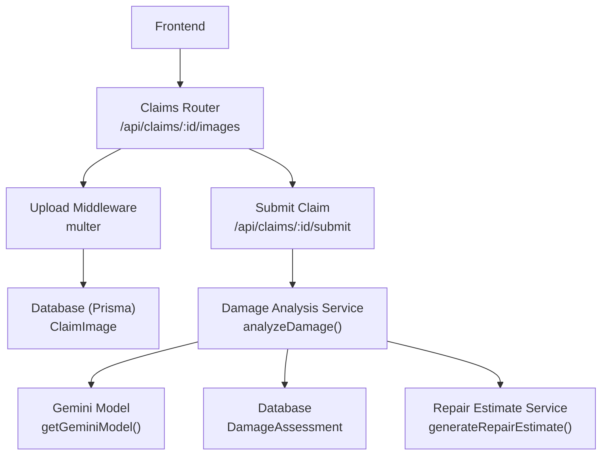
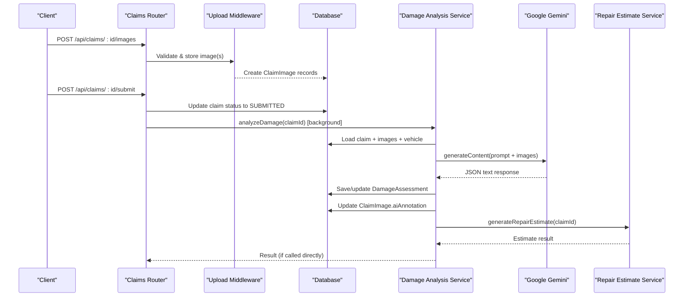
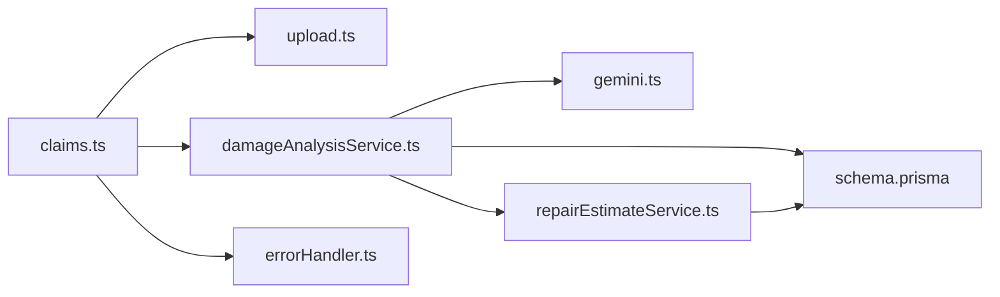

# Damage Analysis Service

<cite>
**Referenced Files in This Document**
- [damageAnalysisService.ts](file://backend/src/services/damageAnalysisService.ts)
- [gemini.ts](file://backend/src/utils/gemini.ts)
- [claims.ts](file://backend/src/routes/claims.ts)
- [upload.ts](file://backend/src/middleware/upload.ts)
- [index.ts](file://backend/src/types/index.ts)
- [schema.prisma](file://backend/prisma/schema.prisma)
- [repairEstimateService.ts](file://backend/src/services/repairEstimateService.ts)
- [errorHandler.ts](file://backend/src/middleware/errorHandler.ts)
</cite>

## Table of Contents
1. [Introduction](#introduction)
2. [Project Structure](#project-structure)
3. [Core Components](#core-components)
4. [Architecture Overview](#architecture-overview)
5. [Detailed Component Analysis](#detailed-component-analysis)
6. [Dependency Analysis](#dependency-analysis)
7. [Performance Considerations](#performance-considerations)
8. [Troubleshooting Guide](#troubleshooting-guide)
9. [Conclusion](#conclusion)
10. [Appendices](#appendices)

## Introduction
This document explains the AI-powered damage analysis service that processes vehicle images to detect and classify damage for insurance claims. It covers the image upload workflow, Google Gemini API integration for visual analysis, prompt engineering approach, response parsing into structured data models, confidence scoring considerations, fallback mechanisms when AI services are unavailable, error handling strategies, and guidance for customizing prompts and extending capabilities.

## Project Structure
The backend exposes claim-related endpoints, including image upload and AI-driven damage analysis. The core flow is:
- Frontend uploads images via a protected endpoint.
- Images are stored on disk and recorded in the database.
- On claim submission or explicit analyze call, the system invokes the damage analysis service.
- The service reads images, calls Google Gemini with a structured prompt, parses the JSON response, persists results, updates per-image annotations, and triggers repair estimate generation.

**Diagram sources**
- [claims.ts:195-233](file://backend/src/routes/claims.ts#L195-L233)
- [claims.ts:152-193](file://backend/src/routes/claims.ts#L152-L193)
- [damageAnalysisService.ts:50-153](file://backend/src/services/damageAnalysisService.ts#L50-L153)
- [gemini.ts:6-9](file://backend/src/utils/gemini.ts#L6-L9)
- [repairEstimateService.ts:104-199](file://backend/src/services/repairEstimateService.ts#L104-L199)

**Section sources**
- [claims.ts:195-233](file://backend/src/routes/claims.ts#L195-L233)
- [claims.ts:152-193](file://backend/src/routes/claims.ts#L152-L193)
- [damageAnalysisService.ts:50-153](file://backend/src/services/damageAnalysisService.ts#L50-L153)
- [gemini.ts:6-9](file://backend/src/utils/gemini.ts#L6-L9)
- [repairEstimateService.ts:104-199](file://backend/src/services/repairEstimateService.ts#L104-L199)

## Core Components
- Claims router: Handles image uploads, claim submission, and triggers analysis.
- Upload middleware: Validates file types and sizes, stores files under /uploads/images or /uploads/documents.
- Damage analysis service: Orchestrates reading images, calling Gemini, parsing results, persisting assessments, annotating images, and triggering estimates.
- Gemini utility: Initializes the Google Generative AI model using an environment key.
- Types: Defines structured interfaces for damage items and analysis results.
- Repair estimate service: Converts damage items into cost estimates and optional payout calculations.
- Error handler: Centralized error handling with standardized responses.

**Section sources**
- [claims.ts:195-233](file://backend/src/routes/claims.ts#L195-L233)
- [upload.ts:1-54](file://backend/src/middleware/upload.ts#L1-L54)
- [damageAnalysisService.ts:50-153](file://backend/src/services/damageAnalysisService.ts#L50-L153)
- [gemini.ts:1-12](file://backend/src/utils/gemini.ts#L1-L12)
- [index.ts:12-24](file://backend/src/types/index.ts#L12-L24)
- [repairEstimateService.ts:104-199](file://backend/src/services/repairEstimateService.ts#L104-L199)
- [errorHandler.ts:1-28](file://backend/src/middleware/errorHandler.ts#L1-L28)

## Architecture Overview
The end-to-end flow integrates frontend uploads, backend storage, AI vision analysis, and downstream estimate generation.

**Diagram sources**
- [claims.ts:195-233](file://backend/src/routes/claims.ts#L195-L233)
- [claims.ts:152-193](file://backend/src/routes/claims.ts#L152-L193)
- [damageAnalysisService.ts:50-153](file://backend/src/services/damageAnalysisService.ts#L50-L153)
- [repairEstimateService.ts:104-199](file://backend/src/services/repairEstimateService.ts#L104-L199)

## Detailed Component Analysis

### Image Upload Workflow
- Endpoint: POST /api/claims/:id/images
- Uses multer with strict file type filtering (JPEG, PNG, WebP) and size limits.
- Stores files under /uploads/images with unique filenames and records them in the database with type FULL_VEHICLE or DAMAGE_CLOSEUP.
- Returns created image records.

Key behaviors:
- Validates claim ownership.
- Persists multiple images in parallel.
- Enforces allowed MIME types and size caps.

**Section sources**
- [claims.ts:195-233](file://backend/src/routes/claims.ts#L195-L233)
- [upload.ts:17-47](file://backend/src/middleware/upload.ts#L17-L47)

### Claim Submission and Background Analysis Trigger
- Endpoint: POST /api/claims/:id/submit
- Updates claim status to SUBMITTED only if at least one image exists.
- Invokes analyzeDamage asynchronously in the background so submission remains fast.

Error handling:
- If no images exist, returns a 400 error.
- Errors during background analysis are logged without blocking submission.

**Section sources**
- [claims.ts:152-193](file://backend/src/routes/claims.ts#L152-L193)

### Damage Analysis Service
Responsibilities:
- Loads claim, associated images, and vehicle context from the database.
- Reads each image file and encodes it as base64 with correct MIME type.
- Builds a detailed prompt instructing Gemini to return a strict JSON schema describing damages, severity, location, affected parts, drivability assessment, and overall severity.
- Calls Gemini with the prompt and image parts.
- Parses the response, extracting JSON even if wrapped in markdown code blocks.
- Persists the assessment and raw AI response; updates per-image annotations based on image type.
- Triggers automatic repair estimate generation.

Prompt engineering highlights:
- Explicit enumeration of damage categories and closeup vs full vehicle instructions.
- Strict JSON-only output requirement with defined fields and enumerated values.
- Severity guidelines to standardize MINOR/MODERATE/SEVERE classification.

Response parsing and fallbacks:
- Attempts to parse JSON; if parsing fails, logs the raw response and returns a safe fallback assessment indicating manual review is required.

Data persistence:
- Creates or updates DamageAssessment with damages, drivability assessment, overall severity, and raw AI response.
- Updates ClaimImage.aiAnnotation with relevant damage items filtered by image type.

Automatic estimate generation:
- Dynamically imports and calls repair estimate generation after analysis. Failures are logged but do not block analysis completion.

Confidence scoring:
- No explicit confidence score is returned by the current implementation. The overallSeverity field serves as a coarse indicator. To add confidence, extend the prompt to include a numeric confidence per damage item and update the types and parsing logic accordingly.

**Section sources**
- [damageAnalysisService.ts:7-48](file://backend/src/services/damageAnalysisService.ts#L7-L48)
- [damageAnalysisService.ts:50-153](file://backend/src/services/damageAnalysisService.ts#L50-L153)

### Google Gemini Integration
- Model initialization uses an environment variable for the API key and defaults to a specific model name.
- The service passes both text prompt and inline image data to the model.

Configuration notes:
- Ensure GEMINI_API_KEY is set in the environment.
- Model selection can be adjusted via the utility function parameter.

**Section sources**
- [gemini.ts:1-12](file://backend/src/utils/gemini.ts#L1-L12)

### Data Models and Schema
- DamageItem and DamageAnalysisResult define the expected structure of AI outputs.
- Prisma schema defines entities for Claim, ClaimImage, DamageAssessment, RepairEstimate, InsurancePolicy, Vehicle, and related relationships.
- Enums constrain image types and severity levels.

Key relationships:
- Claim has many ClaimImages and one DamageAssessment.
- DamageAssessment links to RepairEstimate.
- RepairEstimate includes itemized costs and totals.

**Section sources**
- [index.ts:12-24](file://backend/src/types/index.ts#L12-L24)
- [schema.prisma:71-146](file://backend/prisma/schema.prisma#L71-L146)

### Repair Estimate Generation
- Converts AI-detected damages into line-item estimates using predefined cost ranges and labor rates.
- Calculates total parts, labor, paint materials, and estimated days.
- Optionally computes insurance payout based on policy deductible.

Integration point:
- Called automatically after successful damage analysis; also exposed via a dedicated endpoint.

**Section sources**
- [repairEstimateService.ts:5-102](file://backend/src/services/repairEstimateService.ts#L5-L102)
- [repairEstimateService.ts:104-199](file://backend/src/services/repairEstimateService.ts#L104-L199)

### Error Handling Strategy
- Centralized error handler distinguishes application errors and returns consistent JSON responses.
- Route handlers wrap operations in try/catch and return appropriate HTTP status codes.
- Background tasks log errors without failing the caller’s request.

Operational guidance:
- Use AppError for known failure cases with specific status codes.
- Log unexpected errors for debugging and monitoring.

**Section sources**
- [errorHandler.ts:1-28](file://backend/src/middleware/errorHandler.ts#L1-L28)
- [claims.ts:270-288](file://backend/src/routes/claims.ts#L270-L288)

## Dependency Analysis
High-level dependencies between modules:

**Diagram sources**
- [claims.ts:195-233](file://backend/src/routes/claims.ts#L195-L233)
- [damageAnalysisService.ts:50-153](file://backend/src/services/damageAnalysisService.ts#L50-L153)
- [gemini.ts:6-9](file://backend/src/utils/gemini.ts#L6-L9)
- [repairEstimateService.ts:104-199](file://backend/src/services/repairEstimateService.ts#L104-L199)
- [errorHandler.ts:1-28](file://backend/src/middleware/errorHandler.ts#L1-L28)

**Section sources**
- [claims.ts:195-233](file://backend/src/routes/claims.ts#L195-L233)
- [damageAnalysisService.ts:50-153](file://backend/src/services/damageAnalysisService.ts#L50-L153)
- [gemini.ts:6-9](file://backend/src/utils/gemini.ts#L6-L9)
- [repairEstimateService.ts:104-199](file://backend/src/services/repairEstimateService.ts#L104-L199)
- [errorHandler.ts:1-28](file://backend/src/middleware/errorHandler.ts#L1-L28)

## Performance Considerations
- Asynchronous background analysis on claim submission avoids blocking user requests.
- Image I/O reads files synchronously; consider streaming or async I/O for large batches to reduce latency.
- Base64 encoding of images increases payload size; ensure adequate timeouts and memory settings.
- Prompt length and number of images affect Gemini API latency and cost; limit concurrent analyses or queue them.
- Repair estimate calculation is CPU-bound but lightweight; batch processing can be considered for bulk re-estimates.

[No sources needed since this section provides general guidance]

## Troubleshooting Guide
Common issues and resolutions:
- Missing images before submission: Ensure at least one image is uploaded; the submit endpoint validates this.
- Invalid file types or oversized files: Only JPEG, PNG, and WebP are accepted with a 10MB limit. Adjust upload middleware if you need different constraints.
- AI parsing failures: If Gemini returns non-JSON or malformed content, the service falls back to a safe assessment and logs the raw response for inspection.
- Unavailable AI service: If the API key is missing or the model fails, the fallback ensures the system remains usable while flagging manual review.
- Database errors: Verify Prisma client configuration and database connectivity; check error logs for constraint violations.

Operational checks:
- Confirm GEMINI_API_KEY is set.
- Verify uploads directory exists and is writable.
- Monitor logs for background analysis failures and repair estimate generation errors.

**Section sources**
- [claims.ts:152-193](file://backend/src/routes/claims.ts#L152-L193)
- [upload.ts:30-47](file://backend/src/middleware/upload.ts#L30-L47)
- [damageAnalysisService.ts:85-103](file://backend/src/services/damageAnalysisService.ts#L85-L103)
- [errorHandler.ts:13-27](file://backend/src/middleware/errorHandler.ts#L13-L27)

## Conclusion
The damage analysis service integrates image uploads, Google Gemini visual analysis, and automated repair estimates into a cohesive claims workflow. It enforces structured outputs through prompt engineering, persists results for auditability, and includes robust fallbacks and error handling. Extending the system to include confidence scores, additional image modalities, or alternative models can be achieved by updating the prompt, types, and parsing logic while preserving the established architecture.

[No sources needed since this section summarizes without analyzing specific files]

## Appendices

### API Endpoints Summary
- POST /api/claims/:id/images: Upload up to 10 images per request; specify imageType as FULL_VEHICLE or DAMAGE_CLOSEUP.
- POST /api/claims/:id/submit: Submit claim; triggers background damage analysis.
- POST /api/claims/:id/analyze: Manually trigger damage analysis and return results.
- POST /api/claims/:id/estimate: Generate repair estimate based on existing damage assessment.

**Section sources**
- [claims.ts:195-233](file://backend/src/routes/claims.ts#L195-L233)
- [claims.ts:152-193](file://backend/src/routes/claims.ts#L152-L193)
- [claims.ts:270-314](file://backend/src/routes/claims.ts#L270-L314)

### Customizing Damage Detection Prompts
To customize detection behavior:
- Modify the prompt string in the damage analysis service to emphasize specific damage types, regions, or reporting formats.
- Add new fields to the DamageItem interface and update parsing logic to extract them from Gemini’s response.
- Adjust severity guidelines to align with organizational policies.

Example extension ideas:
- Include confidence scores per damage item.
- Add recommended actions or urgency flags.
- Support multi-language outputs or region-specific part names.

**Section sources**
- [damageAnalysisService.ts:7-48](file://backend/src/services/damageAnalysisService.ts#L7-L48)
- [index.ts:12-24](file://backend/src/types/index.ts#L12-L24)

### Integrating Additional Image Analysis Capabilities
Options:
- Chain additional models or detectors after Gemini to refine classifications or extract metadata.
- Integrate OCR for license plates or VIN extraction from images.
- Add object detection to localize damage bounding boxes and annotate images visually.

Implementation tips:
- Keep modular services for each capability.
- Store intermediate results in the database for traceability.
- Maintain consistent error handling and fallbacks across integrations.

[No sources needed since this section provides general guidance]