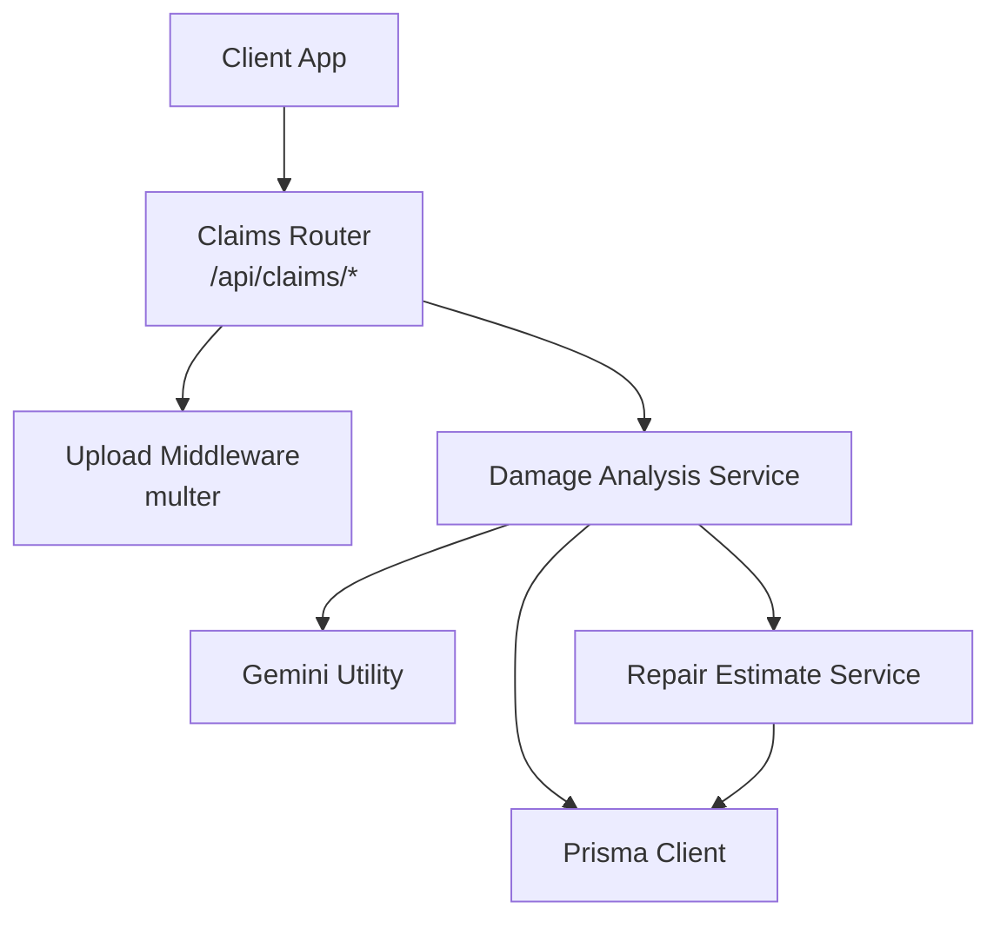
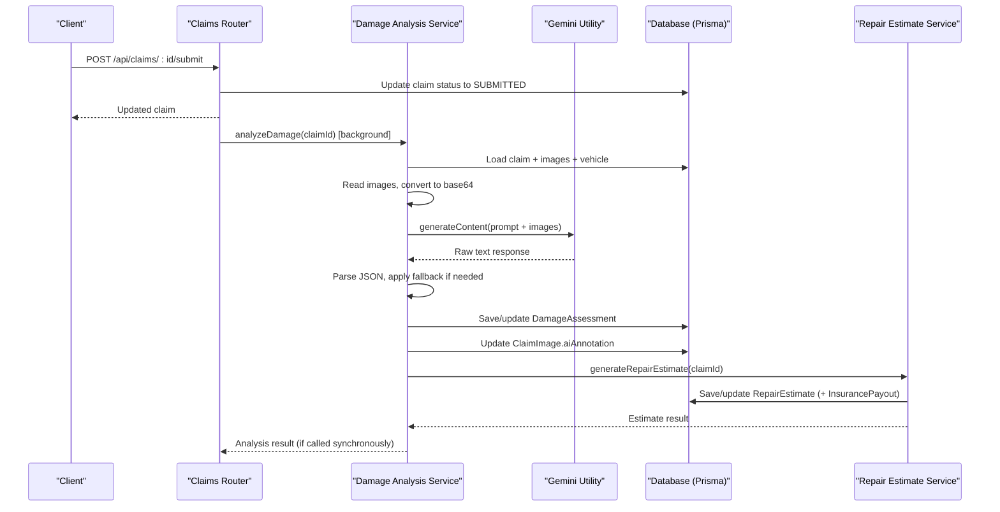
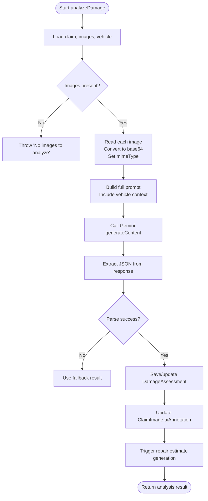
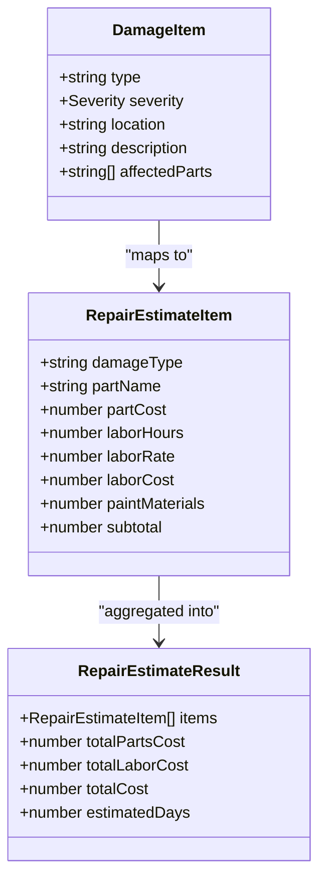
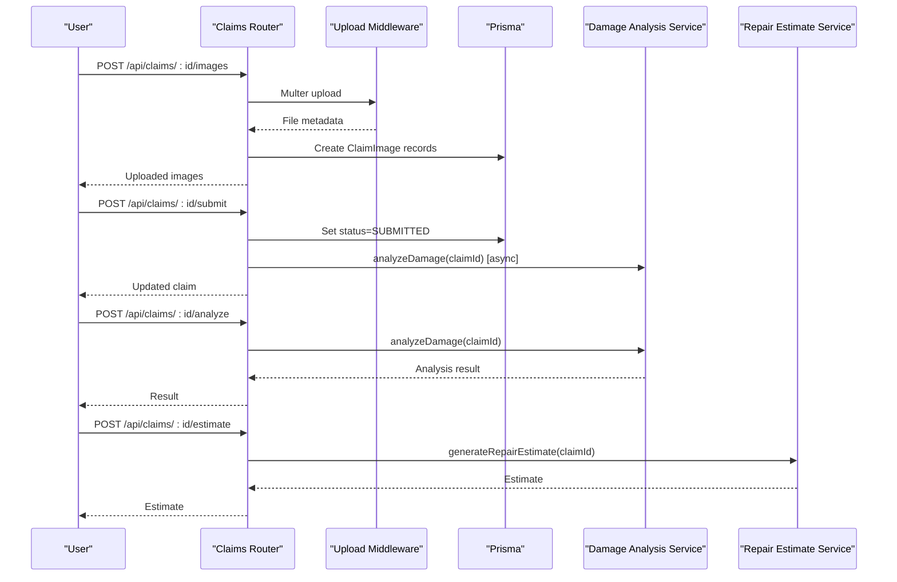
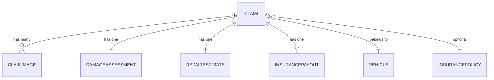
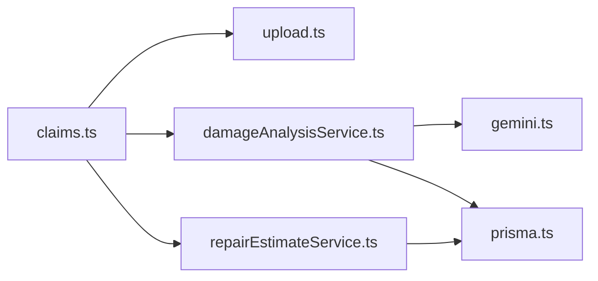

# Damage Assessment Service

<cite>
**Referenced Files in This Document**
- [damageAnalysisService.ts](file://backend/src/services/damageAnalysisService.ts)
- [gemini.ts](file://backend/src/utils/gemini.ts)
- [repairEstimateService.ts](file://backend/src/services/repairEstimateService.ts)
- [index.ts (types)](file://backend/src/types/index.ts)
- [claims.ts](file://backend/src/routes/claims.ts)
- [upload.ts](file://backend/src/middleware/upload.ts)
- [schema.prisma](file://backend/prisma/schema.prisma)
</cite>

## Table of Contents
1. [Introduction](#introduction)
2. [Project Structure](#project-structure)
3. [Core Components](#core-components)
4. [Architecture Overview](#architecture-overview)
5. [Detailed Component Analysis](#detailed-component-analysis)
6. [Dependency Analysis](#dependency-analysis)
7. [Performance Considerations](#performance-considerations)
8. [Troubleshooting Guide](#troubleshooting-guide)
9. [Conclusion](#conclusion)

## Introduction
This document explains the Damage Assessment Service that analyzes vehicle images using Google Gemini AI to detect damage, classify severity, assess drivability, and integrate with a repair estimate service. It covers the image processing pipeline (reading files, converting to base64), the AI prompt structure, response parsing, error handling with fallbacks, and how results are persisted and used downstream.

## Project Structure
The Damage Assessment Service is implemented in the backend as a set of services and utilities integrated via routes:
- Routes expose endpoints to upload images, submit claims, trigger analysis, and generate estimates.
- The damage analysis service orchestrates reading images, calling Gemini, parsing responses, persisting results, and invoking repair estimates.
- A utility module configures the Gemini client.
- Types define shared interfaces for damages, assessments, and estimates.
- Prisma schema defines data models for claims, images, assessments, estimates, and payouts.

**Diagram sources**
- [claims.ts:152-193](file://backend/src/routes/claims.ts#L152-L193)
- [claims.ts:195-233](file://backend/src/routes/claims.ts#L195-L233)
- [claims.ts:270-288](file://backend/src/routes/claims.ts#L270-L288)
- [damageAnalysisService.ts:50-153](file://backend/src/services/damageAnalysisService.ts#L50-L153)
- [gemini.ts:6-10](file://backend/src/utils/gemini.ts#L6-L10)
- [repairEstimateService.ts:104-199](file://backend/src/services/repairEstimateService.ts#L104-L199)
- [schema.prisma:70-159](file://backend/prisma/schema.prisma#L70-L159)

**Section sources**
- [claims.ts:152-193](file://backend/src/routes/claims.ts#L152-L193)
- [claims.ts:195-233](file://backend/src/routes/claims.ts#L195-L233)
- [claims.ts:270-288](file://backend/src/routes/claims.ts#L270-L288)
- [damageAnalysisService.ts:50-153](file://backend/src/services/damageAnalysisService.ts#L50-L153)
- [gemini.ts:6-10](file://backend/src/utils/gemini.ts#L6-L10)
- [repairEstimateService.ts:104-199](file://backend/src/services/repairEstimateService.ts#L104-L199)
- [schema.prisma:70-159](file://backend/prisma/schema.prisma#L70-L159)

## Core Components
- Damage Analysis Service: Reads claim images from disk, converts them to base64, sends them to Gemini with a structured prompt, parses JSON output, persists assessment, updates per-image annotations, and triggers repair estimate generation.
- Gemini Utility: Initializes the Google Generative AI client and provides a model instance.
- Repair Estimate Service: Converts detected damages into itemized cost estimates, totals costs, estimates repair days, and computes insurance payout when a policy exists.
- Types: Shared interfaces for damage items, analysis results, and estimate outputs.
- Routes: Endpoints to upload images, submit claims (triggering background analysis), run analysis on demand, and generate estimates.
- Upload Middleware: Validates and stores uploaded images with size limits and allowed MIME types.
- Prisma Schema: Defines entities for claims, images, assessments, estimates, and payouts.

**Section sources**
- [damageAnalysisService.ts:50-153](file://backend/src/services/damageAnalysisService.ts#L50-L153)
- [gemini.ts:6-10](file://backend/src/utils/gemini.ts#L6-L10)
- [repairEstimateService.ts:104-199](file://backend/src/services/repairEstimateService.ts#L104-L199)
- [index.ts (types):12-43](file://backend/src/types/index.ts#L12-L43)
- [claims.ts:195-233](file://backend/src/routes/claims.ts#L195-L233)
- [upload.ts:17-47](file://backend/src/middleware/upload.ts#L17-L47)
- [schema.prisma:70-159](file://backend/prisma/schema.prisma#L70-L159)

## Architecture Overview
The end-to-end flow starts at the claims route, which either uploads images or submits a claim. On submission, damage analysis runs asynchronously; it can also be triggered explicitly. The analysis reads images, calls Gemini, parses results, persists them, and invokes repair estimate generation.

**Diagram sources**
- [claims.ts:152-193](file://backend/src/routes/claims.ts#L152-L193)
- [claims.ts:270-288](file://backend/src/routes/claims.ts#L270-L288)
- [damageAnalysisService.ts:50-153](file://backend/src/services/damageAnalysisService.ts#L50-L153)
- [gemini.ts:6-10](file://backend/src/utils/gemini.ts#L6-L10)
- [repairEstimateService.ts:104-199](file://backend/src/services/repairEstimateService.ts#L104-L199)
- [schema.prisma:70-159](file://backend/prisma/schema.prisma#L70-L159)

## Detailed Component Analysis

### Image Processing Pipeline
- Image storage and validation:
  - Images are stored under an uploads directory with subfolders for images and documents. Allowed formats include JPEG, PNG, WebP, and JPG, with a 10MB limit per file.
- Reading and encoding:
  - For each claim image, the service resolves the file path, reads binary content, and encodes to base64. MIME type is inferred from extension (PNG vs JPEG).
- Prompt construction:
  - A detailed prompt instructs the model to identify dents, scratches, cracks, broken lights, bumper damage, glass damage, wheel damage, structural issues, and other defects. It also requests a drivability assessment and overall severity classification.
- Model invocation:
  - The model receives the prompt plus inline image data parts. The response is raw text containing JSON.
- Response parsing and fallback:
  - The parser extracts JSON from possible markdown code blocks and parses it. If parsing fails, a safe fallback result is returned indicating manual review is required.

**Diagram sources**
- [damageAnalysisService.ts:50-153](file://backend/src/services/damageAnalysisService.ts#L50-L153)
- [upload.ts:17-47](file://backend/src/middleware/upload.ts#L17-L47)

**Section sources**
- [damageAnalysisService.ts:50-153](file://backend/src/services/damageAnalysisService.ts#L50-L153)
- [upload.ts:17-47](file://backend/src/middleware/upload.ts#L17-L47)

### Damage Detection Algorithms and Severity Classification
- Damage categories analyzed by the AI:
  - Dents, dings, panel deformation
  - Scratches and paint damage
  - Cracks (glass, plastic, body panels)
  - Broken or damaged lights (headlights, taillights, indicators)
  - Bumper damage (cracks, misalignment, detachment)
  - Glass/windshield damage
  - Wheel/tire damage
  - Frame or structural damage
  - Other collision-related defects
- Severity levels:
  - MINOR: Cosmetic-only damage, no safety concerns (e.g., small scratches, minor dents, small paint chips)
  - MODERATE: Functional damage that may affect operation but likely drivable (e.g., dented panels, cracked bumper, damaged lights)
  - SEVERE: Safety-critical or major structural issues (e.g., frame damage, shattered glass, deployed airbags, wheel damage, severe body damage)
- Drivability assessment:
  - The model returns a textual assessment describing whether the vehicle is safe to drive and any safety concerns.

These rules are enforced through the AI prompt and validated by the typed interface for damages and overall severity.

**Section sources**
- [damageAnalysisService.ts:7-48](file://backend/src/services/damageAnalysisService.ts#L7-L48)
- [index.ts (types):12-24](file://backend/src/types/index.ts#L12-L24)

### Repair Estimate Integration
- Itemized estimation:
  - Each detected damage maps to a cost range for parts and labor hours based on its type and severity. Labor rates and paint/material costs vary by severity.
- Totals and timeline:
  - Aggregates total parts cost, total labor cost (including paint materials), overall total cost, and estimated repair days derived from total labor hours.
- Insurance payout calculation:
  - When a policy is linked, the system applies the deductible to compute covered amount and estimated payout, then saves or updates the payout record.

**Diagram sources**
- [index.ts (types):12-43](file://backend/src/types/index.ts#L12-L43)
- [repairEstimateService.ts:74-102](file://backend/src/services/repairEstimateService.ts#L74-L102)
- [repairEstimateService.ts:104-199](file://backend/src/services/repairEstimateService.ts#L104-L199)

**Section sources**
- [repairEstimateService.ts:5-58](file://backend/src/services/repairEstimateService.ts#L5-L58)
- [repairEstimateService.ts:74-102](file://backend/src/services/repairEstimateService.ts#L74-L102)
- [repairEstimateService.ts:104-199](file://backend/src/services/repairEstimateService.ts#L104-L199)
- [index.ts (types):12-43](file://backend/src/types/index.ts#L12-L43)

### API Endpoints and Control Flow
- Upload images:
  - Endpoint accepts multiple images with optional label and type (FULL_VEHICLE or DAMAGE_CLOSEUP). Files are validated and stored.
- Submit claim:
  - Updates claim status to SUBMITTED and triggers background damage analysis.
- Analyze damage:
  - Synchronously runs damage analysis and returns the result.
- Generate estimate:
  - Requires a prior damage assessment; calculates and returns the estimate.

**Diagram sources**
- [claims.ts:195-233](file://backend/src/routes/claims.ts#L195-L233)
- [claims.ts:152-193](file://backend/src/routes/claims.ts#L152-L193)
- [claims.ts:270-288](file://backend/src/routes/claims.ts#L270-L288)
- [claims.ts:290-314](file://backend/src/routes/claims.ts#L290-L314)
- [damageAnalysisService.ts:50-153](file://backend/src/services/damageAnalysisService.ts#L50-L153)
- [repairEstimateService.ts:104-199](file://backend/src/services/repairEstimateService.ts#L104-L199)

**Section sources**
- [claims.ts:195-233](file://backend/src/routes/claims.ts#L195-L233)
- [claims.ts:152-193](file://backend/src/routes/claims.ts#L152-L193)
- [claims.ts:270-288](file://backend/src/routes/claims.ts#L270-L288)
- [claims.ts:290-314](file://backend/src/routes/claims.ts#L290-L314)

### Data Models and Relationships
- Claim: Central entity linking user, vehicle, policy, images, assessment, estimate, payout, documents, and chat messages.
- ClaimImage: Stores per-image metadata, type (FULL_VEHICLE or DAMAGE_CLOSEUP), and AI annotation.
- DamageAssessment: Holds damages array, drivability assessment, overall severity, and raw AI response.
- RepairEstimate: Stores itemized costs, totals, and estimated days.
- InsurancePayout: Stores deductible, covered amount, and estimated payout when a policy is linked.

**Diagram sources**
- [schema.prisma:70-159](file://backend/prisma/schema.prisma#L70-L159)

**Section sources**
- [schema.prisma:70-159](file://backend/prisma/schema.prisma#L70-L159)

## Dependency Analysis
- Route layer depends on:
  - Upload middleware for image ingestion.
  - Damage analysis service for AI-driven assessment.
  - Repair estimate service for cost calculations.
  - Prisma client for persistence.
- Damage analysis service depends on:
  - Gemini utility for model access.
  - Prisma client for data retrieval and persistence.
  - Repair estimate service for post-processing.
- Repair estimate service depends on:
  - Prisma client for reading assessments and writing estimates/payouts.

**Diagram sources**
- [claims.ts:1-12](file://backend/src/routes/claims.ts#L1-L12)
- [damageAnalysisService.ts:1-6](file://backend/src/services/damageAnalysisService.ts#L1-L6)
- [repairEstimateService.ts:1-3](file://backend/src/services/repairEstimateService.ts#L1-L3)
- [gemini.ts:1-3](file://backend/src/utils/gemini.ts#L1-L3)

**Section sources**
- [claims.ts:1-12](file://backend/src/routes/claims.ts#L1-L12)
- [damageAnalysisService.ts:1-6](file://backend/src/services/damageAnalysisService.ts#L1-L6)
- [repairEstimateService.ts:1-3](file://backend/src/services/repairEstimateService.ts#L1-L3)
- [gemini.ts:1-3](file://backend/src/utils/gemini.ts#L1-L3)

## Performance Considerations
- Batch image processing:
  - The service processes all images for a claim in a single call to Gemini by building an array of inline image parts. This reduces round-trips and improves throughput compared to per-image calls.
- Memory management for large images:
  - Images are read into memory as buffers and immediately converted to base64 strings before being sent to the model. For very large images, consider streaming or resizing to reduce memory footprint and network payload.
- Caching strategies:
  - Repeated analyses of identical images could benefit from caching the AI response keyed by image checksums and prompt hash. Cache invalidation should occur when images change or prompts are updated.
- Background execution:
  - Submission triggers analysis asynchronously to avoid blocking the request cycle. Ensure robust error logging and retries for long-running tasks.
- Database operations:
  - Use transactions where appropriate when updating multiple related entities (assessment, annotations, estimate, payout) to maintain consistency.

[No sources needed since this section provides general guidance]

## Troubleshooting Guide
- Common errors:
  - Claim not found: Occurs when the requested claim ID does not exist or belongs to another user.
  - No images to analyze: Triggered when a claim has zero images attached.
  - Failed to parse Gemini response: Indicates unexpected model output format; a fallback result is used to keep the workflow moving.
  - Auto repair estimate generation failed: Logged but does not block analysis completion.
- Diagnostics:
  - Inspect logs for parsing failures and raw AI responses to refine prompts or add stricter validation.
  - Verify environment configuration for the Gemini API key and model name.
  - Confirm image paths resolve correctly and files exist on disk.
- Recovery steps:
  - Re-run analysis after fixing missing images or correcting file paths.
  - Manually regenerate estimates if automatic generation fails.

**Section sources**
- [damageAnalysisService.ts:56-62](file://backend/src/services/damageAnalysisService.ts#L56-L62)
- [damageAnalysisService.ts:85-103](file://backend/src/services/damageAnalysisService.ts#L85-L103)
- [damageAnalysisService.ts:144-150](file://backend/src/services/damageAnalysisService.ts#L144-L150)
- [gemini.ts:6-10](file://backend/src/utils/gemini.ts#L6-L10)

## Conclusion
The Damage Assessment Service integrates AI-powered image analysis with a robust pipeline for storing, processing, and interpreting vehicle damage. It standardizes severity classification, provides drivability insights, and automatically generates repair estimates and potential payouts. With careful attention to performance and error handling, the service supports scalable and reliable claim processing workflows.