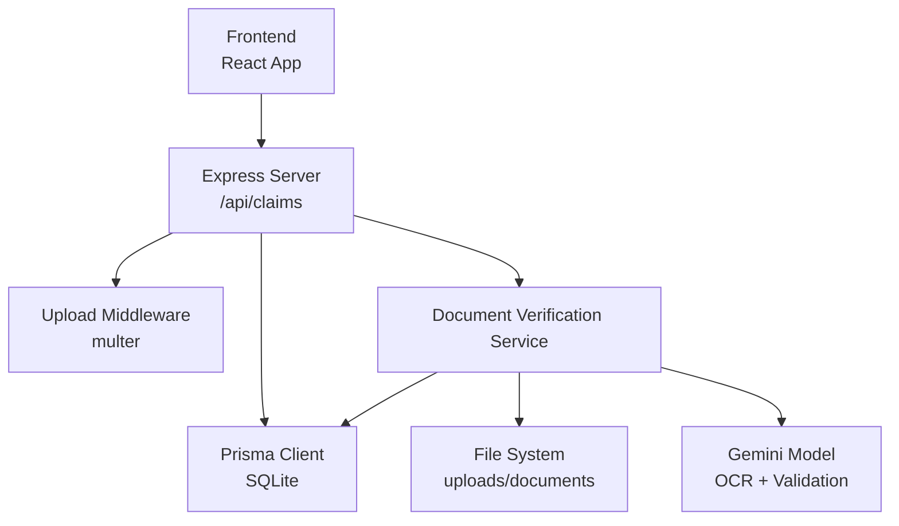
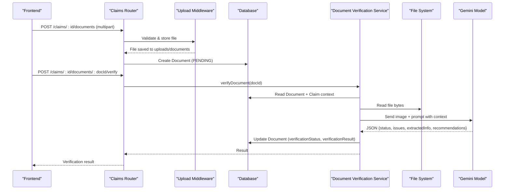
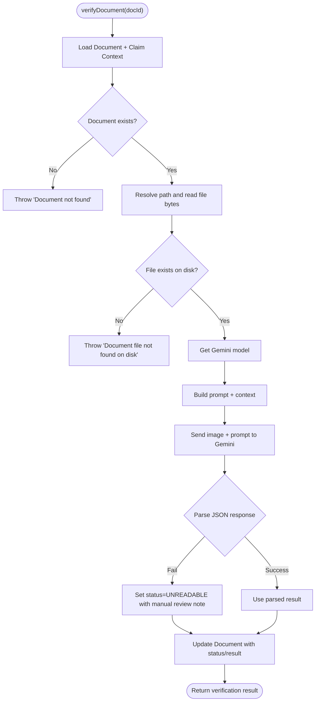
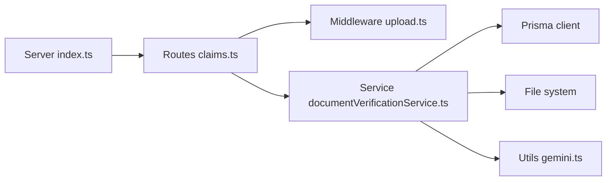

# Document Verification Service

<cite>
**Referenced Files in This Document**
- [documentVerificationService.ts](file://backend/src/services/documentVerificationService.ts)
- [upload.ts](file://backend/src/middleware/upload.ts)
- [claims.ts](file://backend/src/routes/claims.ts)
- [index.ts](file://backend/src/index.ts)
- [gemini.ts](file://backend/src/utils/gemini.ts)
- [schema.prisma](file://backend/prisma/schema.prisma)
- [index.ts (types)](file://backend/src/types/index.ts)
- [api.ts](file://frontend/src/services/api.ts)
</cite>

## Table of Contents
1. [Introduction](#introduction)
2. [Project Structure](#project-structure)
3. [Core Components](#core-components)
4. [Architecture Overview](#architecture-overview)
5. [Detailed Component Analysis](#detailed-component-analysis)
6. [Dependency Analysis](#dependency-analysis)
7. [Performance Considerations](#performance-considerations)
8. [Troubleshooting Guide](#troubleshooting-guide)
9. [Conclusion](#conclusion)
10. [Appendices](#appendices)

## Introduction
This document describes the Document Verification Service that validates uploaded insurance documents using AI-powered OCR and pattern recognition. It explains supported document types, the verification workflow, confidence scoring, error handling for unreadable or corrupted files, integration with claim processing, security considerations, data retention, and compliance aspects relevant to insurance contexts.

## Project Structure
The backend exposes REST endpoints under /api/claims for creating claims, uploading images and documents, triggering analysis, and verifying documents. The Document Verification Service is implemented as a service module that reads stored documents, invokes an AI model for OCR and validation, parses structured results, and persists outcomes back to the database.

**Diagram sources**
- [index.ts:16-32](file://backend/src/index.ts#L16-L32)
- [claims.ts:316-397](file://backend/src/routes/claims.ts#L316-L397)
- [upload.ts:17-53](file://backend/src/middleware/upload.ts#L17-L53)
- [documentVerificationService.ts:41-105](file://backend/src/services/documentVerificationService.ts#L41-L105)
- [gemini.ts:6-10](file://backend/src/utils/gemini.ts#L6-L10)
- [schema.prisma:161-185](file://backend/prisma/schema.prisma#L161-L185)

**Section sources**
- [index.ts:16-32](file://backend/src/index.ts#L16-L32)
- [claims.ts:316-397](file://backend/src/routes/claims.ts#L316-L397)
- [upload.ts:17-53](file://backend/src/middleware/upload.ts#L17-L53)
- [documentVerificationService.ts:41-105](file://backend/src/services/documentVerificationService.ts#L41-L105)
- [gemini.ts:6-10](file://backend/src/utils/gemini.ts#L6-L10)
- [schema.prisma:161-185](file://backend/prisma/schema.prisma#L161-L185)

## Core Components
- Document Verification Service: Loads a document by ID, reads its file from disk, sends it to the Gemini model with a strict prompt, parses JSON output, updates the document record with verification status and result, and returns the result.
- Upload Middleware: Validates allowed image MIME types, enforces size limits, and stores files under dedicated directories with unique filenames.
- Claims Routes: Provide endpoints to upload documents, list them, and trigger verification for a specific document.
- Data Models: Prisma schema defines Document, Claim, Vehicle, User, and related enums including DocumentType and VerificationStatus.
- Types: Defines the DocumentVerificationResult shape used across the service.
- Frontend API Client: Axios instance with auth token injection and 401 handling; used by UI to call backend endpoints.

Supported document types:
- Driver’s License (LICENSE)
- Vehicle Registration (REGISTRATION)
- Accident Report (ACCIDENT_REPORT)
- Repair Estimate (REPAIR_ESTIMATE)

Verification statuses:
- PENDING (default on upload)
- VERIFIED
- ISSUES_FOUND
- UNREADABLE

**Section sources**
- [documentVerificationService.ts:41-105](file://backend/src/services/documentVerificationService.ts#L41-L105)
- [upload.ts:30-53](file://backend/src/middleware/upload.ts#L30-L53)
- [claims.ts:316-397](file://backend/src/routes/claims.ts#L316-L397)
- [schema.prisma:161-185](file://backend/prisma/schema.prisma#L161-L185)
- [index.ts (types):45-50](file://backend/src/types/index.ts#L45-L50)
- [api.ts:1-33](file://frontend/src/services/api.ts#L1-L33)

## Architecture Overview
The end-to-end flow for document verification:
1. Frontend uploads a document via POST /api/claims/:id/documents.
2. Multer middleware validates and saves the file to uploads/documents.
3. A Document record is created with type and filePath, status PENDING.
4. Frontend calls POST /api/claims/:id/documents/:docId/verify.
5. The route retrieves the document and calls verifyDocument.
6. The service reads the file, constructs context from claim/vehicle/user, and sends the image to Gemini with a strict JSON prompt.
7. The response is parsed into DocumentVerificationResult and persisted to the Document record.
8. The client receives the verification result for display and downstream processing.

**Diagram sources**
- [claims.ts:316-397](file://backend/src/routes/claims.ts#L316-L397)
- [upload.ts:17-53](file://backend/src/middleware/upload.ts#L17-L53)
- [documentVerificationService.ts:41-105](file://backend/src/services/documentVerificationService.ts#L41-L105)
- [schema.prisma:161-185](file://backend/prisma/schema.prisma#L161-L185)
- [gemini.ts:6-10](file://backend/src/utils/gemini.ts#L6-L10)

## Detailed Component Analysis

### Document Verification Service
Responsibilities:
- Retrieve document and associated claim context (vehicle and user).
- Resolve file path and read binary content.
- Determine MIME type based on extension.
- Build a prompt with explicit instructions for readability checks, document type identification, key information extraction, and issue detection.
- Call Gemini with inline image data and prompt.
- Parse the returned text to extract a JSON object; if parsing fails, return a safe fallback indicating unreadable/manual review.
- Persist verification status and result to the Document record.

Key behaviors:
- Status values: VERIFIED, ISSUES_FOUND, UNREADABLE.
- Issues array captures detected problems such as blurriness, expiration, missing fields, tampering signs, inconsistencies.
- Extracted info is a flexible key-value map for OCR-extracted fields.
- Recommendations guide next steps when issues are found.

**Diagram sources**
- [documentVerificationService.ts:41-105](file://backend/src/services/documentVerificationService.ts#L41-L105)

**Section sources**
- [documentVerificationService.ts:41-105](file://backend/src/services/documentVerificationService.ts#L41-L105)

### Upload Middleware
Responsibilities:
- Ensure upload directories exist.
- Store files under uploads/images or uploads/documents depending on field name.
- Generate unique filenames using UUIDs.
- Filter allowed MIME types: JPEG, PNG, WebP, JPG.
- Enforce maximum file size of 10MB.

Security and integrity:
- Only whitelisted image types accepted.
- Size limit prevents large payloads.
- Unique filenames avoid overwrites and path traversal risks.

**Section sources**
- [upload.ts:6-53](file://backend/src/middleware/upload.ts#L6-L53)

### Claims Routes (Document Endpoints)
Endpoints:
- POST /api/claims/:id/documents: Upload a single document with multipart/form-data; validates document type against LICENSE, REGISTRATION, ACCIDENT_REPORT, REPAIR_ESTIMATE; creates a Document record with PENDING status.
- GET /api/claims/:id/documents: List all documents for a claim.
- POST /api/claims/:id/documents/:docId/verify: Trigger verification for a specific document; returns the latest verification result.

Error handling:
- Returns 404 if claim or document not found.
- Returns 400 for invalid document type or missing file.
- Returns 500 on unexpected errors.

Integration points:
- Uses upload middleware for file handling.
- Calls verifyDocument service for verification.
- Persists results via Prisma.

**Section sources**
- [claims.ts:316-397](file://backend/src/routes/claims.ts#L316-L397)

### Data Models and Types
- DocumentType enum: LICENSE, REGISTRATION, ACCIDENT_REPORT, REPAIR_ESTIMATE.
- VerificationStatus enum: PENDING, VERIFIED, ISSUES_FOUND, UNREADABLE.
- Document model includes claimId, type, filePath, verificationStatus, verificationResult (JSON), uploadedAt.
- DocumentVerificationResult type defines status, issues, extractedInfo, recommendations.

These models ensure consistent storage and retrieval of verification outcomes and support downstream claim processing workflows.

**Section sources**
- [schema.prisma:161-185](file://backend/prisma/schema.prisma#L161-L185)
- [index.ts (types):45-50](file://backend/src/types/index.ts#L45-L50)

### Frontend Integration
- The frontend uses an Axios client configured with base URL /api and automatic Bearer token injection.
- While document upload and verification flows are primarily backend-driven, the UI can call the document endpoints to attach supporting documents and request verification.

**Section sources**
- [api.ts:1-33](file://frontend/src/services/api.ts#L1-L33)

## Dependency Analysis
High-level dependencies:
- Express server mounts routes and static uploads directory.
- Claims router depends on upload middleware and services.
- Document Verification Service depends on Prisma, filesystem, and Gemini utility.
- Gemini utility depends on environment configuration for API key.

**Diagram sources**
- [index.ts:16-32](file://backend/src/index.ts#L16-L32)
- [claims.ts:316-397](file://backend/src/routes/claims.ts#L316-L397)
- [documentVerificationService.ts:41-105](file://backend/src/services/documentVerificationService.ts#L41-L105)
- [gemini.ts:6-10](file://backend/src/utils/gemini.ts#L6-L10)

**Section sources**
- [index.ts:16-32](file://backend/src/index.ts#L16-L32)
- [claims.ts:316-397](file://backend/src/routes/claims.ts#L316-L397)
- [documentVerificationService.ts:41-105](file://backend/src/services/documentVerificationService.ts#L41-L105)
- [gemini.ts:6-10](file://backend/src/utils/gemini.ts#L6-L10)

## Performance Considerations
- File I/O: Reading full image bytes per verification can be costly; consider caching verified results and reusing them for subsequent requests.
- External API calls: Each verification triggers a Gemini call; implement rate limiting and retry logic with exponential backoff to handle transient failures.
- Concurrency: Avoid blocking the event loop; run verification asynchronously where possible and provide polling or webhook mechanisms for long-running tasks.
- Storage: Keep uploads within reasonable size limits (already enforced at 10MB); consider compression or resizing before sending to the model to reduce payload size.
- Database writes: Batch updates if multiple documents are verified in sequence to minimize write overhead.

[No sources needed since this section provides general guidance]

## Troubleshooting Guide
Common issues and resolutions:
- Document not found: Occurs when attempting to verify a non-existent document ID. Ensure the correct docId is used and the document was successfully created.
- Document file not found on disk: Indicates mismatch between stored filePath and actual file location. Verify upload paths and that the file exists under uploads/documents.
- Unreadable or malformed AI response: If the model returns non-JSON or garbled output, the service falls back to UNREADABLE with a recommendation for manual review. Retry after ensuring the image is clear and well-lit.
- Invalid document type: Uploading with unsupported type returns a validation error. Use one of LICENSE, REGISTRATION, ACCIDENT_REPORT, REPAIR_ESTIMATE.
- Unauthorized access: If the frontend token expires, the client redirects to login. Re-authenticate and retry.

Operational checks:
- Confirm UPLOAD_DIR exists and is writable.
- Verify GEMINI_API_KEY is set in environment.
- Ensure CORS settings allow the frontend origin.

**Section sources**
- [documentVerificationService.ts:41-105](file://backend/src/services/documentVerificationService.ts#L41-L105)
- [claims.ts:316-397](file://backend/src/routes/claims.ts#L316-L397)
- [upload.ts:30-53](file://backend/src/middleware/upload.ts#L30-L53)
- [index.ts:16-26](file://backend/src/index.ts#L16-L26)

## Conclusion
The Document Verification Service integrates AI-powered OCR and rule-based checks to validate insurance documents, extract key information, and assess authenticity. It supports driver’s licenses, vehicle registrations, accident reports, and repair estimates. Results are persisted and exposed via REST endpoints for seamless integration with claim processing workflows. Security controls include file type filtering, size limits, and authenticated access. For production deployments, consider adding robust error handling, retries, rate limiting, secure storage, and compliance measures for sensitive document handling.

[No sources needed since this section summarizes without analyzing specific files]

## Appendices

### Supported Document Types and Key Fields
- Driver’s License: Full name, date of birth, license number, expiration date, photo presence.
- Vehicle Registration: Make/model/year, VIN, owner name, registration date, expiration.
- Accident Report: Date, location, parties involved, incident description, officer name/badge number.
- Repair Estimate: Shop name, itemized parts/labor, total cost, vehicle info, date.

These fields are targeted by the verification prompt to ensure completeness and consistency.

**Section sources**
- [documentVerificationService.ts:8-23](file://backend/src/services/documentVerificationService.ts#L8-L23)
- [schema.prisma:161-166](file://backend/prisma/schema.prisma#L161-L166)

### Confidence Scoring and Fraud Indicators
- Status-based confidence:
  - VERIFIED: High confidence; document is clear, complete, and valid.
  - ISSUES_FOUND: Medium confidence; readable but contains issues such as expiration, missing fields, or inconsistencies.
  - UNREADABLE: Low confidence; cannot assess due to quality or damage.
- Issues array: Captures specific concerns like blur, tampering signs, or missing required information.
- Recommendations: Actionable guidance for users or reviewers when issues are found.

Note: The current implementation uses categorical status rather than numeric scores. To introduce numeric confidence, extend the result schema to include a score field and derive it from issues count and severity.

**Section sources**
- [documentVerificationService.ts:24-39](file://backend/src/services/documentVerificationService.ts#L24-L39)
- [index.ts (types):45-50](file://backend/src/types/index.ts#L45-L50)

### Example Upload and Verification Workflow
- Step 1: Create or select a claim.
- Step 2: Upload supporting document(s) via POST /api/claims/:id/documents with documentType and file.
- Step 3: Trigger verification via POST /api/claims/:id/documents/:docId/verify.
- Step 4: Review returned status, issues, extractedInfo, and recommendations.
- Step 5: Proceed with claim processing based on verification outcome.

**Section sources**
- [claims.ts:316-397](file://backend/src/routes/claims.ts#L316-L397)

### Error Handling for Corrupted or Unreadable Documents
- If the file is missing on disk, the service throws an error indicating the file was not found.
- If the AI response cannot be parsed, the service sets status to UNREADABLE and recommends manual review.
- Clients should handle these cases by prompting users to re-upload clearer images or escalate to human review.

**Section sources**
- [documentVerificationService.ts:51-94](file://backend/src/services/documentVerificationService.ts#L51-L94)

### Integration with Claim Processing
- After verification, downstream processes can use the Document record’s verificationStatus and verificationResult to:
  - Auto-approve low-risk claims with VERIFIED status.
  - Flag claims with ISSUES_FOUND for manual review.
  - Block or pause processing for UNREADABLE until corrected.
- The claims endpoint already includes documents in claim detail responses, enabling UI to display verification outcomes alongside other claim data.

**Section sources**
- [claims.ts:85-112](file://backend/src/routes/claims.ts#L85-L112)
- [schema.prisma:161-185](file://backend/prisma/schema.prisma#L161-L185)

### Security Considerations for Sensitive Document Handling
- Authentication: All claim endpoints are protected by authentication middleware; tokens are injected by the frontend client.
- File validation: Only whitelisted image MIME types are accepted; size limits prevent abuse.
- Storage: Files are stored under a controlled directory served statically; ensure proper permissions and consider restricting direct access behind authentication in production.
- Secrets: API keys are loaded from environment variables; never hardcode secrets in code.

**Section sources**
- [api.ts:10-17](file://frontend/src/services/api.ts#L10-L17)
- [upload.ts:30-53](file://backend/src/middleware/upload.ts#L30-L53)
- [index.ts:16-26](file://backend/src/index.ts#L16-L26)
- [gemini.ts:6-10](file://backend/src/utils/gemini.ts#L6-L10)

### Data Retention Policies and Compliance
- Retention: Define policies for how long uploaded documents and verification results are retained. Implement cleanup jobs to delete files and records beyond retention periods.
- Compliance: Ensure adherence to applicable regulations for personal and sensitive data (e.g., GDPR, HIPAA-like requirements if health data is involved). Encrypt data at rest and in transit; restrict access to authorized roles; maintain audit logs for document access and verification actions.
- Privacy: Minimize collected data; only retain necessary fields; provide mechanisms for users to request deletion.

[No sources needed since this section provides general guidance]