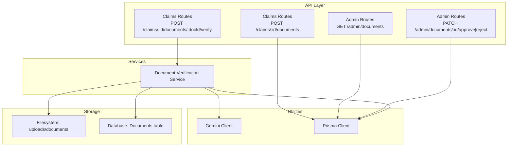
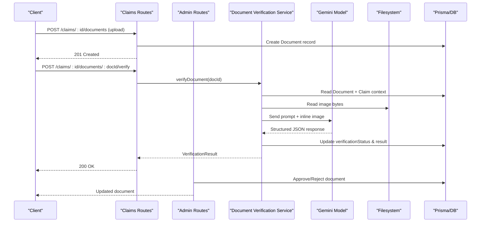
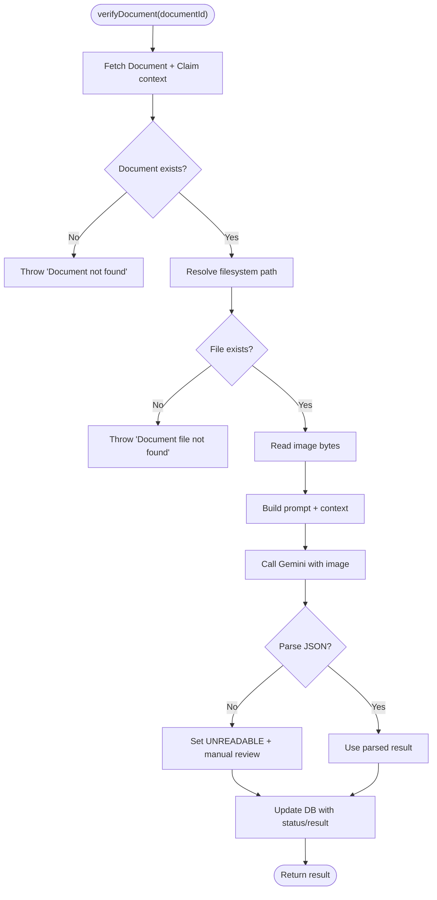
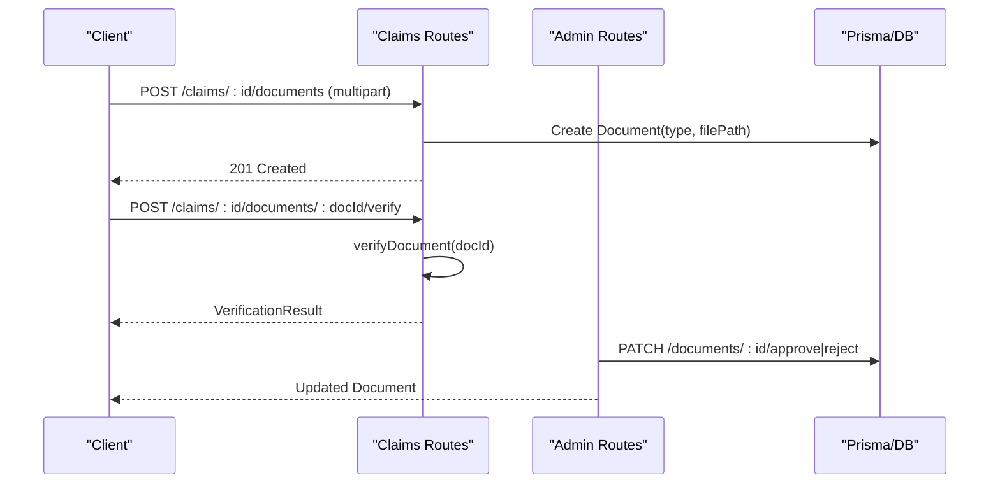
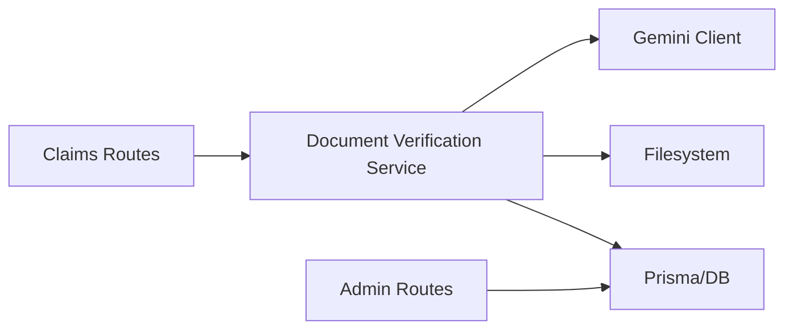

# Document Verification Service

<cite>
**Referenced Files in This Document**
- [documentVerificationService.ts](file://backend/src/services/documentVerificationService.ts)
- [gemini.ts](file://backend/src/utils/gemini.ts)
- [index.ts (types)](file://backend/src/types/index.ts)
- [upload.ts](file://backend/src/middleware/upload.ts)
- [schema.prisma](file://backend/prisma/schema.prisma)
- [claims.ts](file://backend/src/routes/claims.ts)
- [admin.ts](file://backend/src/routes/admin.ts)
</cite>

## Table of Contents
1. [Introduction](#introduction)
2. [Project Structure](#project-structure)
3. [Core Components](#core-components)
4. [Architecture Overview](#architecture-overview)
5. [Detailed Component Analysis](#detailed-component-analysis)
6. [Dependency Analysis](#dependency-analysis)
7. [Performance Considerations](#performance-considerations)
8. [Troubleshooting Guide](#troubleshooting-guide)
9. [Conclusion](#conclusion)
10. [Appendices](#appendices)

## Introduction
This document explains the Document Verification Service that validates insurance claim documents using AI technology. It covers how the system identifies document types, extracts text and key information via multimodal AI, assesses authenticity and completeness, and returns structured verification results with actionable recommendations. It also details validation rules per document type, confidence handling, edge case management, and guidance for extending support to new document types and customizing verification criteria.

## Project Structure
The backend exposes REST endpoints for uploading documents, triggering verification, and managing verification outcomes. The core verification logic is encapsulated in a service that leverages a multimodal AI model to analyze uploaded images and return structured results.

**Diagram sources**
- [claims.ts:316-397](file://backend/src/routes/claims.ts#L316-L397)
- [admin.ts:125-184](file://backend/src/routes/admin.ts#L125-L184)
- [documentVerificationService.ts:41-106](file://backend/src/services/documentVerificationService.ts#L41-L106)
- [gemini.ts:6-9](file://backend/src/utils/gemini.ts#L6-L9)
- [schema.prisma:162-186](file://backend/prisma/schema.prisma#L162-L186)

**Section sources**
- [claims.ts:316-397](file://backend/src/routes/claims.ts#L316-L397)
- [admin.ts:125-184](file://backend/src/routes/admin.ts#L125-L184)
- [documentVerificationService.ts:41-106](file://backend/src/services/documentVerificationService.ts#L41-L106)
- [gemini.ts:6-9](file://backend/src/utils/gemini.ts#L6-L9)
- [schema.prisma:162-186](file://backend/prisma/schema.prisma#L162-L186)

## Core Components
- Document Verification Service: Orchestrates retrieval of the uploaded document image, builds context from the associated claim, calls the multimodal AI model, parses structured output, and persists verification results.
- Gemini Client: Provides access to the multimodal AI model used for document analysis and extraction.
- Upload Middleware: Validates and stores uploaded document images to disk and ensures required directories exist.
- Prisma Schema: Defines data models for Documents, Claims, Vehicles, Users, and related entities; includes enums for document types and verification statuses.
- API Routes: Expose endpoints to upload documents, trigger verification, list documents, and approve/reject documents by admins.

Key responsibilities:
- Type-safe request/response contracts via TypeScript interfaces.
- Centralized error handling and fallback behavior when parsing fails.
- Consistent storage paths and file filtering for supported image formats.

**Section sources**
- [documentVerificationService.ts:41-106](file://backend/src/services/documentVerificationService.ts#L41-L106)
- [gemini.ts:6-9](file://backend/src/utils/gemini.ts#L6-L9)
- [upload.ts:17-53](file://backend/src/middleware/upload.ts#L17-L53)
- [schema.prisma:162-186](file://backend/prisma/schema.prisma#L162-L186)
- [index.ts (types):45-50](file://backend/src/types/index.ts#L45-L50)

## Architecture Overview
The verification flow integrates user-facing routes, a service layer, an external AI model, and persistent storage.

**Diagram sources**
- [claims.ts:316-397](file://backend/src/routes/claims.ts#L316-L397)
- [documentVerificationService.ts:41-106](file://backend/src/services/documentVerificationService.ts#L41-L106)
- [admin.ts:151-184](file://backend/src/routes/admin.ts#L151-L184)
- [schema.prisma:162-186](file://backend/prisma/schema.prisma#L162-L186)

## Detailed Component Analysis

### Document Verification Service
Responsibilities:
- Load document metadata and claim context from the database.
- Resolve the on-disk path for the uploaded image and read its bytes.
- Build a rich prompt including document type and claim context.
- Call the multimodal AI model with the image and prompt.
- Parse the returned JSON into a typed result; handle parse failures gracefully.
- Persist verification status and result back to the database.

Validation and quality assessment:
- The service instructs the AI to evaluate readability, identify document type, check presence of required fields per type, detect potential tampering or inconsistencies, and provide recommendations.
- Status values: VERIFIED, ISSUES_FOUND, UNREADABLE.

Confidence and reliability:
- No explicit numeric confidence score is returned by the current implementation. The status field acts as a categorical confidence indicator.
- Recommendations are included to guide next steps when issues are found.

Edge cases handled:
- Missing document record or missing file on disk triggers errors before calling the AI.
- If AI response cannot be parsed to JSON, the service defaults to UNREADABLE with a manual review recommendation.

Extensibility:
- To add new document types, extend the allowed types in routes and schema, and update the prompt’s type-specific checks accordingly.

**Diagram sources**
- [documentVerificationService.ts:41-106](file://backend/src/services/documentVerificationService.ts#L41-L106)

**Section sources**
- [documentVerificationService.ts:41-106](file://backend/src/services/documentVerificationService.ts#L41-L106)

### API Integration: Upload and Verify
Upload:
- Endpoint: POST /api/claims/:id/documents
- Validates claim ownership, accepts a single document file, enforces allowed image types and size limits, stores under uploads/documents, and creates a Document record with a chosen type.

Verify:
- Endpoint: POST /api/claims/:id/documents/:docId/verify
- Ensures the document belongs to the specified claim, then invokes the verification service and returns the result.

Admin operations:
- List documents with optional status filter.
- Approve or reject documents, updating verification status and appending admin notes.

**Diagram sources**
- [claims.ts:316-397](file://backend/src/routes/claims.ts#L316-L397)
- [admin.ts:125-184](file://backend/src/routes/admin.ts#L125-L184)

**Section sources**
- [claims.ts:316-397](file://backend/src/routes/claims.ts#L316-L397)
- [admin.ts:125-184](file://backend/src/routes/admin.ts#L125-L184)

### Data Models and Types
- Document: Stores claim association, document type, file path, verification status, and verification result payload.
- VerificationStatus: PENDING, VERIFIED, ISSUES_FOUND, UNREADABLE.
- DocumentType: LICENSE, REGISTRATION, ACCIDENT_REPORT, REPAIR_ESTIMATE.
- DocumentVerificationResult: Typed interface defining status, issues, extractedInfo, and recommendations.

These models ensure consistent storage and predictable responses across the API.

**Section sources**
- [schema.prisma:162-186](file://backend/prisma/schema.prisma#L162-L186)
- [index.ts (types):45-50](file://backend/src/types/index.ts#L45-L50)

### OCR and Text Extraction
- The service uses a multimodal AI model to ingest the document image and extract relevant text and fields. There is no separate OCR library; the AI model performs visual understanding and text extraction internally.
- The prompt directs the model to focus on readability, document type identification, presence of required fields, and detection of tampering or inconsistencies.

**Section sources**
- [documentVerificationService.ts:6-39](file://backend/src/services/documentVerificationService.ts#L6-L39)
- [gemini.ts:6-9](file://backend/src/utils/gemini.ts#L6-L9)

### Authenticity Verification and Tampering Detection
- The verification prompt explicitly asks the model to look for signs of tampering or alteration and inconsistencies in information.
- Results are captured in the issues array and reflected in the status (e.g., ISSUES_FOUND).

**Section sources**
- [documentVerificationService.ts:17-22](file://backend/src/services/documentVerificationService.ts#L17-L22)

### Quality Assessment Features
- Readability evaluation is part of the prompt instructions, guiding the model to determine if the document is clear and legible.
- Completeness is assessed by checking for required fields based on document type.
- Recommendations are provided to guide users on corrective actions.

**Section sources**
- [documentVerificationService.ts:9-22](file://backend/src/services/documentVerificationService.ts#L9-L22)

### Validation Rules by Document Type
The service’s prompt defines expected fields and checks per type:
- Driver’s License: name, date of birth, license number, expiration date, photo.
- Vehicle Registration: make/model/year, VIN, owner name, registration date, expiration.
- Accident Report: date, location, parties involved, incident description, officer name/badge number.
- Repair Estimate: shop name, itemized parts/labor, total cost, vehicle info, date.

These rules inform the model’s extraction and issue detection.

**Section sources**
- [documentVerificationService.ts:12-16](file://backend/src/services/documentVerificationService.ts#L12-L16)

### Confidence Scoring
- The current implementation does not include a numeric confidence score. Instead, it uses a categorical status:
  - VERIFIED: Clear, complete, and valid.
  - ISSUES_FOUND: Readable but has problems such as missing fields, expiry, or suspected tampering.
  - UNREADABLE: Too blurry/damaged to assess or AI parsing failed.
- Recommendations accompany ISSUES_FOUND or UNREADABLE states to guide next steps.

**Section sources**
- [documentVerificationService.ts:24-39](file://backend/src/services/documentVerificationService.ts#L24-L39)
- [documentVerificationService.ts:78-94](file://backend/src/services/documentVerificationService.ts#L78-L94)

### Handling Edge Cases
- Missing document record: Throws an error before proceeding.
- Missing file on disk: Throws an error to prevent undefined behavior.
- AI response parsing failure: Defaults to UNREADABLE with a manual review recommendation.
- Admin override: Admins can approve or reject documents, setting appropriate statuses and notes.

**Section sources**
- [documentVerificationService.ts:47-55](file://backend/src/services/documentVerificationService.ts#L47-L55)
- [documentVerificationService.ts:78-94](file://backend/src/services/documentVerificationService.ts#L78-L94)
- [admin.ts:151-184](file://backend/src/routes/admin.ts#L151-L184)

### Adding Support for New Document Types
Steps to extend:
1. Add the new type to the DocumentType enum in the schema.
2. Update route validation to accept the new type during upload.
3. Extend the verification prompt to include type-specific checks and required fields.
4. Optionally adjust UI/API to reflect the new type and any additional metadata.

Example references:
- Enum definition: [schema.prisma:162-167](file://backend/prisma/schema.prisma#L162-L167)
- Route validation: [claims.ts:333-338](file://backend/src/routes/claims.ts#L333-L338)
- Prompt customization: [documentVerificationService.ts:6-39](file://backend/src/services/documentVerificationService.ts#L6-L39)

**Section sources**
- [schema.prisma:162-167](file://backend/prisma/schema.prisma#L162-L167)
- [claims.ts:333-338](file://backend/src/routes/claims.ts#L333-L338)
- [documentVerificationService.ts:6-39](file://backend/src/services/documentVerificationService.ts#L6-L39)

### Customizing Verification Criteria
- Modify the verification prompt to emphasize specific checks (e.g., stricter tampering detection, additional required fields).
- Adjust recommendations to reflect policy changes or regional requirements.
- Leverage admin approval workflows to incorporate human-in-the-loop decisions for ambiguous cases.

**Section sources**
- [documentVerificationService.ts:6-39](file://backend/src/services/documentVerificationService.ts#L6-L39)
- [admin.ts:151-184](file://backend/src/routes/admin.ts#L151-L184)

## Dependency Analysis
High-level dependencies:
- Claims and Admin routes depend on Prisma for data access and on the Document Verification Service for AI-driven validation.
- The service depends on the Gemini client for multimodal processing and on filesystem I/O for reading uploaded images.
- Storage and persistence are handled via Prisma against a SQLite database.

**Diagram sources**
- [claims.ts:316-397](file://backend/src/routes/claims.ts#L316-L397)
- [admin.ts:125-184](file://backend/src/routes/admin.ts#L125-L184)
- [documentVerificationService.ts:41-106](file://backend/src/services/documentVerificationService.ts#L41-L106)
- [gemini.ts:6-9](file://backend/src/utils/gemini.ts#L6-L9)

**Section sources**
- [claims.ts:316-397](file://backend/src/routes/claims.ts#L316-L397)
- [admin.ts:125-184](file://backend/src/routes/admin.ts#L125-L184)
- [documentVerificationService.ts:41-106](file://backend/src/services/documentVerificationService.ts#L41-L106)
- [gemini.ts:6-9](file://backend/src/utils/gemini.ts#L6-L9)

## Performance Considerations
- Image size limit: Upload middleware caps files at 10MB to balance quality and performance.
- Asynchronous background tasks: Damage analysis runs asynchronously; similarly, verification could be offloaded to a queue for high throughput.
- Database queries: Include only necessary relations to reduce payload size and query time.
- External API latency: Calls to the AI model introduce network latency; consider caching repeated verifications or batching where feasible.

[No sources needed since this section provides general guidance]

## Troubleshooting Guide
Common issues and resolutions:
- Document not found: Ensure the document ID exists and belongs to the specified claim.
- Document file not found on disk: Confirm the file was successfully uploaded and stored under the expected directory.
- AI response parsing failure: The service falls back to UNREADABLE; re-upload a clearer image or retry verification.
- Invalid document type: Ensure the type matches one of the allowed values in the route validation.
- Admin approval/rejection: Use admin endpoints to set final statuses and add reasons when needed.

Operational tips:
- Check logs for detailed error messages around file I/O and AI calls.
- Validate environment variables for the AI API key and upload directory configuration.

**Section sources**
- [documentVerificationService.ts:47-55](file://backend/src/services/documentVerificationService.ts#L47-L55)
- [documentVerificationService.ts:78-94](file://backend/src/services/documentVerificationService.ts#L78-L94)
- [claims.ts:333-338](file://backend/src/routes/claims.ts#L333-L338)
- [admin.ts:151-184](file://backend/src/routes/admin.ts#L151-L184)

## Conclusion
The Document Verification Service integrates multimodal AI to validate insurance claim documents, providing robust checks for readability, completeness, and authenticity. It standardizes results through typed responses and supports administrative oversight for approvals and rejections. Extending the system to new document types and customizing verification criteria is straightforward by updating the schema, routes, and prompts.

[No sources needed since this section summarizes without analyzing specific files]

## Appendices

### API Reference Summary
- Upload document: POST /api/claims/:id/documents
  - Accepts multipart form with a document field.
  - Validates claim ownership and document type.
  - Stores file and creates a Document record.
- Verify document: POST /api/claims/:id/documents/:docId/verify
  - Triggers AI-based verification and returns a structured result.
- List documents: GET /api/admin/documents
  - Supports filtering by verification status.
- Approve/Reject: PATCH /api/admin/documents/:id/approve|reject
  - Updates verification status and records admin notes.

**Section sources**
- [claims.ts:316-397](file://backend/src/routes/claims.ts#L316-L397)
- [admin.ts:125-184](file://backend/src/routes/admin.ts#L125-L184)