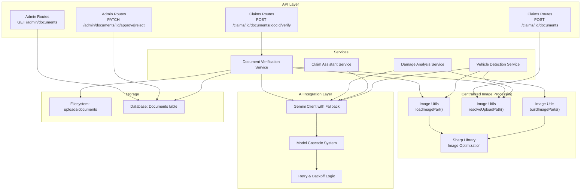
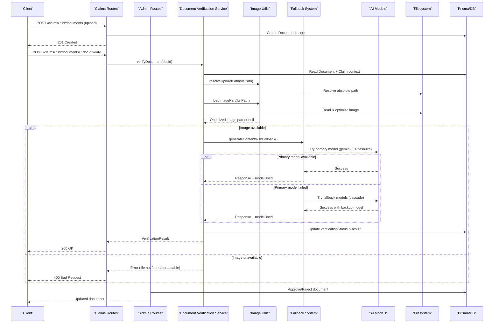
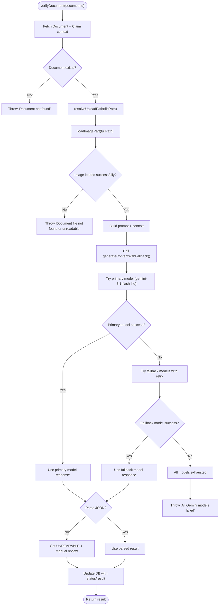
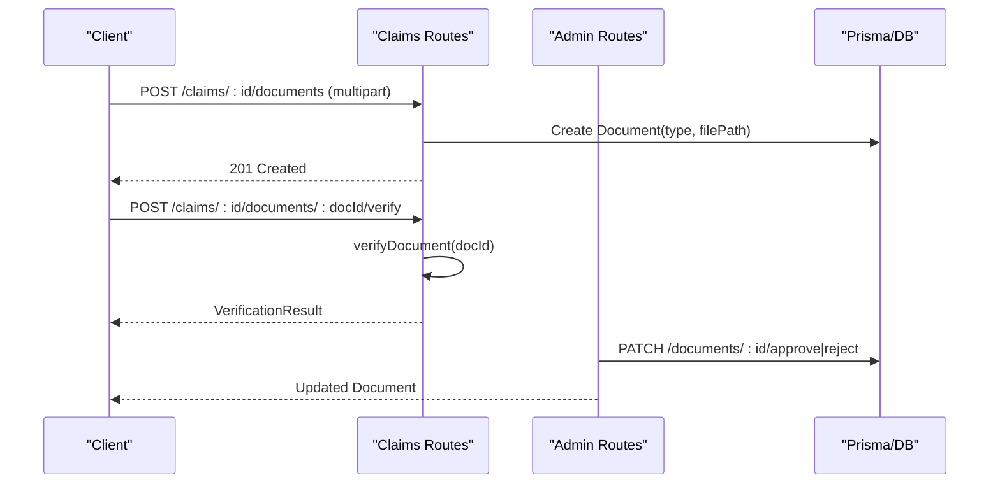
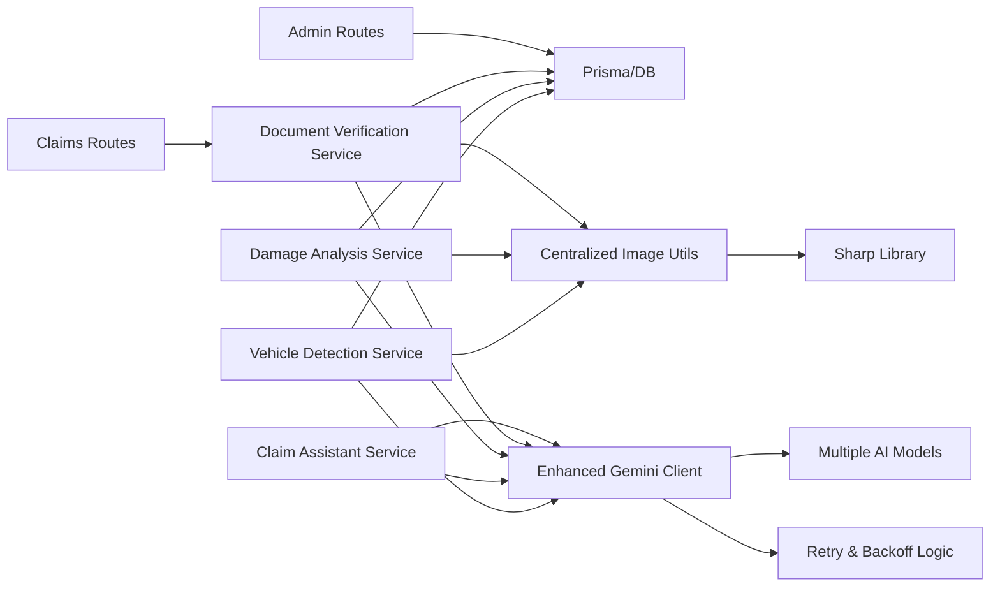

# Document Verification Service

<cite>
**Referenced Files in This Document**
- [documentVerificationService.ts](file://backend/src/services/documentVerificationService.ts)
- [imageUtils.ts](file://backend/src/utils/imageUtils.ts)
- [gemini.ts](file://backend/src/utils/gemini.ts)
- [index.ts (types)](file://backend/src/types/index.ts)
- [upload.ts](file://backend/src/middleware/upload.ts)
- [schema.prisma](file://backend/prisma/schema.prisma)
- [claims.ts](file://backend/src/routes/claims.ts)
- [admin.ts](file://backend/src/routes/admin.ts)
- [damageAnalysisService.ts](file://backend/src/services/damageAnalysisService.ts)
- [claimAssistantService.ts](file://backend/src/services/claimAssistantService.ts)
- [vehicleDetectionService.ts](file://backend/src/services/vehicleDetectionService.ts)
</cite>

## Update Summary
**Changes Made**
- Updated image processing section to reflect new centralized utilities with consistent error handling
- Added comprehensive coverage of image optimization and resilience features
- Enhanced reliability sections with centralized image processing benefits
- Updated architecture diagrams to show centralized image processing flow
- Added troubleshooting guidance for image processing failures and edge cases

## Table of Contents
1. [Introduction](#introduction)
2. [Project Structure](#project-structure)
3. [Core Components](#core-components)
4. [Architecture Overview](#architecture-overview)
5. [Detailed Component Analysis](#detailed-component-analysis)
6. [Dependency Analysis](#dependency-analysis)
7. [Performance Considerations](#performance-considerations)
8. [Troubleshooting Guide](#troubleshooting-guide)
9. [Conclusion](#conclusion)
10. [Appendices](#appendices)

## Introduction
This document explains the Document Verification Service that validates insurance claim documents using AI technology with enhanced reliability through a sophisticated fallback system. The service identifies document types, extracts text and key information via multimodal AI, assesses authenticity and completeness, and returns structured verification results with actionable recommendations. The system now features automatic model cascading and retry mechanisms to ensure reliable processing even during peak usage periods or when specific AI models experience issues. **Updated**: The service now uses centralized image processing utilities that provide consistent error handling and optimized image processing for improved reliability and performance.

## Project Structure
The backend exposes REST endpoints for uploading documents, triggering verification, and managing verification outcomes. The core verification logic is encapsulated in a service that leverages centralized image processing utilities and a multimodal AI model with built-in fallback capabilities to analyze uploaded images and return structured results.

**Diagram sources**
- [claims.ts:316-397](file://backend/src/routes/claims.ts#L316-L397)
- [admin.ts:125-184](file://backend/src/routes/admin.ts#L125-L184)
- [documentVerificationService.ts:41-106](file://backend/src/services/documentVerificationService.ts#L41-L106)
- [imageUtils.ts:15-59](file://backend/src/utils/imageUtils.ts#L15-L59)
- [gemini.ts:52-91](file://backend/src/utils/gemini.ts#L52-L91)
- [damageAnalysisService.ts:81-82](file://backend/src/services/damageAnalysisService.ts#L81-L82)
- [claimAssistantService.ts:95-100](file://backend/src/services/claimAssistantService.ts#L95-L100)
- [vehicleDetectionService.ts:46-55](file://backend/src/services/vehicleDetectionService.ts#L46-L55)

**Section sources**
- [claims.ts:316-397](file://backend/src/routes/claims.ts#L316-L397)
- [admin.ts:125-184](file://backend/src/routes/admin.ts#L125-L184)
- [documentVerificationService.ts:41-106](file://backend/src/services/documentVerificationService.ts#L41-L106)
- [imageUtils.ts:15-59](file://backend/src/utils/imageUtils.ts#L15-L59)
- [gemini.ts:52-91](file://backend/src/utils/gemini.ts#L52-L91)

## Core Components
- **Document Verification Service**: Orchestrates retrieval of the uploaded document image using centralized utilities, builds context from the associated claim, calls the multimodal AI model with fallback support, parses structured output, and persists verification results.
- **Centralized Image Processing Utilities**: Provides consistent image loading, path resolution, and batch processing with robust error handling for missing or corrupt files.
- **Enhanced Gemini Client**: Provides access to multiple AI models with automatic fallback, retry mechanisms, and backoff strategies for reliable processing.
- **Upload Middleware**: Validates and stores uploaded document images to disk and ensures required directories exist.
- **Prisma Schema**: Defines data models for Documents, Claims, Vehicles, Users, and related entities; includes enums for document types and verification statuses.
- **API Routes**: Expose endpoints to upload documents, trigger verification, list documents, and approve/reject documents by admins.

Key responsibilities:
- Type-safe request/response contracts via TypeScript interfaces.
- Centralized error handling and fallback behavior when parsing fails.
- Consistent storage paths and file filtering for supported image formats.
- **New**: Centralized image processing with automatic optimization and resilient error handling.
- **New**: Automatic model selection and fallback based on availability and performance.

**Section sources**
- [documentVerificationService.ts:41-106](file://backend/src/services/documentVerificationService.ts#L41-L106)
- [imageUtils.ts:15-59](file://backend/src/utils/imageUtils.ts#L15-L59)
- [gemini.ts:52-91](file://backend/src/utils/gemini.ts#L52-L91)
- [upload.ts:17-53](file://backend/src/middleware/upload.ts#L17-L53)
- [schema.prisma:162-186](file://backend/prisma/schema.prisma#L162-L186)
- [index.ts (types):45-50](file://backend/src/types/index.ts#L45-L50)

## Architecture Overview
The verification flow integrates user-facing routes, a service layer, centralized image processing utilities, intelligent AI model selection system, and persistent storage with built-in reliability mechanisms.

**Diagram sources**
- [claims.ts:316-397](file://backend/src/routes/claims.ts#L316-L397)
- [documentVerificationService.ts:41-106](file://backend/src/services/documentVerificationService.ts#L41-L106)
- [admin.ts:151-184](file://backend/src/routes/admin.ts#L151-L184)
- [imageUtils.ts:15-59](file://backend/src/utils/imageUtils.ts#L15-L59)
- [gemini.ts:52-91](file://backend/src/utils/gemini.ts#L52-L91)
- [schema.prisma:162-186](file://backend/prisma/schema.prisma#L162-L186)

## Detailed Component Analysis

### Document Verification Service with Enhanced Reliability
Responsibilities:
- Load document metadata and claim context from the database.
- Use centralized image utilities to resolve filesystem paths and load optimized images with consistent error handling.
- Build a rich prompt including document type and claim context.
- Call the multimodal AI model with automatic fallback support and retry mechanisms.
- Parse the returned JSON into a typed result; handle parse failures gracefully.
- Persist verification status and result back to the database.

Validation and quality assessment:
- The service instructs the AI to evaluate readability, identify document type, check presence of required fields per type, detect potential tampering or inconsistencies, and provide recommendations.
- Status values: VERIFIED, ISSUES_FOUND, UNREADABLE.

Confidence and reliability:
- No explicit numeric confidence score is returned by the current implementation. The status field acts as a categorical confidence indicator.
- Recommendations are included to guide next steps when issues are found.
- **Enhanced**: Automatic model selection ensures highest availability and performance.
- **Enhanced**: Centralized image processing provides consistent error handling and automatic image optimization.

Edge cases handled:
- Missing document record or missing file on disk triggers errors before calling the AI.
- If AI response cannot be parsed to JSON, the service defaults to UNREADABLE with a manual review recommendation.
- **New**: Centralized image utilities handle missing or corrupt files gracefully by returning null instead of throwing exceptions.
- **New**: Model failures automatically trigger fallback to alternative models with exponential backoff.

Extensibility:
- To add new document types, extend the allowed types in routes and schema, and update the prompt's type-specific checks accordingly.

**Diagram sources**
- [documentVerificationService.ts:41-106](file://backend/src/services/documentVerificationService.ts#L41-L106)
- [imageUtils.ts:15-59](file://backend/src/utils/imageUtils.ts#L15-L59)
- [gemini.ts:52-91](file://backend/src/utils/gemini.ts#L52-L91)

**Section sources**
- [documentVerificationService.ts:41-106](file://backend/src/services/documentVerificationService.ts#L41-L106)

### Centralized Image Processing Utilities
**Updated** The system now uses centralized image processing utilities that provide consistent error handling and optimized image processing:

**Key Functions:**
- **resolveUploadPath()**: Resolves relative upload paths against the configured UPLOAD_DIR environment variable, ensuring consistent file path resolution across development and production environments.
- **loadImagePart()**: Loads individual image files and converts them to compact Gemini inlineData format with automatic optimization (resize to 1280px, JPEG compression at 80% quality). Returns null for missing or corrupt files instead of throwing exceptions.
- **buildImageParts()**: Processes multiple images with intelligent prioritization (damage closeups first), applies consistent optimization, and filters out unreadable files.

**Error Handling:**
- Graceful handling of missing files, corrupt images, and permission errors
- Consistent logging with file names and error details
- Non-blocking failure mode that allows processing to continue with available images

**Image Optimization:**
- Automatic EXIF rotation for proper orientation
- Intelligent resizing to maximum 1280px dimension while maintaining aspect ratio
- JPEG compression at 80% quality for optimal balance between quality and size
- Base64 encoding for direct integration with Gemini API

**Section sources**
- [imageUtils.ts:15-59](file://backend/src/utils/imageUtils.ts#L15-L59)

### Enhanced AI Model Integration with Fallback System
The system now uses a sophisticated model cascade that automatically selects the best available AI model:

**Model Cascade Order:**
1. **gemini-3.1-flash-lite** (Primary): 15 RPM, 500 RPD - highest limits for reliability
2. **gemini-2.5-flash** (Quality): 5 RPM, 20 RPD - best quality when available
3. **gemini-3-flash** (Standard): 5 RPM, 20 RPD - balanced performance
4. **gemini-3.7-flash** (Advanced): 5 RPM, 20 RPD - latest capabilities
5. **gemini-2.5-flash-lite** (Backup): 10 RPM, 20 RPD - final fallback option

**Retry and Backoff Mechanism:**
- Each model gets up to 1 retry attempt on retryable errors (429, 503, 500)
- Exponential backoff between retries (1 second delay)
- Automatic detection of rate limiting, quota exceeded, and service unavailability
- Logging of which model was actually used for each request

**Error Handling:**
- Non-retryable errors fail immediately without attempting other models
- Retryable errors trigger exponential backoff and model switching
- Complete failure only occurs when all models are exhausted
- Comprehensive logging for monitoring and debugging

**Section sources**
- [gemini.ts:7-13](file://backend/src/utils/gemini.ts#L7-L13)
- [gemini.ts:27-41](file://backend/src/utils/gemini.ts#L27-L41)
- [gemini.ts:52-91](file://backend/src/utils/gemini.ts#L52-L91)

### API Integration: Upload and Verify
Upload:
- Endpoint: POST /api/claims/:id/documents
- Validates claim ownership, accepts a single document file, enforces allowed image types and size limits, stores under uploads/documents, and creates a Document record with a chosen type.

Verify:
- Endpoint: POST /api/claims/:id/documents/:docId/verify
- Ensures the document belongs to the specified claim, then invokes the verification service with enhanced reliability and returns the result.

Admin operations:
- List documents with optional status filter.
- Approve or reject documents, updating verification status and appending admin notes.

**Diagram sources**
- [claims.ts:316-397](file://backend/src/routes/claims.ts#L316-L397)
- [admin.ts:125-184](file://backend/src/routes/admin.ts#L125-L184)

**Section sources**
- [claims.ts:316-397](file://backend/src/routes/claims.ts#L316-L397)
- [admin.ts:125-184](file://backend/src/routes/admin.ts#L125-L184)

### Data Models and Types
- Document: Stores claim association, document type, file path, verification status, and verification result payload.
- VerificationStatus: PENDING, VERIFIED, ISSUES_FOUND, UNREADABLE.
- DocumentType: LICENSE, REGISTRATION, ACCIDENT_REPORT, REPAIR_ESTIMATE.
- DocumentVerificationResult: Typed interface defining status, issues, extractedInfo, and recommendations.

These models ensure consistent storage and predictable responses across the API.

**Section sources**
- [schema.prisma:162-186](file://backend/prisma/schema.prisma#L162-L186)
- [index.ts (types):45-50](file://backend/src/types/index.ts#L45-L50)

### OCR and Text Extraction with Enhanced Reliability
**Updated** The service now uses centralized image processing utilities combined with multimodal AI models to ingest document images and extract relevant text and fields. There is no separate OCR library; the AI model performs visual understanding and text extraction internally.

**Enhanced Features:**
- Automatic image optimization reduces processing time and API payload sizes
- Consistent error handling for missing or corrupt images
- Intelligent image prioritization for multi-image scenarios
- Built-in EXIF rotation handling for proper document orientation

**Section sources**
- [documentVerificationService.ts:6-39](file://backend/src/services/documentVerificationService.ts#L6-L39)
- [imageUtils.ts:15-59](file://backend/src/utils/imageUtils.ts#L15-L59)
- [gemini.ts:52-91](file://backend/src/utils/gemini.ts#L52-L91)

### Authenticity Verification and Tampering Detection
- The verification prompt explicitly asks the model to look for signs of tampering or alteration and inconsistencies in information.
- Results are captured in the issues array and reflected in the status (e.g., ISSUES_FOUND).
- **Enhanced**: Fallback system ensures authenticity checks remain available during peak usage periods.
- **Enhanced**: Centralized image processing ensures consistent quality regardless of source device or image conditions.

**Section sources**
- [documentVerificationService.ts:17-22](file://backend/src/services/documentVerificationService.ts#L17-L22)

### Quality Assessment Features
- Readability evaluation is part of the prompt instructions, guiding the model to determine if the document is clear and legible.
- Completeness is assessed by checking for required fields based on document type.
- Recommendations are provided to guide users on corrective actions.
- **Enhanced**: Quality assessments benefit from automatic image optimization and centralized error handling.

**Section sources**
- [documentVerificationService.ts:9-22](file://backend/src/services/documentVerificationService.ts#L9-L22)

### Validation Rules by Document Type
The service's prompt defines expected fields and checks per type:
- Driver's License: name, date of birth, license number, expiration date, photo.
- Vehicle Registration: make/model/year, VIN, owner name, registration date, expiration.
- Accident Report: date, location, parties involved, incident description, officer name/badge number.
- Repair Estimate: shop name, itemized parts/labor, total cost, vehicle info, date.

These rules inform the model's extraction and issue detection.

**Section sources**
- [documentVerificationService.ts:12-16](file://backend/src/services/documentVerificationService.ts#L12-L16)

### Confidence Scoring
- The current implementation does not include a numeric confidence score. Instead, it uses a categorical status:
  - VERIFIED: Clear, complete, and valid.
  - ISSUES_FOUND: Readable but has problems such as missing fields, expiry, or suspected tampering.
  - UNREADABLE: Too blurry/damaged to assess or AI parsing failed.
- Recommendations accompany ISSUES_FOUND or UNREADABLE states to guide next steps.
- **Enhanced**: Model usage tracking provides insight into which models are most reliable for different document types.

**Section sources**
- [documentVerificationService.ts:24-39](file://backend/src/services/documentVerificationService.ts#L24-L39)
- [documentVerificationService.ts:78-94](file://backend/src/services/documentVerificationService.ts#L78-L94)

### Handling Edge Cases with Enhanced Reliability
**Updated** The system now handles edge cases more robustly through centralized image processing:

- Missing document record: Throws an error before proceeding.
- Missing file on disk: Centralized utilities handle this gracefully by returning null, allowing services to provide meaningful error messages.
- Corrupt or unreadable images: Automatically detected and logged with detailed error information.
- AI response parsing failure: Defaults to UNREADABLE with a manual review recommendation.
- Admin override: Admins can approve or reject documents, setting appropriate statuses and notes.
- **New**: Centralized image processing eliminates inconsistent error handling across different services.
- **New**: Automatic image optimization prevents API payload limit issues and improves processing speed.
- **New**: Model failures automatically trigger fallback to alternative models with exponential backoff.
- **New**: Rate limiting and quota exhaustion are handled transparently through model switching.

**Section sources**
- [documentVerificationService.ts:47-55](file://backend/src/services/documentVerificationService.ts#L47-L55)
- [documentVerificationService.ts:78-94](file://backend/src/services/documentVerificationService.ts#L78-L94)
- [imageUtils.ts:26-40](file://backend/src/utils/imageUtils.ts#L26-L40)
- [admin.ts:151-184](file://backend/src/routes/admin.ts#L151-L184)
- [gemini.ts:27-41](file://backend/src/utils/gemini.ts#L27-L41)

### Adding Support for New Document Types
Steps to extend:
1. Add the new type to the DocumentType enum in the schema.
2. Update route validation to accept the new type during upload.
3. Extend the verification prompt to include type-specific checks and required fields.
4. Optionally adjust UI/API to reflect the new type and any additional metadata.
5. **Enhanced**: New document types automatically benefit from centralized image processing and fallback system for improved reliability.

Example references:
- Enum definition: [schema.prisma:162-167](file://backend/prisma/schema.prisma#L162-L167)
- Route validation: [claims.ts:333-338](file://backend/src/routes/claims.ts#L333-L338)
- Prompt customization: [documentVerificationService.ts:6-39](file://backend/src/services/documentVerificationService.ts#L6-L39)

**Section sources**
- [schema.prisma:162-167](file://backend/prisma/schema.prisma#L162-L167)
- [claims.ts:333-338](file://backend/src/routes/claims.ts#L333-L338)
- [documentVerificationService.ts:6-39](file://backend/src/services/documentVerificationService.ts#L6-L39)

### Customizing Verification Criteria
- Modify the verification prompt to emphasize specific checks (e.g., stricter tampering detection, additional required fields).
- Adjust recommendations to reflect policy changes or regional requirements.
- Leverage admin approval workflows to incorporate human-in-the-loop decisions for ambiguous cases.
- **Enhanced**: Customization benefits from centralized image processing for optimal performance across different document types.

**Section sources**
- [documentVerificationService.ts:6-39](file://backend/src/services/documentVerificationService.ts#L6-L39)
- [admin.ts:151-184](file://backend/src/routes/admin.ts#L151-L184)

## Dependency Analysis
High-level dependencies:
- Claims and Admin routes depend on Prisma for data access and on the Document Verification Service for AI-driven validation.
- Services now depend on centralized image processing utilities for consistent image handling and error management.
- The service depends on the enhanced Gemini client with fallback capabilities for multimodal processing and on centralized image utilities for reliable image loading.
- Storage and persistence are handled via Prisma against a SQLite database.
- **Enhanced**: Multiple services (document verification, damage analysis, claim assistant, vehicle detection) share the same robust image processing and AI integration layers.

**Diagram sources**
- [claims.ts:316-397](file://backend/src/routes/claims.ts#L316-L397)
- [admin.ts:125-184](file://backend/src/routes/admin.ts#L125-L184)
- [documentVerificationService.ts:41-106](file://backend/src/services/documentVerificationService.ts#L41-L106)
- [imageUtils.ts:15-59](file://backend/src/utils/imageUtils.ts#L15-L59)
- [gemini.ts:52-91](file://backend/src/utils/gemini.ts#L52-L91)
- [damageAnalysisService.ts:81-82](file://backend/src/services/damageAnalysisService.ts#L81-L82)
- [claimAssistantService.ts:95-100](file://backend/src/services/claimAssistantService.ts#L95-L100)
- [vehicleDetectionService.ts:46-55](file://backend/src/services/vehicleDetectionService.ts#L46-L55)

**Section sources**
- [claims.ts:316-397](file://backend/src/routes/claims.ts#L316-L397)
- [admin.ts:125-184](file://backend/src/routes/admin.ts#L125-L184)
- [documentVerificationService.ts:41-106](file://backend/src/services/documentVerificationService.ts#L41-L106)
- [imageUtils.ts:15-59](file://backend/src/utils/imageUtils.ts#L15-L59)
- [gemini.ts:52-91](file://backend/src/utils/gemini.ts#L52-L91)

## Performance Considerations
**Updated** The centralized image processing provides significant performance improvements:

- Image size limit: Upload middleware caps files at 10MB to balance quality and performance.
- **New**: Automatic image optimization reduces large phone photos (3-8 MB) to 100-300 KB JPEG files while maintaining visual quality.
- **New**: Intelligent image prioritization processes damage closeups first for better AI accuracy.
- Asynchronous background tasks: Damage analysis runs asynchronously; similarly, verification could be offloaded to a queue for high throughput.
- Database queries: Include only necessary relations to reduce payload size and query time.
- External API latency: Calls to the AI model introduce network latency; consider caching repeated verifications or batching where feasible.
- **Enhanced**: Model cascade reduces latency by starting with the fastest available model (gemini-3.1-flash-lite) and falling back to higher-quality models only when needed.
- **Enhanced**: Retry mechanisms with exponential backoff prevent overwhelming AI services during peak usage.
- **Enhanced**: Automatic model selection optimizes throughput by distributing load across multiple AI models.
- **Enhanced**: Centralized image processing eliminates redundant image optimization code across services.

## Troubleshooting Guide
**Updated** Common issues and resolutions now include centralized image processing considerations:

- Document not found: Ensure the document ID exists and belongs to the specified claim.
- Document file not found on disk: Centralized utilities handle this gracefully; check logs for detailed error messages about file paths and permissions.
- **New**: Image processing failures: Check logs for Sharp library errors, file permissions, or corrupted image files. The system automatically skips unreadable images and continues processing.
- AI response parsing failure: The service falls back to UNREADABLE; re-upload a clearer image or retry verification.
- Invalid document type: Ensure the type matches one of the allowed values in the route validation.
- Admin approval/rejection: Use admin endpoints to set final statuses and add reasons when needed.
- **New**: Path resolution issues: Verify UPLOAD_DIR environment variable is correctly configured for your deployment environment.
- **New**: Image optimization failures: Check Sharp library installation and native dependencies for your platform.
- **New**: Model failures: Check logs for model-specific errors; the system automatically tries alternative models.
- **New**: Rate limiting: Monitor for 429 errors; the system will automatically switch to backup models.
- **New**: Quota exhaustion: Watch for quota-related errors; fallback system handles this transparently.

Operational tips:
- Check logs for detailed error messages around file I/O and AI calls.
- Validate environment variables for the AI API key and upload directory configuration.
- **Enhanced**: Monitor image processing logs to understand which images are being skipped and why.
- **Enhanced**: Set up alerts for when all models fail to ensure immediate intervention.
- **Enhanced**: Monitor Sharp library performance and memory usage for large-scale deployments.

**Section sources**
- [documentVerificationService.ts:47-55](file://backend/src/services/documentVerificationService.ts#L47-L55)
- [documentVerificationService.ts:78-94](file://backend/src/services/documentVerificationService.ts#L78-L94)
- [imageUtils.ts:26-40](file://backend/src/utils/imageUtils.ts#L26-L40)
- [claims.ts:333-338](file://backend/src/routes/claims.ts#L333-L338)
- [admin.ts:151-184](file://backend/src/routes/admin.ts#L151-L184)
- [gemini.ts:27-41](file://backend/src/utils/gemini.ts#L27-L41)

## Conclusion
The Document Verification Service integrates multimodal AI with a sophisticated fallback system and centralized image processing to validate insurance claim documents, providing robust checks for readability, completeness, and authenticity. **Updated**: The new centralized image processing utilities provide consistent error handling, automatic image optimization, and resilient processing for missing or corrupt files. The enhanced reliability system automatically selects the best available AI model, implements retry mechanisms with exponential backoff, and ensures continuous operation even during peak usage periods or model-specific issues. It standardizes results through typed responses and supports administrative oversight for approvals and rejections. Extending the system to new document types and customizing verification criteria is straightforward by updating the schema, routes, and prompts, while automatically benefiting from the enhanced reliability and centralized image processing features.

## Appendices

### API Reference Summary
- Upload document: POST /api/claims/:id/documents
  - Accepts multipart form with a document field.
  - Validates claim ownership and document type.
  - Stores file and creates a Document record.
- Verify document: POST /api/claims/:id/documents/:docId/verify
  - Triggers AI-based verification with automatic fallback support and returns a structured result.
- List documents: GET /api/admin/documents
  - Supports filtering by verification status.
- Approve/Reject: PATCH /api/admin/documents/:id/approve|reject
  - Updates verification status and records admin notes.

**Section sources**
- [claims.ts:316-397](file://backend/src/routes/claims.ts#L316-L397)
- [admin.ts:125-184](file://backend/src/routes/admin.ts#L125-L184)

### Enhanced AI Model Configuration
The system uses a cascading model approach with the following priority order:

1. **gemini-3.1-flash-lite** (Primary): Highest rate limits (15 RPM, 500 RPD) for maximum reliability
2. **gemini-2.5-flash** (Quality): Best quality when available (5 RPM, 20 RPD)
3. **gemini-3-flash** (Standard): Balanced performance (5 RPM, 20 RPD)
4. **gemini-3.7-flash** (Advanced): Latest capabilities (5 RPM, 20 RPD)
5. **gemini-2.5-flash-lite** (Backup): Final fallback option (10 RPM, 20 RPD)

**Retry Configuration:**
- Maximum retries per model: 1
- Retry delay: 1 second (exponential backoff)
- Error types handled: 429 (rate limit), 503 (service unavailable), 500 (internal error)

**Monitoring and Logging:**
- Model usage tracking for performance analysis
- Fallback event logging for operational insights
- Error aggregation for proactive maintenance

**Section sources**
- [gemini.ts:7-13](file://backend/src/utils/gemini.ts#L7-L13)
- [gemini.ts:15-16](file://backend/src/utils/gemini.ts#L15-L16)
- [gemini.ts:27-41](file://backend/src/utils/gemini.ts#L27-L41)
- [gemini.ts:52-91](file://backend/src/utils/gemini.ts#L52-L91)

### Centralized Image Processing Configuration
**Updated** The centralized image processing utilities provide consistent image handling across all services:

**Configuration Options:**
- MAX_DIMENSION: 1280px maximum dimension for optimized image processing
- JPEG_QUALITY: 80% quality setting balancing file size and visual clarity
- UPLOAD_DIR: Environment variable for configurable upload directory path

**Processing Pipeline:**
1. Path resolution against configured upload directory
2. EXIF rotation for proper image orientation
3. Intelligent resizing to maintain aspect ratio while reducing file size
4. JPEG compression for optimal API payload size
5. Base64 encoding for direct Gemini API integration

**Error Handling Strategy:**
- Graceful degradation for missing or corrupt files
- Detailed logging with file names and error contexts
- Non-blocking failure mode for batch processing scenarios
- Consistent error reporting across all services

**Section sources**
- [imageUtils.ts:1-60](file://backend/src/utils/imageUtils.ts#L1-L60)