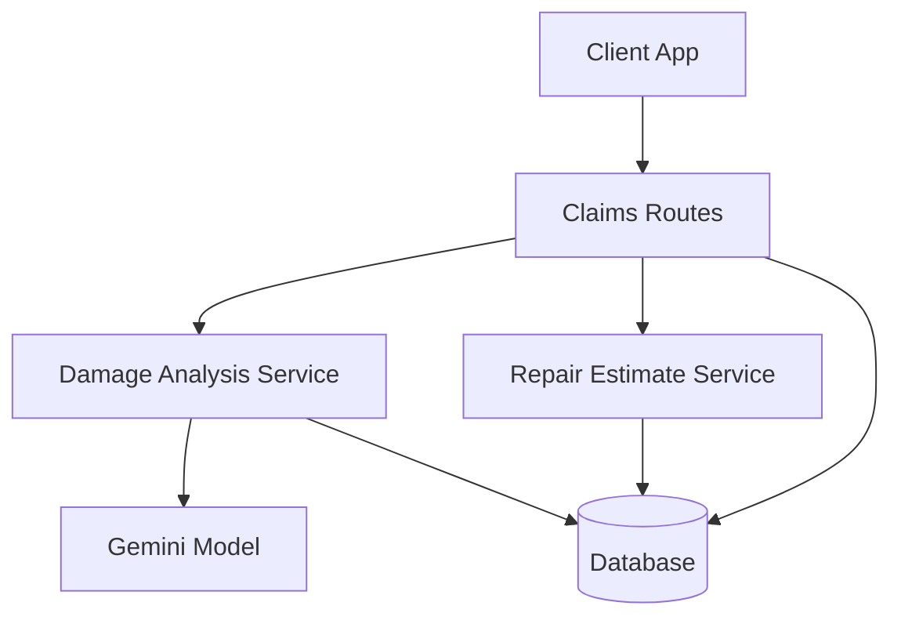
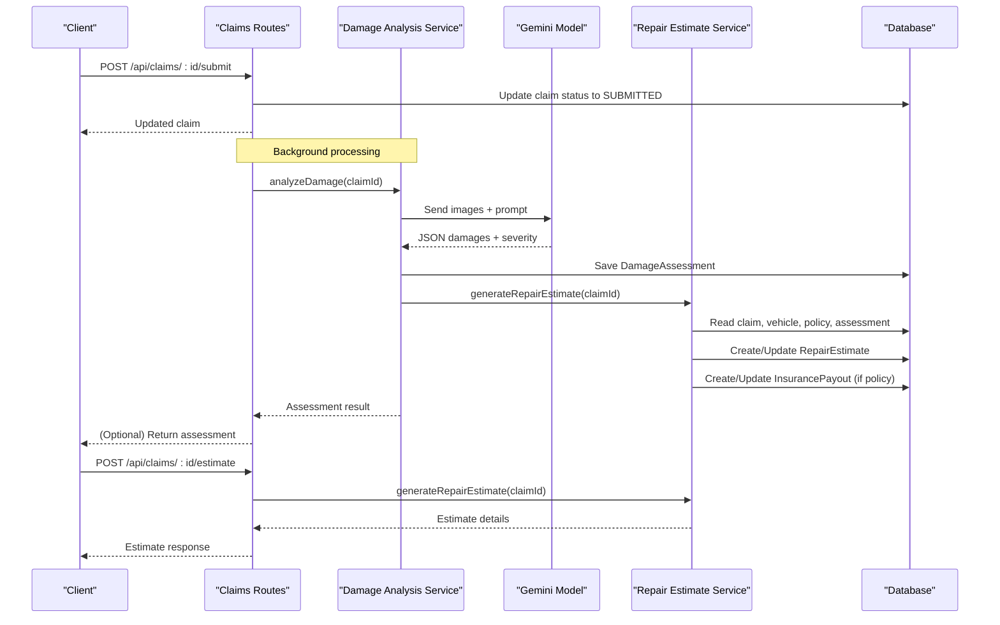
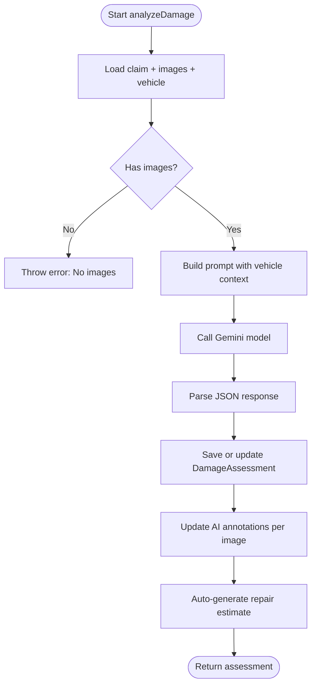
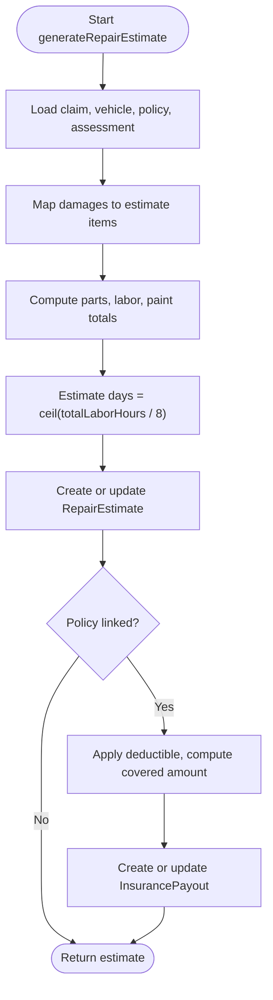
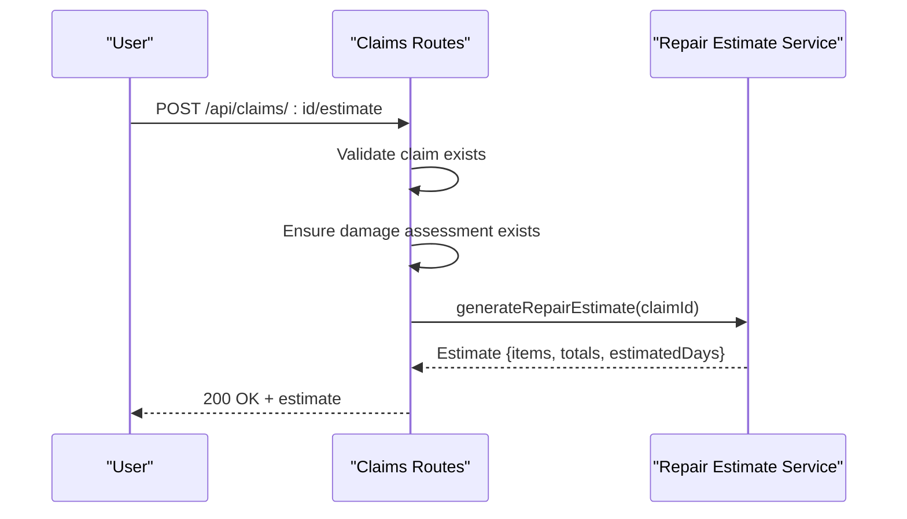
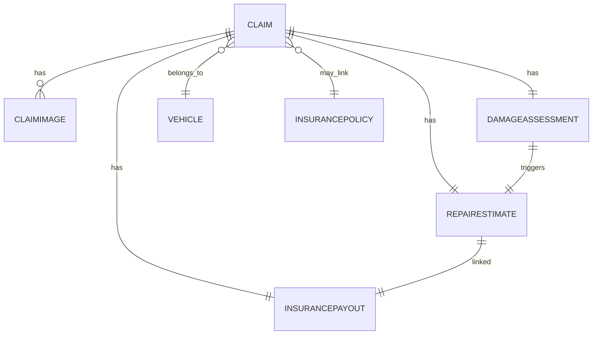
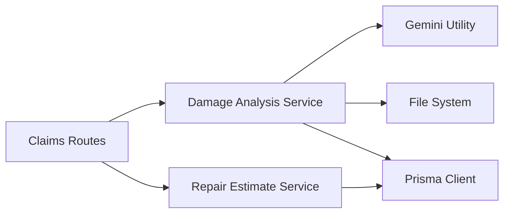

# Repair Cost Estimation Service

<cite>
**Referenced Files in This Document**
- [repairEstimateService.ts](file://backend/src/services/repairEstimateService.ts)
- [damageAnalysisService.ts](file://backend/src/services/damageAnalysisService.ts)
- [claims.ts](file://backend/src/routes/claims.ts)
- [schema.prisma](file://backend/prisma/schema.prisma)
- [index.ts (types)](file://backend/src/types/index.ts)
- [gemini.ts](file://backend/src/utils/gemini.ts)
- [index.ts (server)](file://backend/src/index.ts)
</cite>

## Table of Contents
1. [Introduction](#introduction)
2. [Project Structure](#project-structure)
3. [Core Components](#core-components)
4. [Architecture Overview](#architecture-overview)
5. [Detailed Component Analysis](#detailed-component-analysis)
6. [Dependency Analysis](#dependency-analysis)
7. [Performance Considerations](#performance-considerations)
8. [Troubleshooting Guide](#troubleshooting-guide)
9. [Conclusion](#conclusion)
10. [Appendices](#appendices)

## Introduction
This document explains the Repair Cost Estimation Service that calculates repair costs from AI-generated damage assessments. It covers:
- How damage types, severity levels, and affected parts drive cost calculations
- The pricing logic for parts, labor, and paint materials
- Timeline estimation based on total labor hours
- Integration with AI damage analysis and automatic estimate generation
- Manual adjustment capabilities via API endpoints
- Accuracy factors, regional pricing considerations, warranty implications, and dispute resolution processes

## Project Structure
The service is implemented in the backend as a set of services, routes, and data models:
- Services: Damage analysis and repair estimate calculation
- Routes: Claim submission, image upload, damage analysis trigger, and estimate generation
- Data: Prisma schema defines claims, damage assessments, repair estimates, and payouts
- Utilities: Gemini integration for AI analysis

**Diagram sources**
- [claims.ts:152-314](file://backend/src/routes/claims.ts#L152-L314)
- [damageAnalysisService.ts:50-152](file://backend/src/services/damageAnalysisService.ts#L50-L152)
- [repairEstimateService.ts:104-198](file://backend/src/services/repairEstimateService.ts#L104-L198)
- [gemini.ts:6-10](file://backend/src/utils/gemini.ts#L6-L10)
- [schema.prisma:70-159](file://backend/prisma/schema.prisma#L70-L159)

**Section sources**
- [claims.ts:152-314](file://backend/src/routes/claims.ts#L152-L314)
- [damageAnalysisService.ts:50-152](file://backend/src/services/damageAnalysisService.ts#L50-L152)
- [repairEstimateService.ts:104-198](file://backend/src/services/repairEstimateService.ts#L104-L198)
- [schema.prisma:70-159](file://backend/prisma/schema.prisma#L70-L159)
- [gemini.ts:6-10](file://backend/src/utils/gemini.ts#L6-L10)

## Core Components
- Damage Analysis Service: Uses AI to identify damages, classify severity, and annotate images. On success, it automatically generates a repair estimate.
- Repair Estimate Service: Translates AI damage items into itemized cost estimates using internal pricing tables, computes totals, and persists results.
- Claims Routes: Expose endpoints to submit claims, upload images, trigger analysis, and generate estimates.
- Data Models: Define relationships between claims, damage assessments, repair estimates, and insurance payouts.

Key responsibilities:
- AI-driven damage identification and severity classification
- Mapping damage to cost categories and labor hours
- Aggregating parts, labor, and paint material costs
- Estimating repair duration in days
- Persisting estimates and optional payout calculations

**Section sources**
- [damageAnalysisService.ts:50-152](file://backend/src/services/damageAnalysisService.ts#L50-L152)
- [repairEstimateService.ts:5-102](file://backend/src/services/repairEstimateService.ts#L5-L102)
- [claims.ts:270-314](file://backend/src/routes/claims.ts#L270-L314)
- [schema.prisma:118-159](file://backend/prisma/schema.prisma#L118-L159)

## Architecture Overview
End-to-end flow from claim submission to repair estimate:

**Diagram sources**
- [claims.ts:152-193](file://backend/src/routes/claims.ts#L152-L193)
- [claims.ts:270-314](file://backend/src/routes/claims.ts#L270-L314)
- [damageAnalysisService.ts:50-152](file://backend/src/services/damageAnalysisService.ts#L50-L152)
- [repairEstimateService.ts:104-198](file://backend/src/services/repairEstimateService.ts#L104-L198)
- [gemini.ts:6-10](file://backend/src/utils/gemini.ts#L6-L10)
- [schema.prisma:70-159](file://backend/prisma/schema.prisma#L70-L159)

## Detailed Component Analysis

### Damage Analysis Service
- Reads claim images and vehicle context
- Sends images and a structured prompt to the Gemini model
- Parses JSON output containing damages, severity, and drivability assessment
- Persists the assessment and updates per-image annotations
- Automatically triggers repair estimate generation after successful analysis

**Diagram sources**
- [damageAnalysisService.ts:50-152](file://backend/src/services/damageAnalysisService.ts#L50-L152)
- [gemini.ts:6-10](file://backend/src/utils/gemini.ts#L6-L10)

**Section sources**
- [damageAnalysisService.ts:50-152](file://backend/src/services/damageAnalysisService.ts#L50-L152)

### Repair Estimate Service
- Loads claim, vehicle, policy, and damage assessment
- Converts each damage item into an estimate line item:
  - Parts cost range mapped by type and severity
  - Labor hours range mapped by type and severity
  - Labor rate and paint material cost based on severity
  - Subtotal per item = parts + labor + paint materials
- Aggregates totals and estimates repair days from total labor hours
- Persists estimate and optionally calculates insurance payout with deductible

**Diagram sources**
- [repairEstimateService.ts:104-198](file://backend/src/services/repairEstimateService.ts#L104-L198)

**Section sources**
- [repairEstimateService.ts:5-102](file://backend/src/services/repairEstimateService.ts#L5-L102)
- [repairEstimateService.ts:104-198](file://backend/src/services/repairEstimateService.ts#L104-L198)

### API Endpoints for Estimates
- Trigger AI damage analysis: POST /api/claims/:id/analyze
- Generate repair estimate: POST /api/claims/:id/estimate
- Both endpoints require authentication and validate claim existence; estimate generation requires a completed damage assessment.

**Diagram sources**
- [claims.ts:290-314](file://backend/src/routes/claims.ts#L290-L314)
- [repairEstimateService.ts:104-198](file://backend/src/services/repairEstimateService.ts#L104-L198)

**Section sources**
- [claims.ts:270-314](file://backend/src/routes/claims.ts#L270-L314)

### Data Models and Relationships
- Claim links to Vehicle, Policy, Images, DamageAssessment, RepairEstimate, InsurancePayout, Documents, ChatMessages
- DamageAssessment stores damages JSON, overall severity, and raw AI response
- RepairEstimate stores itemized costs, totals, and estimated days
- InsurancePayout stores deductible, covered amount, and estimated payout

**Diagram sources**
- [schema.prisma:70-159](file://backend/prisma/schema.prisma#L70-L159)

**Section sources**
- [schema.prisma:70-159](file://backend/prisma/schema.prisma#L70-L159)

### Types and Interfaces
- DamageItem: type, severity, location, description, affectedParts
- DamageAnalysisResult: damages array, drivability assessment, overall severity
- RepairEstimateItem: damageType, partName, partCost, laborHours, laborRate, laborCost, paintMaterials, subtotal
- RepairEstimateResult: items, totalPartsCost, totalLaborCost, totalCost, estimatedDays

These types ensure consistent data flow between AI outputs, services, and persisted records.

**Section sources**
- [index.ts (types):12-43](file://backend/src/types/index.ts#L12-L43)

## Dependency Analysis
- Claims routes depend on:
  - Damage Analysis Service for AI-based assessment
  - Repair Estimate Service for cost calculation
  - Prisma client for persistence
- Damage Analysis Service depends on:
  - Gemini utility for model access
  - File system to read uploaded images
  - Prisma client for reading/writing assessments and annotations
- Repair Estimate Service depends on:
  - Prisma client for reading claim data and writing estimates/payouts
  - Internal pricing tables for parts/labor ranges and rates

**Diagram sources**
- [claims.ts:1-12](file://backend/src/routes/claims.ts#L1-L12)
- [damageAnalysisService.ts:1-5](file://backend/src/services/damageAnalysisService.ts#L1-L5)
- [repairEstimateService.ts:1-3](file://backend/src/services/repairEstimateService.ts#L1-L3)
- [gemini.ts:1-10](file://backend/src/utils/gemini.ts#L1-L10)

**Section sources**
- [claims.ts:1-12](file://backend/src/routes/claims.ts#L1-L12)
- [damageAnalysisService.ts:1-5](file://backend/src/services/damageAnalysisService.ts#L1-L5)
- [repairEstimateService.ts:1-3](file://backend/src/services/repairEstimateService.ts#L1-L3)
- [gemini.ts:1-10](file://backend/src/utils/gemini.ts#L1-L10)

## Performance Considerations
- Image handling: Reading multiple images and converting to base64 can be memory-intensive; consider streaming or resizing where possible.
- AI latency: Gemini calls are asynchronous; background processing avoids blocking user requests.
- Database writes: Batch operations and minimal queries reduce overhead.
- Estimate computation: Linear mapping per damage item; complexity scales with number of damages.

[No sources needed since this section provides general guidance]

## Troubleshooting Guide
Common issues and resolutions:
- No images to analyze: Ensure at least one image is uploaded before submitting or analyzing.
- Damage analysis parse failure: If Gemini returns unexpected format, the service falls back to a safe default and logs the error.
- Missing damage assessment: Estimate generation requires a prior successful damage analysis.
- Policy not linked: Insurance payout calculation is skipped if no policy is associated with the claim.

Operational checks:
- Verify environment variables for database URL and Gemini API key
- Confirm uploads directory is accessible and served statically
- Check error handler middleware is active for centralized error responses

**Section sources**
- [damageAnalysisService.ts:60-62](file://backend/src/services/damageAnalysisService.ts#L60-L62)
- [damageAnalysisService.ts:85-103](file://backend/src/services/damageAnalysisService.ts#L85-L103)
- [claims.ts:290-314](file://backend/src/routes/claims.ts#L290-L314)
- [index.ts (server):16-40](file://backend/src/index.ts#L16-L40)

## Conclusion
The Repair Cost Estimation Service integrates AI-powered damage assessment with deterministic cost modeling to produce accurate, itemized repair estimates and timelines. It supports automatic estimate generation upon successful AI analysis and exposes manual controls via API endpoints. While current pricing uses internal tables, the design allows future expansion to incorporate market-rate databases, regional adjustments, and advanced warranty/dispute workflows.

[No sources needed since this section summarizes without analyzing specific files]

## Appendices

### Cost Calculation Algorithms
- Parts cost: Determined by damage type and severity using predefined ranges; midpoint used for single-value estimates.
- Labor hours: Determined by damage type and severity using predefined ranges; half-midpoint applied to derive hours per item.
- Labor rate: Based on severity level.
- Paint materials: Based on severity level.
- Subtotal per item: Sum of parts, labor, and paint materials.
- Totals: Aggregate across all items; estimated days derived from total labor hours divided by standard daily capacity.

Examples of cost breakdowns (conceptual):
- Dent (MODERATE): Minimal parts cost, moderate labor hours, paint materials included; subtotal reflects combined costs.
- Broken light (SEVERE): Higher parts cost for headlight/taillight variants, higher labor hours, elevated paint materials; subtotal increases accordingly.
- Structural damage (SEVERE): Significant parts and labor ranges; high labor hours lead to longer estimated repair days.

[No sources needed since this section provides conceptual examples]

### Pricing Database Integration
Current implementation uses internal pricing tables within the service. To integrate external market rates:
- Introduce a pricing service layer that fetches up-to-date rates by make/model/year and region
- Extend damage type mappings to include vendor-specific part identifiers
- Add regional multipliers for labor and materials
- Cache frequent lookups to reduce latency

[No sources needed since this section proposes enhancements]

### Timeline Estimation
- Estimated days calculated as ceiling of total labor hours divided by standard daily capacity (8 hours).
- Complexity drivers: Number of damages, severity levels, and affected parts influence total labor hours.

[No sources needed since this section explains existing logic]

### Integration with Damage Assessment Results
- Automatic generation: After successful AI analysis, the system creates or updates the repair estimate.
- Manual generation: Clients can call the estimate endpoint to regenerate estimates when needed.

**Section sources**
- [damageAnalysisService.ts:144-150](file://backend/src/services/damageAnalysisService.ts#L144-L150)
- [claims.ts:290-314](file://backend/src/routes/claims.ts#L290-L314)

### Manual Adjustment Capabilities
- Current endpoints support generating estimates but do not expose direct fields for manual adjustments.
- Recommended approach:
  - Add endpoints to adjust item-level costs or labor hours
  - Persist adjustments with audit metadata
  - Recalculate totals and estimated days after adjustments

[No sources needed since this section proposes enhancements]

### Accuracy Factors
- Severity classification accuracy from AI impacts cost ranges and labor hours
- Quality of images affects damage detection completeness
- Internal pricing tables should be periodically reviewed against market rates
- Regional variations can be introduced via multipliers or localized rate tables

[No sources needed since this section provides general guidance]

### Warranty Considerations
- If repairs involve manufacturer warranties, exclude certain parts or labor from customer responsibility
- Adjust coverage calculations based on warranty terms stored in policy or external systems
- Flag warranty-covered items in estimate items for transparency

[No sources needed since this section provides general guidance]

### Dispute Resolution Processes
- Store AI raw responses and assessment metadata for traceability
- Allow manual review and override of estimates with justification notes
- Maintain version history for estimates and payouts to support audits
- Provide endpoints to log disputes and outcomes

[No sources needed since this section provides general guidance]