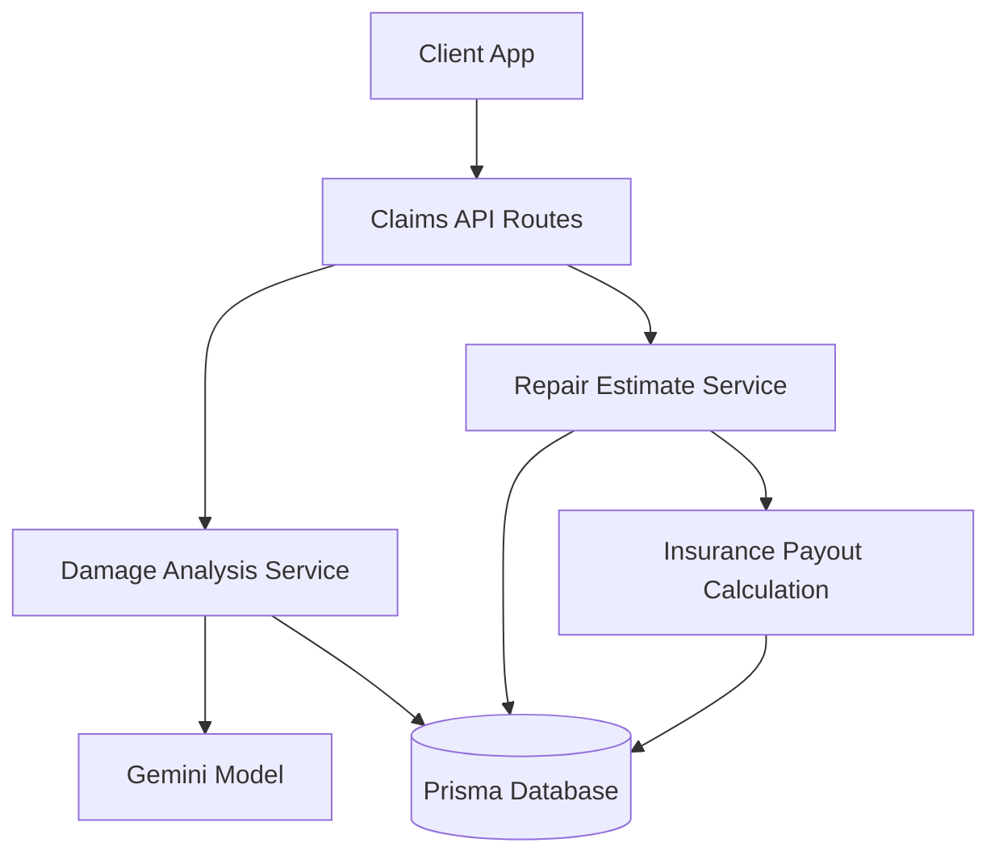
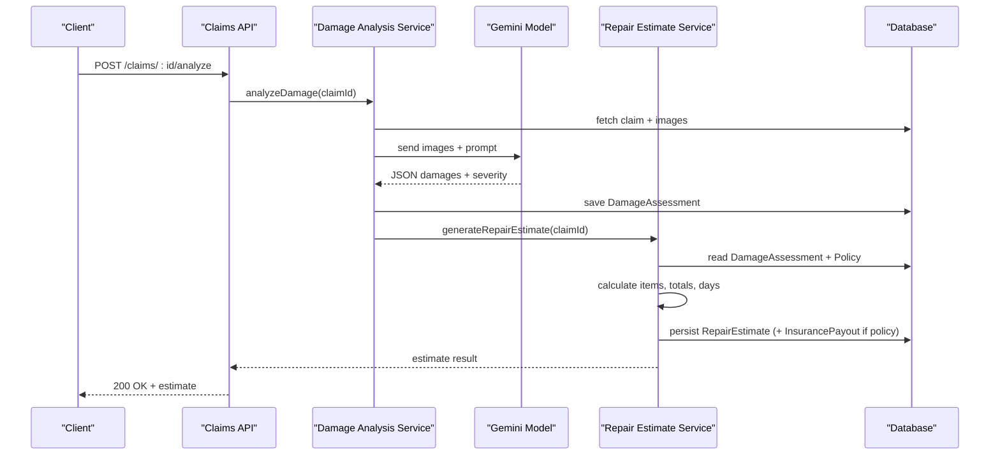

# Repair Estimate Service

<cite>
**Referenced Files in This Document**
- [repairEstimateService.ts](file://backend/src/services/repairEstimateService.ts)
- [damageAnalysisService.ts](file://backend/src/services/damageAnalysisService.ts)
- [claims.ts](file://backend/src/routes/claims.ts)
- [admin.ts](file://backend/src/routes/admin.ts)
- [index.ts (types)](file://backend/src/types/index.ts)
- [schema.prisma](file://backend/prisma/schema.prisma)
- [gemini.ts](file://backend/src/utils/gemini.ts)
</cite>

## Table of Contents
1. [Introduction](#introduction)
2. [Project Structure](#project-structure)
3. [Core Components](#core-components)
4. [Architecture Overview](#architecture-overview)
5. [Detailed Component Analysis](#detailed-component-analysis)
6. [Dependency Analysis](#dependency-analysis)
7. [Performance Considerations](#performance-considerations)
8. [Troubleshooting Guide](#troubleshooting-guide)
9. [Conclusion](#conclusion)
10. [Appendices](#appendices)

## Introduction
This document explains the AI-powered repair estimate service that generates cost estimates for vehicle damage repairs. It covers how the system analyzes damage assessments, calculates parts and labor costs, applies business rules, and integrates with the claim workflow to produce accurate repair quotes. It also documents the estimate breakdown structure, confidence considerations, and extensibility points for customizing pricing algorithms and adding cost factors.

## Project Structure
The repair estimate functionality is implemented in the backend as a service layer integrated into the claims API:
- Damage analysis uses an AI model to identify damages from images and store structured results.
- The repair estimate service consumes those results to compute itemized costs and totals.
- Routes expose endpoints to trigger analysis and generate estimates.
- Prisma schema defines the data models for claims, damage assessments, repair estimates, and payouts.

**Diagram sources**
- [claims.ts:270-314](file://backend/src/routes/claims.ts#L270-L314)
- [damageAnalysisService.ts:50-152](file://backend/src/services/damageAnalysisService.ts#L50-L152)
- [repairEstimateService.ts:104-198](file://backend/src/services/repairEstimateService.ts#L104-L198)
- [gemini.ts:6-9](file://backend/src/utils/gemini.ts#L6-L9)
- [schema.prisma:71-160](file://backend/prisma/schema.prisma#L71-L160)

**Section sources**
- [claims.ts:270-314](file://backend/src/routes/claims.ts#L270-L314)
- [damageAnalysisService.ts:50-152](file://backend/src/services/damageAnalysisService.ts#L50-L152)
- [repairEstimateService.ts:104-198](file://backend/src/services/repairEstimateService.ts#L104-L198)
- [schema.prisma:71-160](file://backend/prisma/schema.prisma#L71-L160)

## Core Components
- Damage Analysis Service: Reads claim images, invokes AI to detect and classify damage, stores assessment results, and auto-triggers estimate generation.
- Repair Estimate Service: Converts AI-detected damages into itemized cost estimates using internal lookup tables for parts ranges, labor hours, labor rates, and paint materials; aggregates totals; persists estimates and optional payout calculations.
- Claims API: Exposes endpoints to submit claims, upload images, run damage analysis, and generate estimates.
- Data Models: Prisma schema defines Claim, DamageAssessment, RepairEstimate, InsurancePayout, and related entities.

Key responsibilities:
- AI-driven damage detection and severity classification.
- Deterministic cost calculation based on severity and damage type.
- Aggregation of parts, labor, and materials into total cost and estimated repair days.
- Optional insurance payout estimation based on policy deductible.

**Section sources**
- [damageAnalysisService.ts:50-152](file://backend/src/services/damageAnalysisService.ts#L50-L152)
- [repairEstimateService.ts:4-102](file://backend/src/services/repairEstimateService.ts#L4-L102)
- [claims.ts:270-314](file://backend/src/routes/claims.ts#L270-L314)
- [schema.prisma:71-160](file://backend/prisma/schema.prisma#L71-L160)

## Architecture Overview
The end-to-end flow starts when a claim is submitted or analyzed, proceeds through AI-based damage assessment, and culminates in a deterministic repair estimate with totals and optional payout information.

**Diagram sources**
- [claims.ts:270-314](file://backend/src/routes/claims.ts#L270-L314)
- [damageAnalysisService.ts:50-152](file://backend/src/services/damageAnalysisService.ts#L50-L152)
- [repairEstimateService.ts:104-198](file://backend/src/services/repairEstimateService.ts#L104-L198)
- [gemini.ts:6-9](file://backend/src/utils/gemini.ts#L6-L9)
- [schema.prisma:71-160](file://backend/prisma/schema.prisma#L71-L160)

## Detailed Component Analysis

### Damage Analysis Service
Responsibilities:
- Retrieve claim and associated images.
- Prepare image payloads and context (vehicle details).
- Invoke AI model with a strict JSON output schema describing damages, severity, and drivability assessment.
- Persist the assessment and annotate images with relevant AI annotations.
- Auto-trigger repair estimate generation after successful assessment.

Error handling:
- If no images exist, returns an error.
- If AI response parsing fails, falls back to a minimal assessment and logs the failure.

Integration points:
- Uses the Gemini utility to obtain a configured model instance.
- Persists results via Prisma and updates image annotations.

**Section sources**
- [damageAnalysisService.ts:50-152](file://backend/src/services/damageAnalysisService.ts#L50-L152)
- [gemini.ts:6-9](file://backend/src/utils/gemini.ts#L6-L9)

### Repair Estimate Service
Cost calculation algorithm:
- For each detected damage item, selects a configuration by damage type and severity.
- Determines parts cost range and labor hour range based on severity and specific part keywords.
- Applies severity-based labor rate and paint material cost.
- Computes per-item subtotal as parts + labor + paint materials.
- Aggregates totals across all items and estimates repair days based on total labor hours.

Business rules:
- Labor rates and paint materials vary by severity levels.
- Parts and labor ranges are defined per damage type and severity.
- Estimated days are derived from total labor hours divided by a standard daily capacity.

Persistence and payout:
- Creates or updates a RepairEstimate record linked to the claim and damage assessment.
- If a policy is attached, computes covered amount after deductible and persists InsurancePayout.

Extensibility:
- Lookup tables for parts/labor ranges, labor rates, and paint materials can be extended to support additional damage types, regional multipliers, or vendor-specific pricing.

**Section sources**
- [repairEstimateService.ts:4-102](file://backend/src/services/repairEstimateService.ts#L4-L102)
- [repairEstimateService.ts:104-198](file://backend/src/services/repairEstimateService.ts#L104-L198)

### Claims API Endpoints
- Analyze endpoint triggers AI damage analysis and returns the assessment.
- Estimate endpoint requires a completed damage assessment and returns the generated estimate.
- Submit endpoint transitions claim status and initiates background damage analysis.

Validation and errors:
- Ensures required fields and existence of images before submission.
- Returns appropriate error responses for missing resources or invalid states.

**Section sources**
- [claims.ts:152-193](file://backend/src/routes/claims.ts#L152-L193)
- [claims.ts:270-314](file://backend/src/routes/claims.ts#L270-L314)

### Data Models and Relationships
- Claim links to Vehicle, Policy, Images, DamageAssessment, RepairEstimate, InsurancePayout, Documents, and ChatMessages.
- DamageAssessment stores AI-detected damages and overall severity.
- RepairEstimate stores itemized costs, totals, and estimated days.
- InsurancePayout stores deductible, covered amount, and estimated payout.

These relationships enable end-to-end traceability from images to assessments to estimates and payouts.

**Section sources**
- [schema.prisma:71-160](file://backend/prisma/schema.prisma#L71-L160)

## Dependency Analysis
- Damage Analysis depends on:
  - Prisma client for reading/writing claim and image data.
  - Gemini utility for AI model access.
  - Filesystem utilities to read image files for base64 encoding.
- Repair Estimate depends on:
  - Prisma client for reading claim, damage assessment, and policy data.
  - Internal lookup tables for cost ranges, labor rates, and paint materials.
- Claims API depends on both services and enforces state transitions and input validation.

Potential coupling:
- Tight coupling between damage types/severity and cost lookup tables; changes in AI output must align with supported categories.
- Estimation logic assumes standardized severity values and damage type strings.

External integrations:
- Gemini API key configuration via environment variables.
- SQLite database via Prisma.

**Section sources**
- [damageAnalysisService.ts:50-152](file://backend/src/services/damageAnalysisService.ts#L50-L152)
- [repairEstimateService.ts:4-102](file://backend/src/services/repairEstimateService.ts#L4-L102)
- [gemini.ts:6-9](file://backend/src/utils/gemini.ts#L6-L9)
- [schema.prisma:71-160](file://backend/prisma/schema.prisma#L71-L160)

## Performance Considerations
- Image processing: Reading and encoding multiple images per claim may impact latency; consider caching or optimizing file I/O.
- AI calls: Network-bound; ensure retries and timeouts are handled at the application level.
- Estimation computation: Linear over number of damages; negligible overhead compared to AI call.
- Database writes: Batch operations where possible; current implementation performs sequential reads/writes which is acceptable for typical claim sizes.

[No sources needed since this section provides general guidance]

## Troubleshooting Guide
Common issues and resolutions:
- No images uploaded: Ensure at least one image is attached before submitting or analyzing.
- Missing damage assessment: Estimate generation requires a prior successful damage analysis.
- AI parsing failures: If the model response cannot be parsed, the system falls back to a minimal assessment; review logs and refine prompts or model settings.
- Policy not linked: Payout calculation only runs if a policy is associated with the claim.

Operational checks:
- Verify environment variables for AI API keys.
- Confirm database connectivity and Prisma client initialization.
- Validate that damage types and severities match expected enums and categories.

**Section sources**
- [claims.ts:152-193](file://backend/src/routes/claims.ts#L152-L193)
- [claims.ts:270-314](file://backend/src/routes/claims.ts#L270-L314)
- [damageAnalysisService.ts:85-103](file://backend/src/services/damageAnalysisService.ts#L85-L103)
- [repairEstimateService.ts:104-116](file://backend/src/services/repairEstimateService.ts#L104-L116)

## Conclusion
The repair estimate service combines AI-driven damage detection with deterministic business rules to produce itemized cost estimates. It supports severity-based adjustments, aggregate totals, and optional payout calculations. The design allows for extensibility to incorporate regional pricing, vendor-specific parts databases, and additional cost factors while maintaining clear separation between AI analysis and cost computation.

[No sources needed since this section summarizes without analyzing specific files]

## Appendices

### Estimate Breakdown Structure
Each estimate includes:
- Items: Array of line items with damage type, part name, parts cost, labor hours, labor rate, labor cost, paint materials, and subtotal.
- Totals: Total parts cost, total labor cost (including paint materials), total cost.
- Estimated days: Derived from total labor hours.
- Optional payout: Deductible, covered amount, and estimated payout when a policy is linked.

Data types used:
- DamageItem: type, severity, location, description, affectedParts.
- RepairEstimateItem: damageType, partName, partCost, laborHours, laborRate, laborCost, paintMaterials, subtotal.
- RepairEstimateResult: items, totalPartsCost, totalLaborCost, totalCost, estimatedDays.

**Section sources**
- [index.ts:12-43](file://backend/src/types/index.ts#L12-L43)
- [repairEstimateService.ts:74-102](file://backend/src/services/repairEstimateService.ts#L74-L102)
- [repairEstimateService.ts:120-127](file://backend/src/services/repairEstimateService.ts#L120-L127)

### Cost Calculation Algorithms
- Parts cost: Midpoint of severity-specific or type-specific parts range.
- Labor hours: Midpoint of severity-specific or type-specific labor hour range, halved and rounded.
- Labor cost: Labor hours multiplied by severity-based labor rate.
- Paint materials: Fixed amount based on severity.
- Subtotal: Sum of parts cost, labor cost, and paint materials.
- Totals: Aggregated across all items; estimated days computed from total labor hours.

**Diagram sources**
- [repairEstimateService.ts:60-102](file://backend/src/services/repairEstimateService.ts#L60-L102)
- [repairEstimateService.ts:120-127](file://backend/src/services/repairEstimateService.ts#L120-L127)

**Section sources**
- [repairEstimateService.ts:60-102](file://backend/src/services/repairEstimateService.ts#L60-L102)
- [repairEstimateService.ts:120-127](file://backend/src/services/repairEstimateService.ts#L120-L127)

### Integration Points and Extensibility
- Automotive parts databases: Extend the parts cost ranges to reflect real-time or vendor-specific pricing by integrating external APIs or database lookups keyed by make/model/year and part identifiers.
- Regional pricing adjustments: Introduce a region multiplier or localized rate table applied to labor rates and parts costs before aggregation.
- Additional cost factors: Add line items for shop fees, environmental fees, or taxes by extending the estimate calculation and persistence structures.
- Manual adjustment capabilities: Admin routes allow reviewing claims and estimates; future enhancements could include admin overrides for parts/labor rates or manual line item edits.

Current integration points:
- AI model via Gemini utility.
- Database via Prisma for persistent storage of assessments, estimates, and payouts.

**Section sources**
- [gemini.ts:6-9](file://backend/src/utils/gemini.ts#L6-L9)
- [schema.prisma:71-160](file://backend/prisma/schema.prisma#L71-L160)
- [admin.ts:80-103](file://backend/src/routes/admin.ts#L80-L103)

### Confidence Levels and Accuracy Factors
- Confidence indicators:
  - Overall severity from AI assessment indicates broad categorization but does not quantify confidence.
  - Drivability assessment provides operational context but not numerical confidence.
- Factors affecting accuracy:
  - Quality and clarity of images.
  - Alignment between AI-detected damage types/severity and internal cost categories.
  - Completeness of vehicle context (make/model/year/color) provided to the AI.
  - Currency and granularity of parts/labor lookup tables.
- Recommendations:
  - Enforce minimum image requirements and quality checks.
  - Periodically validate AI outputs against known repair scenarios.
  - Expand lookup tables with regional and vendor-specific data.
  - Implement explicit confidence scoring in AI responses and propagate it to estimates.

[No sources needed since this section provides general guidance]

### API Reference Summary
- POST /api/claims/:id/analyze: Triggers AI damage analysis and returns assessment.
- POST /api/claims/:id/estimate: Generates repair estimate based on existing damage assessment.
- GET /api/claims/:id: Retrieves full claim details including estimate and payout.

Authentication:
- All routes are protected by authentication middleware.

**Section sources**
- [claims.ts:270-314](file://backend/src/routes/claims.ts#L270-L314)
- [claims.ts:85-112](file://backend/src/routes/claims.ts#L85-L112)