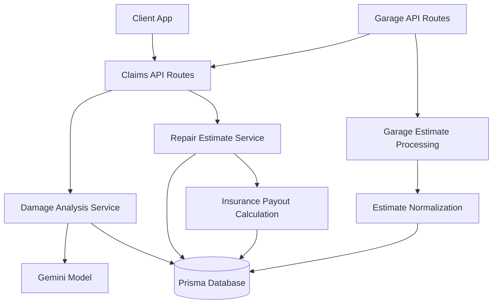
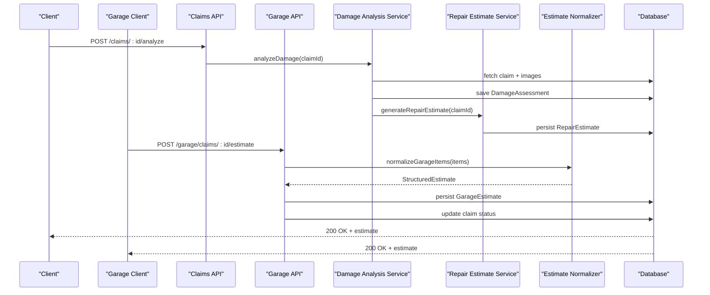
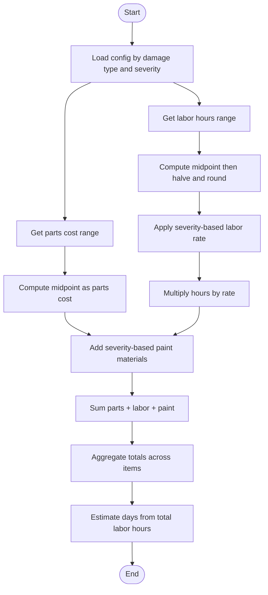

# Repair Estimate Service

<cite>
**Referenced Files in This Document**
- [repairEstimateService.ts](file://backend/src/services/repairEstimateService.ts)
- [damageAnalysisService.ts](file://backend/src/services/damageAnalysisService.ts)
- [claims.ts](file://backend/src/routes/claims.ts)
- [garage.ts](file://backend/src/routes/garage.ts)
- [admin.ts](file://backend/src/routes/admin.ts)
- [index.ts (types)](file://backend/src/types/index.ts)
- [index.ts (frontend types)](file://frontend/src/types/index.ts)
- [garageEstimate.ts](file://frontend/src/utils/garageEstimate.ts)
- [GarageClaimDetailPage.tsx](file://frontend/src/pages/garage/GarageClaimDetailPage.tsx)
- [schema.prisma](file://backend/prisma/schema.prisma)
- [gemini.ts](file://backend/src/utils/gemini.ts)
</cite>

## Update Summary
**Changes Made**
- Enhanced garage estimate format compatibility with normalized data structures
- Added editable estimate date functionality with date picker components
- Implemented improved validation ensuring at least one cost line exists (parts, labor hours, or paint materials)
- Enhanced display logic showing both estimate date and submission timestamp for comprehensive context
- Updated type definitions to support flexible estimate item structures

## Table of Contents
1. [Introduction](#introduction)
2. [Project Structure](#project-structure)
3. [Core Components](#core-components)
4. [Architecture Overview](#architecture-overview)
5. [Detailed Component Analysis](#detailed-component-analysis)
6. [Dependency Analysis](#dependency-analysis)
7. [Performance Considerations](#performance-considerations)
8. [Troubleshooting Guide](#troubleshooting-guide)
9. [Conclusion](#conclusion)
10. [Appendices](#appendices)

## Introduction
This document explains the AI-powered repair estimate service that generates cost estimates for vehicle damage repairs. The system has been enhanced with improved data structures, editable estimate dates, and better validation mechanisms, enabling seamless integration between AI-generated estimates and manual garage submissions. It covers how the system analyzes damage assessments, calculates parts and labor costs, applies business rules, and integrates with the claim workflow to produce accurate repair quotes. It also documents the estimate breakdown structure, confidence considerations, and extensibility points for customizing pricing algorithms and adding cost factors.

## Project Structure
The repair estimate functionality is implemented across both backend services and frontend utilities, providing a unified approach to estimate generation and processing:

**Backend Services:**
- Damage analysis uses an AI model to identify damages from images and store structured results
- The repair estimate service consumes those results to compute itemized costs and totals
- Garage estimate endpoints handle manual estimate submissions with flexible data structures and enhanced validation
- Routes expose endpoints to trigger analysis, generate estimates, and process garage submissions

**Frontend Utilities:**
- Normalization utilities handle both legacy and current estimate formats
- Type definitions support flexible estimate item structures
- Integration with both AI and garage estimate workflows
- Enhanced date picker components for editable estimate dates

**Diagram sources**
- [claims.ts:270-314](file://backend/src/routes/claims.ts#L270-L314)
- [garage.ts:67-133](file://backend/src/routes/garage.ts#L67-L133)
- [damageAnalysisService.ts:50-152](file://backend/src/services/damageAnalysisService.ts#L50-L152)
- [repairEstimateService.ts:104-198](file://backend/src/services/repairEstimateService.ts#L104-L198)
- [garageEstimate.ts:17-48](file://frontend/src/utils/garageEstimate.ts#L17-L48)

**Section sources**
- [claims.ts:270-314](file://backend/src/routes/claims.ts#L270-L314)
- [garage.ts:67-133](file://backend/src/routes/garage.ts#L67-L133)
- [damageAnalysisService.ts:50-152](file://backend/src/services/damageAnalysisService.ts#L50-L152)
- [repairEstimateService.ts:104-198](file://backend/src/services/repairEstimateService.ts#L104-L198)
- [garageEstimate.ts:17-48](file://frontend/src/utils/garageEstimate.ts#L17-L48)
- [schema.prisma:71-256](file://backend/prisma/schema.prisma#L71-L256)

## Core Components
- **Damage Analysis Service**: Reads claim images, invokes AI to detect and classify damage, stores assessment results, and auto-triggers estimate generation
- **Repair Estimate Service**: Converts AI-detected damages into itemized cost estimates using internal lookup tables for parts ranges, labor hours, labor rates, and paint materials; aggregates totals; persists estimates and optional payout calculations
- **Garage Estimate Processing**: Handles manual estimate submissions from garages with flexible data structure support, automatic normalization, and enhanced validation
- **Estimate Normalization Utilities**: Provides compatibility between legacy and current estimate formats, ensuring consistent processing regardless of source
- **Claims API**: Exposes endpoints to submit claims, upload images, run damage analysis, and generate estimates
- **Data Models**: Prisma schema defines Claim, DamageAssessment, RepairEstimate, InsurancePayout, GarageEstimate, and related entities

Key responsibilities:
- AI-driven damage detection and severity classification
- Deterministic cost calculation based on severity and damage type
- Flexible estimate format support for both AI and garage submissions
- Aggregation of parts, labor, and materials into total cost and estimated repair days
- Optional insurance payout estimation based on policy deductible
- Enhanced validation ensuring complete estimate submissions

**Section sources**
- [damageAnalysisService.ts:50-152](file://backend/src/services/damageAnalysisService.ts#L50-L152)
- [repairEstimateService.ts:4-102](file://backend/src/services/repairEstimateService.ts#L4-L102)
- [garage.ts:67-133](file://backend/src/routes/garage.ts#L67-L133)
- [garageEstimate.ts:17-48](file://frontend/src/utils/garageEstimate.ts#L17-L48)
- [claims.ts:270-314](file://backend/src/routes/claims.ts#L270-L314)
- [schema.prisma:71-256](file://backend/prisma/schema.prisma#L71-L256)

## Architecture Overview
The end-to-end flow starts when a claim is submitted or analyzed, proceeds through AI-based damage assessment, and culminates in deterministic repair estimates with totals and optional payout information. The enhanced architecture now supports both AI-generated and garage-submitted estimates with unified processing, editable dates, and improved validation.

**Diagram sources**
- [claims.ts:270-314](file://backend/src/routes/claims.ts#L270-L314)
- [garage.ts:67-133](file://backend/src/routes/garage.ts#L67-L133)
- [damageAnalysisService.ts:50-152](file://backend/src/services/damageAnalysisService.ts#L50-L152)
- [repairEstimateService.ts:104-198](file://backend/src/services/repairEstimateService.ts#L104-L198)
- [garageEstimate.ts:17-48](file://frontend/src/utils/garageEstimate.ts#L17-L48)

## Detailed Component Analysis

### Enhanced Garage Estimate Format Support
**Updated** The system now supports flexible garage estimate formats with automatic normalization for backward compatibility and enhanced validation.

The enhanced garage estimate processing includes:
- **Flexible Data Structures**: Supports both legacy per-item labor/paint storage and current centralized format
- **Automatic Normalization**: Converts various input formats into a standardized `StructuredEstimate` format
- **Type Safety**: Comprehensive TypeScript interfaces for all estimate components
- **Backward Compatibility**: Seamless handling of existing garage estimate data
- **Enhanced Validation**: Ensures at least one cost line exists before submission

Key improvements:
- Legacy format support: `[items]` with per-item `laborHours`, `laborCost`, `paintMaterials`
- Current format support: `{parts, laborHours, laborRate, paintMaterials}`
- Automatic calculation of derived values (labor rate, totals)
- Validation and error handling for malformed data
- Required field validation ensuring complete estimates

**Section sources**
- [garageEstimate.ts:17-48](file://frontend/src/utils/garageEstimate.ts#L17-L48)
- [index.ts:147-186](file://frontend/src/types/index.ts#L147-L186)
- [garage.ts:91-104](file://backend/src/routes/garage.ts#L91-L104)

### Enhanced Frontend Integration with Editable Dates
**Updated** The frontend now seamlessly handles both AI and garage estimates with unified display, editing capabilities, and editable estimate dates.

Key enhancements:
- **Editable Estimate Dates**: Date picker components allow garages to set specific estimate dates
- **Unified Display**: Shows both AI and garage estimates side-by-side for comparison
- **Smart Pre-population**: Automatically loads existing estimates (AI or garage) into edit forms
- **Real-time Calculations**: Updates totals as users modify estimate items
- **Format Flexibility**: Handles both legacy and current estimate formats transparently
- **Enhanced Validation**: Prevents submission without at least one cost line

Features:
- Side-by-side comparison of AI vs garage estimates
- Visual indicators for estimate differences
- Edit mode for garage estimates with real-time validation
- Support for adding custom garage-specific items
- Date picker for editable estimate dates with proper formatting
- Both estimate date and submission timestamp display for comprehensive context

**Section sources**
- [GarageClaimDetailPage.tsx:19-41](file://frontend/src/pages/garage/GarageClaimDetailPage.tsx#L19-L41)
- [GarageClaimDetailPage.tsx:76-94](file://frontend/src/pages/garage/GarageClaimDetailPage.tsx#L76-L94)
- [GarageClaimDetailPage.tsx:198-203](file://frontend/src/pages/garage/GarageClaimDetailPage.tsx#L198-L203)
- [GarageClaimDetailPage.tsx:350-362](file://frontend/src/pages/garage/GarageClaimDetailPage.tsx#L350-L362)

### Enhanced Validation and Submission Process
**Updated** The garage estimate submission endpoint now handles flexible data structures with automatic validation, normalization, and enhanced error handling.

Enhanced features:
- **Flexible Input**: Accepts both legacy array format and current object format
- **Enhanced Validation**: Ensures required fields and data integrity including minimum cost requirements
- **Status Management**: Automatically updates claim status to `GARAGE_ESTIMATED`
- **Error Handling**: Comprehensive error responses for invalid submissions
- **Date Validation**: Validates and processes editable estimate dates

Processing flow:
1. Validate claim exists and belongs to authenticated garage
2. Check for completed AI damage assessment
3. Parse and validate estimate data (supports multiple formats)
4. Validate at least one cost line exists (parts, labor hours, or paint materials)
5. Create or update garage estimate record with editable date
6. Update claim status to reflect garage estimate completion

**Section sources**
- [garage.ts:67-133](file://backend/src/routes/garage.ts#L67-L133)
- [garage.ts:91-115](file://backend/src/routes/garage.ts#L91-L115)

### Enhanced Backend Schema Support
**Updated** The database schema now supports flexible estimate storage with JSON fields for maximum compatibility and editable dates.

Schema enhancements:
- **JSON Storage**: `items` field stored as JSON to support evolving data structures
- **Editable Dates**: `estimateDate` field allows garages to specify specific estimate dates
- **Flexible Fields**: Nullable fields allow for gradual migration between formats
- **Relationship Integrity**: Proper foreign key relationships maintained
- **Audit Trail**: Timestamps track when estimates are created and updated

Benefits:
- No breaking changes during format migration
- Support for future estimate format evolution
- Consistent querying across different estimate types
- Maintained referential integrity
- Enhanced tracking of estimate validity periods

**Section sources**
- [schema.prisma:240-256](file://backend/prisma/schema.prisma#L240-L256)
- [index.ts:234-248](file://frontend/src/types/index.ts#L234-L248)

### Enhanced Data Types and Interfaces
**Updated** Comprehensive type definitions now support both AI-generated and garage-submitted estimates with full type safety and editable date support.

New type definitions include:
- `GarageEstimatePart`: Simplified part representation for garage estimates
- `GarageEstimateItems`: Centralized estimate structure with parts array and aggregate values
- `GarageEstimateItem`: Legacy per-item format with complete cost breakdown
- `StructuredEstimate`: Normalized format for consistent processing
- Enhanced `Claim` interface with optional `garageEstimate` field
- **Editable Date Support**: `estimateDate` field in `GarageEstimate` interface

These types enable:
- Type-safe estimate processing across the application
- Seamless conversion between different estimate formats
- Clear distinction between AI and garage estimates
- Flexible handling of estimate evolution over time
- Support for editable estimate dates with proper validation

**Section sources**
- [index.ts:147-186](file://frontend/src/types/index.ts#L147-L186)
- [index.ts:188-213](file://frontend/src/types/index.ts#L188-L213)
- [index.ts:234-248](file://frontend/src/types/index.ts#L234-L248)

## Dependency Analysis
- **Damage Analysis depends on**:
  - Prisma client for reading/writing claim and image data
  - Gemini utility for AI model access
  - Filesystem utilities to read image files for base64 encoding
- **Repair Estimate depends on**:
  - Prisma client for reading claim, damage assessment, and policy data
  - Internal lookup tables for cost ranges, labor rates, and paint materials
- **Garage Estimate Processing depends on**:
  - Frontend normalization utilities for format compatibility
  - Prisma client for garage estimate persistence
  - Authentication middleware for garage access control
  - Enhanced validation for required fields and data integrity
- **Claims API depends on**:
  - Both services and enforces state transitions and input validation
  - Enhanced support for garage estimate workflows with date handling

Potential coupling:
- Tight coupling between damage types/severity and cost lookup tables
- Estimation logic assumes standardized severity values and damage type strings
- Enhanced flexibility reduces coupling between AI and garage estimate formats
- Date handling maintains separation between estimate dates and submission timestamps

External integrations:
- Gemini API key configuration via environment variables
- SQLite database via Prisma
- Enhanced garage authentication and authorization
- Frontend date picker components for user-friendly date selection

**Section sources**
- [damageAnalysisService.ts:50-152](file://backend/src/services/damageAnalysisService.ts#L50-L152)
- [repairEstimateService.ts:4-102](file://backend/src/services/repairEstimateService.ts#L4-L102)
- [garage.ts:1-163](file://backend/src/routes/garage.ts#L1-L163)
- [garageEstimate.ts:17-48](file://frontend/src/utils/garageEstimate.ts#L17-L48)
- [gemini.ts:6-9](file://backend/src/utils/gemini.ts#L6-L9)
- [schema.prisma:71-256](file://backend/prisma/schema.prisma#L71-L256)

## Performance Considerations
- **Image processing**: Reading and encoding multiple images per claim may impact latency; consider caching or optimizing file I/O
- **AI calls**: Network-bound; ensure retries and timeouts are handled at the application level
- **Estimation computation**: Linear over number of damages; negligible overhead compared to AI call
- **Normalization overhead**: Minimal performance impact from format normalization operations
- **Database writes**: Batch operations where possible; current implementation performs sequential reads/writes which is acceptable for typical claim sizes
- **Enhanced efficiency**: Normalized processing reduces redundant calculations and improves consistency
- **Date handling**: Efficient date parsing and validation with minimal overhead
- **Validation performance**: Client-side validation reduces unnecessary server requests

## Troubleshooting Guide
Common issues and resolutions:
- **No images uploaded**: Ensure at least one image is attached before submitting or analyzing
- **Missing damage assessment**: Estimate generation requires a prior successful damage analysis
- **AI parsing failures**: If the model response cannot be parsed, the system falls back to a minimal assessment; review logs and refine prompts or model settings
- **Policy not linked**: Payout calculation only runs if a policy is associated with the claim
- **Garage estimate format errors**: Use the normalization utilities to handle legacy formats; check for required fields in new formats
- **Authentication issues**: Verify garage authentication tokens and permissions
- **Invalid estimate dates**: Ensure date picker inputs are properly formatted and validated
- **Submission validation errors**: Ensure at least one cost line (parts, labor hours, or paint materials) exists before submission

Operational checks:
- Verify environment variables for AI API keys
- Confirm database connectivity and Prisma client initialization
- Validate that damage types and severities match expected enums and categories
- Test both AI and garage estimate submission flows
- Verify normalization utilities handle edge cases properly
- Test date picker functionality and date validation
- Validate enhanced validation logic for required fields

**Section sources**
- [claims.ts:270-314](file://backend/src/routes/claims.ts#L270-L314)
- [garage.ts:67-133](file://backend/src/routes/garage.ts#L67-L133)
- [damageAnalysisService.ts:85-103](file://backend/src/services/damageAnalysisService.ts#L85-L103)
- [repairEstimateService.ts:104-116](file://backend/src/services/repairEstimateService.ts#L104-L116)
- [garageEstimate.ts:17-48](file://frontend/src/utils/garageEstimate.ts#L17-L48)
- [garage.ts:91-115](file://backend/src/routes/garage.ts#L91-L115)

## Conclusion
The enhanced repair estimate service combines AI-driven damage detection with deterministic business rules to produce itemized cost estimates, while providing seamless integration with garage-submitted estimates. The improved data structures, editable estimate dates, and enhanced validation mechanisms ensure compatibility across different estimate formats, supporting both automated AI processing and manual garage inputs. The system maintains clear separation between AI analysis and cost computation while providing flexible extensibility points for regional pricing, vendor-specific parts databases, and additional cost factors.

## Appendices

### Enhanced Estimate Breakdown Structure
Each estimate now supports multiple formats while maintaining consistent output and editable dates:

**AI-Generated Estimates:**
- Items: Array of line items with damage type, part name, parts cost, labor hours, labor rate, labor cost, paint materials, and subtotal
- Totals: Total parts cost, total labor cost (including paint materials), total cost
- Estimated days: Derived from total labor hours
- Optional payout: Deductible, covered amount, and estimated payout when a policy is linked

**Garage Estimates:**
- Parts: Array of simplified part representations with damage type, part name, and cost
- Labor: Centralized labor hours and rate
- Paint & Materials: Single aggregate value
- Notes: Optional garage-specific notes
- **Editable Dates**: Specific estimate dates set by garages with fallback to submission timestamps
- Status tracking: Submission timestamps and update history

**Normalized Format:**
- Unified `StructuredEstimate` interface for consistent processing
- Automatic conversion between legacy and current formats
- Type-safe handling of all estimate variations
- Support for editable estimate dates

**Section sources**
- [index.ts:12-43](file://backend/src/types/index.ts#L12-L43)
- [index.ts:147-186](file://frontend/src/types/index.ts#L147-L186)
- [index.ts:234-248](file://frontend/src/types/index.ts#L234-L248)
- [repairEstimateService.ts:74-102](file://backend/src/services/repairEstimateService.ts#L74-L102)
- [garageEstimate.ts:8-13](file://frontend/src/utils/garageEstimate.ts#L8-L13)

### Enhanced Cost Calculation Algorithms
**Updated** The cost calculation algorithms now support both AI-generated and garage-submitted estimates with consistent processing and enhanced validation.

**AI-Generated Costs:**
- Parts cost: Midpoint of severity-specific or type-specific parts range
- Labor hours: Midpoint of severity-specific or type-specific labor hour range, halved and rounded
- Labor cost: Labor hours multiplied by severity-based labor rate
- Paint materials: Fixed amount based on severity
- Subtotal: Sum of parts cost, labor cost, and paint materials
- Totals: Aggregated across all items; estimated days computed from total labor hours

**Garage-Submitted Costs:**
- Flexible input formats supported (legacy per-item or current centralized)
- Automatic normalization to standard format
- Real-time calculation of totals and derived values
- Validation and error handling for malformed data
- **Enhanced Validation**: Requires at least one cost line (parts, labor hours, or paint materials)

**Diagram sources**
- [repairEstimateService.ts:60-102](file://backend/src/services/repairEstimateService.ts#L60-L102)
- [garageEstimate.ts:41-48](file://frontend/src/utils/garageEstimate.ts#L41-L48)

**Section sources**
- [repairEstimateService.ts:60-102](file://backend/src/services/repairEstimateService.ts#L60-L102)
- [garageEstimate.ts:41-48](file://frontend/src/utils/garageEstimate.ts#L41-L48)
- [garage.ts:91-104](file://backend/src/routes/garage.ts#L91-L104)

### Enhanced Integration Points and Extensibility
**Updated** The system now provides enhanced integration points for both AI and garage estimate workflows with improved extensibility and date handling.

**Automotive Parts Databases:**
- Extend the parts cost ranges to reflect real-time or vendor-specific pricing by integrating external APIs or database lookups keyed by make/model/year and part identifiers
- Support for both AI-calculated and garage-specified parts pricing
- Flexible pricing strategies for different estimate sources

**Regional Pricing Adjustments:**
- Introduce region multipliers or localized rate tables applied to labor rates and parts costs before aggregation
- Support for different pricing models across regions and estimate types
- Dynamic pricing based on location and estimate source

**Additional Cost Factors:**
- Add line items for shop fees, environmental fees, or taxes by extending the estimate calculation and persistence structures
- Support for garage-specific surcharges and discounts
- Flexible fee structures that can vary by estimate type

**Manual Adjustment Capabilities:**
- Admin routes allow reviewing claims and estimates; enhanced with garage estimate comparison tools
- Support for admin overrides on both AI and garage estimates
- Audit trail for all estimate modifications
- Enhanced date tracking for estimate validity periods

**Current Integration Points:**
- AI model via Gemini utility
- Database via Prisma for persistent storage of assessments, estimates, and payouts
- Enhanced garage authentication and authorization
- Frontend normalization utilities for format compatibility
- Date picker components for user-friendly date selection

**Section sources**
- [gemini.ts:6-9](file://backend/src/utils/gemini.ts#L6-L9)
- [schema.prisma:71-256](file://backend/prisma/schema.prisma#L71-L256)
- [admin.ts:80-103](file://backend/src/routes/admin.ts#L80-L103)
- [garage.ts:1-163](file://backend/src/routes/garage.ts#L1-L163)

### Confidence Levels and Accuracy Factors
**Updated** Enhanced confidence tracking now includes both AI assessment confidence and garage estimate reliability indicators with improved date tracking.

**Confidence Indicators:**
- Overall severity from AI assessment indicates broad categorization but does not quantify confidence
- Drivability assessment provides operational context but not numerical confidence
- Garage estimate submission timestamp and revision history provide reliability indicators
- Comparison between AI and garage estimates highlights potential discrepancies
- **Enhanced Date Tracking**: Editable estimate dates provide context for estimate validity periods

**Factors Affecting Accuracy:**
- Quality and clarity of images used for AI assessment
- Alignment between AI-detected damage types/severity and internal cost categories
- Completeness of vehicle context (make/model/year/color) provided to the AI
- Currency and granularity of parts/labor lookup tables
- Garage expertise and pricing accuracy for manual estimates
- Consistency between AI and garage estimates for validation
- **Enhanced Validation**: Reduced errors through improved form validation and required field checking

**Recommendations:**
- Enforce minimum image requirements and quality checks
- Periodically validate AI outputs against known repair scenarios
- Expand lookup tables with regional and vendor-specific data
- Implement explicit confidence scoring in AI responses and propagate it to estimates
- Track garage estimate accuracy over time for quality metrics
- Provide dispute resolution mechanisms for conflicting estimates
- Utilize editable dates for better estimate lifecycle management

### Enhanced API Reference Summary
**Updated** API endpoints now support both AI-generated and garage-submitted estimates with enhanced data structures, date handling, and improved validation.

**Core Endpoints:**
- `POST /api/claims/:id/analyze`: Triggers AI damage analysis and returns assessment
- `POST /api/claims/:id/estimate`: Generates repair estimate based on existing damage assessment
- `GET /api/claims/:id`: Retrieves full claim details including estimate and payout
- `POST /api/garage/claims/:id/estimate`: Submits or updates garage estimate with flexible data structures and editable dates
- `GET /api/garage/claims`: Lists claims assigned to authenticated garage

**Enhanced Features:**
- Support for both legacy and current estimate formats
- Automatic normalization of garage estimate data
- Real-time comparison between AI and garage estimates
- Enhanced error handling and validation
- Status management for estimate workflows
- **Editable Date Support**: Garages can specify specific estimate dates
- **Enhanced Validation**: Requires at least one cost line before submission

**Authentication:**
- All routes protected by appropriate authentication middleware
- Garage-specific authentication for estimate submission
- Role-based access control for administrative functions

**Section sources**
- [claims.ts:270-314](file://backend/src/routes/claims.ts#L270-L314)
- [claims.ts:85-112](file://backend/src/routes/claims.ts#L85-L112)
- [garage.ts:11-163](file://backend/src/routes/garage.ts#L11-L163)
- [GarageClaimDetailPage.tsx:19-94](file://frontend/src/pages/garage/GarageClaimDetailPage.tsx#L19-L94)