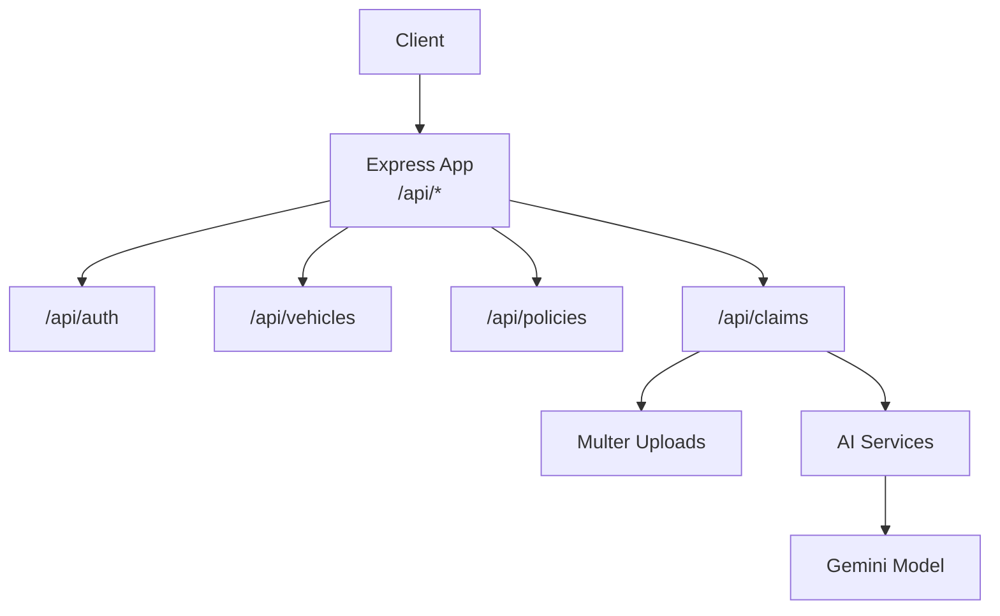
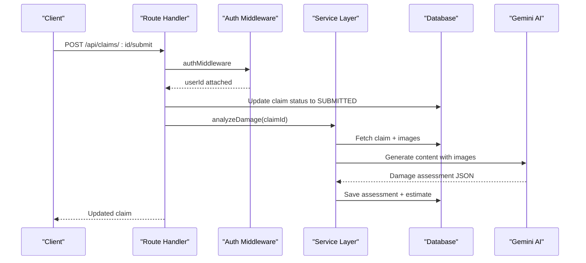
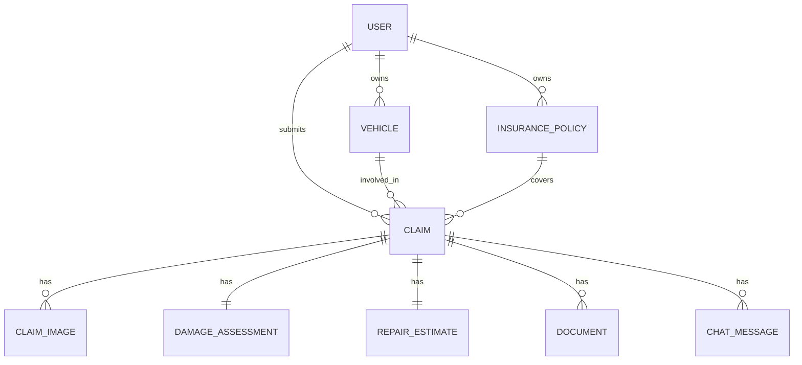
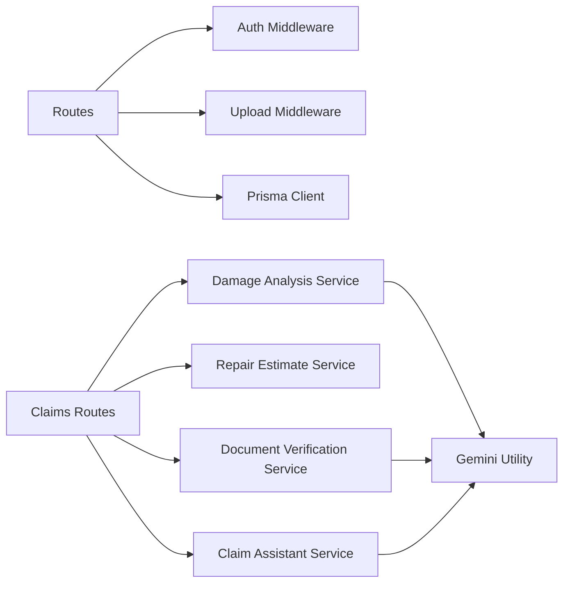
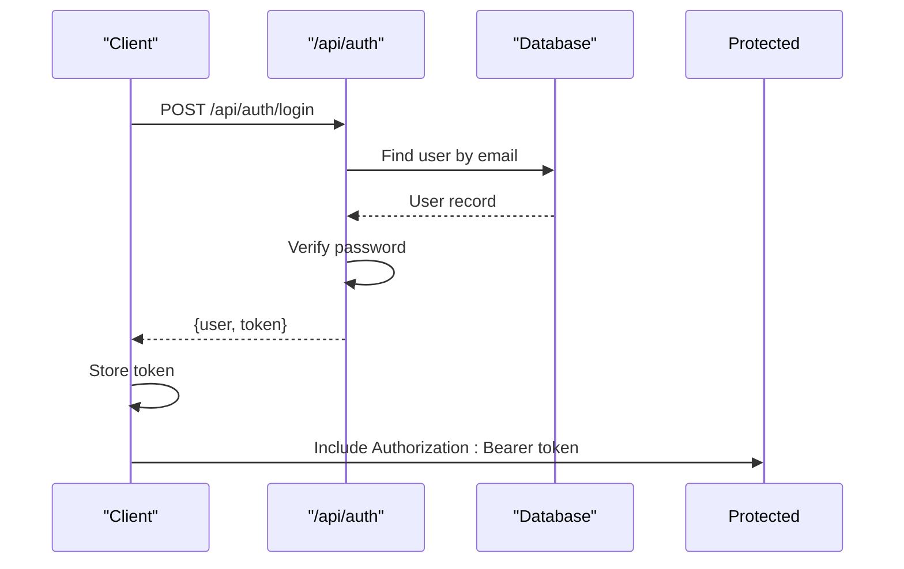
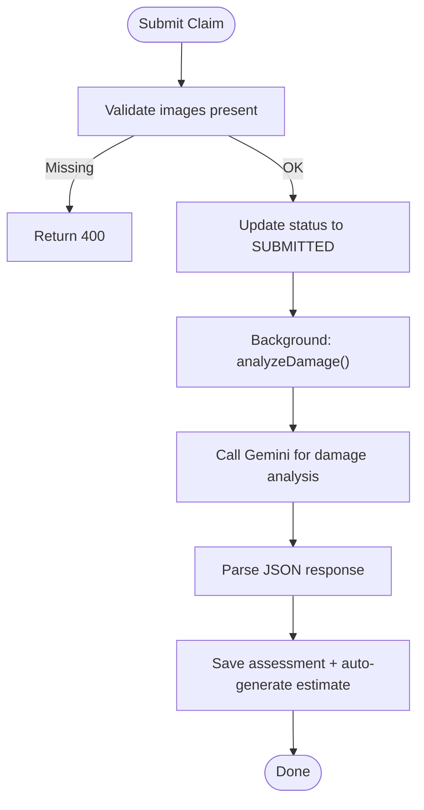

# API Reference

<cite>
**Referenced Files in This Document**
- [index.ts](file://backend/src/index.ts)
- [auth.ts](file://backend/src/routes/auth.ts)
- [vehicles.ts](file://backend/src/routes/vehicles.ts)
- [policies.ts](file://backend/src/routes/policies.ts)
- [claims.ts](file://backend/src/routes/claims.ts)
- [auth.ts](file://backend/src/middleware/auth.ts)
- [upload.ts](file://backend/src/middleware/upload.ts)
- [schema.prisma](file://backend/prisma/schema.prisma)
- [types/index.ts](file://backend/src/types/index.ts)
- [damageAnalysisService.ts](file://backend/src/services/damageAnalysisService.ts)
- [repairEstimateService.ts](file://backend/src/services/repairEstimateService.ts)
- [documentVerificationService.ts](file://backend/src/services/documentVerificationService.ts)
- [claimAssistantService.ts](file://backend/src/services/claimAssistantService.ts)
- [gemini.ts](file://backend/src/utils/gemini.ts)
</cite>

## Table of Contents
1. [Introduction](#introduction)
2. [Project Structure](#project-structure)
3. [Core Components](#core-components)
4. [Architecture Overview](#architecture-overview)
5. [Detailed Component Analysis](#detailed-component-analysis)
6. [Dependency Analysis](#dependency-analysis)
7. [Performance Considerations](#performance-considerations)
8. [Troubleshooting Guide](#troubleshooting-guide)
9. [Conclusion](#conclusion)
10. [Appendices](#appendices)

## Introduction
This document provides a comprehensive REST API reference for the Smart Vehicle Insurance Claim System. It covers authentication, vehicle management, policy management, and end-to-end claim lifecycle endpoints including image/document uploads, AI-powered damage analysis, repair estimates, document verification, and an AI assistant chat. Each endpoint includes HTTP methods, URL patterns, required headers, request/response schemas, error codes, and usage notes. Authentication is JWT-based with Bearer tokens. File uploads are supported via multipart/form-data. No WebSocket endpoints are implemented; real-time-like interactions are provided through synchronous chat endpoints.

## Project Structure
The backend is an Express application that mounts route modules under /api prefixes. Core routes include:
- /api/auth: user registration, login, profile retrieval/update
- /api/vehicles: CRUD for vehicles (authenticated)
- /api/policies: CRUD for insurance policies (authenticated)
- /api/claims: full claim lifecycle including images/documents, status transitions, AI analysis, estimates, and chat

**Diagram sources**
- [index.ts:16-32](file://backend/src/index.ts#L16-L32)
- [claims.ts:195-353](file://backend/src/routes/claims.ts#L195-L353)
- [damageAnalysisService.ts:50-152](file://backend/src/services/damageAnalysisService.ts#L50-L152)
- [gemini.ts:6-10](file://backend/src/utils/gemini.ts#L6-L10)

**Section sources**
- [index.ts:16-32](file://backend/src/index.ts#L16-L32)

## Core Components
- Authentication middleware validates JWT from Authorization header and injects userId into requests.
- Multer middleware handles file uploads for images and documents with size limits and allowed MIME types.
- Prisma ORM models define data schema for users, vehicles, policies, claims, images, assessments, estimates, payouts, documents, and chat messages.
- AI services integrate with Google Generative AI to perform damage analysis, document verification, and provide chat assistance.

**Section sources**
- [auth.ts:5-22](file://backend/src/middleware/auth.ts#L5-L22)
- [upload.ts:17-53](file://backend/src/middleware/upload.ts#L17-L53)
- [schema.prisma:10-201](file://backend/prisma/schema.prisma#L10-L201)
- [damageAnalysisService.ts:50-152](file://backend/src/services/damageAnalysisService.ts#L50-L152)
- [documentVerificationService.ts:41-106](file://backend/src/services/documentVerificationService.ts#L41-L106)
- [claimAssistantService.ts:19-129](file://backend/src/services/claimAssistantService.ts#L19-L129)

## Architecture Overview
The API follows a layered architecture:
- Routes handle HTTP requests, validation, and orchestration
- Middleware enforces authentication and file upload constraints
- Services encapsulate business logic and AI integrations
- Data persistence via Prisma against PostgreSQL

**Diagram sources**
- [claims.ts:152-193](file://backend/src/routes/claims.ts#L152-L193)
- [auth.ts:5-22](file://backend/src/middleware/auth.ts#L5-L22)
- [damageAnalysisService.ts:50-152](file://backend/src/services/damageAnalysisService.ts#L50-L152)

## Detailed Component Analysis

### Authentication
Base path: /api/auth

- Register
  - Method: POST
  - Path: /api/auth/register
  - Headers: Content-Type: application/json
  - Request body: email, password, firstName, lastName, phone (optional), address (optional)
  - Response: 201 Created with user object and token
  - Errors: 400 validation errors, 409 duplicate email, 500 server error

- Login
  - Method: POST
  - Path: /api/auth/login
  - Headers: Content-Type: application/json
  - Request body: email, password
  - Response: 200 OK with user object and token
  - Errors: 400 missing fields, 401 invalid credentials, 500 server error

- Get Profile
  - Method: GET
  - Path: /api/auth/profile
  - Headers: Authorization: Bearer <token>
  - Response: 200 OK with user profile
  - Errors: 401 unauthorized, 404 user not found, 500 server error

- Update Profile
  - Method: PUT
  - Path: /api/auth/profile
  - Headers: Authorization: Bearer <token>, Content-Type: application/json
  - Request body: firstName (optional), lastName (optional), phone (optional), address (optional)
  - Response: 200 OK with updated user profile
  - Errors: 401 unauthorized, 500 server error

Authentication requirements:
- All endpoints except register and login require Authorization: Bearer <JWT>.
- Token is issued on successful register or login with expiration configured in code.

Usage example:
- After login, store the returned token and include it in subsequent requests using the Authorization header.

**Section sources**
- [auth.ts:10-104](file://backend/src/routes/auth.ts#L10-L104)
- [auth.ts:106-163](file://backend/src/routes/auth.ts#L106-L163)
- [auth.ts:5-22](file://backend/src/middleware/auth.ts#L5-L22)

### Vehicles
Base path: /api/vehicles
All endpoints require Authorization: Bearer <token>.

- Create Vehicle
  - Method: POST
  - Path: /api/vehicles
  - Headers: Content-Type: application/json
  - Request body: make, model, year, licensePlate, color, vin (optional), mileage (optional), photos (optional array)
  - Response: 201 Created with vehicle object
  - Errors: 400 validation errors, 500 server error

- List Vehicles
  - Method: GET
  - Path: /api/vehicles
  - Response: 200 OK with array of vehicles including claim counts

- Get Vehicle
  - Method: GET
  - Path: /api/vehicles/:id
  - Response: 200 OK with vehicle details and related claims summary

- Update Vehicle
  - Method: PUT
  - Path: /api/vehicles/:id
  - Headers: Content-Type: application/json
  - Request body: any subset of {make, model, year, vin, licensePlate, color, mileage, photos}
  - Response: 200 OK with updated vehicle

- Delete Vehicle
  - Method: DELETE
  - Path: /api/vehicles/:id
  - Response: 200 OK with success message

Notes:
- VIN is optional at creation but can be updated later.
- Photos field is an array of strings representing stored photo references.

**Section sources**
- [vehicles.ts:13-145](file://backend/src/routes/vehicles.ts#L13-L145)

### Policies
Base path: /api/policies
All endpoints require Authorization: Bearer <token>.

- Create Policy
  - Method: POST
  - Path: /api/policies
  - Headers: Content-Type: application/json
  - Request body: providerName, policyNumber, coverageType, deductible, premiumAmount, startDate, endDate
  - Response: 201 Created with policy object
  - Errors: 400 validation errors, 500 server error

- List Policies
  - Method: GET
  - Path: /api/policies
  - Response: 200 OK with array of policies

- Get Policy
  - Method: GET
  - Path: /api/policies/:id
  - Response: 200 OK with policy details

- Update Policy
  - Method: PUT
  - Path: /api/policies/:id
  - Headers: Content-Type: application/json
  - Request body: any subset of {providerName, policyNumber, coverageType, deductible, premiumAmount, startDate, endDate}
  - Response: 200 OK with updated policy

- Delete Policy
  - Method: DELETE
  - Path: /api/policies/:id
  - Response: 200 OK with success message

Notes:
- Dates are parsed as ISO strings.
- Deductible and premiumAmount are floats.

**Section sources**
- [policies.ts:12-128](file://backend/src/routes/policies.ts#L12-L128)

### Claims
Base path: /api/claims
All endpoints require Authorization: Bearer <token>.

- Create Claim
  - Method: POST
  - Path: /api/claims
  - Headers: Content-Type: application/json
  - Request body: vehicleId, incidentDate, incidentLocation, incidentDescription, policyId (optional), weatherConditions (optional), hasPoliceReport (optional boolean)
  - Response: 201 Created with claim object
  - Errors: 400 validation errors, 404 vehicle not found, 500 server error

- List Claims
  - Method: GET
  - Path: /api/claims?status=<DRAFT|SUBMITTED|UNDER_REVIEW|APPROVED|REJECTED|COMPLETED>
  - Response: 200 OK with array of claims including vehicle info, damage severity, and counts of images/documents

- Get Claim
  - Method: GET
  - Path: /api/claims/:id
  - Response: 200 OK with full claim details including vehicle, policy, images, assessment, estimate, payout, documents, and chat messages

- Update Claim
  - Method: PUT
  - Path: /api/claims/:id
  - Headers: Content-Type: application/json
  - Request body: any subset of {incidentDate, incidentLocation, incidentDescription, weatherConditions, hasPoliceReport, policyId}
  - Constraints: Only allowed when claim status is DRAFT
  - Response: 200 OK with updated claim
  - Errors: 400 if not DRAFT, 404 not found, 500 server error

- Submit Claim
  - Method: POST
  - Path: /api/claims/:id/submit
  - Behavior: Transitions claim to SUBMITTED and triggers background AI damage analysis
  - Validation: Requires at least one uploaded image
  - Response: 200 OK with updated claim
  - Errors: 400 if already submitted or no images, 404 not found, 500 server error

- Upload Images
  - Method: POST
  - Path: /api/claims/:id/images
  - Headers: Content-Type: multipart/form-data
  - Form fields: images (files, up to 10), imageType (optional FULL_VEHICLE or DAMAGE_CLOSEUP), label (optional)
  - Response: 201 Created with created image records
  - Errors: 400 no files or invalid type, 404 not found, 500 server error

- Delete Image
  - Method: DELETE
  - Path: /api/claims/:id/images/:imageId
  - Response: 200 OK with success message
  - Errors: 404 not found, 500 server error

- Trigger AI Damage Analysis
  - Method: POST
  - Path: /api/claims/:id/analyze
  - Behavior: Runs AI damage analysis synchronously and returns assessment
  - Response: 200 OK with damage assessment result
  - Errors: 404 not found, 500 server error

- Generate Repair Estimate
  - Method: POST
  - Path: /api/claims/:id/estimate
  - Behavior: Generates itemized repair estimate based on existing damage assessment
  - Response: 200 OK with estimate including totals and estimated days
  - Errors: 400 if no damage assessment, 404 not found, 500 server error

- Upload Document
  - Method: POST
  - Path: /api/claims/:id/documents
  - Headers: Content-Type: multipart/form-data
  - Form fields: document (single file), documentType (LICENSE|REGISTRATION|ACCIDENT_REPORT|REPAIR_ESTIMATE)
  - Response: 201 Created with document record
  - Errors: 400 invalid type or no file, 404 not found, 500 server error

- List Documents
  - Method: GET
  - Path: /api/claims/:id/documents
  - Response: 200 OK with array of documents sorted by upload time

- Verify Document
  - Method: POST
  - Path: /api/claims/:id/documents/:docId/verify
  - Behavior: Runs AI verification and updates verification status/result
  - Response: 200 OK with verification result
  - Errors: 404 not found, 500 server error

- Get Chat Messages
  - Method: GET
  - Path: /api/claims/:id/chat
  - Response: 200 OK with array of chat messages ordered by time

- Send Chat Message
  - Method: POST
  - Path: /api/claims/:id/chat
  - Headers: Content-Type: application/json
  - Request body: message (string)
  - Behavior: Saves user message, generates AI response, saves assistant message, returns both
  - Response: 200 OK with userMessage and assistantMessage objects
  - Errors: 400 missing message, 404 not found, 500 server error

Notes:
- Status transitions: DRAFT -> SUBMITTED via submit endpoint. Further state changes may occur via internal processes.
- Image types: FULL_VEHICLE or DAMAGE_CLOSEUP influence AI annotations.
- Document types are validated server-side.

**Section sources**
- [claims.ts:20-447](file://backend/src/routes/claims.ts#L20-L447)
- [upload.ts:17-53](file://backend/src/middleware/upload.ts#L17-L53)
- [damageAnalysisService.ts:50-152](file://backend/src/services/damageAnalysisService.ts#L50-L152)
- [repairEstimateService.ts:104-199](file://backend/src/services/repairEstimateService.ts#L104-L199)
- [documentVerificationService.ts:41-106](file://backend/src/services/documentVerificationService.ts#L41-L106)
- [claimAssistantService.ts:19-129](file://backend/src/services/claimAssistantService.ts#L19-L129)

### Data Models and Relationships
Key entities and relationships used across endpoints:

**Diagram sources**
- [schema.prisma:10-201](file://backend/prisma/schema.prisma#L10-L201)

**Section sources**
- [schema.prisma:10-201](file://backend/prisma/schema.prisma#L10-L201)

## Dependency Analysis
- Route modules depend on Prisma client for data access and on auth middleware for authorization.
- Claims routes depend on upload middleware for file handling and on AI services for analysis, estimates, verification, and chat.
- AI services depend on Google Generative AI utility to obtain a model instance.

**Diagram sources**
- [claims.ts:1-15](file://backend/src/routes/claims.ts#L1-L15)
- [auth.ts:5-22](file://backend/src/middleware/auth.ts#L5-L22)
- [upload.ts:17-53](file://backend/src/middleware/upload.ts#L17-L53)
- [damageAnalysisService.ts:1-10](file://backend/src/services/damageAnalysisService.ts#L1-L10)
- [documentVerificationService.ts:1-10](file://backend/src/services/documentVerificationService.ts#L1-L10)
- [claimAssistantService.ts:1-5](file://backend/src/services/claimAssistantService.ts#L1-L5)
- [gemini.ts:6-10](file://backend/src/utils/gemini.ts#L6-L10)

**Section sources**
- [claims.ts:1-15](file://backend/src/routes/claims.ts#L1-L15)
- [auth.ts:5-22](file://backend/src/middleware/auth.ts#L5-L22)
- [upload.ts:17-53](file://backend/src/middleware/upload.ts#L17-L53)
- [gemini.ts:6-10](file://backend/src/utils/gemini.ts#L6-L10)

## Performance Considerations
- File uploads:
  - Max file size is 10 MB per file for both images and documents.
  - Up to 10 images can be uploaded in a single request to the images endpoint.
- AI processing:
  - Damage analysis and document verification call external AI models; responses may be slower. Consider asynchronous workflows for long-running tasks.
  - Background analysis is triggered on claim submission; clients should poll or rely on explicit analyze endpoint for immediate results.
- Database queries:
  - Endpoints use selective includes to reduce payload size. Ensure indexes exist on frequently filtered fields like userId and claimId.
- Rate limiting:
  - No built-in rate limiting is present. Implement at the gateway or application level to protect endpoints from abuse.

[No sources needed since this section provides general guidance]

## Troubleshooting Guide
Common errors and resolutions:
- 401 Unauthorized:
  - Missing or invalid Authorization header. Ensure Bearer token is included and valid.
  - Check token expiration and regeneration flow after login/register.

- 400 Bad Request:
  - Missing required fields in request bodies. Validate payloads before sending.
  - Invalid document type or no files uploaded for multipart endpoints.

- 404 Not Found:
  - Referenced resource (vehicle, policy, claim, image, document) does not exist or belongs to another user.

- 500 Internal Server Error:
  - Unexpected server issues. Check logs for stack traces and ensure environment variables (DATABASE_URL, JWT_SECRET, GEMINI_API_KEY, UPLOAD_DIR) are set correctly.

- AI service failures:
  - If AI parsing fails, fallback responses are used. Retry or manually review affected assets.

Operational checks:
- Health endpoint: GET /api/health returns service status.

**Section sources**
- [auth.ts:5-22](file://backend/src/middleware/auth.ts#L5-L22)
- [claims.ts:195-353](file://backend/src/routes/claims.ts#L195-L353)
- [index.ts:34-40](file://backend/src/index.ts#L34-L40)

## Conclusion
The Smart Vehicle Insurance Claim System exposes a complete REST API for managing users, vehicles, policies, and claims. It integrates AI capabilities for damage analysis, document verification, and interactive support. Clients should authenticate via JWT, handle multipart uploads carefully, and account for asynchronous AI processing where applicable. Robust error handling and clear status transitions streamline integration.

[No sources needed since this section summarizes without analyzing specific files]

## Appendices

### Authentication Flow

**Diagram sources**
- [auth.ts:61-104](file://backend/src/routes/auth.ts#L61-L104)
- [auth.ts:5-22](file://backend/src/middleware/auth.ts#L5-L22)

### Claim Submission and AI Analysis Flow

**Diagram sources**
- [claims.ts:152-193](file://backend/src/routes/claims.ts#L152-L193)
- [damageAnalysisService.ts:50-152](file://backend/src/services/damageAnalysisService.ts#L50-L152)

### Client Implementation Guidelines
- Always include Authorization: Bearer <token> for protected endpoints.
- For file uploads, use multipart/form-data with correct field names:
  - images: array of files
  - document: single file
  - imageType: FULL_VEHICLE or DAMAGE_CLOSEUP
  - documentType: LICENSE, REGISTRATION, ACCIDENT_REPORT, REPAIR_ESTIMATE
- Handle asynchronous AI operations:
  - Use /api/claims/:id/analyze for immediate results or poll claim details after submission.
- Respect rate limits at your integration layer; implement retries with exponential backoff for transient errors.

[No sources needed since this section provides general guidance]