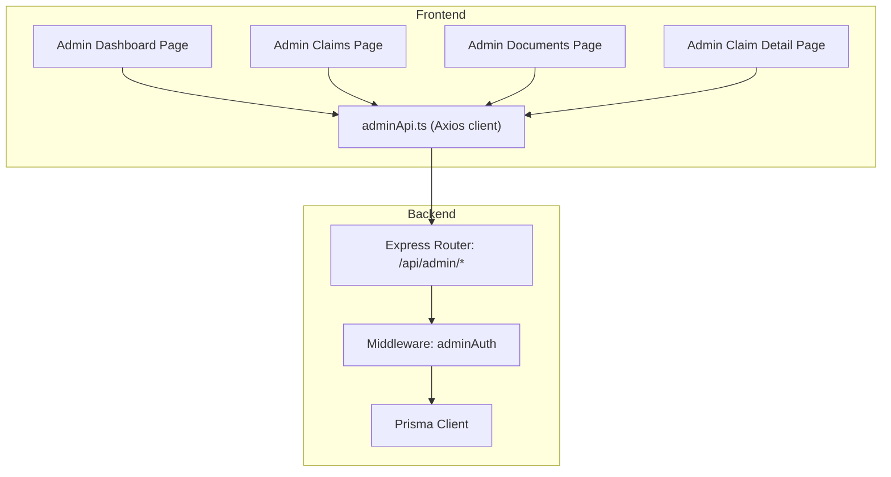
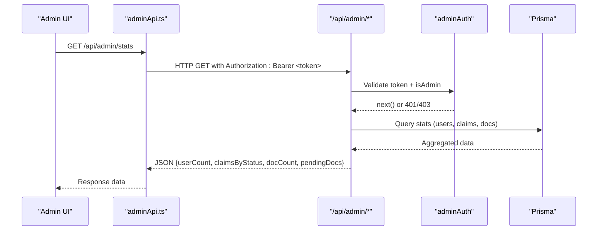
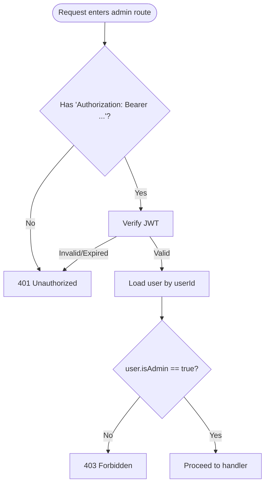
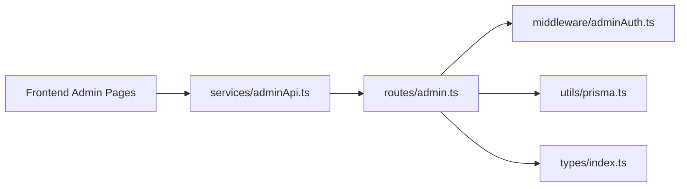

# Admin API

<cite>
**Referenced Files in This Document**
- [admin.ts](file://backend/src/routes/admin.ts)
- [adminAuth.ts](file://backend/src/middleware/adminAuth.ts)
- [claims.ts](file://backend/src/routes/claims.ts)
- [schema.prisma](file://backend/prisma/schema.prisma)
- [index.ts (types)](file://backend/src/types/index.ts)
- [adminApi.ts](file://frontend/src/services/adminApi.ts)
- [AdminClaimsPage.tsx](file://frontend/src/pages/admin/AdminClaimsPage.tsx)
- [AdminDocumentsPage.tsx](file://frontend/src/pages/admin/AdminDocumentsPage.tsx)
- [AdminClaimDetailPage.tsx](file://frontend/src/pages/admin/AdminClaimDetailPage.tsx)
- [AdminDashboardPage.tsx](file://frontend/src/pages/admin/AdminDashboardPage.tsx)
</cite>

## Table of Contents
1. Introduction
2. Project Structure
3. Core Components
4. Architecture Overview
5. Detailed Component Analysis
6. Dependency Analysis
7. Performance Considerations
8. Troubleshooting Guide
9. Conclusion
10. Appendices

## Introduction
This document provides comprehensive API documentation for administrative endpoints that enable admin-only operations such as user management, claims review and approval, system monitoring, and analytics. It specifies request schemas, response formats, role-based access control via admin authentication middleware, error handling, and examples for common admin tasks. Security considerations and audit logging guidance are included to help secure administrative actions.

## Project Structure
The admin API is implemented on the backend with Express routes protected by an admin authentication middleware. The frontend provides admin UI pages that call these endpoints through a dedicated axios instance.

**Diagram sources**
- [admin.ts:1-187](file://backend/src/routes/admin.ts#L1-L187)
- [adminAuth.ts:1-27](file://backend/src/middleware/adminAuth.ts#L1-L27)
- [adminApi.ts:1-28](file://frontend/src/services/adminApi.ts#L1-L28)
- [AdminDashboardPage.tsx:1-130](file://frontend/src/pages/admin/AdminDashboardPage.tsx#L1-L130)
- [AdminClaimsPage.tsx:1-128](file://frontend/src/pages/admin/AdminClaimsPage.tsx#L1-L128)
- [AdminDocumentsPage.tsx:1-210](file://frontend/src/pages/admin/AdminDocumentsPage.tsx#L1-L210)
- [AdminClaimDetailPage.tsx:1-275](file://frontend/src/pages/admin/AdminClaimDetailPage.tsx#L1-L275)

**Section sources**
- [admin.ts:1-187](file://backend/src/routes/admin.ts#L1-L187)
- [adminAuth.ts:1-27](file://backend/src/middleware/adminAuth.ts#L1-L27)
- [adminApi.ts:1-28](file://frontend/src/services/adminApi.ts#L1-L28)

## Core Components
- Admin Authentication Middleware: Validates JWT and ensures the user has admin privileges before allowing access to admin routes.
- Admin Routes: Provide endpoints for statistics, users listing, claims listing/detail/status updates, and documents listing/approve/reject.
- Frontend Admin Pages: UI components that call admin endpoints to perform reviews, approvals, and view dashboards.

Key responsibilities:
- Enforce RBAC at the route level using adminAuth middleware.
- Expose read/write endpoints for admins to manage claims and documents.
- Aggregate system metrics for dashboard reporting.

**Section sources**
- [adminAuth.ts:6-26](file://backend/src/middleware/adminAuth.ts#L6-L26)
- [admin.ts:11-184](file://backend/src/routes/admin.ts#L11-L184)
- [AdminDashboardPage.tsx:17-24](file://frontend/src/pages/admin/AdminDashboardPage.tsx#L17-L24)

## Architecture Overview
The admin API follows a layered architecture:
- Frontend admin pages use a shared axios client configured to attach admin tokens and handle auth errors.
- Backend routes under /api/admin are guarded by adminAuth middleware.
- Controllers (routes) interact with Prisma to query/update database entities.

**Diagram sources**
- [admin.ts:11-26](file://backend/src/routes/admin.ts#L11-L26)
- [adminAuth.ts:6-26](file://backend/src/middleware/adminAuth.ts#L6-L26)
- [adminApi.ts:7-24](file://frontend/src/services/adminApi.ts#L7-L24)

## Detailed Component Analysis

### Admin Authentication Middleware
- Purpose: Ensure only authenticated users with admin privileges can access admin endpoints.
- Behavior:
  - Requires Authorization header with Bearer token.
  - Verifies JWT and checks user.isAdmin flag.
  - Returns 401 if token missing/invalid/expired; returns 403 if not admin.

**Diagram sources**
- [adminAuth.ts:6-26](file://backend/src/middleware/adminAuth.ts#L6-L26)

**Section sources**
- [adminAuth.ts:6-26](file://backend/src/middleware/adminAuth.ts#L6-L26)

### Admin Endpoints

#### Get System Statistics
- Method: GET
- Path: /api/admin/stats
- Auth: Required (admin)
- Description: Returns aggregated system metrics including total non-admin users, claim counts grouped by status, total documents, and pending documents count.
- Request: None
- Response:
  - userCount: number
  - claimsByStatus: object mapping status string to count
  - docCount: number
  - pendingDocs: number
- Errors:
  - 500: Internal server error

**Section sources**
- [admin.ts:11-26](file://backend/src/routes/admin.ts#L11-L26)

#### List Users
- Method: GET
- Path: /api/admin/users
- Auth: Required (admin)
- Description: Lists all non-admin users with basic profile info and counts of vehicles and claims.
- Request: None
- Response: Array of user objects with fields like id, email, firstName, lastName, phone, address, createdAt, and _count.vehicles, _count.claims.
- Errors:
  - 500: Internal server error

**Section sources**
- [admin.ts:28-45](file://backend/src/routes/admin.ts#L28-L45)

#### List Claims (Admin View)
- Method: GET
- Path: /api/admin/claims
- Query params:
  - status: optional filter by claim status
  - search: optional substring to match against user name/email and vehicle make/model
- Auth: Required (admin)
- Description: Retrieves claims with related user, vehicle, damage assessment summary, and counts of images/documents.
- Response: Array of claim objects with nested user, vehicle, damageAssessment, and _count fields.
- Errors:
  - 500: Internal server error

**Section sources**
- [admin.ts:47-78](file://backend/src/routes/admin.ts#L47-L78)

#### Get Claim Detail
- Method: GET
- Path: /api/admin/claims/:id
- Auth: Required (admin)
- Description: Returns full claim details including user, vehicle, policy, images, damage assessment, repair estimate, insurance payout, documents, and chat messages.
- Response: Single claim object with rich relations.
- Errors:
  - 404: Claim not found
  - 500: Internal server error

**Section sources**
- [admin.ts:80-103](file://backend/src/routes/admin.ts#L80-L103)

#### Update Claim Status
- Method: PATCH
- Path: /api/admin/claims/:id/status
- Body:
  - status: one of DRAFT, SUBMITTED, UNDER_REVIEW, APPROVED, REJECTED, COMPLETED
- Auth: Required (admin)
- Description: Updates the claim’s status to the provided value after validation.
- Response: Updated claim object.
- Errors:
  - 400: Invalid status value
  - 500: Internal server error

**Section sources**
- [admin.ts:105-123](file://backend/src/routes/admin.ts#L105-L123)

#### List Documents
- Method: GET
- Path: /api/admin/documents
- Query params:
  - status: optional filter by verificationStatus (default PENDING); use ALL to include all
- Auth: Required (admin)
- Description: Lists documents with associated claim context (user, vehicle, incident date).
- Response: Array of document objects with claim relation and verification metadata.
- Errors:
  - 500: Internal server error

**Section sources**
- [admin.ts:125-149](file://backend/src/routes/admin.ts#L125-L149)

#### Approve Document
- Method: PATCH
- Path: /api/admin/documents/:id/approve
- Body: None
- Auth: Required (admin)
- Description: Marks the document as verified and sets verification result indicating admin approval.
- Response: Updated document object.
- Errors:
  - 500: Internal server error

**Section sources**
- [admin.ts:151-166](file://backend/src/routes/admin.ts#L151-L166)

#### Reject Document
- Method: PATCH
- Path: /api/admin/documents/:id/reject
- Body:
  - reason: string (optional; used to populate rejection issues)
- Auth: Required (admin)
- Description: Marks the document as having issues found and records admin rejection.
- Response: Updated document object.
- Errors:
  - 500: Internal server error

**Section sources**
- [admin.ts:168-184](file://backend/src/routes/admin.ts#L168-L184)

### Data Models and Enums
Relevant models and enums used by admin endpoints:

- User: includes isAdmin boolean flag used by adminAuth.
- Claim: includes status enum and relationships to user, vehicle, policy, images, documents, etc.
- Document: includes verificationStatus and verificationResult JSON.
- Enums: ClaimStatus, VerificationStatus, DocumentType, SeverityLevel.

These define the shape of responses and constraints enforced by the admin endpoints.

**Section sources**
- [schema.prisma:10-25](file://backend/prisma/schema.prisma#L10-L25)
- [schema.prisma:62-94](file://backend/prisma/schema.prisma#L62-L94)
- [schema.prisma:162-186](file://backend/prisma/schema.prisma#L162-L186)

### Frontend Integration
- Admin API client:
  - Base URL: configurable via environment variable, defaults to /api/admin.
  - Interceptors:
    - Adds Authorization header with adminToken from localStorage.
    - Sets Content-Type to application/json unless FormData.
    - On 401/403, clears token and redirects to admin login.
- Admin pages:
  - Dashboard: fetches /stats and recent claims.
  - Claims: lists claims with filters and approves via status update.
  - Documents: lists documents by verification status and performs approve/reject.
  - Claim detail: shows full claim info and allows quick status changes and document actions.

**Section sources**
- [adminApi.ts:1-28](file://frontend/src/services/adminApi.ts#L1-L28)
- [AdminDashboardPage.tsx:17-24](file://frontend/src/pages/admin/AdminDashboardPage.tsx#L17-L24)
- [AdminClaimsPage.tsx:23-41](file://frontend/src/pages/admin/AdminClaimsPage.tsx#L23-L41)
- [AdminDocumentsPage.tsx:28-69](file://frontend/src/pages/admin/AdminDocumentsPage.tsx#L28-L69)
- [AdminClaimDetailPage.tsx:29-55](file://frontend/src/pages/admin/AdminClaimDetailPage.tsx#L29-L55)

## Dependency Analysis
- Admin routes depend on:
  - adminAuth middleware for authorization.
  - Prisma client for data access.
  - Types for request typing.
- Frontend admin pages depend on:
  - adminApi client for network calls.
  - React state and routing for UI interactions.

**Diagram sources**
- [admin.ts:1-7](file://backend/src/routes/admin.ts#L1-L7)
- [adminAuth.ts:1-5](file://backend/src/middleware/adminAuth.ts#L1-L5)
- [adminApi.ts:1-14](file://frontend/src/services/adminApi.ts#L1-L14)

**Section sources**
- [admin.ts:1-7](file://backend/src/routes/admin.ts#L1-L7)
- [adminAuth.ts:1-5](file://backend/src/middleware/adminAuth.ts#L1-L5)
- [adminApi.ts:1-14](file://frontend/src/services/adminApi.ts#L1-L14)

## Performance Considerations
- Batch queries: Stats endpoint uses Promise.all to parallelize independent counts, improving response time.
- Selective includes: Admin claim list includes only necessary relations and counts to reduce payload size.
- Filtering: Server-side filtering by status and search reduces client-side processing.
- Pagination: Not currently implemented; consider adding pagination for large datasets in claims and documents endpoints.

[No sources needed since this section provides general guidance]

## Troubleshooting Guide
Common errors and resolutions:
- 401 Unauthorized:
  - Missing or invalid/expired JWT token.
  - Ensure adminToken is present in localStorage and Authorization header is set.
  - Frontend will redirect to admin login on 401/403.
- 403 Forbidden:
  - Token valid but user is not an admin.
  - Verify user.isAdmin flag in the database.
- 400 Bad Request:
  - Invalid status value when updating claim status.
  - Ensure status is one of the allowed values.
- 404 Not Found:
  - Claim not found when fetching detail.
- 500 Internal Server Error:
  - Database or service errors; check server logs for stack traces.

Security considerations:
- Always require Authorization header with Bearer token for admin endpoints.
- Validate and sanitize inputs (e.g., status values).
- Avoid exposing sensitive fields in admin responses beyond what is necessary.
- Consider implementing audit logging for all administrative actions (see Appendix).

**Section sources**
- [adminAuth.ts:6-26](file://backend/src/middleware/adminAuth.ts#L6-L26)
- [admin.ts:105-123](file://backend/src/routes/admin.ts#L105-L123)
- [admin.ts:80-103](file://backend/src/routes/admin.ts#L80-L103)
- [adminApi.ts:16-24](file://frontend/src/services/adminApi.ts#L16-L24)

## Conclusion
The Admin API provides secure, role-gated endpoints for managing users, reviewing and approving claims, and monitoring system metrics. The admin authentication middleware enforces strict access control, while the frontend integrates seamlessly via a dedicated axios client. To enhance security and compliance, implement comprehensive audit logging for all administrative actions and consider adding pagination and rate limiting for high-volume endpoints.

[No sources needed since this section summarizes without analyzing specific files]

## Appendices

### Example Workflows

#### Review Pending Claims
- Fetch claims filtered by status:
  - GET /api/admin/claims?status=UNDER_REVIEW
- For each claim, open detail:
  - GET /api/admin/claims/:id
- Update status as needed:
  - PATCH /api/admin/claims/:id/status with { status: "APPROVED" | "REJECTED" | "COMPLETED" }

**Section sources**
- [admin.ts:47-78](file://backend/src/routes/admin.ts#L47-L78)
- [admin.ts:80-103](file://backend/src/routes/admin.ts#L80-L103)
- [admin.ts:105-123](file://backend/src/routes/admin.ts#L105-L123)

#### Approve/Reject Documents
- List documents by verification status:
  - GET /api/admin/documents?status=PENDING
- Approve:
  - PATCH /api/admin/documents/:id/approve
- Reject:
  - PATCH /api/admin/documents/:id/reject with { reason: "..." }

**Section sources**
- [admin.ts:125-149](file://backend/src/routes/admin.ts#L125-L149)
- [admin.ts:151-166](file://backend/src/routes/admin.ts#L151-L166)
- [admin.ts:168-184](file://backend/src/routes/admin.ts#L168-L184)

#### Access System Statistics
- GET /api/admin/stats
- Use returned metrics to display dashboard cards and charts.

**Section sources**
- [admin.ts:11-26](file://backend/src/routes/admin.ts#L11-L26)

### Role-Based Access Control (RBAC)
- All admin endpoints are protected by adminAuth middleware.
- Requests must include Authorization: Bearer <token>.
- Non-admin users receive 403 Forbidden.

**Section sources**
- [adminAuth.ts:6-26](file://backend/src/middleware/adminAuth.ts#L6-L26)

### Audit Logging Recommendations
- Log every administrative action with:
  - Admin user ID (from JWT payload).
  - Action type (e.g., CLAIM_STATUS_UPDATE, DOCUMENT_APPROVE).
  - Target resource ID (claimId, documentId).
  - Timestamp and IP address.
  - Before/after state for mutations.
- Store logs in a separate table or external logging service.
- Ensure logs are immutable and retained per compliance requirements.

[No sources needed since this section provides general guidance]