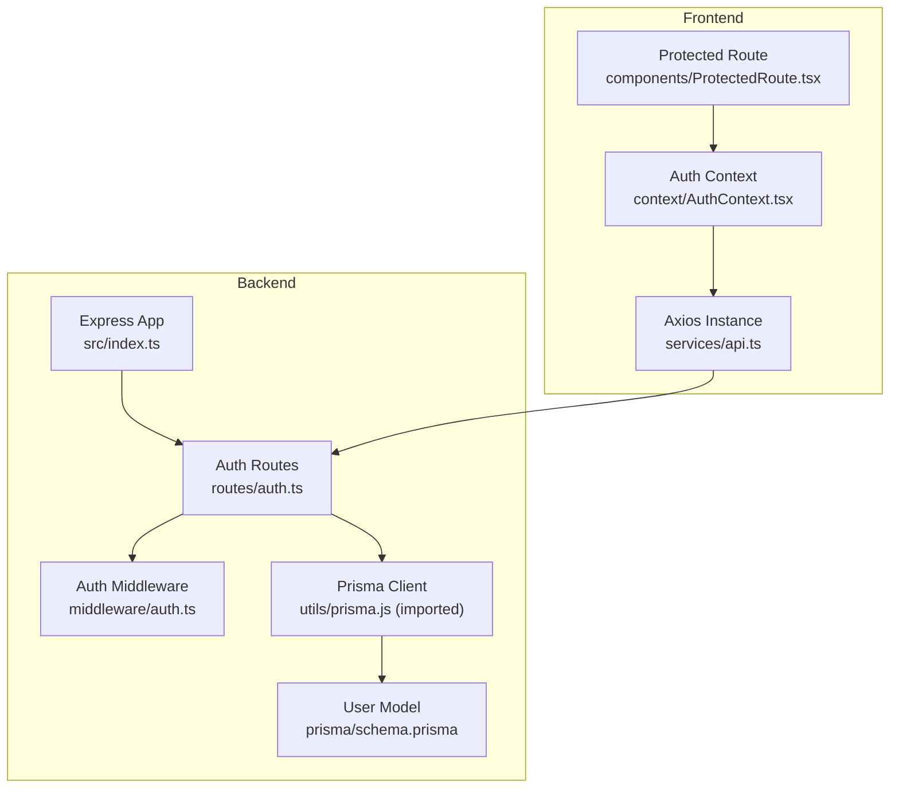
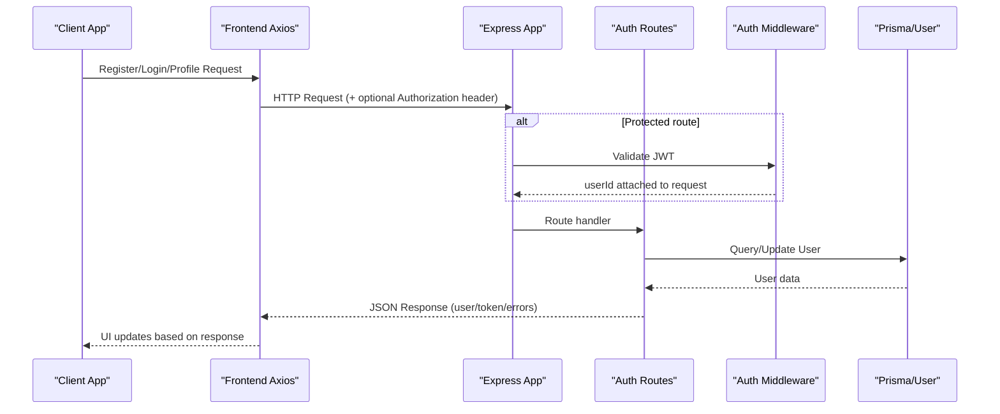
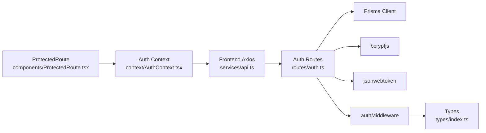

# Authentication API

<cite>
**Referenced Files in This Document**
- [auth.ts](file://backend/src/routes/auth.ts)
- [auth.ts](file://backend/src/middleware/auth.ts)
- [index.ts](file://backend/src/types/index.ts)
- [schema.prisma](file://backend/prisma/schema.prisma)
- [index.ts](file://backend/src/index.ts)
- [api.ts](file://frontend/src/services/api.ts)
- [AuthContext.tsx](file://frontend/src/context/AuthContext.tsx)
- [ProtectedRoute.tsx](file://frontend/src/components/ProtectedRoute.tsx)
</cite>

## Table of Contents
1. [Introduction](#introduction)
2. [Project Structure](#project-structure)
3. [Core Components](#core-components)
4. [Architecture Overview](#architecture-overview)
5. [Detailed Component Analysis](#detailed-component-analysis)
6. [Dependency Analysis](#dependency-analysis)
7. [Performance Considerations](#performance-considerations)
8. [Troubleshooting Guide](#troubleshooting-guide)
9. [Conclusion](#conclusion)
10. [Appendices](#appendices)

## Introduction
This document provides comprehensive API documentation for the authentication endpoints of the Smart Vehicle Insurance Claim System. It covers user registration, login, and profile management, including request/response schemas, error handling, security considerations, and client-side implementation patterns.

## Project Structure
The authentication functionality is implemented on the backend using Express routes and middleware, with a Prisma-based data layer. The frontend uses an Axios instance to manage tokens and protect routes.

**Diagram sources**
- [index.ts:28-32](file://backend/src/index.ts#L28-L32)
- [auth.ts:1-166](file://backend/src/routes/auth.ts#L1-L166)
- [auth.ts:1-23](file://backend/src/middleware/auth.ts#L1-L23)
- [schema.prisma:10-24](file://backend/prisma/schema.prisma#L10-L24)
- [api.ts:1-33](file://frontend/src/services/api.ts#L1-L33)
- [AuthContext.tsx:1-82](file://frontend/src/context/AuthContext.tsx#L1-L82)
- [ProtectedRoute.tsx:1-21](file://frontend/src/components/ProtectedRoute.tsx#L1-L21)

**Section sources**
- [index.ts:28-32](file://backend/src/index.ts#L28-L32)
- [auth.ts:1-166](file://backend/src/routes/auth.ts#L1-L166)
- [auth.ts:1-23](file://backend/src/middleware/auth.ts#L1-L23)
- [schema.prisma:10-24](file://backend/prisma/schema.prisma#L10-L24)
- [api.ts:1-33](file://frontend/src/services/api.ts#L1-L33)
- [AuthContext.tsx:1-82](file://frontend/src/context/AuthContext.tsx#L1-L82)
- [ProtectedRoute.tsx:1-21](file://frontend/src/components/ProtectedRoute.tsx#L1-L21)

## Core Components
- Registration endpoint: POST /api/auth/register
- Login endpoint: POST /api/auth/login
- Profile retrieval: GET /api/auth/profile
- Profile update: PUT /api/auth/profile
- JWT middleware: authMiddleware for protected routes
- Data model: User entity with email, passwordHash, firstName, lastName, phone, address, timestamps

Key behaviors:
- Registration validates required fields, hashes passwords, creates user, returns user object and JWT token.
- Login verifies credentials, issues JWT token, returns user object and token.
- Profile endpoints require valid JWT via Authorization header; return or update user profile fields.

**Section sources**
- [auth.ts:10-59](file://backend/src/routes/auth.ts#L10-L59)
- [auth.ts:61-104](file://backend/src/routes/auth.ts#L61-L104)
- [auth.ts:106-132](file://backend/src/routes/auth.ts#L106-L132)
- [auth.ts:134-163](file://backend/src/routes/auth.ts#L134-L163)
- [auth.ts:1-23](file://backend/src/middleware/auth.ts#L1-L23)
- [schema.prisma:10-24](file://backend/prisma/schema.prisma#L10-L24)

## Architecture Overview
Authentication flow overview:
- Clients send requests to /api/auth endpoints.
- Protected routes enforce JWT validation via middleware.
- Backend interacts with Prisma to read/write User records.
- Frontend stores token in localStorage and attaches it to requests automatically.

**Diagram sources**
- [index.ts:28-32](file://backend/src/index.ts#L28-L32)
- [auth.ts:106-132](file://backend/src/routes/auth.ts#L106-L132)
- [auth.ts:134-163](file://backend/src/routes/auth.ts#L134-L163)
- [auth.ts:1-23](file://backend/src/middleware/auth.ts#L1-L23)
- [api.ts:10-17](file://frontend/src/services/api.ts#L10-L17)

## Detailed Component Analysis

### Registration: POST /api/auth/register
Purpose:
- Create a new user account and issue a JWT token upon successful registration.

Request:
- Method: POST
- Path: /api/auth/register
- Content-Type: application/json
- Required body fields:
  - email: string (unique)
  - password: string
  - firstName: string
  - lastName: string
- Optional body fields:
  - phone: string?
  - address: string?

Response:
- Success (201):
  - user: object containing id, email, firstName, lastName, phone, address, createdAt
  - token: string (JWT, expires in 7 days)
- Validation failure (400):
  - error: message indicating missing required fields
- Duplicate user (409):
  - error: message indicating email already exists
- Server error (500):
  - error: generic registration failure message

Notes:
- Passwords are hashed before storage.
- Token payload includes userId and email.

**Section sources**
- [auth.ts:10-59](file://backend/src/routes/auth.ts#L10-L59)
- [schema.prisma:10-24](file://backend/prisma/schema.prisma#L10-L24)

### Login: POST /api/auth/login
Purpose:
- Authenticate a user by email and password and issue a JWT token.

Request:
- Method: POST
- Path: /api/auth/login
- Content-Type: application/json
- Body fields:
  - email: string
  - password: string

Response:
- Success (200):
  - user: object containing id, email, firstName, lastName, phone, address
  - token: string (JWT, expires in 7 days)
- Invalid credentials (401):
  - error: message indicating invalid email or password
- Missing fields (400):
  - error: message indicating required fields are missing
- Server error (500):
  - error: generic login failure message

Notes:
- Credentials are verified against stored password hash.
- Token payload includes userId and email.

**Section sources**
- [auth.ts:61-104](file://backend/src/routes/auth.ts#L61-L104)
- [schema.prisma:10-24](file://backend/prisma/schema.prisma#L10-L24)

### Profile Management: GET /api/auth/profile
Purpose:
- Retrieve the authenticated user’s profile information.

Authentication:
- Requires valid JWT in Authorization header: Bearer <token>

Request:
- Method: GET
- Path: /api/auth/profile
- Headers:
  - Authorization: Bearer <token>

Response:
- Success (200):
  - user: object containing id, email, firstName, lastName, phone, address, createdAt
- Unauthorized (401):
  - error: message indicating no token provided or invalid/expired token
- Not found (404):
  - error: message indicating user not found
- Server error (500):
  - error: generic fetch profile failure message

**Section sources**
- [auth.ts:106-132](file://backend/src/routes/auth.ts#L106-L132)
- [auth.ts:1-23](file://backend/src/middleware/auth.ts#L1-L23)

### Profile Update: PUT /api/auth/profile
Purpose:
- Update the authenticated user’s profile fields.

Authentication:
- Requires valid JWT in Authorization header: Bearer <token>

Request:
- Method: PUT
- Path: /api/auth/profile
- Headers:
  - Authorization: Bearer <token>
- Content-Type: application/json
- Optional body fields:
  - firstName: string?
  - lastName: string?
  - phone: string?
  - address: string?

Response:
- Success (200):
  - user: updated object containing id, email, firstName, lastName, phone, address, createdAt
- Unauthorized (401):
  - error: message indicating no token provided or invalid/expired token
- Server error (500):
  - error: generic update profile failure message

Notes:
- Only provided fields are updated; unspecified fields remain unchanged.

**Section sources**
- [auth.ts:134-163](file://backend/src/routes/auth.ts#L134-L163)
- [auth.ts:1-23](file://backend/src/middleware/auth.ts#L1-L23)

### JWT Middleware: authMiddleware
Purpose:
- Enforce authentication on protected routes by validating the JWT token from the Authorization header.

Behavior:
- Expects header format: Authorization: Bearer <token>
- Verifies token using the configured secret
- Attaches userId to the request object if valid
- Returns 401 with error messages for missing or invalid tokens

Error responses:
- 401: Access denied. No token provided.
- 401: Invalid or expired token.

**Section sources**
- [auth.ts:1-23](file://backend/src/middleware/auth.ts#L1-L23)
- [index.ts:3-10](file://backend/src/types/index.ts#L3-L10)

## Dependency Analysis
- Routes depend on:
  - Prisma client for database operations
  - bcryptjs for password hashing
  - jsonwebtoken for token creation and verification
  - authMiddleware for protecting routes
- Frontend depends on:
  - Axios instance that automatically attaches Authorization header
  - Auth context for stateful authentication flows
  - Protected route component to guard access

**Diagram sources**
- [auth.ts:1-166](file://backend/src/routes/auth.ts#L1-L166)
- [auth.ts:1-23](file://backend/src/middleware/auth.ts#L1-L23)
- [index.ts:3-10](file://backend/src/types/index.ts#L3-L10)
- [api.ts:10-17](file://frontend/src/services/api.ts#L10-L17)
- [AuthContext.tsx:1-82](file://frontend/src/context/AuthContext.tsx#L1-L82)
- [ProtectedRoute.tsx:1-21](file://frontend/src/components/ProtectedRoute.tsx#L1-L21)

**Section sources**
- [auth.ts:1-166](file://backend/src/routes/auth.ts#L1-L166)
- [auth.ts:1-23](file://backend/src/middleware/auth.ts#L1-L23)
- [index.ts:3-10](file://backend/src/types/index.ts#L3-L10)
- [api.ts:10-17](file://frontend/src/services/api.ts#L10-L17)
- [AuthContext.tsx:1-82](file://frontend/src/context/AuthContext.tsx#L1-L82)
- [ProtectedRoute.tsx:1-21](file://frontend/src/components/ProtectedRoute.tsx#L1-L21)

## Performance Considerations
- Password hashing uses a configurable cost factor; ensure appropriate performance vs. security trade-offs.
- JWT expiration set to 7 days; consider shorter lifetimes for higher security environments and implement refresh strategies if needed.
- Database queries select only necessary fields to reduce payload size.
- Frontend caches token in localStorage; ensure secure storage practices and consider HttpOnly cookies for enhanced security where applicable.

[No sources needed since this section provides general guidance]

## Troubleshooting Guide
Common errors and resolutions:
- 400 Bad Request:
  - Registration: Missing required fields (email, password, firstName, lastName). Ensure all required fields are present.
  - Login: Missing email or password. Provide both fields.
- 401 Unauthorized:
  - Missing or invalid/expired token on protected routes. Include Authorization: Bearer <token>.
  - Invalid credentials during login. Verify email/password combination.
- 404 Not Found:
  - Profile retrieval for non-existent user. Check userId mapping and token validity.
- 409 Conflict:
  - Duplicate email during registration. Use a different email or log in.
- 500 Internal Server Error:
  - Unexpected server issues. Check logs and environment configuration (e.g., JWT_SECRET, DATABASE_URL).

Frontend behavior:
- On 401 responses, the Axios interceptor clears stored token and user data and redirects to login.

**Section sources**
- [auth.ts:10-59](file://backend/src/routes/auth.ts#L10-L59)
- [auth.ts:61-104](file://backend/src/routes/auth.ts#L61-L104)
- [auth.ts:106-132](file://backend/src/routes/auth.ts#L106-L132)
- [auth.ts:134-163](file://backend/src/routes/auth.ts#L134-L163)
- [auth.ts:1-23](file://backend/src/middleware/auth.ts#L1-L23)
- [api.ts:19-30](file://frontend/src/services/api.ts#L19-L30)

## Conclusion
The authentication system provides secure user registration, login, and profile management with JWT-based authorization. Protected routes enforce token validation, while the frontend manages token lifecycle and guards routes accordingly. Follow the documented request/response formats and error codes to integrate clients effectively.

[No sources needed since this section summarizes without analyzing specific files]

## Appendices

### Request/Response Examples

- Register
  - Request:
    - Method: POST
    - Path: /api/auth/register
    - Body: { email, password, firstName, lastName, phone?, address? }
  - Responses:
    - 201: { user, token }
    - 400: { error }
    - 409: { error }
    - 500: { error }

- Login
  - Request:
    - Method: POST
    - Path: /api/auth/login
    - Body: { email, password }
  - Responses:
    - 200: { user, token }
    - 400: { error }
    - 401: { error }
    - 500: { error }

- Get Profile
  - Request:
    - Method: GET
    - Path: /api/auth/profile
    - Headers: Authorization: Bearer <token>
  - Responses:
    - 200: { user }
    - 401: { error }
    - 404: { error }
    - 500: { error }

- Update Profile
  - Request:
    - Method: PUT
    - Path: /api/auth/profile
    - Headers: Authorization: Bearer <token>
    - Body: { firstName?, lastName?, phone?, address? }
  - Responses:
    - 200: { user }
    - 401: { error }
    - 500: { error }

**Section sources**
- [auth.ts:10-59](file://backend/src/routes/auth.ts#L10-L59)
- [auth.ts:61-104](file://backend/src/routes/auth.ts#L61-L104)
- [auth.ts:106-132](file://backend/src/routes/auth.ts#L106-L132)
- [auth.ts:134-163](file://backend/src/routes/auth.ts#L134-L163)

### Security Considerations
- Store secrets securely:
  - JWT_SECRET must be set in environment variables.
  - DATABASE_URL must be secured.
- Passwords are hashed before storage; do not store plaintext passwords.
- Use HTTPS in production to protect tokens in transit.
- Consider short-lived tokens and refresh mechanisms for enhanced security.
- Validate and sanitize inputs to prevent injection attacks.

[No sources needed since this section provides general guidance]

### Client Implementation Patterns
- Attach Authorization header automatically for all requests to protected endpoints.
- Handle 401 responses by clearing local state and redirecting to login.
- Persist token and user data in localStorage for session continuity.
- Guard routes using a protected route component that checks authentication state.

**Section sources**
- [api.ts:10-17](file://frontend/src/services/api.ts#L10-L17)
- [api.ts:19-30](file://frontend/src/services/api.ts#L19-L30)
- [AuthContext.tsx:18-66](file://frontend/src/context/AuthContext.tsx#L18-L66)
- [ProtectedRoute.tsx:4-19](file://frontend/src/components/ProtectedRoute.tsx#L4-L19)