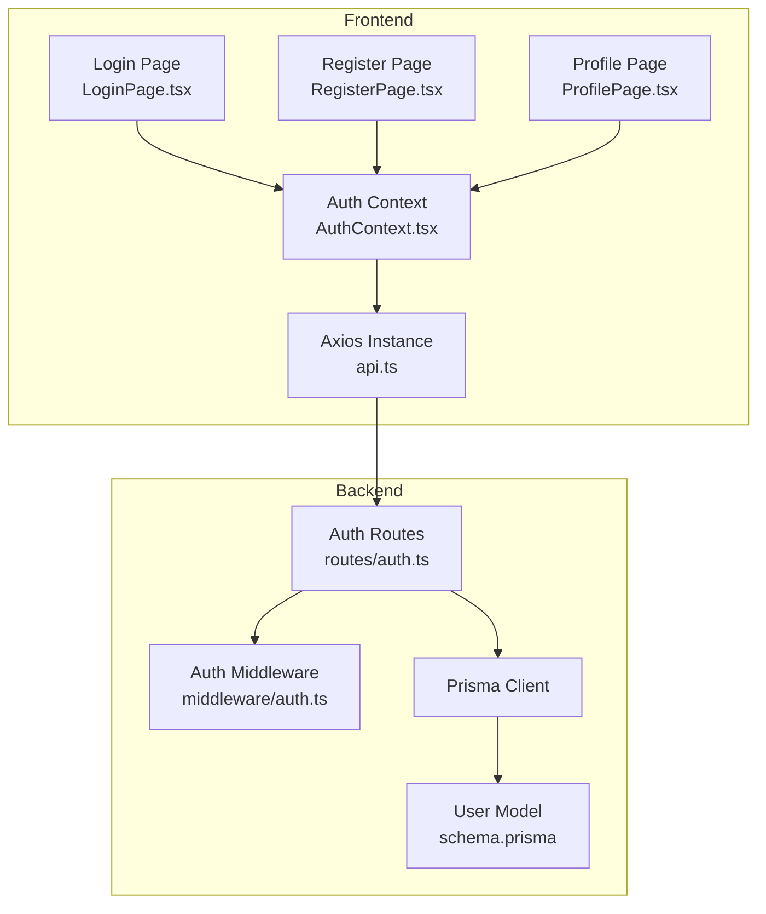
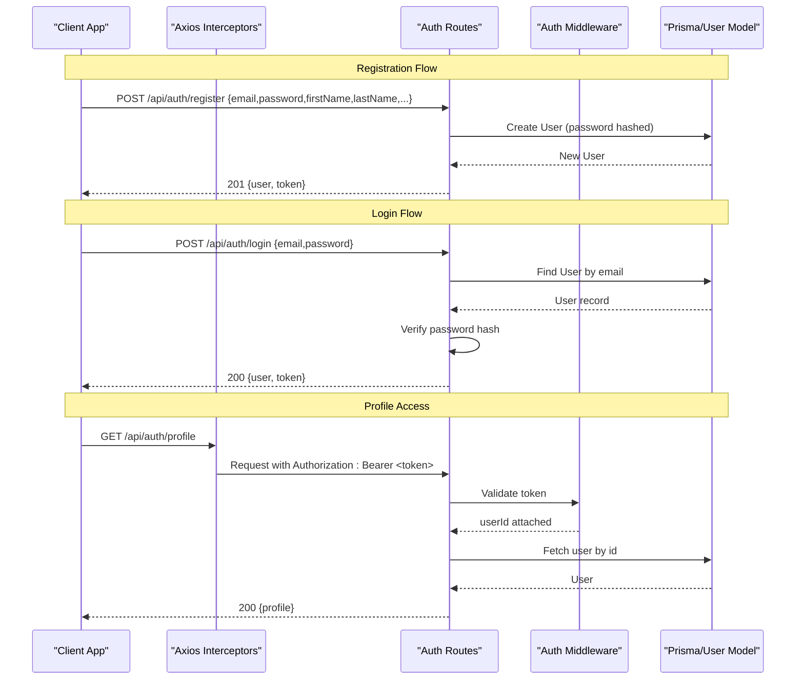
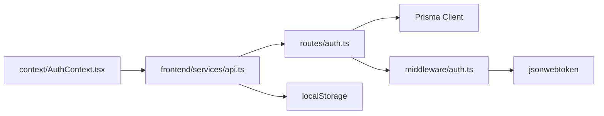
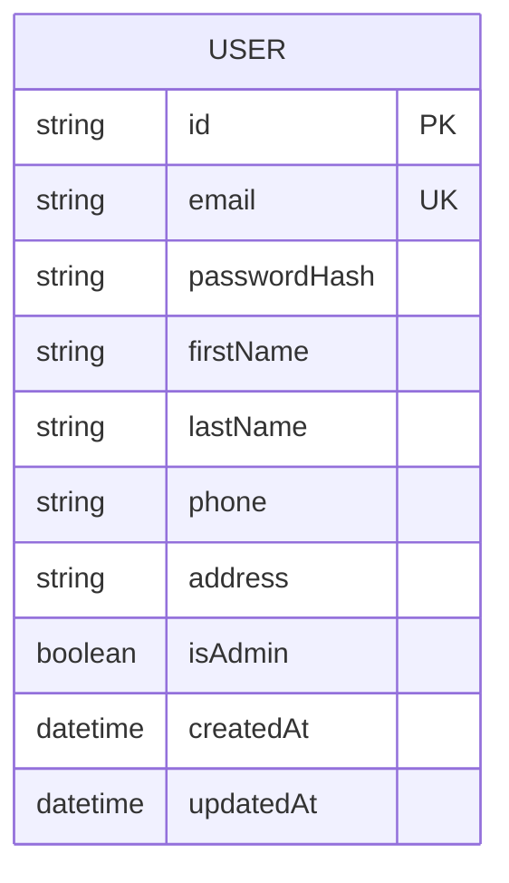

# Authentication API

<cite>
**Referenced Files in This Document**
- [auth.ts](file://backend/src/routes/auth.ts)
- [auth.ts](file://backend/src/middleware/auth.ts)
- [schema.prisma](file://backend/prisma/schema.prisma)
- [index.ts](file://backend/src/types/index.ts)
- [api.ts](file://frontend/src/services/api.ts)
- [AuthContext.tsx](file://frontend/src/context/AuthContext.tsx)
- [LoginPage.tsx](file://frontend/src/pages/LoginPage.tsx)
- [RegisterPage.tsx](file://frontend/src/pages/RegisterPage.tsx)
- [ProfilePage.tsx](file://frontend/src/pages/ProfilePage.tsx)
</cite>

## Table of Contents
1. Introduction
2. Project Structure
3. Core Components
4. Architecture Overview
5. Detailed Component Analysis
6. Dependency Analysis
7. Performance Considerations
8. Troubleshooting Guide
9. Conclusion
10. Appendices

## Introduction
This document provides comprehensive API documentation for the authentication endpoints of the Smart Vehicle Insurance Claim System. It covers user registration, login, profile management, and JWT token handling. It includes request/response specifications, error codes, security considerations, and client-side implementation examples in JavaScript/TypeScript to handle authentication flows, token storage, and protected route access.

## Project Structure
The authentication feature spans backend routes, middleware, data models, and frontend services:
- Backend routes define REST endpoints under /api/auth.
- Middleware validates JWT tokens for protected routes.
- Prisma schema defines the User model used by authentication.
- Frontend Axios instance attaches tokens and handles 401 responses.
- React context manages auth state and exposes login/register/updateProfile methods.

**Diagram sources**
- [auth.ts:1-168](file://backend/src/routes/auth.ts#L1-L168)
- [auth.ts:1-23](file://backend/src/middleware/auth.ts#L1-L23)
- [schema.prisma:10-25](file://backend/prisma/schema.prisma#L10-L25)
- [api.ts:1-36](file://frontend/src/services/api.ts#L1-L36)
- [AuthContext.tsx:1-82](file://frontend/src/context/AuthContext.tsx#L1-L82)
- [LoginPage.tsx:1-105](file://frontend/src/pages/LoginPage.tsx#L1-L105)
- [RegisterPage.tsx:1-102](file://frontend/src/pages/RegisterPage.tsx#L1-L102)
- [ProfilePage.tsx:1-88](file://frontend/src/pages/ProfilePage.tsx#L1-L88)

**Section sources**
- [auth.ts:1-168](file://backend/src/routes/auth.ts#L1-L168)
- [auth.ts:1-23](file://backend/src/middleware/auth.ts#L1-L23)
- [schema.prisma:10-25](file://backend/prisma/schema.prisma#L10-L25)
- [api.ts:1-36](file://frontend/src/services/api.ts#L1-L36)
- [AuthContext.tsx:1-82](file://frontend/src/context/AuthContext.tsx#L1-L82)

## Core Components
- POST /api/auth/register: Creates a new user with email validation, password hashing, and returns a JWT token.
- POST /api/auth/login: Validates credentials and returns a JWT token along with user data.
- GET /api/auth/profile: Retrieves current user profile; requires valid JWT via Authorization header.
- PUT /api/auth/profile: Updates user profile fields; requires valid JWT via Authorization header.

Key behaviors:
- Registration requires email, password, firstName, lastName; optional phone and address.
- Passwords are hashed before storage.
- Login verifies stored hash against provided password.
- Profile endpoints use middleware to enforce JWT authentication.
- Token is signed with an expiration and verified using a secret from environment variables.

**Section sources**
- [auth.ts:10-105](file://backend/src/routes/auth.ts#L10-L105)
- [auth.ts:107-165](file://backend/src/routes/auth.ts#L107-L165)
- [auth.ts:5-22](file://backend/src/middleware/auth.ts#L5-L22)
- [schema.prisma:10-25](file://backend/prisma/schema.prisma#L10-L25)

## Architecture Overview
Authentication flow involves:
- Client sends requests to backend routes.
- Protected routes invoke middleware to validate JWT.
- Routes interact with Prisma to read/write User records.
- Frontend Axios interceptors attach tokens and handle 401 errors by clearing local state and redirecting to login.

**Diagram sources**
- [auth.ts:10-165](file://backend/src/routes/auth.ts#L10-L165)
- [auth.ts:5-22](file://backend/src/middleware/auth.ts#L5-L22)
- [schema.prisma:10-25](file://backend/prisma/schema.prisma#L10-L25)
- [api.ts:7-33](file://frontend/src/services/api.ts#L7-L33)

## Detailed Component Analysis

### POST /api/auth/register
Purpose:
- Register a new user account.
- Validate required fields.
- Hash password securely.
- Create user in database.
- Generate and return JWT token.

Request:
- Method: POST
- Path: /api/auth/register
- Headers: Content-Type: application/json
- Body fields:
  - email: string (required)
  - password: string (required)
  - firstName: string (required)
  - lastName: string (required)
  - phone: string (optional)
  - address: string (optional)

Response:
- Success: 201 Created
  - body: { user: { id, email, firstName, lastName, phone, address, createdAt }, token }
- Errors:
  - 400 Bad Request: Missing required fields
  - 409 Conflict: Email already exists
  - 500 Internal Server Error: Registration failed

Security considerations:
- Passwords are hashed before storage.
- JWT is signed with a secret from environment variables and expires in 7 days.
- Only necessary user fields are returned.

Client example (JavaScript/TypeScript):
- Use axios to POST to /api/auth/register with form data.
- On success, store token and user in localStorage.
- On error, display message based on response.

**Section sources**
- [auth.ts:10-59](file://backend/src/routes/auth.ts#L10-L59)
- [schema.prisma:10-25](file://backend/prisma/schema.prisma#L10-L25)
- [AuthContext.tsx:47-54](file://frontend/src/context/AuthContext.tsx#L47-L54)
- [RegisterPage.tsx:13-26](file://frontend/src/pages/RegisterPage.tsx#L13-L26)

### POST /api/auth/login
Purpose:
- Authenticate user with email and password.
- Validate credentials against stored hash.
- Return JWT token and user data.

Request:
- Method: POST
- Path: /api/auth/login
- Headers: Content-Type: application/json
- Body fields:
  - email: string (required)
  - password: string (required)

Response:
- Success: 200 OK
  - body: { user: { id, email, firstName, lastName, phone, address, isAdmin }, token }
- Errors:
  - 400 Bad Request: Missing email or password
  - 401 Unauthorized: Invalid email or password
  - 500 Internal Server Error: Login failed

Security considerations:
- Credentials are validated server-side.
- JWT is generated with expiration and signed with a secret.
- Sensitive fields like passwordHash are never returned.

Client example (JavaScript/TypeScript):
- Use axios to POST to /api/auth/login.
- Store token and user in localStorage.
- Redirect to dashboard upon success.

**Section sources**
- [auth.ts:61-105](file://backend/src/routes/auth.ts#L61-L105)
- [AuthContext.tsx:38-45](file://frontend/src/context/AuthContext.tsx#L38-L45)
- [LoginPage.tsx:14-27](file://frontend/src/pages/LoginPage.tsx#L14-L27)

### GET /api/auth/profile
Purpose:
- Retrieve authenticated user’s profile information.

Authentication:
- Requires Authorization header with Bearer token.
- Middleware verifies token and attaches userId to request.

Request:
- Method: GET
- Path: /api/auth/profile
- Headers: Authorization: Bearer <token>

Response:
- Success: 200 OK
  - body: { id, email, firstName, lastName, phone, address, isAdmin, createdAt }
- Errors:
  - 401 Unauthorized: No token or invalid/expired token
  - 404 Not Found: User not found
  - 500 Internal Server Error: Failed to fetch profile

Security considerations:
- Only the authenticated user can access their own profile.
- Sensitive fields are excluded from response.

Client example (JavaScript/TypeScript):
- Axios interceptor automatically attaches token to requests.
- On 401, clear local storage and redirect to login.

**Section sources**
- [auth.ts:107-134](file://backend/src/routes/auth.ts#L107-L134)
- [auth.ts:5-22](file://backend/src/middleware/auth.ts#L5-L22)
- [api.ts:7-33](file://frontend/src/services/api.ts#L7-L33)

### PUT /api/auth/profile
Purpose:
- Update authenticated user’s profile fields.

Authentication:
- Requires Authorization header with Bearer token.
- Middleware verifies token and attaches userId to request.

Request:
- Method: PUT
- Path: /api/auth/profile
- Headers: Authorization: Bearer <token>, Content-Type: application/json
- Body fields (all optional):
  - firstName: string
  - lastName: string
  - phone: string
  - address: string

Response:
- Success: 200 OK
  - body: { id, email, firstName, lastName, phone, address, createdAt }
- Errors:
  - 401 Unauthorized: No token or invalid/expired token
  - 500 Internal Server Error: Failed to update profile

Security considerations:
- Only the authenticated user can update their own profile.
- Partial updates supported; only provided fields are changed.

Client example (JavaScript/TypeScript):
- Send PUT request with updated fields.
- Update local user state on success.

**Section sources**
- [auth.ts:136-165](file://backend/src/routes/auth.ts#L136-L165)
- [AuthContext.tsx:63-66](file://frontend/src/context/AuthContext.tsx#L63-L66)
- [ProfilePage.tsx:17-28](file://frontend/src/pages/ProfilePage.tsx#L17-L28)

## Dependency Analysis
- Routes depend on Prisma client to interact with the User model.
- Middleware depends on JWT library to verify tokens.
- Frontend Axios instance depends on localStorage for token persistence and redirects on 401.
- AuthContext coordinates login/register/logout and profile updates.

**Diagram sources**
- [auth.ts:1-168](file://backend/src/routes/auth.ts#L1-L168)
- [auth.ts:1-23](file://backend/src/middleware/auth.ts#L1-L23)
- [api.ts:1-36](file://frontend/src/services/api.ts#L1-L36)
- [AuthContext.tsx:1-82](file://frontend/src/context/AuthContext.tsx#L1-L82)

**Section sources**
- [auth.ts:1-168](file://backend/src/routes/auth.ts#L1-L168)
- [auth.ts:1-23](file://backend/src/middleware/auth.ts#L1-L23)
- [api.ts:1-36](file://frontend/src/services/api.ts#L1-L36)
- [AuthContext.tsx:1-82](file://frontend/src/context/AuthContext.tsx#L1-L82)

## Performance Considerations
- Password hashing uses bcrypt with a cost factor suitable for interactive sign-up flows.
- JWT signing and verification are lightweight operations; ensure secrets are managed securely.
- Database queries select only necessary fields to reduce payload size.
- Frontend Axios interceptors minimize redundant token handling and centralize 401 logic.

[No sources needed since this section provides general guidance]

## Troubleshooting Guide
Common issues and resolutions:
- 400 Bad Request: Ensure all required fields are present in register/login payloads.
- 401 Unauthorized: Check that Authorization header contains a valid Bearer token; if expired, re-login.
- 409 Conflict: Registration fails if email already exists; prompt user to log in instead.
- 404 Not Found: Profile retrieval fails if user ID does not exist; verify token validity.
- 500 Internal Server Error: Log server-side errors; check database connectivity and environment variables.

Frontend behavior:
- On 401, the Axios interceptor clears token and user from localStorage and redirects to login.

**Section sources**
- [auth.ts:10-165](file://backend/src/routes/auth.ts#L10-L165)
- [auth.ts:5-22](file://backend/src/middleware/auth.ts#L5-L22)
- [api.ts:22-33](file://frontend/src/services/api.ts#L22-L33)

## Conclusion
The authentication system provides secure user registration, login, and profile management with JWT-based protection. The backend enforces input validation, password hashing, and token verification, while the frontend manages token storage and protected route access. Following the documented request/response formats and security practices ensures a robust and maintainable authentication flow.

[No sources needed since this section summarizes without analyzing specific files]

## Appendices

### Data Model: User

**Diagram sources**
- [schema.prisma:10-25](file://backend/prisma/schema.prisma#L10-L25)

### Client Implementation Examples (JavaScript/TypeScript)
- Registration:
  - POST /api/auth/register with { email, password, firstName, lastName, phone?, address? }.
  - Store token and user in localStorage on success.
- Login:
  - POST /api/auth/login with { email, password }.
  - Store token and user in localStorage on success.
- Access protected routes:
  - Include Authorization: Bearer <token> header.
  - Handle 401 by clearing storage and redirecting to login.
- Update profile:
  - PUT /api/auth/profile with partial fields.
  - Update local user state on success.

These patterns are implemented in:
- Axios interceptor for automatic token attachment and 401 handling.
- AuthContext for managing auth state and exposing methods.
- Pages for UI interactions and navigation.

**Section sources**
- [api.ts:7-33](file://frontend/src/services/api.ts#L7-L33)
- [AuthContext.tsx:17-66](file://frontend/src/context/AuthContext.tsx#L17-L66)
- [LoginPage.tsx:14-27](file://frontend/src/pages/LoginPage.tsx#L14-L27)
- [RegisterPage.tsx:13-26](file://frontend/src/pages/RegisterPage.tsx#L13-L26)
- [ProfilePage.tsx:17-28](file://frontend/src/pages/ProfilePage.tsx#L17-L28)