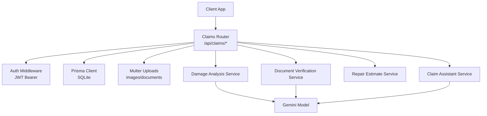
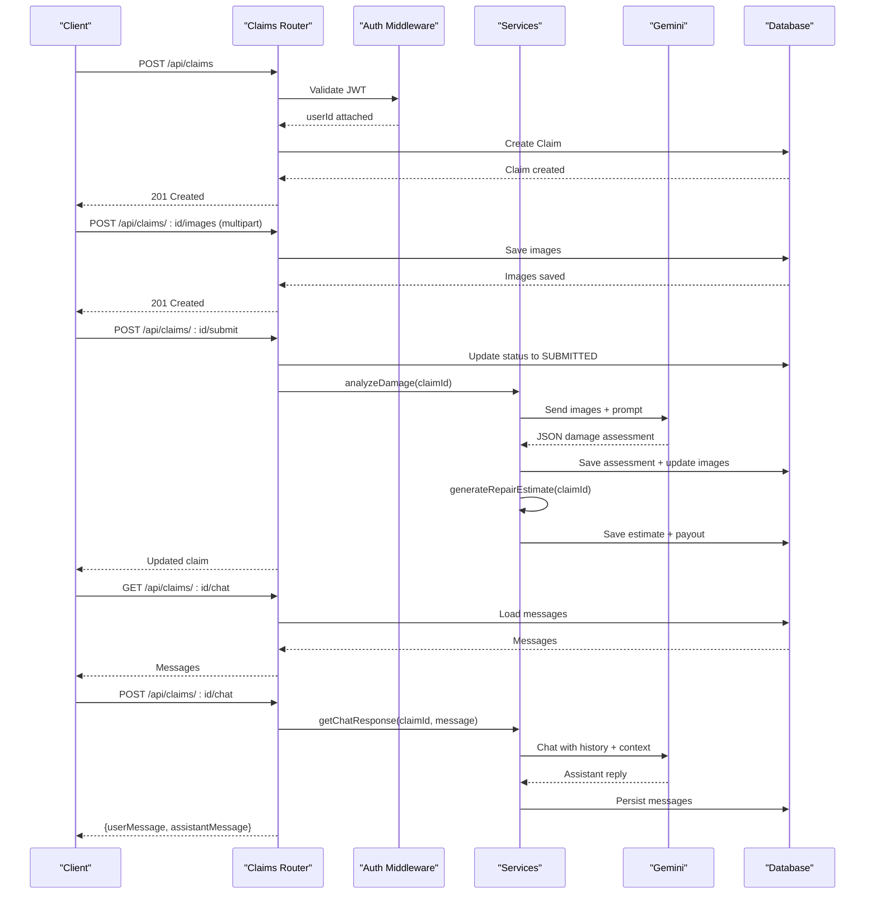
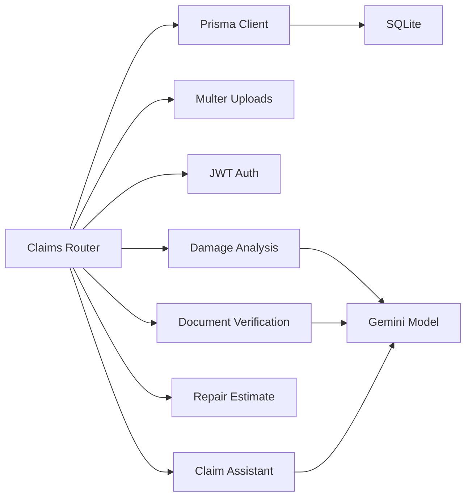

# Claims API

<cite>
**Referenced Files in This Document**
- [claims.ts](file://backend/src/routes/claims.ts)
- [damageAnalysisService.ts](file://backend/src/services/damageAnalysisService.ts)
- [documentVerificationService.ts](file://backend/src/services/documentVerificationService.ts)
- [repairEstimateService.ts](file://backend/src/services/repairEstimateService.ts)
- [claimAssistantService.ts](file://backend/src/services/claimAssistantService.ts)
- [auth.ts](file://backend/src/middleware/auth.ts)
- [upload.ts](file://backend/src/middleware/upload.ts)
- [index.ts (types)](file://backend/src/types/index.ts)
- [schema.prisma](file://backend/prisma/schema.prisma)
- [gemini.ts](file://backend/src/utils/gemini.ts)
</cite>

## Table of Contents
1. Introduction
2. Project Structure
3. Core Components
4. Architecture Overview
5. Detailed Component Analysis
6. Dependency Analysis
7. Performance Considerations
8. Troubleshooting Guide
9. Conclusion
10. Appendices

## Introduction
This document provides comprehensive API documentation for claim management endpoints in the Smart Vehicle Insurance Claim System. It covers the complete claim lifecycle: creation, submission, image upload and AI damage analysis, document verification, repair estimate generation, status tracking, and chat assistance. It details HTTP methods for claims CRUD operations, multi-file uploads for incident photos and supporting documents, integration points with AI services for automated assessment, schemas for data models, real-time features like claim status updates and AI chat assistance, request/response examples, error handling patterns, authentication requirements, and integration guidelines.

## Project Structure
The backend exposes a single router for claims that orchestrates database operations via Prisma, file uploads via Multer, and AI-powered services for damage analysis, document verification, repair estimates, and chat assistance. Authentication is enforced at the route level using a JWT middleware.

**Diagram sources**
- [claims.ts:1-450](file://backend/src/routes/claims.ts#L1-L450)
- [auth.ts:1-23](file://backend/src/middleware/auth.ts#L1-L23)
- [upload.ts:1-54](file://backend/src/middleware/upload.ts#L1-L54)
- [damageAnalysisService.ts:1-154](file://backend/src/services/damageAnalysisService.ts#L1-L154)
- [documentVerificationService.ts:1-107](file://backend/src/services/documentVerificationService.ts#L1-L107)
- [repairEstimateService.ts:1-199](file://backend/src/services/repairEstimateService.ts#L1-L199)
- [claimAssistantService.ts:1-130](file://backend/src/services/claimAssistantService.ts#L1-L130)
- [gemini.ts:1-13](file://backend/src/utils/gemini.ts#L1-L13)

**Section sources**
- [claims.ts:1-450](file://backend/src/routes/claims.ts#L1-L450)
- [schema.prisma:1-201](file://backend/prisma/schema.prisma#L1-L201)

## Core Components
- Claims Router: Defines all HTTP endpoints for claims, images, documents, analysis, estimates, and chat.
- Authentication Middleware: Validates JWT tokens and attaches user context to requests.
- File Upload Middleware: Handles multipart uploads for images and documents with size/type constraints.
- AI Services:
  - Damage Analysis: Analyzes uploaded images to detect damages and severity.
  - Document Verification: Verifies authenticity and completeness of uploaded documents.
  - Repair Estimate: Generates itemized repair cost estimates based on damage assessments.
  - Claim Assistant: Provides conversational AI support with full claim context.
- Data Models: Defined in Prisma schema for claims, images, documents, assessments, estimates, payouts, and chat messages.

**Section sources**
- [claims.ts:1-450](file://backend/src/routes/claims.ts#L1-L450)
- [auth.ts:1-23](file://backend/src/middleware/auth.ts#L1-L23)
- [upload.ts:1-54](file://backend/src/middleware/upload.ts#L1-L54)
- [damageAnalysisService.ts:1-154](file://backend/src/services/damageAnalysisService.ts#L1-L154)
- [documentVerificationService.ts:1-107](file://backend/src/services/documentVerificationService.ts#L1-L107)
- [repairEstimateService.ts:1-199](file://backend/src/services/repairEstimateService.ts#L1-L199)
- [claimAssistantService.ts:1-130](file://backend/src/services/claimAssistantService.ts#L1-L130)
- [schema.prisma:1-201](file://backend/prisma/schema.prisma#L1-L201)

## Architecture Overview
The claims API follows a layered architecture:
- Presentation Layer: Express routes handle HTTP requests and responses.
- Business Logic Layer: Services encapsulate domain logic and integrate with external AI APIs.
- Data Access Layer: Prisma ORM interacts with SQLite for persistence.
- External Integrations: Google Generative AI (Gemini) for vision and chat capabilities.

**Diagram sources**
- [claims.ts:20-447](file://backend/src/routes/claims.ts#L20-L447)
- [damageAnalysisService.ts:50-153](file://backend/src/services/damageAnalysisService.ts#L50-L153)
- [repairEstimateService.ts:104-199](file://backend/src/services/repairEstimateService.ts#L104-L199)
- [claimAssistantService.ts:19-130](file://backend/src/services/claimAssistantService.ts#L19-L130)
- [schema.prisma:70-201](file://backend/prisma/schema.prisma#L70-L201)

## Detailed Component Analysis

### Authentication Requirements
- All claims endpoints require a valid JWT token in the Authorization header using Bearer scheme.
- On missing or invalid token, the server returns 401 Unauthorized with an error message.

**Section sources**
- [auth.ts:5-22](file://backend/src/middleware/auth.ts#L5-L22)
- [claims.ts:15-15](file://backend/src/routes/claims.ts#L15-L15)

### Claims CRUD Operations

#### Create Claim
- Method: POST
- Path: /api/claims
- Request Body:
  - vehicleId: string (required)
  - policyId: string (optional)
  - incidentDate: string (ISO date, required)
  - incidentLocation: string (required)
  - incidentDescription: string (required)
  - weatherConditions: string (optional)
  - hasPoliceReport: boolean (optional)
- Response:
  - 201 Created: Claim object including id, userId, vehicleId, policyId, status, incident fields, timestamps
  - 400 Bad Request: Validation error if required fields are missing
  - 404 Not Found: If vehicle not found for the authenticated user
  - 500 Internal Server Error: Database or unexpected errors

**Section sources**
- [claims.ts:20-57](file://backend/src/routes/claims.ts#L20-L57)
- [schema.prisma:70-93](file://backend/prisma/schema.prisma#L70-L93)

#### List Claims
- Method: GET
- Path: /api/claims
- Query Parameters:
  - status: string (optional filter by ClaimStatus)
- Response:
  - 200 OK: Array of claims with included vehicle summary, damage assessment severity, and counts of images/documents
  - 500 Internal Server Error: Database or unexpected errors

**Section sources**
- [claims.ts:59-83](file://backend/src/routes/claims.ts#L59-L83)
- [schema.prisma:70-93](file://backend/prisma/schema.prisma#L70-L93)

#### Get Claim Detail
- Method: GET
- Path: /api/claims/:id
- Response:
  - 200 OK: Full claim object including vehicle, policy, images, damageAssessment, repairEstimate, insurancePayout, documents, and chatMessages ordered by createdAt
  - 404 Not Found: If claim not found for the authenticated user
  - 500 Internal Server Error: Database or unexpected errors

**Section sources**
- [claims.ts:85-112](file://backend/src/routes/claims.ts#L85-L112)
- [schema.prisma:70-93](file://backend/prisma/schema.prisma#L70-L93)

#### Update Claim
- Method: PUT
- Path: /api/claims/:id
- Request Body:
  - incidentDate: string (optional)
  - incidentLocation: string (optional)
  - incidentDescription: string (optional)
  - weatherConditions: string (optional)
  - hasPoliceReport: boolean (optional)
  - policyId: string (optional)
- Response:
  - 200 OK: Updated claim object
  - 400 Bad Request: If claim is not in DRAFT status
  - 404 Not Found: If claim not found for the authenticated user
  - 500 Internal Server Error: Database or unexpected errors

**Section sources**
- [claims.ts:114-150](file://backend/src/routes/claims.ts#L114-L150)
- [schema.prisma:70-93](file://backend/prisma/schema.prisma#L70-L93)

#### Submit Claim
- Method: POST
- Path: /api/claims/:id/submit
- Behavior:
  - Validates claim exists and belongs to the authenticated user
  - Ensures claim is in DRAFT status
  - Requires at least one image uploaded before submission
  - Updates status to SUBMITTED
  - Triggers background AI damage analysis
- Response:
  - 200 OK: Updated claim with status SUBMITTED
  - 400 Bad Request: If claim already submitted or no images uploaded
  - 404 Not Found: If claim not found
  - 500 Internal Server Error: Unexpected errors

**Section sources**
- [claims.ts:152-193](file://backend/src/routes/claims.ts#L152-L193)
- [damageAnalysisService.ts:50-153](file://backend/src/services/damageAnalysisService.ts#L50-L153)

### Image Upload and Management

#### Upload Images (Multi-file)
- Method: POST
- Path: /api/claims/:id/images
- Content-Type: multipart/form-data
- Fields:
  - images: array of files (JPEG, PNG, WebP; max 10MB each; up to 10 files)
  - imageType: string (optional; FULL_VEHICLE or DAMAGE_CLOSEUP; defaults to FULL_VEHICLE)
  - label: string (optional per image)
- Response:
  - 201 Created: Array of created ClaimImage records with filePath and type
  - 400 Bad Request: If no images uploaded
  - 404 Not Found: If claim not found for the authenticated user
  - 500 Internal Server Error: Upload or database errors

**Section sources**
- [claims.ts:195-233](file://backend/src/routes/claims.ts#L195-L233)
- [upload.ts:17-47](file://backend/src/middleware/upload.ts#L17-L47)
- [schema.prisma:95-110](file://backend/prisma/schema.prisma#L95-L110)

#### Delete Image
- Method: DELETE
- Path: /api/claims/:id/images/:imageId
- Response:
  - 200 OK: Success message
  - 404 Not Found: If claim or image not found
  - 500 Internal Server Error: File system or database errors

**Section sources**
- [claims.ts:235-268](file://backend/src/routes/claims.ts#L235-L268)

### AI Damage Analysis

#### Trigger Damage Analysis
- Method: POST
- Path: /api/claims/:id/analyze
- Behavior:
  - Validates claim exists and belongs to the authenticated user
  - Calls damage analysis service to process images via Gemini
  - Saves or updates DamageAssessment and updates AI annotations on images
  - Auto-generates repair estimate after successful analysis
- Response:
  - 200 OK: DamageAnalysisResult with damages, drivabilityAssessment, overallSeverity
  - 404 Not Found: If claim not found
  - 500 Internal Server Error: Analysis or service errors

**Section sources**
- [claims.ts:270-288](file://backend/src/routes/claims.ts#L270-L288)
- [damageAnalysisService.ts:50-153](file://backend/src/services/damageAnalysisService.ts#L50-L153)
- [repairEstimateService.ts:104-199](file://backend/src/services/repairEstimateService.ts#L104-L199)

### Document Upload and Verification

#### Upload Document
- Method: POST
- Path: /api/claims/:id/documents
- Content-Type: multipart/form-data
- Fields:
  - document: file (JPEG, PNG, WebP; max 10MB)
  - documentType: string (LICENSE, REGISTRATION, ACCIDENT_REPORT, REPAIR_ESTIMATE)
- Response:
  - 201 Created: Document record with filePath and type
  - 400 Bad Request: If no document uploaded or invalid documentType
  - 404 Not Found: If claim not found
  - 500 Internal Server Error: Upload or database errors

**Section sources**
- [claims.ts:316-353](file://backend/src/routes/claims.ts#L316-L353)
- [upload.ts:49-53](file://backend/src/middleware/upload.ts#L49-L53)
- [schema.prisma:161-185](file://backend/prisma/schema.prisma#L161-L185)

#### List Documents
- Method: GET
- Path: /api/claims/:id/documents
- Response:
  - 200 OK: Array of documents for the claim, ordered by uploadedAt descending
  - 404 Not Found: If claim not found
  - 500 Internal Server Error: Database or unexpected errors

**Section sources**
- [claims.ts:355-377](file://backend/src/routes/claims.ts#L355-L377)
- [schema.prisma:161-185](file://backend/prisma/schema.prisma#L161-L185)

#### Verify Document
- Method: POST
- Path: /api/claims/:id/documents/:docId/verify
- Behavior:
  - Validates document exists and belongs to the claim
  - Calls document verification service to assess authenticity and completeness via Gemini
  - Updates verificationStatus and verificationResult on the document
- Response:
  - 200 OK: DocumentVerificationResult with status, issues, extractedInfo, recommendations
  - 404 Not Found: If document not found
  - 500 Internal Server Error: Verification or service errors

**Section sources**
- [claims.ts:379-397](file://backend/src/routes/claims.ts#L379-L397)
- [documentVerificationService.ts:41-106](file://backend/src/services/documentVerificationService.ts#L41-L106)
- [schema.prisma:161-185](file://backend/prisma/schema.prisma#L161-L185)

### Repair Estimate Generation

#### Generate Repair Estimate
- Method: POST
- Path: /api/claims/:id/estimate
- Behavior:
  - Validates claim exists and belongs to the authenticated user
  - Requires prior damage assessment
  - Generates itemized repair costs based on damage types and severities
  - Saves or updates RepairEstimate and calculates InsurancePayout if policy linked
- Response:
  - 200 OK: RepairEstimateResult with items, totals, estimatedDays
  - 400 Bad Request: If damage analysis not completed
  - 404 Not Found: If claim not found
  - 500 Internal Server Error: Estimate generation or service errors

**Section sources**
- [claims.ts:290-314](file://backend/src/routes/claims.ts#L290-L314)
- [repairEstimateService.ts:104-199](file://backend/src/services/repairEstimateService.ts#L104-L199)
- [schema.prisma:131-159](file://backend/prisma/schema.prisma#L131-L159)

### Chat Assistance

#### Get Chat History
- Method: GET
- Path: /api/claims/:id/chat
- Response:
  - 200 OK: Array of ChatMessage objects for the claim, ordered by createdAt ascending
  - 404 Not Found: If claim not found
  - 500 Internal Server Error: Database or unexpected errors

**Section sources**
- [claims.ts:399-421](file://backend/src/routes/claims.ts#L399-L421)
- [schema.prisma:187-201](file://backend/prisma/schema.prisma#L187-L201)

#### Send Chat Message
- Method: POST
- Path: /api/claims/:id/chat
- Request Body:
  - message: string (required)
- Behavior:
  - Validates claim exists and belongs to the authenticated user
  - Builds rich context from claim data, policy, damage assessment, repair estimate, payout, and documents
  - Uses Gemini chat with conversation history to generate assistant response
  - Persists both user and assistant messages
- Response:
  - 200 OK: Object containing userMessage and assistantMessage with id and createdAt
  - 400 Bad Request: If message is missing
  - 404 Not Found: If claim not found
  - 500 Internal Server Error: Chat service or database errors

**Section sources**
- [claims.ts:423-447](file://backend/src/routes/claims.ts#L423-L447)
- [claimAssistantService.ts:19-130](file://backend/src/services/claimAssistantService.ts#L19-L130)
- [schema.prisma:187-201](file://backend/prisma/schema.prisma#L187-L201)

## Dependency Analysis
- Claims Router depends on:
  - Prisma client for data access
  - Multer for file uploads
  - JWT middleware for authentication
  - AI services for damage analysis, document verification, repair estimates, and chat
- AI services depend on:
  - Google Generative AI (Gemini) model configured via environment variables
  - Prisma client for reading/writing related entities
- Data models define relationships between User, Vehicle, InsurancePolicy, Claim, ClaimImage, DamageAssessment, RepairEstimate, InsurancePayout, Document, and ChatMessage.

**Diagram sources**
- [claims.ts:1-450](file://backend/src/routes/claims.ts#L1-L450)
- [damageAnalysisService.ts:1-154](file://backend/src/services/damageAnalysisService.ts#L1-L154)
- [documentVerificationService.ts:1-107](file://backend/src/services/documentVerificationService.ts#L1-L107)
- [repairEstimateService.ts:1-199](file://backend/src/services/repairEstimateService.ts#L1-L199)
- [claimAssistantService.ts:1-130](file://backend/src/services/claimAssistantService.ts#L1-L130)
- [gemini.ts:1-13](file://backend/src/utils/gemini.ts#L1-L13)
- [schema.prisma:1-201](file://backend/prisma/schema.prisma#L1-L201)

**Section sources**
- [claims.ts:1-450](file://backend/src/routes/claims.ts#L1-L450)
- [schema.prisma:1-201](file://backend/prisma/schema.prisma#L1-L201)

## Performance Considerations
- Background processing: Claim submission triggers asynchronous damage analysis to avoid blocking the response.
- Batch uploads: Multi-image upload supports up to 10 images per request with parallel database writes.
- File size limits: Enforced at 10MB per file to prevent large payloads.
- Database queries: Include only necessary relations to reduce payload size and improve performance.
- AI calls: Gemini model usage should be rate-limited and cached where appropriate to minimize latency and cost.

[No sources needed since this section provides general guidance]

## Troubleshooting Guide
Common errors and their causes:
- 401 Unauthorized: Missing or invalid JWT token in Authorization header.
- 400 Bad Request:
  - Missing required fields in create/update/submit endpoints.
  - Invalid document type during upload.
  - No images uploaded when submitting a claim.
  - Attempting to edit non-DRAFT claims.
- 404 Not Found:
  - Claim, vehicle, image, or document not found for the authenticated user.
- 500 Internal Server Error:
  - Database errors or unexpected exceptions in services.
  - AI service failures with fallback behavior returning minimal results.

Error handling patterns:
- Centralized try/catch blocks in routes return consistent JSON error objects.
- Services throw descriptive errors for missing resources or invalid states.
- AI parsing failures fall back to safe default responses to maintain system stability.

**Section sources**
- [auth.ts:5-22](file://backend/src/middleware/auth.ts#L5-L22)
- [claims.ts:20-447](file://backend/src/routes/claims.ts#L20-L447)
- [damageAnalysisService.ts:50-153](file://backend/src/services/damageAnalysisService.ts#L50-L153)
- [documentVerificationService.ts:41-106](file://backend/src/services/documentVerificationService.ts#L41-L106)

## Conclusion
The Claims API provides a robust, AI-enhanced workflow for managing vehicle insurance claims end-to-end. It supports secure authentication, comprehensive CRUD operations, multi-file uploads, automated damage analysis, document verification, repair estimate generation, and interactive chat assistance. The modular service layer and clear data models enable scalability and maintainability while integrating seamlessly with external AI capabilities.

[No sources needed since this section summarizes without analyzing specific files]

## Appendices

### Data Models and Schemas
- Claim: Represents an insurance claim with status transitions and associated entities.
- ClaimImage: Stores uploaded images with type and optional AI annotations.
- DamageAssessment: Captures AI-detected damages, severity, and drivability assessment.
- RepairEstimate: Itemized costs derived from damage assessment with totals and estimated days.
- InsurancePayout: Estimated payout based on policy deductible and total repair cost.
- Document: Uploaded supporting documents with verification status and results.
- ChatMessage: Conversation history between user and assistant for each claim.

**Section sources**
- [schema.prisma:70-201](file://backend/prisma/schema.prisma#L70-L201)

### Request/Response Examples
- Create Claim:
  - Request: POST /api/claims with body containing vehicleId, incidentDate, incidentLocation, incidentDescription
  - Response: 201 Created with Claim object
- Submit Claim:
  - Request: POST /api/claims/:id/submit
  - Response: 200 OK with updated claim status SUBMITTED
- Upload Images:
  - Request: POST /api/claims/:id/images with multipart form data (images, imageType, label)
  - Response: 201 Created with array of ClaimImage objects
- Verify Document:
  - Request: POST /api/claims/:id/documents/:docId/verify
  - Response: 200 OK with DocumentVerificationResult
- Generate Repair Estimate:
  - Request: POST /api/claims/:id/estimate
  - Response: 200 OK with RepairEstimateResult
- Chat Interaction:
  - Request: POST /api/claims/:id/chat with message
  - Response: 200 OK with userMessage and assistantMessage

**Section sources**
- [claims.ts:20-447](file://backend/src/routes/claims.ts#L20-L447)
- [types/index.ts:12-51](file://backend/src/types/index.ts#L12-L51)

### Integration Guidelines
- Authentication: Include Authorization: Bearer <token> header for all requests.
- File Uploads: Use multipart/form-data with allowed MIME types and size limits.
- AI Services: Ensure GEMINI_API_KEY is configured in environment variables.
- Status Tracking: Monitor claim status transitions and use GET endpoints to retrieve latest state.
- Real-time Features: Poll GET /api/claims/:id/chat for new messages or implement WebSocket if needed.

**Section sources**
- [auth.ts:5-22](file://backend/src/middleware/auth.ts#L5-L22)
- [upload.ts:30-53](file://backend/src/middleware/upload.ts#L30-L53)
- [gemini.ts:6-10](file://backend/src/utils/gemini.ts#L6-L10)
- [claims.ts:59-447](file://backend/src/routes/claims.ts#L59-L447)