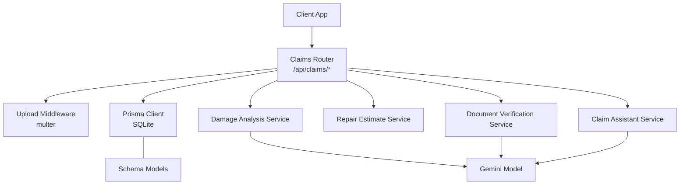
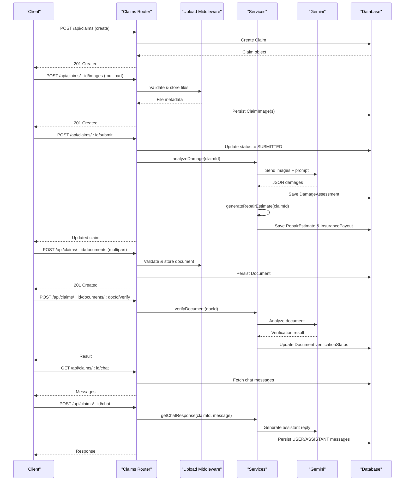
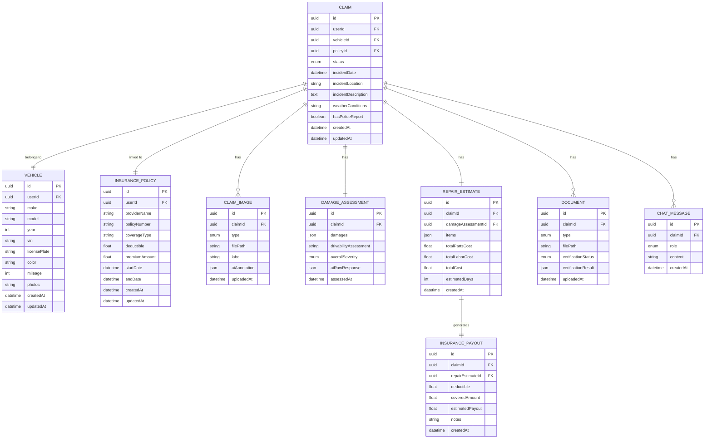
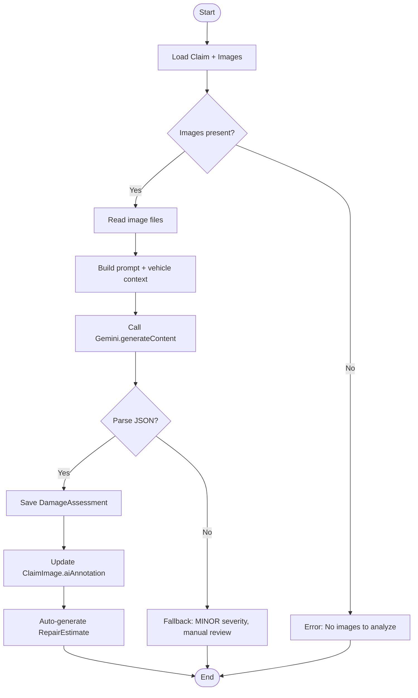
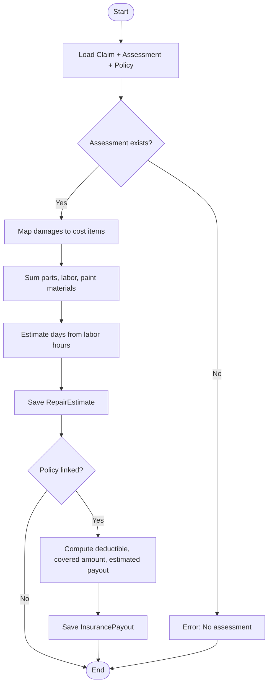
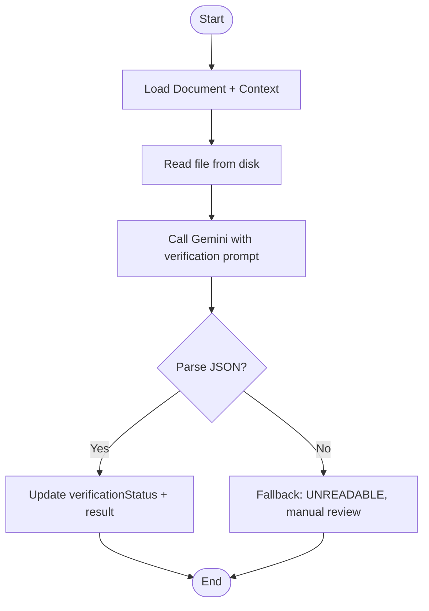
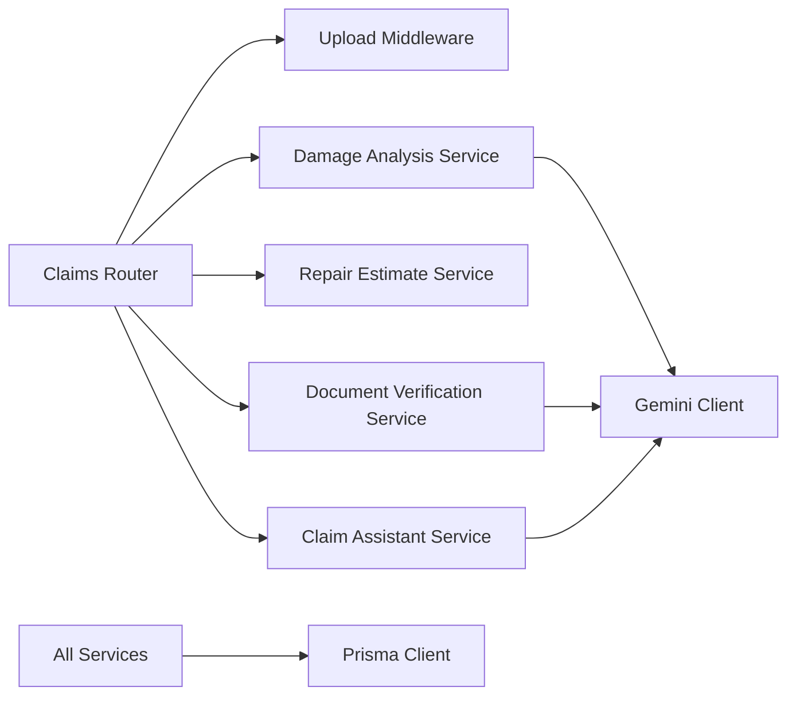

# Claims API

<cite>
**Referenced Files in This Document**
- [claims.ts](file://backend/src/routes/claims.ts)
- [damageAnalysisService.ts](file://backend/src/services/damageAnalysisService.ts)
- [repairEstimateService.ts](file://backend/src/services/repairEstimateService.ts)
- [documentVerificationService.ts](file://backend/src/services/documentVerificationService.ts)
- [claimAssistantService.ts](file://backend/src/services/claimAssistantService.ts)
- [upload.ts](file://backend/src/middleware/upload.ts)
- [schema.prisma](file://backend/prisma/schema.prisma)
- [index.ts (types)](file://backend/src/types/index.ts)
- [gemini.ts](file://backend/src/utils/gemini.ts)
- [api.ts](file://frontend/src/services/api.ts)
- [NewClaimPage.tsx](file://frontend/src/pages/NewClaimPage.tsx)
</cite>

## Table of Contents
1. Introduction
2. Project Structure
3. Core Components
4. Architecture Overview
5. Detailed Component Analysis
6. Dependency Analysis
7. Performance Considerations
8. Troubleshooting Guide
9. Conclusion
10. Appendices

## Introduction
This document provides comprehensive API documentation for the claims processing endpoints of the Smart Vehicle Insurance Claim System. It covers the complete claim lifecycle from creation to resolution, including:
- Creating and updating claims
- Uploading images and documents with validation
- AI-powered damage assessment using Gemini
- Automated repair estimates and insurance payout calculations
- Document verification via AI
- Interactive chat assistance per claim
- Error handling and status tracking

The API is protected by authentication middleware and integrates with a database via Prisma and an external AI service through Google Generative AI.

## Project Structure
The backend exposes RESTful endpoints under /api/claims. The routes handle request validation, file uploads, database operations, and orchestrate AI services for analysis and estimation. Supporting modules include:
- Routes: Express router defining all claim-related endpoints
- Services: Damage analysis, repair estimate generation, document verification, and assistant chat
- Middleware: File upload handling with type and size constraints
- Data models: Prisma schema defining entities like Claim, ClaimImage, Document, DamageAssessment, RepairEstimate, InsurancePayout, ChatMessage
- Types: Shared TypeScript interfaces for requests/responses
- Utilities: Gemini client configuration

**Diagram sources**
- [claims.ts:20-449](file://backend/src/routes/claims.ts#L20-L449)
- [upload.ts:1-54](file://backend/src/middleware/upload.ts#L1-L54)
- [damageAnalysisService.ts:50-153](file://backend/src/services/damageAnalysisService.ts#L50-L153)
- [repairEstimateService.ts:104-199](file://backend/src/services/repairEstimateService.ts#L104-L199)
- [documentVerificationService.ts:41-107](file://backend/src/services/documentVerificationService.ts#L41-L107)
- [claimAssistantService.ts:19-130](file://backend/src/services/claimAssistantService.ts#L19-L130)
- [gemini.ts:1-12](file://backend/src/utils/gemini.ts#L1-L12)
- [schema.prisma:62-202](file://backend/prisma/schema.prisma#L62-L202)

**Section sources**
- [claims.ts:20-449](file://backend/src/routes/claims.ts#L20-L449)
- [schema.prisma:62-202](file://backend/prisma/schema.prisma#L62-L202)

## Core Components
- Claims Router: Defines endpoints for CRUD on claims, image/document uploads, submission, analysis, estimates, verification, and chat.
- Upload Middleware: Validates file types (JPEG, PNG, WebP), enforces 10MB limit, stores files under uploads/images or uploads/documents.
- Damage Analysis Service: Reads uploaded images, sends them to Gemini with a structured prompt, parses JSON output, persists assessment, updates image annotations, and auto-generates repair estimates.
- Repair Estimate Service: Computes itemized costs based on damage severity and parts/labor ranges, calculates totals, estimated days, and optional insurance payout.
- Document Verification Service: Analyzes uploaded documents via Gemini, extracts key info, determines verification status, and persists results.
- Claim Assistant Service: Builds context from claim data and conversation history, interacts with Gemini to provide guidance, and persists chat messages.

**Section sources**
- [claims.ts:20-449](file://backend/src/routes/claims.ts#L20-L449)
- [upload.ts:1-54](file://backend/src/middleware/upload.ts#L1-L54)
- [damageAnalysisService.ts:50-153](file://backend/src/services/damageAnalysisService.ts#L50-L153)
- [repairEstimateService.ts:104-199](file://backend/src/services/repairEstimateService.ts#L104-L199)
- [documentVerificationService.ts:41-107](file://backend/src/services/documentVerificationService.ts#L41-L107)
- [claimAssistantService.ts:19-130](file://backend/src/services/claimAssistantService.ts#L19-L130)

## Architecture Overview
The claims API follows a layered architecture:
- Presentation Layer: Express routes handle HTTP requests and responses.
- Business Logic Layer: Services encapsulate domain logic (AI integration, cost calculation).
- Data Access Layer: Prisma ORM abstracts SQLite interactions.
- External Integration: Google Generative AI model processes images and text to produce assessments, verifications, and chat responses.

**Diagram sources**
- [claims.ts:20-449](file://backend/src/routes/claims.ts#L20-L449)
- [damageAnalysisService.ts:50-153](file://backend/src/services/damageAnalysisService.ts#L50-L153)
- [repairEstimateService.ts:104-199](file://backend/src/services/repairEstimateService.ts#L104-L199)
- [documentVerificationService.ts:41-107](file://backend/src/services/documentVerificationService.ts#L41-L107)
- [claimAssistantService.ts:19-130](file://backend/src/services/claimAssistantService.ts#L19-L130)
- [upload.ts:1-54](file://backend/src/middleware/upload.ts#L1-L54)

## Detailed Component Analysis

### Endpoints Reference

#### Create Claim
- Method: POST
- Path: /api/claims
- Auth: Required
- Request Body:
  - vehicleId: string (required)
  - policyId: string? (optional)
  - incidentDate: string (ISO date, required)
  - incidentLocation: string (required)
  - incidentDescription: string (required)
  - weatherConditions: string? (optional)
  - hasPoliceReport: boolean? (optional)
- Success Response: 201 Created with Claim object
- Errors:
  - 400 Bad Request if required fields missing
  - 404 Not Found if vehicle not found
  - 500 Internal Server Error on failure

**Section sources**
- [claims.ts:20-57](file://backend/src/routes/claims.ts#L20-L57)
- [schema.prisma:71-94](file://backend/prisma/schema.prisma#L71-L94)

#### List Claims
- Method: GET
- Path: /api/claims
- Query Params:
  - status: string? (filter by ClaimStatus)
- Success Response: Array of claims with vehicle summary, damage assessment severity, and counts of images/documents
- Errors: 500 on failure

**Section sources**
- [claims.ts:59-83](file://backend/src/routes/claims.ts#L59-L83)
- [schema.prisma:62-94](file://backend/prisma/schema.prisma#L62-L94)

#### Get Claim Detail
- Method: GET
- Path: /api/claims/:id
- Success Response: Full claim with related vehicle, policy, images, damageAssessment, repairEstimate, insurancePayout, documents, and chatMessages
- Errors:
  - 404 Not Found
  - 500 on failure

**Section sources**
- [claims.ts:85-112](file://backend/src/routes/claims.ts#L85-L112)
- [schema.prisma:71-202](file://backend/prisma/schema.prisma#L71-L202)

#### Update Claim
- Method: PUT
- Path: /api/claims/:id
- Constraints: Only allowed when status is DRAFT
- Request Body: Partial fields (incidentDate, incidentLocation, incidentDescription, weatherConditions, hasPoliceReport, policyId)
- Success Response: Updated Claim
- Errors:
  - 400 if not in DRAFT
  - 404 if not found
  - 500 on failure

**Section sources**
- [claims.ts:114-150](file://backend/src/routes/claims.ts#L114-L150)
- [schema.prisma:62-94](file://backend/prisma/schema.prisma#L62-L94)

#### Submit Claim
- Method: POST
- Path: /api/claims/:id/submit
- Constraints: Must be in DRAFT; at least one image must be uploaded
- Behavior: Updates status to SUBMITTED and triggers background AI damage analysis
- Success Response: Updated claim
- Errors:
  - 400 if already submitted or no images
  - 404 if not found
  - 500 on failure

**Section sources**
- [claims.ts:152-193](file://backend/src/routes/claims.ts#L152-L193)
- [damageAnalysisService.ts:50-153](file://backend/src/services/damageAnalysisService.ts#L50-L153)

#### Upload Images
- Method: POST
- Path: /api/claims/:id/images
- Content-Type: multipart/form-data
- Fields:
  - images: File[] (up to 10)
  - imageType: FULL_VEHICLE | DAMAGE_CLOSEUP (default FULL_VEHICLE)
- Validation: JPEG, PNG, WebP; max 10MB each
- Success Response: 201 Created with array of ClaimImage objects
- Errors:
  - 400 if no images uploaded
  - 404 if claim not found
  - 500 on failure

**Section sources**
- [claims.ts:195-233](file://backend/src/routes/claims.ts#L195-L233)
- [upload.ts:1-54](file://backend/src/middleware/upload.ts#L1-L54)
- [schema.prisma:96-111](file://backend/prisma/schema.prisma#L96-L111)

#### Delete Image
- Method: DELETE
- Path: /api/claims/:id/images/:imageId
- Behavior: Deletes file from disk and removes record
- Success Response: { message }
- Errors:
  - 404 if claim or image not found
  - 500 on failure

**Section sources**
- [claims.ts:235-268](file://backend/src/routes/claims.ts#L235-L268)

#### Trigger Damage Analysis
- Method: POST
- Path: /api/claims/:id/analyze
- Behavior: Calls AI to analyze images and returns assessment
- Success Response: DamageAnalysisResult
- Errors:
  - 404 if claim not found
  - 500 on failure

**Section sources**
- [claims.ts:270-288](file://backend/src/routes/claims.ts#L270-L288)
- [damageAnalysisService.ts:50-153](file://backend/src/services/damageAnalysisService.ts#L50-L153)

#### Generate Repair Estimate
- Method: POST
- Path: /api/claims/:id/estimate
- Constraints: Requires prior damage assessment
- Success Response: RepairEstimateResult
- Errors:
  - 400 if no damage assessment
  - 404 if claim not found
  - 500 on failure

**Section sources**
- [claims.ts:290-314](file://backend/src/routes/claims.ts#L290-L314)
- [repairEstimateService.ts:104-199](file://backend/src/services/repairEstimateService.ts#L104-L199)

#### Upload Document
- Method: POST
- Path: /api/claims/:id/documents
- Content-Type: multipart/form-data
- Fields:
  - document: File
  - documentType: LICENSE | REGISTRATION | ACCIDENT_REPORT | REPAIR_ESTIMATE (default LICENSE)
- Validation: JPEG, PNG, WebP; max 10MB
- Success Response: 201 Created with Document object
- Errors:
  - 400 if invalid documentType or no file
  - 404 if claim not found
  - 500 on failure

**Section sources**
- [claims.ts:316-353](file://backend/src/routes/claims.ts#L316-L353)
- [upload.ts:1-54](file://backend/src/middleware/upload.ts#L1-L54)
- [schema.prisma:162-186](file://backend/prisma/schema.prisma#L162-L186)

#### List Documents
- Method: GET
- Path: /api/claims/:id/documents
- Success Response: Array of documents sorted by uploadedAt desc
- Errors:
  - 404 if claim not found
  - 500 on failure

**Section sources**
- [claims.ts:355-377](file://backend/src/routes/claims.ts#L355-L377)
- [schema.prisma:162-186](file://backend/prisma/schema.prisma#L162-L186)

#### Verify Document
- Method: POST
- Path: /api/claims/:id/documents/:docId/verify
- Behavior: Calls AI to verify document authenticity/completeness and updates verificationStatus
- Success Response: DocumentVerificationResult
- Errors:
  - 404 if document not found
  - 500 on failure

**Section sources**
- [claims.ts:379-397](file://backend/src/routes/claims.ts#L379-L397)
- [documentVerificationService.ts:41-107](file://backend/src/services/documentVerificationService.ts#L41-L107)

#### Get Chat Messages
- Method: GET
- Path: /api/claims/:id/chat
- Success Response: Array of chat messages ordered by createdAt asc
- Errors:
  - 404 if claim not found
  - 500 on failure

**Section sources**
- [claims.ts:399-421](file://backend/src/routes/claims.ts#L399-L421)
- [schema.prisma:188-202](file://backend/prisma/schema.prisma#L188-L202)

#### Send Chat Message
- Method: POST
- Path: /api/claims/:id/chat
- Request Body:
  - message: string (required)
- Behavior: Generates assistant response using Gemini and persists both user and assistant messages
- Success Response: { userMessage, assistantMessage }
- Errors:
  - 400 if message missing
  - 404 if claim not found
  - 500 on failure

**Section sources**
- [claims.ts:423-447](file://backend/src/routes/claims.ts#L423-L447)
- [claimAssistantService.ts:19-130](file://backend/src/services/claimAssistantService.ts#L19-L130)

### Data Models and Relationships

**Diagram sources**
- [schema.prisma:10-202](file://backend/prisma/schema.prisma#L10-L202)

**Section sources**
- [schema.prisma:10-202](file://backend/prisma/schema.prisma#L10-L202)

### AI Integration Details

#### Damage Analysis Flow

**Diagram sources**
- [damageAnalysisService.ts:50-153](file://backend/src/services/damageAnalysisService.ts#L50-L153)

**Section sources**
- [damageAnalysisService.ts:50-153](file://backend/src/services/damageAnalysisService.ts#L50-L153)

#### Repair Estimate Calculation

**Diagram sources**
- [repairEstimateService.ts:104-199](file://backend/src/services/repairEstimateService.ts#L104-L199)

**Section sources**
- [repairEstimateService.ts:104-199](file://backend/src/services/repairEstimateService.ts#L104-L199)

#### Document Verification Flow

**Diagram sources**
- [documentVerificationService.ts:41-107](file://backend/src/services/documentVerificationService.ts#L41-L107)

**Section sources**
- [documentVerificationService.ts:41-107](file://backend/src/services/documentVerificationService.ts#L41-L107)

### Request and Response Schemas

#### Create Claim Request
- vehicleId: string (required)
- policyId: string? (optional)
- incidentDate: string ISO date (required)
- incidentLocation: string (required)
- incidentDescription: string (required)
- weatherConditions: string? (optional)
- hasPoliceReport: boolean? (optional)

**Section sources**
- [claims.ts:20-57](file://backend/src/routes/claims.ts#L20-L57)
- [schema.prisma:71-94](file://backend/prisma/schema.prisma#L71-L94)

#### Damage Analysis Result
- damages: array of items with type, severity, location, description, affectedParts
- drivabilityAssessment: string
- overallSeverity: MINOR | MODERATE | SEVERE

**Section sources**
- [damageAnalysisService.ts:50-153](file://backend/src/services/damageAnalysisService.ts#L50-L153)
- [index.ts:12-24](file://backend/src/types/index.ts#L12-L24)

#### Repair Estimate Result
- items: array of RepairEstimateItem (damageType, partName, partCost, laborHours, laborRate, laborCost, paintMaterials, subtotal)
- totalPartsCost: number
- totalLaborCost: number
- totalCost: number
- estimatedDays: number

**Section sources**
- [repairEstimateService.ts:104-199](file://backend/src/services/repairEstimateService.ts#L104-L199)
- [index.ts:26-43](file://backend/src/types/index.ts#L26-L43)

#### Document Verification Result
- status: VERIFIED | ISSUES_FOUND | UNREADABLE
- issues: string[]
- extractedInfo: Record<string, string>
- recommendations: string[]

**Section sources**
- [documentVerificationService.ts:41-107](file://backend/src/services/documentVerificationService.ts#L41-L107)
- [index.ts:45-50](file://backend/src/types/index.ts#L45-L50)

### File Upload Handling
- Supported formats: image/jpeg, image/png, image/webp, image/jpg
- Max file size: 10 MB per file
- Storage:
  - Images: uploads/images/<uuid>.ext
  - Documents: uploads/documents/<uuid>.ext
- Field names:
  - Images: images (array), imageType (FULL_VEHICLE | DAMAGE_CLOSEUP)
  - Documents: document (single), documentType (LICENSE | REGISTRATION | ACCIDENT_REPORT | REPAIR_ESTIMATE)

**Section sources**
- [upload.ts:1-54](file://backend/src/middleware/upload.ts#L1-L54)
- [claims.ts:195-233](file://backend/src/routes/claims.ts#L195-L233)
- [claims.ts:316-353](file://backend/src/routes/claims.ts#L316-L353)

### Examples

#### Submit a New Claim
- Steps:
  1. POST /api/claims with claim details
  2. POST /api/claims/:id/images with full vehicle and damage close-up photos
  3. POST /api/claims/:id/submit to finalize and trigger analysis
- Frontend flow demonstrates this sequence and navigation to claim detail page

**Section sources**
- [NewClaimPage.tsx:72-94](file://frontend/src/pages/NewClaimPage.tsx#L72-L94)
- [claims.ts:20-193](file://backend/src/routes/claims.ts#L20-L193)

#### Upload Evidence
- Use POST /api/claims/:id/images with multipart form data containing images and imageType
- Use POST /api/claims/:id/documents with multipart form data containing document and documentType

**Section sources**
- [claims.ts:195-233](file://backend/src/routes/claims.ts#L195-L233)
- [claims.ts:316-353](file://backend/src/routes/claims.ts#L316-L353)
- [upload.ts:1-54](file://backend/src/middleware/upload.ts#L1-L54)

#### Track Claim Status
- GET /api/claims to list claims with optional status filter
- GET /api/claims/:id to retrieve full claim details including status, images, documents, assessments, estimates, payouts, and chat

**Section sources**
- [claims.ts:59-112](file://backend/src/routes/claims.ts#L59-L112)

#### Retrieve Assessment Results
- POST /api/claims/:id/analyze to trigger analysis and return DamageAnalysisResult
- Or rely on automatic analysis triggered upon submit

**Section sources**
- [claims.ts:270-288](file://backend/src/routes/claims.ts#L270-L288)
- [damageAnalysisService.ts:50-153](file://backend/src/services/damageAnalysisService.ts#L50-L153)

## Dependency Analysis
- Route dependencies:
  - Uses authMiddleware for authentication
  - Uses upload middleware for file handling
  - Calls services for AI tasks and business logic
- Service dependencies:
  - DamageAnalysisService depends on Gemini client and Prisma
  - RepairEstimateService depends on Prisma and cost tables
  - DocumentVerificationService depends on Gemini client and Prisma
  - ClaimAssistantService depends on Gemini client and Prisma
- External dependencies:
  - Google Generative AI for image/text processing
  - Multer for file uploads
  - Prisma for database access

**Diagram sources**
- [claims.ts:20-449](file://backend/src/routes/claims.ts#L20-L449)
- [damageAnalysisService.ts:50-153](file://backend/src/services/damageAnalysisService.ts#L50-L153)
- [repairEstimateService.ts:104-199](file://backend/src/services/repairEstimateService.ts#L104-L199)
- [documentVerificationService.ts:41-107](file://backend/src/services/documentVerificationService.ts#L41-L107)
- [claimAssistantService.ts:19-130](file://backend/src/services/claimAssistantService.ts#L19-L130)
- [gemini.ts:1-12](file://backend/src/utils/gemini.ts#L1-L12)

**Section sources**
- [claims.ts:20-449](file://backend/src/routes/claims.ts#L20-L449)
- [gemini.ts:1-12](file://backend/src/utils/gemini.ts#L1-L12)

## Performance Considerations
- Background processing: Damage analysis is initiated asynchronously after claim submission to avoid blocking the response.
- Batch uploads: Image endpoint supports multiple files up to 10 per request to reduce round trips.
- File size limits: Enforced at 10MB to prevent large payloads impacting performance.
- Database queries: Include selective fields to minimize payload size and improve load times.
- AI calls: Gemini requests can be latency-sensitive; consider retry logic and caching strategies for repeated analyses if needed.

[No sources needed since this section provides general guidance]

## Troubleshooting Guide
Common errors and resolutions:
- Invalid claim creation: Ensure required fields (vehicleId, incidentDate, incidentLocation, incidentDescription) are provided.
- Missing images on submit: At least one image must be uploaded before submitting a claim.
- Document upload failures: Verify file format (JPEG, PNG, WebP) and size (≤10MB); ensure documentType is valid.
- AI service failures: If Gemini parsing fails, fallback results are used; check logs and retry verification or analysis.
- Unauthorized access: Ensure valid token is attached; frontend interceptor handles 401 by clearing session and redirecting to login.

**Section sources**
- [claims.ts:20-193](file://backend/src/routes/claims.ts#L20-L193)
- [upload.ts:30-41](file://backend/src/middleware/upload.ts#L30-L41)
- [damageAnalysisService.ts:85-103](file://backend/src/services/damageAnalysisService.ts#L85-L103)
- [documentVerificationService.ts:78-94](file://backend/src/services/documentVerificationService.ts#L78-L94)
- [api.ts:11-36](file://frontend/src/services/api.ts#L11-L36)

## Conclusion
The Claims API provides a robust, end-to-end workflow for vehicle insurance claims, integrating AI-driven damage assessment, automated repair estimates, document verification, and interactive assistance. With clear request/response schemas, strict validation, and comprehensive error handling, it supports efficient claim processing from submission to resolution.

[No sources needed since this section summarizes without analyzing specific files]

## Appendices

### Authentication and Security
- All endpoints require authentication via Bearer token; middleware attaches userId to requests.
- Frontend automatically includes Authorization header and handles 401 by clearing session.

**Section sources**
- [claims.ts:15-18](file://backend/src/routes/claims.ts#L15-L18)
- [api.ts:11-36](file://frontend/src/services/api.ts#L11-L36)

### Environment Configuration
- Gemini API key: GEMINI_API_KEY
- Upload directory: UPLOAD_DIR (defaults to ./uploads)
- Database URL: DATABASE_URL (SQLite)

**Section sources**
- [gemini.ts:1-12](file://backend/src/utils/gemini.ts#L1-L12)
- [upload.ts:6-15](file://backend/src/middleware/upload.ts#L6-L15)
- [schema.prisma:5-8](file://backend/prisma/schema.prisma#L5-L8)