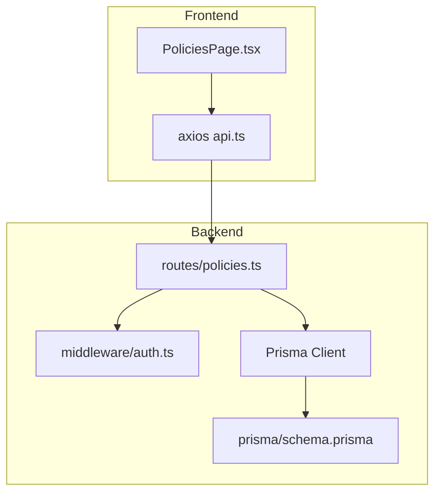
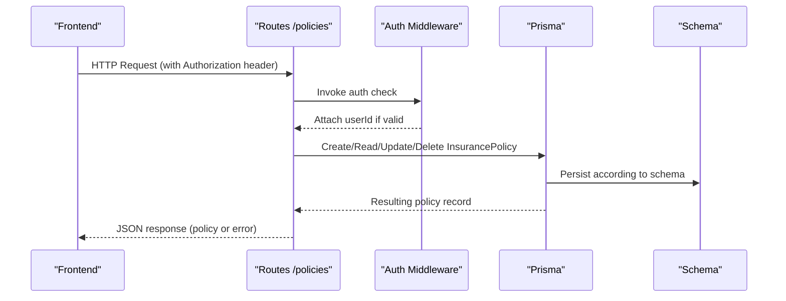
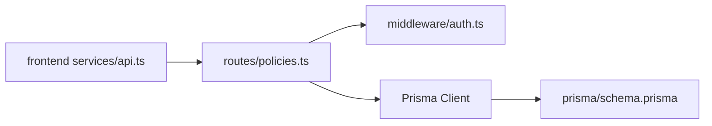

# Policies API

<cite>
**Referenced Files in This Document**
- [policies.ts](file://backend/src/routes/policies.ts)
- [schema.prisma](file://backend/prisma/schema.prisma)
- [auth.ts](file://backend/src/middleware/auth.ts)
- [errorHandler.ts](file://backend/src/middleware/errorHandler.ts)
- [claims.ts](file://backend/src/routes/claims.ts)
- [PoliciesPage.tsx](file://frontend/src/pages/PoliciesPage.tsx)
- [api.ts](file://frontend/src/services/api.ts)
</cite>

## Table of Contents
1. Introduction
2. Project Structure
3. Core Components
4. Architecture Overview
5. Detailed Component Analysis
6. Dependency Analysis
7. Performance Considerations
8. Troubleshooting Guide
9. Conclusion

## Introduction
This document provides comprehensive API documentation for insurance policy management endpoints in the Smart Vehicle Insurance Claim System. It covers creating, retrieving, updating, and deleting policies, including request/response schemas, validation rules, status handling, relationships to vehicles and users, authentication requirements, error handling, and integration patterns with claim processing workflows. Practical examples illustrate common policy lifecycle scenarios for insurance administration.

## Project Structure
The backend exposes a RESTful API under /api/policies protected by JWT-based authentication. The data model is defined in Prisma and includes relationships between Users, Vehicles, Claims, and InsurancePolicy. The frontend consumes these endpoints via an Axios client that injects the Bearer token automatically.

**Diagram sources**
- [policies.ts:1-131](file://backend/src/routes/policies.ts#L1-L131)
- [auth.ts:1-23](file://backend/src/middleware/auth.ts#L1-L23)
- [schema.prisma:44-59](file://backend/prisma/schema.prisma#L44-L59)
- [api.ts:1-33](file://frontend/src/services/api.ts#L1-L33)
- [PoliciesPage.tsx:1-102](file://frontend/src/pages/PoliciesPage.tsx#L1-L102)

**Section sources**
- [policies.ts:1-131](file://backend/src/routes/policies.ts#L1-L131)
- [schema.prisma:10-59](file://backend/prisma/schema.prisma#L10-L59)
- [api.ts:1-33](file://frontend/src/services/api.ts#L1-L33)

## Core Components
- Policy CRUD routes: POST, GET (list), GET (by id), PUT (update), DELETE (by id).
- Authentication middleware: Validates JWT and attaches userId to requests.
- Data model: InsurancePolicy with fields for provider, coverage, deductible, premium, and validity dates; relationships to User and Claim.
- Frontend integration: UI for listing, creating, and deleting policies; automatic token injection.

Key responsibilities:
- Enforce required fields on create.
- Scope all operations to the authenticated user’s policies.
- Return consistent error shapes for client handling.

**Section sources**
- [policies.ts:12-128](file://backend/src/routes/policies.ts#L12-L128)
- [auth.ts:5-22](file://backend/src/middleware/auth.ts#L5-L22)
- [schema.prisma:44-59](file://backend/prisma/schema.prisma#L44-L59)

## Architecture Overview
The Policies API follows a simple layered architecture:
- Route handlers validate input and delegate to Prisma for persistence.
- All routes are guarded by authMiddleware to ensure requests are from authenticated users.
- Responses are standardized JSON objects with either data or error messages.
- Claims can optionally reference a policy, enabling downstream workflows to compute payouts based on policy terms.

**Diagram sources**
- [policies.ts:12-128](file://backend/src/routes/policies.ts#L12-L128)
- [auth.ts:5-22](file://backend/src/middleware/auth.ts#L5-L22)
- [schema.prisma:44-59](file://backend/prisma/schema.prisma#L44-L59)

## Detailed Component Analysis

### Authentication Requirements
- All policy endpoints require a valid JWT in the Authorization header using the Bearer scheme.
- On missing or invalid tokens, the server responds with 401 Unauthorized.
- The frontend automatically attaches the token from local storage to every request.

Authentication flow:
- Client sends requests with Authorization: Bearer <token>.
- Middleware verifies the token and sets req.userId.
- If verification fails, a 401 error is returned.

**Section sources**
- [auth.ts:5-22](file://backend/src/middleware/auth.ts#L5-L22)
- [api.ts:10-17](file://frontend/src/services/api.ts#L10-L17)

### Endpoints

#### Create Policy
- Method: POST
- Path: /api/policies
- Authentication: Required
- Request body fields:
  - providerName: string (required)
  - policyNumber: string (required)
  - coverageType: string (required)
  - deductible: number (required)
  - premiumAmount: number (required)
  - startDate: date-time string (required)
  - endDate: date-time string (required)
- Success response: 201 Created with the created InsurancePolicy object
- Error responses:
  - 400 Bad Request when any required field is missing
  - 500 Internal Server Error on unexpected failures

Validation rules enforced at the route level:
- All listed fields must be present.
- Numeric fields are parsed to floats before saving.

Relationships:
- Automatically associated with the authenticated user via userId.

Example usage:
- Add a new policy for the current user with provider details, coverage type, deductible, premium, and effective dates.

**Section sources**
- [policies.ts:12-40](file://backend/src/routes/policies.ts#L12-L40)
- [schema.prisma:44-59](file://backend/prisma/schema.prisma#L44-L59)

#### List Policies
- Method: GET
- Path: /api/policies
- Authentication: Required
- Query parameters: none
- Success response: 200 OK with an array of InsurancePolicy objects belonging to the authenticated user, ordered by creation date descending
- Error responses:
  - 500 Internal Server Error on unexpected failures

Use cases:
- Display the user’s policies in the dashboard or policies page.

**Section sources**
- [policies.ts:42-55](file://backend/src/routes/policies.ts#L42-L55)

#### Get Policy by ID
- Method: GET
- Path: /api/policies/:id
- Authentication: Required
- Path parameter: id (string)
- Success response: 200 OK with the requested InsurancePolicy object owned by the authenticated user
- Error responses:
  - 404 Not Found if no policy matches the id for this user
  - 500 Internal Server Error on unexpected failures

Use cases:
- Fetch detailed view of a specific policy.

**Section sources**
- [policies.ts:57-74](file://backend/src/routes/policies.ts#L57-L74)

#### Update Policy
- Method: PUT
- Path: /api/policies/:id
- Authentication: Required
- Path parameter: id (string)
- Request body fields (all optional):
  - providerName: string
  - policyNumber: string
  - coverageType: string
  - deductible: number
  - premiumAmount: number
  - startDate: date-time string
  - endDate: date-time string
- Success response: 200 OK with the updated InsurancePolicy object
- Error responses:
  - 404 Not Found if no policy matches the id for this user
  - 500 Internal Server Error on unexpected failures

Behavior:
- Only provided fields are updated; others remain unchanged.
- Numeric fields are parsed to floats before saving.

Use cases:
- Correct policy details or adjust coverage and premiums.

**Section sources**
- [policies.ts:76-108](file://backend/src/routes/policies.ts#L76-L108)

#### Delete Policy
- Method: DELETE
- Path: /api/policies/:id
- Authentication: Required
- Path parameter: id (string)
- Success response: 200 OK with a confirmation message
- Error responses:
  - 404 Not Found if no policy matches the id for this user
  - 500 Internal Server Error on unexpected failures

Use cases:
- Remove outdated or incorrect policies.

**Section sources**
- [policies.ts:110-128](file://backend/src/routes/policies.ts#L110-L128)

### Policy Data Model
The InsurancePolicy entity contains:
- id: unique identifier
- userId: owner of the policy
- providerName: insurance provider name
- policyNumber: unique policy identifier
- coverageType: type of coverage (e.g., Comprehensive, Collision, Liability, Full Coverage)
- deductible: numeric deductible amount
- premiumAmount: numeric premium amount
- startDate: effective start date
- endDate: expiration date
- createdAt, updatedAt: timestamps

Relationships:
- Belongs to a User (one-to-many from User to InsurancePolicy)
- Can be referenced by multiple Claims (one-to-many from InsurancePolicy to Claim)

Notes:
- There is no explicit “status” field on InsurancePolicy; policy validity is inferred from the current date relative to startDate and endDate.
- Deleting a User cascades to their policies.

**Section sources**
- [schema.prisma:44-59](file://backend/prisma/schema.prisma#L44-L59)

### Validation Rules
- Create endpoint requires all fields: providerName, policyNumber, coverageType, deductible, premiumAmount, startDate, endDate.
- Missing or empty required fields result in a 400 error with a descriptive message.
- Numeric fields are converted to floats before persistence.
- Date fields are parsed into DateTime values.

Edge cases:
- Duplicate policy numbers are not explicitly prevented at the route layer; uniqueness constraints would need to be added to the schema if required.
- No business rule checks for overlapping policies or coverage limits are implemented in the routes.

**Section sources**
- [policies.ts:12-40](file://backend/src/routes/policies.ts#L12-L40)

### Status Tracking
- InsurancePolicy does not include a status field.
- Effective status can be derived by comparing the current date with startDate and endDate.
- For claims, status is tracked separately via ClaimStatus enum.

Implications:
- Clients should compute active/expired status client-side if needed.
- Business logic for policy lifecycle states should be applied at query time or via additional schema fields if future requirements demand it.

**Section sources**
- [schema.prisma:44-59](file://backend/prisma/schema.prisma#L44-L59)

### Relationship Mapping to Vehicles and Users
- Policies are scoped to the authenticated user (userId).
- Claims may reference a policyId; when a claim is created or updated, it can be linked to a policy owned by the same user context.
- Vehicles are also owned by users and are independent of policies; however, claims associate both vehicle and policy to provide full context for incident analysis and payout calculations.

Integration pattern:
- When creating or editing a claim, select a policy from the user’s available policies to link the claim to coverage terms.

**Section sources**
- [schema.prisma:10-59](file://backend/prisma/schema.prisma#L10-L59)
- [claims.ts:28-57](file://backend/src/routes/claims.ts#L28-L57)

### Integration Patterns with Claim Processing Workflows
- Claims can be created with an optional policyId.
- During claim submission and processing, the system can use the linked policy’s coverageType, deductible, and premiumAmount to inform assessments and potential payouts.
- The assistant service composes context including policy details when generating insights about a claim.

Operational guidance:
- Always associate a valid policy with a claim when applicable to enable accurate coverage evaluation.
- Ensure the policy is within its effective dates at the time of the incident.

**Section sources**
- [schema.prisma:70-93](file://backend/prisma/schema.prisma#L70-L93)
- [claims.ts:28-57](file://backend/src/routes/claims.ts#L28-L57)

### Practical Examples and Common Use Cases

- Create a new policy:
  - Provide providerName, policyNumber, coverageType, deductible, premiumAmount, startDate, endDate.
  - Expect 201 with the created policy.

- List all policies:
  - Retrieve an array of policies for the current user.

- View a specific policy:
  - Fetch details by id; expect 404 if not found or unauthorized.

- Update policy details:
  - Send only the fields you want to change; expect the updated policy.

- Delete a policy:
  - Remove a policy by id; expect success message or 404 if not found.

- Link policy to a claim:
  - When creating or editing a claim, set policyId to associate coverage details for assessment and payout calculations.

**Section sources**
- [policies.ts:12-128](file://backend/src/routes/policies.ts#L12-L128)
- [claims.ts:28-57](file://backend/src/routes/claims.ts#L28-L57)

## Dependency Analysis
- Routes depend on Prisma client for data access and on authMiddleware for security.
- The schema defines relationships that enforce referential integrity between User, Vehicle, Claim, and InsurancePolicy.
- Frontend depends on the backend API and uses axios interceptors to manage authentication state.

**Diagram sources**
- [policies.ts:1-131](file://backend/src/routes/policies.ts#L1-L131)
- [auth.ts:1-23](file://backend/src/middleware/auth.ts#L1-L23)
- [schema.prisma:44-59](file://backend/prisma/schema.prisma#L44-L59)
- [api.ts:1-33](file://frontend/src/services/api.ts#L1-L33)

**Section sources**
- [policies.ts:1-131](file://backend/src/routes/policies.ts#L1-L131)
- [schema.prisma:44-59](file://backend/prisma/schema.prisma#L44-L59)
- [api.ts:1-33](file://frontend/src/services/api.ts#L1-L33)

## Performance Considerations
- Queries are filtered by userId to limit results to the authenticated user’s scope.
- Listing policies orders by createdAt descending; consider adding pagination for large datasets.
- Avoid unnecessary updates by sending only changed fields in PUT requests.
- Indexing userId and policyNumber in the database could improve lookup performance if the dataset grows significantly.

[No sources needed since this section provides general guidance]

## Troubleshooting Guide
Common errors and resolutions:
- 401 Unauthorized:
  - Cause: Missing or invalid JWT token.
  - Resolution: Ensure Authorization header includes a valid Bearer token; refresh token if expired.

- 400 Bad Request:
  - Cause: Missing required fields when creating a policy.
  - Resolution: Include all required fields in the request body.

- 404 Not Found:
  - Cause: Policy id does not belong to the authenticated user or does not exist.
  - Resolution: Verify the id and ensure the user owns the policy.

- 500 Internal Server Error:
  - Cause: Unexpected server-side failure during database operations.
  - Resolution: Retry the request; check server logs for stack traces.

Error handling strategy:
- Global error handler returns standardized error objects.
- Route-level try/catch blocks log errors and return appropriate status codes.

**Section sources**
- [auth.ts:5-22](file://backend/src/middleware/auth.ts#L5-L22)
- [errorHandler.ts:13-27](file://backend/src/middleware/errorHandler.ts#L13-L27)
- [policies.ts:12-128](file://backend/src/routes/policies.ts#L12-L128)

## Conclusion
The Policies API provides secure, user-scoped CRUD operations for managing insurance policies. It integrates seamlessly with claim processing by allowing claims to reference policies, enabling coverage-aware assessments and payouts. By following the documented request/response schemas, validation rules, and authentication requirements, clients can implement robust policy lifecycle management for insurance administration workflows.