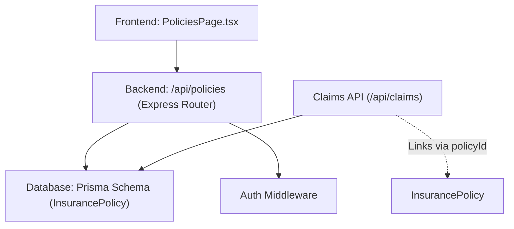
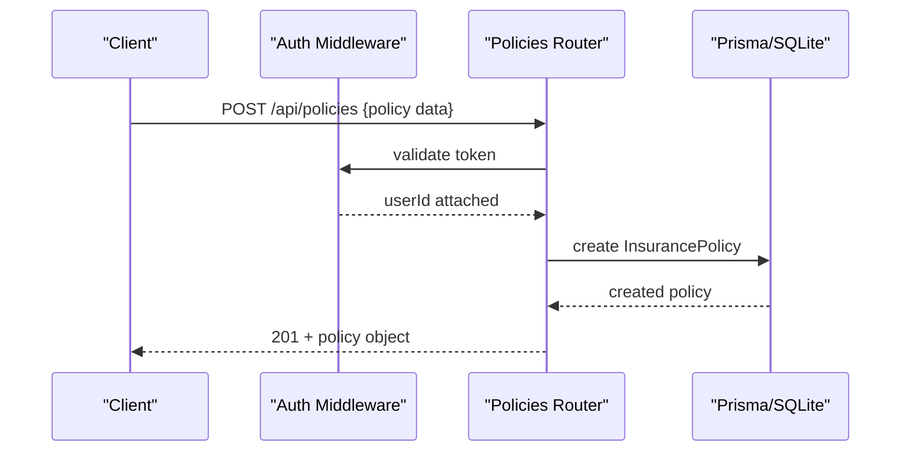
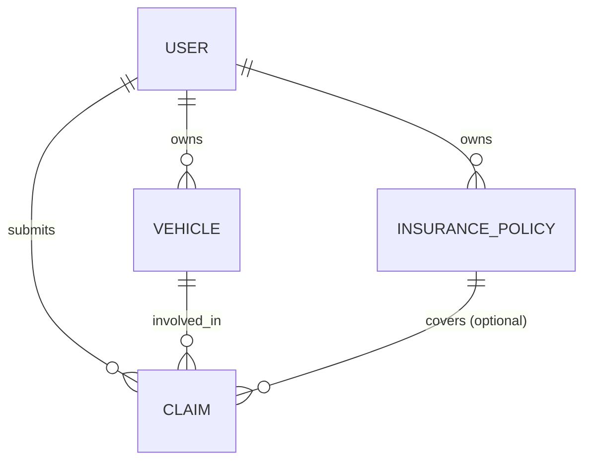
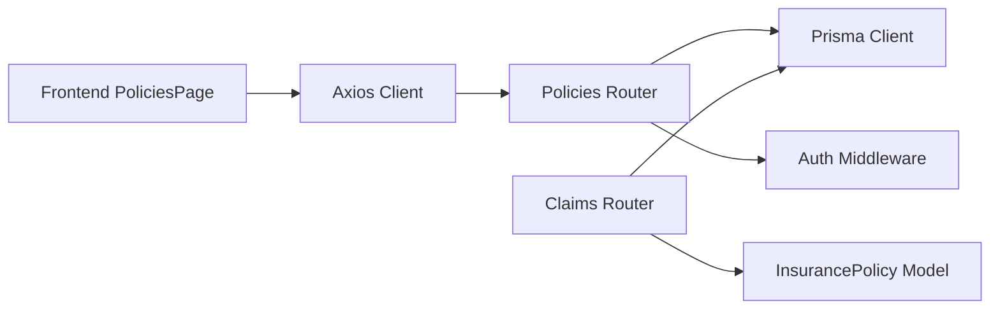
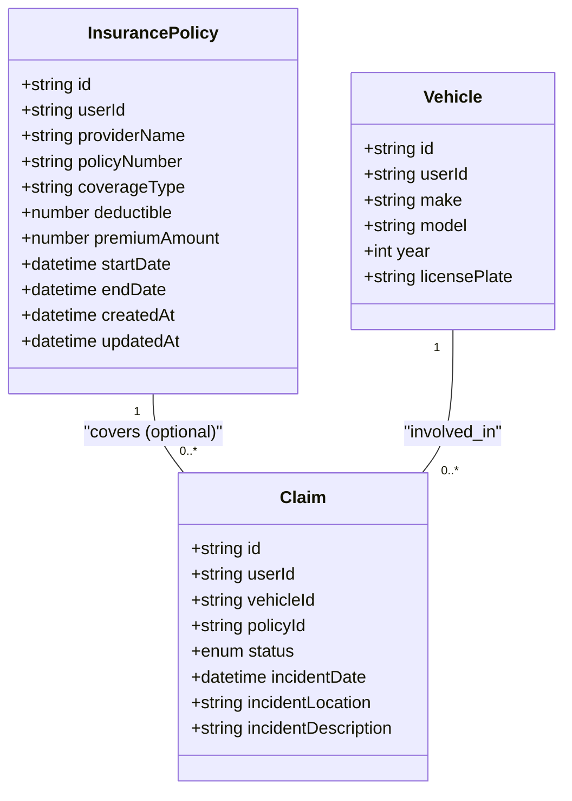

# Policies API

<cite>
**Referenced Files in This Document**
- [policies.ts](file://backend/src/routes/policies.ts)
- [schema.prisma](file://backend/prisma/schema.prisma)
- [claims.ts](file://backend/src/routes/claims.ts)
- [index.ts (types)](file://backend/src/types/index.ts)
- [api.ts (frontend client)](file://frontend/src/services/api.ts)
- [PoliciesPage.tsx](file://frontend/src/pages/PoliciesPage.tsx)
</cite>

## Table of Contents
1. [Introduction](#introduction)
2. [Project Structure](#project-structure)
3. [Core Components](#core-components)
4. [Architecture Overview](#architecture-overview)
5. [Detailed Component Analysis](#detailed-component-analysis)
6. [Dependency Analysis](#dependency-analysis)
7. [Performance Considerations](#performance-considerations)
8. [Troubleshooting Guide](#troubleshooting-guide)
9. [Conclusion](#conclusion)
10. [Appendices](#appendices)

## Introduction
This document provides comprehensive API documentation for insurance policy management endpoints in the Smart Vehicle Insurance Claim System. It covers creating, retrieving, updating, and deleting policies; request/response schemas; validation rules; lifecycle considerations; relationships with vehicles and claims; and integration points with the claims processing system.

## Project Structure
The backend exposes RESTful endpoints under /api/policies. The routes are protected by authentication middleware and interact with a Prisma-managed SQLite database. The frontend includes a dedicated page to create and manage policies and uses an Axios client that attaches authentication tokens.

**Diagram sources**
- [policies.ts:1-131](file://backend/src/routes/policies.ts#L1-L131)
- [schema.prisma:45-60](file://backend/prisma/schema.prisma#L45-L60)
- [claims.ts:20-57](file://backend/src/routes/claims.ts#L20-L57)

**Section sources**
- [policies.ts:1-131](file://backend/src/routes/policies.ts#L1-L131)
- [schema.prisma:1-202](file://backend/prisma/schema.prisma#L1-L202)
- [PoliciesPage.tsx:1-102](file://frontend/src/pages/PoliciesPage.tsx#L1-L102)
- [api.ts:1-36](file://frontend/src/services/api.ts#L1-L36)

## Core Components
- Policy CRUD endpoints:
  - POST /api/policies: Create a new policy
  - GET /api/policies: List all policies for the authenticated user
  - GET /api/policies/:id: Retrieve a specific policy
  - PUT /api/policies/:id: Update a policy
  - DELETE /api/policies/:id: Delete a policy
- Data model: InsurancePolicy stored in the database with fields for provider, coverage type, deductible, premium amount, and effective dates.
- Authentication: All endpoints require a valid token via auth middleware.
- Claims integration: Claims can optionally reference a policy via policyId.

**Section sources**
- [policies.ts:12-128](file://backend/src/routes/policies.ts#L12-L128)
- [schema.prisma:45-60](file://backend/prisma/schema.prisma#L45-L60)
- [claims.ts:20-57](file://backend/src/routes/claims.ts#L20-L57)

## Architecture Overview
The Policies API is a thin layer over Prisma data access. Requests are validated at the route level, persisted to the database, and returned as JSON. The frontend manages UI state and calls these endpoints through a shared Axios instance that injects authentication headers.

**Diagram sources**
- [policies.ts:12-40](file://backend/src/routes/policies.ts#L12-L40)
- [schema.prisma:45-60](file://backend/prisma/schema.prisma#L45-L60)

## Detailed Component Analysis

### Endpoints Reference

- Create Policy
  - Method: POST
  - Path: /api/policies
  - Auth: Required
  - Request body fields:
    - providerName: string (required)
    - policyNumber: string (required)
    - coverageType: string (required; values used in UI include Comprehensive, Collision, Liability, Full Coverage)
    - deductible: number (required; stored as float)
    - premiumAmount: number (required; stored as float)
    - startDate: date-time (required)
    - endDate: date-time (required)
  - Success response: 201 Created with the created InsurancePolicy object
  - Error responses:
    - 400 Bad Request if required fields are missing or invalid
    - 500 Internal Server Error on server-side failures

- List Policies
  - Method: GET
  - Path: /api/policies
  - Auth: Required
  - Query parameters: none
  - Response: Array of InsurancePolicy objects belonging to the authenticated user, ordered by creation date descending

- Get Policy
  - Method: GET
  - Path: /api/policies/:id
  - Auth: Required
  - Path params: id (string)
  - Response: Single InsurancePolicy object if found and owned by the user
  - Error responses:
    - 404 Not Found if policy does not exist or is not owned by the user
    - 500 Internal Server Error on server-side failures

- Update Policy
  - Method: PUT
  - Path: /api/policies/:id
  - Auth: Required
  - Path params: id (string)
  - Request body fields: any subset of providerName, policyNumber, coverageType, deductible, premiumAmount, startDate, endDate (all optional; only provided fields are updated)
  - Response: Updated InsurancePolicy object
  - Error responses:
    - 404 Not Found if policy does not exist or is not owned by the user
    - 500 Internal Server Error on server-side failures

- Delete Policy
  - Method: DELETE
  - Path: /api/policies/:id
  - Auth: Required
  - Path params: id (string)
  - Response: Confirmation message
  - Error responses:
    - 404 Not Found if policy does not exist or is not owned by the user
    - 500 Internal Server Error on server-side failures

Notes:
- All numeric fields are parsed as floats before persistence.
- Dates are converted to Date objects before storage.
- Ownership is enforced by filtering queries with the authenticated user’s ID.

**Section sources**
- [policies.ts:12-128](file://backend/src/routes/policies.ts#L12-L128)
- [schema.prisma:45-60](file://backend/prisma/schema.prisma#L45-L60)

### Request Schemas and Validation Rules

- Required fields for creation:
  - providerName, policyNumber, coverageType, deductible, premiumAmount, startDate, endDate
- Field types:
  - Strings: providerName, policyNumber, coverageType
  - Numbers: deductible, premiumAmount (stored as float)
  - Dates: startDate, endDate (ISO date strings accepted)
- Validation behavior:
  - Missing required fields result in a 400 error with a descriptive message
  - Numeric fields are coerced to floats; invalid numbers will cause parsing errors handled by the server
  - No explicit business rule checks for coverage limits or premium calculations are implemented in the current codebase

Coverage types observed in the UI:
- Comprehensive, Collision, Liability, Full Coverage

**Section sources**
- [policies.ts:15-20](file://backend/src/routes/policies.ts#L15-L20)
- [PoliciesPage.tsx:55-63](file://frontend/src/pages/PoliciesPage.tsx#L55-L63)

### Response Formats

- Policy object fields:
  - id: string (UUID)
  - userId: string (owner)
  - providerName: string
  - policyNumber: string
  - coverageType: string
  - deductible: number (float)
  - premiumAmount: number (float)
  - startDate: date-time
  - endDate: date-time
  - createdAt: date-time
  - updatedAt: date-time

- Lists return arrays of the above objects.
- Errors return JSON objects with an error field describing the issue.

**Section sources**
- [schema.prisma:45-60](file://backend/prisma/schema.prisma#L45-L60)
- [policies.ts:22-35](file://backend/src/routes/policies.ts#L22-L35)
- [policies.ts:43-54](file://backend/src/routes/policies.ts#L43-L54)
- [policies.ts:58-73](file://backend/src/routes/policies.ts#L58-L73)
- [policies.ts:77-107](file://backend/src/routes/policies.ts#L77-L107)
- [policies.ts:111-127](file://backend/src/routes/policies.ts#L111-L127)

### Lifecycle Management and Validity

- Effective period:
  - A policy has startDate and endDate defining its validity window.
- Current implementation notes:
  - There is no explicit endpoint or logic to compute or enforce “active” status based on current time.
  - Clients may compute validity by comparing today’s date against startDate and endDate.
- Deletion:
  - Deleting a policy removes it from the database. Existing claims linked to the policy remain unaffected due to the SetNull relationship on claim.policyId.

Recommendation:
- Add a computed “status” field or derived view to indicate ACTIVE, EXPIRED, or PENDING based on dates.
- Enforce business rules such as preventing updates that would make a policy invalid during an active claim.

**Section sources**
- [schema.prisma:45-60](file://backend/prisma/schema.prisma#L45-L60)
- [schema.prisma:71-94](file://backend/prisma/schema.prisma#L71-L94)
- [policies.ts:111-127](file://backend/src/routes/policies.ts#L111-L127)

### Relationships: Policies, Vehicles, and Claims

- User owns multiple Vehicles and Policies.
- Claims belong to a User and a Vehicle, and optionally link to a Policy via policyId.
- When a claim references a policy, the policy’s details can be retrieved alongside the claim for payout calculations and coverage verification.

**Diagram sources**
- [schema.prisma:10-25](file://backend/prisma/schema.prisma#L10-L25)
- [schema.prisma:27-43](file://backend/prisma/schema.prisma#L27-L43)
- [schema.prisma:45-60](file://backend/prisma/schema.prisma#L45-L60)
- [schema.prisma:71-94](file://backend/prisma/schema.prisma#L71-L94)

Integration highlights:
- Creating a claim accepts an optional policyId to associate the claim with a policy.
- Retrieving a single claim includes the related policy when present.

**Section sources**
- [claims.ts:20-57](file://backend/src/routes/claims.ts#L20-L57)
- [claims.ts:85-112](file://backend/src/routes/claims.ts#L85-L112)
- [schema.prisma:71-94](file://backend/prisma/schema.prisma#L71-L94)

### Premium Calculation Logic and Coverage Limits

- Current implementation:
  - Premium amounts are stored as provided by the client; there is no server-side calculation or validation of premiums.
  - No coverage limits are defined in the schema; coverageType is a free-form string constrained by application usage.
- Recommendations:
  - Introduce structured coverage definitions with limits and deductibles.
  - Implement server-side premium calculation based on vehicle attributes, coverage type, and risk factors.
  - Validate that requested coverage amounts do not exceed policy limits.

**Section sources**
- [schema.prisma:45-60](file://backend/prisma/schema.prisma#L45-L60)
- [policies.ts:15-35](file://backend/src/routes/policies.ts#L15-L35)

### Error Handling

Common errors:
- 400 Bad Request: Missing or invalid required fields during creation/update
- 404 Not Found: Policy not found or not owned by the user
- 500 Internal Server Error: Database or unexpected server errors

Error payloads:
- JSON objects with an error field containing a human-readable message

Authentication handling:
- Requests without a valid token are rejected by the auth middleware before reaching policy routes.

**Section sources**
- [policies.ts:15-20](file://backend/src/routes/policies.ts#L15-L20)
- [policies.ts:64-66](file://backend/src/routes/policies.ts#L64-L66)
- [policies.ts:83-85](file://backend/src/routes/policies.ts#L83-L85)
- [policies.ts:117-119](file://backend/src/routes/policies.ts#L117-L119)
- [api.ts:22-33](file://frontend/src/services/api.ts#L22-L33)

### Examples

- Create a new policy
  - Send a POST to /api/policies with providerName, policyNumber, coverageType, deductible, premiumAmount, startDate, endDate.
  - Expect 201 with the created policy object.

- Update coverage terms
  - Send a PUT to /api/policies/:id with any subset of updateable fields.
  - Expect 200 with the updated policy object.

- Check policy validity
  - Fetch the policy via GET /api/policies/:id and compare startDate and endDate with the current date to determine if the policy is currently active.

Note: These examples describe expected behaviors based on the current endpoints and data model.

**Section sources**
- [policies.ts:12-40](file://backend/src/routes/policies.ts#L12-L40)
- [policies.ts:58-73](file://backend/src/routes/policies.ts#L58-L73)
- [schema.prisma:45-60](file://backend/prisma/schema.prisma#L45-L60)

## Dependency Analysis

**Diagram sources**
- [policies.ts:1-10](file://backend/src/routes/policies.ts#L1-L10)
- [claims.ts:1-15](file://backend/src/routes/claims.ts#L1-L15)
- [schema.prisma:45-60](file://backend/prisma/schema.prisma#L45-L60)
- [api.ts:1-20](file://frontend/src/services/api.ts#L1-L20)

Key observations:
- Tight coupling between routes and Prisma models ensures consistent data access.
- Claims depend on policies via an optional foreign key, enabling linkage without enforcing mandatory association.

**Section sources**
- [policies.ts:1-10](file://backend/src/routes/policies.ts#L1-L10)
- [claims.ts:1-15](file://backend/src/routes/claims.ts#L1-L15)
- [schema.prisma:45-60](file://backend/prisma/schema.prisma#L45-L60)

## Performance Considerations
- Queries filter by userId to ensure isolation and reduce result sets.
- Listing policies orders by createdAt descending; consider adding pagination for large datasets.
- Avoid unnecessary joins; fetch related entities only when needed.
- Use indexes on frequently queried fields like userId and policyNumber if dataset grows.

[No sources needed since this section provides general guidance]

## Troubleshooting Guide
- 400 Bad Request on creation:
  - Ensure all required fields are present and correctly typed.
  - Verify numeric fields are valid numbers and dates are valid ISO strings.
- 404 Not Found:
  - Confirm the policy exists and belongs to the authenticated user.
- 500 Internal Server Error:
  - Check server logs for database connectivity or constraint violations.
- Authentication issues:
  - Ensure the Authorization header contains a valid Bearer token.
  - The frontend automatically handles 401 by clearing session and redirecting to login.

**Section sources**
- [policies.ts:15-20](file://backend/src/routes/policies.ts#L15-L20)
- [policies.ts:64-66](file://backend/src/routes/policies.ts#L64-L66)
- [policies.ts:83-85](file://backend/src/routes/policies.ts#L83-L85)
- [policies.ts:117-119](file://backend/src/routes/policies.ts#L117-L119)
- [api.ts:22-33](file://frontend/src/services/api.ts#L22-L33)

## Conclusion
The Policies API provides essential CRUD operations for managing insurance policies, with clear ownership scoping and straightforward request/response patterns. While basic validation is in place, advanced features such as premium calculation, coverage limit enforcement, and automated status computation are not implemented in the current codebase. Integration with claims allows linking policies to incidents, supporting downstream processing and payouts.

[No sources needed since this section summarizes without analyzing specific files]

## Appendices

### Data Model Summary

**Diagram sources**
- [schema.prisma:27-43](file://backend/prisma/schema.prisma#L27-L43)
- [schema.prisma:45-60](file://backend/prisma/schema.prisma#L45-L60)
- [schema.prisma:71-94](file://backend/prisma/schema.prisma#L71-L94)