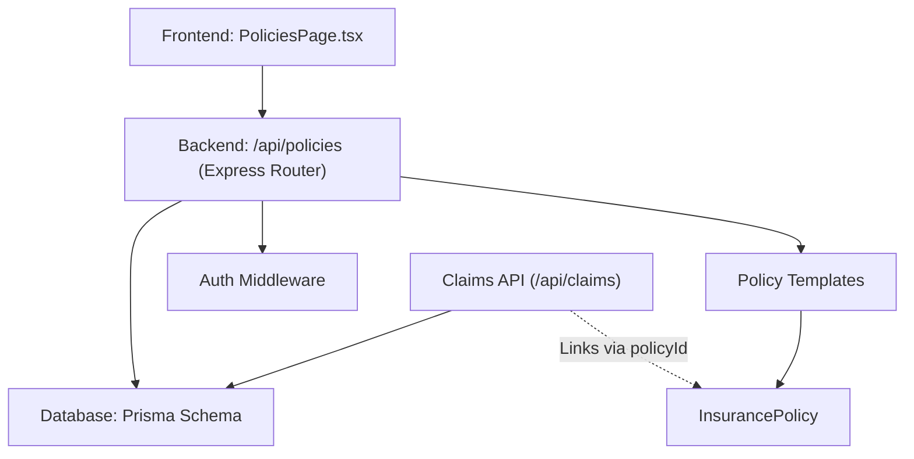
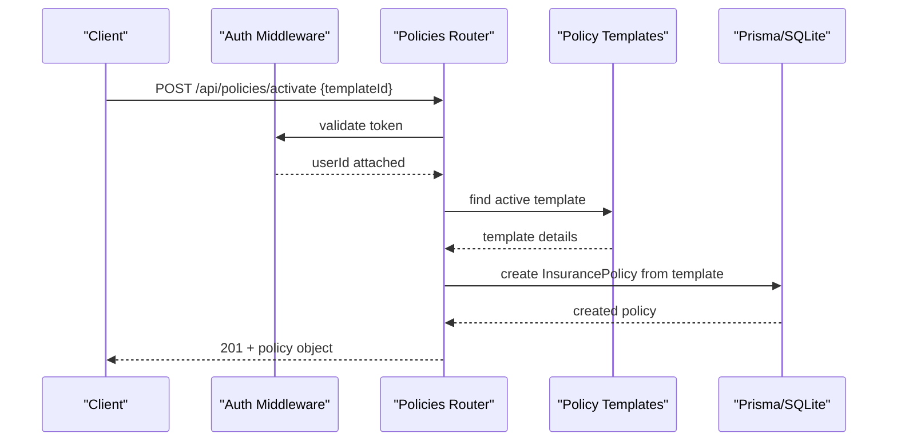
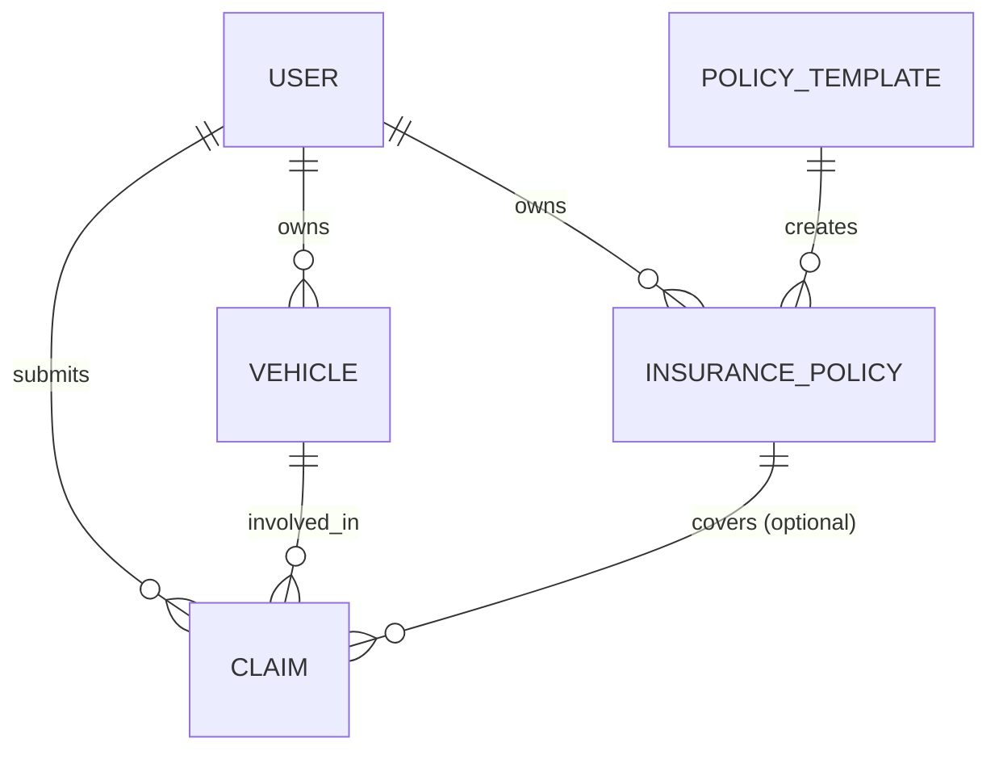
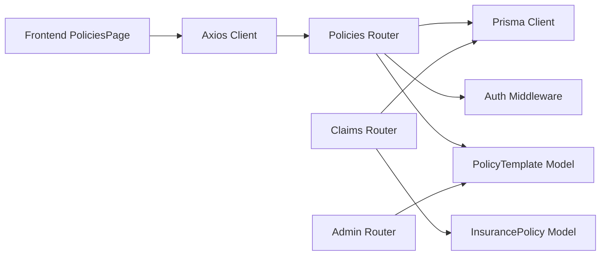
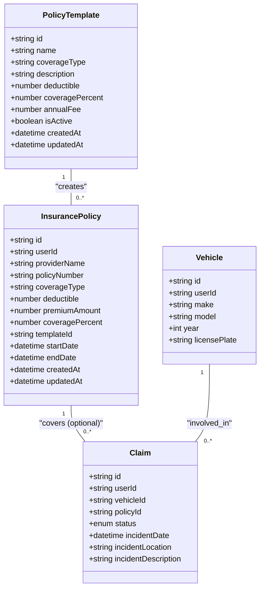

# Policies API

<cite>
**Referenced Files in This Document**
- [policies.ts](file://backend/src/routes/policies.ts)
- [schema.prisma](file://backend/prisma/schema.prisma)
- [claims.ts](file://backend/src/routes/claims.ts)
- [index.ts (types)](file://backend/src/types/index.ts)
- [api.ts (frontend client)](file://frontend/src/services/api.ts)
- [PoliciesPage.tsx](file://frontend/src/pages/PoliciesPage.tsx)
- [policyTemplateSeeder.ts](file://backend/src/services/policyTemplateSeeder.ts)
- [admin.ts](file://backend/src/routes/admin.ts)
</cite>

## Update Summary
**Changes Made**
- Added comprehensive documentation for new template management endpoints (GET/POST /api/policies/templates)
- Added documentation for policy activation endpoint (POST /api/policies/activate)
- Updated policy listing to include template information integration
- Enhanced data model documentation with PolicyTemplate and InsurancePolicy relationships
- Added new sections covering built-in insurance plans and template-based policy creation

## Table of Contents
1. [Introduction](#introduction)
2. [Project Structure](#project-structure)
3. [Core Components](#core-components)
4. [Architecture Overview](#architecture-overview)
5. [Detailed Component Analysis](#detailed-component-analysis)
6. [Dependency Analysis](#dependency-analysis)
7. [Performance Considerations](#performance-considerations)
8. [Troubleshooting Guide](#troubleshooting-guide)
9. [Conclusion](#conclusion)
10. [Appendices](#appendices)

## Introduction
This document provides comprehensive API documentation for insurance policy management endpoints in the Smart Vehicle Insurance Claim System. It covers creating, retrieving, updating, and deleting policies; request/response schemas; validation rules; lifecycle considerations; relationships with vehicles and claims; and integration points with the claims processing system. The system now includes built-in insurance plan templates that users can activate to quickly create policies.

## Project Structure
The backend exposes RESTful endpoints under /api/policies. The routes are protected by authentication middleware and interact with a Prisma-managed SQLite database. The frontend includes a dedicated page to create and manage policies using both custom policies and built-in plan templates.

**Diagram sources**
- [policies.ts:1-194](file://backend/src/routes/policies.ts#L1-L194)
- [schema.prisma:52-86](file://backend/prisma/schema.prisma#L52-L86)
- [claims.ts:20-57](file://backend/src/routes/claims.ts#L20-L57)

**Section sources**
- [policies.ts:1-194](file://backend/src/routes/policies.ts#L1-L194)
- [schema.prisma:1-282](file://backend/prisma/schema.prisma#L1-L282)
- [PoliciesPage.tsx:1-132](file://frontend/src/pages/PoliciesPage.tsx#L1-L132)
- [api.ts:1-40](file://frontend/src/services/api.ts#L1-L40)

## Core Components
- **Enhanced Policy CRUD endpoints**:
  - POST /api/policies: Create a new policy
  - GET /api/policies: List all policies for the authenticated user (includes template info)
  - GET /api/policies/:id: Retrieve a specific policy
  - PUT /api/policies/:id: Update a policy
  - DELETE /api/policies/:id: Delete a policy
- **New Template Management endpoints**:
  - GET /api/policies/templates: Get available built-in insurance plans
  - POST /api/policies/activate: Activate a built-in plan to create a policy
- **Data models**: 
  - InsurancePolicy stored in the database with fields for provider, coverage type, deductible, premium amount, effective dates, and template association
  - PolicyTemplate representing built-in insurance plans offered by the company
- Authentication: All endpoints require a valid token via auth middleware
- Claims integration: Claims can optionally reference a policy via policyId

**Section sources**
- [policies.ts:12-191](file://backend/src/routes/policies.ts#L12-L191)
- [schema.prisma:52-86](file://backend/prisma/schema.prisma#L52-L86)
- [claims.ts:20-57](file://backend/src/routes/claims.ts#L20-L57)

## Architecture Overview
The Policies API is a thin layer over Prisma data access with enhanced template functionality. Requests are validated at the route level, persisted to the database, and returned as JSON. The system now supports both custom policy creation and activation of built-in insurance plans through templates.

**Diagram sources**
- [policies.ts:26-72](file://backend/src/routes/policies.ts#L26-L72)
- [schema.prisma:52-86](file://backend/prisma/schema.prisma#L52-L86)

## Detailed Component Analysis

### Endpoints Reference

#### Template Management Endpoints

- **Get Policy Templates**
  - Method: GET
  - Path: /api/policies/templates
  - Auth: Required
  - Query parameters: none
  - Response: Array of active PolicyTemplate objects, ordered by coverageType and annualFee
  - Error responses:
    - 500 Internal Server Error if failed to fetch templates

- **Activate Policy Template**
  - Method: POST
  - Path: /api/policies/activate
  - Auth: Required
  - Request body fields:
    - templateId: string (required; ID of the template to activate)
  - Success response: 201 Created with the created InsurancePolicy object
  - Error responses:
    - 400 Bad Request if templateId is missing
    - 404 Not Found if template doesn't exist or is not active
    - 500 Internal Server Error on server-side failures

#### Existing Policy Endpoints (Enhanced)

- **Create Policy**
  - Method: POST
  - Path: /api/policies
  - Auth: Required
  - Request body fields:
    - providerName: string (required)
    - policyNumber: string (required)
    - coverageType: string (required)
    - deductible: number (required; stored as float)
    - premiumAmount: number (required; stored as float)
    - startDate: date-time (required)
    - endDate: date-time (required)
  - Success response: 201 Created with the created InsurancePolicy object
  - Error responses:
    - 400 Bad Request if required fields are missing or invalid
    - 500 Internal Server Error on server-side failures

- **List Policies** (Enhanced)
  - Method: GET
  - Path: /api/policies
  - Auth: Required
  - Query parameters: none
  - Response: Array of InsurancePolicy objects belonging to the authenticated user, ordered by creation date descending, including template information

- **Get Policy**
  - Method: GET
  - Path: /api/policies/:id
  - Auth: Required
  - Path params: id (string)
  - Response: Single InsurancePolicy object if found and owned by the user
  - Error responses:
    - 404 Not Found if policy does not exist or is not owned by the user
    - 500 Internal Server Error on server-side failures

- **Update Policy**
  - Method: PUT
  - Path: /api/policies/:id
  - Auth: Required
  - Path params: id (string)
  - Request body fields: any subset of providerName, policyNumber, coverageType, deductible, premiumAmount, startDate, endDate (all optional; only provided fields are updated)
  - Response: Updated InsurancePolicy object
  - Error responses:
    - 404 Not Found if policy does not exist or is not owned by the user
    - 500 Internal Server Error on server-side failures

- **Delete Policy**
  - Method: DELETE
  - Path: /api/policies/:id
  - Auth: Required
  - Path params: id (string)
  - Response: Confirmation message
  - Error responses:
    - 404 Not Found if policy does not exist or is not owned by the user
    - 500 Internal Server Error on server-side failures

**Updated** Added new template management endpoints and enhanced policy listing with template information integration

**Section sources**
- [policies.ts:12-191](file://backend/src/routes/policies.ts#L12-L191)
- [schema.prisma:52-86](file://backend/prisma/schema.prisma#L52-L86)

### Request Schemas and Validation Rules

#### Template Activation
- Required fields for activation:
  - templateId: string (must be an active template)
- Validation behavior:
  - Missing templateId results in a 400 error
  - Non-existent or inactive templates result in a 404 error

#### Custom Policy Creation
- Required fields for creation:
  - providerName, policyNumber, coverageType, deductible, premiumAmount, startDate, endDate
- Field types:
  - Strings: providerName, policyNumber, coverageType
  - Numbers: deductible, premiumAmount (stored as float)
  - Dates: startDate, endDate (ISO date strings accepted)
- Validation behavior:
  - Missing required fields result in a 400 error with a descriptive message
  - Numeric fields are coerced to floats; invalid numbers will cause parsing errors handled by the server

**Updated** Added template activation validation rules and enhanced existing validation documentation

**Section sources**
- [policies.ts:28-40](file://backend/src/routes/policies.ts#L28-L40)
- [policies.ts:76-82](file://backend/src/routes/policies.ts#L76-L82)

### Response Formats

#### Policy Template Object
- Fields:
  - id: string (UUID)
  - name: string
  - coverageType: string
  - description: string? (optional)
  - deductible: number (float)
  - coveragePercent: number (default 100)
  - annualFee: number (float)
  - isActive: boolean
  - createdAt: date-time
  - updatedAt: date-time

#### Enhanced Policy Object
- Fields:
  - id: string (UUID)
  - userId: string (owner)
  - providerName: string
  - policyNumber: string
  - coverageType: string
  - deductible: number (float)
  - premiumAmount: number (float)
  - coveragePercent: number (default 100)
  - templateId: string? (optional; links to template)
  - startDate: date-time
  - endDate: date-time
  - template: { name: string }? (optional; included in list responses)
  - createdAt: date-time
  - updatedAt: date-time

**Updated** Added PolicyTemplate response format and enhanced InsurancePolicy with template relationship

**Section sources**
- [schema.prisma:52-86](file://backend/prisma/schema.prisma#L52-L86)
- [policies.ts:13-24](file://backend/src/routes/policies.ts#L13-L24)
- [policies.ts:105-118](file://backend/src/routes/policies.ts#L105-L118)

### Built-in Insurance Plans and Template Management

The system now includes built-in insurance plan templates that represent standard offerings from Flash Claim Insurance. These templates provide predefined coverage options that users can activate to quickly create policies.

#### Default Templates
The system seeds default templates on startup:
- **Full Comprehensive**: Full coverage with 100% payout after Rs. 25,000 deductible, annual fee Rs. 85,000
- **Standard Comprehensive**: 80% payout share after Rs. 50,000 deductible, annual fee Rs. 55,000  
- **Third Party Plus**: Third-party liability with limited own-damage cover (50% payout), Rs. 75,000 deductible, annual fee Rs. 28,000
- **Third Party Only**: Mandatory third-party liability only (30% payout), Rs. 100,000 deductible, annual fee Rs. 15,000

#### Template Activation Process
When a user activates a template:
1. A new InsurancePolicy is created with the template's coverage details
2. The policy is set to start immediately and end one year later
3. The user's annualFee field is updated to match the activated plan
4. The policy is linked to the original template via templateId

**New Section** Added comprehensive documentation for built-in insurance plans and template activation workflow

**Section sources**
- [policyTemplateSeeder.ts:5-38](file://backend/src/services/policyTemplateSeeder.ts#L5-L38)
- [policies.ts:26-72](file://backend/src/routes/policies.ts#L26-L72)

### Lifecycle Management and Validity

- **Effective period**:
  - A policy has startDate and endDate defining its validity window.
  - When activating a template, the policy automatically starts immediately and ends one year later.
- **Current implementation notes**:
  - There is no explicit endpoint or logic to compute or enforce "active" status based on current time.
  - Clients may compute validity by comparing today's date against startDate and endDate.
- **Deletion**:
  - Deleting a policy removes it from the database. Existing claims linked to the policy remain unaffected due to the SetNull relationship on claim.policyId.

**Updated** Enhanced lifecycle documentation with template-based policy activation

**Section sources**
- [schema.prisma:52-86](file://backend/prisma/schema.prisma#L52-L86)
- [schema.prisma:99-126](file://backend/prisma/schema.prisma#L99-L126)
- [policies.ts:26-72](file://backend/src/routes/policies.ts#L26-L72)
- [policies.ts:173-191](file://backend/src/routes/policies.ts#L173-L191)

### Relationships: Policies, Templates, Vehicles, and Claims

The enhanced system introduces a many-to-one relationship between InsurancePolicy and PolicyTemplate, allowing multiple policies to be created from the same template while maintaining their individual characteristics.

**Diagram sources**
- [schema.prisma:10-25](file://backend/prisma/schema.prisma#L10-L25)
- [schema.prisma:27-43](file://backend/prisma/schema.prisma#L27-L43)
- [schema.prisma:52-86](file://backend/prisma/schema.prisma#L52-L86)
- [schema.prisma:99-126](file://backend/prisma/schema.prisma#L99-L126)

Integration highlights:
- Creating a claim accepts an optional policyId to associate the claim with a policy.
- Retrieving a single claim includes the related policy when present.
- Policy templates provide standardized coverage options that can be activated by users.

**Updated** Enhanced relationship documentation with template associations

**Section sources**
- [claims.ts:20-57](file://backend/src/routes/claims.ts#L20-L57)
- [claims.ts:85-112](file://backend/src/routes/claims.ts#L85-L112)
- [schema.prisma:52-86](file://backend/prisma/schema.prisma#L52-L86)
- [schema.prisma:99-126](file://backend/prisma/schema.prisma#L99-L126)

### Premium Calculation Logic and Coverage Limits

- **Template-based policies**:
  - Premium amounts are derived from the activated template's annualFee field
  - Coverage percentages and deductibles are copied from the template
  - No server-side calculation is performed; values are directly transferred from templates
- **Custom policies**:
  - Premium amounts are stored as provided by the client; there is no server-side calculation or validation of premiums
  - No coverage limits are defined in the schema; coverageType is a free-form string constrained by application usage
- **Recommendations**:
  - Introduce structured coverage definitions with limits and deductibles
  - Implement server-side premium calculation based on vehicle attributes, coverage type, and risk factors
  - Validate that requested coverage amounts do not exceed policy limits

**Updated** Enhanced premium calculation documentation with template-based pricing

**Section sources**
- [schema.prisma:52-86](file://backend/prisma/schema.prisma#L52-L86)
- [policies.ts:26-72](file://backend/src/routes/policies.ts#L26-L72)
- [policies.ts:74-102](file://backend/src/routes/policies.ts#L74-L102)

### Error Handling

Common errors:
- 400 Bad Request: Missing or invalid required fields during creation/update or activation
- 404 Not Found: Policy not found, not owned by the user, or template not found
- 500 Internal Server Error: Database or unexpected server errors

Error payloads:
- JSON objects with an error field containing a human-readable message

Authentication handling:
- Requests without a valid token are rejected by the auth middleware before reaching policy routes

**Updated** Enhanced error handling documentation with template-specific errors

**Section sources**
- [policies.ts:28-40](file://backend/src/routes/policies.ts#L28-L40)
- [policies.ts:76-82](file://backend/src/routes/policies.ts#L76-L82)
- [policies.ts:120-137](file://backend/src/routes/policies.ts#L120-L137)
- [policies.ts:139-171](file://backend/src/routes/policies.ts#L139-L171)
- [policies.ts:173-191](file://backend/src/routes/policies.ts#L173-L191)

### Examples

#### Template-Based Policy Activation
- Send a POST to /api/policies/activate with templateId from the available templates
- Expect 201 with the created policy object linked to the template

#### Custom Policy Creation
- Send a POST to /api/policies with providerName, policyNumber, coverageType, deductible, premiumAmount, startDate, endDate
- Expect 201 with the created policy object

#### Enhanced Policy Listing
- Send a GET to /api/policies to retrieve policies with template information
- Response includes template.name for policies created from templates

**Updated** Added examples for template activation and enhanced policy listing

**Section sources**
- [policies.ts:26-72](file://backend/src/routes/policies.ts#L26-L72)
- [policies.ts:74-102](file://backend/src/routes/policies.ts#L74-L102)
- [policies.ts:104-118](file://backend/src/routes/policies.ts#L104-L118)

## Dependency Analysis

**Diagram sources**
- [policies.ts:1-10](file://backend/src/routes/policies.ts#L1-L10)
- [claims.ts:1-15](file://backend/src/routes/claims.ts#L1-L15)
- [schema.prisma:52-86](file://backend/prisma/schema.prisma#L52-L86)
- [api.ts:1-20](file://frontend/src/services/api.ts#L1-L20)

Key observations:
- Tight coupling between routes and Prisma models ensures consistent data access
- Template functionality adds a new dependency layer for built-in insurance plans
- Claims depend on policies via an optional foreign key, enabling linkage without enforcing mandatory association
- Admin routes provide additional template management capabilities

**Updated** Enhanced dependency analysis with template management components

**Section sources**
- [policies.ts:1-10](file://backend/src/routes/policies.ts#L1-L10)
- [claims.ts:1-15](file://backend/src/routes/claims.ts#L1-L15)
- [schema.prisma:52-86](file://backend/prisma/schema.prisma#L52-L86)

## Performance Considerations
- Queries filter by userId to ensure isolation and reduce result sets
- Template queries are filtered by isActive to return only available plans
- Listing policies includes template information via joins; consider selective inclusion for large datasets
- Avoid unnecessary joins; fetch related entities only when needed
- Use indexes on frequently queried fields like userId and policyNumber if dataset grows
- Template seeding runs once on startup to populate default plans

[No sources needed since this section provides general guidance]

## Troubleshooting Guide
- 400 Bad Request on creation or activation:
  - Ensure all required fields are present and correctly typed
  - For template activation, verify the templateId exists and is active
  - Verify numeric fields are valid numbers and dates are valid ISO strings
- 404 Not Found:
  - Confirm the policy exists and belongs to the authenticated user
  - For template activation, check that the template exists and is active
- 500 Internal Server Error:
  - Check server logs for database connectivity or constraint violations
- Authentication issues:
  - Ensure the Authorization header contains a valid Bearer token
  - The frontend automatically handles 401 by clearing session and redirecting to login

**Updated** Enhanced troubleshooting guide with template-specific issues

**Section sources**
- [policies.ts:28-40](file://backend/src/routes/policies.ts#L28-L40)
- [policies.ts:76-82](file://backend/src/routes/policies.ts#L76-L82)
- [policies.ts:120-137](file://backend/src/routes/policies.ts#L120-L137)
- [policies.ts:139-171](file://backend/src/routes/policies.ts#L139-L171)
- [policies.ts:173-191](file://backend/src/routes/policies.ts#L173-L191)
- [api.ts:26-37](file://frontend/src/services/api.ts#L26-L37)

## Conclusion
The Policies API now provides comprehensive insurance policy management with enhanced template functionality. Users can either create custom policies or activate built-in insurance plans through the template system. The system maintains clear ownership scoping and straightforward request/response patterns while supporting advanced features like template-based policy creation, automated premium calculation from templates, and integrated policy listing with template information. Integration with claims allows linking policies to incidents, supporting downstream processing and payouts.

[No sources needed since this section summarizes without analyzing specific files]

## Appendices

### Data Model Summary

**Diagram sources**
- [schema.prisma:52-86](file://backend/prisma/schema.prisma#L52-L86)
- [schema.prisma:99-126](file://backend/prisma/schema.prisma#L99-L126)
- [schema.prisma:32-50](file://backend/prisma/schema.prisma#L32-L50)