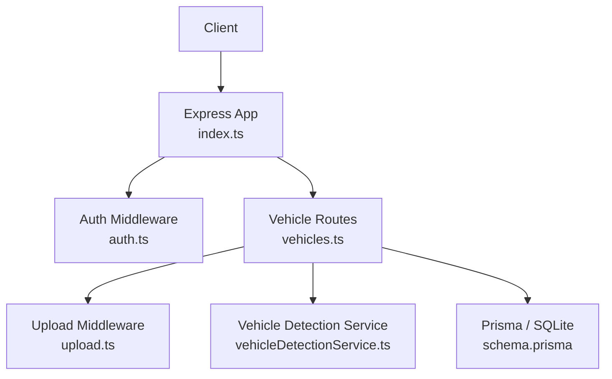
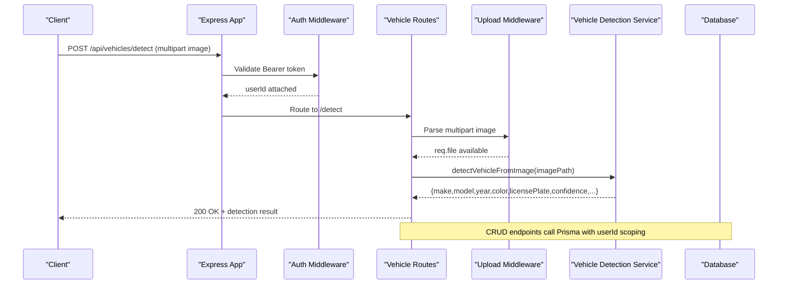

# Vehicles API

<cite>
**Referenced Files in This Document**
- [index.ts](file://backend/src/index.ts)
- [vehicles.ts](file://backend/src/routes/vehicles.ts)
- [auth.ts](file://backend/src/middleware/auth.ts)
- [upload.ts](file://backend/src/middleware/upload.ts)
- [vehicleDetectionService.ts](file://backend/src/services/vehicleDetectionService.ts)
- [schema.prisma](file://backend/prisma/schema.prisma)
- [errorHandler.ts](file://backend/src/middleware/errorHandler.ts)
</cite>

## Table of Contents
1. [Introduction](#introduction)
2. [Project Structure](#project-structure)
3. [Core Components](#core-components)
4. [Architecture Overview](#architecture-overview)
5. [Detailed Component Analysis](#detailed-component-analysis)
6. [Dependency Analysis](#dependency-analysis)
7. [Performance Considerations](#performance-considerations)
8. [Troubleshooting Guide](#troubleshooting-guide)
9. [Conclusion](#conclusion)
10. [Appendices](#appendices)

## Introduction
This document provides detailed API documentation for vehicle management endpoints. It covers CRUD operations for vehicles, including creation, retrieval, updates, and deletion. It also documents the AI-powered vehicle detection endpoint that analyzes uploaded images to auto-fill vehicle details. The guide includes request/response schemas, file upload handling, error scenarios (duplicate VINs, invalid data, permission issues), and integration notes with the vehicle detection service.

## Project Structure
The backend exposes RESTful routes under /api. Vehicle-related routes are mounted at /api/vehicles and require authentication via a Bearer token. File uploads are handled by middleware that stores images on disk and serves them statically.

**Diagram sources**
- [index.ts:17-34](file://backend/src/index.ts#L17-L34)
- [auth.ts:5-22](file://backend/src/middleware/auth.ts#L5-L22)
- [upload.ts:17-47](file://backend/src/middleware/upload.ts#L17-L47)
- [vehicles.ts:1-12](file://backend/src/routes/vehicles.ts#L1-L12)
- [vehicleDetectionService.ts:46-95](file://backend/src/services/vehicleDetectionService.ts#L46-L95)
- [schema.prisma:27-43](file://backend/prisma/schema.prisma#L27-L43)

**Section sources**
- [index.ts:17-34](file://backend/src/index.ts#L17-L34)

## Core Components
- Authentication: All vehicle endpoints are protected by an auth middleware that validates a Bearer JWT and attaches userId to the request.
- File Uploads: Multer-based upload middleware enforces allowed MIME types and size limits, storing files under configured directories.
- Vehicle Routes: Express router implements endpoints for detecting vehicles from images and standard CRUD operations for vehicles.
- Vehicle Detection Service: Uses an AI model to analyze uploaded images and return structured vehicle attributes with confidence levels.
- Data Model: Prisma schema defines the Vehicle entity and its relationships.

Key responsibilities:
- vehicles.ts: Route handlers for /api/vehicles/*
- upload.ts: Image storage, filtering, and size limits
- vehicleDetectionService.ts: Image analysis and JSON parsing
- auth.ts: Token validation and user context injection
- schema.prisma: Database schema for Vehicle and related entities

**Section sources**
- [vehicles.ts:10-168](file://backend/src/routes/vehicles.ts#L10-L168)
- [upload.ts:17-47](file://backend/src/middleware/upload.ts#L17-L47)
- [vehicleDetectionService.ts:46-95](file://backend/src/services/vehicleDetectionService.ts#L46-L95)
- [auth.ts:5-22](file://backend/src/middleware/auth.ts#L5-L22)
- [schema.prisma:27-43](file://backend/prisma/schema.prisma#L27-L43)

## Architecture Overview
The vehicle API follows a layered approach:
- Request enters Express app and is routed to /api/vehicles
- Auth middleware validates JWT and sets userId
- For image-based detection, upload middleware persists the file and passes it to the detection service
- CRUD operations use Prisma to read/write Vehicle records scoped to the authenticated user
- Errors are normalized via a global error handler

**Diagram sources**
- [index.ts:29-34](file://backend/src/index.ts#L29-L34)
- [auth.ts:5-22](file://backend/src/middleware/auth.ts#L5-L22)
- [vehicles.ts:15-32](file://backend/src/routes/vehicles.ts#L15-L32)
- [upload.ts:17-47](file://backend/src/middleware/upload.ts#L17-L47)
- [vehicleDetectionService.ts:46-95](file://backend/src/services/vehicleDetectionService.ts#L46-L95)

## Detailed Component Analysis

### Authentication
- All vehicle endpoints require a valid Bearer token.
- On success, userId is attached to the request for authorization scoping.
- Missing or invalid tokens return 401 with an error message.

Error responses:
- 401 Unauthorized: No token provided or invalid/expired token.

**Section sources**
- [auth.ts:5-22](file://backend/src/middleware/auth.ts#L5-L22)

### File Upload Handling
- Supported formats: JPEG, PNG, WebP (and JPG alias).
- Size limit: 10 MB per file.
- Storage: Disk storage under configurable directory; images stored in images subdirectory.
- Static serving: Uploaded files are served under /uploads.

Validation behavior:
- If no image is uploaded to the detection endpoint, returns 400 with an error.
- If unsupported MIME type is sent, upload middleware rejects the file.

**Section sources**
- [upload.ts:17-47](file://backend/src/middleware/upload.ts#L17-L47)
- [vehicles.ts:15-32](file://backend/src/routes/vehicles.ts#L15-L32)
- [index.ts:25-27](file://backend/src/index.ts#L25-L27)

### Vehicle Detection Endpoint
- Endpoint: POST /api/vehicles/detect
- Purpose: Analyze an uploaded vehicle image to extract make, model, year, color, license plate, and confidence level.
- Input: Multipart form field named image containing a supported image file.
- Output: Structured JSON with detected fields plus imagePath pointing to the saved file.

Processing flow:
- Validates presence of image
- Resolves file path and reads image bytes
- Calls AI model with a strict prompt to return JSON
- Parses response; if parsing fails, returns safe defaults with LOW confidence

Error handling:
- 400 if no image uploaded
- 500 if image not found or AI processing fails

**Section sources**
- [vehicles.ts:15-32](file://backend/src/routes/vehicles.ts#L15-L32)
- [vehicleDetectionService.ts:46-95](file://backend/src/services/vehicleDetectionService.ts#L46-L95)

### Create Vehicle
- Endpoint: POST /api/vehicles
- Required fields: make, model, year, licensePlate, color
- Optional fields: vin, mileage, photos (array of strings)
- Behavior: Creates a new Vehicle record associated with the authenticated user. Photos are stored as a JSON string.

Response:
- 201 Created with the newly created vehicle object.

Errors:
- 400 Bad Request if required fields are missing.
- 500 Internal Server Error if database operation fails.

Notes:
- Duplicate VIN handling is not enforced at the route level; uniqueness constraints should be applied at the database layer if needed.

**Section sources**
- [vehicles.ts:34-63](file://backend/src/routes/vehicles.ts#L34-L63)
- [schema.prisma:27-43](file://backend/prisma/schema.prisma#L27-L43)

### List Vehicles
- Endpoint: GET /api/vehicles
- Behavior: Returns all vehicles owned by the authenticated user, ordered by newest first. Includes a count of associated claims.

Response:
- 200 OK with array of vehicle objects.

Errors:
- 500 Internal Server Error on database failure.

**Section sources**
- [vehicles.ts:65-81](file://backend/src/routes/vehicles.ts#L65-L81)

### Get Vehicle Detail
- Endpoint: GET /api/vehicles/:id
- Behavior: Returns a single vehicle owned by the authenticated user, including recent claims metadata (id, status, incidentDate, createdAt).

Response:
- 200 OK with vehicle object.

Errors:
- 404 Not Found if vehicle does not exist or belongs to another user.
- 500 Internal Server Error on database failure.

**Section sources**
- [vehicles.ts:83-111](file://backend/src/routes/vehicles.ts#L83-L111)

### Update Vehicle
- Endpoint: PUT /api/vehicles/:id
- Behavior: Updates any subset of vehicle fields for the authenticated user’s vehicle. Supports partial updates.

Request fields:
- make, model, year, vin, licensePlate, color, mileage, photos (optional)

Response:
- 200 OK with updated vehicle object.

Errors:
- 404 Not Found if vehicle does not exist or belongs to another user.
- 500 Internal Server Error on database failure.

**Section sources**
- [vehicles.ts:113-146](file://backend/src/routes/vehicles.ts#L113-L146)

### Delete Vehicle
- Endpoint: DELETE /api/vehicles/:id
- Behavior: Deletes the specified vehicle if it belongs to the authenticated user.

Response:
- 200 OK with success message.

Errors:
- 404 Not Found if vehicle does not exist or belongs to another user.
- 500 Internal Server Error on database failure.

**Section sources**
- [vehicles.ts:148-166](file://backend/src/routes/vehicles.ts#L148-L166)

### Data Model: Vehicle
- Fields: id, userId, make, model, year, vin (nullable), licensePlate, color, mileage (nullable), photos (JSON string defaulting to empty array), timestamps.
- Relationships: Owned by User; linked to Claims.

Constraints and notes:
- No unique constraint on VIN is defined in the schema; duplicate VINs can be inserted unless enforced elsewhere.
- Photos are stored as a JSON string array of file paths or URLs.

**Section sources**
- [schema.prisma:27-43](file://backend/prisma/schema.prisma#L27-L43)

## Dependency Analysis
- Route-level dependencies:
  - vehicles.ts depends on prisma client, auth middleware, upload middleware, and vehicle detection service.
- Middleware dependencies:
  - auth.ts depends on JWT library and environment secret.
  - upload.ts depends on multer, filesystem, and uuid.
- Service dependencies:
  - vehicleDetectionService.ts depends on filesystem and AI model utility.

Potential coupling:
- Tight coupling between routes and Prisma models; changes to schema may affect route queries.
- Upload middleware is shared across features; ensure consistent validation rules.

Circular dependencies:
- None observed among analyzed modules.

External integrations:
- AI model provider used by vehicle detection service.
- File system for storing and serving uploads.

**Section sources**
- [vehicles.ts:1-12](file://backend/src/routes/vehicles.ts#L1-L12)
- [auth.ts:1-22](file://backend/src/middleware/auth.ts#L1-L22)
- [upload.ts:1-47](file://backend/src/middleware/upload.ts#L1-L47)
- [vehicleDetectionService.ts:1-95](file://backend/src/services/vehicleDetectionService.ts#L1-L95)

## Performance Considerations
- Image uploads: Enforce reasonable size limits (already set to 10 MB) to avoid large payloads.
- AI detection: Model calls can be slow; consider caching results for identical images or batching requests if applicable.
- Database queries: Use selective includes to reduce payload size; current listing includes claim counts which is efficient.
- Static file serving: Ensure CDN or reverse proxy caching for uploaded images in production.

[No sources needed since this section provides general guidance]

## Troubleshooting Guide
Common errors and resolutions:
- 401 Unauthorized: Ensure Authorization header contains a valid Bearer token. Check token expiration and secret configuration.
- 400 Bad Request (create): Provide all required fields (make, model, year, licensePlate, color).
- 400 Bad Request (detect): Ensure image is included and uses a supported format.
- 404 Not Found: Verify vehicle ID exists and belongs to the authenticated user.
- 500 Internal Server Error: Check server logs for database connectivity or AI service failures.

Duplicate VIN handling:
- The current schema does not enforce uniqueness for VIN. To prevent duplicates, add a unique constraint on the VIN field in the schema and regenerate the client.

Permission issues:
- All endpoints scope operations to the authenticated user via userId. Requests attempting to access other users’ vehicles will receive 404.

File upload issues:
- Unsupported MIME types are rejected by upload middleware.
- Exceeding 10 MB limit triggers an error.

Global error handling:
- Unhandled exceptions are caught by the global error handler and returned as 500 with a generic message.

**Section sources**
- [auth.ts:5-22](file://backend/src/middleware/auth.ts#L5-L22)
- [vehicles.ts:34-63](file://backend/src/routes/vehicles.ts#L34-L63)
- [vehicles.ts:15-32](file://backend/src/routes/vehicles.ts#L15-L32)
- [vehicles.ts:83-111](file://backend/src/routes/vehicles.ts#L83-L111)
- [upload.ts:30-47](file://backend/src/middleware/upload.ts#L30-L47)
- [errorHandler.ts:13-27](file://backend/src/middleware/errorHandler.ts#L13-L27)
- [schema.prisma:27-43](file://backend/prisma/schema.prisma#L27-L43)

## Conclusion
The Vehicles API provides secure, user-scoped CRUD operations for vehicles and an AI-powered detection endpoint to streamline registration. File uploads are validated and persisted with clear size/format constraints. While basic error handling is implemented, adding explicit duplicate VIN checks and richer error messages would improve robustness. The architecture cleanly separates concerns across routes, middleware, services, and data access layers.

[No sources needed since this section summarizes without analyzing specific files]

## Appendices

### API Endpoints Summary
- POST /api/vehicles/detect
  - Purpose: Detect vehicle details from an image.
  - Auth: Required (Bearer token).
  - Content-Type: multipart/form-data
  - Field: image (JPEG/PNG/WebP, max 10 MB)
  - Response: 200 OK with detection result and imagePath; 400 if no image; 500 on failure.

- POST /api/vehicles
  - Purpose: Register a new vehicle.
  - Auth: Required.
  - Body: make, model, year, licensePlate, color (required); vin, mileage, photos (optional).
  - Response: 201 Created with vehicle; 400 if required fields missing; 500 on failure.

- GET /api/vehicles
  - Purpose: List vehicles for the authenticated user.
  - Auth: Required.
  - Response: 200 OK with array of vehicles (includes claim counts).

- GET /api/vehicles/:id
  - Purpose: Retrieve a specific vehicle with recent claims metadata.
  - Auth: Required.
  - Response: 200 OK with vehicle; 404 if not found; 500 on failure.

- PUT /api/vehicles/:id
  - Purpose: Update vehicle fields (partial update supported).
  - Auth: Required.
  - Body: Any subset of vehicle fields.
  - Response: 200 OK with updated vehicle; 404 if not found; 500 on failure.

- DELETE /api/vehicles/:id
  - Purpose: Delete a vehicle.
  - Auth: Required.
  - Response: 200 OK with success message; 404 if not found; 500 on failure.

### Request and Response Schemas
- Vehicle Registration Request (POST /api/vehicles)
  - Required: make (string), model (string), year (integer), licensePlate (string), color (string)
  - Optional: vin (string|null), mileage (integer|null), photos (array of strings)

- Vehicle Detection Request (POST /api/vehicles/detect)
  - Content-Type: multipart/form-data
  - Field: image (file)

- Vehicle Detection Response
  - Fields: make (string), model (string), year (number), color (string), licensePlate (string), confidence ("HIGH"|"MEDIUM"|"LOW"), additionalInfo (string|null), imagePath (string)

- Vehicle Object (GET/PUT/POST responses)
  - Fields: id (string), userId (string), make (string), model (string), year (number), vin (string|null), licensePlate (string), color (string), mileage (number|null), photos (string JSON array), createdAt (datetime), updatedAt (datetime)
  - GET /:id includes claims array with id, status, incidentDate, createdAt

- Error Responses
  - 400: { error: string }
  - 401: { error: string }
  - 404: { error: string }
  - 500: { error: string }

### Example Workflows
- Add a new vehicle
  - Steps:
    - Obtain a valid Bearer token.
    - Send POST /api/vehicles with required fields.
    - Handle 201 Created response with vehicle details.
  - References:
    - [vehicles.ts:34-63](file://backend/src/routes/vehicles.ts#L34-L63)

- Retrieve vehicle history
  - Steps:
    - Send GET /api/vehicles/:id.
    - Inspect the returned claims array for recent activity.
  - References:
    - [vehicles.ts:83-111](file://backend/src/routes/vehicles.ts#L83-L111)

- Update vehicle information
  - Steps:
    - Send PUT /api/vehicles/:id with desired fields.
    - Receive updated vehicle object.
  - References:
    - [vehicles.ts:113-146](file://backend/src/routes/vehicles.ts#L113-L146)

- Detect vehicle from image
  - Steps:
    - Send POST /api/vehicles/detect with image file.
    - Use returned fields to prefill vehicle registration.
  - References:
    - [vehicles.ts:15-32](file://backend/src/routes/vehicles.ts#L15-L32)
    - [vehicleDetectionService.ts:46-95](file://backend/src/services/vehicleDetectionService.ts#L46-L95)

### Integration Notes: Vehicle Detection Service
- The service reads the uploaded image, converts it to base64, and sends it to an AI model with a strict JSON output prompt.
- If parsing fails, it returns safe defaults with LOW confidence and a note indicating manual entry is required.
- Supported input formats are determined by file extension mapping to MIME types.

**Section sources**
- [vehicleDetectionService.ts:46-95](file://backend/src/services/vehicleDetectionService.ts#L46-L95)