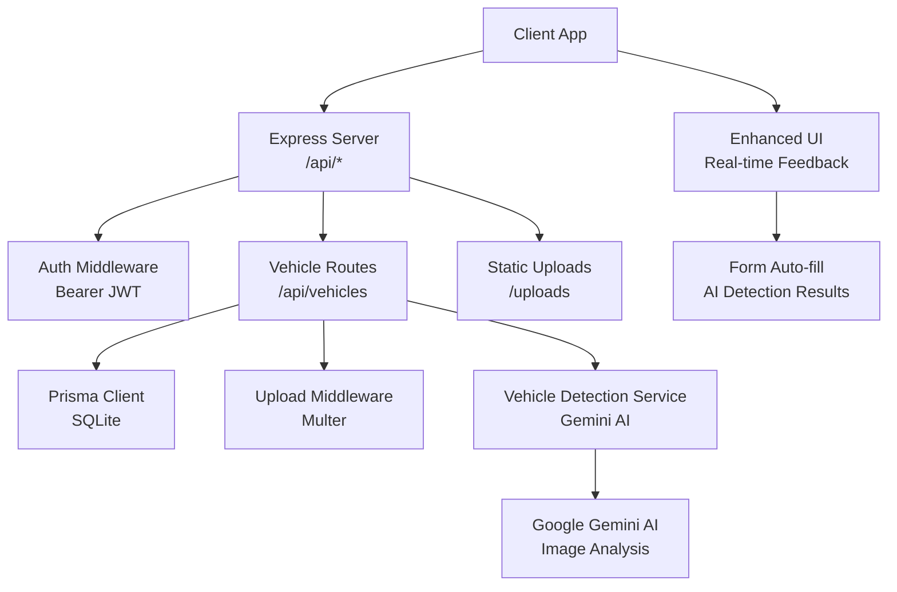
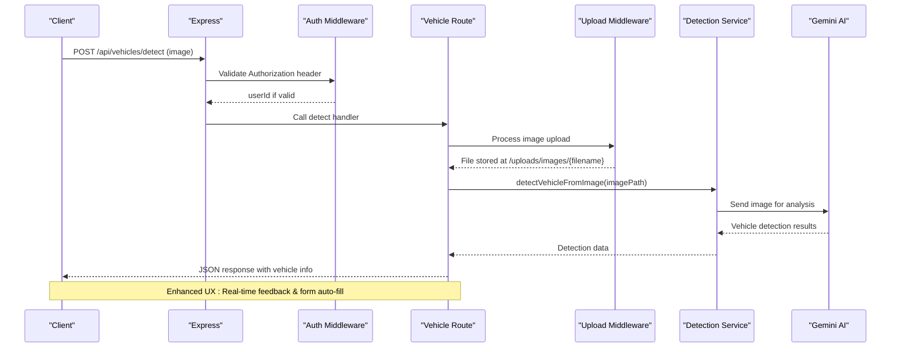
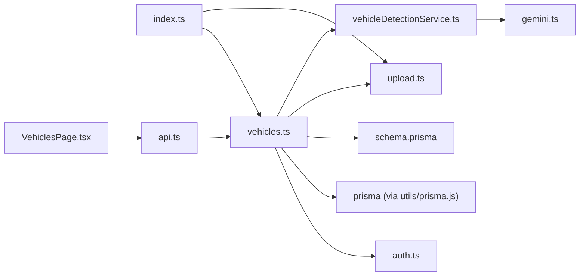

# Vehicles API

<cite>
**Referenced Files in This Document**
- [vehicles.ts](file://backend/src/routes/vehicles.ts)
- [vehicleDetectionService.ts](file://backend/src/services/vehicleDetectionService.ts)
- [gemini.ts](file://backend/src/utils/gemini.ts)
- [schema.prisma](file://backend/prisma/schema.prisma)
- [auth.ts](file://backend/src/middleware/auth.ts)
- [upload.ts](file://backend/src/middleware/upload.ts)
- [index.ts](file://backend/src/index.ts)
- [api.ts](file://frontend/src/services/api.ts)
- [types/index.ts](file://frontend/src/types/index.ts)
- [VehiclesPage.tsx](file://frontend/src/pages/VehiclesPage.tsx)
</cite>

## Update Summary
**Changes Made**
- Enhanced vehicle registration workflow with improved data serialization for photos field
- Added comprehensive user experience feedback during vehicle creation and update operations
- Updated frontend with AI-powered vehicle detection integration and real-time form population
- Improved error handling and success messaging throughout the vehicle management workflow
- Enhanced backend endpoints with proper JSON serialization for photos array storage

## Table of Contents
1. [Introduction](#introduction)
2. [Project Structure](#project-structure)
3. [Core Components](#core-components)
4. [Architecture Overview](#architecture-overview)
5. [Detailed Component Analysis](#detailed-component-analysis)
6. [Dependency Analysis](#dependency-analysis)
7. [Performance Considerations](#performance-considerations)
8. [Troubleshooting Guide](#troubleshooting-guide)
9. [Conclusion](#conclusion)
10. [Appendices](#appendices)

## Introduction
This document provides detailed API documentation for vehicle management endpoints in the Smart Vehicle Insurance Claim System. It covers CRUD operations for vehicles, the vehicle data model (including make, model, year, VIN, license plate, color, mileage, and photos), authentication requirements, error handling patterns, and usage examples. The system now features an enhanced vehicle registration workflow with improved data serialization for the photos field and comprehensive user experience feedback during vehicle creation and update operations. It also addresses image upload capabilities, file validation, storage handling, security considerations for vehicle documents, and the new AI-powered vehicle detection feature using Google's Gemini AI for automatic vehicle information extraction from images.

## Project Structure
The backend exposes RESTful routes under /api/vehicles with authentication enforced via middleware. The application uses Prisma to interact with a SQLite database and serves uploaded files statically. The system includes AI-powered vehicle detection capabilities through Google's Gemini AI integration and features an enhanced user interface with real-time feedback and form auto-population.



**Diagram sources**
- [index.ts:16-32](file://backend/src/index.ts#L16-L32)
- [vehicles.ts:1-9](file://backend/src/routes/vehicles.ts#L1-L9)
- [auth.ts:5-22](file://backend/src/middleware/auth.ts#L5-L22)
- [vehicleDetectionService.ts:1-95](file://backend/src/services/vehicleDetectionService.ts#L1-L95)

**Section sources**
- [index.ts:16-32](file://backend/src/index.ts#L16-L32)
- [vehicles.ts:1-9](file://backend/src/routes/vehicles.ts#L1-L9)

## Core Components
- Authentication: All vehicle endpoints require a valid Bearer token validated by auth middleware.
- Data Model: Vehicle entity includes fields for identification, description, and media references with enhanced photos field serialization.
- File Handling: Multer-based upload middleware validates and stores images and documents with size limits.
- Storage: Uploaded files are served statically from an uploads directory.
- AI Integration: Google Gemini AI service for intelligent vehicle detection and information extraction from images.
- Enhanced User Experience: Real-time feedback, form auto-population, and comprehensive error/success messaging.

**Section sources**
- [auth.ts:5-22](file://backend/src/middleware/auth.ts#L5-L22)
- [schema.prisma:26-42](file://backend/prisma/schema.prisma#L26-L42)
- [upload.ts:17-53](file://backend/src/middleware/upload.ts#L17-L53)
- [index.ts:24-26](file://backend/src/index.ts#L24-L26)
- [vehicleDetectionService.ts:1-95](file://backend/src/services/vehicleDetectionService.ts#L1-L95)

## Architecture Overview
The vehicle API follows a standard Express route pattern with Prisma queries. Requests are authenticated before reaching route handlers. The enhanced workflow processes uploaded images through Google's Gemini AI to automatically extract vehicle information including make, model, year, color, and license plate details. The frontend provides real-time feedback and auto-populates forms with detected vehicle information.



**Diagram sources**
- [index.ts:28-32](file://backend/src/index.ts#L28-L32)
- [vehicles.ts:15-32](file://backend/src/routes/vehicles.ts#L15-L32)
- [vehicleDetectionService.ts:46-95](file://backend/src/services/vehicleDetectionService.ts#L46-L95)
- [auth.ts:5-22](file://backend/src/middleware/auth.ts#L5-L22)

## Detailed Component Analysis

### Authentication Requirements
- All vehicle endpoints are protected by auth middleware that expects a Bearer token in the Authorization header.
- Invalid or missing tokens return 401 with an error message.
- On success, the request context includes the authenticated user ID used to scope data access.

**Section sources**
- [auth.ts:5-22](file://backend/src/middleware/auth.ts#L5-L22)
- [vehicles.ts:8-9](file://backend/src/routes/vehicles.ts#L8-L9)

### Vehicle Data Model
The Vehicle model defines the following fields:
- id: unique identifier
- userId: owner reference
- make: string
- model: string
- year: integer
- vin: optional string
- licensePlate: string
- color: string
- mileage: optional integer
- photos: JSON array stored as string defaulting to empty array `[]`
- createdAt, updatedAt: timestamps

Relationships:
- User has many Vehicles (cascade delete)
- Vehicle has many Claims (cascade delete)

**Updated** Enhanced photos field now properly serializes arrays to JSON strings for database storage and deserializes back to arrays when retrieved.

**Section sources**
- [schema.prisma:26-42](file://backend/prisma/schema.prisma#L26-L42)

### Endpoints

#### AI-Powered Vehicle Detection
- Method: POST
- Path: /api/vehicles/detect
- Authentication: Required (Bearer token)
- Request body: multipart/form-data with 'image' field containing vehicle photo
- Supported formats: JPEG, PNG, WebP (max 10MB)
- Behavior: Processes uploaded image through Google Gemini AI to extract vehicle information
- Success response: 200 OK with detected vehicle information including make, model, year, color, license plate, confidence level, and additional observations
- Error responses:
  - 400 Bad Request: No image uploaded or invalid file format
  - 500 Internal Server Error: AI processing failed or image not found

Response schema:
```json
{
  "make": "string",
  "model": "string", 
  "year": number,
  "color": "string",
  "licensePlate": "string",
  "confidence": "HIGH|MEDIUM|LOW",
  "additionalInfo": "string",
  "imagePath": "string"
}
```

Usage notes:
- The endpoint automatically stores uploaded images in /uploads/images/ directory
- AI analysis extracts vehicle details with confidence scoring
- Results can be used to auto-fill vehicle creation forms
- Low confidence results indicate manual verification may be needed

**Section sources**
- [vehicles.ts:15-32](file://backend/src/routes/vehicles.ts#L15-L32)
- [vehicleDetectionService.ts:46-95](file://backend/src/services/vehicleDetectionService.ts#L46-L95)
- [gemini.ts:1-12](file://backend/src/utils/gemini.ts#L1-L12)

#### Create Vehicle
- Method: POST
- Path: /api/vehicles
- Authentication: Required (Bearer token)
- Request body fields:
  - make: required string
  - model: required string
  - year: required integer (parsed from string)
  - licensePlate: required string
  - color: required string
  - vin: optional string
  - mileage: optional integer (parsed from string; null allowed)
  - photos: optional array of strings (automatically serialized to JSON)
- Success response: 201 Created with created vehicle object
- Validation errors: 400 Bad Request with error message
- Server errors: 500 Internal Server Error with error message

**Updated** Enhanced with improved data serialization for photos field and better user experience feedback. Photos are automatically serialized to JSON strings for database storage.

Notes:
- Photos are stored as an array of strings in the database with proper JSON serialization
- Can be combined with AI detection results for faster vehicle registration
- Frontend provides real-time success/error feedback during submission

**Section sources**
- [vehicles.ts:34-63](file://backend/src/routes/vehicles.ts#L34-L63)
- [schema.prisma:26-42](file://backend/prisma/schema.prisma#L26-L42)

#### List Vehicles
- Method: GET
- Path: /api/vehicles
- Authentication: Required (Bearer token)
- Behavior: Returns all vehicles owned by the authenticated user, ordered by creation date descending. Includes a count of associated claims.
- Success response: 200 OK with array of vehicles
- Server errors: 500 Internal Server Error with error message

Filtering and search:
- No query parameters are implemented for filtering by owner, type, or status at this time. Owner scoping is enforced server-side by userId.

**Section sources**
- [vehicles.ts:65-81](file://backend/src/routes/vehicles.ts#L65-L81)

#### Get Vehicle by ID
- Method: GET
- Path: /api/vehicles/:id
- Authentication: Required (Bearer token)
- Behavior: Returns the vehicle if it exists and belongs to the authenticated user. Includes related claims with limited fields and ordering.
- Success response: 200 OK with vehicle object
- Not found: 404 Not Found with error message
- Server errors: 500 Internal Server Error with error message

**Section sources**
- [vehicles.ts:83-111](file://backend/src/routes/vehicles.ts#L83-L111)

#### Update Vehicle
- Method: PUT
- Path: /api/vehicles/:id
- Authentication: Required (Bearer token)
- Behavior: Updates only provided fields for the vehicle owned by the authenticated user. Supports partial updates with enhanced photos field serialization.
- Request body fields (all optional):
  - make, model, year (parsed), vin, licensePlate, color, mileage (parsed or null), photos (serialized to JSON)
- Success response: 200 OK with updated vehicle
- Not found: 404 Not Found with error message
- Server errors: 500 Internal Server Error with error message

**Updated** Enhanced with improved data serialization for photos field during updates. Photos arrays are properly serialized to JSON strings.

**Section sources**
- [vehicles.ts:113-146](file://backend/src/routes/vehicles.ts#L113-L146)

#### Delete Vehicle
- Method: DELETE
- Path: /api/vehicles/:id
- Authentication: Required (Bearer token)
- Behavior: Deletes the vehicle if it exists and belongs to the authenticated user.
- Success response: 200 OK with confirmation message
- Not found: 404 Not Found with error message
- Server errors: 500 Internal Server Error with error message

**Section sources**
- [vehicles.ts:148-166](file://backend/src/routes/vehicles.ts#L148-L166)

### Image Upload Functionality
The system provides comprehensive image upload capabilities supporting both general vehicle photos and AI-powered detection:

- Allowed MIME types: image/jpeg, image/png, image/webp, image/jpg
- Size limit: 10 MB per file
- Storage:
  - Destination directories: images, documents under UPLOAD_DIR (defaults to ./uploads)
  - Filenames: UUID + original extension
- Serving:
  - Static path: /uploads maps to the configured upload directory

AI Detection Workflow:
- Upload vehicle photo via /api/vehicles/detect endpoint
- Image processed through Google Gemini AI for automatic vehicle information extraction
- Results include confidence scoring and additional observational data
- Detected information can auto-fill vehicle creation forms

Security considerations:
- Only whitelisted MIME types are accepted
- Enforce size limits to prevent abuse
- Serve uploads through a static path; consider additional protections (e.g., signed URLs) in production
- AI processing requires valid GEMINI_API_KEY environment variable

**Section sources**
- [upload.ts:17-53](file://backend/src/middleware/upload.ts#L17-L53)
- [index.ts:24-26](file://backend/src/index.ts#L24-L26)
- [vehicleDetectionService.ts:46-95](file://backend/src/services/vehicleDetectionService.ts#L46-L95)

### Search and Filtering Capabilities
Current implementation:
- Listing returns all vehicles for the authenticated user.
- No query parameters for filtering by owner, type, or status are implemented in the vehicle routes.

Recommendations for future enhancements:
- Add query parameters such as owner, type, status to filter results.
- Implement pagination and sorting options for large datasets.
- Use Prisma where clauses to support efficient filtering.
- Consider adding AI-powered image search capabilities for visual vehicle matching.

### Request/Response Schemas

#### AI Vehicle Detection
- Request:
  - Content-Type: multipart/form-data
  - Field: image (required) - vehicle photograph
- Response:
  - 200 OK: { make, model, year, color, licensePlate, confidence, additionalInfo, imagePath }
  - 400 Bad Request: { error: string }
  - 500 Internal Server Error: { error: string }

**Section sources**
- [vehicles.ts:15-32](file://backend/src/routes/vehicles.ts#L15-L32)
- [vehicleDetectionService.ts:5-13](file://backend/src/services/vehicleDetectionService.ts#L5-L13)

#### Create Vehicle
- Request:
  - Content-Type: application/json
  - Body fields: make, model, year, licensePlate, color (required); vin, mileage, photos (optional)
- Response:
  - 201 Created: Vehicle object with properly serialized photos field
  - 400 Bad Request: { error: string }
  - 500 Internal Server Error: { error: string }

**Updated** Enhanced with improved photos field serialization and better error handling.

**Section sources**
- [vehicles.ts:34-63](file://backend/src/routes/vehicles.ts#L34-L63)

#### List Vehicles
- Request: None
- Response:
  - 200 OK: Array of Vehicle objects (includes _count.claims)
  - 500 Internal Server Error: { error: string }

**Section sources**
- [vehicles.ts:65-81](file://backend/src/routes/vehicles.ts#L65-L81)

#### Get Vehicle by ID
- Request: None
- Response:
  - 200 OK: Vehicle object (includes claims subset)
  - 404 Not Found: { error: string }
  - 500 Internal Server Error: { error: string }

**Section sources**
- [vehicles.ts:83-111](file://backend/src/routes/vehicles.ts#L83-L111)

#### Update Vehicle
- Request:
  - Content-Type: application/json
  - Body fields: any subset of make, model, year, vin, licensePlate, color, mileage, photos (with proper serialization)
- Response:
  - 200 OK: Updated Vehicle object with serialized photos field
  - 404 Not Found: { error: string }
  - 500 Internal Server Error: { error: string }

**Updated** Enhanced with improved photos field serialization during updates.

**Section sources**
- [vehicles.ts:113-146](file://backend/src/routes/vehicles.ts#L113-L146)

#### Delete Vehicle
- Request: None
- Response:
  - 200 OK: { message: string }
  - 404 Not Found: { error: string }
  - 500 Internal Server Error: { error: string }

**Section sources**
- [vehicles.ts:148-166](file://backend/src/routes/vehicles.ts#L148-L166)

### Practical Usage Examples

#### AI-Powered Vehicle Detection
- Upload a vehicle photo:
  - Send a POST to /api/vehicles/detect with multipart/form-data containing an 'image' field
  - Include a valid Bearer token in the Authorization header
  - Expect a 200 response with detected vehicle information and confidence score
  - Use the results to auto-fill vehicle creation forms

#### Enhanced User Experience Features
The frontend provides comprehensive user experience improvements:

- **Real-time Form Population**: AI-detected vehicle information automatically fills form fields
- **Visual Feedback**: Loading indicators, success messages, and error notifications
- **Drag-and-Drop Interface**: Intuitive image upload with preview functionality
- **Confidence Indicators**: Visual representation of detection quality (HIGH/MEDIUM/LOW)
- **Manual Override**: Users can modify any auto-filled fields before submission

Example workflow:
1. Navigate to vehicle creation page
2. Drag and drop vehicle photo into detection area
3. Click "Detect Vehicle" button
4. Review detected information and confidence scores
5. Auto-filled form fields based on AI analysis
6. Submit vehicle registration with verified information
7. Receive immediate success/failure feedback

**Section sources**
- [VehiclesPage.tsx:130-187](file://frontend/src/pages/VehiclesPage.tsx#L130-L187)
- [api.ts:10-17](file://frontend/src/services/api.ts#L10-L17)
- [vehicles.ts:15-32](file://backend/src/routes/vehicles.ts#L15-L32)

## Dependency Analysis
The vehicle routes depend on:
- Authentication middleware for authorization
- Prisma client for data access
- Database schema defining the Vehicle model
- Static file serving for uploaded content
- Google Gemini AI service for vehicle detection
- Multer upload middleware for file handling
- Enhanced frontend components for user experience



**Diagram sources**
- [vehicles.ts:1-9](file://backend/src/routes/vehicles.ts#L1-L9)
- [index.ts:28-32](file://backend/src/index.ts#L28-L32)
- [vehicleDetectionService.ts:1-95](file://backend/src/services/vehicleDetectionService.ts#L1-L95)
- [gemini.ts:1-12](file://backend/src/utils/gemini.ts#L1-L12)

**Section sources**
- [vehicles.ts:1-9](file://backend/src/routes/vehicles.ts#L1-L9)
- [index.ts:28-32](file://backend/src/index.ts#L28-L32)

## Performance Considerations
- Queries are filtered by userId to ensure efficient scoping.
- Including claim counts reduces N+1 queries when listing vehicles.
- For large datasets, consider adding pagination and selective field projection.
- Avoid unnecessary includes in list endpoints to reduce payload size.
- AI detection calls are synchronous and may impact response times; consider async processing for high-volume scenarios.
- Cache frequently accessed vehicle data to reduce database load.
- Implement rate limiting for AI detection endpoints to prevent API key quota exhaustion.
- **Enhanced** Photos field serialization adds minimal overhead but ensures data consistency.

## Troubleshooting Guide
Common issues and resolutions:
- 401 Unauthorized:
  - Ensure Authorization header contains a valid Bearer token.
  - Verify token is not expired and matches the expected secret.
- 404 Not Found:
  - Confirm the vehicle ID exists and belongs to the authenticated user.
- 400 Bad Request:
  - Check that required fields (make, model, year, licensePlate, color) are present and correctly typed.
  - For detection endpoint, ensure image file is properly formatted and within size limits.
  - **Updated** Verify photos field is properly formatted as an array when provided.
- 500 Internal Server Error:
  - Review server logs for database or processing errors.
  - For AI detection failures, verify GEMINI_API_KEY is properly configured.
  - Check that uploaded image files exist and are accessible.

AI Detection Specific Issues:
- Detection fails: Verify image format compatibility and file integrity
- Low confidence results: Encourage users to provide clearer images or manual verification
- API quota exceeded: Monitor Gemini API usage and implement fallback mechanisms

Error response format:
- Most error responses follow a consistent shape: { error: string }.

**Updated** Enhanced error handling provides more descriptive messages for user experience improvements.

**Section sources**
- [auth.ts:5-22](file://backend/src/middleware/auth.ts#L5-L22)
- [vehicles.ts:15-166](file://backend/src/routes/vehicles.ts#L15-L166)
- [vehicleDetectionService.ts:46-95](file://backend/src/services/vehicleDetectionService.ts#L46-L95)

## Conclusion
The vehicle management API provides secure CRUD operations for vehicles with robust authentication and clear error handling. The enhanced vehicle registration workflow significantly improves the user experience through AI-powered vehicle detection, real-time form auto-population, and comprehensive feedback mechanisms. The improved data serialization for the photos field ensures reliable storage and retrieval of vehicle image references. While search and filtering are currently limited to user-scoped listing, the foundation supports future enhancements. Image upload utilities are available for storing and serving vehicle photos and documents, with strict validation and size limits. The integration of AI capabilities demonstrates the system's commitment to leveraging modern technologies for improved automation and user convenience.

## Appendices

### Vehicle Data Model Reference
- Fields: id, userId, make, model, year, vin, licensePlate, color, mileage, photos, createdAt, updatedAt
- Relationships: User (owner), Claims (associated)
- **Updated** Photos field now properly handles JSON array serialization for database storage

**Section sources**
- [schema.prisma:26-42](file://backend/prisma/schema.prisma#L26-L42)

### Frontend Types Reference
- Vehicle interface includes core fields plus optional metadata like _count.claims and claims array.
- **Updated** Enhanced with improved TypeScript definitions for better development experience

**Section sources**
- [types/index.ts:11-25](file://frontend/src/types/index.ts#L11-L25)

### AI Detection Configuration
- Requires GEMINI_API_KEY environment variable
- Uses gemini-2.5-flash model for optimal performance
- Supports multiple image formats with automatic MIME type detection
- Provides confidence scoring for result reliability assessment

**Section sources**
- [gemini.ts:1-12](file://backend/src/utils/gemini.ts#L1-L12)
- [vehicleDetectionService.ts:59-69](file://backend/src/services/vehicleDetectionService.ts#L59-L69)

### Enhanced User Experience Features
- Real-time form population with AI detection results
- Visual confidence indicators for detection quality
- Drag-and-drop image upload with preview
- Comprehensive success/error feedback messaging
- Manual override capabilities for low-confidence detections

**Section sources**
- [VehiclesPage.tsx:130-187](file://frontend/src/pages/VehiclesPage.tsx#L130-L187)
- [VehiclesPage.tsx:217-300](file://frontend/src/pages/VehiclesPage.tsx#L217-L300)