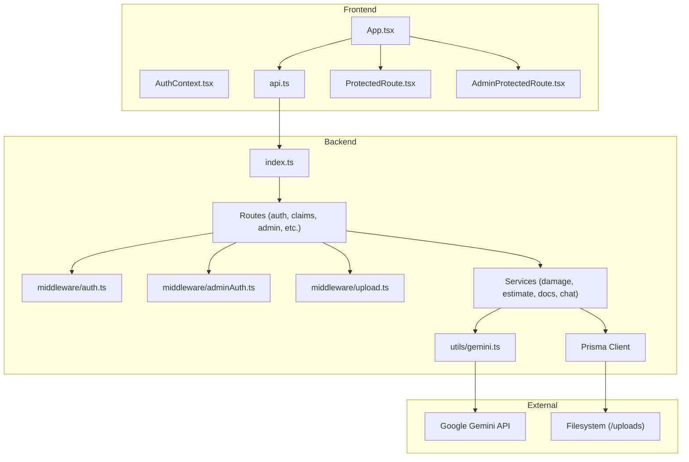
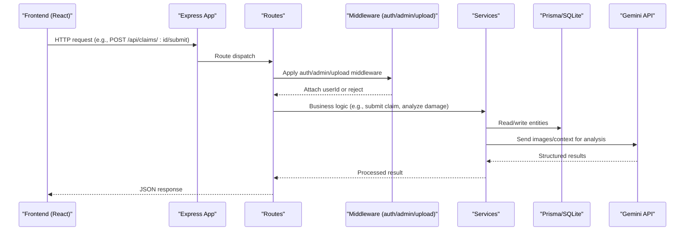
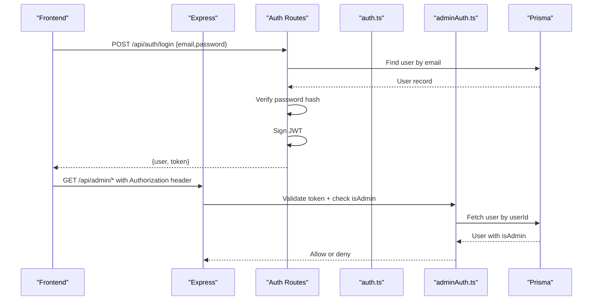
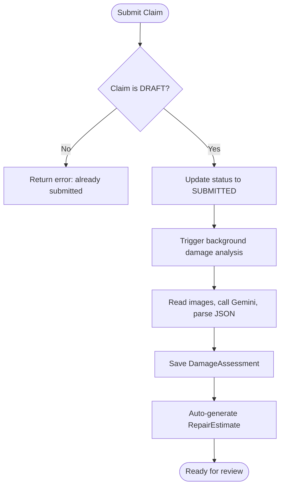
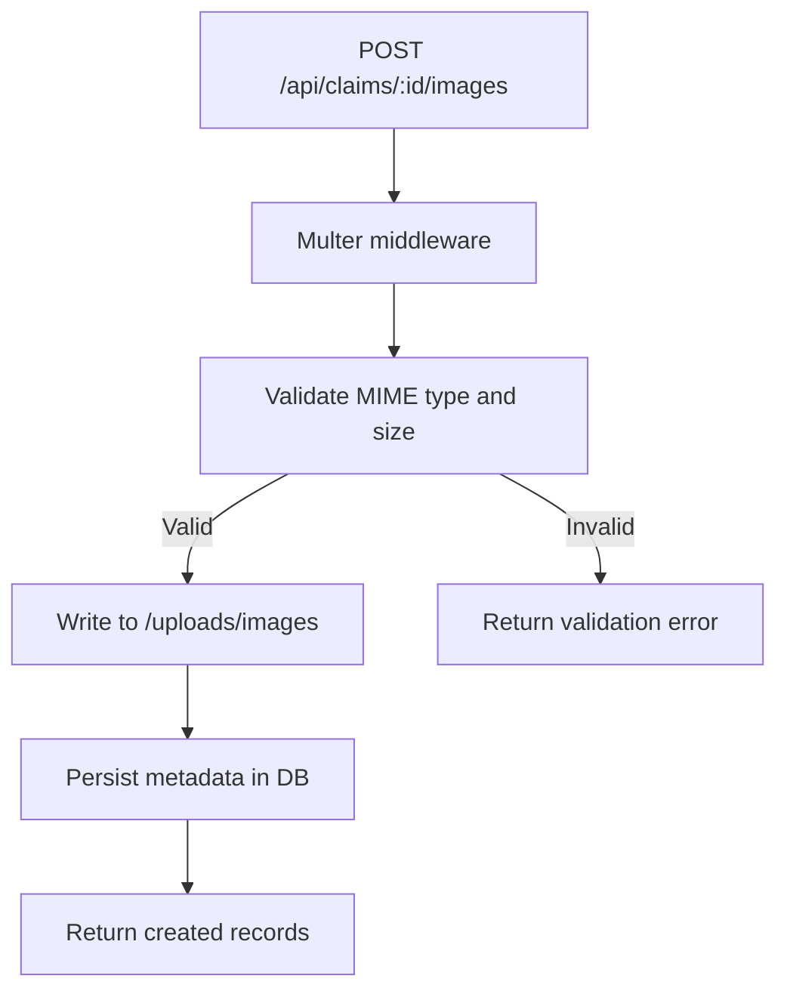
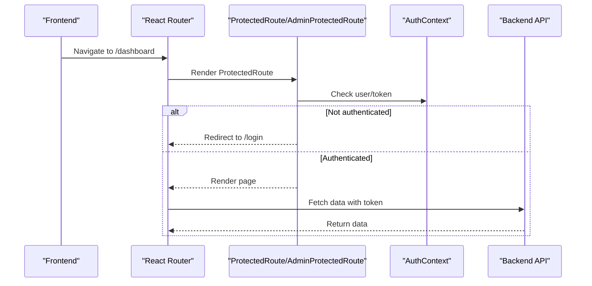
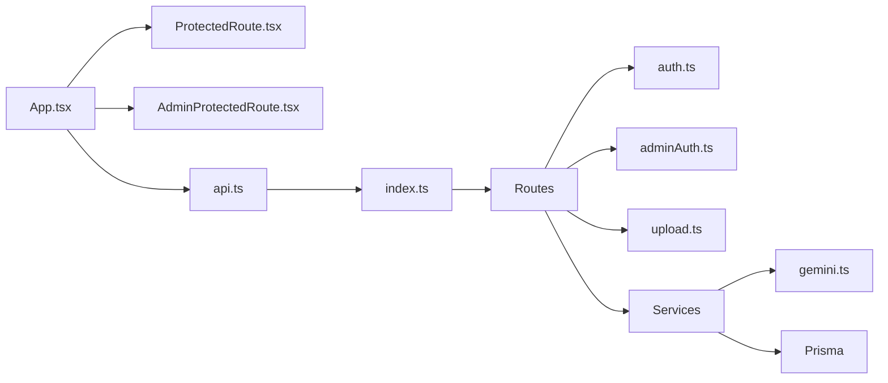

# Architecture Overview

<cite>
**Referenced Files in This Document**
- [index.ts](file://backend/src/index.ts)
- [schema.prisma](file://backend/prisma/schema.prisma)
- [auth.ts](file://backend/src/middleware/auth.ts)
- [adminAuth.ts](file://backend/src/middleware/adminAuth.ts)
- [upload.ts](file://backend/src/middleware/upload.ts)
- [auth.ts](file://backend/src/routes/auth.ts)
- [claims.ts](file://backend/src/routes/claims.ts)
- [damageAnalysisService.ts](file://backend/src/services/damageAnalysisService.ts)
- [claimAssistantService.ts](file://backend/src/services/claimAssistantService.ts)
- [gemini.ts](file://backend/src/utils/gemini.ts)
- [App.tsx](file://frontend/src/App.tsx)
- [AuthContext.tsx](file://frontend/src/context/AuthContext.tsx)
- [api.ts](file://frontend/src/services/api.ts)
- [ProtectedRoute.tsx](file://frontend/src/components/ProtectedRoute.tsx)
- [AdminProtectedRoute.tsx](file://frontend/src/components/AdminProtectedRoute.tsx)
</cite>

## Table of Contents
1. Introduction
2. Project Structure
3. Core Components
4. Architecture Overview
5. Detailed Component Analysis
6. Dependency Analysis
7. Performance Considerations
8. Troubleshooting Guide
9. Conclusion

## Introduction
This document describes the architecture of the Smart Vehicle Insurance Claim System, a full-stack application with a React frontend and an Express.js backend. The system follows an MVC-like structure with a service layer abstraction for business logic, JWT-based authentication, role-based access control (RBAC), file upload handling, and AI-powered claim assistance via Google Gemini. It also documents data flows, component interactions, database relationships through Prisma ORM, and cross-cutting concerns such as error handling, security, and scalability.

## Project Structure
The repository is organized into two main parts:
- Backend (Express + TypeScript):
  - Entry point and middleware configuration
  - Route modules per domain (auth, vehicles, policies, claims, admin)
  - Service layer for AI-driven features (damage analysis, repair estimates, document verification, chat assistant)
  - Prisma schema defining the relational data model
  - Utilities for database access and AI integration
- Frontend (React + TypeScript):
  - Routing and protected routes
  - Authentication context and API client
  - Pages for users and admins



**Diagram sources**
- [index.ts:1-49](file://backend/src/index.ts#L1-L49)
- [App.tsx:1-56](file://frontend/src/App.tsx#L1-L56)
- [api.ts:1-36](file://frontend/src/services/api.ts#L1-L36)
- [auth.ts:1-23](file://backend/src/middleware/auth.ts#L1-L23)
- [adminAuth.ts:1-27](file://backend/src/middleware/adminAuth.ts#L1-L27)
- [upload.ts:1-54](file://backend/src/middleware/upload.ts#L1-L54)
- [gemini.ts:1-12](file://backend/src/utils/gemini.ts#L1-L12)

**Section sources**
- [index.ts:1-49](file://backend/src/index.ts#L1-L49)
- [App.tsx:1-56](file://frontend/src/App.tsx#L1-L56)

## Core Components
- Express application bootstrap and middleware pipeline:
  - CORS, JSON parsing, URL-encoded parsing, static uploads serving, route mounting, health check, global error handler
- Authentication and authorization:
  - JWT middleware to validate tokens and attach user identity
  - Admin-only middleware to enforce RBAC by checking user role in the database
- File upload handling:
  - Multer-based storage with type filtering and size limits; organizes files under /uploads/images and /uploads/documents
- Domain routes:
  - Auth routes for register/login/profile
  - Claims routes for CRUD, image/document uploads, submission, AI analysis triggers, estimate generation, document verification, and chat
- Service layer:
  - Damage analysis using Gemini multimodal input
  - Repair estimate generation
  - Document verification
  - Chat assistant that builds context from claim data and persists conversation history
- Database:
  - Prisma schema defines Users, Vehicles, Policies, Claims, Images, Documents, Assessments, Estimates, Payouts, and ChatMessages with rich relations

**Section sources**
- [index.ts:17-42](file://backend/src/index.ts#L17-L42)
- [auth.ts:1-23](file://backend/src/middleware/auth.ts#L1-L23)
- [adminAuth.ts:1-27](file://backend/src/middleware/adminAuth.ts#L1-L27)
- [upload.ts:1-54](file://backend/src/middleware/upload.ts#L1-L54)
- [auth.ts:10-168](file://backend/src/routes/auth.ts#L10-L168)
- [claims.ts:15-449](file://backend/src/routes/claims.ts#L15-L449)
- [damageAnalysisService.ts:50-152](file://backend/src/services/damageAnalysisService.ts#L50-L152)
- [claimAssistantService.ts:19-129](file://backend/src/services/claimAssistantService.ts#L19-L129)
- [schema.prisma:10-202](file://backend/prisma/schema.prisma#L10-L202)

## Architecture Overview
The system follows an MVC-like pattern:
- Controllers (routes) handle HTTP requests, validate inputs, enforce auth, and delegate to services
- Services encapsulate business logic and external integrations (AI, file processing)
- Data access is abstracted via Prisma ORM against a SQLite database
- Frontend uses React Router for navigation, Axios for API calls, and Context for auth state



**Diagram sources**
- [index.ts:29-42](file://backend/src/index.ts#L29-L42)
- [claims.ts:15-193](file://backend/src/routes/claims.ts#L15-L193)
- [auth.ts:1-23](file://backend/src/middleware/auth.ts#L1-L23)
- [adminAuth.ts:1-27](file://backend/src/middleware/adminAuth.ts#L1-L27)
- [upload.ts:1-54](file://backend/src/middleware/upload.ts#L1-L54)
- [damageAnalysisService.ts:50-152](file://backend/src/services/damageAnalysisService.ts#L50-L152)
- [gemini.ts:1-12](file://backend/src/utils/gemini.ts#L1-L12)

## Detailed Component Analysis

### Authentication and Authorization
- JWT-based authentication:
  - Login/register endpoints create and return JWTs
  - Middleware validates tokens and attaches user ID to requests
- Role-based access control:
  - Admin middleware verifies token and checks isAdmin flag in the database
- Frontend integration:
  - Axios interceptor injects Bearer token and handles 401 redirects
  - ProtectedRoute guards user pages; AdminProtectedRoute guards admin pages



**Diagram sources**
- [auth.ts:10-168](file://backend/src/routes/auth.ts#L10-L168)
- [auth.ts:1-23](file://backend/src/middleware/auth.ts#L1-L23)
- [adminAuth.ts:1-27](file://backend/src/middleware/adminAuth.ts#L1-L27)
- [api.ts:1-36](file://frontend/src/services/api.ts#L1-L36)
- [ProtectedRoute.tsx:1-21](file://frontend/src/components/ProtectedRoute.tsx#L1-L21)
- [AdminProtectedRoute.tsx:1-8](file://frontend/src/components/AdminProtectedRoute.tsx#L1-L8)

**Section sources**
- [auth.ts:10-168](file://backend/src/routes/auth.ts#L10-L168)
- [auth.ts:1-23](file://backend/src/middleware/auth.ts#L1-L23)
- [adminAuth.ts:1-27](file://backend/src/middleware/adminAuth.ts#L1-L27)
- [api.ts:1-36](file://frontend/src/services/api.ts#L1-L36)
- [ProtectedRoute.tsx:1-21](file://frontend/src/components/ProtectedRoute.tsx#L1-L21)
- [AdminProtectedRoute.tsx:1-8](file://frontend/src/components/AdminProtectedRoute.tsx#L1-L8)

### Claims Workflow and AI Integration
- Create and manage claims:
  - Create claim, list claims, get/update claim details
  - Enforce ownership and status transitions (e.g., only DRAFT can be edited)
- Image and document uploads:
  - Multer middleware stores files and records metadata in the database
- Submission and background processing:
  - Submitting a claim updates status to SUBMITTED and triggers background AI damage analysis
- AI damage analysis:
  - Reads uploaded images, sends them to Gemini with a structured prompt, parses JSON output, saves assessment, and auto-generates repair estimate
- Repair estimate and payout:
  - Estimate generation depends on completed damage assessment
- Document verification:
  - Endpoint triggers verification service for uploaded documents
- Chat assistant:
  - Builds rich context from claim data and policy, invokes Gemini chat, persists messages



**Diagram sources**
- [claims.ts:152-193](file://backend/src/routes/claims.ts#L152-L193)
- [damageAnalysisService.ts:50-152](file://backend/src/services/damageAnalysisService.ts#L50-L152)

**Section sources**
- [claims.ts:20-193](file://backend/src/routes/claims.ts#L20-L193)
- [claims.ts:195-449](file://backend/src/routes/claims.ts#L195-L449)
- [damageAnalysisService.ts:50-152](file://backend/src/services/damageAnalysisService.ts#L50-L152)
- [claimAssistantService.ts:19-129](file://backend/src/services/claimAssistantService.ts#L19-L129)

### File Upload Handling
- Multer configuration:
  - Disk storage with UUID filenames
  - Separate directories for images and documents
  - Allowed MIME types and size limits
- Static serving:
  - Uploaded files are served under /uploads via Express static middleware



**Diagram sources**
- [upload.ts:1-54](file://backend/src/middleware/upload.ts#L1-L54)
- [claims.ts:195-233](file://backend/src/routes/claims.ts#L195-L233)
- [index.ts:25-27](file://backend/src/index.ts#L25-L27)

**Section sources**
- [upload.ts:1-54](file://backend/src/middleware/upload.ts#L1-L54)
- [claims.ts:195-233](file://backend/src/routes/claims.ts#L195-L233)
- [index.ts:25-27](file://backend/src/index.ts#L25-L27)

### Database Model and Relationships
The Prisma schema defines core entities and their relationships:
- User owns Vehicles, Policies, and Claims
- Vehicle and Policy relate to Claims
- Claim has many Images and Documents, one DamageAssessment, optional RepairEstimate and InsurancePayout, and many ChatMessages
- Enums define statuses and types for claims, images, documents, and chat roles

```mermaid
erDiagram
USER ||--o{ VEHICLE : owns
USER ||--o{ INSURANCE_POLICY : owns
USER ||--o{ CLAIM : creates
VEHICLE ||--o{ CLAIM : involved_in
INSURANCE_POLICY ||--o{ CLAIM : covers
CLAIM ||--|| DAMAGE_ASSESSMENT : has
CLAIM ||--o{ CLAIM_IMAGE : contains
CLAIM ||--o{ DOCUMENT : contains
CLAIM ||--o{ CHAT_MESSAGE : has
DAMAGE_ASSESSMENT ||--o{ REPAIR_ESTIMATE : leads_to
REPAIR_ESTIMATE ||--o{ INSURANCE_PAYOUT : generates }
```

**Diagram sources**
- [schema.prisma:10-202](file://backend/prisma/schema.prisma#L10-L202)

**Section sources**
- [schema.prisma:10-202](file://backend/prisma/schema.prisma#L10-L202)

### Frontend Routing and Protection
- App configures routes for user and admin areas
- ProtectedRoute ensures authenticated users can access protected pages
- AdminProtectedRoute ensures only admin users can access admin pages
- AuthContext manages login, registration, logout, and profile updates, persisting token and user info



**Diagram sources**
- [App.tsx:23-52](file://frontend/src/App.tsx#L23-L52)
- [ProtectedRoute.tsx:1-21](file://frontend/src/components/ProtectedRoute.tsx#L1-L21)
- [AdminProtectedRoute.tsx:1-8](file://frontend/src/components/AdminProtectedRoute.tsx#L1-L8)
- [AuthContext.tsx:17-82](file://frontend/src/context/AuthContext.tsx#L17-L82)
- [api.ts:1-36](file://frontend/src/services/api.ts#L1-L36)

**Section sources**
- [App.tsx:23-52](file://frontend/src/App.tsx#L23-L52)
- [ProtectedRoute.tsx:1-21](file://frontend/src/components/ProtectedRoute.tsx#L1-L21)
- [AdminProtectedRoute.tsx:1-8](file://frontend/src/components/AdminProtectedRoute.tsx#L1-L8)
- [AuthContext.tsx:17-82](file://frontend/src/context/AuthContext.tsx#L17-L82)
- [api.ts:1-36](file://frontend/src/services/api.ts#L1-L36)

## Dependency Analysis
- Backend dependencies:
  - Express app mounts routes and middleware
  - Routes depend on middleware for auth, admin checks, and uploads
  - Services depend on Prisma for data access and Gemini utility for AI
- Frontend dependencies:
  - App composes routes and guards
  - Pages rely on AuthContext and api client
  - api client intercepts requests/responses for auth and errors



**Diagram sources**
- [App.tsx:1-56](file://frontend/src/App.tsx#L1-L56)
- [index.ts:1-49](file://backend/src/index.ts#L1-L49)
- [auth.ts:1-23](file://backend/src/middleware/auth.ts#L1-L23)
- [adminAuth.ts:1-27](file://backend/src/middleware/adminAuth.ts#L1-L27)
- [upload.ts:1-54](file://backend/src/middleware/upload.ts#L1-L54)
- [gemini.ts:1-12](file://backend/src/utils/gemini.ts#L1-L12)

**Section sources**
- [App.tsx:1-56](file://frontend/src/App.tsx#L1-L56)
- [index.ts:1-49](file://backend/src/index.ts#L1-L49)

## Performance Considerations
- Background processing:
  - Damage analysis is triggered asynchronously after claim submission to avoid blocking the response
- Efficient queries:
  - Use Prisma includes/select to fetch only needed fields and reduce payload size
- File handling:
  - Limit file sizes and restrict MIME types to prevent abuse and improve throughput
- Caching and scaling:
  - Consider caching frequent reads (e.g., vehicle/policy lookups) and moving to a managed database for production scale
- External AI calls:
  - Implement retries and timeouts for Gemini API calls; consider queuing long-running tasks

[No sources needed since this section provides general guidance]

## Troubleshooting Guide
- Authentication issues:
  - Ensure Authorization header includes valid Bearer token; 401 responses clear local storage and redirect to login
- Admin access denied:
  - 403 indicates missing admin role; verify user.isAdmin in the database
- Upload failures:
  - Check allowed MIME types and file size limits; ensure upload directories exist
- AI analysis errors:
  - If Gemini returns unexpected format, parsing fallback sets MINOR severity and requires manual review
- Database errors:
  - Wrap operations in try/catch and return consistent error payloads; log stack traces for debugging

**Section sources**
- [api.ts:22-33](file://frontend/src/services/api.ts#L22-L33)
- [adminAuth.ts:6-26](file://backend/src/middleware/adminAuth.ts#L6-L26)
- [upload.ts:30-41](file://backend/src/middleware/upload.ts#L30-L41)
- [damageAnalysisService.ts:85-103](file://backend/src/services/damageAnalysisService.ts#L85-L103)

## Conclusion
The Smart Vehicle Insurance Claim System implements a clean separation of concerns with an Express backend, React frontend, and a robust service layer. JWT-based authentication and RBAC secure endpoints, while Prisma models provide a strong data contract. AI integration enhances claim processing through automated damage assessment and intelligent chat assistance. The design supports scalable growth through background processing, efficient data access, and clear boundaries between components.