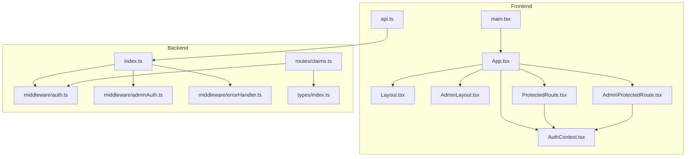
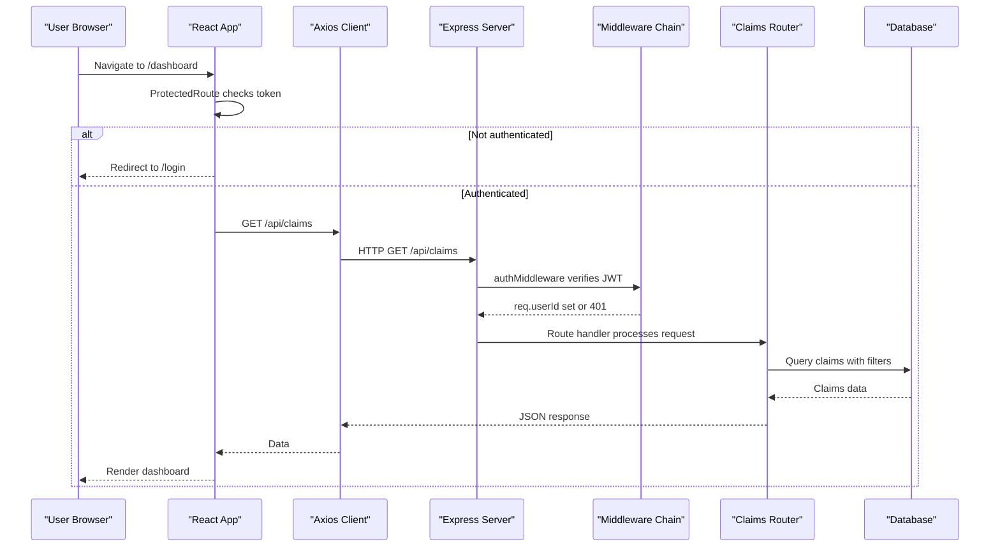
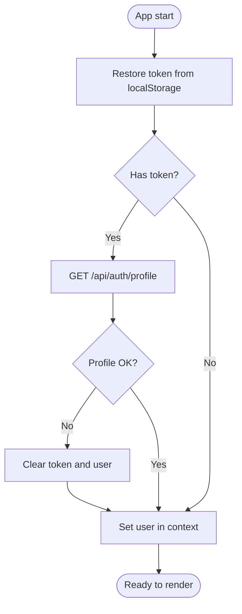
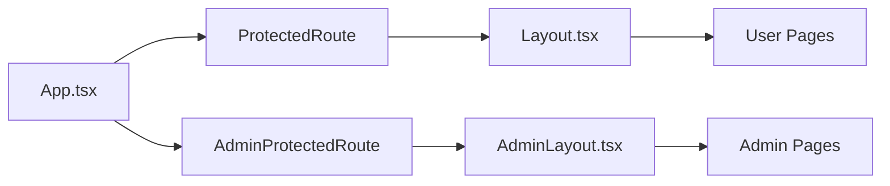
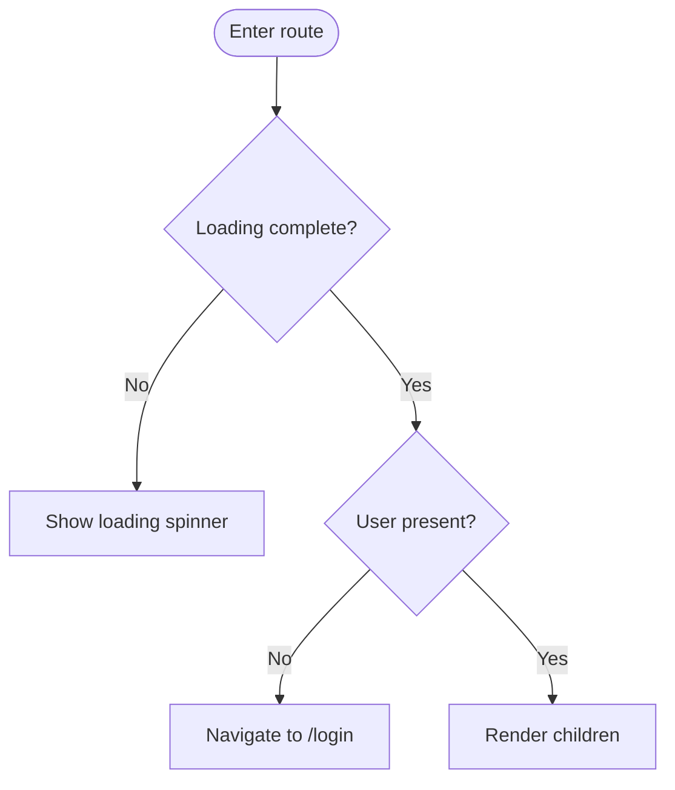
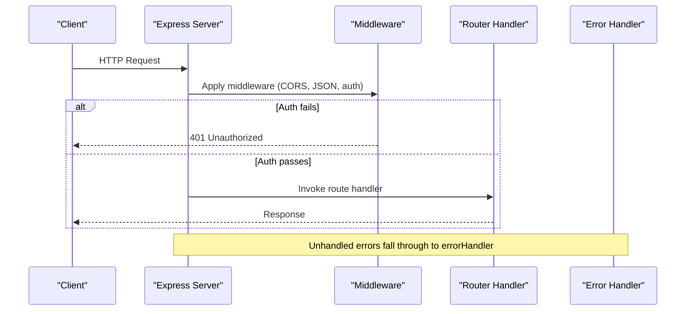
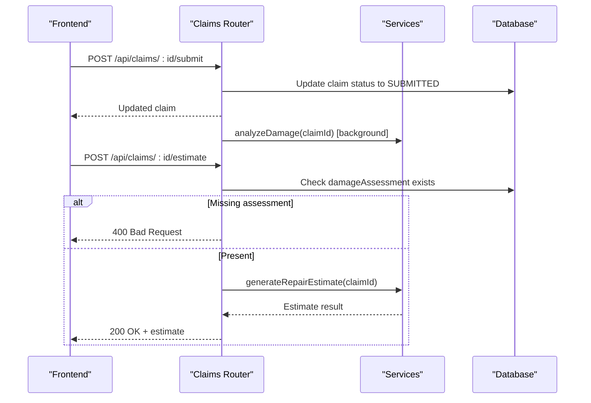
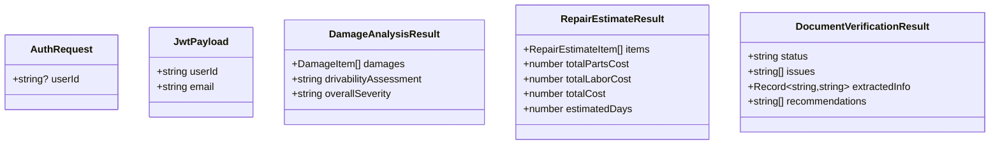
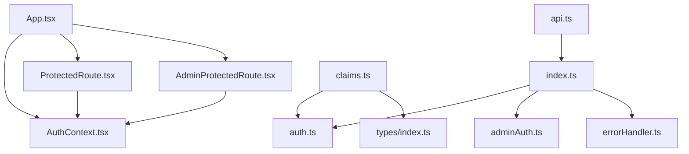

# Component Architecture

<cite>
**Referenced Files in This Document**
- [main.tsx](file://frontend/src/main.tsx)
- [App.tsx](file://frontend/src/App.tsx)
- [AuthContext.tsx](file://frontend/src/context/AuthContext.tsx)
- [Layout.tsx](file://frontend/src/components/Layout.tsx)
- [AdminLayout.tsx](file://frontend/src/components/AdminLayout.tsx)
- [ProtectedRoute.tsx](file://frontend/src/components/ProtectedRoute.tsx)
- [AdminProtectedRoute.tsx](file://frontend/src/components/AdminProtectedRoute.tsx)
- [api.ts](file://frontend/src/services/api.ts)
- [index.ts](file://backend/src/index.ts)
- [auth.ts](file://backend/src/middleware/auth.ts)
- [adminAuth.ts](file://backend/src/middleware/adminAuth.ts)
- [errorHandler.ts](file://backend/src/middleware/errorHandler.ts)
- [claims.ts](file://backend/src/routes/claims.ts)
- [types/index.ts](file://backend/src/types/index.ts)
</cite>

## Table of Contents
1. Introduction
2. Project Structure
3. Core Components
4. Architecture Overview
5. Detailed Component Analysis
6. Dependency Analysis
7. Performance Considerations
8. Troubleshooting Guide
9. Conclusion

## Introduction
This document describes the component architecture for both frontend and backend systems of the Smart Vehicle Insurance Claim System. It covers React component hierarchy, state management via Context API, routing structure, reusable layouts, authentication guards, and protected routes on the frontend; and Express.js middleware chain, route organization, controller-like handlers, service layer abstraction, error handling, and performance considerations on the backend.

## Project Structure
The application is split into a React-based frontend and an Express-based backend:
- Frontend entry renders the app with React StrictMode and bootstraps routing and global auth context.
- Routing defines public and protected user routes, plus admin routes with separate layout and guard.
- Backend mounts middleware (CORS, JSON parsing, static uploads), registers feature routes, and installs a global error handler.

**Diagram sources**
- [main.tsx:1-11](file://frontend/src/main.tsx#L1-L11)
- [App.tsx:1-56](file://frontend/src/App.tsx#L1-L56)
- [AuthContext.tsx:1-82](file://frontend/src/context/AuthContext.tsx#L1-L82)
- [Layout.tsx:1-176](file://frontend/src/components/Layout.tsx#L1-L176)
- [AdminLayout.tsx:1-74](file://frontend/src/components/AdminLayout.tsx#L1-L74)
- [ProtectedRoute.tsx:1-21](file://frontend/src/components/ProtectedRoute.tsx#L1-L21)
- [AdminProtectedRoute.tsx:1-8](file://frontend/src/components/AdminProtectedRoute.tsx#L1-L8)
- [api.ts:1-36](file://frontend/src/services/api.ts#L1-L36)
- [index.ts:1-49](file://backend/src/index.ts#L1-L49)
- [auth.ts:1-23](file://backend/src/middleware/auth.ts#L1-L23)
- [adminAuth.ts:1-27](file://backend/src/middleware/adminAuth.ts#L1-L27)
- [errorHandler.ts:1-28](file://backend/src/middleware/errorHandler.ts#L1-L28)
- [claims.ts:1-450](file://backend/src/routes/claims.ts#L1-L450)
- [types/index.ts:1-51](file://backend/src/types/index.ts#L1-L51)

**Section sources**
- [main.tsx:1-11](file://frontend/src/main.tsx#L1-L11)
- [App.tsx:1-56](file://frontend/src/App.tsx#L1-L56)
- [index.ts:1-49](file://backend/src/index.ts#L1-L49)

## Core Components
- Frontend
  - App orchestrates routing, wraps all routes with AuthProvider, and applies ProtectedRoute/AdminProtectedRoute to secure sections.
  - Layout and AdminLayout provide consistent navigation, branding, and responsive UI shells for user and admin areas.
  - ProtectedRoute and AdminProtectedRoute enforce access control based on tokens stored locally.
  - AuthContext centralizes authentication state (user, token, loading) and exposes login/register/logout/updateProfile actions.
  - api.ts configures Axios with base URL, attaches Authorization headers, handles multipart boundaries, and redirects on 401.
- Backend
  - index.ts initializes Express, sets up CORS, JSON parsing, static upload serving, mounts feature routes, health check, and global error handler.
  - Middleware:
    - auth.ts validates JWT and attaches userId to requests.
    - adminAuth.ts validates JWT and ensures admin role by querying the database.
    - errorHandler.ts normalizes errors and returns structured responses.
  - Routes:
    - claims.ts demonstrates resourceful endpoints for claims, images, documents, AI analysis triggers, estimates, and chat messages, using Prisma and services.
  - Types define shared interfaces for request augmentation and domain models.

**Section sources**
- [App.tsx:1-56](file://frontend/src/App.tsx#L1-L56)
- [Layout.tsx:1-176](file://frontend/src/components/Layout.tsx#L1-L176)
- [AdminLayout.tsx:1-74](file://frontend/src/components/AdminLayout.tsx#L1-L74)
- [ProtectedRoute.tsx:1-21](file://frontend/src/components/ProtectedRoute.tsx#L1-L21)
- [AdminProtectedRoute.tsx:1-8](file://frontend/src/components/AdminProtectedRoute.tsx#L1-L8)
- [AuthContext.tsx:1-82](file://frontend/src/context/AuthContext.tsx#L1-L82)
- [api.ts:1-36](file://frontend/src/services/api.ts#L1-L36)
- [index.ts:1-49](file://backend/src/index.ts#L1-L49)
- [auth.ts:1-23](file://backend/src/middleware/auth.ts#L1-L23)
- [adminAuth.ts:1-27](file://backend/src/middleware/adminAuth.ts#L1-L27)
- [errorHandler.ts:1-28](file://backend/src/middleware/errorHandler.ts#L1-L28)
- [claims.ts:1-450](file://backend/src/routes/claims.ts#L1-L450)
- [types/index.ts:1-51](file://backend/src/types/index.ts#L1-L51)

## Architecture Overview
The system follows a layered architecture:
- Frontend: React Router manages navigation; Context API provides cross-cutting auth state; Layouts encapsulate UI chrome; API client interceptors handle auth and error flows.
- Backend: Express middleware pipeline enforces security and parsing; feature routers implement business logic; services encapsulate external integrations (AI); Prisma interacts with the database; a global error handler standardizes error responses.

**Diagram sources**
- [ProtectedRoute.tsx:1-21](file://frontend/src/components/ProtectedRoute.tsx#L1-L21)
- [api.ts:1-36](file://frontend/src/services/api.ts#L1-L36)
- [index.ts:1-49](file://backend/src/index.ts#L1-L49)
- [auth.ts:1-23](file://backend/src/middleware/auth.ts#L1-L23)
- [claims.ts:1-450](file://backend/src/routes/claims.ts#L1-L450)

## Detailed Component Analysis

### Frontend Authentication and State Management
- AuthContext maintains user, token, and loading state. On mount, it restores session from localStorage and fetches profile to validate token. Login/register store token and user; logout clears state and storage. Profile updates are persisted and reflected in context.
- api.ts attaches Bearer tokens to every request and clears session on 401, redirecting to login.

**Diagram sources**
- [AuthContext.tsx:17-36](file://frontend/src/context/AuthContext.tsx#L17-L36)
- [api.ts:7-33](file://frontend/src/services/api.ts#L7-L33)

**Section sources**
- [AuthContext.tsx:1-82](file://frontend/src/context/AuthContext.tsx#L1-L82)
- [api.ts:1-36](file://frontend/src/services/api.ts#L1-L36)

### Routing and Layouts
- App.tsx defines public routes (/login, /register), protected user routes wrapped with ProtectedRoute and Layout, and admin routes wrapped with AdminProtectedRoute and AdminLayout. Root path redirects to dashboard.
- Layout.tsx provides responsive sidebar, top bar, and bottom nav for mobile, with logout integration.
- AdminLayout.tsx provides a dark-themed admin sidebar and content area.

**Diagram sources**
- [App.tsx:23-50](file://frontend/src/App.tsx#L23-L50)
- [ProtectedRoute.tsx:1-21](file://frontend/src/components/ProtectedRoute.tsx#L1-L21)
- [AdminProtectedRoute.tsx:1-8](file://frontend/src/components/AdminProtectedRoute.tsx#L1-L8)
- [Layout.tsx:14-176](file://frontend/src/components/Layout.tsx#L14-L176)
- [AdminLayout.tsx:11-74](file://frontend/src/components/AdminLayout.tsx#L11-L74)

**Section sources**
- [App.tsx:1-56](file://frontend/src/App.tsx#L1-L56)
- [Layout.tsx:1-176](file://frontend/src/components/Layout.tsx#L1-L176)
- [AdminLayout.tsx:1-74](file://frontend/src/components/AdminLayout.tsx#L1-L74)

### Protected Routes and Guards
- ProtectedRoute checks loading and user presence; shows spinner while loading and redirects to login if not authenticated.
- AdminProtectedRoute checks admin token in localStorage and redirects to admin login when missing.

**Diagram sources**
- [ProtectedRoute.tsx:4-20](file://frontend/src/components/ProtectedRoute.tsx#L4-L20)

**Section sources**
- [ProtectedRoute.tsx:1-21](file://frontend/src/components/ProtectedRoute.tsx#L1-L21)
- [AdminProtectedRoute.tsx:1-8](file://frontend/src/components/AdminProtectedRoute.tsx#L1-L8)

### Backend Middleware Chain and Route Organization
- index.ts wires CORS, JSON parsing, static uploads, mounts feature routes under /api/*, adds health endpoint, and installs global error handler at the end.
- auth.ts extracts and verifies JWT, setting userId on the request.
- adminAuth.ts verifies JWT and ensures the user has admin privileges by checking the database.
- errorHandler.ts catches errors and returns standardized JSON responses.

**Diagram sources**
- [index.ts:14-43](file://backend/src/index.ts#L14-L43)
- [auth.ts:5-22](file://backend/src/middleware/auth.ts#L5-L22)
- [adminAuth.ts:6-26](file://backend/src/middleware/adminAuth.ts#L6-L26)
- [errorHandler.ts:13-27](file://backend/src/middleware/errorHandler.ts#L13-L27)

**Section sources**
- [index.ts:1-49](file://backend/src/index.ts#L1-L49)
- [auth.ts:1-23](file://backend/src/middleware/auth.ts#L1-L23)
- [adminAuth.ts:1-27](file://backend/src/middleware/adminAuth.ts#L1-L27)
- [errorHandler.ts:1-28](file://backend/src/middleware/errorHandler.ts#L1-L28)

### Claims Feature Flow (Controller-like Handlers and Services)
- The claims router implements CRUD and workflow endpoints: create, list, get, update, submit, image/document uploads, AI analysis trigger, estimate generation, and chat messaging.
- Submitting a claim transitions status to SUBMITTED and triggers background damage analysis.
- Estimate generation requires prior damage assessment.
- Documents can be uploaded and verified via dedicated endpoints.

**Diagram sources**
- [claims.ts:152-193](file://backend/src/routes/claims.ts#L152-L193)
- [claims.ts:290-314](file://backend/src/routes/claims.ts#L290-L314)

**Section sources**
- [claims.ts:1-450](file://backend/src/routes/claims.ts#L1-L450)

### Data Models and Types
- Shared types define request augmentation (userId), JWT payload, and domain models for damage analysis, repair estimates, and document verification results. These ensure type safety across services and routes.

**Diagram sources**
- [types/index.ts:1-51](file://backend/src/types/index.ts#L1-L51)

**Section sources**
- [types/index.ts:1-51](file://backend/src/types/index.ts#L1-L51)

## Dependency Analysis
- Frontend dependencies:
  - App depends on routing, contexts, and components.
  - ProtectedRoute depends on AuthContext.
  - api.ts depends on axios and local storage for token management.
- Backend dependencies:
  - index.ts depends on middleware and route modules.
  - Claims router depends on auth middleware, upload middleware, Prisma, and services.
  - Types module is consumed by middleware and routes for type safety.

**Diagram sources**
- [App.tsx:1-56](file://frontend/src/App.tsx#L1-L56)
- [ProtectedRoute.tsx:1-21](file://frontend/src/components/ProtectedRoute.tsx#L1-L21)
- [AdminProtectedRoute.tsx:1-8](file://frontend/src/components/AdminProtectedRoute.tsx#L1-L8)
- [AuthContext.tsx:1-82](file://frontend/src/context/AuthContext.tsx#L1-L82)
- [api.ts:1-36](file://frontend/src/services/api.ts#L1-L36)
- [index.ts:1-49](file://backend/src/index.ts#L1-L49)
- [auth.ts:1-23](file://backend/src/middleware/auth.ts#L1-L23)
- [adminAuth.ts:1-27](file://backend/src/middleware/adminAuth.ts#L1-L27)
- [errorHandler.ts:1-28](file://backend/src/middleware/errorHandler.ts#L1-L28)
- [claims.ts:1-450](file://backend/src/routes/claims.ts#L1-L450)
- [types/index.ts:1-51](file://backend/src/types/index.ts#L1-L51)

**Section sources**
- [App.tsx:1-56](file://frontend/src/App.tsx#L1-L56)
- [index.ts:1-49](file://backend/src/index.ts#L1-L49)
- [claims.ts:1-450](file://backend/src/routes/claims.ts#L1-L450)

## Performance Considerations
- Frontend
  - Use React.lazy and code splitting for route-level chunks to reduce initial bundle size.
  - Memoize expensive computations and derived data with useMemo/useCallback where appropriate.
  - Avoid unnecessary re-renders by keeping context state minimal and colocating state near consumers.
  - Debounce search/filter inputs and paginate lists to limit DOM updates.
  - Prefer functional components and hooks for predictable lifecycle behavior.
- Backend
  - Keep middleware order tight: parse and auth before heavy operations.
  - Use selective field projection in queries to minimize payload sizes.
  - Offload long-running tasks (e.g., AI analysis) to background jobs to keep request latency low.
  - Cache frequent reads (e.g., profiles, policies) with short TTLs if needed.
  - Tune body size limits and enable compression for large payloads.

[No sources needed since this section provides general guidance]

## Troubleshooting Guide
- Frontend
  - If users are unexpectedly redirected to login, verify that the token exists and is valid; the API interceptor clears invalid sessions and navigates to login.
  - Ensure Content-Type is not forced for FormData; the interceptor deletes it for multipart uploads.
- Backend
  - 401 Unauthorized indicates missing or invalid JWT; confirm Authorization header format and secret configuration.
  - 403 Forbidden on admin routes indicates non-admin user; verify admin flag in the database.
  - Global error handler logs errors and returns structured JSON; use logs to diagnose failures.

**Section sources**
- [api.ts:22-33](file://frontend/src/services/api.ts#L22-L33)
- [auth.ts:5-22](file://backend/src/middleware/auth.ts#L5-L22)
- [adminAuth.ts:6-26](file://backend/src/middleware/adminAuth.ts#L6-L26)
- [errorHandler.ts:13-27](file://backend/src/middleware/errorHandler.ts#L13-L27)

## Conclusion
The system employs a clear separation of concerns: React components and Context manage UI state and navigation, while Express middleware and routes implement secure, modular APIs. Protected routes and middleware enforce access control consistently across user and admin areas. The design supports extensibility through service abstractions and standardized error handling, enabling maintainable growth and reliable performance.