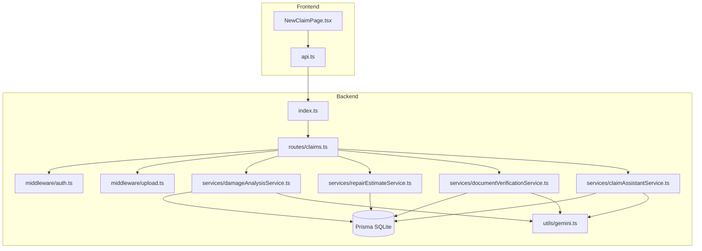
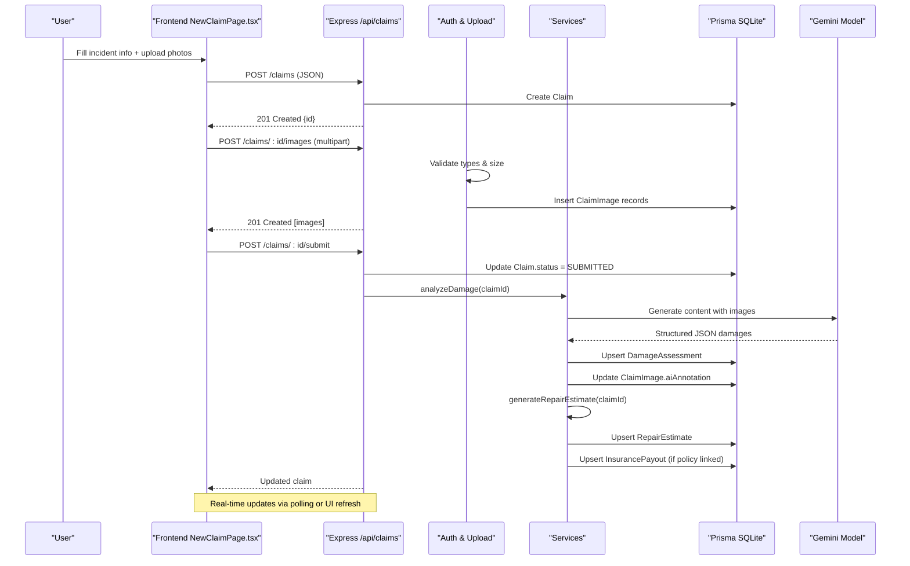
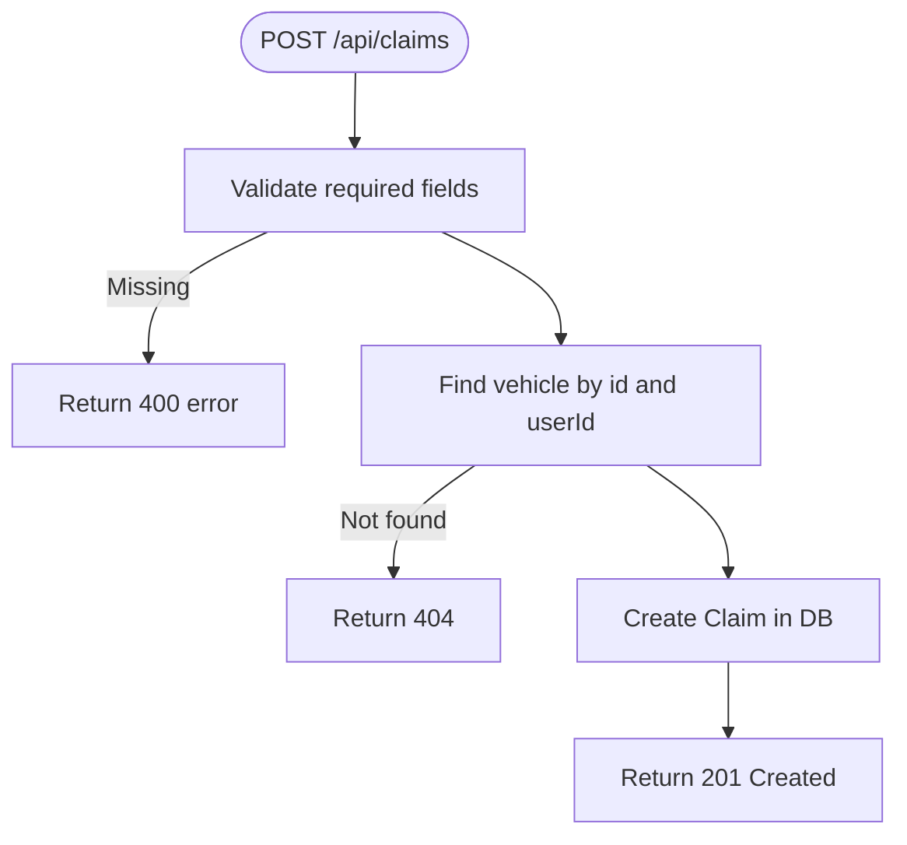
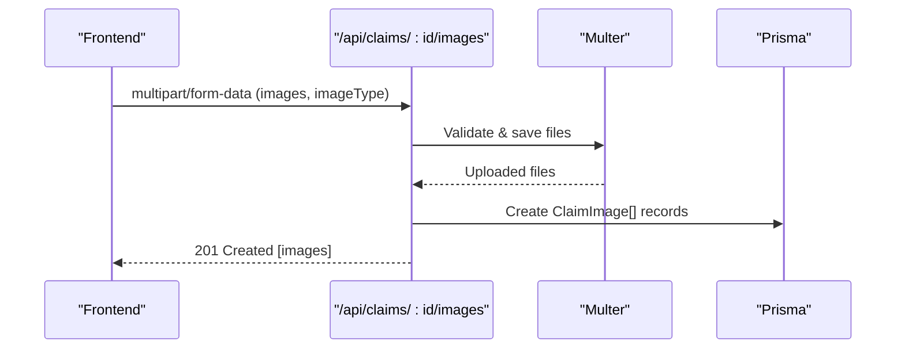
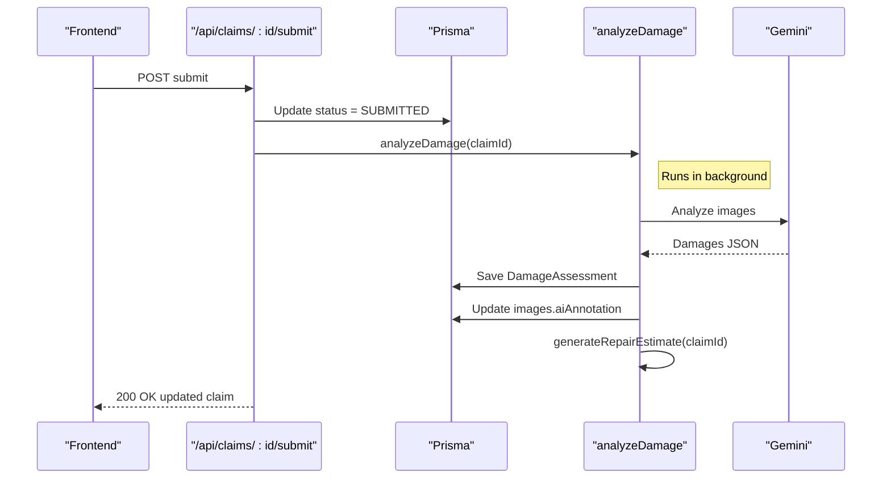
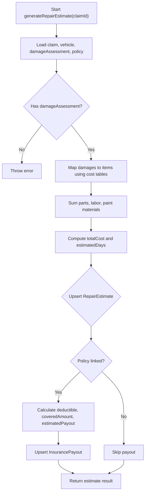
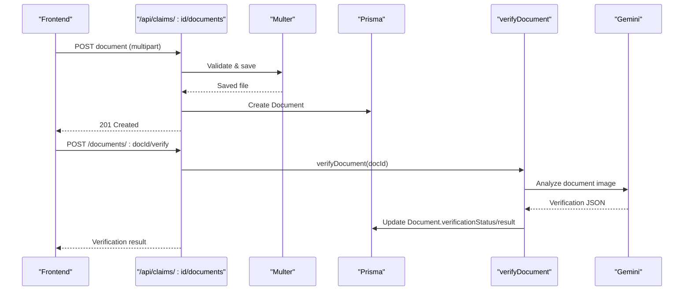
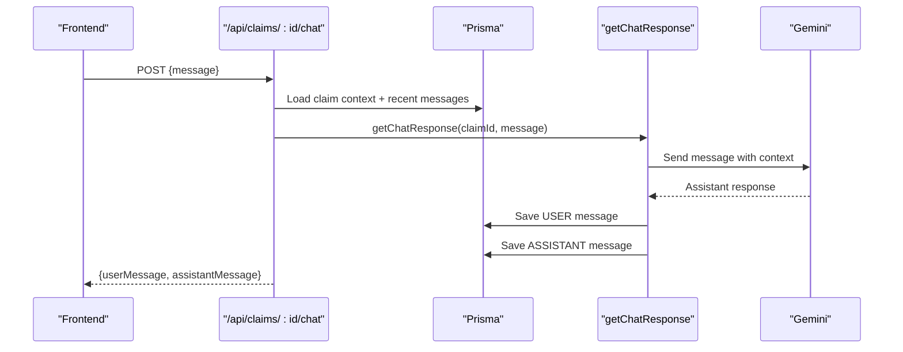
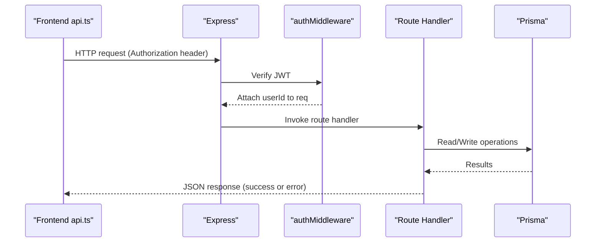
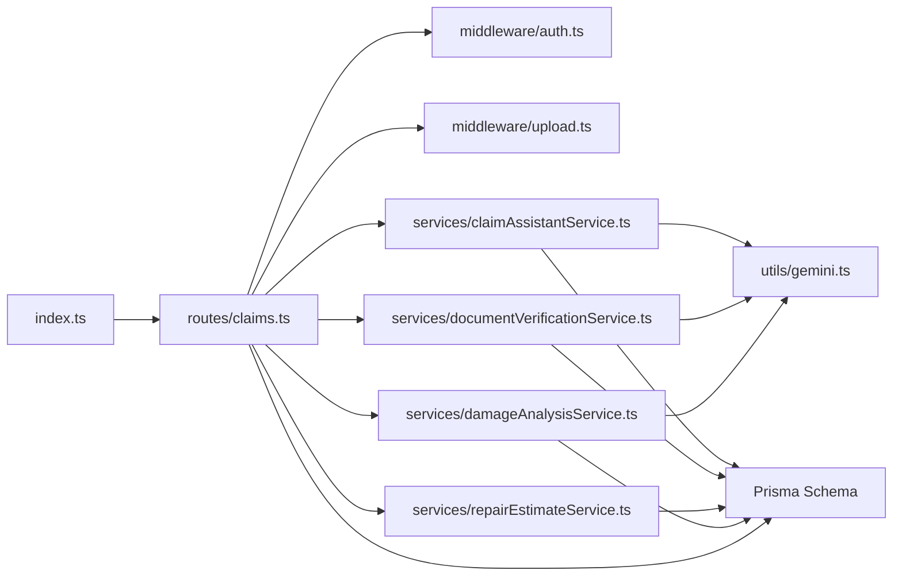

# Data Flow

<cite>
**Referenced Files in This Document**
- [index.ts](file://backend/src/index.ts)
- [schema.prisma](file://backend/prisma/schema.prisma)
- [claims.ts](file://backend/src/routes/claims.ts)
- [auth.ts](file://backend/src/middleware/auth.ts)
- [upload.ts](file://backend/src/middleware/upload.ts)
- [errorHandler.ts](file://backend/src/middleware/errorHandler.ts)
- [damageAnalysisService.ts](file://backend/src/services/damageAnalysisService.ts)
- [repairEstimateService.ts](file://backend/src/services/repairEstimateService.ts)
- [documentVerificationService.ts](file://backend/src/services/documentVerificationService.ts)
- [claimAssistantService.ts](file://backend/src/services/claimAssistantService.ts)
- [gemini.ts](file://backend/src/utils/gemini.ts)
- [NewClaimPage.tsx](file://frontend/src/pages/NewClaimPage.tsx)
- [api.ts](file://frontend/src/services/api.ts)
</cite>

## Table of Contents
1. [Introduction](#introduction)
2. [Project Structure](#project-structure)
3. [Core Components](#core-components)
4. [Architecture Overview](#architecture-overview)
5. [Detailed Component Analysis](#detailed-component-analysis)
6. [Dependency Analysis](#dependency-analysis)
7. [Performance Considerations](#performance-considerations)
8. [Troubleshooting Guide](#troubleshooting-guide)
9. [Conclusion](#conclusion)

## Introduction
This document explains how data flows through the Smart Vehicle Insurance Claim System from user submission to AI analysis and final approval. It covers API request/response cycles, file uploads, database transactions, real-time updates via chat, validation rules, error propagation, and concurrency considerations. The system uses an Express backend with Prisma (SQLite), Google Gemini for AI-based damage assessment and document verification, and a React frontend that guides users through claim creation and photo uploads.

## Project Structure
The system is split into:
- Backend: Express server, routes, middleware, services, Prisma schema, and utilities.
- Frontend: React pages and API client.

**Diagram sources**
- [index.ts:14-34](file://backend/src/index.ts#L14-L34)
- [claims.ts:1-15](file://backend/src/routes/claims.ts#L1-L15)
- [upload.ts:17-53](file://backend/src/middleware/upload.ts#L17-L53)
- [damageAnalysisService.ts:50-153](file://backend/src/services/damageAnalysisService.ts#L50-L153)
- [repairEstimateService.ts:104-199](file://backend/src/services/repairEstimateService.ts#L104-L199)
- [documentVerificationService.ts:41-107](file://backend/src/services/documentVerificationService.ts#L41-L107)
- [claimAssistantService.ts:19-130](file://backend/src/services/claimAssistantService.ts#L19-L130)
- [gemini.ts:6-9](file://backend/src/utils/gemini.ts#L6-L9)

**Section sources**
- [index.ts:14-49](file://backend/src/index.ts#L14-L49)
- [schema.prisma:10-202](file://backend/prisma/schema.prisma#L10-L202)

## Core Components
- API Server: Express app with CORS, JSON parsing, static upload serving, and route mounting.
- Routes: Claims endpoints for CRUD, submit, image/document upload, analyze, estimate, verify, and chat.
- Middleware: Authentication (JWT), file upload handling, global error handler.
- Services:
  - Damage analysis using Gemini to detect damages and severity.
  - Repair estimate generation based on damage assessment and policy deductible.
  - Document verification using Gemini to validate uploaded documents.
  - Chat assistant providing contextual guidance and status explanations.
- Data Layer: Prisma models for User, Vehicle, Policy, Claim, images, assessments, estimates, payouts, documents, and chat messages.

Key responsibilities:
- Validate inputs and enforce business rules at route level.
- Persist state changes within single-request transactions where applicable.
- Orchestrate AI calls and persist structured results back to the database.
- Provide consistent error responses and handle failures gracefully.

**Section sources**
- [claims.ts:20-449](file://backend/src/routes/claims.ts#L20-L449)
- [auth.ts:5-22](file://backend/src/middleware/auth.ts#L5-L22)
- [upload.ts:17-53](file://backend/src/middleware/upload.ts#L17-L53)
- [errorHandler.ts:3-27](file://backend/src/middleware/errorHandler.ts#L3-L27)
- [damageAnalysisService.ts:50-153](file://backend/src/services/damageAnalysisService.ts#L50-L153)
- [repairEstimateService.ts:104-199](file://backend/src/services/repairEstimateService.ts#L104-L199)
- [documentVerificationService.ts:41-107](file://backend/src/services/documentVerificationService.ts#L41-L107)
- [claimAssistantService.ts:19-130](file://backend/src/services/claimAssistantService.ts#L19-L130)
- [schema.prisma:10-202](file://backend/prisma/schema.prisma#L10-L202)

## Architecture Overview
End-to-end flow highlights:
- Frontend collects incident details and photos, then submits them to the backend.
- Backend validates ownership and required fields, persists claims and files, and triggers AI analysis.
- AI services parse images/documents, return structured results, and update the database.
- Estimates and payout calculations are derived from assessments and policies.
- Users can interact with an AI assistant for contextual guidance; conversation history is stored per claim.

**Diagram sources**
- [NewClaimPage.tsx:72-94](file://frontend/src/pages/NewClaimPage.tsx#L72-L94)
- [claims.ts:20-57](file://backend/src/routes/claims.ts#L20-L57)
- [claims.ts:152-193](file://backend/src/routes/claims.ts#L152-L193)
- [claims.ts:195-233](file://backend/src/routes/claims.ts#L195-L233)
- [damageAnalysisService.ts:50-153](file://backend/src/services/damageAnalysisService.ts#L50-L153)
- [repairEstimateService.ts:104-199](file://backend/src/services/repairEstimateService.ts#L104-L199)

## Detailed Component Analysis

### Claim Creation Workflow
- Validation: Required fields include vehicle, incident date, location, and description. Optional fields include policy, weather, and police report flag.
- Ownership check: Ensures the vehicle belongs to the authenticated user.
- Persistence: Creates a new Claim record with default status DRAFT.
- Response: Returns the created claim ID for subsequent steps.

**Diagram sources**
- [claims.ts:20-57](file://backend/src/routes/claims.ts#L20-L57)

**Section sources**
- [claims.ts:20-57](file://backend/src/routes/claims.ts#L20-L57)

### Image Upload and Storage
- File validation: Only JPEG, PNG, WebP allowed; max 10MB per file.
- Storage: Multer writes files to disk under configured upload directories.
- Database: Records each image with type (FULL_VEHICLE or DAMAGE_CLOSEUP) and path.
- Deletion: Deletes both file and record when requested.

**Diagram sources**
- [upload.ts:17-53](file://backend/src/middleware/upload.ts#L17-L53)
- [claims.ts:195-233](file://backend/src/routes/claims.ts#L195-L233)

**Section sources**
- [upload.ts:17-53](file://backend/src/middleware/upload.ts#L17-L53)
- [claims.ts:195-268](file://backend/src/routes/claims.ts#L195-L268)

### Claim Submission and Background AI Analysis
- Submission: Updates claim status to SUBMITTED; requires at least one image.
- Background processing: Triggers asynchronous damage analysis to avoid blocking the response.
- Error handling: Errors in background tasks are logged without affecting the immediate response.

**Diagram sources**
- [claims.ts:152-193](file://backend/src/routes/claims.ts#L152-L193)
- [damageAnalysisService.ts:50-153](file://backend/src/services/damageAnalysisService.ts#L50-L153)
- [repairEstimateService.ts:104-199](file://backend/src/services/repairEstimateService.ts#L104-L199)

**Section sources**
- [claims.ts:152-193](file://backend/src/routes/claims.ts#L152-L193)
- [damageAnalysisService.ts:50-153](file://backend/src/services/damageAnalysisService.ts#L50-L153)

### Damage Assessment and Estimate Generation
- Input: Images associated with the claim; vehicle context included.
- AI processing: Gemini returns structured damages with severity and drivability assessment.
- Persistence: Upserts DamageAssessment and annotates images; auto-generates repair estimate.
- Estimate logic: Uses predefined cost tables and labor rates to compute parts, labor, paint materials, total cost, and estimated days.
- Payout calculation: If a policy is linked, calculates covered amount after deductible and stores InsurancePayout.

**Diagram sources**
- [repairEstimateService.ts:104-199](file://backend/src/services/repairEstimateService.ts#L104-L199)
- [damageAnalysisService.ts:105-153](file://backend/src/services/damageAnalysisService.ts#L105-L153)

**Section sources**
- [damageAnalysisService.ts:50-153](file://backend/src/services/damageAnalysisService.ts#L50-L153)
- [repairEstimateService.ts:104-199](file://backend/src/services/repairEstimateService.ts#L104-L199)

### Document Verification Workflow
- Upload: Documents are stored with type metadata and path.
- Verification: Gemini analyzes document image, extracts key information, and determines status (VERIFIED, ISSUES_FOUND, UNREADABLE).
- Persistence: Updates verificationStatus and verificationResult on the Document record.

**Diagram sources**
- [claims.ts:316-397](file://backend/src/routes/claims.ts#L316-L397)
- [documentVerificationService.ts:41-107](file://backend/src/services/documentVerificationService.ts#L41-L107)

**Section sources**
- [claims.ts:316-397](file://backend/src/routes/claims.ts#L316-L397)
- [documentVerificationService.ts:41-107](file://backend/src/services/documentVerificationService.ts#L41-L107)

### Chat Assistant and Real-Time Updates
- Context assembly: Loads claim details, vehicle, policy, damage assessment, estimate, payout, and recent chat messages.
- Conversation: Builds a prompt with system instructions and claim context, sends user message to Gemini, and saves both user and assistant messages.
- Real-time updates: Clients can poll GET /claims/:id/chat to retrieve latest messages; UI can render incremental updates.

**Diagram sources**
- [claims.ts:423-447](file://backend/src/routes/claims.ts#L423-L447)
- [claimAssistantService.ts:19-130](file://backend/src/services/claimAssistantService.ts#L19-L130)

**Section sources**
- [claims.ts:399-447](file://backend/src/routes/claims.ts#L399-L447)
- [claimAssistantService.ts:19-130](file://backend/src/services/claimAssistantService.ts#L19-L130)

### API Request/Response Cycles
- Authentication: JWT bearer token validated by auth middleware; unauthorized requests receive 401.
- Content-Type: JSON for most endpoints; multipart/form-data for uploads handled by multer.
- Responses: Consistent JSON payloads with error messages; success codes vary by operation (201 for create, 200 for updates).

**Diagram sources**
- [api.ts:1-36](file://frontend/src/services/api.ts#L1-L36)
- [auth.ts:5-22](file://backend/src/middleware/auth.ts#L5-L22)
- [claims.ts:1-15](file://backend/src/routes/claims.ts#L1-L15)

**Section sources**
- [api.ts:1-36](file://frontend/src/services/api.ts#L1-L36)
- [auth.ts:5-22](file://backend/src/middleware/auth.ts#L5-L22)
- [claims.ts:1-15](file://backend/src/routes/claims.ts#L1-L15)

### Data Validation Rules
- Claim creation: Requires vehicleId, incidentDate, incidentLocation, incidentDescription.
- Submission: Requires at least one image; only DRAFT claims can be submitted.
- Image upload: Allowed MIME types are JPEG, PNG, WebP; max 10MB per file.
- Document upload: Valid document types include LICENSE, REGISTRATION, ACCIDENT_REPORT, REPAIR_ESTIMATE.
- Estimate generation: Requires prior damage assessment.

**Section sources**
- [claims.ts:20-57](file://backend/src/routes/claims.ts#L20-L57)
- [claims.ts:152-193](file://backend/src/routes/claims.ts#L152-L193)
- [upload.ts:30-53](file://backend/src/middleware/upload.ts#L30-L53)
- [claims.ts:290-314](file://backend/src/routes/claims.ts#L290-L314)
- [claims.ts:316-353](file://backend/src/routes/claims.ts#L316-L353)

### Error Propagation
- Route-level try/catch blocks log errors and return standardized JSON errors with appropriate status codes.
- Global error handler centralizes error formatting and supports custom AppError instances.
- Unauthorized access returns 401; not-found resources return 404; validation failures return 400.

**Section sources**
- [claims.ts:20-449](file://backend/src/routes/claims.ts#L20-L449)
- [errorHandler.ts:3-27](file://backend/src/middleware/errorHandler.ts#L3-L27)

### Caching Strategies
- No explicit caching layer is implemented in the analyzed code.
- Recommendations:
  - Add Redis or in-memory cache for frequently accessed read-only data (e.g., vehicles, policies).
  - Cache AI analysis results keyed by claimId to avoid redundant Gemini calls.
  - Use short-lived caches for chat message lists if polling frequency is high.

[No sources needed since this section provides general guidance]

### Data Consistency and Transactions
- Single-request mutations: Most route handlers perform isolated Prisma operations; some batch inserts use Promise.all for images.
- Upsert patterns: DamageAssessment and RepairEstimate use findUnique followed by create or update to ensure consistency.
- Transaction opportunities:
  - Combine claim creation and initial metadata updates in a transaction.
  - Wrap image uploads and related metadata in a transaction to ensure all-or-nothing persistence.
  - Encapsulate damage analysis and estimate generation in a transaction to maintain referential integrity across related entities.

**Section sources**
- [claims.ts:195-233](file://backend/src/routes/claims.ts#L195-L233)
- [damageAnalysisService.ts:105-153](file://backend/src/services/damageAnalysisService.ts#L105-L153)
- [repairEstimateService.ts:129-188](file://backend/src/services/repairEstimateService.ts#L129-L188)

### Concurrent Access Handling
- Current implementation does not implement locking or optimistic concurrency control.
- Risks:
  - Simultaneous submissions could lead to duplicate analyses or inconsistent states.
  - Multiple concurrent edits to draft claims may overwrite changes.
- Recommendations:
  - Use database-level constraints and unique indexes where applicable.
  - Implement optimistic locking with versioned fields or timestamps.
  - Queue background jobs (e.g., damage analysis) to serialize processing per claim.

[No sources needed since this section provides general guidance]

## Dependency Analysis
High-level dependencies between modules:

**Diagram sources**
- [index.ts:14-34](file://backend/src/index.ts#L14-L34)
- [claims.ts:1-15](file://backend/src/routes/claims.ts#L1-L15)
- [damageAnalysisService.ts:1-5](file://backend/src/services/damageAnalysisService.ts#L1-L5)
- [repairEstimateService.ts:1-3](file://backend/src/services/repairEstimateService.ts#L1-L3)
- [documentVerificationService.ts:1-5](file://backend/src/services/documentVerificationService.ts#L1-L5)
- [claimAssistantService.ts:1-3](file://backend/src/services/claimAssistantService.ts#L1-L3)
- [gemini.ts:1-12](file://backend/src/utils/gemini.ts#L1-L12)

**Section sources**
- [index.ts:14-34](file://backend/src/index.ts#L14-L34)
- [claims.ts:1-15](file://backend/src/routes/claims.ts#L1-L15)

## Performance Considerations
- Asynchronous processing: Damage analysis runs in background to reduce latency on submit.
- Batch operations: Image uploads use Promise.all to parallelize database inserts.
- File limits: Enforced 10MB limit prevents oversized payloads.
- AI call optimization: Cache Gemini responses per claim to avoid repeated expensive calls.
- Database queries: Include selective fields to minimize payload size (e.g., listing claims includes minimal vehicle and counts).

[No sources needed since this section provides general guidance]

## Troubleshooting Guide
Common issues and resolutions:
- Missing required fields: Ensure vehicle, incident date, location, and description are provided during claim creation.
- No images on submit: At least one image must be uploaded before submitting a claim.
- Invalid file types: Only JPEG, PNG, and WebP are accepted; ensure correct MIME types.
- Unauthorized access: Verify JWT token presence and validity; clear stale tokens if necessary.
- AI parsing failures: If Gemini returns malformed JSON, fallbacks are used; retry with clearer images or prompts.
- Document unreadable: Re-upload with better lighting and focus; manual review may be required.

**Section sources**
- [claims.ts:20-57](file://backend/src/routes/claims.ts#L20-L57)
- [claims.ts:152-193](file://backend/src/routes/claims.ts#L152-L193)
- [upload.ts:30-53](file://backend/src/middleware/upload.ts#L30-L53)
- [auth.ts:5-22](file://backend/src/middleware/auth.ts#L5-L22)
- [damageAnalysisService.ts:85-103](file://backend/src/services/damageAnalysisService.ts#L85-L103)
- [documentVerificationService.ts:78-94](file://backend/src/services/documentVerificationService.ts#L78-L94)

## Conclusion
The Smart Vehicle Insurance Claim System orchestrates a robust data flow from user input through AI-powered analysis to actionable estimates and payouts. It enforces strict validation, handles file uploads securely, and maintains data consistency via careful upsert patterns. While no explicit caching or locking is implemented, the architecture supports future enhancements such as job queues, caching layers, and transactional boundaries to improve reliability and performance. The chat assistant provides contextual support and real-time updates, enhancing user experience throughout the claim lifecycle.