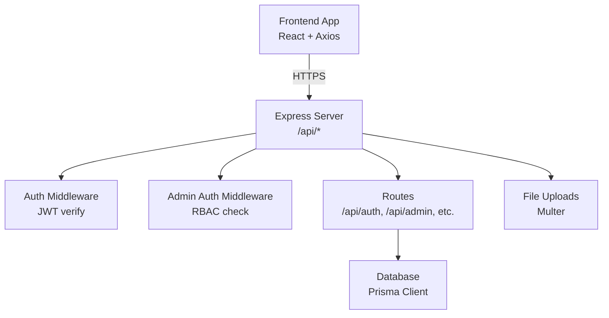
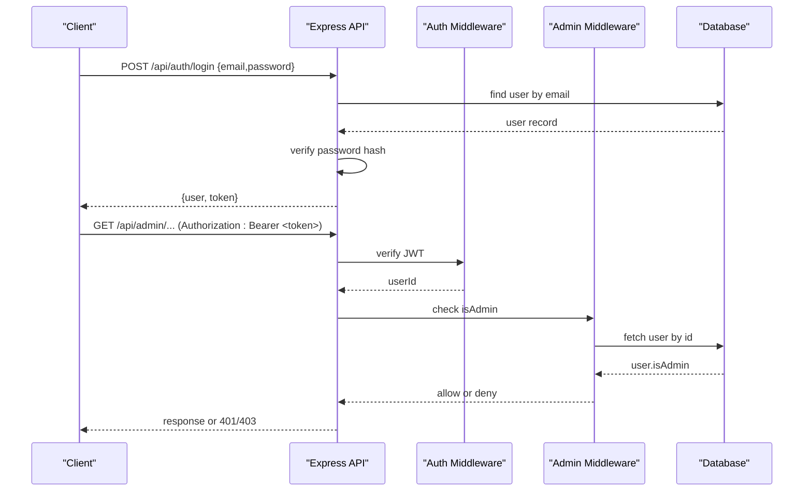
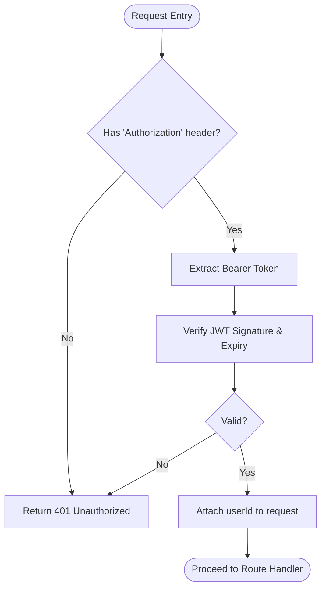
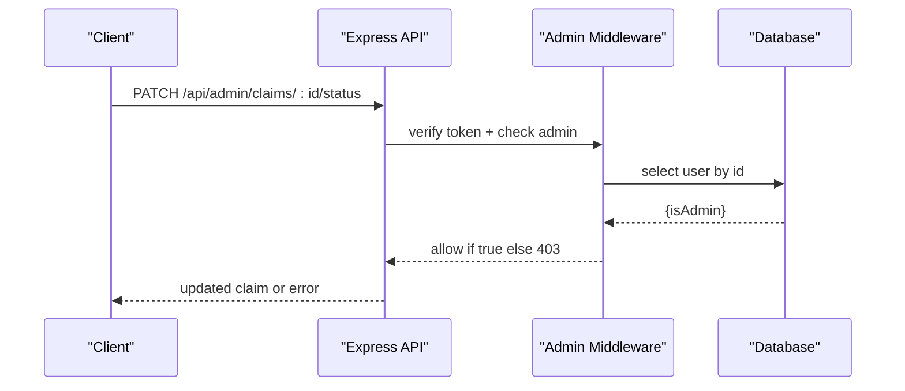
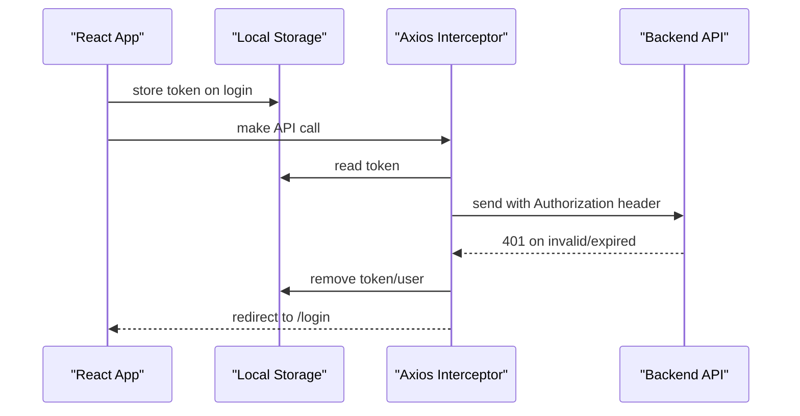
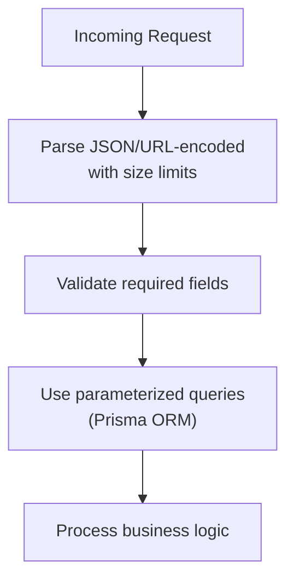
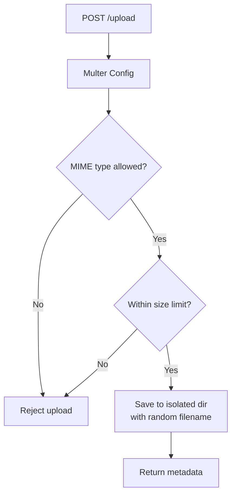
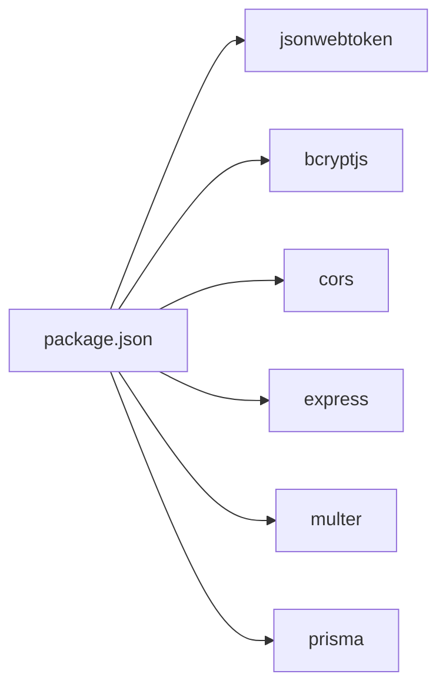

# Security Architecture

<cite>
**Referenced Files in This Document**
- [index.ts](file://backend/src/index.ts)
- [auth.ts](file://backend/src/middleware/auth.ts)
- [adminAuth.ts](file://backend/src/middleware/adminAuth.ts)
- [upload.ts](file://backend/src/middleware/upload.ts)
- [errorHandler.ts](file://backend/src/middleware/errorHandler.ts)
- [auth.ts](file://backend/src/routes/auth.ts)
- [admin.ts](file://backend/src/routes/admin.ts)
- [schema.prisma](file://backend/prisma/schema.prisma)
- [package.json](file://backend/package.json)
- [AuthContext.tsx](file://frontend/src/context/AuthContext.tsx)
- [ProtectedRoute.tsx](file://frontend/src/components/ProtectedRoute.tsx)
- [AdminProtectedRoute.tsx](file://frontend/src/components/AdminProtectedRoute.tsx)
- [api.ts](file://frontend/src/services/api.ts)
</cite>

## Table of Contents
1. Introduction
2. Project Structure
3. Core Components
4. Architecture Overview
5. Detailed Component Analysis
6. Dependency Analysis
7. Performance Considerations
8. Troubleshooting Guide
9. Conclusion
10. Appendices

## Introduction
This document describes the security architecture of the Smart Vehicle Insurance Claim System. It focuses on JWT-based authentication, role-based access control for users and administrators, secure session management, input validation and sanitization, protection against common web vulnerabilities (XSS, CSRF), file upload security, rate limiting strategies, API security best practices, data encryption and secure storage, audit logging, and security configuration guidelines with vulnerability mitigation strategies.

## Project Structure
The backend is an Express application that exposes REST APIs under /api. Authentication and authorization are implemented via middleware. File uploads are handled by a dedicated multer configuration. The frontend manages tokens in local storage and enforces route-level guards.

**Diagram sources**
- [index.ts:17-34](file://backend/src/index.ts#L17-L34)
- [auth.ts:5-22](file://backend/src/middleware/auth.ts#L5-L22)
- [adminAuth.ts:6-26](file://backend/src/middleware/adminAuth.ts#L6-L26)
- [upload.ts:17-53](file://backend/src/middleware/upload.ts#L17-L53)

**Section sources**
- [index.ts:17-34](file://backend/src/index.ts#L17-L34)
- [package.json:18-30](file://backend/package.json#L18-L30)

## Core Components
- JWT-based authentication:
  - Login and register endpoints issue short-lived JWTs signed with a secret from environment variables.
  - Protected routes validate the Authorization header and decode the token to attach user identity to requests.
- Role-based access control (RBAC):
  - Admin-only routes require both a valid token and an admin flag lookup in the database.
- Secure session management:
  - Stateless sessions using JWTs; tokens stored in browser local storage on the frontend and attached to requests via an interceptor.
- Input validation and sanitization:
  - Basic presence checks in request handlers; consider adopting schema validation libraries for robust enforcement.
- File upload security:
  - Multer configured with allowed MIME types and size limits; files stored in isolated subdirectories with randomized filenames.
- Error handling:
  - Centralized error handler returns generic messages for unexpected errors and typed status codes for known errors.

**Section sources**
- [auth.ts:11-59](file://backend/src/routes/auth.ts#L11-L59)
- [auth.ts:61-105](file://backend/src/routes/auth.ts#L61-L105)
- [auth.ts:107-165](file://backend/src/routes/auth.ts#L107-L165)
- [auth.ts:5-22](file://backend/src/middleware/auth.ts#L5-L22)
- [adminAuth.ts:6-26](file://backend/src/middleware/adminAuth.ts#L6-L26)
- [upload.ts:17-53](file://backend/src/middleware/upload.ts#L17-L53)
- [errorHandler.ts:13-27](file://backend/src/middleware/errorHandler.ts#L13-L27)

## Architecture Overview
The system uses stateless JWT authentication. Clients send credentials to login/register, receive a token, and include it in subsequent requests. Middleware validates tokens and enforces roles. Admin operations additionally verify the user’s admin status in the database.

**Diagram sources**
- [auth.ts:61-105](file://backend/src/routes/auth.ts#L61-L105)
- [auth.ts:5-22](file://backend/src/middleware/auth.ts#L5-L22)
- [adminAuth.ts:6-26](file://backend/src/middleware/adminAuth.ts#L6-L26)

## Detailed Component Analysis

### JWT Authentication Flow
- Registration and login create JWTs with a fixed expiration and sign them using a secret loaded from environment variables.
- Protected endpoints use middleware to extract and verify the token, attaching the decoded user ID to the request object.

**Diagram sources**
- [auth.ts:5-22](file://backend/src/middleware/auth.ts#L5-L22)
- [auth.ts:61-105](file://backend/src/routes/auth.ts#L61-L105)

**Section sources**
- [auth.ts:11-59](file://backend/src/routes/auth.ts#L11-L59)
- [auth.ts:61-105](file://backend/src/routes/auth.ts#L61-L105)
- [auth.ts:5-22](file://backend/src/middleware/auth.ts#L5-L22)

### Role-Based Access Control (RBAC) for Admin Routes
- Admin routes are protected by a middleware that verifies the JWT and then checks the user’s admin flag in the database. Non-admin users receive a 403 Forbidden.

**Diagram sources**
- [admin.ts:105-123](file://backend/src/routes/admin.ts#L105-L123)
- [adminAuth.ts:6-26](file://backend/src/middleware/adminAuth.ts#L6-L26)

**Section sources**
- [admin.ts:1-187](file://backend/src/routes/admin.ts#L1-L187)
- [adminAuth.ts:6-26](file://backend/src/middleware/adminAuth.ts#L6-L26)

### Secure Session Management (Frontend)
- Tokens are stored in local storage after successful login/register.
- An Axios interceptor automatically attaches the token to outgoing requests and clears local storage on 401 responses, redirecting to login.

**Diagram sources**
- [AuthContext.tsx:38-61](file://frontend/src/context/AuthContext.tsx#L38-L61)
- [api.ts:11-35](file://frontend/src/services/api.ts#L11-L35)

**Section sources**
- [AuthContext.tsx:17-66](file://frontend/src/context/AuthContext.tsx#L17-L66)
- [api.ts:1-35](file://frontend/src/services/api.ts#L1-35)

### Input Validation and Sanitization
- Request bodies are parsed with Express JSON and URL-encoded parsers with size limits.
- Handlers perform basic presence checks; consider adding schema validation for all inputs to prevent injection and malformed data.

**Diagram sources**
- [index.ts:17-23](file://backend/src/index.ts#L17-L23)
- [auth.ts:11-59](file://backend/src/routes/auth.ts#L11-L59)

**Section sources**
- [index.ts:17-23](file://backend/src/index.ts#L17-L23)
- [auth.ts:11-59](file://backend/src/routes/auth.ts#L11-L59)

### File Upload Security
- Multer restricts accepted MIME types to images and enforces a maximum file size.
- Files are saved in isolated directories with randomized names to avoid path traversal and overwrites.

**Diagram sources**
- [upload.ts:17-53](file://backend/src/middleware/upload.ts#L17-L53)

**Section sources**
- [upload.ts:17-53](file://backend/src/middleware/upload.ts#L17-L53)

### Protection Against Common Vulnerabilities
- XSS:
  - Backend does not render HTML; responses are JSON. Ensure frontend renders safely and avoids injecting untrusted content into DOM without escaping.
- CSRF:
  - State is carried via Authorization headers (Bearer tokens). For cookie-based sessions, implement CSRF tokens; currently not used here.
- Injection:
  - Database interactions use Prisma ORM, which parameterizes queries. Avoid string concatenation for SQL.
- Path Traversal:
  - Uploaded files are stored with UUID filenames in controlled directories. Do not serve arbitrary user-supplied paths.

[No sources needed since this section provides general guidance]

### Rate Limiting Strategies
- No explicit rate limiter is present. Add a middleware layer to throttle requests per IP or per user, especially on auth endpoints and file uploads.
- Consider global and endpoint-specific limits to mitigate brute-force and abuse.

[No sources needed since this section provides general guidance]

### API Security Best Practices
- Enforce HTTPS in production.
- Restrict CORS origins to trusted domains.
- Use minimal JWT payloads and short expirations; rotate secrets periodically.
- Log authentication events and failures for auditing.
- Return generic error messages to avoid leaking internals.

**Section sources**
- [index.ts:17-21](file://backend/src/index.ts#L17-L21)
- [errorHandler.ts:13-27](file://backend/src/middleware/errorHandler.ts#L13-L27)

### Data Encryption and Secure Storage
- Passwords are hashed before storage using bcrypt with a cost factor suitable for current hardware.
- Secrets (e.g., JWT signing key) are loaded from environment variables.
- Sensitive data should be encrypted at rest where applicable and accessed via least-privilege database credentials.

**Section sources**
- [auth.ts:26-27](file://backend/src/routes/auth.ts#L26-L27)
- [auth.ts:77-78](file://backend/src/routes/auth.ts#L77-L78)
- [auth.ts:48-52](file://backend/src/routes/auth.ts#L48-L52)
- [auth.ts:83-87](file://backend/src/routes/auth.ts#L83-L87)
- [schema.prisma:10-25](file://backend/prisma/schema.prisma#L10-L25)

### Audit Logging
- Implement structured logging for authentication attempts, authorization decisions, and sensitive operations (e.g., status changes, document approvals/rejections).
- Include timestamps, user IDs, IPs, and outcomes; protect logs from unauthorized access.

[No sources needed since this section provides general guidance]

## Dependency Analysis
Key dependencies relevant to security:
- jsonwebtoken: Used to sign and verify JWTs.
- bcryptjs: Used to hash passwords.
- cors: Configures cross-origin policy.
- express: HTTP server and middleware framework.
- multer: Handles multipart file uploads with filtering and limits.
- prisma: ORM for safe database queries.

**Diagram sources**
- [package.json:18-30](file://backend/package.json#L18-L30)

**Section sources**
- [package.json:18-30](file://backend/package.json#L18-L30)

## Performance Considerations
- Keep JWT payloads small to reduce overhead.
- Cache frequent reads where appropriate (e.g., admin stats) with short TTLs.
- Tune body parser limits to balance usability and memory usage.
- Offload heavy processing (AI services) to asynchronous jobs to keep API responsive.

[No sources needed since this section provides general guidance]

## Troubleshooting Guide
- 401 Unauthorized:
  - Missing or malformed Authorization header.
  - Invalid or expired JWT.
  - Frontend interceptor clears token on 401; re-login may be required.
- 403 Forbidden:
  - Non-admin user attempting admin operations.
- 400 Bad Request:
  - Missing required fields or invalid values in request bodies.
- Internal Server Error:
  - Unexpected exceptions; check server logs and ensure proper error handling.

**Section sources**
- [auth.ts:5-22](file://backend/src/middleware/auth.ts#L5-L22)
- [adminAuth.ts:6-26](file://backend/src/middleware/adminAuth.ts#L6-L26)
- [errorHandler.ts:13-27](file://backend/src/middleware/errorHandler.ts#L13-L27)
- [api.ts:26-35](file://frontend/src/services/api.ts#L26-L35)

## Conclusion
The system implements stateless JWT authentication with role-based access control for admin features. Input parsing and ORM usage help mitigate injection risks. File uploads are constrained by type and size. To strengthen security further, add rate limiting, comprehensive schema validation, structured audit logging, strict CORS policies, and regular secret rotation. Ensure HTTPS in production and follow least-privilege principles for all integrations.

## Appendices

### Security Configuration Guidelines
- Environment variables:
  - Set strong secrets for JWT signing and database connections.
  - Configure CORS_ORIGIN to the exact frontend origin(s).
  - Define UPLOAD_DIR to a non-public directory when possible; avoid serving uploads directly unless necessary.
- Network:
  - Enforce HTTPS termination at the reverse proxy or load balancer.
- Secrets management:
  - Use a secrets manager or vault in production; never hardcode secrets.
- Monitoring:
  - Enable centralized logging and alerting for auth failures and suspicious activity.

[No sources needed since this section provides general guidance]

### Vulnerability Mitigation Strategies
- Brute force protection: Add rate limiting and account lockout policies.
- XSS prevention: Sanitize outputs on the frontend; avoid innerHTML with untrusted data.
- CSRF: If switching to cookies for sessions, implement CSRF tokens.
- File uploads: Validate MIME types server-side, scan for malware, and store outside web root when feasible.
- Data exposure: Minimize returned fields; mask sensitive data in logs.

[No sources needed since this section provides general guidance]