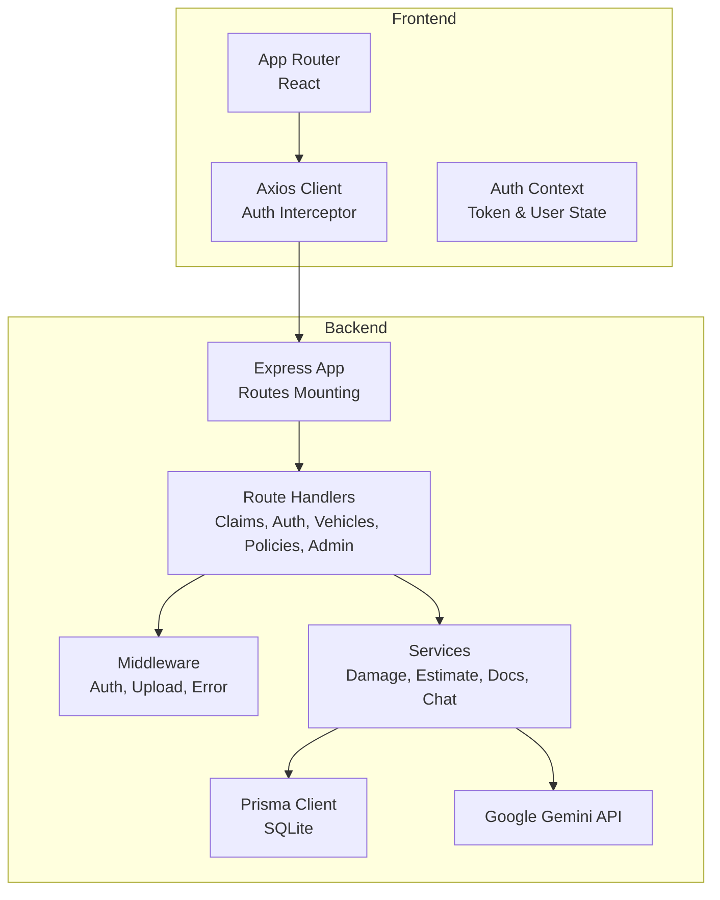
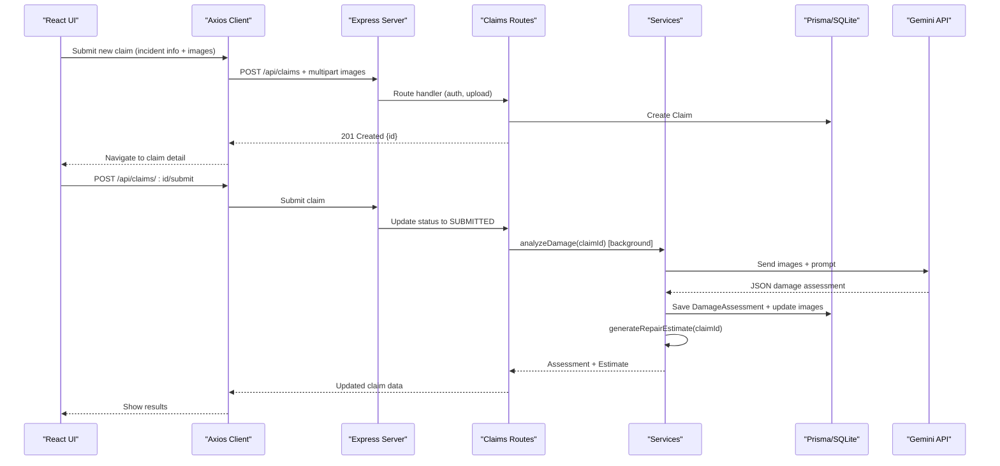
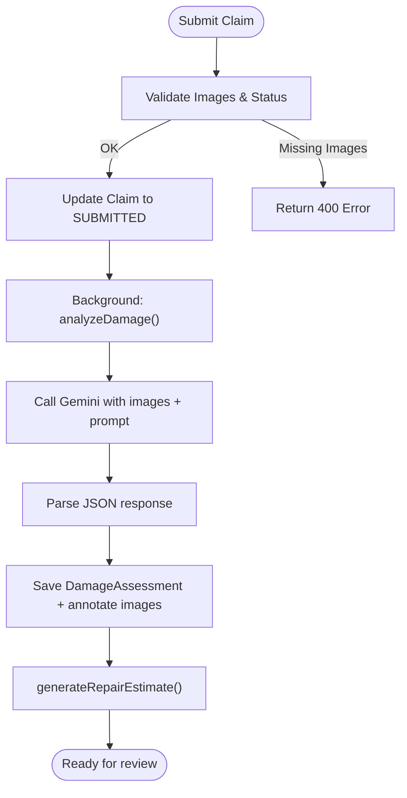
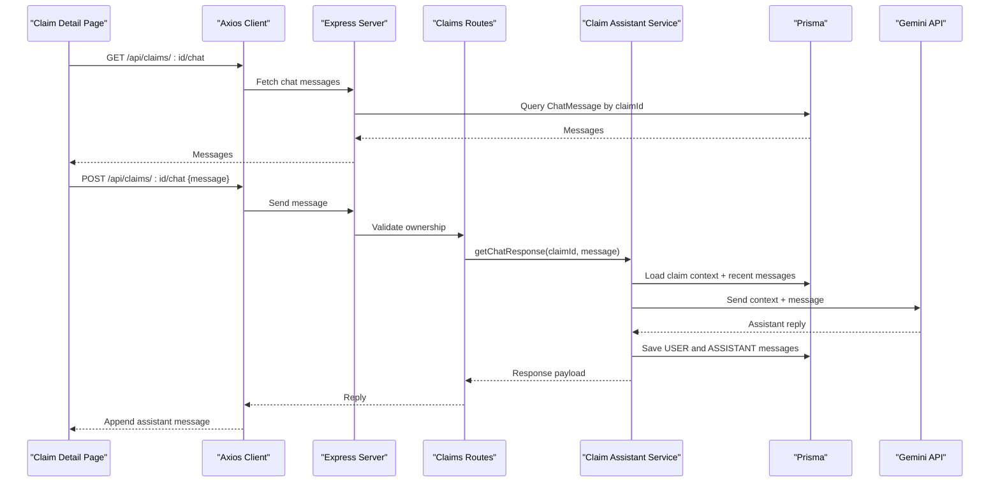
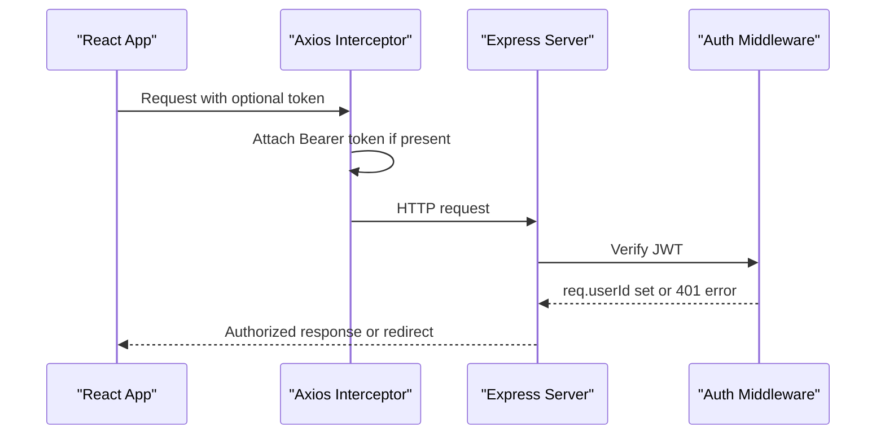
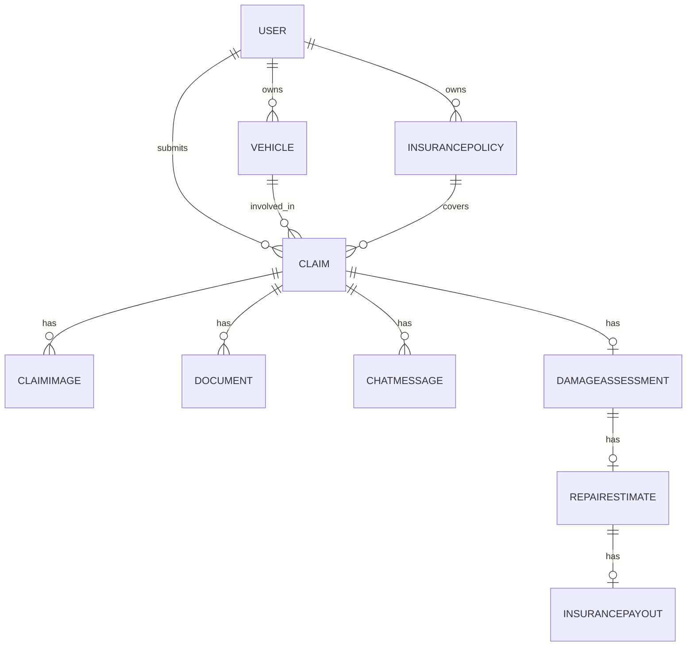
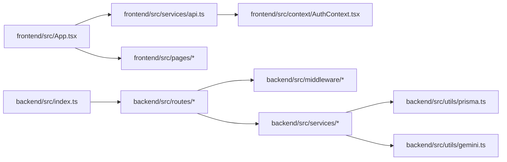

# System Design

<cite>
**Referenced Files in This Document**
- [backend/src/index.ts](file://backend/src/index.ts)
- [backend/prisma/schema.prisma](file://backend/prisma/schema.prisma)
- [backend/package.json](file://backend/package.json)
- [frontend/package.json](file://frontend/package.json)
- [frontend/src/App.tsx](file://frontend/src/App.tsx)
- [frontend/src/services/api.ts](file://frontend/src/services/api.ts)
- [frontend/src/context/AuthContext.tsx](file://frontend/src/context/AuthContext.tsx)
- [frontend/src/pages/NewClaimPage.tsx](file://frontend/src/pages/NewClaimPage.tsx)
- [backend/src/routes/claims.ts](file://backend/src/routes/claims.ts)
- [backend/src/middleware/auth.ts](file://backend/src/middleware/auth.ts)
- [backend/src/utils/gemini.ts](file://backend/src/utils/gemini.ts)
- [backend/src/services/damageAnalysisService.ts](file://backend/src/services/damageAnalysisService.ts)
- [backend/src/services/claimAssistantService.ts](file://backend/src/services/claimAssistantService.ts)
</cite>

## Table of Contents
1. Introduction
2. Project Structure
3. Core Components
4. Architecture Overview
5. Detailed Component Analysis
6. Dependency Analysis
7. Performance Considerations
8. Troubleshooting Guide
9. Conclusion

## Introduction
This document describes the system design of the Smart Vehicle Insurance Claim System, an MVC-style web application with a React frontend and an Express.js backend. It explains how user interactions flow through RESTful APIs to database operations and external AI services (Google Gemini), and documents architectural decisions around separation of concerns, security, and scalability.

## Project Structure
The project is split into two main parts:
- Frontend: A React + TypeScript application using Vite for development and build, with client-side routing, authentication context, and API integration via Axios.
- Backend: An Express.js server exposing REST endpoints under /api, with Prisma ORM over SQLite, JWT-based authentication, file uploads, and integrations with Google Gemini for damage analysis, repair estimates, and claim chat assistance.

**Diagram sources**
- [backend/src/index.ts:17-34](file://backend/src/index.ts#L17-L34)
- [frontend/src/App.tsx:23-49](file://frontend/src/App.tsx#L23-L49)
- [frontend/src/services/api.ts:1-35](file://frontend/src/services/api.ts#L1-L35)

**Section sources**
- [backend/src/index.ts:1-49](file://backend/src/index.ts#L1-L49)
- [frontend/src/App.tsx:1-56](file://frontend/src/App.tsx#L1-L56)
- [frontend/package.json:1-32](file://frontend/package.json#L1-L32)
- [backend/package.json:1-43](file://backend/package.json#L1-L43)

## Core Components
- Express server entrypoint mounts middleware and routes, serves static uploads, and exposes a health endpoint.
- Route handlers implement CRUD for claims, vehicles, policies, and admin features, enforcing ownership and status transitions.
- Services encapsulate business logic: damage analysis, repair estimate generation, document verification, and claim assistant chat.
- Prisma schema defines entities: User, Vehicle, InsurancePolicy, Claim, ClaimImage, DamageAssessment, RepairEstimate, InsurancePayout, Document, ChatMessage.
- Frontend uses React Router for navigation, Axios for HTTP calls, and a centralized AuthContext for token management and protected routes.

Key responsibilities:
- Separation of concerns: Routes handle HTTP, Services implement domain logic, Utils provide shared helpers (DB, Gemini).
- Security: JWT middleware validates requests; CORS configured for frontend origin.
- Extensibility: Service layer allows swapping or augmenting AI models and validation logic without changing routes.

**Section sources**
- [backend/src/index.ts:17-42](file://backend/src/index.ts#L17-L42)
- [backend/src/routes/claims.ts:20-447](file://backend/src/routes/claims.ts#L20-L447)
- [backend/src/middleware/auth.ts:5-22](file://backend/src/middleware/auth.ts#L5-L22)
- [backend/prisma/schema.prisma:10-201](file://backend/prisma/schema.prisma#L10-L201)
- [frontend/src/context/AuthContext.tsx:17-81](file://frontend/src/context/AuthContext.tsx#L17-L81)
- [frontend/src/services/api.ts:1-35](file://frontend/src/services/api.ts#L1-L35)

## Architecture Overview
The system follows an MVC pattern with a service layer abstraction:
- Controllers/Routes: Parse requests, validate inputs, enforce authorization, and delegate to services.
- Services: Orchestrate business workflows, interact with the database via Prisma, and call external AI services.
- Data Layer: Prisma provides type-safe queries against SQLite.
- External Integrations: Google Gemini powers image-based damage analysis, repair estimates, and conversational assistance.

**Diagram sources**
- [frontend/src/pages/NewClaimPage.tsx:62-88](file://frontend/src/pages/NewClaimPage.tsx#L62-L88)
- [backend/src/routes/claims.ts:20-193](file://backend/src/routes/claims.ts#L20-L193)
- [backend/src/services/damageAnalysisService.ts:50-152](file://backend/src/services/damageAnalysisService.ts#L50-L152)
- [backend/src/utils/gemini.ts:6-11](file://backend/src/utils/gemini.ts#L6-L11)

## Detailed Component Analysis

### Claims Workflow (Create, Submit, Analyze, Estimate)
- Creation: Validates required fields, ensures vehicle belongs to the authenticated user, creates a draft claim.
- Submission: Enforces minimum image requirement, updates status to SUBMITTED, triggers background AI analysis.
- Analysis: Reads uploaded images, sends them to Gemini with a structured prompt, parses JSON output, persists DamageAssessment, annotates images, and auto-generates a repair estimate.
- Estimate: Uses damage assessment to compute parts/labor costs and total cost.

**Diagram sources**
- [backend/src/routes/claims.ts:152-193](file://backend/src/routes/claims.ts#L152-L193)
- [backend/src/services/damageAnalysisService.ts:50-152](file://backend/src/services/damageAnalysisService.ts#L50-L152)

**Section sources**
- [backend/src/routes/claims.ts:20-193](file://backend/src/routes/claims.ts#L20-L193)
- [backend/src/services/damageAnalysisService.ts:1-154](file://backend/src/services/damageAnalysisService.ts#L1-L154)

### Chat Assistant (Claim Guidance)
- Loads claim context (vehicle, policy, damage assessment, estimate, payout, documents) and recent chat history.
- Sends context and user message to Gemini via a structured system prompt.
- Persists both user and assistant messages for continuity.

**Diagram sources**
- [backend/src/routes/claims.ts:399-447](file://backend/src/routes/claims.ts#L399-L447)
- [backend/src/services/claimAssistantService.ts:19-129](file://backend/src/services/claimAssistantService.ts#L19-L129)
- [backend/src/utils/gemini.ts:6-11](file://backend/src/utils/gemini.ts#L6-L11)

**Section sources**
- [backend/src/routes/claims.ts:399-447](file://backend/src/routes/claims.ts#L399-L447)
- [backend/src/services/claimAssistantService.ts:1-130](file://backend/src/services/claimAssistantService.ts#L1-L130)

### Authentication and Authorization
- Frontend stores JWT in localStorage and attaches it to every request via Axios interceptor; on 401, it clears state and redirects to login.
- Backend middleware verifies JWT, decodes userId, and attaches it to the request object for route handlers to enforce ownership and access control.

**Diagram sources**
- [frontend/src/services/api.ts:7-33](file://frontend/src/services/api.ts#L7-L33)
- [backend/src/middleware/auth.ts:5-22](file://backend/src/middleware/auth.ts#L5-L22)

**Section sources**
- [frontend/src/services/api.ts:1-35](file://frontend/src/services/api.ts#L1-L35)
- [frontend/src/context/AuthContext.tsx:17-81](file://frontend/src/context/AuthContext.tsx#L17-L81)
- [backend/src/middleware/auth.ts:1-23](file://backend/src/middleware/auth.ts#L1-L23)

### Data Model and Relationships
The Prisma schema defines core entities and relationships that support the claim lifecycle and AI-driven processing.

**Diagram sources**
- [backend/prisma/schema.prisma:10-201](file://backend/prisma/schema.prisma#L10-L201)

**Section sources**
- [backend/prisma/schema.prisma:1-202](file://backend/prisma/schema.prisma#L1-L202)

### Technology Stack Decisions
- Express.js: Lightweight, flexible server framework suitable for REST APIs and middleware composition.
- Prisma + SQLite: Type-safe database access with simple setup; appropriate for single-instance deployments and rapid iteration.
- JWT: Stateless authentication enabling scalable horizontal scaling behind a reverse proxy.
- Google Gemini: Multimodal model for image analysis and conversational assistance, integrated via SDK.
- React + Vite: Fast dev experience and modern tooling for building responsive UIs.

[No sources needed since this section provides general guidance]

## Dependency Analysis
High-level dependencies between modules and services:

**Diagram sources**
- [backend/src/index.ts:17-34](file://backend/src/index.ts#L17-L34)
- [backend/src/routes/claims.ts:1-15](file://backend/src/routes/claims.ts#L1-L15)
- [backend/src/services/damageAnalysisService.ts:1-5](file://backend/src/services/damageAnalysisService.ts#L1-L5)
- [backend/src/utils/gemini.ts:1-11](file://backend/src/utils/gemini.ts#L1-L11)
- [frontend/src/App.tsx:1-56](file://frontend/src/App.tsx#L1-L56)
- [frontend/src/services/api.ts:1-35](file://frontend/src/services/api.ts#L1-L35)
- [frontend/src/context/AuthContext.tsx:1-82](file://frontend/src/context/AuthContext.tsx#L1-L82)

**Section sources**
- [backend/src/index.ts:1-49](file://backend/src/index.ts#L1-L49)
- [backend/src/routes/claims.ts:1-450](file://backend/src/routes/claims.ts#L1-L450)
- [backend/src/services/damageAnalysisService.ts:1-154](file://backend/src/services/damageAnalysisService.ts#L1-L154)
- [backend/src/utils/gemini.ts:1-12](file://backend/src/utils/gemini.ts#L1-L12)
- [frontend/src/App.tsx:1-56](file://frontend/src/App.tsx#L1-L56)
- [frontend/src/services/api.ts:1-36](file://frontend/src/services/api.ts#L1-L36)
- [frontend/src/context/AuthContext.tsx:1-82](file://frontend/src/context/AuthContext.tsx#L1-L82)

## Performance Considerations
- Background processing: Damage analysis runs asynchronously after claim submission to avoid blocking the request cycle.
- Image handling: Multer handles multipart uploads; ensure size limits and storage strategy are tuned for production.
- Database: SQLite is efficient for low-to-moderate concurrency; consider migration to a relational database for scale.
- Caching: Introduce caching for frequent reads (e.g., claim lists) and AI responses where appropriate.
- Concurrency: Use connection pooling and rate limiting at the API layer when scaling horizontally.

[No sources needed since this section provides general guidance]

## Troubleshooting Guide
Common issues and mitigations:
- Authentication failures: Ensure JWT is present and valid; verify CORS settings and secret configuration.
- Missing images on submit: Enforce client-side checks; backend returns 400 if no images are attached.
- AI parsing errors: If Gemini response cannot be parsed, fallback to minimal assessment and log raw response for debugging.
- File deletion: When deleting images, ensure paths resolve correctly and files exist before unlinking.

**Section sources**
- [backend/src/middleware/auth.ts:5-22](file://backend/src/middleware/auth.ts#L5-L22)
- [backend/src/routes/claims.ts:152-193](file://backend/src/routes/claims.ts#L152-L193)
- [backend/src/routes/claims.ts:235-268](file://backend/src/routes/claims.ts#L235-L268)
- [backend/src/services/damageAnalysisService.ts:85-103](file://backend/src/services/damageAnalysisService.ts#L85-L103)

## Conclusion
The Smart Vehicle Insurance Claim System implements a clear MVC architecture with a robust service layer, secure authentication, and AI-powered capabilities via Google Gemini. The separation of concerns enables maintainability and extensibility, while the current stack supports rapid development and moderate-scale deployments. For production, consider database migration, caching, and enhanced monitoring to improve performance and reliability.