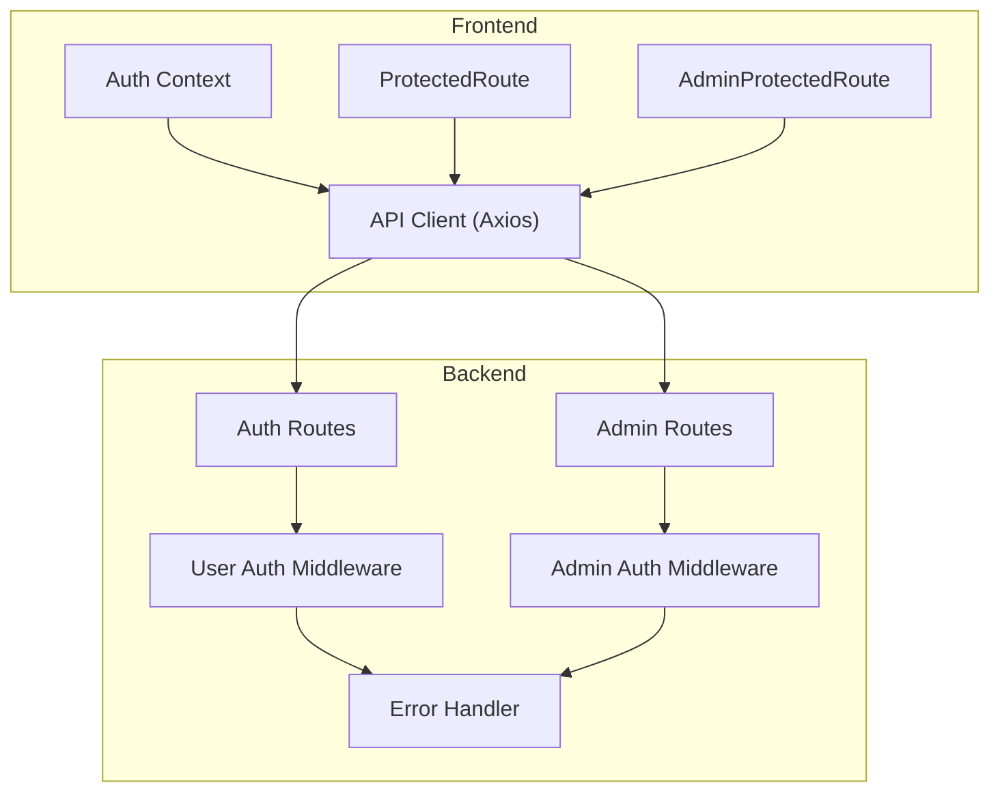
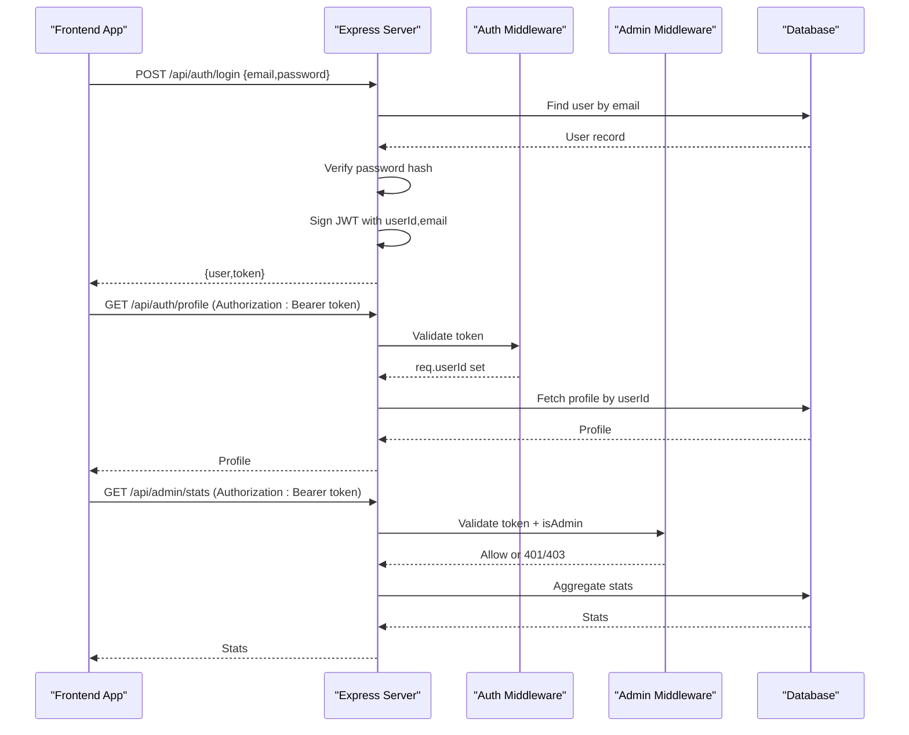
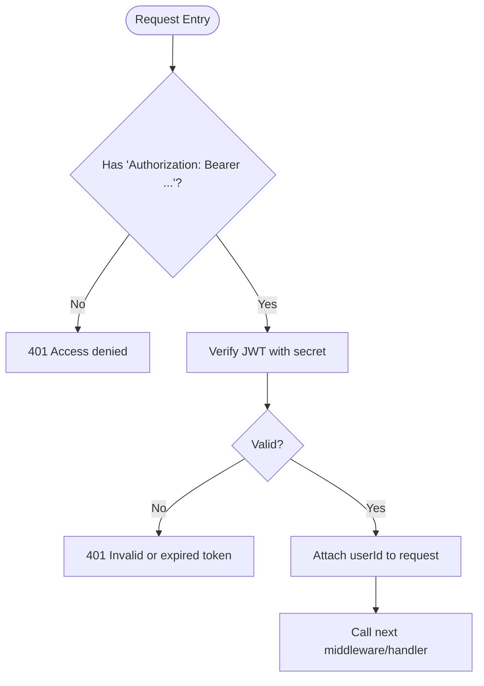
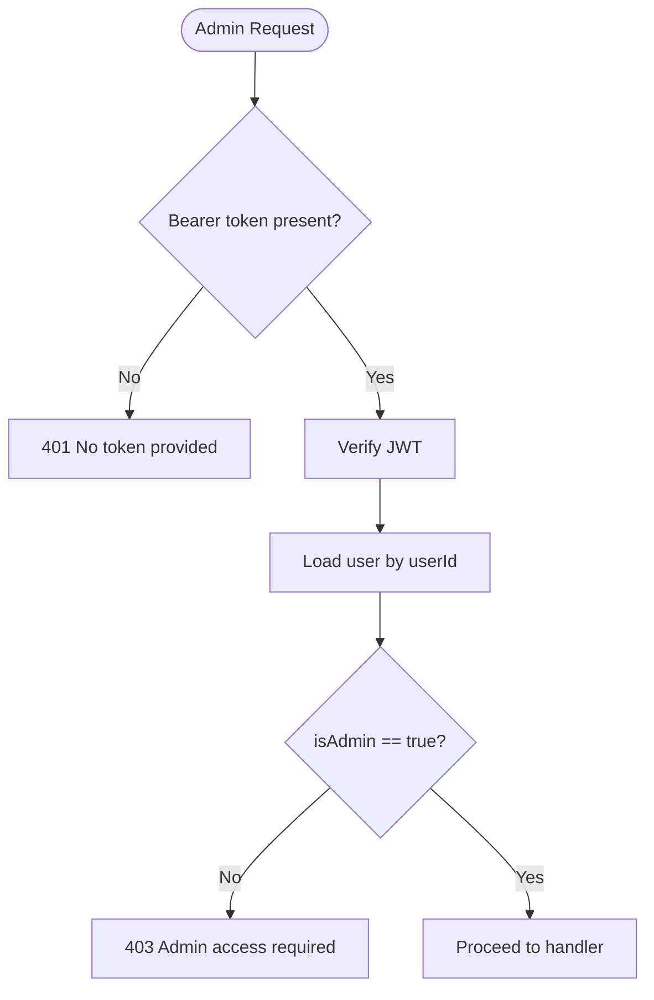
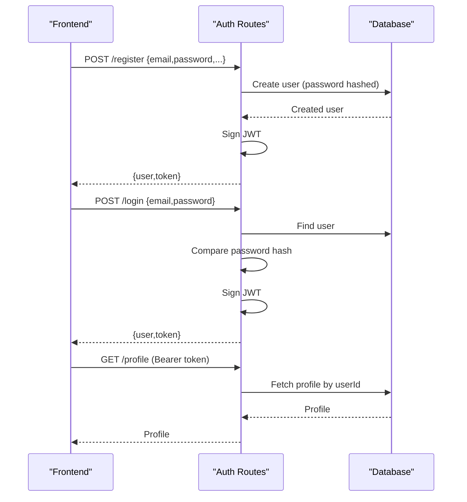
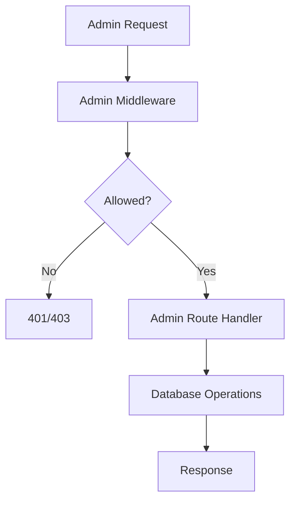
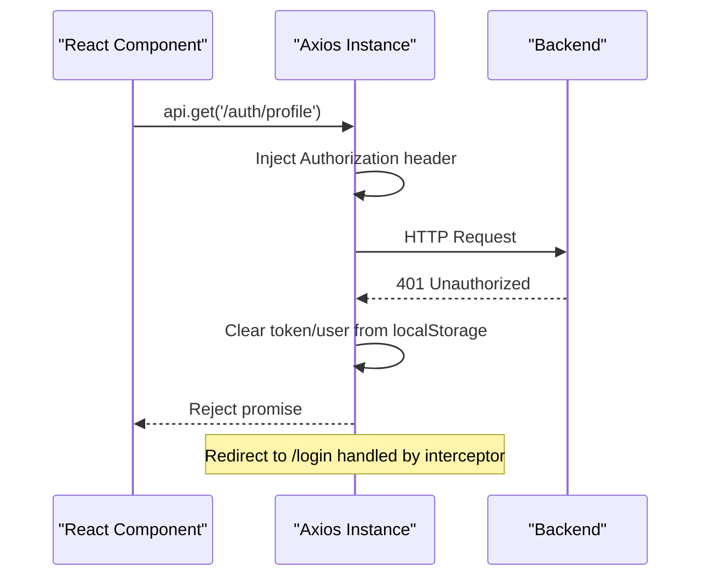
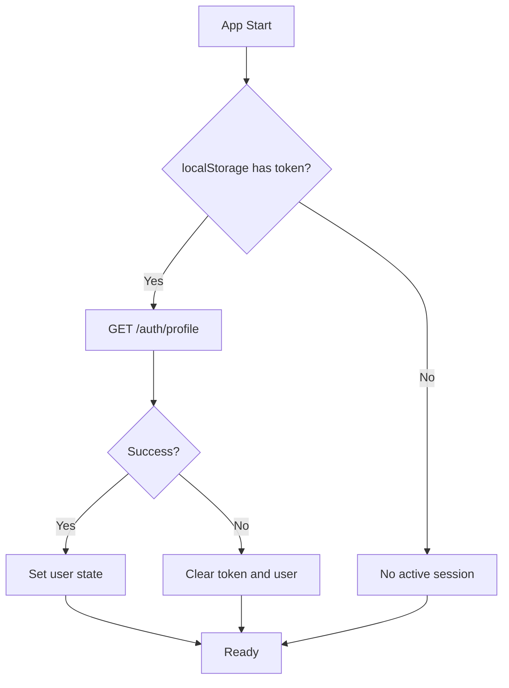
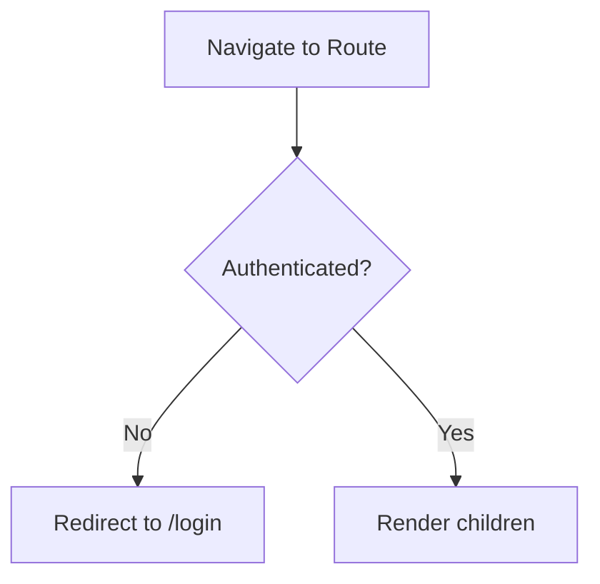
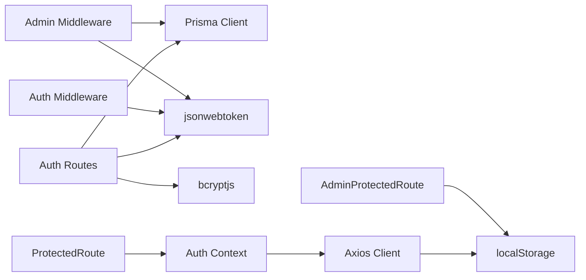

# Authentication & Authorization

<cite>
**Referenced Files in This Document**
- [auth.ts](file://backend/src/middleware/auth.ts)
- [adminAuth.ts](file://backend/src/middleware/adminAuth.ts)
- [errorHandler.ts](file://backend/src/middleware/errorHandler.ts)
- [auth_routes.ts](file://backend/src/routes/auth.ts)
- [admin_routes.ts](file://backend/src/routes/admin.ts)
- [types_index.ts](file://backend/src/types/index.ts)
- [api_client.ts](file://frontend/src/services/api.ts)
- [auth_context.tsx](file://frontend/src/context/AuthContext.tsx)
- [protected_route.tsx](file://frontend/src/components/ProtectedRoute.tsx)
- [admin_protected_route.tsx](file://frontend/src/components/AdminProtectedRoute.tsx)
- [login_page.tsx](file://frontend/src/pages/LoginPage.tsx)
- [register_page.tsx](file://frontend/src/pages/RegisterPage.tsx)
- [admin_login_page.tsx](file://frontend/src/pages/admin/AdminLoginPage.tsx)
</cite>

## Table of Contents
1. [Introduction](#introduction)
2. [Project Structure](#project-structure)
3. [Core Components](#core-components)
4. [Architecture Overview](#architecture-overview)
5. [Detailed Component Analysis](#detailed-component-analysis)
6. [Dependency Analysis](#dependency-analysis)
7. [Performance Considerations](#performance-considerations)
8. [Troubleshooting Guide](#troubleshooting-guide)
9. [Conclusion](#conclusion)
10. [Appendices](#appendices)

## Introduction
This document explains the authentication and authorization system for the Smart Vehicle Insurance Claim System. It covers JWT-based authentication, role-based access control (RBAC) for regular users and administrators, frontend session management, protected routes, password hashing, logout procedures, token expiration handling, error scenarios, and guidance for extending the authorization system with custom guards and new roles or permissions.

## Project Structure
The authentication and authorization logic is split between backend middleware and routes, and frontend context and route guards:
- Backend:
  - Middleware validates tokens and enforces admin-only access.
  - Routes implement registration, login, profile read/update, and admin endpoints.
  - Types define request extensions and JWT payload shapes.
- Frontend:
  - Axios client attaches tokens to requests and handles 401 responses.
  - Auth context manages user state, login/register/logout flows, and profile updates.
  - Route components protect user and admin areas based on stored tokens.

**Diagram sources**
- [auth_routes.ts:1-168](file://backend/src/routes/auth.ts#L1-L168)
- [admin_routes.ts:1-187](file://backend/src/routes/admin.ts#L1-L187)
- [auth.ts:1-23](file://backend/src/middleware/auth.ts#L1-L23)
- [adminAuth.ts:1-27](file://backend/src/middleware/adminAuth.ts#L1-L27)
- [errorHandler.ts:1-28](file://backend/src/middleware/errorHandler.ts#L1-L28)
- [api_client.ts:1-36](file://frontend/src/services/api.ts#L1-L36)
- [auth_context.tsx:1-82](file://frontend/src/context/AuthContext.tsx#L1-L82)
- [protected_route.tsx:1-21](file://frontend/src/components/ProtectedRoute.tsx#L1-L21)
- [admin_protected_route.tsx:1-8](file://frontend/src/components/AdminProtectedRoute.tsx#L1-L8)

**Section sources**
- [auth_routes.ts:1-168](file://backend/src/routes/auth.ts#L1-L168)
- [admin_routes.ts:1-187](file://backend/src/routes/admin.ts#L1-L187)
- [auth.ts:1-23](file://backend/src/middleware/auth.ts#L1-L23)
- [adminAuth.ts:1-27](file://backend/src/middleware/adminAuth.ts#L1-L27)
- [errorHandler.ts:1-28](file://backend/src/middleware/errorHandler.ts#L1-L28)
- [api_client.ts:1-36](file://frontend/src/services/api.ts#L1-L36)
- [auth_context.tsx:1-82](file://frontend/src/context/AuthContext.tsx#L1-L82)
- [protected_route.tsx:1-21](file://frontend/src/components/ProtectedRoute.tsx#L1-L21)
- [admin_protected_route.tsx:1-8](file://frontend/src/components/AdminProtectedRoute.tsx#L1-L8)

## Core Components
- JWT Token Generation and Validation
  - Tokens are generated upon successful registration and login with a fixed expiration window.
  - Middleware verifies tokens using a secret from environment variables and attaches the user ID to the request.
- Role-Based Access Control
  - Regular user endpoints require a valid token via the user auth middleware.
  - Admin endpoints additionally verify that the authenticated user has admin privileges.
- Frontend Session Management
  - The API client automatically attaches the token to outgoing requests and clears local storage on 401 errors.
  - The auth context persists tokens and user data in local storage and initializes sessions on app load.
- Password Hashing
  - Passwords are hashed server-side before storage using a secure hashing library with an appropriate cost factor.
- Logout and Token Expiration Handling
  - Logout clears local storage and resets UI state.
  - Expired or invalid tokens result in 401 responses; the client redirects to login and clears persisted credentials.

**Section sources**
- [auth_routes.ts:10-105](file://backend/src/routes/auth.ts#L10-L105)
- [auth.ts:5-22](file://backend/src/middleware/auth.ts#L5-L22)
- [adminAuth.ts:6-26](file://backend/src/middleware/adminAuth.ts#L6-L26)
- [api_client.ts:7-33](file://frontend/src/services/api.ts#L7-L33)
- [auth_context.tsx:17-66](file://frontend/src/context/AuthContext.tsx#L17-L66)

## Architecture Overview
The system uses a standard JWT flow:
- Registration and Login produce signed tokens.
- Protected routes validate tokens server-side.
- Admin routes enforce additional role checks.
- Frontend stores tokens and injects them into requests; it handles unauthorized responses by clearing state and redirecting.

**Diagram sources**
- [auth_routes.ts:61-105](file://backend/src/routes/auth.ts#L61-L105)
- [auth_routes.ts:107-134](file://backend/src/routes/auth.ts#L107-L134)
- [admin_routes.ts:11-26](file://backend/src/routes/admin.ts#L11-L26)
- [auth.ts:5-22](file://backend/src/middleware/auth.ts#L5-L22)
- [adminAuth.ts:6-26](file://backend/src/middleware/adminAuth.ts#L6-L26)

## Detailed Component Analysis

### Backend Authentication Middleware
- Extracts and validates the Authorization header.
- Verifies the JWT signature and sets req.userId for downstream handlers.
- Returns 401 for missing or invalid tokens.

**Diagram sources**
- [auth.ts:5-22](file://backend/src/middleware/auth.ts#L5-L22)

**Section sources**
- [auth.ts:5-22](file://backend/src/middleware/auth.ts#L5-L22)

### Backend Admin Authorization Middleware
- Validates the token similarly to user middleware.
- Loads the user from the database and ensures the isAdmin flag is true.
- Returns 403 if not authorized, otherwise proceeds.

**Diagram sources**
- [adminAuth.ts:6-26](file://backend/src/middleware/adminAuth.ts#L6-L26)

**Section sources**
- [adminAuth.ts:6-26](file://backend/src/middleware/adminAuth.ts#L6-L26)

### Authentication Routes (Register, Login, Profile)
- Register:
  - Validates input, checks for existing email, hashes password, creates user, signs JWT, returns user and token.
- Login:
  - Validates input, finds user, compares password hash, signs JWT, returns user and token.
- Profile:
  - Requires authentication; returns or updates the current user’s profile.

**Diagram sources**
- [auth_routes.ts:10-59](file://backend/src/routes/auth.ts#L10-L59)
- [auth_routes.ts:61-105](file://backend/src/routes/auth.ts#L61-L105)
- [auth_routes.ts:107-165](file://backend/src/routes/auth.ts#L107-L165)

**Section sources**
- [auth_routes.ts:10-165](file://backend/src/routes/auth.ts#L10-L165)

### Admin Routes
- All admin routes are guarded by the admin middleware at the router level.
- Endpoints provide statistics, list users, manage claims, and handle document verification approvals/rejections.

**Diagram sources**
- [admin_routes.ts:1-187](file://backend/src/routes/admin.ts#L1-L187)
- [adminAuth.ts:6-26](file://backend/src/middleware/adminAuth.ts#L6-L26)

**Section sources**
- [admin_routes.ts:1-187](file://backend/src/routes/admin.ts#L1-L187)

### Frontend API Client
- Automatically attaches the token from local storage to every request.
- On 401 responses, clears local storage and redirects to login.

**Diagram sources**
- [api_client.ts:7-33](file://frontend/src/services/api.ts#L7-L33)

**Section sources**
- [api_client.ts:7-33](file://frontend/src/services/api.ts#L7-L33)

### Frontend Auth Context
- Initializes session by validating token against /auth/profile on mount.
- Provides login, register, logout, and updateProfile methods.
- Persists token and user data in local storage.

**Diagram sources**
- [auth_context.tsx:17-36](file://frontend/src/context/AuthContext.tsx#L17-L36)
- [auth_context.tsx:38-66](file://frontend/src/context/AuthContext.tsx#L38-L66)

**Section sources**
- [auth_context.tsx:17-66](file://frontend/src/context/AuthContext.tsx#L17-L66)

### Frontend Protected Routes
- ProtectedRoute:
  - Renders a loading indicator while initializing auth state.
  - Redirects unauthenticated users to login.
- AdminProtectedRoute:
  - Checks for an admin-specific token and redirects to admin login if missing.

**Diagram sources**
- [protected_route.tsx:1-21](file://frontend/src/components/ProtectedRoute.tsx#L1-L21)
- [admin_protected_route.tsx:1-8](file://frontend/src/components/AdminProtectedRoute.tsx#L1-L8)

**Section sources**
- [protected_route.tsx:1-21](file://frontend/src/components/ProtectedRoute.tsx#L1-L21)
- [admin_protected_route.tsx:1-8](file://frontend/src/components/AdminProtectedRoute.tsx#L1-L8)

### Error Handling
- Centralized error handler converts application errors to consistent JSON responses.
- Authentication middleware returns specific 401 messages for missing or invalid tokens.
- Admin middleware returns 403 when non-admin users attempt admin actions.

**Section sources**
- [errorHandler.ts:1-28](file://backend/src/middleware/errorHandler.ts#L1-L28)
- [auth.ts:5-22](file://backend/src/middleware/auth.ts#L5-L22)
- [adminAuth.ts:6-26](file://backend/src/middleware/adminAuth.ts#L6-L26)

## Dependency Analysis
- Backend dependencies:
  - Express routes depend on Prisma for data access.
  - Middleware depends on jsonwebtoken for token verification.
  - Types extend Express Request to include userId.
- Frontend dependencies:
  - Axios interceptors attach tokens and handle 401 globally.
  - React Router components guard routes based on local storage tokens.

**Diagram sources**
- [auth_routes.ts:1-168](file://backend/src/routes/auth.ts#L1-L168)
- [admin_routes.ts:1-187](file://backend/src/routes/admin.ts#L1-L187)
- [auth.ts:1-23](file://backend/src/middleware/auth.ts#L1-L23)
- [adminAuth.ts:1-27](file://backend/src/middleware/adminAuth.ts#L1-L27)
- [api_client.ts:1-36](file://frontend/src/services/api.ts#L1-L36)
- [auth_context.tsx:1-82](file://frontend/src/context/AuthContext.tsx#L1-L82)
- [protected_route.tsx:1-21](file://frontend/src/components/ProtectedRoute.tsx#L1-L21)
- [admin_protected_route.tsx:1-8](file://frontend/src/components/AdminProtectedRoute.tsx#L1-L8)

**Section sources**
- [auth_routes.ts:1-168](file://backend/src/routes/auth.ts#L1-L168)
- [admin_routes.ts:1-187](file://backend/src/routes/admin.ts#L1-L187)
- [auth.ts:1-23](file://backend/src/middleware/auth.ts#L1-L23)
- [adminAuth.ts:1-27](file://backend/src/middleware/adminAuth.ts#L1-L27)
- [api_client.ts:1-36](file://frontend/src/services/api.ts#L1-L36)
- [auth_context.tsx:1-82](file://frontend/src/context/AuthContext.tsx#L1-L82)
- [protected_route.tsx:1-21](file://frontend/src/components/ProtectedRoute.tsx#L1-L21)
- [admin_protected_route.tsx:1-8](file://frontend/src/components/AdminProtectedRoute.tsx#L1-L8)

## Performance Considerations
- Token verification is lightweight but should be used judiciously; avoid unnecessary re-validation on every request beyond middleware.
- Database queries in admin routes aggregate multiple counts; consider caching frequently accessed stats if traffic increases.
- Password hashing cost is set to a safe default; monitor CPU usage during peak registration periods.
- Frontend local storage operations are synchronous and fast; ensure minimal reads/writes during critical paths.

[No sources needed since this section provides general guidance]

## Troubleshooting Guide
Common issues and resolutions:
- Missing or malformed Authorization header:
  - Ensure the frontend includes Authorization: Bearer <token> on all protected requests.
  - Confirm the API client attaches the token automatically.
- Invalid or expired token:
  - The backend returns 401; the frontend clears local storage and redirects to login.
  - Re-authenticate via login or register flows to obtain a new token.
- Admin access denied:
  - Non-admin users receive 403 on admin endpoints; verify the user’s isAdmin flag in the database.
- Profile fetch failures:
  - If profile retrieval fails after token validation, check network connectivity and server logs.

**Section sources**
- [auth.ts:5-22](file://backend/src/middleware/auth.ts#L5-L22)
- [adminAuth.ts:6-26](file://backend/src/middleware/adminAuth.ts#L6-L26)
- [api_client.ts:22-33](file://frontend/src/services/api.ts#L22-L33)
- [auth_context.tsx:22-36](file://frontend/src/context/AuthContext.tsx#L22-L36)

## Conclusion
The system implements a robust JWT-based authentication flow with clear separation between user and admin authorization. Passwords are securely hashed, tokens are validated server-side, and the frontend manages sessions with automatic token injection and centralized 401 handling. The architecture supports extension through additional middleware and route guards for new roles or permissions.

[No sources needed since this section summarizes without analyzing specific files]

## Appendices

### Extending Authorization for New Roles or Permissions
- Add a new role field to the user model and update database schema accordingly.
- Create a new middleware similar to adminAuthMiddleware that checks the new role.
- Apply the middleware to relevant routes or nest routers under a role-specific prefix.
- Implement corresponding frontend guards that check for the new role in local storage or user context.

[No sources needed since this section provides conceptual guidance]

### Custom Authentication Guards Example
- Backend:
  - Define a middleware that inspects req.user.role and permits or denies access based on policy.
  - Use it alongside existing auth middleware to enforce fine-grained permissions.
- Frontend:
  - Build a component wrapper that checks the current user’s role and renders or redirects accordingly.
  - Integrate with React Router to protect feature-specific pages.

[No sources needed since this section provides conceptual guidance]