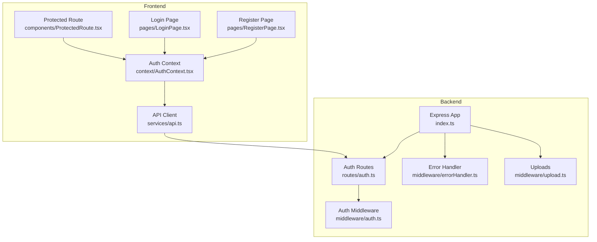
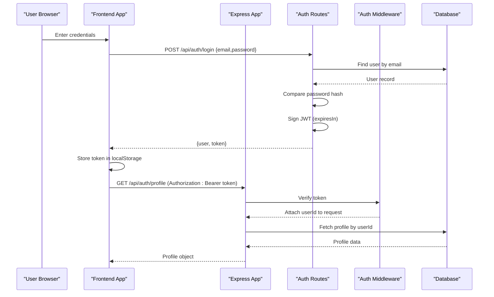
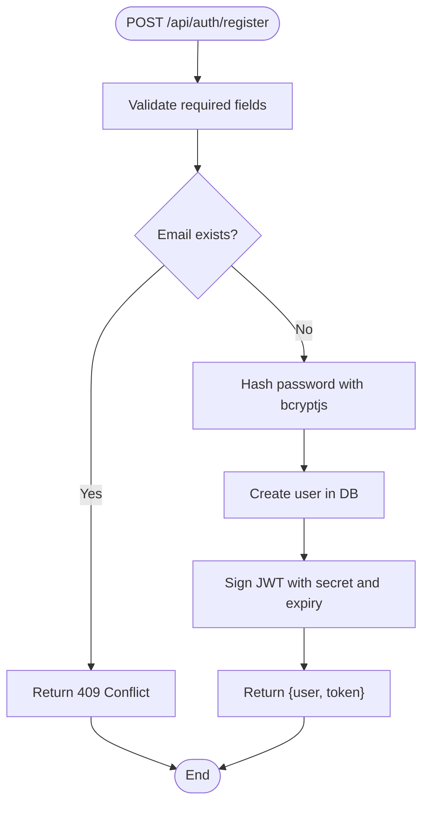
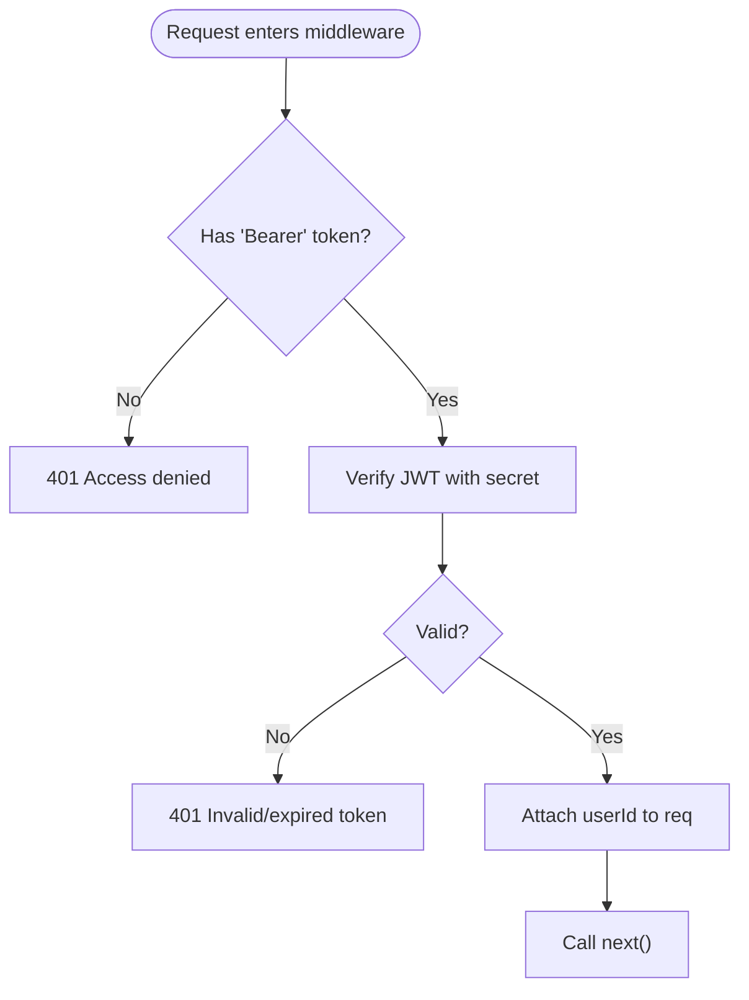
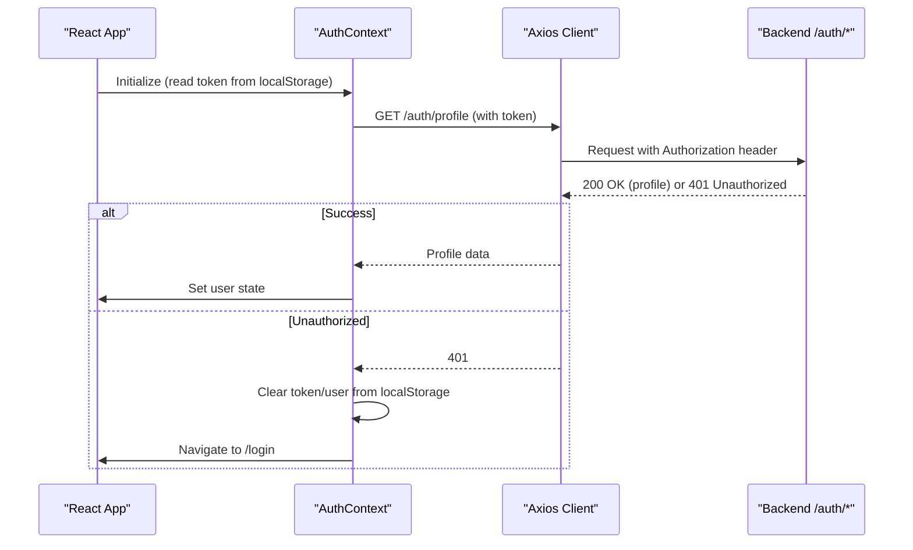
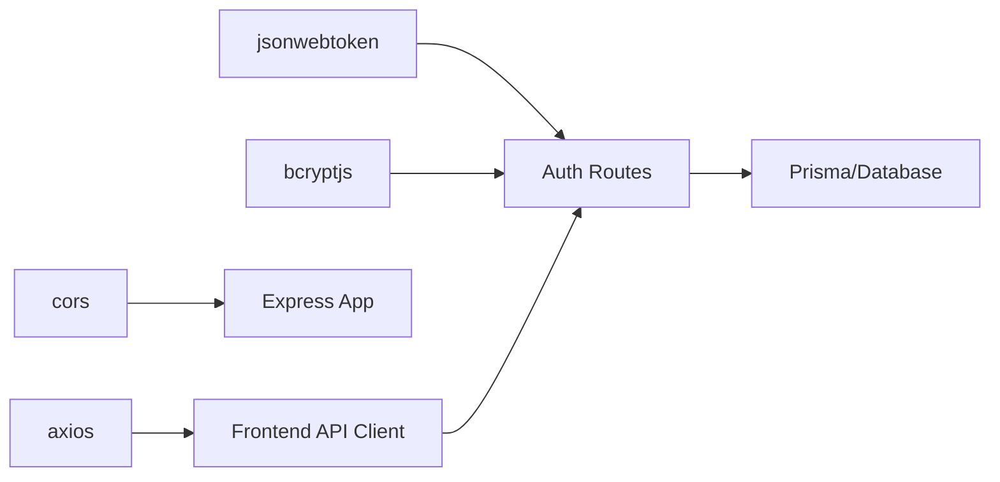

# Authentication & Security

<cite>
**Referenced Files in This Document**
- [backend/src/index.ts](file://backend/src/index.ts)
- [backend/src/middleware/auth.ts](file://backend/src/middleware/auth.ts)
- [backend/src/middleware/errorHandler.ts](file://backend/src/middleware/errorHandler.ts)
- [backend/src/middleware/upload.ts](file://backend/src/middleware/upload.ts)
- [backend/src/routes/auth.ts](file://backend/src/routes/auth.ts)
- [backend/src/types/index.ts](file://backend/src/types/index.ts)
- [frontend/src/context/AuthContext.tsx](file://frontend/src/context/AuthContext.tsx)
- [frontend/src/components/ProtectedRoute.tsx](file://frontend/src/components/ProtectedRoute.tsx)
- [frontend/src/services/api.ts](file://frontend/src/services/api.ts)
- [frontend/src/pages/LoginPage.tsx](file://frontend/src/pages/LoginPage.tsx)
- [frontend/src/pages/RegisterPage.tsx](file://frontend/src/pages/RegisterPage.tsx)
- [frontend/src/types/index.ts](file://frontend/src/types/index.ts)
</cite>

## Table of Contents
1. [Introduction](#introduction)
2. [Project Structure](#project-structure)
3. [Core Components](#core-components)
4. [Architecture Overview](#architecture-overview)
5. [Detailed Component Analysis](#detailed-component-analysis)
6. [Dependency Analysis](#dependency-analysis)
7. [Performance Considerations](#performance-considerations)
8. [Troubleshooting Guide](#troubleshooting-guide)
9. [Conclusion](#conclusion)
10. [Appendices](#appendices)

## Introduction
This document explains the authentication and security implementation for the Smart Vehicle Insurance Claim System. It covers JWT-based authentication (token generation, validation), user registration and login with password hashing using bcryptjs, protected routes on both frontend and backend, CORS configuration, error handling, session management via token storage, and production security considerations. Where applicable, it also outlines patterns for custom guards and role-based access control.

## Project Structure
The system is split into a Node/Express backend and a React frontend:
- Backend: Express app with middleware for CORS, JSON parsing, static uploads, and route modules for auth and domain features.
- Frontend: React application with an authentication context, API client interceptors, and protected route components.

**Diagram sources**
- [backend/src/index.ts:1-47](file://backend/src/index.ts#L1-L47)
- [backend/src/routes/auth.ts:1-166](file://backend/src/routes/auth.ts#L1-L166)
- [backend/src/middleware/auth.ts:1-23](file://backend/src/middleware/auth.ts#L1-L23)
- [backend/src/middleware/errorHandler.ts:1-28](file://backend/src/middleware/errorHandler.ts#L1-L28)
- [backend/src/middleware/upload.ts:1-53](file://backend/src/middleware/upload.ts#L1-L53)
- [frontend/src/services/api.ts:1-33](file://frontend/src/services/api.ts#L1-L33)
- [frontend/src/context/AuthContext.tsx:1-82](file://frontend/src/context/AuthContext.tsx#L1-L82)
- [frontend/src/components/ProtectedRoute.tsx:1-21](file://frontend/src/components/ProtectedRoute.tsx#L1-L21)
- [frontend/src/pages/LoginPage.tsx:1-95](file://frontend/src/pages/LoginPage.tsx#L1-L95)
- [frontend/src/pages/RegisterPage.tsx:1-102](file://frontend/src/pages/RegisterPage.tsx#L1-L102)

**Section sources**
- [backend/src/index.ts:1-47](file://backend/src/index.ts#L1-L47)
- [frontend/src/services/api.ts:1-33](file://frontend/src/services/api.ts#L1-L33)

## Core Components
- JWT-based authentication:
  - Token generation on register/login with expiration.
  - Token verification in a reusable middleware that attaches user identity to requests.
- Password hashing:
  - Registration hashes passwords before storing them.
  - Login compares provided password against stored hash.
- Protected routes:
  - Backend: middleware protects sensitive endpoints.
  - Frontend: component guards prevent unauthenticated navigation; API client injects tokens and handles 401 by clearing state and redirecting.
- CORS and request parsing:
  - CORS configured with credentials support and origin from environment.
  - JSON body parser with size limit.
- Error handling:
  - Centralized error handler returns structured errors.
  - Auth flows return consistent error responses.

**Section sources**
- [backend/src/routes/auth.ts:10-104](file://backend/src/routes/auth.ts#L10-L104)
- [backend/src/middleware/auth.ts:5-22](file://backend/src/middleware/auth.ts#L5-L22)
- [backend/src/middleware/errorHandler.ts:13-27](file://backend/src/middleware/errorHandler.ts#L13-L27)
- [backend/src/index.ts:16-22](file://backend/src/index.ts#L16-L22)
- [frontend/src/components/ProtectedRoute.tsx:4-19](file://frontend/src/components/ProtectedRoute.tsx#L4-L19)
- [frontend/src/services/api.ts:10-30](file://frontend/src/services/api.ts#L10-L30)

## Architecture Overview
End-to-end flow for authentication and protected access:

**Diagram sources**
- [backend/src/routes/auth.ts:61-104](file://backend/src/routes/auth.ts#L61-L104)
- [backend/src/middleware/auth.ts:5-22](file://backend/src/middleware/auth.ts#L5-L22)
- [frontend/src/context/AuthContext.tsx:22-45](file://frontend/src/context/AuthContext.tsx#L22-L45)
- [frontend/src/services/api.ts:10-17](file://frontend/src/services/api.ts#L10-L17)

## Detailed Component Analysis

### Backend Authentication Flow
- Registration:
  - Validates required fields.
  - Checks for existing email.
  - Hashes password with bcryptjs.
  - Creates user and signs JWT with expiration.
  - Returns user payload and token.
- Login:
  - Validates presence of email and password.
  - Retrieves user by email.
  - Compares password with stored hash.
  - Signs JWT and returns user payload plus token.
- Profile endpoints:
  - Protected by auth middleware.
  - Reads userId from request and fetches profile.

**Diagram sources**
- [backend/src/routes/auth.ts:10-59](file://backend/src/routes/auth.ts#L10-L59)

**Section sources**
- [backend/src/routes/auth.ts:10-104](file://backend/src/routes/auth.ts#L10-L104)

### JWT Validation Middleware
- Extracts Authorization header and ensures Bearer scheme.
- Verifies token using the configured secret.
- Attaches userId to the request for downstream handlers.
- Returns 401 for missing or invalid/expired tokens.

**Diagram sources**
- [backend/src/middleware/auth.ts:5-22](file://backend/src/middleware/auth.ts#L5-L22)

**Section sources**
- [backend/src/middleware/auth.ts:1-23](file://backend/src/middleware/auth.ts#L1-L23)

### Frontend Authentication State and Guards
- AuthContext:
  - Initializes state from localStorage token.
  - On mount, validates token by fetching profile; clears state on failure.
  - Provides login/register/logout/updateProfile methods.
  - Persists token and user info to localStorage on success.
- ProtectedRoute:
  - Renders loading spinner while checking auth state.
  - Redirects to login if no authenticated user.
  - Renders children when authenticated.
- API client:
  - Interceptor adds Authorization header with token if present.
  - On 401, clears local storage and redirects to login.

**Diagram sources**
- [frontend/src/context/AuthContext.tsx:17-66](file://frontend/src/context/AuthContext.tsx#L17-L66)
- [frontend/src/services/api.ts:10-30](file://frontend/src/services/api.ts#L10-L30)
- [frontend/src/components/ProtectedRoute.tsx:4-19](file://frontend/src/components/ProtectedRoute.tsx#L4-L19)

**Section sources**
- [frontend/src/context/AuthContext.tsx:1-82](file://frontend/src/context/AuthContext.tsx#L1-L82)
- [frontend/src/components/ProtectedRoute.tsx:1-21](file://frontend/src/components/ProtectedRoute.tsx#L1-L21)
- [frontend/src/services/api.ts:1-33](file://frontend/src/services/api.ts#L1-L33)

### Input Validation and Sanitization
- Current state:
  - Basic presence checks are performed in auth routes.
  - No Zod schema validation is currently used in the codebase.
- Recommendation:
  - Introduce Zod schemas for registration and login payloads to enforce types, formats, and constraints server-side.
  - Apply similar validation to other routes to ensure input integrity.

[No sources needed since this section provides general guidance]

### CORS Configuration and Secure Headers
- CORS:
  - Configured with credentials enabled and origin sourced from environment variable.
  - Defaults to a development origin when not set.
- Secure headers:
  - Not explicitly configured in the current setup.
  - Consider adding Helmet or equivalent to set security headers such as Content-Security-Policy, X-Frame-Options, Strict-Transport-Security, etc., in production.

**Section sources**
- [backend/src/index.ts:16-22](file://backend/src/index.ts#L16-L22)

### Session Management and Token Storage
- Strategy:
  - Stateless JWTs signed with a secret and short expiration.
  - Tokens stored in browser localStorage.
  - On 401 responses, client clears stored tokens and redirects to login.
- Considerations:
  - For enhanced security, consider httpOnly cookies for tokens and sameSite configuration.
  - Implement refresh token flow to minimize re-authentication and reduce exposure of long-lived tokens.

**Section sources**
- [frontend/src/context/AuthContext.tsx:17-66](file://frontend/src/context/AuthContext.tsx#L17-L66)
- [frontend/src/services/api.ts:10-30](file://frontend/src/services/api.ts#L10-L30)

### File Upload Security
- Multer configuration:
  - Restricts allowed MIME types to images.
  - Enforces file size limits.
  - Stores files under a configurable upload directory with organized subfolders.
- Recommendations:
  - Validate file content beyond MIME type (e.g., magic bytes).
  - Serve uploaded files through a secure endpoint rather than static serving in production.

**Section sources**
- [backend/src/middleware/upload.ts:1-53](file://backend/src/middleware/upload.ts#L1-L53)

### Custom Authentication Guards and Role-Based Access Control
- Current state:
  - A generic auth middleware verifies tokens and attaches userId.
  - No role-based checks are implemented yet.
- Recommended pattern:
  - Extend the middleware to accept roles and verify them against a user role claim or database lookup.
  - Create higher-order guards like requireAdmin or requirePolicyOwner to encapsulate authorization logic.
  - Apply guards at route level to restrict access based on roles or ownership.

[No sources needed since this section provides general guidance]

## Dependency Analysis
Key dependencies involved in authentication and security:
- jsonwebtoken: Used to sign and verify JWTs.
- bcryptjs: Used to hash and compare passwords.
- cors: Enables cross-origin requests with credentials.
- axios: HTTP client on frontend with interceptors for auth handling.
- express: Web framework providing routing and middleware pipeline.

**Diagram sources**
- [backend/src/routes/auth.ts:1-104](file://backend/src/routes/auth.ts#L1-L104)
- [backend/src/index.ts:1-22](file://backend/src/index.ts#L1-L22)
- [frontend/src/services/api.ts:1-33](file://frontend/src/services/api.ts#L1-L33)

**Section sources**
- [backend/src/routes/auth.ts:1-104](file://backend/src/routes/auth.ts#L1-L104)
- [backend/src/index.ts:1-22](file://backend/src/index.ts#L1-L22)
- [frontend/src/services/api.ts:1-33](file://frontend/src/services/api.ts#L1-L33)

## Performance Considerations
- JWT signing/verification is lightweight but should be done only where necessary.
- Avoid unnecessary profile fetches on every page load; cache user state in memory after initial validation.
- Use connection pooling and efficient queries for user lookups.
- Consider rate limiting on auth endpoints to mitigate brute-force attempts.

[No sources needed since this section provides general guidance]

## Troubleshooting Guide
Common issues and resolutions:
- Missing or malformed Authorization header:
  - Ensure frontend sets Authorization header with Bearer token.
  - Verify token persistence and retrieval from localStorage.
- Invalid or expired token:
  - Refresh token strategy can mitigate frequent logins.
  - Clear stale tokens on 401 and redirect to login.
- CORS errors:
  - Confirm CORS_ORIGIN matches the frontend origin and credentials are enabled.
- Password mismatch:
  - Ensure correct hashing algorithm and salt rounds during registration and comparison during login.
- Upload failures:
  - Check allowed MIME types and file size limits.

**Section sources**
- [backend/src/middleware/auth.ts:5-22](file://backend/src/middleware/auth.ts#L5-L22)
- [backend/src/routes/auth.ts:10-104](file://backend/src/routes/auth.ts#L10-L104)
- [backend/src/middleware/upload.ts:30-53](file://backend/src/middleware/upload.ts#L30-L53)
- [frontend/src/services/api.ts:10-30](file://frontend/src/services/api.ts#L10-L30)

## Conclusion
The system implements a solid foundation for authentication using JWTs and bcryptjs, with clear separation between frontend and backend responsibilities. Protected routes are enforced on both sides, and CORS is configured for cross-origin communication. To strengthen security further, consider implementing Zod validation, secure headers, HTTPS enforcement, refined token storage strategies (httpOnly cookies), and role-based access control patterns. These enhancements will improve resilience against common threats and align the system with production-grade security practices.

[No sources needed since this section summarizes without analyzing specific files]

## Appendices

### API Endpoints Summary
- Register:
  - Method: POST
  - Path: /api/auth/register
  - Body: email, password, firstName, lastName, optional phone/address
  - Response: user object and token
- Login:
  - Method: POST
  - Path: /api/auth/login
  - Body: email, password
  - Response: user object and token
- Get Profile:
  - Method: GET
  - Path: /api/auth/profile
  - Headers: Authorization: Bearer <token>
  - Response: user profile
- Update Profile:
  - Method: PUT
  - Path: /api/auth/profile
  - Headers: Authorization: Bearer <token>
  - Body: partial user fields
  - Response: updated user profile

**Section sources**
- [backend/src/routes/auth.ts:10-166](file://backend/src/routes/auth.ts#L10-L166)

### Environment Variables
- JWT_SECRET: Secret key for signing and verifying JWTs.
- CORS_ORIGIN: Allowed origin for CORS configuration.
- PORT: Server port.
- UPLOAD_DIR: Directory for uploaded files.

**Section sources**
- [backend/src/index.ts:11-26](file://backend/src/index.ts#L11-L26)
- [backend/src/routes/auth.ts:48-52](file://backend/src/routes/auth.ts#L48-L52)
- [backend/src/routes/auth.ts:83-87](file://backend/src/routes/auth.ts#L83-L87)