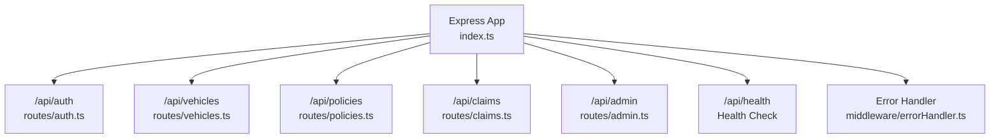
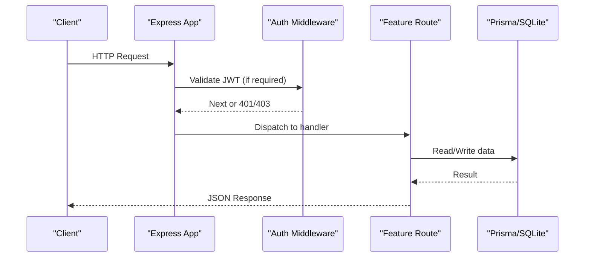
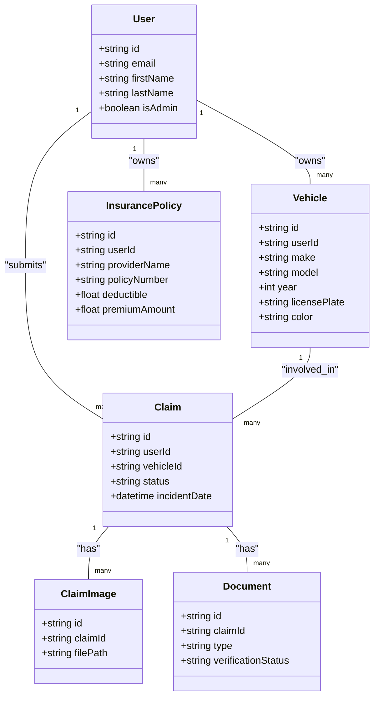

# API Endpoints Reference

<cite>
**Referenced Files in This Document**
- [index.ts](file://backend/src/index.ts)
- [auth.ts](file://backend/src/routes/auth.ts)
- [vehicles.ts](file://backend/src/routes/vehicles.ts)
- [policies.ts](file://backend/src/routes/policies.ts)
- [claims.ts](file://backend/src/routes/claims.ts)
- [admin.ts](file://backend/src/routes/admin.ts)
- [auth.ts](file://backend/src/middleware/auth.ts)
- [adminAuth.ts](file://backend/src/middleware/adminAuth.ts)
- [errorHandler.ts](file://backend/src/middleware/errorHandler.ts)
- [upload.ts](file://backend/src/middleware/upload.ts)
- [schema.prisma](file://backend/prisma/schema.prisma)
</cite>

## Table of Contents
1. [Introduction](#introduction)
2. [Project Structure](#project-structure)
3. [Core Components](#core-components)
4. [Architecture Overview](#architecture-overview)
5. [Detailed Component Analysis](#detailed-component-analysis)
6. [Dependency Analysis](#dependency-analysis)
7. [Performance Considerations](#performance-considerations)
8. [Troubleshooting Guide](#troubleshooting-guide)
9. [Conclusion](#conclusion)
10. [Appendices](#appendices)

## Introduction
This document provides a comprehensive reference for all RESTful endpoints exposed by the backend server. It covers authentication, vehicles, policies, claims, and admin endpoints with HTTP methods, URL patterns, request/response schemas, validation rules, error responses, status codes, and usage patterns such as CRUD operations, file uploads, and batch processing. It also outlines authentication requirements and versioning considerations based on the current codebase.

## Project Structure
The Express application mounts route modules under a common base path and exposes a health check endpoint. Middleware handles CORS, JSON parsing, static uploads, and centralized error handling.

**Diagram sources**
- [index.ts:14-45](file://backend/src/index.ts#L14-L45)

**Section sources**
- [index.ts:14-45](file://backend/src/index.ts#L14-L45)

## Core Components
- Authentication middleware validates JWT tokens and attaches user context to requests.
- Admin middleware enforces admin role checks after token validation.
- Upload middleware configures Multer storage, allowed MIME types, and size limits.
- Error handler centralizes error responses using a custom AppError class.

Key behaviors:
- All protected routes require a valid Bearer token.
- Admin routes additionally require an admin user.
- File uploads are limited to images (JPEG/PNG/WebP/JPG) up to 10MB per file.
- Global error responses follow a consistent shape.

**Section sources**
- [auth.ts:5-22](file://backend/src/middleware/auth.ts#L5-L22)
- [adminAuth.ts:6-26](file://backend/src/middleware/adminAuth.ts#L6-L26)
- [upload.ts:17-53](file://backend/src/middleware/upload.ts#L17-L53)
- [errorHandler.ts:3-27](file://backend/src/middleware/errorHandler.ts#L3-L27)

## Architecture Overview
The API is organized into feature-based route modules mounted under /api. Each module applies its own authorization middleware where needed. Data persistence uses Prisma against a SQLite database defined in the schema.

**Diagram sources**
- [index.ts:17-42](file://backend/src/index.ts#L17-L42)
- [auth.ts:5-22](file://backend/src/middleware/auth.ts#L5-L22)
- [adminAuth.ts:6-26](file://backend/src/middleware/adminAuth.ts#L6-L26)

## Detailed Component Analysis

### Authentication API (/api/auth)
Authentication endpoints manage user registration, login, and profile management.

- POST /api/auth/register
  - Purpose: Create a new user account and return a JWT.
  - Auth: None
  - Request body fields:
    - email: string, required
    - password: string, required
    - firstName: string, required
    - lastName: string, required
    - phone: string, optional
    - address: string, optional
  - Validation:
    - Missing required fields returns 400 with error message.
    - Duplicate email returns 409 with conflict message.
  - Success response: 201 with user object and token.
  - Errors:
    - 400: Missing required fields
    - 409: Email already exists
    - 500: Registration failed

- POST /api/auth/login
  - Purpose: Authenticate user and return JWT.
  - Auth: None
  - Request body fields:
    - email: string, required
    - password: string, required
  - Validation:
    - Missing fields return 400.
    - Invalid credentials return 401.
  - Success response: 200 with user object and token.
  - Errors:
    - 400: Missing fields
    - 401: Invalid email or password
    - 500: Login failed

- GET /api/auth/profile
  - Purpose: Retrieve current user profile.
  - Auth: Required (Bearer token)
  - Success response: 200 with user details.
  - Errors:
    - 401: No token or invalid/expired token
    - 404: User not found
    - 500: Failed to fetch profile

- PUT /api/auth/profile
  - Purpose: Update current user profile fields.
  - Auth: Required (Bearer token)
  - Request body fields (all optional):
    - firstName: string
    - lastName: string
    - phone: string
    - address: string
  - Success response: 200 with updated user details.
  - Errors:
    - 401: No token or invalid/expired token
    - 500: Failed to update profile

Example usage (curl):
- Register: curl -X POST http://localhost:5000/api/auth/register -H "Content-Type: application/json" -d '{"email":"user@example.com","password":"SecurePass123","firstName":"Jane","lastName":"Doe"}'
- Login: curl -X POST http://localhost:5000/api/auth/login -H "Content-Type: application/json" -d '{"email":"user@example.com","password":"SecurePass123"}'
- Get Profile: curl -H "Authorization: Bearer <TOKEN>" http://localhost:5000/api/auth/profile
- Update Profile: curl -X PUT -H "Authorization: Bearer <TOKEN>" -H "Content-Type: application/json" -d '{"phone":"+1234567890"}' http://localhost:5000/api/auth/profile

**Section sources**
- [auth.ts:10-105](file://backend/src/routes/auth.ts#L10-L105)
- [auth.ts:107-165](file://backend/src/routes/auth.ts#L107-L165)
- [auth.ts:5-22](file://backend/src/middleware/auth.ts#L5-L22)

### Vehicles API (/api/vehicles)
Vehicle endpoints support AI-powered vehicle detection from images and full CRUD operations.

- POST /api/vehicles/detect
  - Purpose: Analyze uploaded image to detect vehicle attributes.
  - Auth: Required (Bearer token)
  - Content-Type: multipart/form-data
  - Form field:
    - image: file (JPEG/PNG/WebP/JPG), max 10MB
  - Success response: 200 with detection result and imagePath.
  - Errors:
    - 400: No image uploaded
    - 500: Failed to analyze vehicle image

- POST /api/vehicles
  - Purpose: Register a new vehicle.
  - Auth: Required (Bearer token)
  - Request body fields:
    - make: string, required
    - model: string, required
    - year: integer, required
    - vin: string, optional
    - licensePlate: string, required
    - color: string, required
    - mileage: integer, optional
    - photos: array, optional (stored as JSON)
  - Validation:
    - Missing required fields return 400.
  - Success response: 201 with created vehicle.
  - Errors:
    - 400: Missing required fields
    - 500: Failed to register vehicle

- GET /api/vehicles
  - Purpose: List vehicles owned by the authenticated user.
  - Auth: Required (Bearer token)
  - Success response: 200 with array of vehicles including claim counts.
  - Errors:
    - 500: Failed to fetch vehicles

- GET /api/vehicles/:id
  - Purpose: Retrieve a specific vehicle with related claims summary.
  - Auth: Required (Bearer token)
  - Path params:
    - id: string
  - Success response: 200 with vehicle details.
  - Errors:
    - 404: Vehicle not found
    - 500: Failed to fetch vehicle

- PUT /api/vehicles/:id
  - Purpose: Update vehicle details.
  - Auth: Required (Bearer token)
  - Path params:
    - id: string
  - Request body fields (all optional):
    - make, model, year, vin, licensePlate, color, mileage, photos
  - Validation:
    - Non-existent vehicle returns 404.
  - Success response: 200 with updated vehicle.
  - Errors:
    - 404: Vehicle not found
    - 500: Failed to update vehicle

- DELETE /api/vehicles/:id
  - Purpose: Delete a vehicle.
  - Auth: Required (Bearer token)
  - Path params:
    - id: string
  - Success response: 200 with success message.
  - Errors:
    - 404: Vehicle not found
    - 500: Failed to delete vehicle

Example usage (curl):
- Detect vehicle: curl -F "image=@photo.jpg" -H "Authorization: Bearer <TOKEN>" http://localhost:5000/api/vehicles/detect
- Create vehicle: curl -X POST -H "Authorization: Bearer <TOKEN>" -H "Content-Type: application/json" -d '{"make":"Toyota","model":"Camry","year":2020,"licensePlate":"ABC123","color":"Silver"}' http://localhost:5000/api/vehicles
- List vehicles: curl -H "Authorization: Bearer <TOKEN>" http://localhost:5000/api/vehicles
- Get vehicle: curl -H "Authorization: Bearer <TOKEN>" http://localhost:5000/api/vehicles/<id>
- Update vehicle: curl -X PUT -H "Authorization: Bearer <TOKEN>" -H "Content-Type: application/json" -d '{"mileage":25000}' http://localhost:5000/api/vehicles/<id>
- Delete vehicle: curl -X DELETE -H "Authorization: Bearer <TOKEN>" http://localhost:5000/api/vehicles/<id>

**Section sources**
- [vehicles.ts:15-32](file://backend/src/routes/vehicles.ts#L15-L32)
- [vehicles.ts:34-166](file://backend/src/routes/vehicles.ts#L34-L166)
- [upload.ts:17-53](file://backend/src/middleware/upload.ts#L17-L53)

### Policies API (/api/policies)
Policy endpoints provide full CRUD for insurance policies.

- POST /api/policies
  - Purpose: Create a new policy.
  - Auth: Required (Bearer token)
  - Request body fields:
    - providerName: string, required
    - policyNumber: string, required
    - coverageType: string, required
    - deductible: number, required
    - premiumAmount: number, required
    - startDate: date-time, required
    - endDate: date-time, required
  - Validation:
    - Missing fields return 400.
  - Success response: 201 with created policy.
  - Errors:
    - 400: Missing required fields
    - 500: Failed to create policy

- GET /api/policies
  - Purpose: List policies owned by the authenticated user.
  - Auth: Required (Bearer token)
  - Success response: 200 with array of policies.
  - Errors:
    - 500: Failed to fetch policies

- GET /api/policies/:id
  - Purpose: Retrieve a specific policy.
  - Auth: Required (Bearer token)
  - Path params:
    - id: string
  - Success response: 200 with policy details.
  - Errors:
    - 404: Policy not found
    - 500: Failed to fetch policy

- PUT /api/policies/:id
  - Purpose: Update policy details.
  - Auth: Required (Bearer token)
  - Path params:
    - id: string
  - Request body fields (all optional):
    - providerName, policyNumber, coverageType, deductible, premiumAmount, startDate, endDate
  - Validation:
    - Non-existent policy returns 404.
  - Success response: 200 with updated policy.
  - Errors:
    - 404: Policy not found
    - 500: Failed to update policy

- DELETE /api/policies/:id
  - Purpose: Delete a policy.
  - Auth: Required (Bearer token)
  - Path params:
    - id: string
  - Success response: 200 with success message.
  - Errors:
    - 404: Policy not found
    - 500: Failed to delete policy

Example usage (curl):
- Create policy: curl -X POST -H "Authorization: Bearer <TOKEN>" -H "Content-Type: application/json" -d '{"providerName":"InsureCo","policyNumber":"POL-123","coverageType":"Comprehensive","deductible":500,"premiumAmount":1200,"startDate":"2024-01-01","endDate":"2024-12-31"}' http://localhost:5000/api/policies
- List policies: curl -H "Authorization: Bearer <TOKEN>" http://localhost:5000/api/policies
- Get policy: curl -H "Authorization: Bearer <TOKEN>" http://localhost:5000/api/policies/<id>
- Update policy: curl -X PUT -H "Authorization: Bearer <TOKEN>" -H "Content-Type: application/json" -d '{"premiumAmount":1300}' http://localhost:5000/api/policies/<id>
- Delete policy: curl -X DELETE -H "Authorization: Bearer <TOKEN>" http://localhost:5000/api/policies/<id>

**Section sources**
- [policies.ts:12-128](file://backend/src/routes/policies.ts#L12-L128)

### Claims API (/api/claims)
Claims endpoints support creation, submission, media/document uploads, AI analysis, estimates, verification, and chat assistance.

- POST /api/claims
  - Purpose: Create a new claim draft.
  - Auth: Required (Bearer token)
  - Request body fields:
    - vehicleId: string, required
    - incidentDate: date-time, required
    - incidentLocation: string, required
    - incidentDescription: string, required
    - policyId: string, optional
    - weatherConditions: string, optional
    - hasPoliceReport: boolean, optional
  - Validation:
    - Missing required fields return 400.
    - Non-existent vehicle returns 404.
  - Success response: 201 with created claim.
  - Errors:
    - 400: Missing required fields
    - 404: Vehicle not found
    - 500: Failed to create claim

- GET /api/claims
  - Purpose: List claims for the authenticated user with optional status filter.
  - Auth: Required (Bearer token)
  - Query params:
    - status: string, optional (filter by claim status)
  - Success response: 200 with array of claims including vehicle info, damage severity, and counts.
  - Errors:
    - 500: Failed to fetch claims

- GET /api/claims/:id
  - Purpose: Retrieve detailed claim information.
  - Auth: Required (Bearer token)
  - Path params:
    - id: string
  - Success response: 200 with full claim details including related entities.
  - Errors:
    - 404: Claim not found
    - 500: Failed to fetch claim

- PUT /api/claims/:id
  - Purpose: Update claim details (only when status is DRAFT).
  - Auth: Required (Bearer token)
  - Path params:
    - id: string
  - Request body fields (all optional):
    - incidentDate, incidentLocation, incidentDescription, weatherConditions, hasPoliceReport, policyId
  - Validation:
    - Non-DRAFT status returns 400.
    - Non-existent claim returns 404.
  - Success response: 200 with updated claim.
  - Errors:
    - 400: Can only edit claims in DRAFT status
    - 404: Claim not found
    - 500: Failed to update claim

- POST /api/claims/:id/submit
  - Purpose: Submit a claim for review (requires at least one image).
  - Auth: Required (Bearer token)
  - Path params:
    - id: string
  - Validation:
    - Non-existent claim returns 404.
    - Already submitted returns 400.
    - No images attached returns 400.
  - Success response: 200 with updated claim (status SUBMITTED).
  - Notes:
    - Background AI damage analysis is triggered asynchronously.
  - Errors:
    - 400: Claim has already been submitted or no images uploaded
    - 404: Claim not found
    - 500: Failed to submit claim

- POST /api/claims/:id/images
  - Purpose: Upload multiple images for a claim (batch).
  - Auth: Required (Bearer token)
  - Content-Type: multipart/form-data
  - Form fields:
    - images: files (array), max 10 files
    - imageType: string, optional (FULL_VEHICLE or DAMAGE_CLOSEUP)
    - label: string, optional
  - Validation:
    - Non-existent claim returns 404.
    - No files uploaded returns 400.
  - Success response: 201 with array of created images.
  - Errors:
    - 400: No images uploaded
    - 404: Claim not found
    - 500: Failed to upload images

- DELETE /api/claims/:id/images/:imageId
  - Purpose: Delete a specific image and remove file from disk.
  - Auth: Required (Bearer token)
  - Path params:
    - id: string
    - imageId: string
  - Validation:
    - Non-existent claim or image returns 404.
  - Success response: 200 with success message.
  - Errors:
    - 404: Claim or image not found
    - 500: Failed to delete image

- POST /api/claims/:id/analyze
  - Purpose: Trigger AI damage analysis for a claim.
  - Auth: Required (Bearer token)
  - Path params:
    - id: string
  - Validation:
    - Non-existent claim returns 404.
  - Success response: 200 with damage assessment result.
  - Errors:
    - 404: Claim not found
    - 500: Failed to analyze damage

- POST /api/claims/:id/estimate
  - Purpose: Generate repair estimate (requires prior damage analysis).
  - Auth: Required (Bearer token)
  - Path params:
    - id: string
  - Validation:
    - Non-existent claim returns 404.
    - Missing damage assessment returns 400.
  - Success response: 200 with repair estimate result.
  - Errors:
    - 400: Damage analysis must be completed first
    - 404: Claim not found
    - 500: Failed to generate estimate

- POST /api/claims/:id/documents
  - Purpose: Upload a single document for a claim.
  - Auth: Required (Bearer token)
  - Content-Type: multipart/form-data
  - Form fields:
    - document: file (JPEG/PNG/WebP/JPG), max 10MB
    - documentType: string, optional (LICENSE, REGISTRATION, ACCIDENT_REPORT, REPAIR_ESTIMATE)
  - Validation:
    - Non-existent claim returns 404.
    - No document uploaded returns 400.
    - Invalid document type returns 400.
  - Success response: 201 with created document.
  - Errors:
    - 400: No document uploaded or invalid document type
    - 404: Claim not found
    - 500: Failed to upload document

- GET /api/claims/:id/documents
  - Purpose: List documents for a claim.
  - Auth: Required (Bearer token)
  - Path params:
    - id: string
  - Validation:
    - Non-existent claim returns 404.
  - Success response: 200 with array of documents.
  - Errors:
    - 404: Claim not found
    - 500: Failed to fetch documents

- POST /api/claims/:id/documents/:docId/verify
  - Purpose: Verify a document via AI service.
  - Auth: Required (Bearer token)
  - Path params:
    - id: string
    - docId: string
  - Validation:
    - Non-existent document returns 404.
  - Success response: 200 with verification result.
  - Errors:
    - 404: Document not found
    - 500: Failed to verify document

- GET /api/claims/:id/chat
  - Purpose: Retrieve chat messages for a claim.
  - Auth: Required (Bearer token)
  - Path params:
    - id: string
  - Validation:
    - Non-existent claim returns 404.
  - Success response: 200 with array of messages.
  - Errors:
    - 404: Claim not found
    - 500: Failed to fetch chat messages

- POST /api/claims/:id/chat
  - Purpose: Send a message to the claim assistant.
  - Auth: Required (Bearer token)
  - Path params:
    - id: string
  - Request body fields:
    - message: string, required
  - Validation:
    - Non-existent claim returns 404.
    - Missing message returns 400.
  - Success response: 200 with assistant response.
  - Errors:
    - 400: Message is required
    - 404: Claim not found
    - 500: Failed to get chat response

Example usage (curl):
- Create claim: curl -X POST -H "Authorization: Bearer <TOKEN>" -H "Content-Type: application/json" -d '{"vehicleId":"<VID>","incidentDate":"2024-06-01","incidentLocation":"Main St","incidentDescription":"Minor collision"}' http://localhost:5000/api/claims
- Submit claim: curl -X POST -H "Authorization: Bearer <TOKEN>" http://localhost:5000/api/claims/<id>/submit
- Upload images: curl -F "images=@front.jpg" -F "images=@damage.jpg" -F "imageType=DAMAGE_CLOSEUP" -H "Authorization: Bearer <TOKEN>" http://localhost:5000/api/claims/<id>/images
- Analyze damage: curl -X POST -H "Authorization: Bearer <TOKEN>" http://localhost:5000/api/claims/<id>/analyze
- Generate estimate: curl -X POST -H "Authorization: Bearer <TOKEN>" http://localhost:5000/api/claims/<id>/estimate
- Upload document: curl -F "document=@report.pdf" -F "documentType=ACCIDENT_REPORT" -H "Authorization: Bearer <TOKEN>" http://localhost:5000/api/claims/<id>/documents
- Verify document: curl -X POST -H "Authorization: Bearer <TOKEN>" http://localhost:5000/api/claims/<id>/documents/<docId>/verify
- Chat: curl -X POST -H "Authorization: Bearer <TOKEN>" -H "Content-Type: application/json" -d '{"message":"What documents do I need?"}' http://localhost:5000/api/claims/<id>/chat

**Section sources**
- [claims.ts:20-193](file://backend/src/routes/claims.ts#L20-L193)
- [claims.ts:195-447](file://backend/src/routes/claims.ts#L195-L447)
- [upload.ts:17-53](file://backend/src/middleware/upload.ts#L17-L53)

### Admin API (/api/admin)
Admin endpoints provide statistics, user and claim management, and document verification workflows. All admin routes require admin authentication.

- GET /api/admin/stats
  - Purpose: Retrieve system statistics.
  - Auth: Admin required
  - Success response: 200 with userCount, claimsByStatus, docCount, pendingDocs.
  - Errors:
    - 500: Failed to fetch stats

- GET /api/admin/users
  - Purpose: List non-admin users with counts.
  - Auth: Admin required
  - Success response: 200 with array of users.
  - Errors:
    - 500: Failed to fetch users

- GET /api/admin/claims
  - Purpose: List claims with optional filters.
  - Auth: Admin required
  - Query params:
    - status: string, optional (filter by claim status)
    - search: string, optional (search across user names/email and vehicle make/model)
  - Success response: 200 with array of claims including related info.
  - Errors:
    - 500: Failed to fetch claims

- GET /api/admin/claims/:id
  - Purpose: Retrieve detailed claim information for admin.
  - Auth: Admin required
  - Path params:
    - id: string
  - Success response: 200 with full claim details.
  - Errors:
    - 404: Claim not found
    - 500: Failed to fetch claim

- PATCH /api/admin/claims/:id/status
  - Purpose: Update claim status (admin workflow).
  - Auth: Admin required
  - Path params:
    - id: string
  - Request body fields:
    - status: string, required (DRAFT, SUBMITTED, UNDER_REVIEW, APPROVED, REJECTED, COMPLETED)
  - Validation:
    - Invalid status returns 400.
  - Success response: 200 with updated claim.
  - Errors:
    - 400: Invalid status value
    - 500: Failed to update claim status

- GET /api/admin/documents
  - Purpose: List documents with optional verification status filter.
  - Auth: Admin required
  - Query params:
    - status: string, optional (default PENDING; use ALL to include all statuses)
  - Success response: 200 with array of documents including claim context.
  - Errors:
    - 500: Failed to fetch documents

- PATCH /api/admin/documents/:id/approve
  - Purpose: Approve a document.
  - Auth: Admin required
  - Path params:
    - id: string
  - Success response: 200 with updated document.
  - Errors:
    - 500: Failed to approve document

- PATCH /api/admin/documents/:id/reject
  - Purpose: Reject a document with reason.
  - Auth: Admin required
  - Path params:
    - id: string
  - Request body fields:
    - reason: string, optional
  - Success response: 200 with updated document.
  - Errors:
    - 500: Failed to reject document

Example usage (curl):
- Stats: curl -H "Authorization: Bearer <ADMIN_TOKEN>" http://localhost:5000/api/admin/stats
- Users: curl -H "Authorization: Bearer <ADMIN_TOKEN>" http://localhost:5000/api/admin/users
- Claims: curl -H "Authorization: Bearer <ADMIN_TOKEN>" "http://localhost:5000/api/admin/claims?status=SOME_STATUS&search=John"
- Update status: curl -X PATCH -H "Authorization: Bearer <ADMIN_TOKEN>" -H "Content-Type: application/json" -d '{"status":"APPROVED"}' http://localhost:5000/api/admin/claims/<id>/status
- Approve doc: curl -X PATCH -H "Authorization: Bearer <ADMIN_TOKEN>" http://localhost:5000/api/admin/documents/<id>/approve
- Reject doc: curl -X PATCH -H "Authorization: Bearer <ADMIN_TOKEN>" -H "Content-Type: application/json" -d '{"reason":"Blurry image"}' http://localhost:5000/api/admin/documents/<id>/reject

**Section sources**
- [admin.ts:11-184](file://backend/src/routes/admin.ts#L11-L184)
- [adminAuth.ts:6-26](file://backend/src/middleware/adminAuth.ts#L6-L26)

## Dependency Analysis
Routes depend on middleware for authentication and upload handling, and on Prisma for data access. The schema defines core entities and relationships that influence endpoint behavior and response shapes.

**Diagram sources**
- [schema.prisma:10-202](file://backend/prisma/schema.prisma#L10-L202)

**Section sources**
- [schema.prisma:10-202](file://backend/prisma/schema.prisma#L10-L202)

## Performance Considerations
- File uploads are limited to 10MB per file; ensure clients respect this limit to avoid large payloads.
- Batch image upload supports up to 10 images per request; consider client-side chunking if larger batches are needed.
- Background processing: Claim submission triggers asynchronous damage analysis; clients should poll or rely on subsequent endpoints to retrieve results.
- Database queries include selective relations to reduce payload size; leverage query parameters (e.g., status filter) to minimize data transfer.

[No sources needed since this section provides general guidance]

## Troubleshooting Guide
Common errors and their causes:
- 400 Bad Request: Missing required fields, invalid enum values, or business rule violations (e.g., editing non-DRAFT claims).
- 401 Unauthorized: Missing or invalid/expired JWT token.
- 403 Forbidden: Admin-only endpoint accessed without admin role.
- 404 Not Found: Resource does not exist (vehicle, policy, claim, image, document).
- 409 Conflict: Duplicate email during registration.
- 500 Internal Server Error: Unexpected server-side failures.

Error response structure:
- Most endpoints return a JSON object with an error field describing the issue.
- Centralized error handler wraps unhandled exceptions with a generic message.

Rate limiting:
- No explicit rate limiting is implemented in the provided codebase. If needed, integrate a rate-limiting middleware at the application level.

**Section sources**
- [auth.ts:5-22](file://backend/src/middleware/auth.ts#L5-L22)
- [adminAuth.ts:6-26](file://backend/src/middleware/adminAuth.ts#L6-L26)
- [errorHandler.ts:3-27](file://backend/src/middleware/errorHandler.ts#L3-L27)

## Conclusion
The API provides a complete set of endpoints for managing vehicles, policies, claims, and administrative tasks. Authentication is enforced via JWT tokens, with additional admin controls for administrative functions. File uploads are supported with strict type and size constraints. The system integrates AI services for damage analysis, repair estimation, and document verification. Clients should handle standard HTTP status codes and adhere to validation rules to ensure smooth interactions.

[No sources needed since this section summarizes without analyzing specific files]

## Appendices

### Authentication Requirements Summary
- Public endpoints:
  - POST /api/auth/register
  - POST /api/auth/login
  - GET /api/health
- Protected endpoints (Bearer token required):
  - All /api/auth/profile endpoints
  - All /api/vehicles endpoints
  - All /api/policies endpoints
  - All /api/claims endpoints
- Admin-only endpoints (Admin Bearer token required):
  - All /api/admin endpoints

**Section sources**
- [index.ts:17-42](file://backend/src/index.ts#L17-L42)
- [auth.ts:5-22](file://backend/src/middleware/auth.ts#L5-L22)
- [adminAuth.ts:6-26](file://backend/src/middleware/adminAuth.ts#L6-L26)

### Versioning Strategy and Backward Compatibility
- Current implementation does not include explicit API versioning in URLs or headers.
- To introduce versioning safely:
  - Add a version prefix (e.g., /api/v1/) to route mounting.
  - Maintain backward compatibility by supporting legacy versions alongside new ones until deprecation.
  - Use content negotiation or header-based versioning if necessary.
- Ensure changes to request/response schemas are additive where possible to avoid breaking existing clients.

[No sources needed since this section provides general guidance]