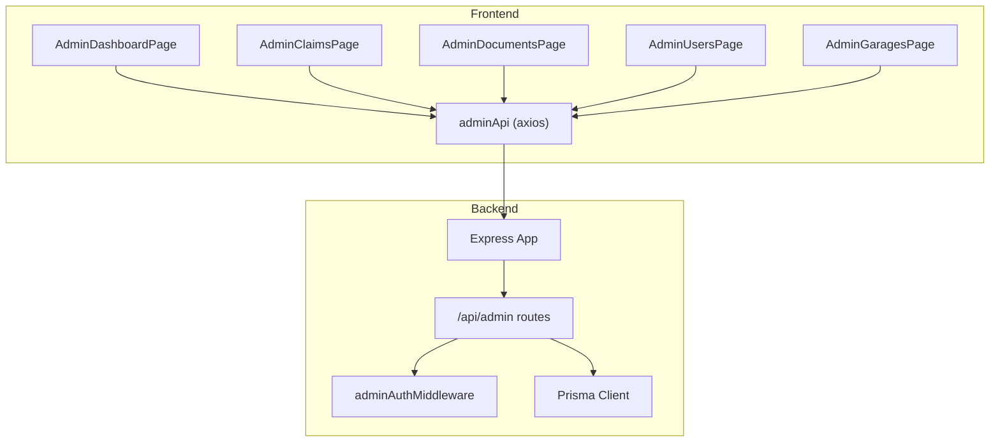
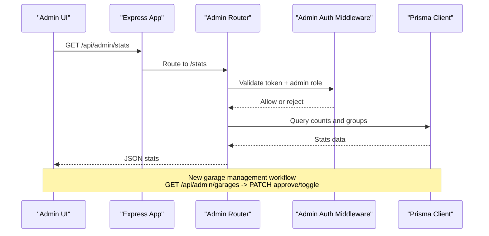
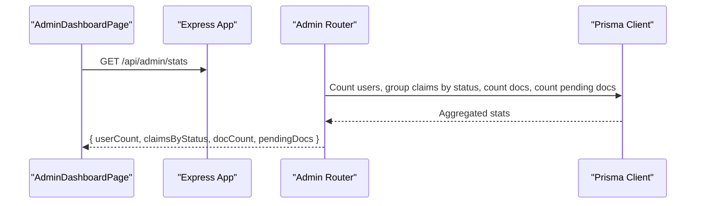
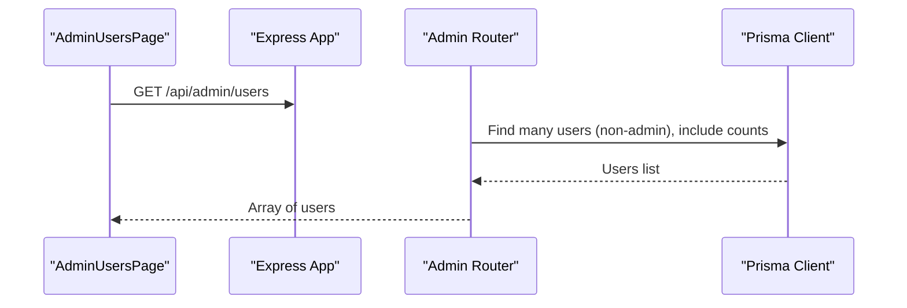
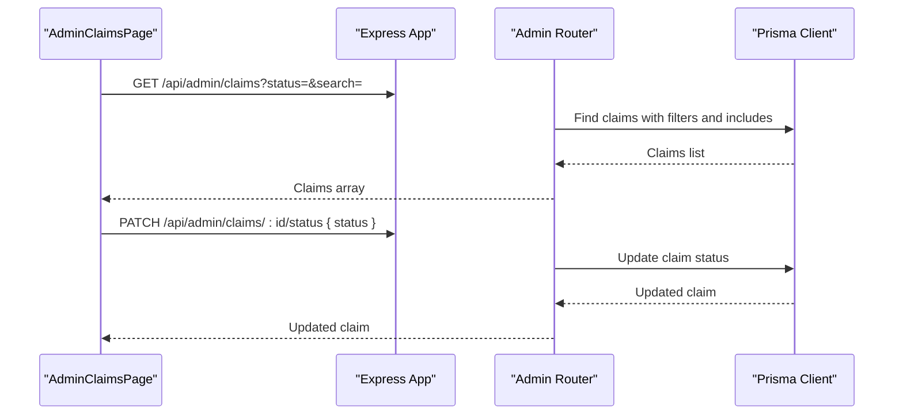
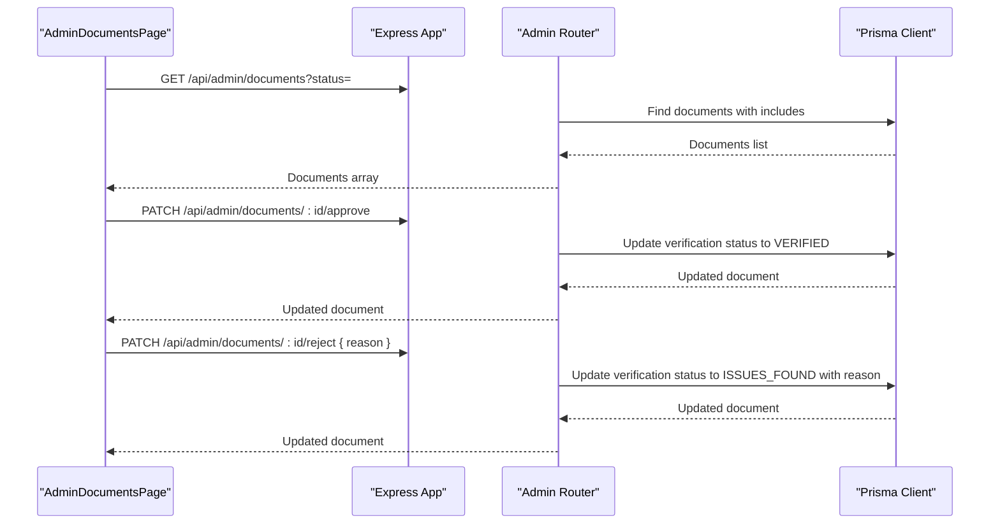
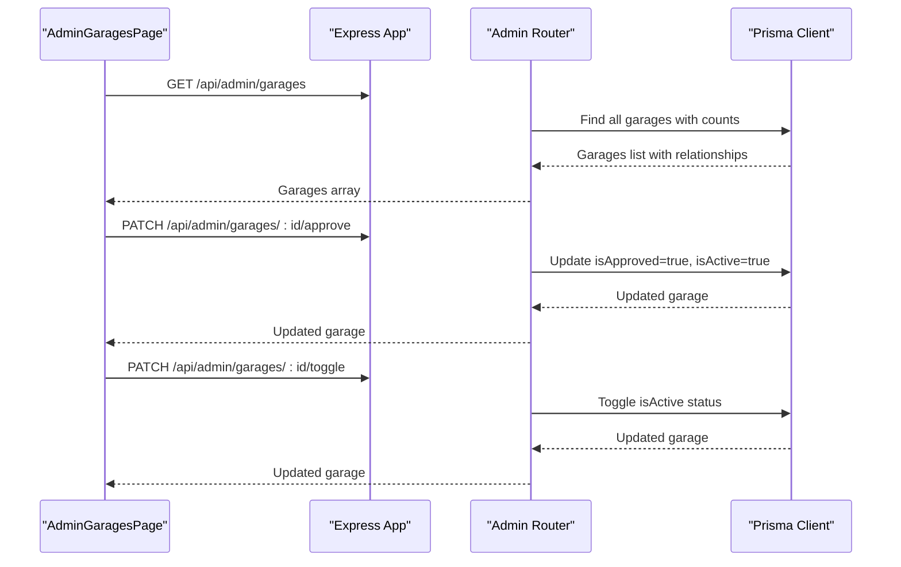
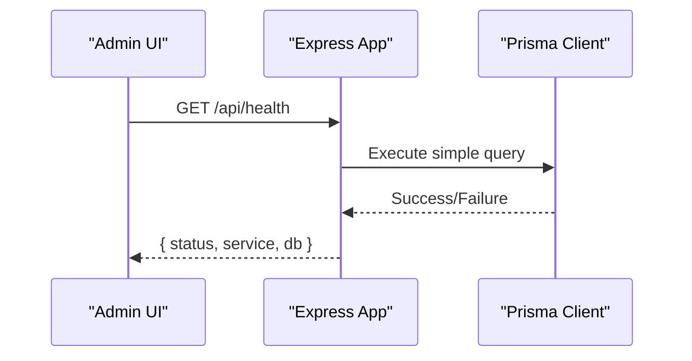
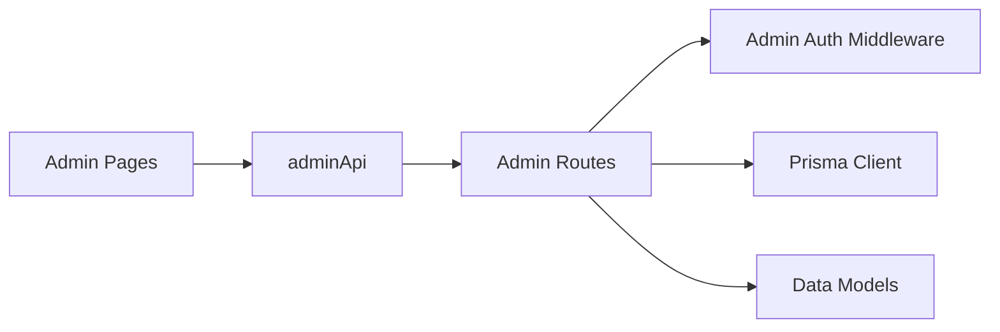

# Administrative Endpoints

<cite>
**Referenced Files in This Document**
- [admin.ts](file://backend/src/routes/admin.ts)
- [adminAuth.ts](file://backend/src/middleware/adminAuth.ts)
- [index.ts](file://backend/src/index.ts)
- [schema.prisma](file://backend/prisma/schema.prisma)
- [AdminDashboardPage.tsx](file://frontend/src/pages/admin/AdminDashboardPage.tsx)
- [AdminClaimsPage.tsx](file://frontend/src/pages/admin/AdminClaimsPage.tsx)
- [AdminDocumentsPage.tsx](file://frontend/src/pages/admin/AdminDocumentsPage.tsx)
- [AdminUsersPage.tsx](file://frontend/src/pages/admin/AdminUsersPage.tsx)
- [AdminGaragesPage.tsx](file://frontend/src/pages/admin/AdminGaragesPage.tsx)
- [garageAuth.ts](file://backend/src/routes/garageAuth.ts)
- [adminApi.ts](file://frontend/src/services/adminApi.ts)
</cite>

## Update Summary
**Changes Made**
- Added comprehensive garage management section with viewing, approving, and toggling operations
- Updated project structure diagram to include garage management functionality
- Enhanced API reference summary with new garage endpoints
- Added garage management workflow diagrams and detailed endpoint documentation

## Table of Contents
1. [Introduction](#introduction)
2. [Project Structure](#project-structure)
3. [Core Components](#core-components)
4. [Architecture Overview](#architecture-overview)
5. [Detailed Component Analysis](#detailed-component-analysis)
6. [Dependency Analysis](#dependency-analysis)
7. [Performance Considerations](#performance-considerations)
8. [Troubleshooting Guide](#troubleshooting-guide)
9. [Conclusion](#conclusion)
10. [Appendices](#appendices)

## Introduction
This document provides comprehensive API documentation for administrative endpoints in the Smart Vehicle Insurance Claim System. It covers admin-only operations for user management, claims review, documents verification, garage management, system monitoring, and analytics. Each endpoint includes HTTP method, URL pattern, request/response schema, access control, and usage examples aligned with the frontend implementation.

## Project Structure
The backend exposes a dedicated /api/admin route group protected by an admin authorization middleware. The frontend provides admin pages that call these endpoints via a shared axios instance configured to attach admin tokens. **Updated** Added comprehensive garage management capabilities including viewing all garages, approving registrations, and toggling activity status.

**Diagram sources**
- [index.ts:40-45](file://backend/src/index.ts#L40-L45)
- [admin.ts:1-7](file://backend/src/routes/admin.ts#L1-L7)
- [adminAuth.ts:6-26](file://backend/src/middleware/adminAuth.ts#L6-L26)
- [AdminDashboardPage.tsx:17-24](file://frontend/src/pages/admin/AdminDashboardPage.tsx#L17-L24)
- [AdminClaimsPage.tsx:23-28](file://frontend/src/pages/admin/AdminClaimsPage.tsx#L23-L28)
- [AdminDocumentsPage.tsx:28-36](file://frontend/src/pages/admin/AdminDocumentsPage.tsx#L28-L36)
- [AdminUsersPage.tsx:10-12](file://frontend/src/pages/admin/AdminUsersPage.tsx#L10-L12)
- [AdminGaragesPage.tsx:9-12](file://frontend/src/pages/admin/AdminGaragesPage.tsx#L9-L12)
- [adminApi.ts:7-14](file://frontend/src/services/adminApi.ts#L7-L14)

**Section sources**
- [index.ts:40-45](file://backend/src/index.ts#L40-L45)
- [admin.ts:1-7](file://backend/src/routes/admin.ts#L1-L7)
- [adminAuth.ts:6-26](file://backend/src/middleware/adminAuth.ts#L6-L26)

## Core Components
- Admin Authorization Middleware: Validates JWT and ensures the authenticated user has admin privileges before allowing access to any admin endpoint.
- Admin Routes: Provide endpoints for statistics, users listing, claims listing/detail/status updates, documents verification approvals/rejections, and **new** garage management operations.
- Frontend Admin Services: Axios client that automatically attaches Bearer tokens from localStorage and redirects on auth errors.

Key responsibilities:
- Enforce role-based access control for all admin endpoints.
- Provide read-only and write operations for claims, documents, and **garages**.
- Expose dashboard statistics and health check endpoints.

**Section sources**
- [adminAuth.ts:6-26](file://backend/src/middleware/adminAuth.ts#L6-L26)
- [admin.ts:11-299](file://backend/src/routes/admin.ts#L11-L299)
- [adminApi.ts:7-24](file://frontend/src/services/adminApi.ts#L7-L24)

## Architecture Overview
Administrative requests flow through Express, are routed to the admin router, pass through admin authorization, and then interact with the database via Prisma. The frontend admin pages consume these endpoints to render dashboards, lists, and actions. **Updated** Now includes comprehensive garage management workflow supporting registration approval and activity status control.

**Diagram sources**
- [index.ts:40-45](file://backend/src/index.ts#L40-L45)
- [admin.ts:11-26](file://backend/src/routes/admin.ts#L11-L26)
- [admin.ts:243-297](file://backend/src/routes/admin.ts#L243-L297)
- [adminAuth.ts:6-26](file://backend/src/middleware/adminAuth.ts#L6-L26)

## Detailed Component Analysis

### Authentication and Access Control
- All admin endpoints require a valid JWT in the Authorization header with Bearer scheme.
- The middleware verifies the token, loads the user, and checks isAdmin flag. Non-admins receive 403; invalid/expired tokens return 401.
- Frontend automatically attaches the admin token and redirects to login on 401/403 responses.

**Diagram sources**
- [adminAuth.ts:6-26](file://backend/src/middleware/adminAuth.ts#L6-L26)

**Section sources**
- [adminAuth.ts:6-26](file://backend/src/middleware/adminAuth.ts#L6-L26)
- [adminApi.ts:7-24](file://frontend/src/services/adminApi.ts#L7-L24)

### Dashboard Statistics
- Endpoint: GET /api/admin/stats
- Purpose: Aggregate system metrics including total non-admin users, claim counts grouped by status, total documents, and pending documents count.
- Response fields:
  - userCount: number
  - claimsByStatus: object mapping status to count
  - docCount: number
  - pendingDocs: number
- Usage: Consumed by AdminDashboardPage to display overview metrics.

**Diagram sources**
- [admin.ts:11-26](file://backend/src/routes/admin.ts#L11-L26)
- [AdminDashboardPage.tsx:17-24](file://frontend/src/pages/admin/AdminDashboardPage.tsx#L17-L24)

**Section sources**
- [admin.ts:11-26](file://backend/src/routes/admin.ts#L11-L26)
- [AdminDashboardPage.tsx:17-24](file://frontend/src/pages/admin/AdminDashboardPage.tsx#L17-L24)

### User Management
- Endpoint: GET /api/admin/users
- Purpose: List all non-admin users with basic profile info and related counts (vehicles, claims).
- Query parameters: None
- Response: Array of user objects including id, email, firstName, lastName, phone, address, createdAt, and _count for vehicles and claims.
- Usage: Rendered by AdminUsersPage to show registered users and their activity summaries.

**Diagram sources**
- [admin.ts:28-45](file://backend/src/routes/admin.ts#L28-L45)
- [AdminUsersPage.tsx:10-12](file://frontend/src/pages/admin/AdminUsersPage.tsx#L10-L12)

**Section sources**
- [admin.ts:28-45](file://backend/src/routes/admin.ts#L28-L45)
- [AdminUsersPage.tsx:10-12](file://frontend/src/pages/admin/AdminUsersPage.tsx#L10-L12)

### Claims Review and Status Updates
- Endpoints:
  - GET /api/admin/claims
  - GET /api/admin/claims/:id
  - PATCH /api/admin/claims/:id/status
- Purposes:
  - List claims with filters and search across user names, emails, vehicle make/model.
  - Retrieve detailed claim information including user, vehicle, policy, images, assessments, estimates, payouts, documents, and chat messages.
  - Update claim status to one of the allowed values.
- Request parameters:
  - GET /api/admin/claims?status=...&search=...
- Allowed statuses: DRAFT, SUBMITTED, UNDER_REVIEW, APPROVED, REJECTED, COMPLETED
- Response schemas:
  - List: Array of claims with included user, vehicle, damage assessment summary, and counts for images/documents.
  - Detail: Full claim entity with related associations.
  - Status update: Updated claim object.
- Usage:
  - AdminClaimsPage filters and searches claims, approves claims by updating status to APPROVED.

**Diagram sources**
- [admin.ts:47-123](file://backend/src/routes/admin.ts#L47-L123)
- [AdminClaimsPage.tsx:23-41](file://frontend/src/pages/admin/AdminClaimsPage.tsx#L23-L41)

**Section sources**
- [admin.ts:47-123](file://backend/src/routes/admin.ts#L47-L123)
- [AdminClaimsPage.tsx:23-41](file://frontend/src/pages/admin/AdminClaimsPage.tsx#L23-L41)

### Documents Verification Approvals
- Endpoints:
  - GET /api/admin/documents?status=PENDING|ISSUES_FOUND|ALL
  - PATCH /api/admin/documents/:id/approve
  - PATCH /api/admin/documents/:id/reject { reason }
- Purposes:
  - List documents with optional filter by verification status.
  - Approve a document setting verification status to VERIFIED and marking approvedByAdmin.
  - Reject a document setting verification status to ISSUES_FOUND and storing rejection reason.
- Response schemas:
  - List: Array of documents with associated claim details (user, vehicle, incident date, claim status).
  - Approve/Reject: Updated document object.
- Usage:
  - AdminDocumentsPage renders tabs for PENDING, ISSUES_FOUND, ALL and performs approve/reject actions per document.

**Diagram sources**
- [admin.ts:125-184](file://backend/src/routes/admin.ts#L125-L184)
- [AdminDocumentsPage.tsx:28-69](file://frontend/src/pages/admin/AdminDocumentsPage.tsx#L28-L69)

**Section sources**
- [admin.ts:125-184](file://backend/src/routes/admin.ts#L125-L184)
- [AdminDocumentsPage.tsx:28-69](file://frontend/src/pages/admin/AdminDocumentsPage.tsx#L28-L69)

### Garage Management Operations
**New Section** - Comprehensive garage administration capabilities for managing registered repair shops and service centers.

- Endpoints:
  - GET /api/admin/garages
  - PATCH /api/admin/garages/:id/approve
  - PATCH /api/admin/garages/:id/toggle
- Purposes:
  - View all registered garages with complete information including contact details, license numbers, specialties, and activity status.
  - Approve garage registrations by setting isApproved to true and automatically activating the account.
  - Toggle garage activity status to activate or deactivate garage accounts without deleting them.
- Response schemas:
  - List: Array of garage objects with id, email, name, ownerName, phone, address, city, licenseNumber, specialties, isActive, isApproved, createdAt, and counts for claims and garageEstimates.
  - Approve/Toggle: Updated garage object with modified status fields.
- Usage:
  - AdminGaragesPage displays all registered garages with approval status indicators and action buttons for approval and activity toggling.

**Diagram sources**
- [admin.ts:243-297](file://backend/src/routes/admin.ts#L243-L297)
- [AdminGaragesPage.tsx:9-26](file://frontend/src/pages/admin/AdminGaragesPage.tsx#L9-L26)

**Section sources**
- [admin.ts:243-297](file://backend/src/routes/admin.ts#L243-L297)
- [AdminGaragesPage.tsx:9-26](file://frontend/src/pages/admin/AdminGaragesPage.tsx#L9-L26)
- [schema.prisma:220-238](file://backend/prisma/schema.prisma#L220-L238)

### System Health Monitoring
- Endpoint: GET /api/health
- Purpose: Basic service health check verifying database connectivity.
- Response:
  - status: "ok" or "error"
  - service: "AutoShield AI API"
  - db: "connected" or "unreachable"
- Usage: Used by infrastructure or admin dashboards to monitor availability.

**Diagram sources**
- [index.ts:47-55](file://backend/src/index.ts#L47-L55)

**Section sources**
- [index.ts:47-55](file://backend/src/index.ts#L47-L55)

## Dependency Analysis
- Admin routes depend on:
  - Prisma client for data access.
  - Admin authorization middleware for access control.
- Frontend admin pages depend on:
  - adminApi axios instance which injects Authorization headers and handles auth errors.
- Data models used by admin endpoints:
  - User, Claim, Vehicle, Document, DamageAssessment, RepairEstimate, InsurancePayout, ChatMessage, **and Garage**.

**Diagram sources**
- [admin.ts:1-7](file://backend/src/routes/admin.ts#L1-L7)
- [adminAuth.ts:6-26](file://backend/src/middleware/adminAuth.ts#L6-L26)
- [schema.prisma:10-256](file://backend/prisma/schema.prisma#L10-L256)
- [adminApi.ts:7-14](file://frontend/src/services/adminApi.ts#L7-L14)

**Section sources**
- [admin.ts:1-7](file://backend/src/routes/admin.ts#L1-L7)
- [schema.prisma:10-256](file://backend/prisma/schema.prisma#L10-L256)
- [adminApi.ts:7-14](file://frontend/src/services/adminApi.ts#L7-L14)

## Performance Considerations
- Use query filters and selects to minimize payload size:
  - Admin claims listing uses selective includes and counts to reduce response size.
  - Garage listing includes only necessary fields and relationship counts.
- Parallel queries:
  - Stats endpoint aggregates multiple counts in parallel using Promise.all for efficiency.
- Pagination:
  - Not implemented in current admin endpoints; consider adding pagination for large datasets (users, claims, documents, garages).
- Caching:
  - Consider caching frequently accessed stats or lists if traffic increases.

[No sources needed since this section provides general guidance]

## Troubleshooting Guide
Common issues and resolutions:
- Missing or invalid token:
  - Ensure Authorization header contains a valid Bearer token.
  - On 401/403, frontend clears adminToken and redirects to login.
- Invalid status value:
  - When updating claim status, ensure it is one of the allowed values.
- Database connectivity:
  - Health endpoint returns error state when database is unreachable.
- Errors handling:
  - Backend logs errors and returns generic error messages; inspect server logs for stack traces.
- **New**: Garage approval workflow:
  - Garage registration requires admin approval before login is allowed.
  - Approved garages are automatically activated upon approval.
  - Deactivated garages cannot log in even if previously approved.

**Section sources**
- [adminAuth.ts:6-26](file://backend/src/middleware/adminAuth.ts#L6-L26)
- [admin.ts:105-123](file://backend/src/routes/admin.ts#L105-L123)
- [admin.ts:262-297](file://backend/src/routes/admin.ts#L262-L297)
- [index.ts:47-55](file://backend/src/index.ts#L47-L55)
- [garageAuth.ts:74-82](file://backend/src/routes/garageAuth.ts#L74-L82)

## Conclusion
The administrative endpoints provide secure, role-gated access to critical insurance claim workflows. They support dashboard analytics, user listing, claims review and status updates, document verification approvals/rejections, **and comprehensive garage management operations**. The frontend integrates seamlessly with these endpoints to deliver a cohesive admin experience. For production scaling, consider adding pagination, audit logging, and bulk operations to enhance usability and performance.

[No sources needed since this section summarizes without analyzing specific files]

## Appendices

### API Reference Summary

- GET /api/admin/stats
  - Description: Returns aggregated system statistics.
  - Response: { userCount: number, claimsByStatus: object, docCount: number, pendingDocs: number }
  - Access: Admin only

- GET /api/admin/users
  - Description: Lists non-admin users with profile and counts.
  - Response: Array of user objects with selected fields and _count for vehicles and claims.
  - Access: Admin only

- GET /api/admin/claims?status=&search=
  - Description: Lists claims with optional filters and search.
  - Response: Array of claims with included user, vehicle, damage assessment summary, and counts.
  - Access: Admin only

- GET /api/admin/claims/:id
  - Description: Retrieves full claim detail with related entities.
  - Response: Complete claim object with associations.
  - Access: Admin only

- PATCH /api/admin/claims/:id/status
  - Description: Updates claim status.
  - Request body: { status: "DRAFT" | "SUBMITTED" | "UNDER_REVIEW" | "APPROVED" | "REJECTED" | "COMPLETED" }
  - Response: Updated claim object.
  - Access: Admin only

- GET /api/admin/documents?status=PENDING|ISSUES_FOUND|ALL
  - Description: Lists documents with optional verification status filter.
  - Response: Array of documents with associated claim details.
  - Access: Admin only

- PATCH /api/admin/documents/:id/approve
  - Description: Approves a document.
  - Response: Updated document object.
  - Access: Admin only

- PATCH /api/admin/documents/:id/reject
  - Description: Rejects a document with a reason.
  - Request body: { reason: string }
  - Response: Updated document object.
  - Access: Admin only

- **NEW** GET /api/admin/garages
  - Description: Lists all registered garages with complete information and relationship counts.
  - Response: Array of garage objects with id, email, name, ownerName, phone, address, city, licenseNumber, specialties, isActive, isApproved, createdAt, and counts for claims and garageEstimates.
  - Access: Admin only

- **NEW** PATCH /api/admin/garages/:id/approve
  - Description: Approves a garage registration and activates the account.
  - Response: Updated garage object with isApproved=true and isActive=true.
  - Access: Admin only

- **NEW** PATCH /api/admin/garages/:id/toggle
  - Description: Toggles garage activity status between active and inactive.
  - Response: Updated garage object with toggled isActive field.
  - Access: Admin only

- GET /api/health
  - Description: Service health check.
  - Response: { status: "ok"|"error", service: "AutoShield AI API", db: "connected"|"unreachable" }
  - Access: Public

**Section sources**
- [admin.ts:11-299](file://backend/src/routes/admin.ts#L11-L299)
- [index.ts:47-55](file://backend/src/index.ts#L47-L55)