# Administrative Endpoints

<cite>
**Referenced Files in This Document**
- [admin.ts](file://backend/src/routes/admin.ts)
- [adminAuth.ts](file://backend/src/middleware/adminAuth.ts)
- [index.ts](file://backend/src/index.ts)
- [schema.prisma](file://backend/prisma/schema.prisma)
- [AdminDashboardPage.tsx](file://frontend/src/pages/admin/AdminDashboardPage.tsx)
- [AdminClaimsPage.tsx](file://frontend/src/pages/admin/AdminClaimsPage.tsx)
- [AdminDocumentsPage.tsx](file://frontend/src/pages/admin/AdminDocumentsPage.tsx)
- [AdminUsersPage.tsx](file://frontend/src/pages/admin/AdminUsersPage.tsx)
- [AdminGaragesPage.tsx](file://frontend/src/pages/admin/AdminGaragesPage.tsx)
- [AdminVehiclesPage.tsx](file://frontend/src/pages/admin/AdminVehiclesPage.tsx)
- [AdminPoliciesPage.tsx](file://frontend/src/pages/admin/AdminPoliciesPage.tsx)
- [garageAuth.ts](file://backend/src/routes/garageAuth.ts)
- [adminApi.ts](file://frontend/src/services/adminApi.ts)
</cite>

## Update Summary
**Changes Made**
- Added complete CRUD operations for policy templates management (GET/POST/PATCH/DELETE /api/admin/policy-templates)
- Enhanced user management with new policy assignment endpoint (POST /api/admin/users/:id/policies) for assigning insurance policies to users
- Added vehicle valuation management endpoint (PATCH /api/admin/vehicles/:id/valuation) for setting claim payout caps
- Updated frontend integration with comprehensive policy template management interface
- Enhanced user policy workflow with built-in plan selection and custom policy creation

## Table of Contents
1. [Introduction](#introduction)
2. [Project Structure](#project-structure)
3. [Core Components](#core-components)
4. [Architecture Overview](#architecture-overview)
5. [Detailed Component Analysis](#detailed-component-analysis)
6. [Dependency Analysis](#dependency-analysis)
7. [Performance Considerations](#performance-considerations)
8. [Troubleshooting Guide](#troubleshooting-guide)
9. [Conclusion](#conclusion)
10. [Appendices](#appendices)

## Introduction
This document provides comprehensive API documentation for administrative endpoints in the Smart Vehicle Insurance Claim System. It covers admin-only operations for user management, vehicle management, claims review, documents verification, garage management, policy template administration, system monitoring, and analytics. Each endpoint includes HTTP method, URL pattern, request/response schema, access control, and usage examples aligned with the frontend implementation.

## Project Structure
The backend exposes a dedicated /api/admin route group protected by an admin authorization middleware. The frontend provides admin pages that call these endpoints via a shared axios instance configured to attach admin tokens. **Updated** Now includes comprehensive policy template management and enhanced user policy assignment capabilities.

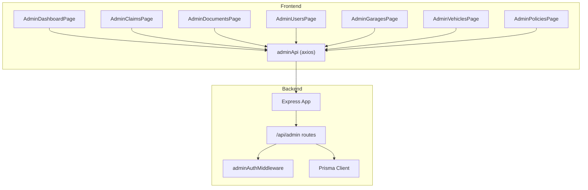

**Diagram sources**
- [index.ts:40-45](file://backend/src/index.ts#L40-L45)
- [admin.ts:1-7](file://backend/src/routes/admin.ts#L1-L7)
- [adminAuth.ts:6-26](file://backend/src/middleware/adminAuth.ts#L6-L26)
- [AdminDashboardPage.tsx:17-24](file://frontend/src/pages/admin/AdminDashboardPage.tsx#L17-L24)
- [AdminClaimsPage.tsx:23-28](file://frontend/src/pages/admin/AdminClaimsPage.tsx#L23-L28)
- [AdminDocumentsPage.tsx:28-36](file://frontend/src/pages/admin/AdminDocumentsPage.tsx#L28-L36)
- [AdminUsersPage.tsx:10-12](file://frontend/src/pages/admin/AdminUsersPage.tsx#L10-L12)
- [AdminGaragesPage.tsx:9-12](file://frontend/src/pages/admin/AdminGaragesPage.tsx#L9-L12)
- [AdminVehiclesPage.tsx:31-57](file://frontend/src/pages/admin/AdminVehiclesPage.tsx#L31-L57)
- [AdminPoliciesPage.tsx:19-37](file://frontend/src/pages/admin/AdminPoliciesPage.tsx#L19-L37)
- [adminApi.ts:7-14](file://frontend/src/services/adminApi.ts#L7-L14)

**Section sources**
- [index.ts:40-45](file://backend/src/index.ts#L40-L45)
- [admin.ts:1-7](file://backend/src/routes/admin.ts#L1-L7)
- [adminAuth.ts:6-26](file://backend/src/middleware/adminAuth.ts#L6-L26)

## Core Components
- Admin Authorization Middleware: Validates JWT and ensures the authenticated user has admin privileges before allowing access to any admin endpoint.
- Admin Routes: Provide endpoints for statistics, users listing, vehicle management, claims listing/detail/status updates, documents verification approvals/rejections, garage management operations, and policy template management.
- Frontend Admin Services: Axios client that automatically attaches Bearer tokens from localStorage and redirects on auth errors.

Key responsibilities:
- Enforce role-based access control for all admin endpoints.
- Provide read-only and write operations for claims, documents, vehicles, garages, and policy templates.
- Expose dashboard statistics and health check endpoints.

**Section sources**
- [adminAuth.ts:6-26](file://backend/src/middleware/adminAuth.ts#L6-L26)
- [admin.ts:11-716](file://backend/src/routes/admin.ts#L11-L716)
- [adminApi.ts:7-24](file://frontend/src/services/adminApi.ts#L7-L24)

## Architecture Overview
Administrative requests flow through Express, are routed to the admin router, pass through admin authorization, and then interact with the database via Prisma. The frontend admin pages consume these endpoints to render dashboards, lists, and actions. **Updated** Now includes comprehensive policy template management workflow supporting template CRUD operations and user policy assignment with built-in plan selection.

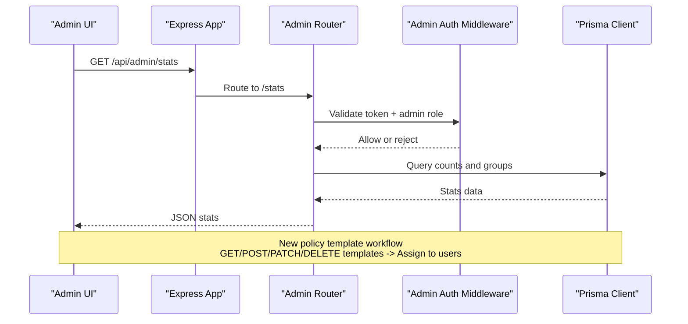

**Diagram sources**
- [index.ts:40-45](file://backend/src/index.ts#L40-L45)
- [admin.ts:11-26](file://backend/src/routes/admin.ts#L11-L26)
- [admin.ts:356-453](file://backend/src/routes/admin.ts#L356-L453)
- [adminAuth.ts:6-26](file://backend/src/middleware/adminAuth.ts#L6-L26)

## Detailed Component Analysis

### Authentication and Access Control
- All admin endpoints require a valid JWT in the Authorization header with Bearer scheme.
- The middleware verifies the token, loads the user, and checks isAdmin flag. Non-admins receive 403; invalid/expired tokens return 401.
- Frontend automatically attaches the admin token and redirects to login on 401/403 responses.

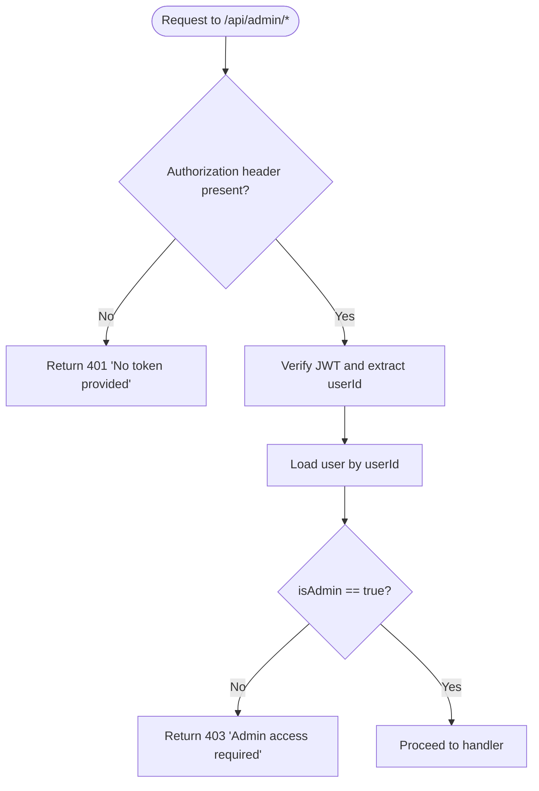

**Diagram sources**
- [adminAuth.ts:6-26](file://backend/src/middleware/adminAuth.ts#L6-L26)

**Section sources**
- [adminAuth.ts:6-26](file://backend/src/middleware/adminAuth.ts#L6-L26)
- [adminApi.ts:7-24](file://frontend/src/services/adminApi.ts#L7-L24)

### Dashboard Statistics
- Endpoint: GET /api/admin/stats
- Purpose: Aggregate system metrics including total non-admin users, claim counts grouped by status, total documents, and pending documents count.
- Response fields:
  - userCount: number
  - claimsByStatus: object mapping status to count
  - docCount: number
  - pendingDocs: number
- Usage: Consumed by AdminDashboardPage to display overview metrics.

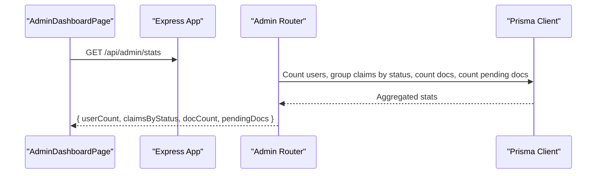

**Diagram sources**
- [admin.ts:11-26](file://backend/src/routes/admin.ts#L11-L26)
- [AdminDashboardPage.tsx:17-24](file://frontend/src/pages/admin/AdminDashboardPage.tsx#L17-L24)

**Section sources**
- [admin.ts:11-26](file://backend/src/routes/admin.ts#L11-L26)
- [AdminDashboardPage.tsx:17-24](file://frontend/src/pages/admin/AdminDashboardPage.tsx#L17-L24)

### User Management
- Endpoints:
  - GET /api/admin/users
  - PATCH /api/admin/users/:id
  - DELETE /api/admin/users/:id
  - POST /api/admin/users/:id/policies
- Purposes:
  - List all non-admin users with basic profile info, related counts (vehicles, claims), and detailed vehicle information.
  - Update user insurance records including phone, address, NIC, license type, annual fee, and joined date.
  - Delete users with cascade deletion of associated vehicles, claims, and policies.
  - Assign insurance policies to users using built-in templates or custom configurations.
- Request parameters:
  - PATCH /api/admin/users/:id supports partial updates with validation for numeric fields and dates.
  - POST /api/admin/users/:id/policies accepts templateId for built-in plans or custom coverageType, deductible, coveragePercent, annualFee.
- Response schemas:
  - List: Array of user objects including id, email, firstName, lastName, phone, address, createdAt, nic, licenseType, annualFee, joinedAt, and _count for vehicles and claims, plus detailed vehicle information.
  - Update: Updated user object with selected fields.
  - Delete: Success message.
  - Policy Assignment: Created policy object with 201 status.
- Usage:
  - AdminUsersPage renders users with expandable details, edit modal for insurance records, delete confirmation with cascade warning, and policy assignment modal with built-in plan selection.

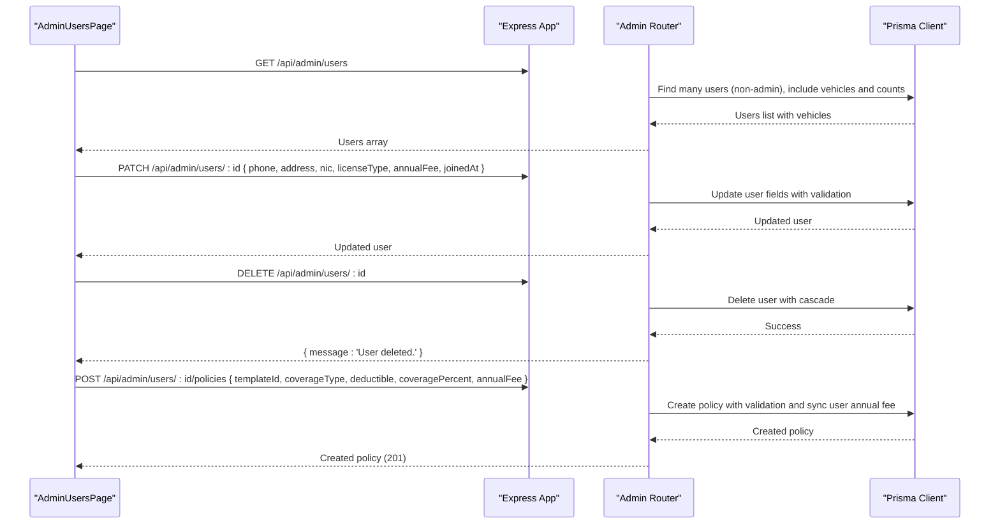

**Diagram sources**
- [admin.ts:28-248](file://backend/src/routes/admin.ts#L28-L248)
- [AdminUsersPage.tsx:10-442](file://frontend/src/pages/admin/AdminUsersPage.tsx#L10-L442)

**Section sources**
- [admin.ts:28-248](file://backend/src/routes/admin.ts#L28-L248)
- [AdminUsersPage.tsx:10-442](file://frontend/src/pages/admin/AdminUsersPage.tsx#L10-L442)

### Vehicle Management
**Enhanced Section** - Comprehensive vehicle administration capabilities for managing registered vehicles, their valuations, and claim payout capping.

- Endpoints:
  - GET /api/admin/vehicles
  - POST /api/admin/vehicles
  - PATCH /api/admin/vehicles/:id/valuation
- Purposes:
  - View all registered vehicles with owner information, claim counts, and search/filter capabilities by user or vehicle details.
  - Create new vehicles on behalf of users with validation for required fields and data types.
  - Set vehicle valuations that cap maximum claim payouts for insurance purposes.
- Request parameters:
  - GET /api/admin/vehicles?user=userId&search=query for filtering by owner and searching vehicle/owner details.
  - POST /api/admin/vehicles requires userId, make, model, year, licensePlate, color, and optional vin, mileage.
  - PATCH /api/admin/vehicles/:id/valuation accepts valuation amount or null to remove cap.
- Response schemas:
  - List: Array of vehicle objects with id, userId, make, model, year, vin, licensePlate, color, mileage, valuation, createdAt, user relationship, and _count for claims.
  - Create: Created vehicle object with 201 status.
  - Valuation: Updated vehicle object with modified valuation field.
- Usage:
  - AdminVehiclesPage displays vehicles with owner information, search functionality, add vehicle modal, and valuation editing interface with real-time payout recalculation.

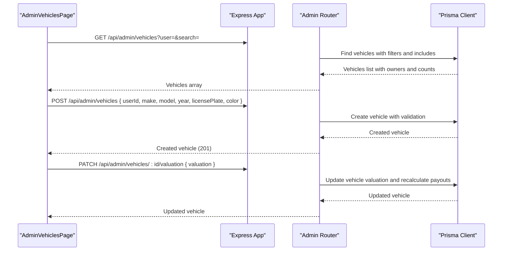

**Diagram sources**
- [admin.ts:250-352](file://backend/src/routes/admin.ts#L250-L352)
- [AdminVehiclesPage.tsx:31-337](file://frontend/src/pages/admin/AdminVehiclesPage.tsx#L31-L337)

**Section sources**
- [admin.ts:250-352](file://backend/src/routes/admin.ts#L250-L352)
- [AdminVehiclesPage.tsx:31-337](file://frontend/src/pages/admin/AdminVehiclesPage.tsx#L31-L337)
- [schema.prisma:32-50](file://backend/prisma/schema.prisma#L32-L50)

### Claims Review and Status Updates
- Endpoints:
  - GET /api/admin/claims
  - GET /api/admin/claims/:id
  - PATCH /api/admin/claims/:id/status
- Purposes:
  - List claims with enhanced filtering including comma-separated status lists, search across user names, emails, vehicle make/model, and scope filtering by user ID or vehicle ID.
  - Retrieve detailed claim information including user, vehicle, policy, images, assessments, estimates, payouts, documents, and chat messages.
  - Update claim status to one of the allowed values.
- Request parameters:
  - GET /api/admin/claims?status=SUBMITTED,UNDER_REVIEW&search=query&user=userId&vehicle=vehicleId
- Allowed statuses: DRAFT, SUBMITTED, UNDER_REVIEW, GARAGE_REVIEW, GARAGE_ESTIMATED, APPROVED, REJECTED, COMPLETED
- Response schemas:
  - List: Array of claims with included user, vehicle, damage assessment summary, and counts for images/documents.
  - Detail: Full claim entity with related associations.
  - Status update: Updated claim object.
- Usage:
  - AdminClaimsPage filters and searches claims with comma-separated status support, approves claims by updating status to APPROVED, and scopes views by user or vehicle.

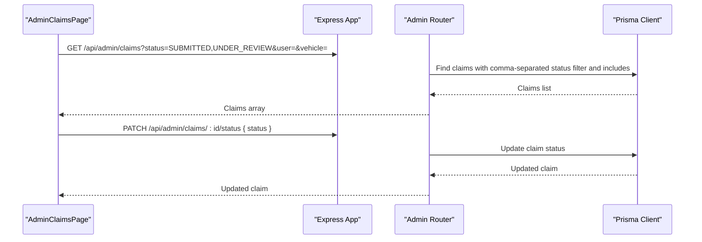

**Diagram sources**
- [admin.ts:455-543](file://backend/src/routes/admin.ts#L455-L543)
- [AdminClaimsPage.tsx:19-70](file://frontend/src/pages/admin/AdminClaimsPage.tsx#L19-L70)

**Section sources**
- [admin.ts:455-543](file://backend/src/routes/admin.ts#L455-L543)
- [AdminClaimsPage.tsx:19-70](file://frontend/src/pages/admin/AdminClaimsPage.tsx#L19-L70)

### Documents Verification Approvals
- Endpoints:
  - GET /api/admin/documents?status=PENDING|ISSUES_FOUND|ALL
  - PATCH /api/admin/documents/:id/approve
  - PATCH /api/admin/documents/:id/reject { reason }
- Purposes:
  - List documents with optional filter by verification status.
  - Approve a document setting verification status to VERIFIED and marking approvedByAdmin.
  - Reject a document setting verification status to ISSUES_FOUND and storing rejection reason.
- Response schemas:
  - List: Array of documents with associated claim details (user, vehicle, incident date, claim status).
  - Approve/Reject: Updated document object.
- Usage:
  - AdminDocumentsPage renders tabs for PENDING, ISSUES_FOUND, ALL and performs approve/reject actions per document.

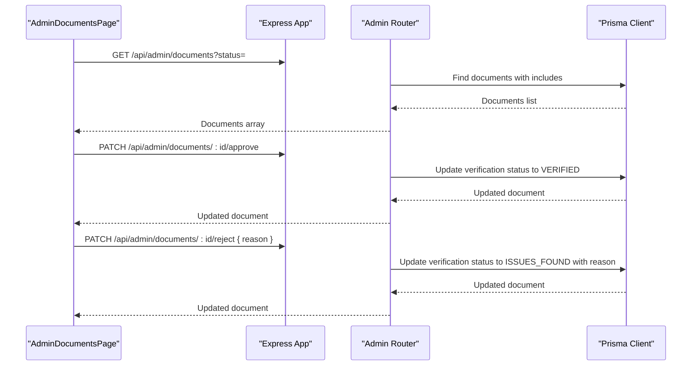

**Diagram sources**
- [admin.ts:545-656](file://backend/src/routes/admin.ts#L545-L656)
- [AdminDocumentsPage.tsx:28-69](file://frontend/src/pages/admin/AdminDocumentsPage.tsx#L28-L69)

**Section sources**
- [admin.ts:545-656](file://backend/src/routes/admin.ts#L545-L656)
- [AdminDocumentsPage.tsx:28-69](file://frontend/src/pages/admin/AdminDocumentsPage.tsx#L28-L69)

### Garage Management Operations
- Endpoints:
  - GET /api/admin/garages
  - PATCH /api/admin/garages/:id/approve
  - PATCH /api/admin/garages/:id/toggle
- Purposes:
  - View all registered garages with complete information including contact details, license numbers, specialties, and activity status.
  - Approve garage registrations by setting isApproved to true and automatically activating the account.
  - Toggle garage activity status to activate or deactivate garage accounts without deleting them.
- Response schemas:
  - List: Array of garage objects with id, email, name, ownerName, phone, address, city, licenseNumber, specialties, isActive, isApproved, createdAt, and counts for claims and garageEstimates.
  - Approve/Toggle: Updated garage object with modified status fields.
- Usage:
  - AdminGaragesPage displays all registered garages with approval status indicators and action buttons for approval and activity toggling.

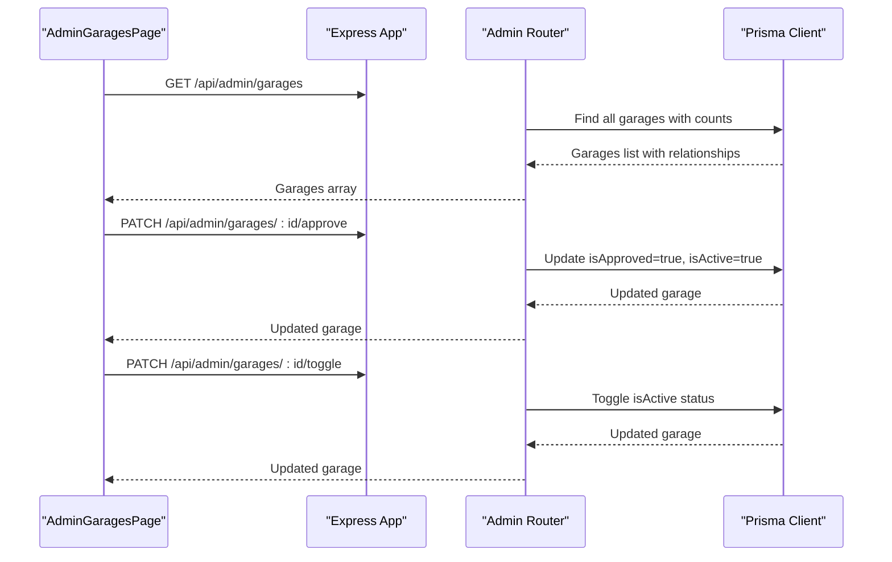

**Diagram sources**
- [admin.ts:658-713](file://backend/src/routes/admin.ts#L658-L713)
- [AdminGaragesPage.tsx:9-26](file://frontend/src/pages/admin/AdminGaragesPage.tsx#L9-L26)

**Section sources**
- [admin.ts:658-713](file://backend/src/routes/admin.ts#L658-L713)
- [AdminGaragesPage.tsx:9-26](file://frontend/src/pages/admin/AdminGaragesPage.tsx#L9-L26)
- [schema.prisma:220-238](file://backend/prisma/schema.prisma#L220-L238)

### Policy Templates Management
**New Section** - Complete CRUD operations for managing built-in insurance policy templates that users can select when purchasing policies.

- Endpoints:
  - GET /api/admin/policy-templates
  - POST /api/admin/policy-templates
  - PATCH /api/admin/policy-templates/:id
  - DELETE /api/admin/policy-templates/:id
- Purposes:
  - Manage built-in insurance policy templates with coverage types, deductibles, and annual fees.
  - Create new policy templates with validation for numeric ranges and required fields.
  - Update existing templates with selective field updates.
  - Delete templates while preserving policies created from them.
- Request parameters:
  - POST/PATCH support name, coverageType, description, deductible, coveragePercent, annualFee, isActive.
- Response schemas:
  - List: Array of policy template objects with counts for associated policies.
  - Create/Update/Delete: Template objects or success messages.
- Usage:
  - AdminPoliciesPage provides comprehensive template management interface with create/edit modals, active/inactive status toggling, and deletion with usage warnings.

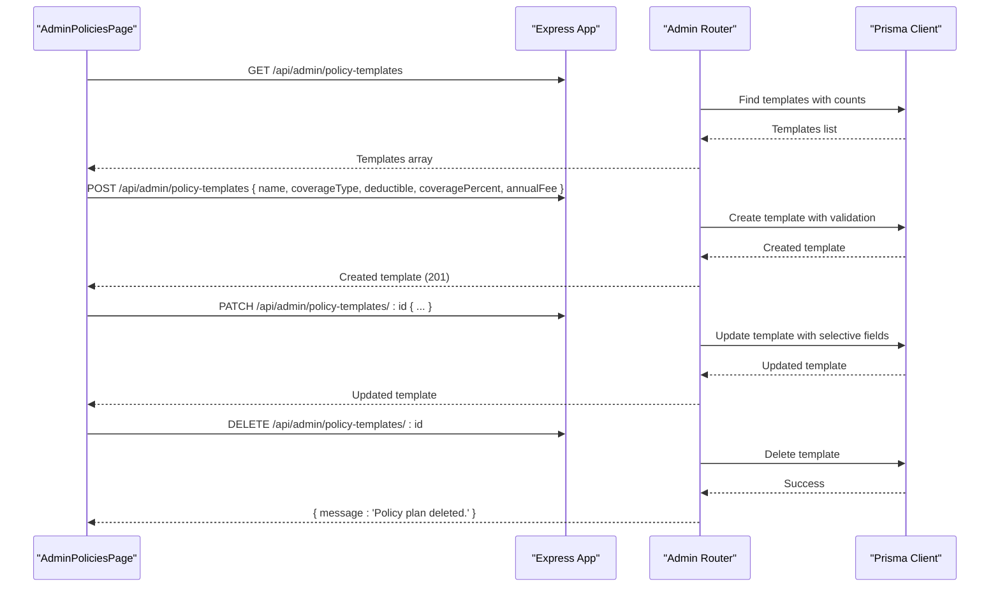

**Diagram sources**
- [admin.ts:356-453](file://backend/src/routes/admin.ts#L356-L453)
- [AdminPoliciesPage.tsx:19-268](file://frontend/src/pages/admin/AdminPoliciesPage.tsx#L19-L268)

**Section sources**
- [admin.ts:356-453](file://backend/src/routes/admin.ts#L356-L453)
- [AdminPoliciesPage.tsx:19-268](file://frontend/src/pages/admin/AdminPoliciesPage.tsx#L19-L268)

### System Health Monitoring
- Endpoint: GET /api/health
- Purpose: Basic service health check verifying database connectivity.
- Response:
  - status: "ok" or "error"
  - service: "AutoShield AI API"
  - db: "connected" or "unreachable"
- Usage: Used by infrastructure or admin dashboards to monitor availability.

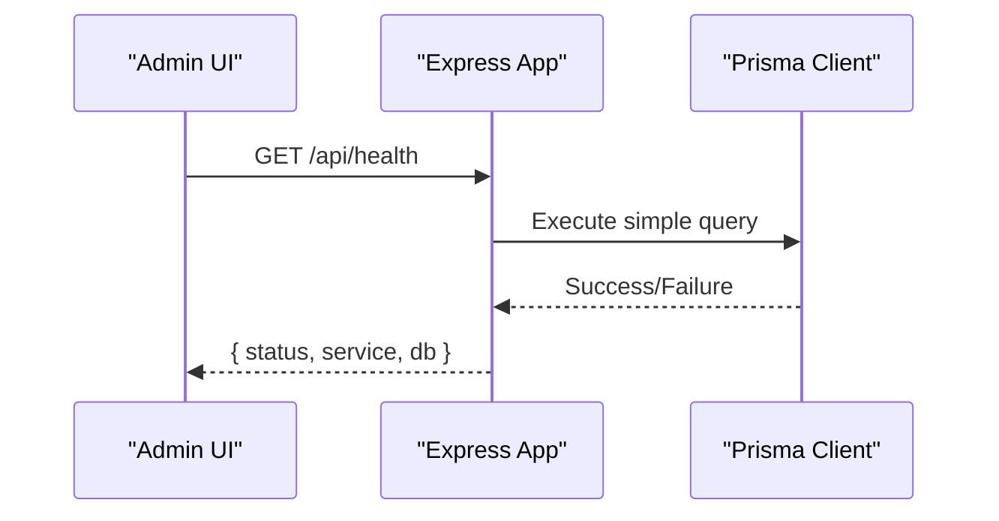

**Diagram sources**
- [index.ts:47-55](file://backend/src/index.ts#L47-L55)

**Section sources**
- [index.ts:47-55](file://backend/src/index.ts#L47-L55)

## Dependency Analysis
- Admin routes depend on:
  - Prisma client for data access.
  - Admin authorization middleware for access control.
- Frontend admin pages depend on:
  - adminApi axios instance which injects Authorization headers and handles auth errors.
- Data models used by admin endpoints:
  - User, Vehicle, Claim, Document, DamageAssessment, RepairEstimate, InsurancePayout, ChatMessage, Garage, PolicyTemplate, InsurancePolicy.

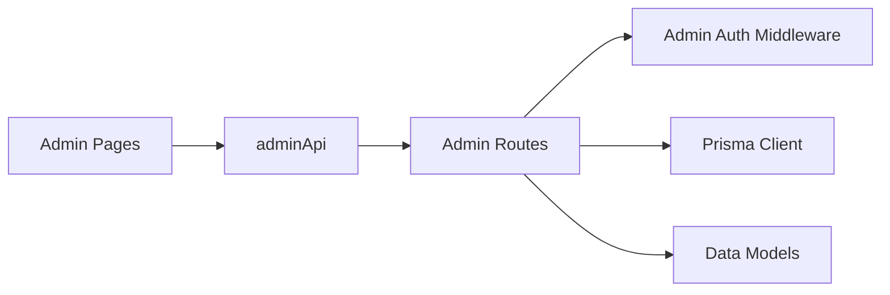

**Diagram sources**
- [admin.ts:1-7](file://backend/src/routes/admin.ts#L1-L7)
- [adminAuth.ts:6-26](file://backend/src/middleware/adminAuth.ts#L6-L26)
- [schema.prisma:10-282](file://backend/prisma/schema.prisma#L10-L282)
- [adminApi.ts:7-14](file://frontend/src/services/adminApi.ts#L7-L14)

**Section sources**
- [admin.ts:1-7](file://backend/src/routes/admin.ts#L1-L7)
- [schema.prisma:10-282](file://backend/prisma/schema.prisma#L10-L282)
- [adminApi.ts:7-14](file://frontend/src/services/adminApi.ts#L7-L14)

## Performance Considerations
- Use query filters and selects to minimize payload size:
  - Admin claims listing uses selective includes and counts to reduce response size.
  - Vehicle listing includes only necessary fields and relationship counts.
  - User listing includes detailed vehicle information for better UX.
- Parallel queries:
  - Stats endpoint aggregates multiple counts in parallel using Promise.all for efficiency.
- Pagination:
  - Not implemented in current admin endpoints; consider adding pagination for large datasets (users, claims, vehicles, documents, garages).
- Caching:
  - Consider caching frequently accessed stats or lists if traffic increases.
- Validation:
  - Backend validates numeric ranges, date formats, and required fields to prevent invalid data entry.

[No sources needed since this section provides general guidance]

## Troubleshooting Guide
Common issues and resolutions:
- Missing or invalid token:
  - Ensure Authorization header contains a valid Bearer token.
  - On 401/403, frontend clears adminToken and redirects to login.
- Invalid status value:
  - When updating claim status, ensure it is one of the allowed values.
- Database connectivity:
  - Health endpoint returns error state when database is unreachable.
- Errors handling:
  - Backend logs errors and returns generic error messages; inspect server logs for stack traces.
- **New**: Vehicle management issues:
  - Vehicle creation requires all mandatory fields (userId, make, model, year, licensePlate, color).
  - Year validation must be between 1900 and 2100.
  - Valuation must be a non-negative number or null to remove cap.
- **New**: User management issues:
  - User deletion triggers cascade deletion of vehicles, claims, and policies.
  - Annual fee must be a non-negative number.
  - Joined date must be a valid date format.
- **New**: Claims filtering issues:
  - Comma-separated status lists must not contain spaces after commas.
  - User and vehicle filters work independently or together.
- **New**: Policy template issues:
  - Template creation requires name, coverageType, deductible, coveragePercent, and annualFee.
  - Coverage percent must be between 1 and 100.
  - Deductible and annual fee must be non-negative numbers.
- **New**: User policy assignment issues:
  - Policy assignment requires either templateId or complete custom policy details.
  - Built-in templates must be active to be selectable.
  - User annual fee is automatically synced with assigned policy premium amount.
- Garage approval workflow:
  - Garage registration requires admin approval before login is allowed.
  - Approved garages are automatically activated upon approval.
  - Deactivated garages cannot log in even if previously approved.

**Section sources**
- [adminAuth.ts:6-26](file://backend/src/middleware/adminAuth.ts#L6-L26)
- [admin.ts:56-248](file://backend/src/routes/admin.ts#L56-L248)
- [admin.ts:250-453](file://backend/src/routes/admin.ts#L250-L453)
- [admin.ts:455-713](file://backend/src/routes/admin.ts#L455-L713)
- [index.ts:47-55](file://backend/src/index.ts#L47-L55)
- [garageAuth.ts:74-82](file://backend/src/routes/garageAuth.ts#L74-L82)

## Conclusion
The administrative endpoints provide secure, role-gated access to critical insurance claim workflows. They support dashboard analytics, user listing and management, comprehensive vehicle management with valuation controls, claims review and status updates with enhanced filtering, document verification approvals/rejections, garage management operations, and complete policy template administration. The frontend integrates seamlessly with these endpoints to deliver a cohesive admin experience. For production scaling, consider adding pagination, audit logging, and bulk operations to enhance usability and performance.

[No sources needed since this section summarizes without analyzing specific files]

## Appendices

### API Reference Summary

- GET /api/admin/stats
  - Description: Returns aggregated system statistics.
  - Response: { userCount: number, claimsByStatus: object, docCount: number, pendingDocs: number }
  - Access: Admin only

- GET /api/admin/users
  - Description: Lists non-admin users with profile, detailed vehicle information, and counts.
  - Response: Array of user objects with selected fields, _count for vehicles and claims, and vehicles array with claim counts.
  - Access: Admin only

- **NEW** PATCH /api/admin/users/:id
  - Description: Updates user insurance records with validation.
  - Request body: { phone?, address?, nic?, licenseType?, annualFee?, joinedAt? }
  - Response: Updated user object with selected fields.
  - Access: Admin only

- **NEW** DELETE /api/admin/users/:id
  - Description: Deletes user with cascade deletion of vehicles, claims, and policies.
  - Response: { message: 'User deleted.' }
  - Access: Admin only

- **NEW** POST /api/admin/users/:id/policies
  - Description: Assigns insurance policy to user using built-in template or custom configuration.
  - Request body: { templateId?, coverageType?, deductible?, coveragePercent?, annualFee? }
  - Response: Created policy object with 201 status.
  - Access: Admin only

- GET /api/admin/vehicles
  - Description: Lists all vehicles with owner information, claim counts, and search/filter capabilities.
  - Query params: ?user=userId&search=query
  - Response: Array of vehicle objects with user relationship and _count for claims.
  - Access: Admin only

- **NEW** POST /api/admin/vehicles
  - Description: Creates a new vehicle on behalf of a user.
  - Request body: { userId, make, model, year, licensePlate, color, vin?, mileage? }
  - Response: Created vehicle object (201 status).
  - Access: Admin only

- **NEW** PATCH /api/admin/vehicles/:id/valuation
  - Description: Sets or removes vehicle valuation that caps claim payouts.
  - Request body: { valuation: number|null }
  - Response: Updated vehicle object with valuation field.
  - Access: Admin only

- GET /api/admin/claims?status=&search=&user=&vehicle=
  - Description: Lists claims with enhanced filtering including comma-separated status lists and scope filters.
  - Query params: ?status=SUBMITTED,UNDER_REVIEW&search=query&user=userId&vehicle=vehicleId
  - Response: Array of claims with included user, vehicle, damage assessment summary, and counts.
  - Access: Admin only

- GET /api/admin/claims/:id
  - Description: Retrieves full claim detail with related entities.
  - Response: Complete claim object with associations.
  - Access: Admin only

- PATCH /api/admin/claims/:id/status
  - Description: Updates claim status.
  - Request body: { status: "DRAFT" | "SUBMITTED" | "UNDER_REVIEW" | "GARAGE_REVIEW" | "GARAGE_ESTIMATED" | "APPROVED" | "REJECTED" | "COMPLETED" }
  - Response: Updated claim object.
  - Access: Admin only

- GET /api/admin/documents?status=PENDING|ISSUES_FOUND|ALL
  - Description: Lists documents with optional verification status filter.
  - Response: Array of documents with associated claim details.
  - Access: Admin only

- PATCH /api/admin/documents/:id/approve
  - Description: Approves a document.
  - Response: Updated document object.
  - Access: Admin only

- PATCH /api/admin/documents/:id/reject
  - Description: Rejects a document with a reason.
  - Request body: { reason: string }
  - Response: Updated document object.
  - Access: Admin only

- GET /api/admin/garages
  - Description: Lists all registered garages with complete information and relationship counts.
  - Response: Array of garage objects with id, email, name, ownerName, phone, address, city, licenseNumber, specialties, isActive, isApproved, createdAt, and counts for claims and garageEstimates.
  - Access: Admin only

- PATCH /api/admin/garages/:id/approve
  - Description: Approves a garage registration and activates the account.
  - Response: Updated garage object with isApproved=true and isActive=true.
  - Access: Admin only

- PATCH /api/admin/garages/:id/toggle
  - Description: Toggles garage activity status between active and inactive.
  - Response: Updated garage object with toggled isActive field.
  - Access: Admin only

- **NEW** GET /api/admin/policy-templates
  - Description: Lists all policy templates with counts for associated policies.
  - Response: Array of policy template objects with _count for policies.
  - Access: Admin only

- **NEW** POST /api/admin/policy-templates
  - Description: Creates a new policy template with validation.
  - Request body: { name, coverageType, description?, deductible, coveragePercent, annualFee, isActive? }
  - Response: Created policy template object (201 status).
  - Access: Admin only

- **NEW** PATCH /api/admin/policy-templates/:id
  - Description: Updates an existing policy template with selective field updates.
  - Request body: Partial template fields with validation.
  - Response: Updated policy template object.
  - Access: Admin only

- **NEW** DELETE /api/admin/policy-templates/:id
  - Description: Deletes a policy template while preserving associated policies.
  - Response: { message: 'Policy plan deleted.' }
  - Access: Admin only

- GET /api/health
  - Description: Service health check.
  - Response: { status: "ok"|"error", service: "AutoShield AI API", db: "connected"|"unreachable" }
  - Access: Public

**Section sources**
- [admin.ts:11-716](file://backend/src/routes/admin.ts#L11-L716)
- [index.ts:47-55](file://backend/src/index.ts#L47-L55)