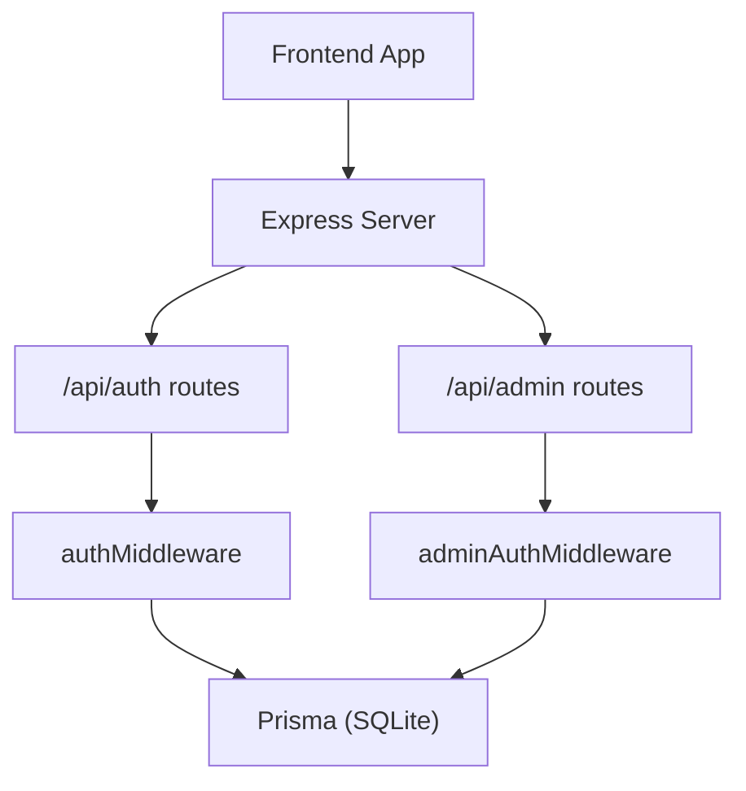
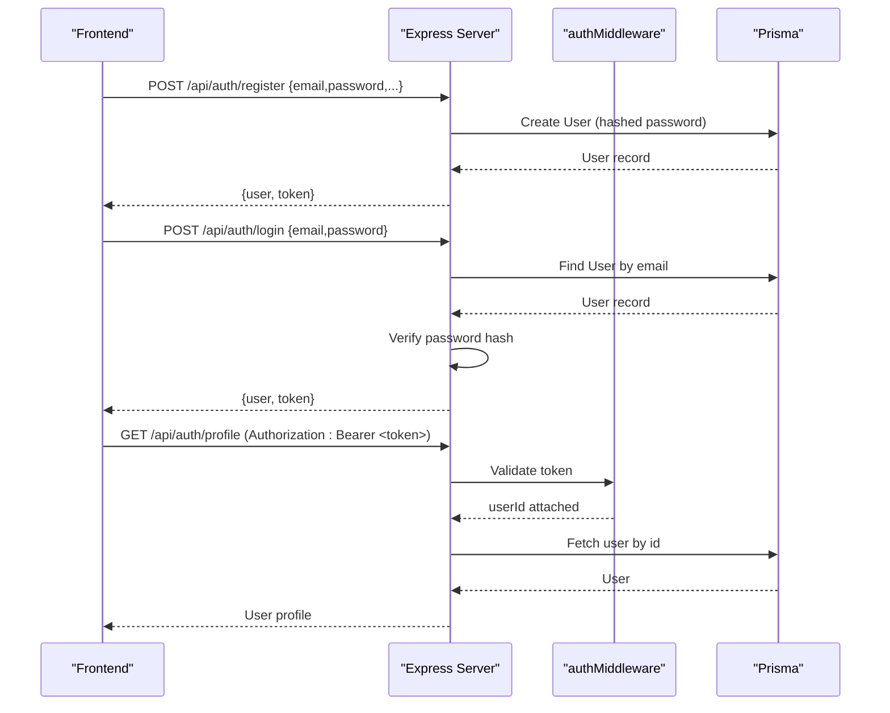
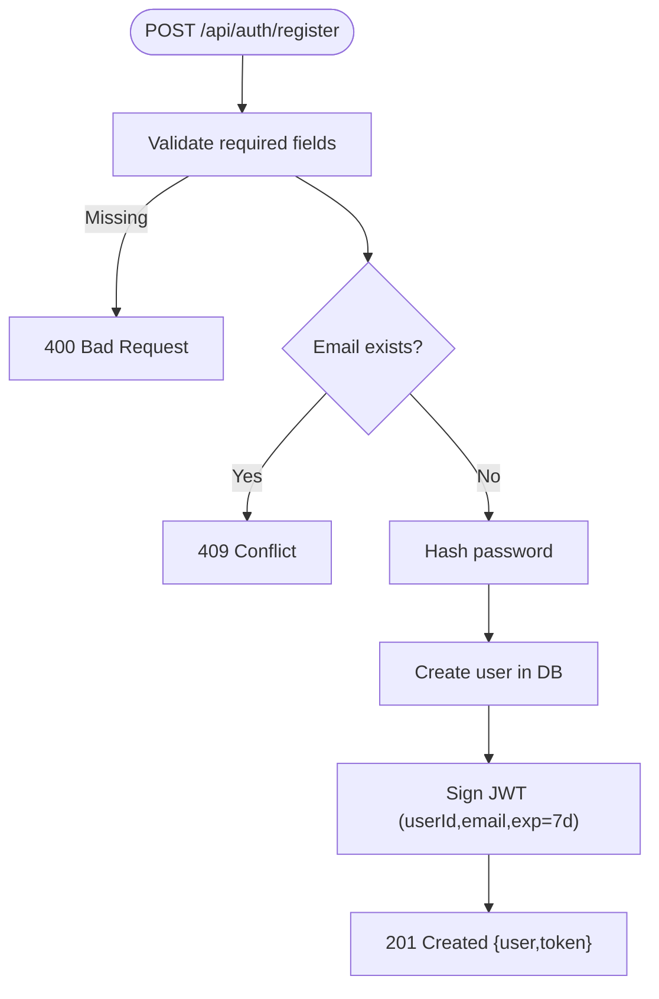
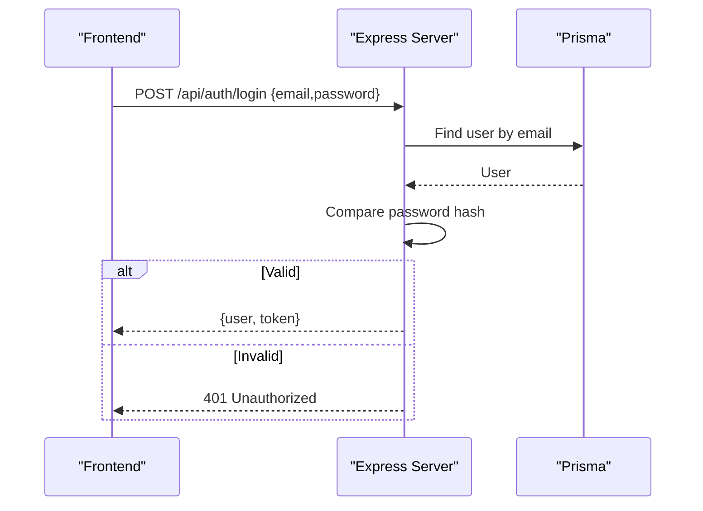
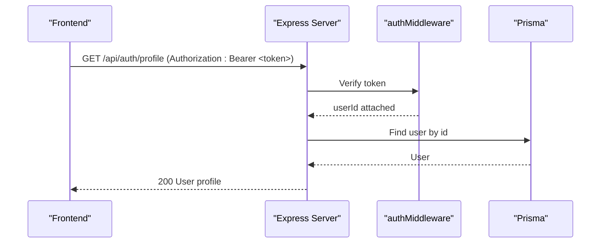
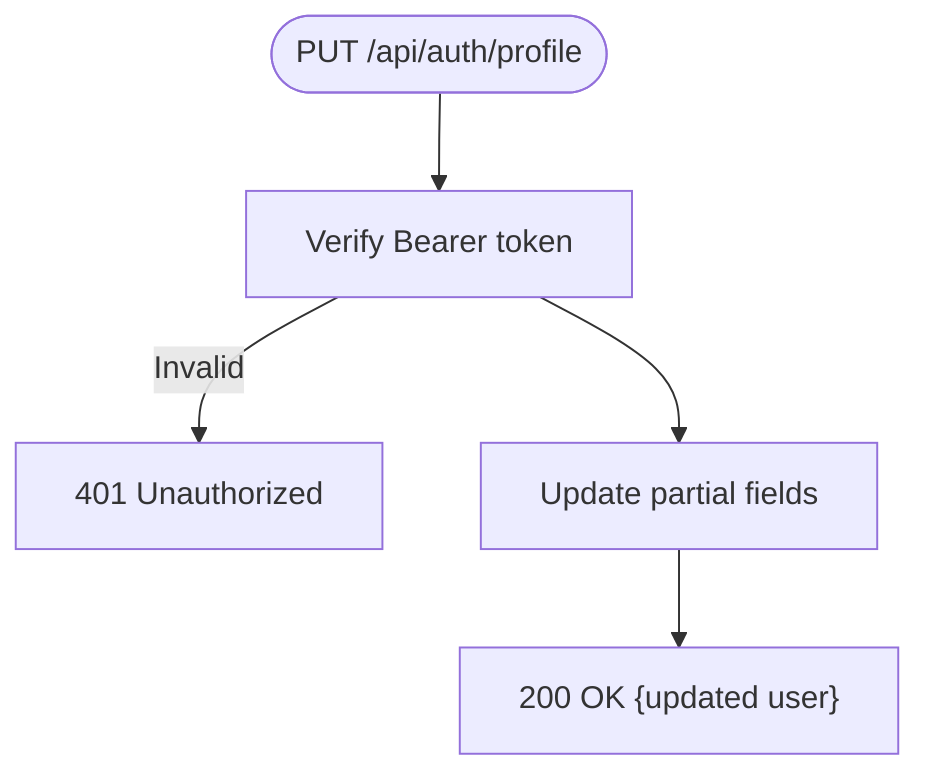
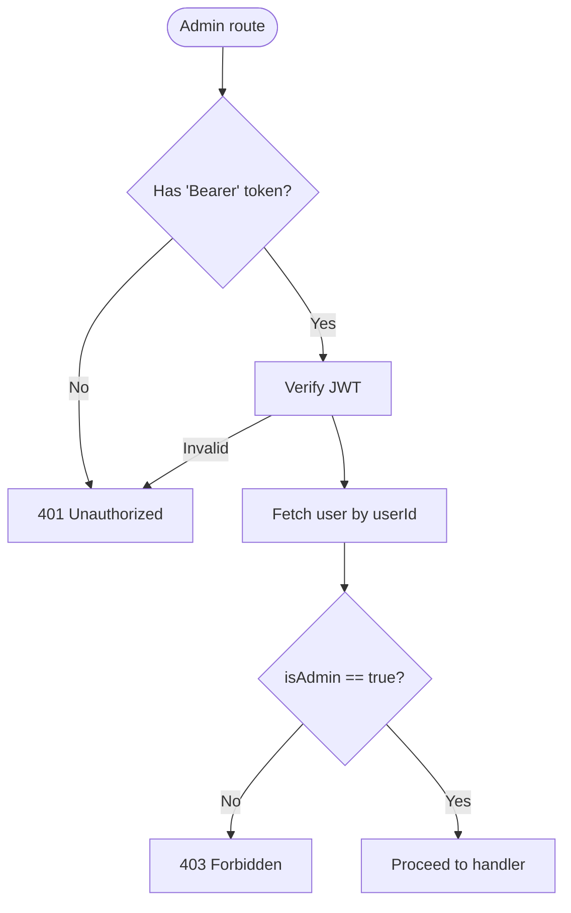
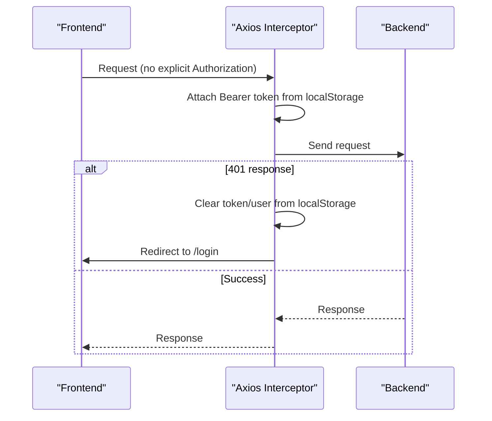
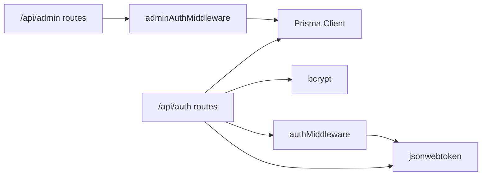
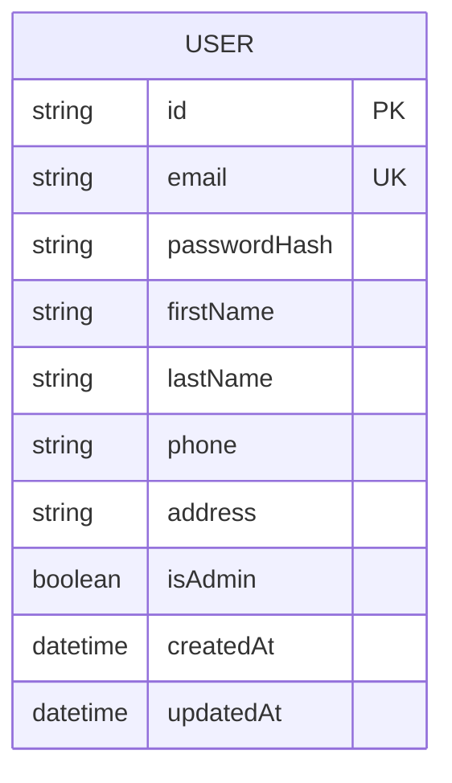

# Authentication Endpoints

<cite>
**Referenced Files in This Document**
- [auth.ts](file://backend/src/routes/auth.ts)
- [auth.ts](file://backend/src/middleware/auth.ts)
- [adminAuth.ts](file://backend/src/middleware/adminAuth.ts)
- [schema.prisma](file://backend/prisma/schema.prisma)
- [index.ts](file://backend/src/types/index.ts)
- [index.ts](file://backend/src/index.ts)
- [api.ts](file://frontend/src/services/api.ts)
- [AuthContext.tsx](file://frontend/src/context/AuthContext.tsx)
</cite>

## Table of Contents
1. [Introduction](#introduction)
2. [Project Structure](#project-structure)
3. [Core Components](#core-components)
4. [Architecture Overview](#architecture-overview)
5. [Detailed Component Analysis](#detailed-component-analysis)
6. [Dependency Analysis](#dependency-analysis)
7. [Performance Considerations](#performance-considerations)
8. [Troubleshooting Guide](#troubleshooting-guide)
9. [Conclusion](#conclusion)
10. [Appendices](#appendices)

## Introduction
This document provides comprehensive API documentation for authentication endpoints in the Smart Vehicle Insurance Claim System. It covers user registration, login, profile retrieval, and profile updates. For each endpoint, it specifies HTTP methods, URL patterns, request/response schemas, parameter validation rules, error codes, and security considerations. It also documents JWT token handling, password hashing, session management on the client side, and the middleware-based authorization used across the application.

## Project Structure
The authentication system is implemented as follows:
- Express routes define public and protected endpoints under /api/auth.
- Middleware validates JWT tokens to protect sensitive routes.
- Prisma schema defines the User model and related entities.
- Frontend Axios interceptor attaches JWT tokens to requests and handles 401 responses by clearing local state and redirecting to login.

**Diagram sources**
- [index.ts:40-45](file://backend/src/index.ts#L40-L45)
- [auth.ts:108-165](file://backend/src/routes/auth.ts#L108-L165)
- [auth.ts:5-22](file://backend/src/middleware/auth.ts#L5-L22)
- [adminAuth.ts:6-26](file://backend/src/middleware/adminAuth.ts#L6-L26)

**Section sources**
- [index.ts:40-45](file://backend/src/index.ts#L40-L45)

## Core Components
- Authentication routes: register, login, get profile, update profile.
- Authorization middleware: Bearer token verification and injection of userId into request context.
- Admin authorization middleware: verifies token and enforces admin role.
- Data model: User entity with email, hashed password, name fields, optional phone/address, isAdmin flag, timestamps.
- Client-side token handling: Axios interceptor adds Authorization header; 401 triggers logout and redirect.

**Section sources**
- [auth.ts:10-165](file://backend/src/routes/auth.ts#L10-L165)
- [auth.ts:5-22](file://backend/src/middleware/auth.ts#L5-L22)
- [adminAuth.ts:6-26](file://backend/src/middleware/adminAuth.ts#L6-L26)
- [schema.prisma:10-25](file://backend/prisma/schema.prisma#L10-L25)
- [api.ts:11-37](file://frontend/src/services/api.ts#L11-L37)
- [AuthContext.tsx:17-66](file://frontend/src/context/AuthContext.tsx#L17-L66)

## Architecture Overview
Authentication flow:
- Registration: create user, hash password, issue JWT.
- Login: verify credentials, issue JWT.
- Profile access/update: require valid JWT via authMiddleware.
- Admin operations: require valid JWT and admin role via adminAuthMiddleware.

**Diagram sources**
- [auth.ts:10-59](file://backend/src/routes/auth.ts#L10-L59)
- [auth.ts:61-105](file://backend/src/routes/auth.ts#L61-L105)
- [auth.ts:108-134](file://backend/src/routes/auth.ts#L108-L134)
- [auth.ts:5-22](file://backend/src/middleware/auth.ts#L5-L22)

## Detailed Component Analysis

### Endpoint: Register
- Method: POST
- URL: /api/auth/register
- Authentication: None (public)
- Request body:
  - Required: email (string), password (string), firstName (string), lastName (string)
  - Optional: phone (string?), address (string?)
- Validation:
  - All required fields must be present; otherwise returns 400.
  - Email uniqueness enforced at database level; duplicate email returns 409.
- Response:
  - 201 Created: { user: { id, email, firstName, lastName, phone, address, createdAt }, token }
- Security:
  - Password is hashed before storage using bcrypt with a cost factor.
  - JWT issued with expiration set to 7 days.
- Error codes:
  - 400: Missing required fields
  - 409: Email already exists
  - 500: Internal server error

**Diagram sources**
- [auth.ts:10-59](file://backend/src/routes/auth.ts#L10-L59)

**Section sources**
- [auth.ts:10-59](file://backend/src/routes/auth.ts#L10-L59)
- [schema.prisma:10-25](file://backend/prisma/schema.prisma#L10-L25)

### Endpoint: Login
- Method: POST
- URL: /api/auth/login
- Authentication: None (public)
- Request body:
  - Required: email (string), password (string)
- Validation:
  - Both fields required; missing returns 400.
  - Invalid credentials return 401.
- Response:
  - 200 OK: { user: { id, email, firstName, lastName, phone, address, isAdmin }, token }
- Security:
  - Password verified against stored hash using bcrypt.
  - JWT issued with expiration set to 7 days.
- Error codes:
  - 400: Missing required fields
  - 401: Invalid email or password
  - 500: Internal server error

**Diagram sources**
- [auth.ts:61-105](file://backend/src/routes/auth.ts#L61-L105)

**Section sources**
- [auth.ts:61-105](file://backend/src/routes/auth.ts#L61-L105)

### Endpoint: Get Profile
- Method: GET
- URL: /api/auth/profile
- Authentication: Required (Bearer token)
- Request headers:
  - Authorization: Bearer <jwt>
- Response:
  - 200 OK: { id, email, firstName, lastName, phone, address, isAdmin, createdAt }
  - 401 Unauthorized: if token missing or invalid
  - 404 Not Found: if user not found
  - 500 Internal server error
- Security:
  - Token validated via authMiddleware; userId injected into request context.

**Diagram sources**
- [auth.ts:108-134](file://backend/src/routes/auth.ts#L108-L134)
- [auth.ts:5-22](file://backend/src/middleware/auth.ts#L5-L22)

**Section sources**
- [auth.ts:108-134](file://backend/src/routes/auth.ts#L108-L134)
- [auth.ts:5-22](file://backend/src/middleware/auth.ts#L5-L22)

### Endpoint: Update Profile
- Method: PUT
- URL: /api/auth/profile
- Authentication: Required (Bearer token)
- Request body:
  - Optional fields: firstName (string?), lastName (string?), phone (string?), address (string?)
  - Only provided fields are updated.
- Response:
  - 200 OK: Updated user object (id, email, firstName, lastName, phone, address, createdAt)
  - 401 Unauthorized: if token missing or invalid
  - 500 Internal server error
- Security:
  - Token validated via authMiddleware; only the authenticated user’s profile can be updated.

**Diagram sources**
- [auth.ts:136-165](file://backend/src/routes/auth.ts#L136-L165)
- [auth.ts:5-22](file://backend/src/middleware/auth.ts#L5-L22)

**Section sources**
- [auth.ts:136-165](file://backend/src/routes/auth.ts#L136-L165)

### Admin Authorization Middleware
- Purpose: Restrict admin-only routes to users with isAdmin=true.
- Behavior:
  - Requires Authorization: Bearer <jwt>.
  - Verifies token and fetches user from DB.
  - If user not found or not admin, returns 403 Forbidden.
  - Otherwise, attaches userId to request and proceeds.

**Diagram sources**
- [adminAuth.ts:6-26](file://backend/src/middleware/adminAuth.ts#L6-L26)

**Section sources**
- [adminAuth.ts:6-26](file://backend/src/middleware/adminAuth.ts#L6-L26)

### Client-Side Token Handling and Session Management
- Token storage:
  - On successful login/register, frontend stores token and user data in localStorage.
- Automatic authorization:
  - Axios interceptor adds Authorization: Bearer <token> to every request if token exists.
- Session recovery:
  - On app init, if token exists, frontend calls /api/auth/profile to validate and hydrate user state.
- Logout:
  - Clears token and user from localStorage and resets state.
- Error handling:
  - On 401 responses, clears token/user and redirects to login page.

**Diagram sources**
- [api.ts:11-37](file://frontend/src/services/api.ts#L11-L37)
- [AuthContext.tsx:17-66](file://frontend/src/context/AuthContext.tsx#L17-L66)

**Section sources**
- [api.ts:11-37](file://frontend/src/services/api.ts#L11-L37)
- [AuthContext.tsx:17-66](file://frontend/src/context/AuthContext.tsx#L17-L66)

## Dependency Analysis
- Routes depend on:
  - Prisma client for database operations.
  - bcrypt for password hashing.
  - jsonwebtoken for issuing and verifying JWTs.
  - authMiddleware for protecting routes.
- Middleware depends on:
  - jwt.verify with environment-provided secret.
  - Prisma to fetch user details for admin checks.
- Frontend depends on:
  - Axios for HTTP requests and interceptors.
  - LocalStorage for token persistence.

**Diagram sources**
- [auth.ts:1-6](file://backend/src/routes/auth.ts#L1-L6)
- [auth.ts:5-22](file://backend/src/middleware/auth.ts#L5-L22)
- [adminAuth.ts:1-5](file://backend/src/middleware/adminAuth.ts#L1-L5)

**Section sources**
- [auth.ts:1-6](file://backend/src/routes/auth.ts#L1-L6)
- [auth.ts:5-22](file://backend/src/middleware/auth.ts#L5-L22)
- [adminAuth.ts:1-5](file://backend/src/middleware/adminAuth.ts#L1-L5)

## Performance Considerations
- Password hashing uses bcrypt with a fixed cost factor; ensure this remains balanced for security vs performance.
- JWT payload is minimal (userId, email) to reduce token size.
- Profile endpoints select only necessary fields to minimize payload size.
- Database queries use targeted selects to avoid over-fetching.

[No sources needed since this section provides general guidance]

## Troubleshooting Guide
Common errors and causes:
- 400 Bad Request:
  - Missing required fields in registration or login payloads.
- 401 Unauthorized:
  - Missing or malformed Authorization header.
  - Invalid or expired JWT.
  - Frontend 401 handling clears token and redirects to login.
- 403 Forbidden:
  - Non-admin user attempting admin-only routes.
- 404 Not Found:
  - Profile endpoint when user does not exist.
- 409 Conflict:
  - Duplicate email during registration.
- 500 Internal Server Error:
  - Unexpected server-side issues; check logs for stack traces.

Security considerations:
- Ensure JWT_SECRET is set and strong; missing secret will cause token verification failures.
- Enforce HTTPS in production to protect tokens in transit.
- Avoid logging sensitive data such as passwords or tokens.

**Section sources**
- [auth.ts:10-165](file://backend/src/routes/auth.ts#L10-L165)
- [auth.ts:5-22](file://backend/src/middleware/auth.ts#L5-L22)
- [adminAuth.ts:6-26](file://backend/src/middleware/adminAuth.ts#L6-L26)
- [api.ts:26-37](file://frontend/src/services/api.ts#L26-L37)

## Conclusion
The authentication system implements secure registration and login flows with JWT-based authorization. Protected endpoints rely on middleware to validate tokens and enforce role-based access for admin features. The frontend manages token lifecycle through persistent storage and automatic header injection, with robust handling of unauthorized states. Following the documented schemas, validation rules, and error codes ensures consistent behavior across clients and servers.

[No sources needed since this section summarizes without analyzing specific files]

## Appendices

### Data Model: User

**Diagram sources**
- [schema.prisma:10-25](file://backend/prisma/schema.prisma#L10-L25)

**Section sources**
- [schema.prisma:10-25](file://backend/prisma/schema.prisma#L10-L25)

### Environment Variables
- JWT_SECRET: Required for signing and verifying JWTs.
- DATABASE_URL: Required for Prisma connection.
- CORS_ORIGIN: Controls allowed origins for cross-origin requests.
- UPLOAD_DIR: Directory for static file serving of uploads.

**Section sources**
- [index.ts:16-22](file://backend/src/index.ts#L16-L22)
- [index.ts:29-38](file://backend/src/index.ts#L29-L38)