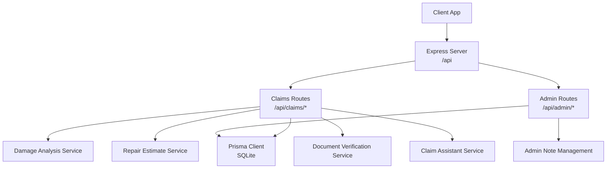
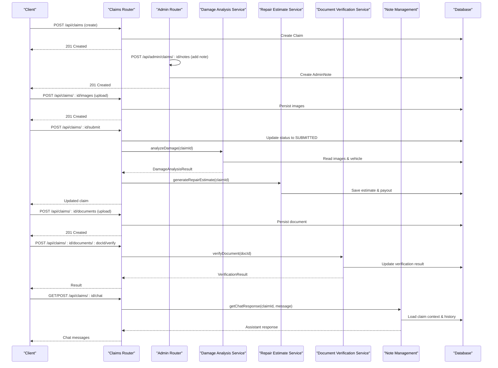
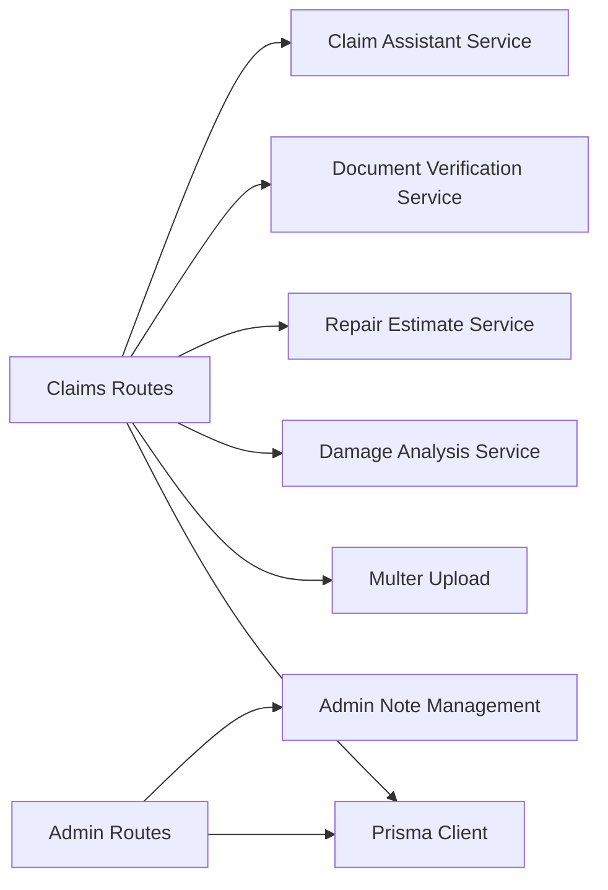
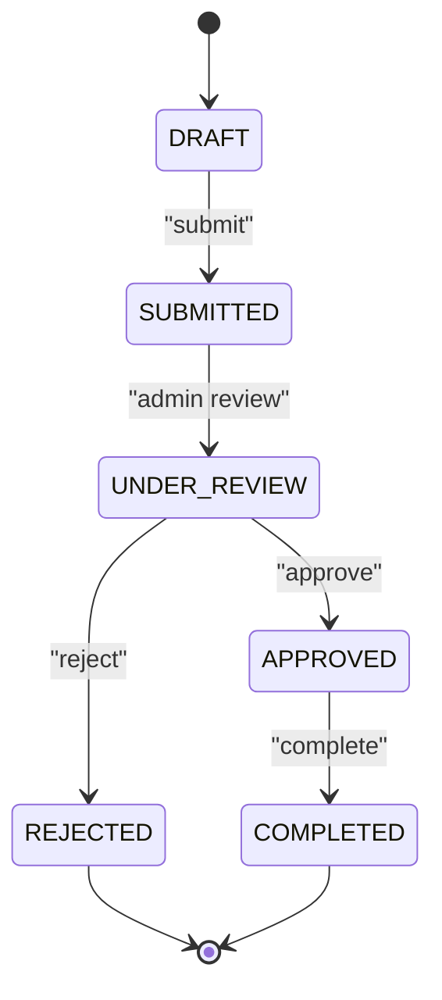
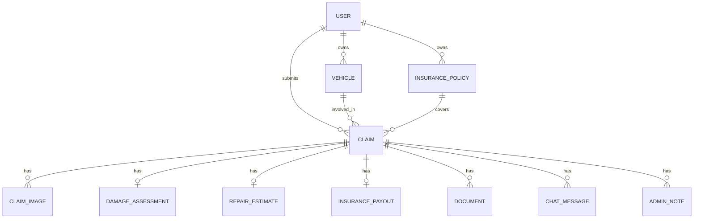
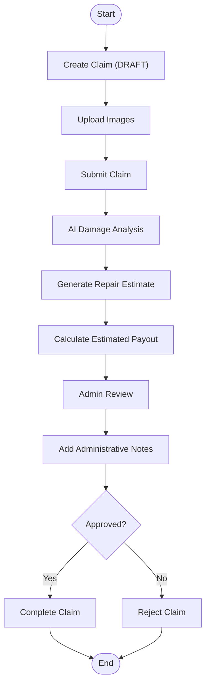
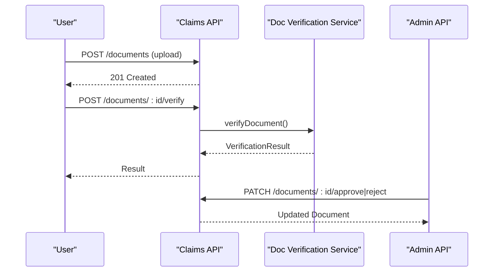
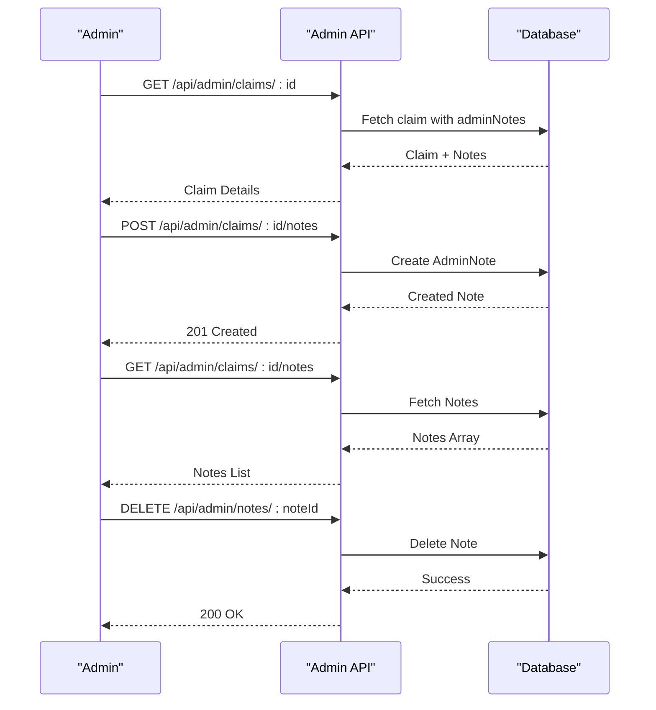

# Claims Processing Endpoints

<cite>
**Referenced Files in This Document**
- [index.ts](file://backend/src/index.ts)
- [claims.ts](file://backend/src/routes/claims.ts)
- [admin.ts](file://backend/src/routes/admin.ts)
- [damageAnalysisService.ts](file://backend/src/services/damageAnalysisService.ts)
- [repairEstimateService.ts](file://backend/src/services/repairEstimateService.ts)
- [documentVerificationService.ts](file://backend/src/services/documentVerificationService.ts)
- [claimAssistantService.ts](file://backend/src/services/claimAssistantService.ts)
- [upload.ts](file://backend/src/middleware/upload.ts)
- [schema.prisma](file://backend/prisma/schema.prisma)
- [types/index.ts](file://backend/src/types/index.ts)
</cite>

## Update Summary
**Changes Made**
- Added documentation for three new admin note management endpoints
- Updated Admin Endpoints section with GET, POST, and DELETE operations for claim notes
- Enhanced Admin Claim Detail workflow to include note management functionality
- Updated data models overview to include AdminNote entity
- Added example workflows demonstrating note creation and management

## Table of Contents
1. [Introduction](#introduction)
2. [Project Structure](#project-structure)
3. [Core Components](#core-components)
4. [Architecture Overview](#architecture-overview)
5. [Detailed Component Analysis](#detailed-component-analysis)
6. [Dependency Analysis](#dependency-analysis)
7. [Performance Considerations](#performance-considerations)
8. [Troubleshooting Guide](#troubleshooting-guide)
9. [Conclusion](#conclusion)
10. [Appendices](#appendices)

## Introduction
This document provides comprehensive API documentation for claims processing endpoints in the Smart Vehicle Insurance Claim System. It covers claim submission, status tracking, image and document uploads, AI-powered damage assessment, repair estimate generation, document verification, chat assistance, and administrative note management. It also documents workflow state management from claim creation to resolution, including integration points with damage analysis services and insurance payout calculations.

## Project Structure
The backend exposes RESTful APIs under /api. The claims module is mounted at /api/claims and includes endpoints for CRUD operations, file uploads, AI analysis triggers, estimates, document handling, and chat. Admin endpoints are available under /api/admin for operational workflows such as status updates, document approvals, and administrative note management.

**Diagram sources**
- [index.ts:25-45](file://backend/src/index.ts#L25-L45)
- [claims.ts:1-15](file://backend/src/routes/claims.ts#L1-L15)
- [admin.ts:1-7](file://backend/src/routes/admin.ts#L1-L7)

**Section sources**
- [index.ts:25-45](file://backend/src/index.ts#L25-L45)

## Core Components
- Claims routes handle lifecycle operations: create, read, update, submit, analyze, estimate, upload images/documents, verify documents, and chat interactions.
- Services implement AI-driven features:
  - Damage analysis using a vision model to detect damages and severity.
  - Repair estimate generation based on detected damages and policy deductible.
  - Document verification to validate uploaded documents.
  - Chat assistant that answers user questions with context-aware responses.
- Admin note management enables administrators to add contextual notes to claims for review purposes.
- Middleware handles authentication and file uploads with size/type constraints.
- Data models define entities like Claim, DamageAssessment, RepairEstimate, InsurancePayout, Document, ChatMessage, and AdminNote.

**Section sources**
- [claims.ts:20-447](file://backend/src/routes/claims.ts#L20-L447)
- [damageAnalysisService.ts:50-153](file://backend/src/services/damageAnalysisService.ts#L50-L153)
- [repairEstimateService.ts:104-199](file://backend/src/services/repairEstimateService.ts#L104-L199)
- [documentVerificationService.ts:41-106](file://backend/src/services/documentVerificationService.ts#L41-L106)
- [claimAssistantService.ts:19-130](file://backend/src/services/claimAssistantService.ts#L19-L130)
- [upload.ts:1-54](file://backend/src/middleware/upload.ts#L1-L54)
- [schema.prisma:62-214](file://backend/prisma/schema.prisma#L62-L214)

## Architecture Overview
The claims API orchestrates multiple services to automate and streamline the claims process:
- Submission triggers background AI damage analysis and auto-generates repair estimates when possible.
- Estimates incorporate policy deductibles to compute estimated payouts.
- Documents can be verified via AI and approved/rejected by admins.
- Chat assistant provides contextual guidance throughout the claim lifecycle.
- Administrative notes provide audit trail and communication channel between reviewers.

**Diagram sources**
- [claims.ts:20-447](file://backend/src/routes/claims.ts#L20-L447)
- [admin.ts:169-219](file://backend/src/routes/admin.ts#L169-L219)
- [damageAnalysisService.ts:50-153](file://backend/src/services/damageAnalysisService.ts#L50-L153)
- [repairEstimateService.ts:104-199](file://backend/src/services/repairEstimateService.ts#L104-L199)
- [documentVerificationService.ts:41-106](file://backend/src/services/documentVerificationService.ts#L41-L106)
- [claimAssistantService.ts:19-130](file://backend/src/services/claimAssistantService.ts#L19-L130)

## Detailed Component Analysis

### Claims Endpoints
Base path: /api/claims (requires authentication)

- Create Claim
  - Method: POST
  - Path: /api/claims
  - Request body fields: vehicleId, incidentDate, incidentLocation, incidentDescription, weatherConditions (optional), hasPoliceReport (optional), policyId (optional)
  - Response: created claim object
  - Notes: Validates required fields; checks vehicle ownership; sets default status DRAFT

- List Claims
  - Method: GET
  - Path: /api/claims?status={DRAFT|SUBMITTED|UNDER_REVIEW|APPROVED|REJECTED|COMPLETED}
  - Response: array of claims with vehicle summary, damage severity, and counts of images/documents

- Get Claim Detail
  - Method: GET
  - Path: /api/claims/:id
  - Response: full claim with related vehicle, policy, images, damage assessment, repair estimate, insurance payout, documents, and chat messages

- Update Claim
  - Method: PUT
  - Path: /api/claims/:id
  - Request body fields: incidentDate, incidentLocation, incidentDescription, weatherConditions, hasPoliceReport, policyId (all optional)
  - Response: updated claim
  - Notes: Only allowed when status is DRAFT

- Submit Claim
  - Method: POST
  - Path: /api/claims/:id/submit
  - Response: updated claim with status SUBMITTED
  - Notes: Requires at least one image; triggers background AI damage analysis

- Upload Images
  - Method: POST
  - Path: /api/claims/:id/images
  - Form fields: images (multipart, up to 10), imageType (FULL_VEHICLE or DAMAGE_CLOSEUP), label (optional)
  - Response: created image records
  - Notes: Enforces file type and size limits via middleware

- Delete Image
  - Method: DELETE
  - Path: /api/claims/:id/images/:imageId
  - Response: success message
  - Notes: Deletes file from disk and database record

- Trigger AI Damage Analysis
  - Method: POST
  - Path: /api/claims/:id/analyze
  - Response: damage analysis result
  - Notes: Reads images, calls AI service, saves assessment, updates image annotations, auto-generates estimate if possible

- Generate Repair Estimate
  - Method: POST
  - Path: /api/claims/:id/estimate
  - Response: repair estimate with items, totals, and estimated days
  - Notes: Requires prior damage assessment; calculates payout if policy exists

- Upload Document
  - Method: POST
  - Path: /api/claims/:id/documents
  - Form fields: document (multipart), documentType (LICENSE|REGISTRATION|ACCIDENT_REPORT|REPAIR_ESTIMATE)
  - Response: created document record

- List Documents
  - Method: GET
  - Path: /api/claims/:id/documents
  - Response: array of documents for the claim

- Verify Document
  - Method: POST
  - Path: /api/claims/:id/documents/:docId/verify
  - Response: verification result (VERIFIED|ISSUES_FOUND|UNREADABLE)
  - Notes: Calls AI verification service and updates document record

- Chat Messages
  - GET /api/claims/:id/chat: returns chat history
  - POST /api/claims/:id/chat: sends a message and receives assistant response; persists both user and assistant messages

Authentication: All endpoints require a valid JWT token via auth middleware.

Error handling: Standardized error responses with descriptive messages; 404 for not found, 400 for validation errors, 500 for server errors.

**Section sources**
- [claims.ts:20-447](file://backend/src/routes/claims.ts#L20-L447)
- [upload.ts:1-54](file://backend/src/middleware/upload.ts#L1-L54)

### Admin Endpoints
Base path: /api/admin (requires admin authentication)

- Stats
  - GET /api/admin/stats: returns user count, claims by status, document counts, pending documents

- Users
  - GET /api/admin/users: lists non-admin users with counts

- Claims
  - GET /api/admin/claims: list claims with filters (status, search)
  - GET /api/admin/claims/:id: detailed claim view with associated admin notes

- Status Management
  - PATCH /api/admin/claims/:id/status: update claim status (valid values defined in schema)

- Documents
  - GET /api/admin/documents: list documents filtered by verification status
  - PATCH /api/admin/documents/:id/approve: mark document as VERIFIED
  - PATCH /api/admin/documents/:id/reject: mark document as ISSUES_FOUND with reason

- **Admin Note Management** *(New)*
  - **GET /api/admin/claims/:id/notes**: retrieves all administrative notes for a specific claim, ordered by creation date (newest first)
    - Response: array of AdminNote objects with id, claimId, category, content, createdAt, updatedAt
    - Categories: "vehicle", "document", "general"
  
  - **POST /api/admin/claims/:id/notes**: creates a new administrative note for a claim
    - Request body: { category: string, content: string }
    - Validation: content must be non-empty after trimming; category defaults to "general" if invalid
    - Response: created AdminNote object with 201 status code
  
  - **DELETE /api/admin/notes/:noteId**: deletes a specific administrative note by its ID
    - Response: success message with 200 status code

**Updated** Added three new endpoints for comprehensive administrative note management, enabling reviewers to add contextual information, track decisions, and maintain an audit trail for each claim.

**Section sources**
- [admin.ts:11-239](file://backend/src/routes/admin.ts#L11-L239)

### AI-Powered Damage Assessment
- Input: claim images and vehicle context
- Output: structured JSON with damages, drivability assessment, overall severity
- Behavior:
  - Reads images from storage, encodes to base64, sends to vision model
  - Parses JSON response; fallback to MINOR severity if parsing fails
  - Saves or updates DamageAssessment record
  - Updates per-image AI annotations
  - Auto-triggers repair estimate generation

Complexity considerations:
- Image I/O and base64 encoding scale linearly with number of images
- Model call latency depends on image size and network conditions
- Fallback logic ensures robustness against parsing failures

**Section sources**
- [damageAnalysisService.ts:50-153](file://backend/src/services/damageAnalysisService.ts#L50-L153)

### Repair Estimate Generation
- Input: damage assessment items
- Output: itemized costs, totals, estimated repair days
- Behavior:
  - Uses cost lookup tables and labor rates based on severity
  - Computes part costs, labor hours/costs, paint materials
  - Saves RepairEstimate record
  - If policy linked, computes deductible, covered amount, and estimated payout; saves InsurancePayout

Optimization opportunities:
- Cache cost ranges and labor rates
- Batch updates for large damage sets
- Parallelize independent calculations where applicable

**Section sources**
- [repairEstimateService.ts:104-199](file://backend/src/services/repairEstimateService.ts#L104-L199)

### Document Verification
- Input: uploaded document image and type
- Output: verification status, issues, extracted info, recommendations
- Behavior:
  - Reads document file, encodes to base64, sends to vision model with context
  - Parses JSON response; fallback to UNREADABLE with manual review recommendation
  - Updates document verification status and result

Integration points:
- Admin approval/rejection flows override or refine AI results
- Required document types enforced by client and validated by server

**Section sources**
- [documentVerificationService.ts:41-106](file://backend/src/services/documentVerificationService.ts#L41-L106)
- [admin.ts:151-183](file://backend/src/routes/admin.ts#L151-L183)

### Chat Assistant
- Contextual responses built from claim data, policy, damage assessment, estimate, payout, and document statuses
- Maintains conversation history per claim
- Persists user and assistant messages

Usage patterns:
- Retrieve chat history for UI display
- Send new messages to receive actionable guidance

**Section sources**
- [claimAssistantService.ts:19-130](file://backend/src/services/claimAssistantService.ts#L19-L130)

## Dependency Analysis
The claims module depends on:
- Prisma for data access and relationships
- Multer middleware for file uploads with type/size constraints
- AI services for damage analysis, document verification, and chat assistance
- Admin routes for operational control over status, documents, and administrative notes

**Diagram sources**
- [claims.ts:1-15](file://backend/src/routes/claims.ts#L1-L15)
- [admin.ts:1-7](file://backend/src/routes/admin.ts#L1-L7)
- [upload.ts:1-54](file://backend/src/middleware/upload.ts#L1-L54)

**Section sources**
- [claims.ts:1-15](file://backend/src/routes/claims.ts#L1-L15)
- [admin.ts:1-7](file://backend/src/routes/admin.ts#L1-L7)
- [upload.ts:1-54](file://backend/src/middleware/upload.ts#L1-L54)

## Performance Considerations
- File uploads: Enforce size limits and allowed MIME types to prevent abuse and reduce processing overhead.
- AI calls: Minimize payload size by compressing images before upload; consider batching images if supported by the model.
- Background processing: Submitting a claim triggers asynchronous analysis; ensure queueing or retries for reliability.
- Database queries: Use selective includes to avoid loading unnecessary relations; paginate large lists where applicable.
- Caching: Consider caching static cost tables and frequently accessed metadata to reduce computation.
- Note management: Admin notes are lightweight text operations with minimal performance impact.

[No sources needed since this section provides general guidance]

## Troubleshooting Guide
Common issues and resolutions:
- Missing environment variables: Ensure JWT_SECRET, GEMINI_API_KEY, DATABASE_URL are set at startup.
- Upload errors: Validate file types and sizes; check upload directory permissions.
- AI parsing failures: Fallback behavior sets conservative defaults; retry with clearer images or adjust prompts.
- Not found errors: Verify claim IDs and user authorization; ensure resources exist before operations.
- Status transitions: Only DRAFT claims can be edited; submissions require images; admin-only endpoints require admin auth.
- Note management errors: Ensure claim exists before creating notes; validate note content is not empty; verify admin authentication.

Operational tips:
- Use health endpoint to verify service connectivity.
- Monitor logs for background task failures and database errors.
- Leverage admin endpoints to correct document verification states, claim statuses, and manage administrative notes.

**Section sources**
- [index.ts:15-22](file://backend/src/index.ts#L15-L22)
- [upload.ts:30-41](file://backend/src/middleware/upload.ts#L30-L41)
- [damageAnalysisService.ts:85-103](file://backend/src/services/damageAnalysisService.ts#L85-L103)
- [documentVerificationService.ts:78-94](file://backend/src/services/documentVerificationService.ts#L78-L94)
- [admin.ts:187-198](file://backend/src/routes/admin.ts#L187-L198)

## Conclusion
The claims processing API provides a robust, automated workflow from submission to resolution, integrating AI-powered damage assessment, repair estimate generation, document verification, contextual chat assistance, and administrative note management. Admin endpoints enable operational control over statuses, documents, and comprehensive note-taking capabilities. The system balances automation with human oversight to ensure accuracy and compliance while maintaining detailed audit trails through administrative notes.

[No sources needed since this section summarizes without analyzing specific files]

## Appendices

### HTTP Methods and URL Patterns Summary
- POST /api/claims
- GET /api/claims
- GET /api/claims/:id
- PUT /api/claims/:id
- POST /api/claims/:id/submit
- POST /api/claims/:id/images
- DELETE /api/claims/:id/images/:imageId
- POST /api/claims/:id/analyze
- POST /api/claims/:id/estimate
- POST /api/claims/:id/documents
- GET /api/claims/:id/documents
- POST /api/claims/:id/documents/:docId/verify
- GET /api/claims/:id/chat
- POST /api/claims/:id/chat
- GET /api/admin/stats
- GET /api/admin/users
- GET /api/admin/claims
- GET /api/admin/claims/:id
- PATCH /api/admin/claims/:id/status
- GET /api/admin/documents
- PATCH /api/admin/documents/:id/approve
- PATCH /api/admin/documents/:id/reject
- **GET /api/admin/claims/:id/notes** *(New)*
- **POST /api/admin/claims/:id/notes** *(New)*
- **DELETE /api/admin/notes/:noteId** *(New)*

**Section sources**
- [claims.ts:20-447](file://backend/src/routes/claims.ts#L20-L447)
- [admin.ts:11-239](file://backend/src/routes/admin.ts#L11-L239)

### Workflow State Management
Claim statuses follow a defined lifecycle:
- DRAFT: Initial state; editable until submission
- SUBMITTED: After submission; triggers AI analysis and estimate generation
- UNDER_REVIEW: Administrative review phase
- APPROVED: Claim accepted; payout calculation applied
- REJECTED: Claim declined; reasons documented
- COMPLETED: Finalized; repairs completed and payments processed

**Diagram sources**
- [schema.prisma:62-69](file://backend/prisma/schema.prisma#L62-L69)
- [admin.ts:105-123](file://backend/src/routes/admin.ts#L105-L123)

**Section sources**
- [schema.prisma:62-69](file://backend/prisma/schema.prisma#L62-L69)
- [admin.ts:105-123](file://backend/src/routes/admin.ts#L105-L123)

### Data Models Overview
Key entities and relationships:
- User owns Vehicles and Policies; Claims link to User, Vehicle, and optionally Policy
- ClaimImage attached to Claim; DamageAssessment linked to Claim; RepairEstimate linked to DamageAssessment and Claim; InsurancePayout linked to Claim and RepairEstimate
- Document attached to Claim with verification status and result
- ChatMessage associated with Claim
- **AdminNote attached to Claim with category classification and timestamp tracking** *(New)*

**Diagram sources**
- [schema.prisma:10-214](file://backend/prisma/schema.prisma#L10-L214)

**Section sources**
- [schema.prisma:10-214](file://backend/prisma/schema.prisma#L10-L214)

### Example Workflows

#### Claim Submission and AI Analysis
- Steps:
  - Create claim (DRAFT)
  - Upload images
  - Submit claim (status becomes SUBMITTED)
  - Background AI analyzes images and generates damage assessment
  - Repair estimate generated automatically; payout calculated if policy exists
  - Admin reviews and updates status as needed

**Diagram sources**
- [claims.ts:20-193](file://backend/src/routes/claims.ts#L20-L193)
- [damageAnalysisService.ts:50-153](file://backend/src/services/damageAnalysisService.ts#L50-L153)
- [repairEstimateService.ts:104-199](file://backend/src/services/repairEstimateService.ts#L104-L199)
- [admin.ts:105-123](file://backend/src/routes/admin.ts#L105-L123)
- [admin.ts:169-219](file://backend/src/routes/admin.ts#L169-L219)

#### Document Verification Flow
- Steps:
  - Upload document
  - Trigger verification
  - AI returns status and recommendations
  - Admin approves or rejects if necessary

**Diagram sources**
- [claims.ts:316-397](file://backend/src/routes/claims.ts#L316-L397)
- [documentVerificationService.ts:41-106](file://backend/src/services/documentVerificationService.ts#L41-L106)
- [admin.ts:151-183](file://backend/src/routes/admin.ts#L151-L183)

#### Administrative Note Management Flow *(New)*
- Steps:
  - Admin accesses claim detail page
  - Adds contextual notes with categories (vehicle, document, general)
  - Reviews existing notes and their timestamps
  - Deletes notes as needed during the review process

**Diagram sources**
- [admin.ts:169-219](file://backend/src/routes/admin.ts#L169-L219)
- [schema.prisma:204-213](file://backend/prisma/schema.prisma#L204-L213)

**Section sources**
- [admin.ts:169-219](file://backend/src/routes/admin.ts#L169-L219)
- [schema.prisma:204-213](file://backend/prisma/schema.prisma#L204-L213)