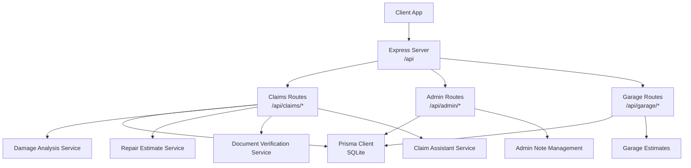
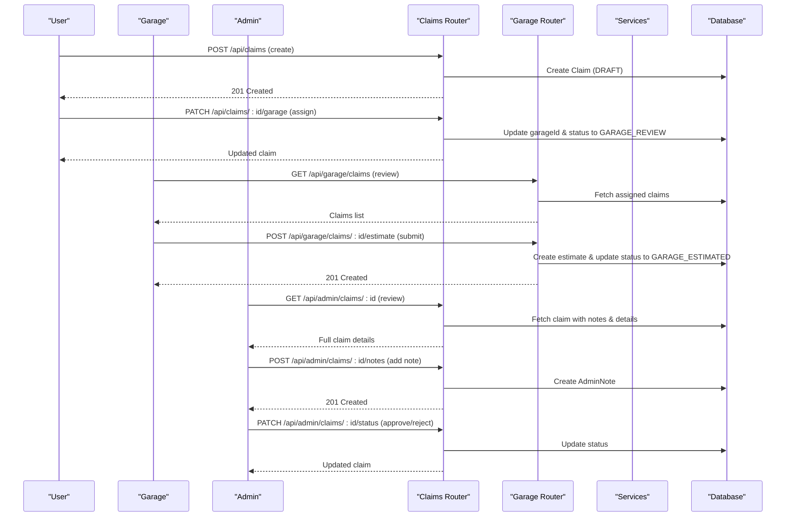
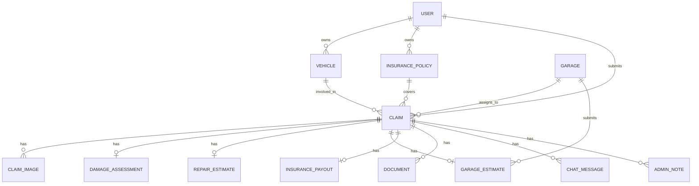
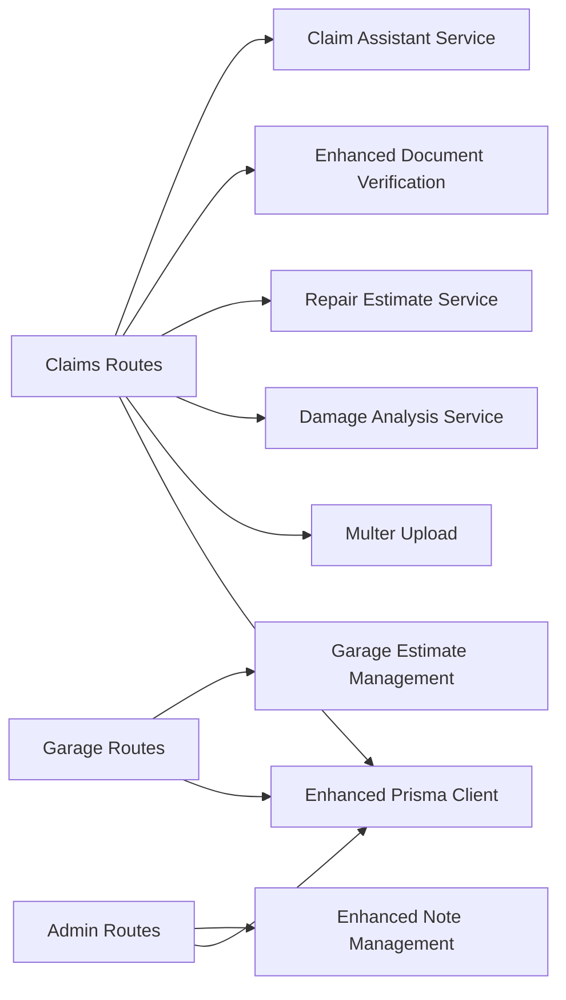
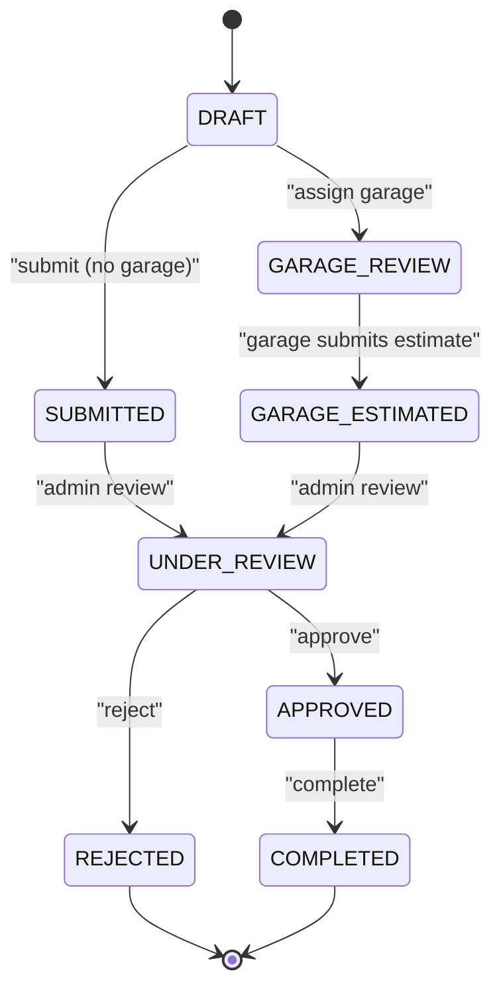
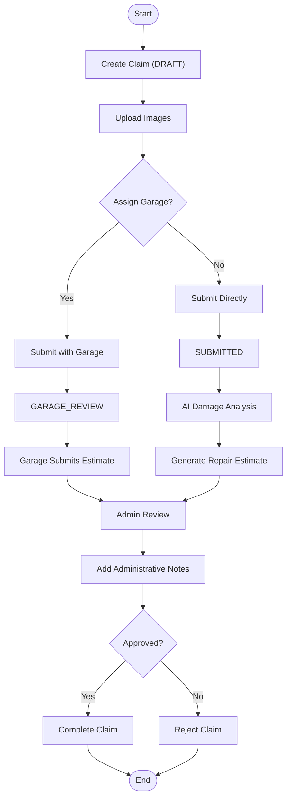
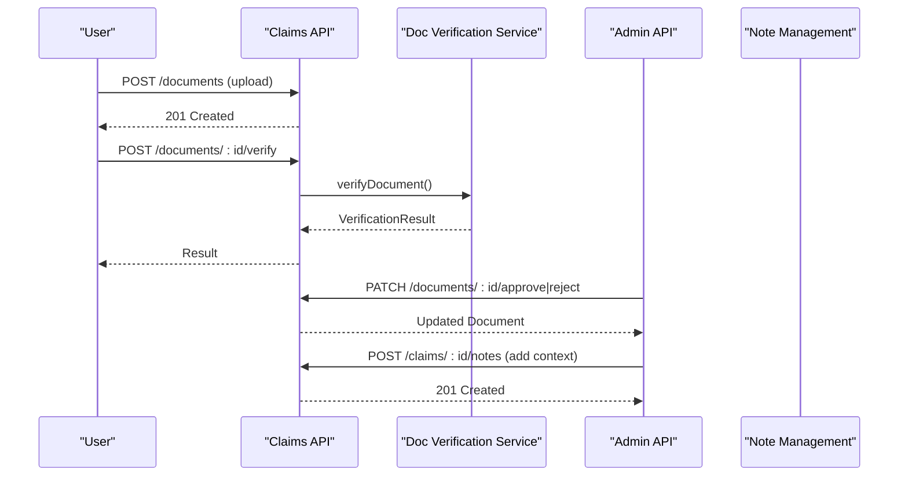
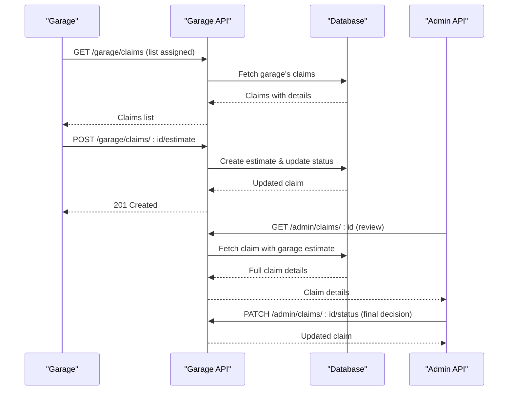

# Claims Processing Endpoints

<cite>
**Referenced Files in This Document**
- [index.ts](file://backend/src/index.ts)
- [claims.ts](file://backend/src/routes/claims.ts)
- [admin.ts](file://backend/src/routes/admin.ts)
- [garage.ts](file://backend/src/routes/garage.ts)
- [damageAnalysisService.ts](file://backend/src/services/damageAnalysisService.ts)
- [repairEstimateService.ts](file://backend/src/services/repairEstimateService.ts)
- [documentVerificationService.ts](file://backend/src/services/documentVerificationService.ts)
- [claimAssistantService.ts](file://backend/src/services/claimAssistantService.ts)
- [upload.ts](file://backend/src/middleware/upload.ts)
- [errorHandler.ts](file://backend/src/middleware/errorHandler.ts)
- [schema.prisma](file://backend/prisma/schema.prisma)
- [types/index.ts](file://backend/src/types/index.ts)
</cite>

## Update Summary
**Changes Made**
- Enhanced claims API with comprehensive garage assignment workflow including new `/api/claims/:id/garage` endpoint
- Improved status transitions with new GARAGE_REVIEW and GARAGE_ESTIMATED states
- Added enhanced document verification capabilities with improved AI-powered validation
- Expanded admin endpoints with comprehensive note management system
- Integrated garage-specific endpoints for estimate submission and claim management
- **Updated error handling with improved classification distinguishing between known preconditions (400 Bad Request) and AI service failures (502 Bad Gateway)**
- Updated data models to support garage relationships and enhanced workflow tracking

## Table of Contents
1. [Introduction](#introduction)
2. [Project Structure](#project-structure)
3. [Core Components](#core-components)
4. [Architecture Overview](#architecture-overview)
5. [Detailed Component Analysis](#detailed-component-analysis)
6. [Dependency Analysis](#dependency-analysis)
7. [Performance Considerations](#performance-considerations)
8. [Troubleshooting Guide](#troubleshooting-guide)
9. [Conclusion](#conclusion)
10. [Appendices](#appendices)

## Introduction
This document provides comprehensive API documentation for claims processing endpoints in the Smart Vehicle Insurance Claim System. It covers claim submission, status tracking, image and document uploads, AI-powered damage assessment, repair estimate generation, document verification, chat assistance, administrative note management, and enhanced garage assignment workflows. The system now supports a complete claims lifecycle from submission through garage review and estimation to final resolution, with robust state management, audit trails, and **improved error classification for better client-side user feedback**.

## Project Structure
The backend exposes RESTful APIs under /api with specialized route modules:
- **Claims**: Core claim operations, garage assignment, file uploads, AI analysis triggers, estimates, document handling, and chat
- **Admin**: Operational control over statuses, documents, garages, and administrative notes
- **Garage**: Garage-specific operations for claim review and estimate submission
- **Authentication**: User, admin, and garage authentication flows



**Diagram sources**
- [index.ts:44-51](file://backend/src/index.ts#L44-L51)
- [claims.ts:1-15](file://backend/src/routes/claims.ts#L1-L15)
- [admin.ts:1-7](file://backend/src/routes/admin.ts#L1-L7)
- [garage.ts:1-7](file://backend/src/routes/garage.ts#L1-L7)

**Section sources**
- [index.ts:44-51](file://backend/src/index.ts#L44-L51)

## Core Components
- **Enhanced Claims Routes**: Handle complete lifecycle operations including garage assignment, status transitions, CRUD operations, file uploads, AI analysis triggers, estimates, document handling, and chat interactions
- **Advanced Services**: AI-driven features including damage analysis, repair estimate generation, document verification, and contextual chat assistance
- **Garage Integration**: Dedicated endpoints for garage claim review, estimate submission, and workflow management
- **Administrative Controls**: Comprehensive note management, status control, document approval/rejection, and garage management
- **Enhanced Data Models**: Support for garage relationships, improved status tracking, and comprehensive audit trails
- **Improved Error Classification**: Enhanced error handling that distinguishes between known preconditions (400 Bad Request) and AI service failures (502 Bad Gateway) for better client-side user feedback

**Section sources**
- [claims.ts:17-532](file://backend/src/routes/claims.ts#L17-L532)
- [garage.ts:11-136](file://backend/src/routes/garage.ts#L11-L136)
- [admin.ts:11-300](file://backend/src/routes/admin.ts#L11-L300)

## Architecture Overview
The enhanced claims API orchestrates multiple services and stakeholders to automate and streamline the entire claims process:
- **Submission Workflow**: Triggers background AI damage analysis and auto-generates repair estimates when possible
- **Garage Assignment**: Allows users to select approved garages, moving claims to GARAGE_REVIEW status
- **Garage Estimation**: Garages can submit detailed estimates, updating status to GARAGE_ESTIMATED
- **Document Verification**: AI-powered validation with admin override capabilities
- **Chat Assistance**: Contextual guidance throughout the entire claim lifecycle
- **Administrative Oversight**: Comprehensive note-taking, status management, and audit trails
- **Enhanced Error Handling**: Intelligent error classification providing actionable feedback to clients



**Diagram sources**
- [claims.ts:38-274](file://backend/src/routes/claims.ts#L38-L274)
- [garage.ts:11-136](file://backend/src/routes/garage.ts#L11-L136)
- [admin.ts:81-127](file://backend/src/routes/admin.ts#L81-L127)

## Detailed Component Analysis

### Enhanced Claims Endpoints
Base path: /api/claims (requires authentication)

#### Garage Assignment Workflow *(New)*
- **List Available Garages**
  - Method: GET
  - Path: /api/claims/garages
  - Response: array of active, approved garages with contact information and specialties
  
- **Assign/Change Garage**
  - Method: PATCH
  - Path: /api/claims/:id/garage
  - Request body: { garageId: string }
  - Response: updated claim with garage assignment
  - Validation: 
    - Prevents changes after garage estimate submission
    - Blocks changes for finalized claims (APPROVED, COMPLETED, REJECTED)
    - Requires valid, active, approved garage
  - Status Transition: Moves to GARAGE_REVIEW if claim was already submitted

#### Standard Claim Operations
- **Create Claim**
  - Method: POST
  - Path: /api/claims
  - Request body fields: vehicleId, policyId, garageId (optional), incidentDate, incidentLocation, incidentDescription, weatherConditions (optional), hasPoliceReport (optional)
  - Response: created claim object with default DRAFT status
  
- **Submit Claim**
  - Method: POST
  - Path: /api/claims/:id/submit
  - Response: updated claim with status transition logic:
    - If garage assigned: moves to GARAGE_REVIEW
    - Otherwise: moves to SUBMITTED
  - Validation: Requires at least one image; prevents resubmission
  
- **Update Claim**
  - Method: PUT
  - Path: /api/claims/:id
  - Request body fields: All optional except garageId which can be set during draft phase
  - Response: updated claim
  - Validation: Only allowed when status is DRAFT

#### File and Document Management
- **Upload Images**
  - Method: POST
  - Path: /api/claims/:id/images
  - Form fields: images (multipart, up to 10), imageType (FULL_VEHICLE or DAMAGE_CLOSEUP), label (optional)
  - Response: created image records
  
- **Delete Image**
  - Method: DELETE
  - Path: /api/claims/:id/images/:imageId
  - Response: success message with file cleanup
  
- **Upload Document**
  - Method: POST
  - Path: /api/claims/:id/documents
  - Form fields: document (multipart), documentType (LICENSE|REGISTRATION|ACCIDENT_REPORT|REPAIR_ESTIMATE)
  - Response: created document record with PENDING verification status

#### AI-Powered Features with Enhanced Error Handling
- **Trigger AI Damage Analysis**
  - Method: POST
  - Path: /api/claims/:id/analyze
  - Response: damage analysis result with severity assessment
  - **Enhanced Error Handling**: 
    - Returns 400 Bad Request for known preconditions (missing images, invalid claim)
    - Returns 502 Bad Gateway for AI service failures with retryable error messages
    - Provides actionable error messages for client-side handling

- **Generate Repair Estimate**
  - Method: POST
  - Path: /api/claims/:id/estimate
  - Response: repair estimate with items, totals, and estimated days
  - Validation: Requires prior damage assessment completion
  
- **Verify Document**
  - Method: POST
  - Path: /api/claims/:id/documents/:docId/verify
  - Response: verification result (VERIFIED|ISSUES_FOUND|UNREADABLE)
  - Behavior: AI-powered document validation with fallback handling

#### Communication
- **Chat Messages**
  - GET /api/claims/:id/chat: returns chat history
  - POST /api/claims/:id/chat: sends message and receives assistant response

**Updated** Enhanced error classification now distinguishes between client errors (400) and server/AI service errors (502) for better user experience

**Section sources**
- [claims.ts:17-532](file://backend/src/routes/claims.ts#L17-L532)

### Enhanced Admin Endpoints
Base path: /api/admin (requires admin authentication)

#### Administrative Note Management *(Enhanced)*
- **Get Claim Notes**
  - Method: GET
  - Path: /api/admin/claims/:id/notes
  - Response: array of AdminNote objects ordered by creation date (newest first)
  - Categories: "vehicle", "document", "general"
  
- **Create Administrative Note**
  - Method: POST
  - Path: /api/admin/claims/:id/notes
  - Request body: { category: string, content: string }
  - Validation: Content must be non-empty; category defaults to "general" if invalid
  - Response: created AdminNote with 201 status code
  
- **Delete Administrative Note**
  - Method: DELETE
  - Path: /api/admin/notes/:noteId
  - Response: success message with 200 status code

#### Enhanced Status Management
- **Update Claim Status**
  - Method: PATCH
  - Path: /api/admin/claims/:id/status
  - Valid statuses: DRAFT, SUBMITTED, UNDER_REVIEW, GARAGE_REVIEW, GARAGE_ESTIMATED, APPROVED, REJECTED, COMPLETED
  - Response: updated claim with new status

#### Document Management
- **List Documents**
  - Method: GET
  - Path: /api/admin/documents
  - Query parameters: status filter (PENDING, VERIFIED, ISSUES_FOUND, UNREADABLE, ALL)
  - Response: documents with claim context and verification status
  
- **Approve Document**
  - Method: PATCH
  - Path: /api/admin/documents/:id/approve
  - Response: updated document with VERIFIED status
  
- **Reject Document**
  - Method: PATCH
  - Path: /api/admin/documents/:id/reject
  - Request body: { reason: string }
  - Response: updated document with ISSUES_FOUND status

#### Garage Management
- **List Garages**
  - Method: GET
  - Path: /api/admin/garages
  - Response: all garages with activity counts and approval status
  
- **Approve Garage**
  - Method: PATCH
  - Path: /api/admin/garages/:id/approve
  - Response: updated garage with isApproved and isActive flags
  
- **Toggle Garage Activity**
  - Method: PATCH
  - Path: /api/admin/garages/:id/toggle
  - Response: updated garage with toggled isActive status

**Section sources**
- [admin.ts:11-300](file://backend/src/routes/admin.ts#L11-L300)

### Garage-Specific Endpoints
Base path: /api/garage (requires garage authentication)

#### Garage Claim Management
- **List Assigned Claims**
  - Method: GET
  - Path: /api/garage/claims
  - Query parameters: status filter
  - Response: claims assigned to this garage with full details including damage assessment and existing estimates
  
- **Get Claim Detail**
  - Method: GET
  - Path: /api/garage/claims/:id
  - Response: detailed claim information including user contacts, vehicle details, images, assessments, and admin notes

#### Garage Estimate Submission
- **Submit/Update Estimate**
  - Method: POST
  - Path: /api/garage/claims/:id/estimate
  - Request body: { items: array, totalPartsCost: number, totalLaborCost: number, totalCost: number, estimatedDays: number, notes: string }
  - Validation: Requires AI damage assessment completion; validates item structure
  - Response: created or updated garage estimate
  - Status Transition: Automatically updates claim status to GARAGE_ESTIMATED

**Section sources**
- [garage.ts:11-136](file://backend/src/routes/garage.ts#L11-L136)

### Enhanced Document Verification
- **AI-Powered Analysis**: Advanced document type identification and completeness checking
- **Context-Aware Validation**: Uses claim context (vehicle info, policyholder details) for verification
- **Fallback Handling**: Graceful degradation to manual review when AI parsing fails
- **Admin Override**: Manual approval/rejection capabilities with reason tracking

**Section sources**
- [documentVerificationService.ts:41-105](file://backend/src/services/documentVerificationService.ts#L41-L105)

### Enhanced Data Models
Key entities and relationships with improvements:
- **Claim**: Now includes garageId relationship and enhanced status tracking
- **Garage**: Supports claim assignments and estimate submissions
- **GarageEstimate**: Links garages to specific claims with detailed cost breakdowns
- **AdminNote**: Provides audit trail and communication channel for reviewers
- **Enhanced Status Flow**: DRAFT → SUBMITTED/GARAGE_REVIEW → UNDER_REVIEW/GARAGE_ESTIMATED → APPROVED/REJECTED → COMPLETED



**Diagram sources**
- [schema.prisma:73-100](file://backend/prisma/schema.prisma#L73-L100)
- [schema.prisma:220-255](file://backend/prisma/schema.prisma#L220-L255)

**Section sources**
- [schema.prisma:73-255](file://backend/prisma/schema.prisma#L73-L255)

## Dependency Analysis
The enhanced claims module depends on:
- **Prisma**: Enhanced data access with garage relationships and improved query capabilities
- **Multer**: File upload middleware with type/size constraints for images and documents
- **AI Services**: Damage analysis, document verification, and chat assistance with fallback mechanisms
- **Authentication**: Multi-role authentication (user, admin, garage) with appropriate middleware
- **Status Management**: Complex state transitions with validation rules
- **Enhanced Error Handling**: Improved error classification for better client-side feedback



**Diagram sources**
- [claims.ts:1-15](file://backend/src/routes/claims.ts#L1-L15)
- [admin.ts:1-7](file://backend/src/routes/admin.ts#L1-L7)
- [garage.ts:1-7](file://backend/src/routes/garage.ts#L1-L7)

**Section sources**
- [claims.ts:1-15](file://backend/src/routes/claims.ts#L1-L15)
- [admin.ts:1-7](file://backend/src/routes/admin.ts#L1-L7)
- [garage.ts:1-7](file://backend/src/routes/garage.ts#L1-L7)

## Performance Considerations
- **File Uploads**: Enforced size limits and MIME type validation prevent abuse and reduce processing overhead
- **AI Calls**: Optimized payload handling with base64 encoding and fallback mechanisms for reliability
- **Background Processing**: Asynchronous damage analysis ensures responsive user experience
- **Database Queries**: Selective includes and optimized queries reduce loading times for complex relationships
- **Caching**: Static cost tables and frequently accessed metadata cached where applicable
- **Garage Workflows**: Efficient filtering and sorting for garage-specific claim lists
- **Note Management**: Lightweight text operations with minimal performance impact
- **Error Handling**: Reduced unnecessary retries through intelligent error classification

## Troubleshooting Guide
Common issues and resolutions:
- **Environment Variables**: Ensure JWT_SECRET, GEMINI_API_KEY, DATABASE_URL are properly configured
- **Upload Errors**: Validate file types and sizes; check upload directory permissions and storage availability
- **AI Parsing Failures**: Fallback behavior provides conservative defaults; retry with clearer images or adjusted prompts
- **Garage Assignment Issues**: Verify garage exists, is active and approved; check claim status restrictions
- **Status Transitions**: Validate current status allows requested transition; ensure prerequisites are met
- **Document Verification**: Check file accessibility; verify AI service connectivity; use admin override when needed
- **Note Management**: Ensure claim exists before creating notes; validate content requirements; verify admin authentication
- **Error Classification**: Use 400 errors for client-side corrections and 502 errors for temporary AI service issues

**Updated** Enhanced error handling now provides better differentiation between fixable client errors (400) and temporary AI service failures (502) for improved user experience

Operational tips:
- Use health endpoint to verify service connectivity and database status
- Monitor logs for background task failures and AI service errors
- Leverage admin endpoints to correct document verification states and manage claim statuses
- Utilize garage endpoints for efficient claim review and estimate management

**Section sources**
- [index.ts:19-25](file://backend/src/index.ts#L19-L25)
- [claims.ts:176-229](file://backend/src/routes/claims.ts#L176-L229)
- [documentVerificationService.ts:76-92](file://backend/src/services/documentVerificationService.ts#L76-L92)

## Conclusion
The enhanced claims processing API provides a comprehensive, automated workflow from submission to resolution, integrating AI-powered damage assessment, repair estimate generation, document verification, contextual chat assistance, administrative note management, and sophisticated garage assignment workflows. The system now supports a complete multi-stakeholder process involving users, garages, and administrators with robust state management, audit trails, operational controls, and **improved error classification for better client-side user feedback**. The enhanced architecture balances automation with human oversight to ensure accuracy and compliance while maintaining detailed tracking throughout the entire claims lifecycle.

## Appendices

### HTTP Methods and URL Patterns Summary
- **Claims Endpoints**:
  - GET /api/claims/garages *(New)*
  - POST /api/claims
  - GET /api/claims
  - GET /api/claims/:id
  - PUT /api/claims/:id
  - PATCH /api/claims/:id/garage *(New)*
  - POST /api/claims/:id/submit
  - POST /api/claims/:id/images
  - DELETE /api/claims/:id/images/:imageId
  - POST /api/claims/:id/analyze *(Enhanced Error Handling)*
  - POST /api/claims/:id/estimate
  - POST /api/claims/:id/documents
  - GET /api/claims/:id/documents
  - POST /api/claims/:id/documents/:docId/verify
  - GET /api/claims/:id/chat
  - POST /api/claims/:id/chat

- **Admin Endpoints**:
  - GET /api/admin/stats
  - GET /api/admin/users
  - GET /api/admin/claims
  - GET /api/admin/claims/:id
  - PATCH /api/admin/claims/:id/status
  - GET /api/admin/documents
  - PATCH /api/admin/documents/:id/approve
  - PATCH /api/admin/documents/:id/reject
  - GET /api/admin/claims/:id/notes *(Enhanced)*
  - POST /api/admin/claims/:id/notes *(Enhanced)*
  - DELETE /api/admin/notes/:noteId *(Enhanced)*
  - GET /api/admin/garages *(New)*
  - PATCH /api/admin/garages/:id/approve *(New)*
  - PATCH /api/admin/garages/:id/toggle *(New)*

- **Garage Endpoints**:
  - GET /api/garage/claims *(New)*
  - GET /api/garage/claims/:id *(New)*
  - POST /api/garage/claims/:id/estimate *(New)*

**Section sources**
- [claims.ts:17-532](file://backend/src/routes/claims.ts#L17-L532)
- [admin.ts:11-300](file://backend/src/routes/admin.ts#L11-L300)
- [garage.ts:11-136](file://backend/src/routes/garage.ts#L11-L136)

### Enhanced Workflow State Management
Claim statuses follow an enhanced lifecycle with garage integration:
- **DRAFT**: Initial state; editable until submission or garage assignment
- **SUBMITTED**: After submission without garage; triggers AI analysis and estimate generation
- **GARAGE_REVIEW**: When garage is assigned; awaits garage review and estimate
- **UNDER_REVIEW**: Administrative review phase
- **GARAGE_ESTIMATED**: When garage submits detailed estimate
- **APPROVED**: Claim accepted; payout calculation applied
- **REJECTED**: Claim declined; reasons documented
- **COMPLETED**: Finalized; repairs completed and payments processed



**Diagram sources**
- [schema.prisma:62-71](file://backend/prisma/schema.prisma#L62-L71)
- [claims.ts:213-222](file://backend/src/routes/claims.ts#L213-L222)
- [garage.ts:122-126](file://backend/src/routes/garage.ts#L122-L126)

**Section sources**
- [schema.prisma:62-71](file://backend/prisma/schema.prisma#L62-L71)
- [claims.ts:213-222](file://backend/src/routes/claims.ts#L213-L222)
- [garage.ts:122-126](file://backend/src/routes/garage.ts#L122-L126)

### Example Workflows

#### Enhanced Claim Submission with Garage Assignment
- Steps:
  - Create claim (DRAFT)
  - Upload images
  - Assign garage (moves to GARAGE_REVIEW) OR submit directly (moves to SUBMITTED)
  - Background AI analyzes images and generates damage assessment
  - Garage reviews and submits detailed estimate (moves to GARAGE_ESTIMATED)
  - Admin reviews and updates status as needed
  - Add administrative notes throughout the process



**Diagram sources**
- [claims.ts:38-274](file://backend/src/routes/claims.ts#L38-L274)
- [garage.ts:67-136](file://backend/src/routes/garage.ts#L67-L136)
- [admin.ts:186-222](file://backend/src/routes/admin.ts#L186-L222)

#### Enhanced Document Verification with Admin Override
- Steps:
  - Upload document
  - Trigger AI verification
  - AI returns status and recommendations
  - Admin can approve or reject with reason
  - Track verification history in admin notes



**Diagram sources**
- [claims.ts:398-479](file://backend/src/routes/claims.ts#L398-L479)
- [documentVerificationService.ts:41-105](file://backend/src/services/documentVerificationService.ts#L41-L105)
- [admin.ts:186-222](file://backend/src/routes/admin.ts#L186-L222)

#### Garage Estimate Submission Flow
- Steps:
  - Garage receives claim assignment (GARAGE_REVIEW)
  - Reviews claim details and damage assessment
  - Submits detailed estimate with cost breakdown
  - System automatically updates status to GARAGE_ESTIMATED
  - Admin reviews garage estimate and makes final decision



**Diagram sources**
- [garage.ts:11-136](file://backend/src/routes/garage.ts#L11-L136)
- [admin.ts:81-127](file://backend/src/routes/admin.ts#L81-L127)

**Section sources**
- [garage.ts:11-136](file://backend/src/routes/garage.ts#L11-L136)
- [admin.ts:81-127](file://backend/src/routes/admin.ts#L81-L127)

### Enhanced Error Classification System

**Updated** The system now implements intelligent error classification to provide better client-side user feedback:

#### Known Preconditions (400 Bad Request)
These errors indicate client-side issues that can be immediately corrected:
- Missing required fields or invalid data formats
- Invalid claim IDs or resource not found
- Business rule violations (e.g., submitting without images, editing non-draft claims)
- Invalid garage assignments or status transitions
- Missing prerequisite conditions (e.g., damage assessment required before estimate)

#### AI Service Failures (502 Bad Gateway)
These errors indicate temporary AI service issues that can be retried:
- AI model unavailability or timeout
- Network connectivity issues with external AI services
- Temporary service degradation or maintenance
- Rate limiting or quota exceeded scenarios

#### Error Handling Implementation
The enhanced error handling in the damage analysis endpoint demonstrates this approach:

```typescript
// Enhanced error handling in claims.ts
router.post('/:id/analyze', async (req: AuthRequest, res: Response) => {
  try {
    // ... validation and processing
    const assessment = await analyzeDamage(param(req, 'id'));
    res.json(assessment);
  } catch (error) {
    console.error('Analyze damage error:', error);
    // Known preconditions surface as actionable 400s; anything else is an AI-side
    // hiccup the user can retry (the cascade has already exhausted the models).
    const message = error instanceof Error ? error.message : '';
    if (message.includes('images')) {
      res.status(400).json({ error: message });
      return;
    }
    res.status(502).json({ error: 'AI damage analysis failed. Please try again in a moment.' });
  }
});
```

**Benefits:**
- **Better User Experience**: Clients can differentiate between fixable errors and temporary issues
- **Reduced Support Load**: Clear error messages guide users to resolve issues independently
- **Improved Retry Logic**: Clients can implement smart retry strategies for 502 errors
- **Enhanced Monitoring**: Better categorization of errors for analytics and alerting

**Section sources**
- [claims.ts:374-399](file://backend/src/routes/claims.ts#L374-L399)
- [errorHandler.ts:1-28](file://backend/src/middleware/errorHandler.ts#L1-L28)