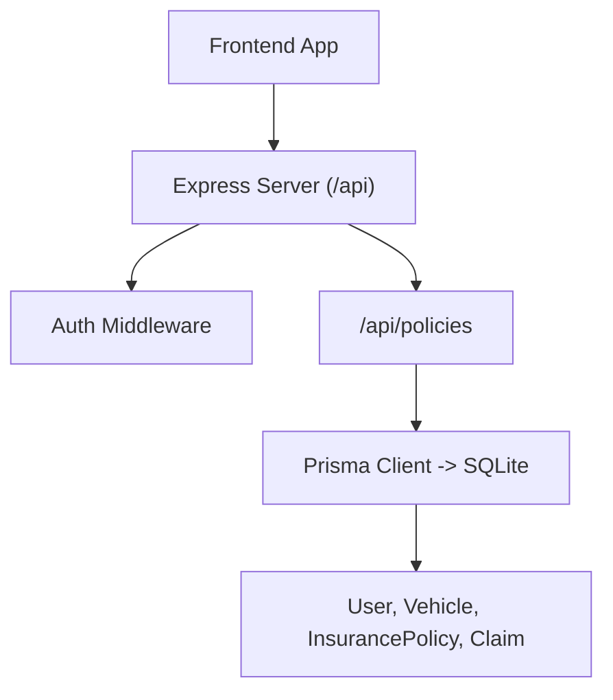
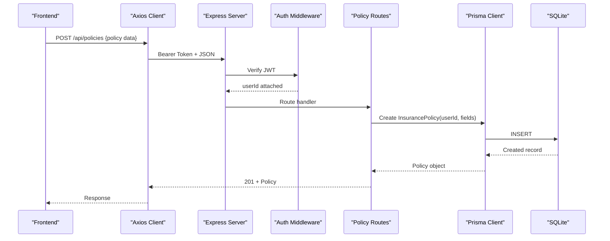
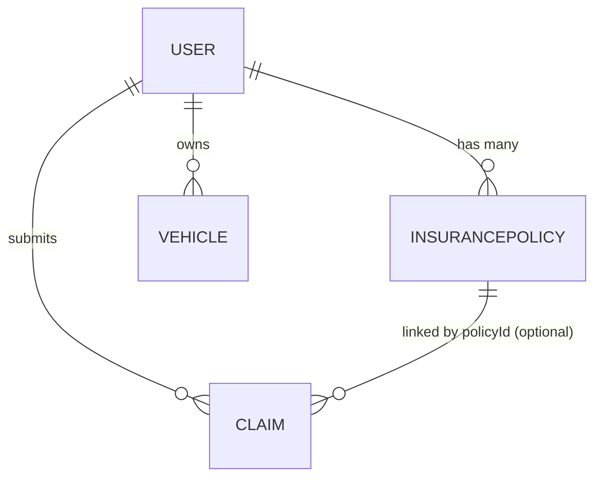
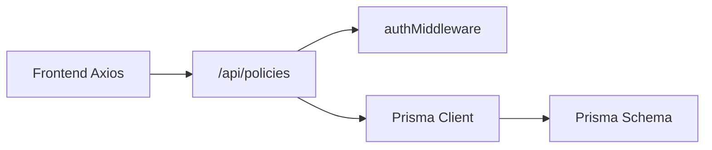

# Policy Management Endpoints

<cite>
**Referenced Files in This Document**
- [policies.ts](file://backend/src/routes/policies.ts)
- [schema.prisma](file://backend/prisma/schema.prisma)
- [auth.ts](file://backend/src/middleware/auth.ts)
- [index.ts](file://backend/src/index.ts)
- [types (frontend)](file://frontend/src/types/index.ts)
- [PoliciesPage.tsx](file://frontend/src/pages/PoliciesPage.tsx)
- [api.ts](file://frontend/src/services/api.ts)
</cite>

## Table of Contents
1. [Introduction](#introduction)
2. [Project Structure](#project-structure)
3. [Core Components](#core-components)
4. [Architecture Overview](#architecture-overview)
5. [Detailed Component Analysis](#detailed-component-analysis)
6. [Dependency Analysis](#dependency-analysis)
7. [Performance Considerations](#performance-considerations)
8. [Troubleshooting Guide](#troubleshooting-guide)
9. [Conclusion](#conclusion)
10. [Appendices](#appendices)

## Introduction
This document provides comprehensive API documentation for insurance policy management endpoints. It covers creation, retrieval, updates, and deletion of policies; authentication requirements; request/response schemas; validation rules; and relationships with users, vehicles, and claims. It also clarifies current capabilities and limitations regarding premium computations, coverage calculations, and renewal processing workflows.

## Project Structure
The backend exposes a REST API under /api. The policy routes are mounted at /api/policies and protected by JWT-based authentication. The data model is defined via Prisma schema, including InsurancePolicy, User, Vehicle, and Claim entities. The frontend includes a Policies page that calls the backend through an Axios client configured to attach auth tokens.

**Diagram sources**
- [index.ts:40-45](file://backend/src/index.ts#L40-L45)
- [policies.ts:1-8](file://backend/src/routes/policies.ts#L1-L8)
- [schema.prisma:10-60](file://backend/prisma/schema.prisma#L10-L60)

**Section sources**
- [index.ts:40-45](file://backend/src/index.ts#L40-L45)
- [policies.ts:1-8](file://backend/src/routes/policies.ts#L1-L8)
- [schema.prisma:10-60](file://backend/prisma/schema.prisma#L10-L60)

## Core Components
- Authentication middleware enforces bearer token presence and decodes JWT to set userId on requests.
- Policy routes implement CRUD operations scoped to the authenticated user.
- Data model defines InsurancePolicy fields and relationships to User and Claim.
- Frontend types define the InsurancePolicy shape consumed by UI components.

Key responsibilities:
- Validate required fields on create/update.
- Enforce user-scoped access for read/update/delete.
- Persist policies using Prisma ORM.
- Return standardized error responses on failures.

**Section sources**
- [auth.ts:5-22](file://backend/src/middleware/auth.ts#L5-L22)
- [policies.ts:12-128](file://backend/src/routes/policies.ts#L12-L128)
- [schema.prisma:45-60](file://backend/prisma/schema.prisma#L45-L60)
- [types (frontend):28-38](file://frontend/src/types/index.ts#L28-L38)

## Architecture Overview
The policy API follows a standard REST pattern with JWT protection. Requests flow from the frontend through Axios (which injects Authorization headers), into Express, then through the auth middleware, and finally into route handlers that interact with Prisma and the database.

**Diagram sources**
- [api.ts:11-23](file://frontend/src/services/api.ts#L11-L23)
- [auth.ts:5-22](file://backend/src/middleware/auth.ts#L5-L22)
- [policies.ts:12-39](file://backend/src/routes/policies.ts#L12-L39)
- [schema.prisma:45-60](file://backend/prisma/schema.prisma#L45-L60)

## Detailed Component Analysis

### Authentication
- All policy endpoints require a valid JWT in the Authorization header.
- Missing or invalid tokens result in 401 responses.
- On successful verification, userId is attached to the request for authorization checks.

**Section sources**
- [auth.ts:5-22](file://backend/src/middleware/auth.ts#L5-L22)

### Policy Endpoints

#### Create Policy
- Method: POST
- Path: /api/policies
- Auth: Required (Bearer token)
- Request body fields:
  - providerName: string (required)
  - policyNumber: string (required)
  - coverageType: string (required)
  - deductible: number (required)
  - premiumAmount: number (required)
  - startDate: date-time string (required)
  - endDate: date-time string (required)
- Validation:
  - All fields must be present; missing fields return 400 with an error message.
  - Numeric fields are parsed to floats before persistence.
- Success response: 201 with created policy object.
- Error responses:
  - 400 if validation fails.
  - 500 on server errors.

Notes:
- No business logic for premium calculation or coverage limits is implemented in this endpoint; values are stored as provided.
- Date parsing uses JavaScript Date constructor; ensure ISO or browser-compatible formats.

**Section sources**
- [policies.ts:12-39](file://backend/src/routes/policies.ts#L12-L39)
- [schema.prisma:45-60](file://backend/prisma/schema.prisma#L45-L60)

#### List Policies
- Method: GET
- Path: /api/policies
- Auth: Required
- Behavior: Returns all policies belonging to the authenticated user, ordered by creation time descending.
- Success response: Array of policy objects.
- Error responses: 500 on server errors.

**Section sources**
- [policies.ts:42-55](file://backend/src/routes/policies.ts#L42-L55)

#### Get Policy by ID
- Method: GET
- Path: /api/policies/:id
- Auth: Required
- Behavior: Returns the policy matching the given id if it belongs to the authenticated user.
- Success response: Policy object.
- Error responses:
  - 404 if not found.
  - 500 on server errors.

**Section sources**
- [policies.ts:57-74](file://backend/src/routes/policies.ts#L57-L74)

#### Update Policy
- Method: PUT
- Path: /api/policies/:id
- Auth: Required
- Request body fields: Any subset of policy fields may be updated; only provided fields are applied.
- Validation:
  - If any numeric fields are provided, they are parsed to floats.
  - Dates are converted to Date objects.
- Behavior: Updates only the provided fields for the specified policy owned by the authenticated user.
- Success response: Updated policy object.
- Error responses:
  - 404 if not found.
  - 500 on server errors.

**Section sources**
- [policies.ts:76-108](file://backend/src/routes/policies.ts#L76-L108)

#### Delete Policy
- Method: DELETE
- Path: /api/policies/:id
- Auth: Required
- Behavior: Deletes the policy if it exists and belongs to the authenticated user.
- Success response: Confirmation message.
- Error responses:
  - 404 if not found.
  - 500 on server errors.

**Section sources**
- [policies.ts:110-128](file://backend/src/routes/policies.ts#L110-L128)

### Data Model and Relationships
- InsurancePolicy belongs to a User via userId.
- Claims can optionally reference a policy via policyId (nullable).
- Vehicles belong to Users but are not directly linked to policies in the current schema.

**Diagram sources**
- [schema.prisma:10-60](file://backend/prisma/schema.prisma#L10-L60)
- [schema.prisma:71-94](file://backend/prisma/schema.prisma#L71-L94)

**Section sources**
- [schema.prisma:10-60](file://backend/prisma/schema.prisma#L10-L60)
- [schema.prisma:71-94](file://backend/prisma/schema.prisma#L71-L94)

### Frontend Integration
- The Policies page sends form data to POST /api/policies and lists policies via GET /api/policies.
- Axios interceptor attaches Authorization header using a stored token.
- Frontend type InsurancePolicy mirrors backend fields for compile-time safety.

**Section sources**
- [PoliciesPage.tsx:16-31](file://frontend/src/pages/PoliciesPage.tsx#L16-L31)
- [api.ts:11-23](file://frontend/src/services/api.ts#L11-L23)
- [types (frontend):28-38](file://frontend/src/types/index.ts#L28-L38)

## Dependency Analysis
- Policy routes depend on:
  - Express Router for HTTP handling.
  - Prisma client for data access.
  - Auth middleware for JWT verification.
- The application mounts policy routes under /api/policies.
- Frontend depends on Axios client configuration to include auth headers.

**Diagram sources**
- [index.ts:40-45](file://backend/src/index.ts#L40-L45)
- [policies.ts:1-8](file://backend/src/routes/policies.ts#L1-L8)
- [api.ts:11-23](file://frontend/src/services/api.ts#L11-L23)

**Section sources**
- [index.ts:40-45](file://backend/src/index.ts#L40-L45)
- [policies.ts:1-8](file://backend/src/routes/policies.ts#L1-L8)
- [api.ts:11-23](file://frontend/src/services/api.ts#L11-L23)

## Performance Considerations
- Queries are filtered by userId, ensuring efficient scoping.
- Listing policies orders by createdAt desc; consider adding pagination for large datasets.
- Avoid unnecessary full scans by leveraging indexes on frequently queried fields (e.g., userId, policyNumber).
- Keep payload sizes reasonable; avoid embedding large arrays in policy records.

[No sources needed since this section provides general guidance]

## Troubleshooting Guide
Common issues and resolutions:
- 401 Unauthorized: Ensure a valid JWT is included in the Authorization header. Check token expiration and secret configuration.
- 400 Bad Request: Verify all required fields are present and correctly typed when creating or updating policies.
- 404 Not Found: Confirm the policy id exists and belongs to the authenticated user.
- 500 Internal Server Error: Inspect server logs for database connectivity or Prisma errors.

Validation notes:
- All policy fields are validated for presence on create.
- Numeric fields are parsed to floats; ensure inputs are valid numbers.
- Dates are parsed via JavaScript Date; use supported formats.

**Section sources**
- [auth.ts:5-22](file://backend/src/middleware/auth.ts#L5-L22)
- [policies.ts:12-39](file://backend/src/routes/policies.ts#L12-L39)
- [policies.ts:57-128](file://backend/src/routes/policies.ts#L57-L128)

## Conclusion
The policy management API provides secure CRUD operations for insurance policies, scoped to authenticated users. While basic validation ensures required fields are present, advanced features such as premium computation, coverage limit enforcement, and renewal workflows are not currently implemented. Future enhancements can introduce these business rules within route handlers or dedicated services while maintaining clear separation of concerns and robust error handling.

[No sources needed since this section summarizes without analyzing specific files]

## Appendices

### API Reference Summary

- Create Policy
  - Method: POST
  - Path: /api/policies
  - Auth: Required
  - Request body: providerName, policyNumber, coverageType, deductible, premiumAmount, startDate, endDate
  - Responses: 201 on success; 400 on validation failure; 500 on server error

- List Policies
  - Method: GET
  - Path: /api/policies
  - Auth: Required
  - Responses: 200 with array of policies; 500 on server error

- Get Policy
  - Method: GET
  - Path: /api/policies/:id
  - Auth: Required
  - Responses: 200 with policy; 404 if not found; 500 on server error

- Update Policy
  - Method: PUT
  - Path: /api/policies/:id
  - Auth: Required
  - Request body: Any subset of policy fields
  - Responses: 200 with updated policy; 404 if not found; 500 on server error

- Delete Policy
  - Method: DELETE
  - Path: /api/policies/:id
  - Auth: Required
  - Responses: 200 with confirmation; 404 if not found; 500 on server error

**Section sources**
- [policies.ts:12-128](file://backend/src/routes/policies.ts#L12-L128)

### Business Logic Notes
- Premium computation: Not implemented; premiumAmount is stored as provided.
- Coverage calculations: Not implemented; coverageType is stored as provided.
- Renewal processing: Not implemented; no status field or renewal workflow exists for policies.
- Status management: Policies do not have a status field; consider adding one if lifecycle tracking is required.
- Relationship management:
  - Policies link to Users via userId.
  - Claims can optionally link to a policy via policyId.
  - Vehicles are not directly linked to policies in the current schema.

**Section sources**
- [schema.prisma:45-60](file://backend/prisma/schema.prisma#L45-L60)
- [schema.prisma:71-94](file://backend/prisma/schema.prisma#L71-L94)