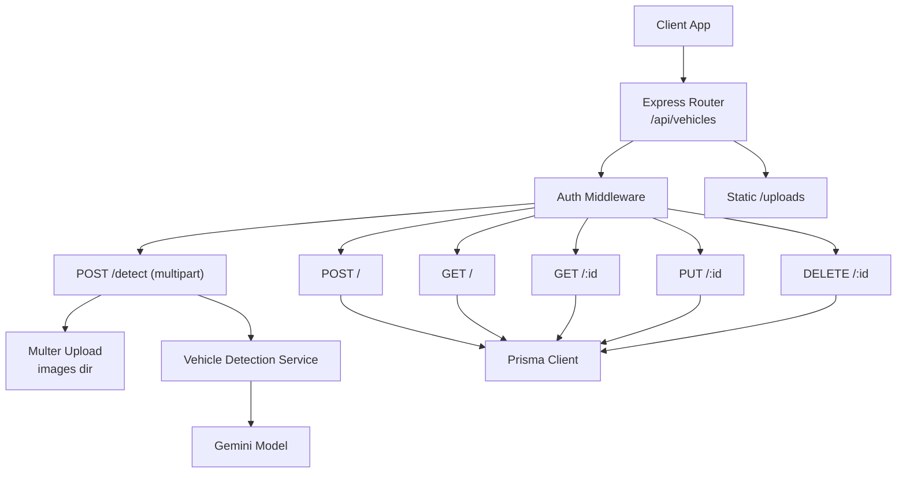
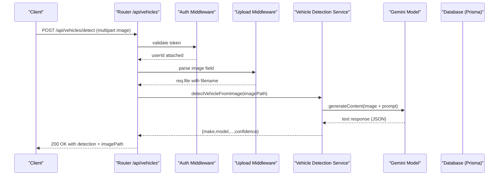
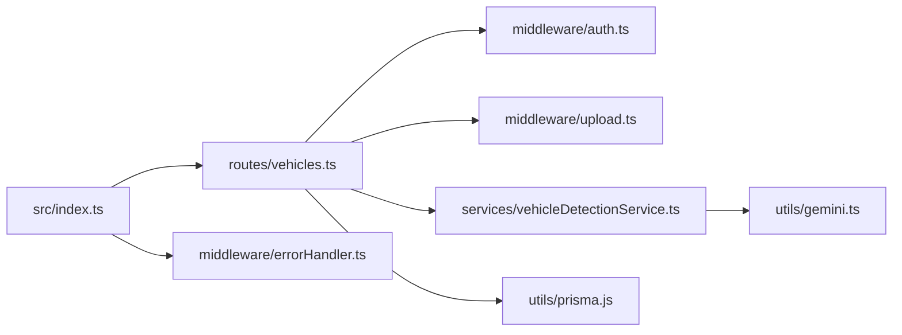

# Vehicle Management Endpoints

<cite>
**Referenced Files in This Document**
- [vehicles.ts](file://backend/src/routes/vehicles.ts)
- [vehicleDetectionService.ts](file://backend/src/services/vehicleDetectionService.ts)
- [upload.ts](file://backend/src/middleware/upload.ts)
- [schema.prisma](file://backend/prisma/schema.prisma)
- [index.ts](file://backend/src/index.ts)
- [auth.ts](file://backend/src/middleware/auth.ts)
- [gemini.ts](file://backend/src/utils/gemini.ts)
- [errorHandler.ts](file://backend/src/middleware/errorHandler.ts)
</cite>

## Table of Contents
1. [Introduction](#introduction)
2. [Project Structure](#project-structure)
3. [Core Components](#core-components)
4. [Architecture Overview](#architecture-overview)
5. [Detailed Component Analysis](#detailed-component-analysis)
6. [Dependency Analysis](#dependency-analysis)
7. [Performance Considerations](#performance-considerations)
8. [Troubleshooting Guide](#troubleshooting-guide)
9. [Conclusion](#conclusion)
10. [Appendices](#appendices)

## Introduction
This document provides detailed API documentation for vehicle management endpoints, covering creation, retrieval, updates, deletion, and AI-powered vehicle detection from images. It specifies HTTP methods, URL patterns, request/response schemas, file upload handling, validation rules, error responses, and integration with the vehicle detection service. Examples illustrate typical workflows such as registering a vehicle, uploading photos, and using AI to auto-fill vehicle details from an image.

## Project Structure
The vehicle management functionality is implemented in the backend Express application:
- Routes define endpoints under /api/vehicles and require authentication.
- A dedicated service integrates with an AI model to detect vehicle details from uploaded images.
- File uploads are handled via middleware that stores images and enforces allowed types and size limits.
- Data persistence uses Prisma with a Vehicle model and relationships to users and claims.
- The main app wires routes, static file serving for uploads, and global error handling.

**Diagram sources**
- [vehicles.ts:1-169](file://backend/src/routes/vehicles.ts#L1-L169)
- [upload.ts:1-54](file://backend/src/middleware/upload.ts#L1-L54)
- [vehicleDetectionService.ts:1-96](file://backend/src/services/vehicleDetectionService.ts#L1-L96)
- [index.ts:25-45](file://backend/src/index.ts#L25-L45)

**Section sources**
- [index.ts:25-45](file://backend/src/index.ts#L25-L45)
- [vehicles.ts:1-169](file://backend/src/routes/vehicles.ts#L1-L169)

## Core Components
- Authentication: All vehicle endpoints are protected by JWT-based auth middleware. Requests must include Authorization: Bearer <token>.
- File Uploads: Image uploads use multipart/form-data with field name "image". Allowed MIME types: image/jpeg, image/png, image/webp, image/jpg. Max file size: 10MB. Uploaded files are stored under ./uploads/images with UUID filenames.
- AI Vehicle Detection: POST /api/vehicles/detect accepts an image, invokes the vehicle detection service, which reads the file, encodes it, calls the Gemini model, parses JSON output, and returns detected fields plus confidence.
- Data Persistence: Vehicles are stored in a relational database via Prisma. The Vehicle model includes user association, license plate, make/model/year/color/mileage/photos, and timestamps.

Key behaviors:
- Creation requires make, model, year, licensePlate, color; optional vin, mileage, photos. Photos are stored as a JSON string array.
- Retrieval lists vehicles owned by the authenticated user and can include related claim counts or claim summaries.
- Updates allow partial field updates; photos can be replaced by providing a new array.
- Deletion removes the vehicle record if owned by the authenticated user.

**Section sources**
- [auth.ts:5-22](file://backend/src/middleware/auth.ts#L5-L22)
- [upload.ts:17-47](file://backend/src/middleware/upload.ts#L17-L47)
- [vehicleDetectionService.ts:46-95](file://backend/src/services/vehicleDetectionService.ts#L46-L95)
- [schema.prisma:27-43](file://backend/prisma/schema.prisma#L27-L43)
- [vehicles.ts:34-166](file://backend/src/routes/vehicles.ts#L34-L166)

## Architecture Overview
The vehicle management API follows a layered architecture:
- Route layer: Express router defines endpoints and handles request/response lifecycle.
- Middleware layer: Authentication validates tokens; upload middleware processes multipart images.
- Service layer: Vehicle detection service encapsulates AI interaction and parsing logic.
- Data layer: Prisma client interacts with the SQLite database defined in schema.prisma.
- Infrastructure: Static file server serves uploaded images; global error handler centralizes error responses.

**Diagram sources**
- [vehicles.ts:15-32](file://backend/src/routes/vehicles.ts#L15-L32)
- [upload.ts:17-47](file://backend/src/middleware/upload.ts#L17-L47)
- [vehicleDetectionService.ts:46-95](file://backend/src/services/vehicleDetectionService.ts#L46-L95)
- [gemini.ts:6-8](file://backend/src/utils/gemini.ts#L6-L8)

## Detailed Component Analysis

### Authentication and Access Control
- All vehicle endpoints require a valid JWT in the Authorization header.
- On missing or invalid token, the middleware responds with 401 Unauthorized.

Error responses:
- 401 Unauthorized: Missing or invalid/expired token.

**Section sources**
- [auth.ts:5-22](file://backend/src/middleware/auth.ts#L5-L22)
- [vehicles.ts:10-11](file://backend/src/routes/vehicles.ts#L10-L11)

### File Upload Handling
- Endpoint: POST /api/vehicles/detect
- Content-Type: multipart/form-data
- Field name: image
- Allowed types: JPEG, PNG, WebP, JPG
- Size limit: 10 MB
- Storage: ./uploads/images/<uuid>.ext
- Serving: /uploads/* is served statically by the app.

Validation and errors:
- If no image provided: 400 Bad Request with error message.
- If file type not allowed: Multer rejects with error (handled by global error handler).
- If file too large: Multer rejects with error (handled by global error handler).

**Section sources**
- [upload.ts:17-47](file://backend/src/middleware/upload.ts#L17-L47)
- [index.ts:36-38](file://backend/src/index.ts#L36-L38)
- [vehicles.ts:15-32](file://backend/src/routes/vehicles.ts#L15-L32)

### AI-Powered Vehicle Detection
- Endpoint: POST /api/vehicles/detect
- Behavior: Reads uploaded image, calls Gemini model with a structured prompt, parses JSON result, and returns detection data including confidence level.
- Response includes detected fields and the relative image path for reference.

Response schema:
- make: string
- model: string
- year: number
- color: string
- licensePlate: string
- confidence: "HIGH" | "MEDIUM" | "LOW"
- additionalInfo?: string
- imagePath: string (relative path to uploaded image)

Error handling:
- If image file not found on disk: 500 Internal Server Error with descriptive message.
- If AI response cannot be parsed: Returns fallback values with LOW confidence and guidance note.

**Section sources**
- [vehicleDetectionService.ts:15-44](file://backend/src/services/vehicleDetectionService.ts#L15-L44)
- [vehicleDetectionService.ts:46-95](file://backend/src/services/vehicleDetectionService.ts#L46-L95)
- [vehicles.ts:15-32](file://backend/src/routes/vehicles.ts#L15-L32)

### Vehicle Registration (Create)
- Endpoint: POST /api/vehicles
- Body schema:
  - make: string (required)
  - model: string (required)
  - year: number or numeric string (required)
  - licensePlate: string (required)
  - color: string (required)
  - vin: string (optional)
  - mileage: number or numeric string (optional)
  - photos: string[] (optional; stored as JSON array)
- Behavior: Creates a vehicle associated with the authenticated user; converts year and mileage to integers; serializes photos to JSON string.

Success response:
- 201 Created with the created vehicle object.

Validation errors:
- 400 Bad Request if required fields are missing.

Server errors:
- 500 Internal Server Error on database or unexpected failures.

**Section sources**
- [vehicles.ts:34-63](file://backend/src/routes/vehicles.ts#L34-L63)
- [schema.prisma:27-43](file://backend/prisma/schema.prisma#L27-L43)

### List Vehicles
- Endpoint: GET /api/vehicles
- Behavior: Returns all vehicles belonging to the authenticated user, ordered by creation date descending. Includes claim count per vehicle.

Success response:
- 200 OK with array of vehicle objects.

Errors:
- 500 Internal Server Error on failure.

**Section sources**
- [vehicles.ts:65-81](file://backend/src/routes/vehicles.ts#L65-L81)
- [schema.prisma:27-43](file://backend/prisma/schema.prisma#L27-L43)

### Get Vehicle by ID
- Endpoint: GET /api/vehicles/:id
- Behavior: Returns the vehicle if it belongs to the authenticated user; includes recent claims summary.

Success response:
- 200 OK with vehicle object.

Not found:
- 404 Not Found if vehicle does not exist or does not belong to user.

Errors:
- 500 Internal Server Error on failure.

**Section sources**
- [vehicles.ts:83-111](file://backend/src/routes/vehicles.ts#L83-L111)

### Update Vehicle
- Endpoint: PUT /api/vehicles/:id
- Body schema: Any subset of vehicle fields; only provided fields are updated.
- Behavior: Validates ownership; updates fields; supports replacing photos array.

Success response:
- 200 OK with updated vehicle object.

Not found:
- 404 Not Found if vehicle does not exist or does not belong to user.

Errors:
- 500 Internal Server Error on failure.

**Section sources**
- [vehicles.ts:113-146](file://backend/src/routes/vehicles.ts#L113-L146)

### Delete Vehicle
- Endpoint: DELETE /api/vehicles/:id
- Behavior: Deletes the vehicle if it belongs to the authenticated user.

Success response:
- 200 OK with confirmation message.

Not found:
- 404 Not Found if vehicle does not exist or does not belong to user.

Errors:
- 500 Internal Server Error on failure.

**Section sources**
- [vehicles.ts:148-166](file://backend/src/routes/vehicles.ts#L148-L166)

### Example Workflows

#### AI-Assisted Vehicle Registration
1. Upload an image to POST /api/vehicles/detect with multipart form field "image".
2. Receive detection result with make, model, year, color, licensePlate, confidence, and additionalInfo.
3. Use the returned values to prefill the POST /api/vehicles body.
4. Submit registration; receive 201 Created with the new vehicle.

Notes:
- If confidence is LOW or fields are Unknown, manually verify and adjust before submission.

**Section sources**
- [vehicles.ts:15-32](file://backend/src/routes/vehicles.ts#L15-L32)
- [vehicleDetectionService.ts:46-95](file://backend/src/services/vehicleDetectionService.ts#L46-L95)
- [vehicles.ts:34-63](file://backend/src/routes/vehicles.ts#L34-L63)

#### Photo Management
- Images are uploaded via the detection endpoint; they are stored under ./uploads/images and served at /uploads/images/<filename>.
- To associate photos with a vehicle, include a photos array in create/update requests. Each element should represent a file path or identifier used by your frontend.

**Section sources**
- [upload.ts:17-47](file://backend/src/middleware/upload.ts#L17-L47)
- [index.ts:36-38](file://backend/src/index.ts#L36-L38)
- [vehicles.ts:34-63](file://backend/src/routes/vehicles.ts#L34-L63)
- [vehicles.ts:113-146](file://backend/src/routes/vehicles.ts#L113-L146)

## Dependency Analysis
- Route dependencies:
  - vehicles.ts depends on auth middleware, upload middleware, vehicle detection service, and Prisma client.
- Service dependencies:
  - vehicleDetectionService.ts depends on filesystem utilities and the Gemini model wrapper.
- Global dependencies:
  - index.ts mounts routes and serves static uploads directory.
  - errorHandler.ts centralizes error responses.

**Diagram sources**
- [vehicles.ts:1-6](file://backend/src/routes/vehicles.ts#L1-L6)
- [vehicleDetectionService.ts:1-3](file://backend/src/services/vehicleDetectionService.ts#L1-L3)
- [gemini.ts:1-12](file://backend/src/utils/gemini.ts#L1-L12)
- [index.ts:1-11](file://backend/src/index.ts#L1-L11)
- [errorHandler.ts:1-28](file://backend/src/middleware/errorHandler.ts#L1-L28)

**Section sources**
- [vehicles.ts:1-6](file://backend/src/routes/vehicles.ts#L1-L6)
- [vehicleDetectionService.ts:1-3](file://backend/src/services/vehicleDetectionService.ts#L1-L3)
- [index.ts:1-11](file://backend/src/index.ts#L1-L11)

## Performance Considerations
- Image processing: Reading and encoding images for AI analysis can be CPU-intensive. Consider caching detection results for identical images if repeated analysis is expected.
- Database queries: Listing vehicles includes a count aggregation; ensure appropriate indexes exist on userId and createdAt for optimal performance.
- File storage: Large images increase upload and storage costs. Enforce strict size limits and consider compression or resizing before upload if needed.
- Concurrency: Ensure the database connection pool is sized appropriately for concurrent requests.

[No sources needed since this section provides general guidance]

## Troubleshooting Guide
Common issues and resolutions:
- 401 Unauthorized: Ensure Authorization header contains a valid Bearer token. Check token expiration and secret configuration.
- 400 Bad Request (missing image): Verify multipart/form-data payload includes the "image" field.
- 400 Bad Request (validation): Provide all required fields for vehicle creation (make, model, year, licensePlate, color).
- 404 Not Found: Confirm the vehicle exists and belongs to the authenticated user.
- 500 Internal Server Error: Check server logs for database connectivity, file system access, or AI service errors. For detection failures, inspect the AI response parsing and fallback behavior.

Global error handling:
- Custom AppError instances return their status code; otherwise, 500 is returned for unhandled exceptions.

**Section sources**
- [auth.ts:5-22](file://backend/src/middleware/auth.ts#L5-L22)
- [vehicles.ts:15-32](file://backend/src/routes/vehicles.ts#L15-L32)
- [vehicles.ts:34-63](file://backend/src/routes/vehicles.ts#L34-L63)
- [vehicles.ts:83-111](file://backend/src/routes/vehicles.ts#L83-L111)
- [errorHandler.ts:1-28](file://backend/src/middleware/errorHandler.ts#L1-L28)

## Conclusion
The vehicle management API provides secure CRUD operations for vehicles and an AI-assisted detection endpoint to streamline registration. With clear validation rules, robust error handling, and straightforward file upload handling, clients can efficiently manage vehicle data and leverage AI insights to improve user experience.

[No sources needed since this section summarizes without analyzing specific files]

## Appendices

### API Reference Summary

- POST /api/vehicles/detect
  - Purpose: Detect vehicle details from an image.
  - Auth: Required (Bearer token).
  - Content-Type: multipart/form-data; field: image.
  - Success: 200 with detection object and imagePath.
  - Errors: 400 (no image), 500 (AI/file errors).

- POST /api/vehicles
  - Purpose: Register a new vehicle.
  - Auth: Required.
  - Body: make, model, year, licensePlate, color (required); vin, mileage, photos (optional).
  - Success: 201 with vehicle object.
  - Errors: 400 (validation), 500 (server error).

- GET /api/vehicles
  - Purpose: List vehicles for the authenticated user.
  - Auth: Required.
  - Success: 200 with array of vehicles.
  - Errors: 500 (server error).

- GET /api/vehicles/:id
  - Purpose: Retrieve a specific vehicle owned by the user.
  - Auth: Required.
  - Success: 200 with vehicle object.
  - Errors: 404 (not found), 500 (server error).

- PUT /api/vehicles/:id
  - Purpose: Update vehicle fields.
  - Auth: Required.
  - Body: Partial update of vehicle fields.
  - Success: 200 with updated vehicle.
  - Errors: 404 (not found), 500 (server error).

- DELETE /api/vehicles/:id
  - Purpose: Delete a vehicle owned by the user.
  - Auth: Required.
  - Success: 200 with confirmation.
  - Errors: 404 (not found), 500 (server error).

**Section sources**
- [vehicles.ts:15-166](file://backend/src/routes/vehicles.ts#L15-L166)