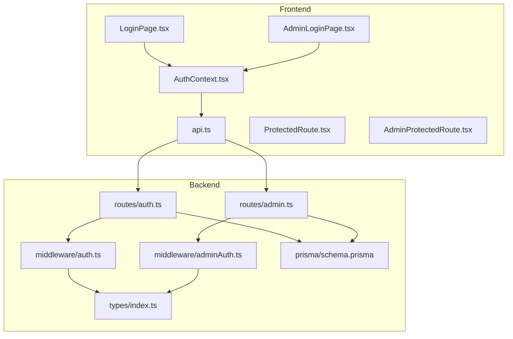
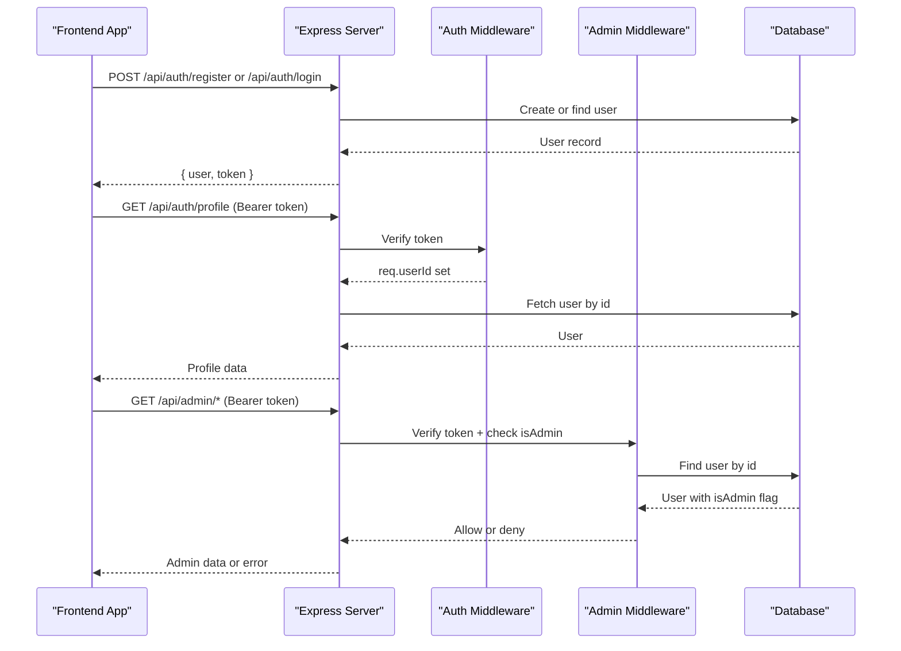
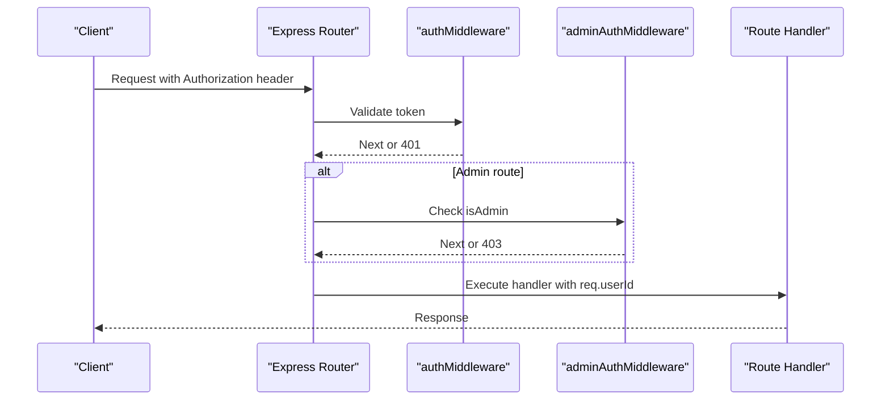
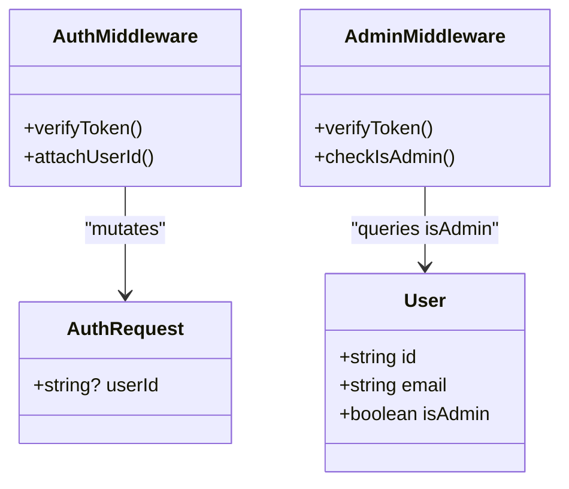
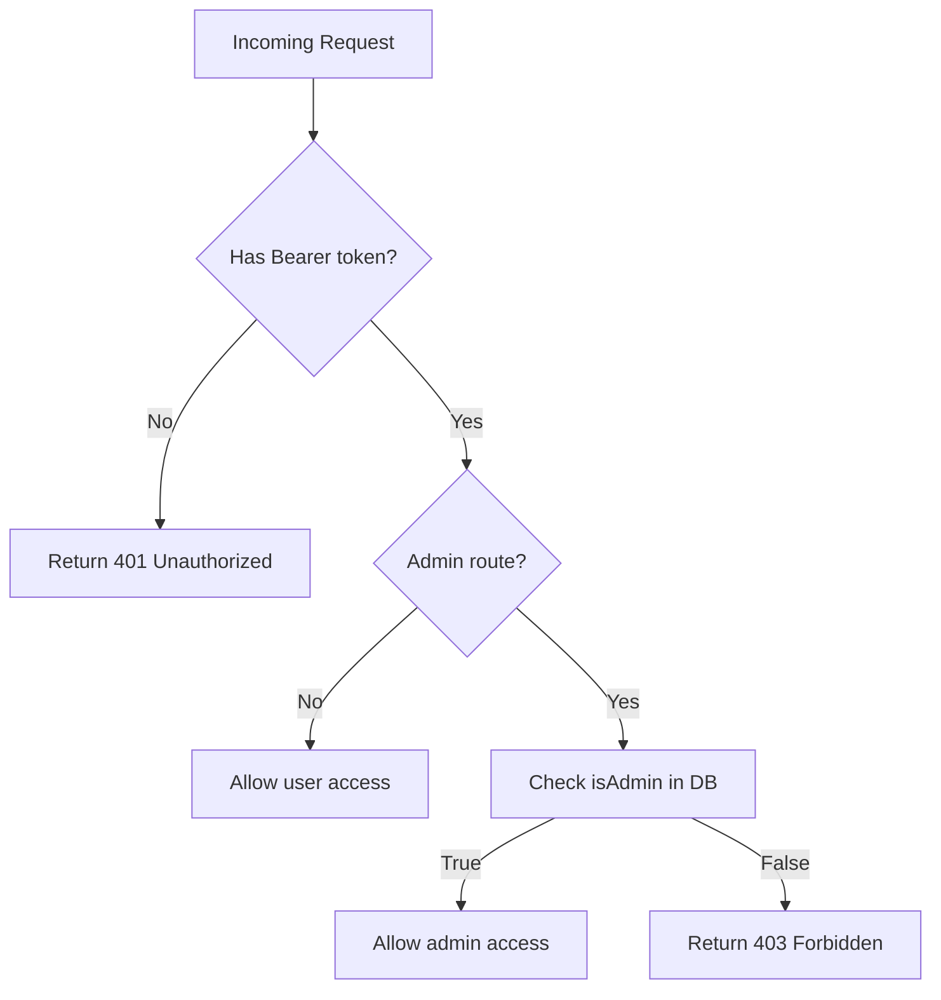
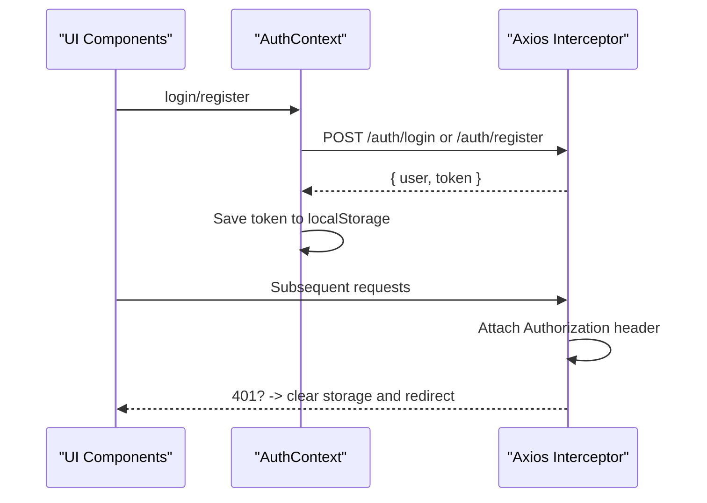
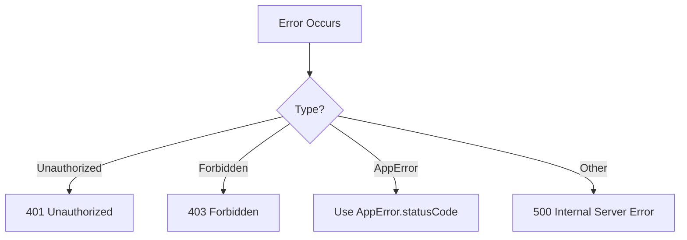
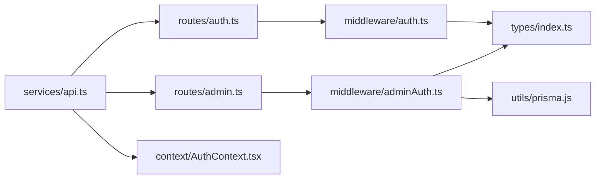

# Authentication & Authorization

<cite>
**Referenced Files in This Document**
- [auth.ts](file://backend/src/middleware/auth.ts)
- [adminAuth.ts](file://backend/src/middleware/adminAuth.ts)
- [errorHandler.ts](file://backend/src/middleware/errorHandler.ts)
- [index.ts](file://backend/src/types/index.ts)
- [auth.ts](file://backend/src/routes/auth.ts)
- [admin.ts](file://backend/src/routes/admin.ts)
- [schema.prisma](file://backend/prisma/schema.prisma)
- [api.ts](file://frontend/src/services/api.ts)
- [AuthContext.tsx](file://frontend/src/context/AuthContext.tsx)
- [ProtectedRoute.tsx](file://frontend/src/components/ProtectedRoute.tsx)
- [AdminProtectedRoute.tsx](file://frontend/src/components/AdminProtectedRoute.tsx)
- [LoginPage.tsx](file://frontend/src/pages/LoginPage.tsx)
- [AdminLoginPage.tsx](file://frontend/src/pages/admin/AdminLoginPage.tsx)
</cite>

## Table of Contents
1. [Introduction](#introduction)
2. [Project Structure](#project-structure)
3. [Core Components](#core-components)
4. [Architecture Overview](#architecture-overview)
5. [Detailed Component Analysis](#detailed-component-analysis)
6. [Dependency Analysis](#dependency-analysis)
7. [Performance Considerations](#performance-considerations)
8. [Troubleshooting Guide](#troubleshooting-guide)
9. [Conclusion](#conclusion)
10. [Appendices](#appendices)

## Introduction
This document explains the JWT-based authentication and authorization system for the application. It covers token generation, validation, role-based access control (user vs admin), middleware chain, session management on both frontend and backend, error handling, and security best practices. It also provides guidance for implementing custom flows, integrating external providers, and securing sensitive endpoints.

## Project Structure
The authentication system spans backend routes, middleware, types, and database schema, as well as frontend services, context, and route guards.

**Diagram sources**
- [AuthContext.tsx:17-66](file://frontend/src/context/AuthContext.tsx#L17-L66)
- [api.ts:3-33](file://frontend/src/services/api.ts#L3-L33)
- [auth.ts:10-167](file://backend/src/routes/auth.ts#L10-L167)
- [admin.ts:1-186](file://backend/src/routes/admin.ts#L1-L186)
- [auth.ts:5-22](file://backend/src/middleware/auth.ts#L5-L22)
- [adminAuth.ts:6-26](file://backend/src/middleware/adminAuth.ts#L6-L26)
- [index.ts:3-10](file://backend/src/types/index.ts#L3-L10)
- [schema.prisma:10-25](file://backend/prisma/schema.prisma#L10-L25)

**Section sources**
- [AuthContext.tsx:17-66](file://frontend/src/context/AuthContext.tsx#L17-L66)
- [api.ts:3-33](file://frontend/src/services/api.ts#L3-L33)
- [auth.ts:10-167](file://backend/src/routes/auth.ts#L10-L167)
- [admin.ts:1-186](file://backend/src/routes/admin.ts#L1-L186)
- [auth.ts:5-22](file://backend/src/middleware/auth.ts#L5-L22)
- [adminAuth.ts:6-26](file://backend/src/middleware/adminAuth.ts#L6-L26)
- [index.ts:3-10](file://backend/src/types/index.ts#L3-L10)
- [schema.prisma:10-25](file://backend/prisma/schema.prisma#L10-L25)

## Core Components
- JWT token lifecycle:
  - Generation on register and login with a fixed expiration window.
  - Validation via middleware that extracts and verifies tokens from the Authorization header.
- Role-based access control:
  - User-level protection via auth middleware.
  - Admin-only protection via admin middleware that checks user role in the database.
- Frontend session management:
  - Token stored in localStorage and attached to requests via an Axios interceptor.
  - Route guards enforce authenticated and admin-only navigation.

Key responsibilities by file:
- Backend routes:
  - Register/login create users and issue tokens; profile endpoints are protected.
  - Admin routes are guarded at the router level.
- Middleware:
  - Auth middleware validates tokens and attaches userId to the request.
  - Admin middleware validates tokens and ensures the user has admin privileges.
- Types:
  - Typed request extensions and JWT payload shape used across middleware and routes.
- Database:
  - User model includes an isAdmin flag used for role checks.

**Section sources**
- [auth.ts:10-167](file://backend/src/routes/auth.ts#L10-L167)
- [admin.ts:1-186](file://backend/src/routes/admin.ts#L1-L186)
- [auth.ts:5-22](file://backend/src/middleware/auth.ts#L5-L22)
- [adminAuth.ts:6-26](file://backend/src/middleware/adminAuth.ts#L6-L26)
- [index.ts:3-10](file://backend/src/types/index.ts#L3-L10)
- [schema.prisma:10-25](file://backend/prisma/schema.prisma#L10-L25)

## Architecture Overview
The flow begins with the frontend authenticating against the backend. On success, the server returns a JWT which the client stores and attaches to subsequent requests. Protected routes validate the token and enforce roles before allowing access.

**Diagram sources**
- [auth.ts:10-167](file://backend/src/routes/auth.ts#L10-L167)
- [admin.ts:1-186](file://backend/src/routes/admin.ts#L1-L186)
- [auth.ts:5-22](file://backend/src/middleware/auth.ts#L5-L22)
- [adminAuth.ts:6-26](file://backend/src/middleware/adminAuth.ts#L6-L26)
- [schema.prisma:10-25](file://backend/prisma/schema.prisma#L10-L25)

## Detailed Component Analysis

### Token Generation and Storage
- Registration and login generate a JWT with a fixed expiration period and include user identifiers in the payload.
- The frontend stores the token in localStorage and automatically attaches it to all API requests using an Axios interceptor.
- On 401 responses, the frontend clears local state and redirects to login.

**Diagram sources**
- [auth.ts:48-54](file://backend/src/routes/auth.ts#L48-L54)
- [auth.ts:83-100](file://backend/src/routes/auth.ts#L83-L100)
- [api.ts:7-33](file://frontend/src/services/api.ts#L7-L33)
- [AuthContext.tsx:38-66](file://frontend/src/context/AuthContext.tsx#L38-L66)

**Section sources**
- [auth.ts:48-54](file://backend/src/routes/auth.ts#L48-L54)
- [auth.ts:83-100](file://backend/src/routes/auth.ts#L83-L100)
- [api.ts:7-33](file://frontend/src/services/api.ts#L7-L33)
- [AuthContext.tsx:38-66](file://frontend/src/context/AuthContext.tsx#L38-L66)

### Token Validation and Middleware Chain
- Auth middleware:
  - Extracts the Bearer token from the Authorization header.
  - Verifies the token and sets req.userId for downstream handlers.
  - Returns 401 if missing or invalid.
- Admin middleware:
  - Validates the token similarly.
  - Queries the database to ensure the user has admin privileges.
  - Returns 403 if not authorized.

**Diagram sources**
- [auth.ts:5-22](file://backend/src/middleware/auth.ts#L5-L22)
- [adminAuth.ts:6-26](file://backend/src/middleware/adminAuth.ts#L6-L26)
- [admin.ts:1-7](file://backend/src/routes/admin.ts#L1-L7)

**Section sources**
- [auth.ts:5-22](file://backend/src/middleware/auth.ts#L5-L22)
- [adminAuth.ts:6-26](file://backend/src/middleware/adminAuth.ts#L6-L26)
- [admin.ts:1-7](file://backend/src/routes/admin.ts#L1-L7)

### Role-Based Access Control (User vs Admin)
- User role:
  - Any authenticated user can access protected user endpoints (e.g., profile).
- Admin role:
  - Admin-only routes are mounted under a router that applies admin middleware globally.
  - The middleware checks the user’s isAdmin flag in the database before granting access.

**Diagram sources**
- [schema.prisma:10-25](file://backend/prisma/schema.prisma#L10-L25)
- [index.ts:3-10](file://backend/src/types/index.ts#L3-L10)
- [auth.ts:5-22](file://backend/src/middleware/auth.ts#L5-L22)
- [adminAuth.ts:6-26](file://backend/src/middleware/adminAuth.ts#L6-L26)

**Section sources**
- [schema.prisma:10-25](file://backend/prisma/schema.prisma#L10-L25)
- [index.ts:3-10](file://backend/src/types/index.ts#L3-L10)
- [auth.ts:5-22](file://backend/src/middleware/auth.ts#L5-L22)
- [adminAuth.ts:6-26](file://backend/src/middleware/adminAuth.ts#L6-L26)

### Protected Routes and Examples
- User-protected routes:
  - Profile retrieval and update require a valid token.
- Admin-protected routes:
  - Stats, users, claims, documents endpoints require admin privileges.

**Diagram sources**
- [auth.ts:107-165](file://backend/src/routes/auth.ts#L107-L165)
- [admin.ts:1-186](file://backend/src/routes/admin.ts#L1-L186)
- [auth.ts:5-22](file://backend/src/middleware/auth.ts#L5-L22)
- [adminAuth.ts:6-26](file://backend/src/middleware/adminAuth.ts#L6-L26)

**Section sources**
- [auth.ts:107-165](file://backend/src/routes/auth.ts#L107-L165)
- [admin.ts:1-186](file://backend/src/routes/admin.ts#L1-L186)
- [auth.ts:5-22](file://backend/src/middleware/auth.ts#L5-L22)
- [adminAuth.ts:6-26](file://backend/src/middleware/adminAuth.ts#L6-L26)

### Session Management (Frontend)
- Tokens are persisted in localStorage and restored on app start.
- An Axios interceptor adds the Authorization header to every request.
- On 401, the client clears stored credentials and navigates to login.

**Diagram sources**
- [AuthContext.tsx:17-66](file://frontend/src/context/AuthContext.tsx#L17-L66)
- [api.ts:7-33](file://frontend/src/services/api.ts#L7-L33)
- [LoginPage.tsx:14-27](file://frontend/src/pages/LoginPage.tsx#L14-L27)
- [AdminLoginPage.tsx:13-32](file://frontend/src/pages/admin/AdminLoginPage.tsx#L13-L32)

**Section sources**
- [AuthContext.tsx:17-66](file://frontend/src/context/AuthContext.tsx#L17-L66)
- [api.ts:7-33](file://frontend/src/services/api.ts#L7-L33)
- [LoginPage.tsx:14-27](file://frontend/src/pages/LoginPage.tsx#L14-L27)
- [AdminLoginPage.tsx:13-32](file://frontend/src/pages/admin/AdminLoginPage.tsx#L13-L32)

### Error Handling and Responses
- Missing or invalid tokens result in 401 responses.
- Insufficient permissions result in 403 responses.
- Centralized error handler converts errors into consistent JSON responses.

**Diagram sources**
- [auth.ts:5-22](file://backend/src/middleware/auth.ts#L5-L22)
- [adminAuth.ts:6-26](file://backend/src/middleware/adminAuth.ts#L6-L26)
- [errorHandler.ts:13-27](file://backend/src/middleware/errorHandler.ts#L13-L27)

**Section sources**
- [auth.ts:5-22](file://backend/src/middleware/auth.ts#L5-L22)
- [adminAuth.ts:6-26](file://backend/src/middleware/adminAuth.ts#L6-L26)
- [errorHandler.ts:13-27](file://backend/src/middleware/errorHandler.ts#L13-L27)

## Dependency Analysis
- Backend dependencies:
  - Express routes depend on middleware for authentication and authorization.
  - Middleware depends on JSON Web Token library and environment secret.
  - Admin middleware depends on Prisma client to read user roles.
- Frontend dependencies:
  - Axios interceptors depend on localStorage for token persistence.
  - Context manages user state and triggers API calls.

**Diagram sources**
- [auth.ts:10-167](file://backend/src/routes/auth.ts#L10-L167)
- [admin.ts:1-186](file://backend/src/routes/admin.ts#L1-L186)
- [auth.ts:5-22](file://backend/src/middleware/auth.ts#L5-L22)
- [adminAuth.ts:6-26](file://backend/src/middleware/adminAuth.ts#L6-L26)
- [index.ts:3-10](file://backend/src/types/index.ts#L3-L10)
- [api.ts:3-33](file://frontend/src/services/api.ts#L3-L33)
- [AuthContext.tsx:17-66](file://frontend/src/context/AuthContext.tsx#L17-L66)

**Section sources**
- [auth.ts:10-167](file://backend/src/routes/auth.ts#L10-L167)
- [admin.ts:1-186](file://backend/src/routes/admin.ts#L1-L186)
- [auth.ts:5-22](file://backend/src/middleware/auth.ts#L5-L22)
- [adminAuth.ts:6-26](file://backend/src/middleware/adminAuth.ts#L6-L26)
- [index.ts:3-10](file://backend/src/types/index.ts#L3-L10)
- [api.ts:3-33](file://frontend/src/services/api.ts#L3-L33)
- [AuthContext.tsx:17-66](file://frontend/src/context/AuthContext.tsx#L17-L66)

## Performance Considerations
- Token verification is lightweight but should be performed once per request; avoid redundant checks.
- Admin checks query the database; consider caching user roles if high traffic is expected.
- Keep token payloads minimal to reduce bandwidth overhead.
- Use efficient Prisma queries and selective field projection to minimize data transfer.

[No sources needed since this section provides general guidance]

## Troubleshooting Guide
Common issues and resolutions:
- 401 Unauthorized:
  - Ensure Authorization header is present and formatted as Bearer <token>.
  - Confirm the token is valid and not expired.
  - If the frontend receives 401, it clears stored credentials and redirects to login.
- 403 Forbidden:
  - For admin routes, verify the user has admin privileges in the database.
- Invalid token:
  - Verify the JWT secret configuration matches between signing and verification.
- Profile fetch failures:
  - Check network connectivity and ensure the token is attached to requests.

**Section sources**
- [auth.ts:5-22](file://backend/src/middleware/auth.ts#L5-L22)
- [adminAuth.ts:6-26](file://backend/src/middleware/adminAuth.ts#L6-L26)
- [api.ts:22-33](file://frontend/src/services/api.ts#L22-L33)

## Conclusion
The system implements a straightforward JWT-based authentication flow with role-based authorization for user and admin roles. Tokens are generated on registration and login, validated by middleware, and enforced by route guards on both frontend and backend. Security relies on proper token handling, secure secrets, and careful permission checks. To enhance resilience, consider adding refresh tokens, rate limiting, CSRF protections, and centralized audit logging.

[No sources needed since this section summarizes without analyzing specific files]

## Appendices

### Implementing Custom Authentication Flows
- Add new endpoints in the auth routes for custom flows (e.g., social login callbacks).
- Issue JWTs consistently with the same payload structure and expiration policy.
- Extend middleware if additional claims need to be validated or injected into requests.

[No sources needed since this section provides general guidance]

### Integrating External Auth Providers
- Replace password verification with provider-specific verification logic.
- Map external identities to internal user records and set appropriate roles.
- Issue JWTs after successful external authentication.

[No sources needed since this section provides general guidance]

### Securing Sensitive Endpoints
- Apply auth middleware to protect user endpoints.
- Apply admin middleware to protect administrative endpoints.
- Validate inputs and sanitize outputs to prevent injection and data leaks.

**Section sources**
- [auth.ts:107-165](file://backend/src/routes/auth.ts#L107-L165)
- [admin.ts:1-186](file://backend/src/routes/admin.ts#L1-L186)

### Token Expiration Handling
- Current implementation uses a fixed expiration window for issued tokens.
- Frontend handles 401 by clearing state and redirecting to login.
- Consider implementing refresh tokens to improve UX while maintaining security.

**Section sources**
- [auth.ts:48-54](file://backend/src/routes/auth.ts#L48-L54)
- [auth.ts:83-100](file://backend/src/routes/auth.ts#L83-L100)
- [api.ts:22-33](file://frontend/src/services/api.ts#L22-L33)

### Security Best Practices
- Store secrets securely via environment variables and never hardcode them.
- Use HTTPS in production to protect tokens in transit.
- Limit token scope and lifetime to the minimum necessary.
- Implement rate limiting on authentication endpoints to mitigate brute-force attacks.
- Consider CSRF protections for browser-based flows where applicable.

[No sources needed since this section provides general guidance]