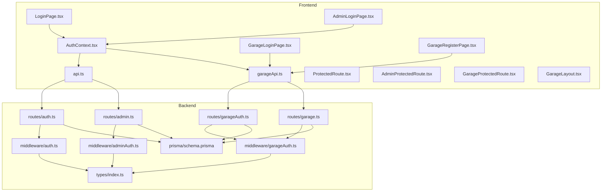
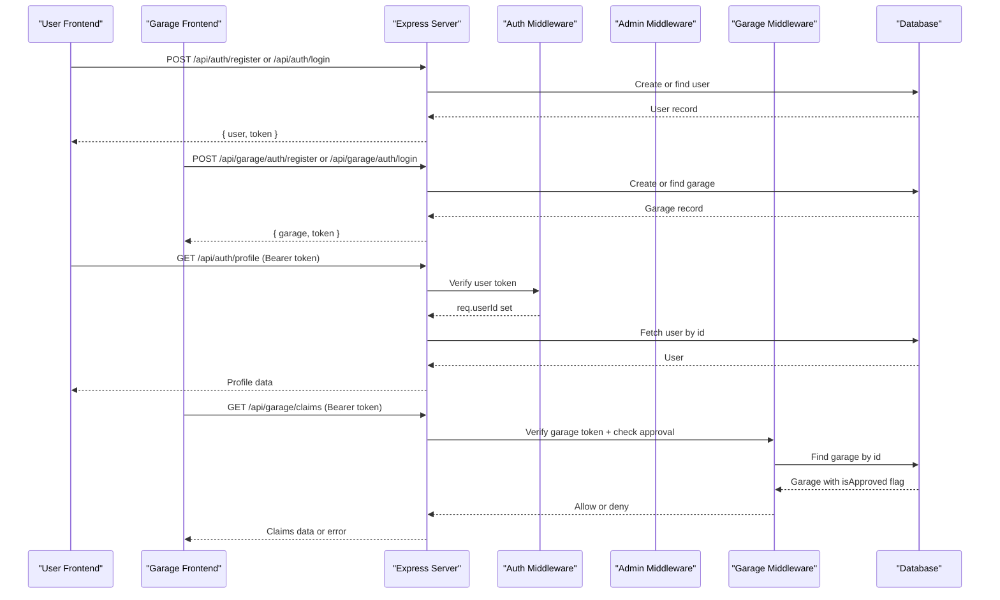
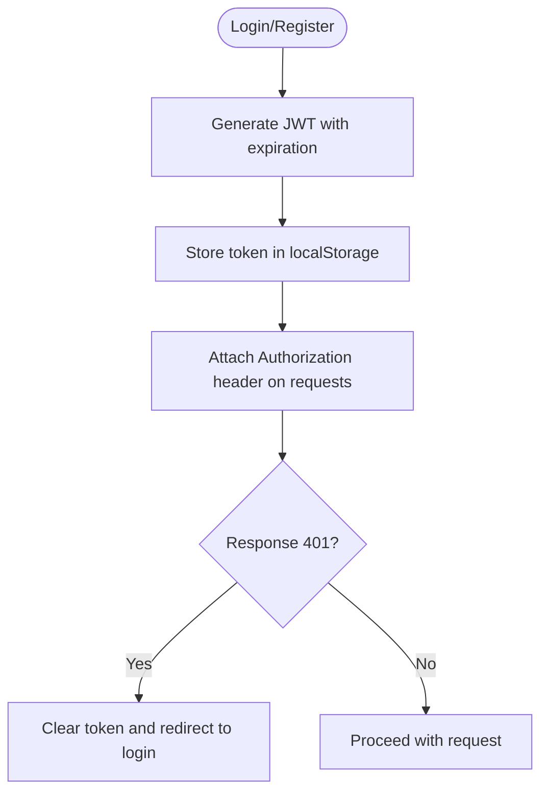
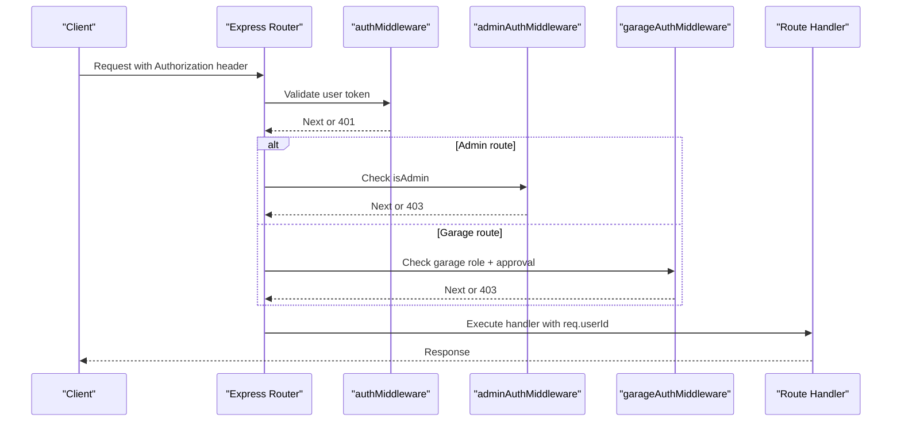
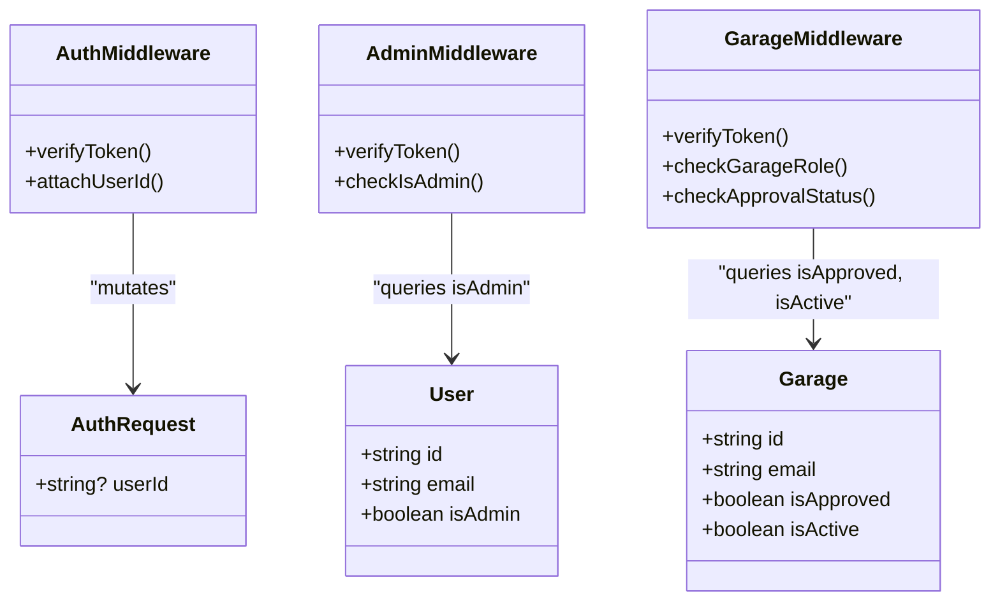
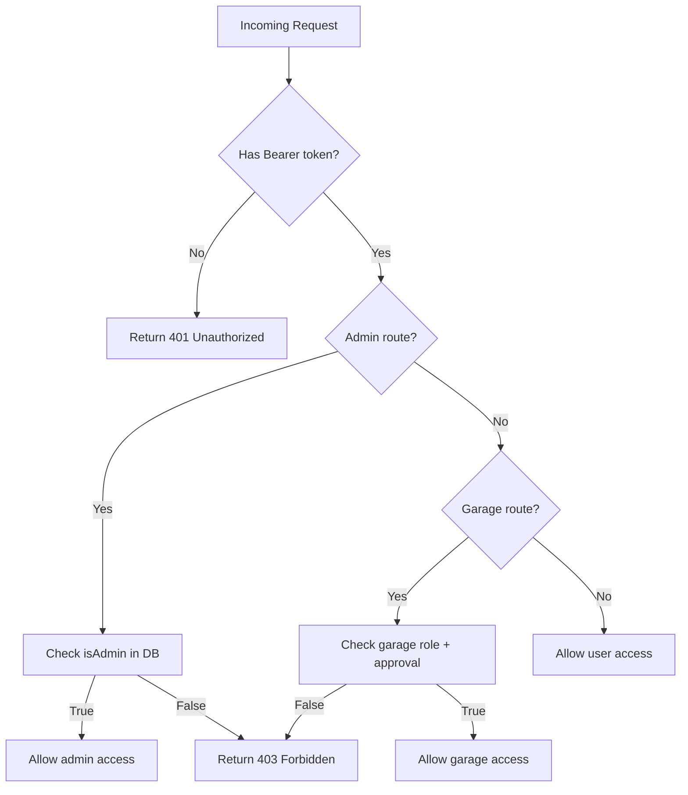
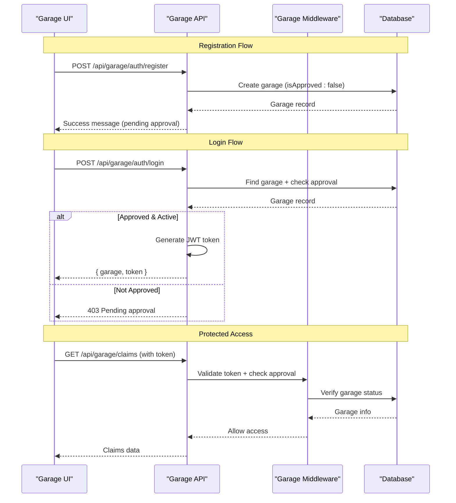
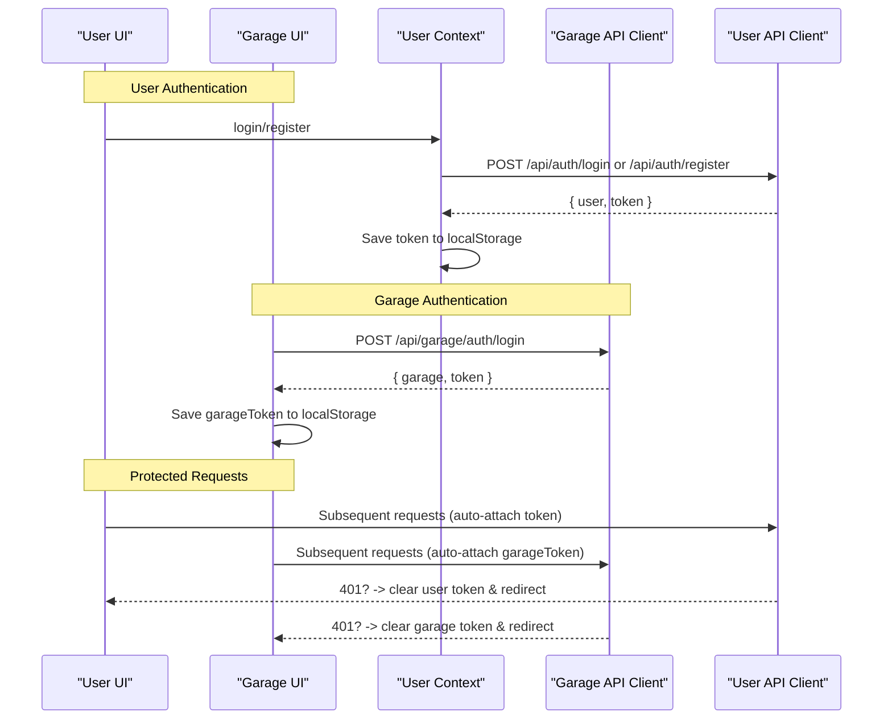
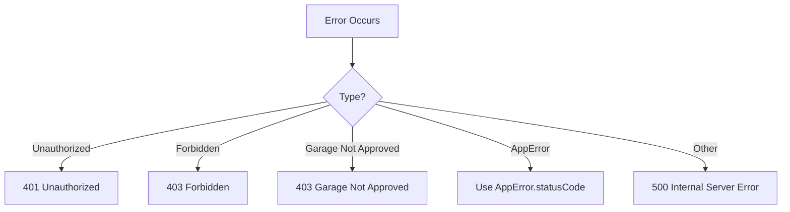
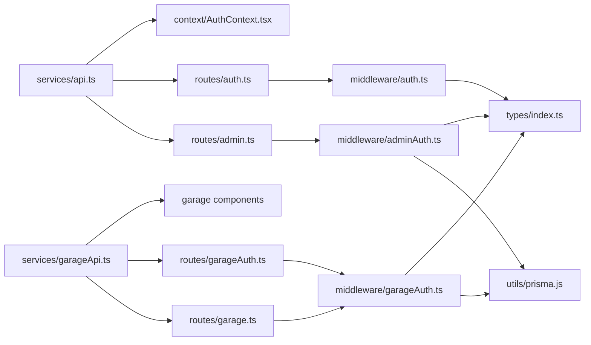

# Authentication & Authorization

<cite>
**Referenced Files in This Document**
- [auth.ts](file://backend/src/middleware/auth.ts)
- [adminAuth.ts](file://backend/src/middleware/adminAuth.ts)
- [garageAuth.ts](file://backend/src/middleware/garageAuth.ts)
- [errorHandler.ts](file://backend/src/middleware/errorHandler.ts)
- [index.ts](file://backend/src/types/index.ts)
- [auth.ts](file://backend/src/routes/auth.ts)
- [admin.ts](file://backend/src/routes/admin.ts)
- [garageAuth.ts](file://backend/src/routes/garageAuth.ts)
- [garage.ts](file://backend/src/routes/garage.ts)
- [schema.prisma](file://backend/prisma/schema.prisma)
- [api.ts](file://frontend/src/services/api.ts)
- [garageApi.ts](file://frontend/src/services/garageApi.ts)
- [AuthContext.tsx](file://frontend/src/context/AuthContext.tsx)
- [ProtectedRoute.tsx](file://frontend/src/components/ProtectedRoute.tsx)
- [AdminProtectedRoute.tsx](file://frontend/src/components/AdminProtectedRoute.tsx)
- [GarageProtectedRoute.tsx](file://frontend/src/components/GarageProtectedRoute.tsx)
- [LoginPage.tsx](file://frontend/src/pages/LoginPage.tsx)
- [AdminLoginPage.tsx](file://frontend/src/pages/admin/AdminLoginPage.tsx)
- [GarageLoginPage.tsx](file://frontend/src/pages/garage/GarageLoginPage.tsx)
- [GarageRegisterPage.tsx](file://frontend/src/pages/garage/GarageRegisterPage.tsx)
- [GarageLayout.tsx](file://frontend/src/components/GarageLayout.tsx)
</cite>

## Update Summary
**Changes Made**
- Added comprehensive documentation for garage-specific JWT authentication system
- Updated architecture diagrams to include garage authentication flow
- Added new sections covering garage registration, login, and profile management
- Enhanced middleware chain documentation to include garage authentication
- Updated protected routes section to cover garage-specific endpoints
- Added garage-specific session management and error handling

## Table of Contents
1. [Introduction](#introduction)
2. [Project Structure](#project-structure)
3. [Core Components](#core-components)
4. [Architecture Overview](#architecture-overview)
5. [Detailed Component Analysis](#detailed-component-analysis)
6. [Dependency Analysis](#dependency-analysis)
7. [Performance Considerations](#performance-considerations)
8. [Troubleshooting Guide](#troubleshooting-guide)
9. [Conclusion](#conclusion)
10. [Appendices](#appendices)

## Introduction
This document explains the JWT-based authentication and authorization system for the application, including the newly added garage-specific authentication system. It covers token generation, validation, role-based access control (user vs admin vs garage), middleware chain, session management on both frontend and backend, error handling, and security best practices. The system now supports three distinct user roles: regular users, administrators, and garage service providers, each with their own authentication flows and protected endpoints.

## Project Structure
The authentication system spans backend routes, middleware, types, database schema, as well as frontend services, context, and route guards. The system now includes separate authentication flows for users, admins, and garages.

**Diagram sources**
- [AuthContext.tsx:17-66](file://frontend/src/context/AuthContext.tsx#L17-L66)
- [api.ts:3-33](file://frontend/src/services/api.ts#L3-L33)
- [garageApi.ts:1-31](file://frontend/src/services/garageApi.ts#L1-L31)
- [auth.ts:10-167](file://backend/src/routes/auth.ts#L10-L167)
- [admin.ts:1-186](file://backend/src/routes/admin.ts#L1-L186)
- [garageAuth.ts:1-136](file://backend/src/routes/garageAuth.ts#L1-L136)
- [garage.ts:1-136](file://backend/src/routes/garage.ts#L1-L136)
- [auth.ts:5-22](file://backend/src/middleware/auth.ts#L5-L22)
- [adminAuth.ts:6-26](file://backend/src/middleware/adminAuth.ts#L6-L26)
- [garageAuth.ts:6-31](file://backend/src/middleware/garageAuth.ts#L6-L31)
- [index.ts:3-10](file://backend/src/types/index.ts#L3-L10)
- [schema.prisma:10-25](file://backend/prisma/schema.prisma#L10-L25)

**Section sources**
- [AuthContext.tsx:17-66](file://frontend/src/context/AuthContext.tsx#L17-L66)
- [api.ts:3-33](file://frontend/src/services/api.ts#L3-L33)
- [garageApi.ts:1-31](file://frontend/src/services/garageApi.ts#L1-L31)
- [auth.ts:10-167](file://backend/src/routes/auth.ts#L10-L167)
- [admin.ts:1-186](file://backend/src/routes/admin.ts#L1-L186)
- [garageAuth.ts:1-136](file://backend/src/routes/garageAuth.ts#L1-L136)
- [garage.ts:1-136](file://backend/src/routes/garage.ts#L1-L136)
- [auth.ts:5-22](file://backend/src/middleware/auth.ts#L5-L22)
- [adminAuth.ts:6-26](file://backend/src/middleware/adminAuth.ts#L6-L26)
- [garageAuth.ts:6-31](file://backend/src/middleware/garageAuth.ts#L6-L31)
- [index.ts:3-10](file://backend/src/types/index.ts#L3-L10)
- [schema.prisma:10-25](file://backend/prisma/schema.prisma#L10-L25)

## Core Components
- **JWT token lifecycle**:
  - Generation on register and login with fixed expiration windows for all user types.
  - Validation via middleware that extracts and verifies tokens from the Authorization header.
  - Separate token structures for different user roles (user, admin, garage).
- **Role-based access control**:
  - User-level protection via auth middleware.
  - Admin-only protection via admin middleware that checks user role in the database.
  - Garage-specific protection via garage middleware that validates garage status and approval.
- **Frontend session management**:
  - Token storage in localStorage with separate keys for each user type.
  - Axios interceptors attach appropriate tokens to requests.
  - Route guards enforce authenticated navigation for each portal.

Key responsibilities by file:
- **Backend routes**:
  - User routes: Register/login create users and issue tokens; profile endpoints are protected.
  - Admin routes: Guarded at the router level with admin middleware.
  - Garage routes: Complete authentication flow with registration, login, and profile management.
- **Middleware**:
  - Auth middleware validates user tokens and attaches userId to the request.
  - Admin middleware validates tokens and ensures the user has admin privileges.
  - Garage middleware validates garage tokens and checks account approval status.
- **Types**:
  - Typed request extensions and JWT payload shapes used across middleware and routes.
- **Database**:
  - Models include role flags (isAdmin for users, isApproved/isActive for garages) used for access checks.

**Section sources**
- [auth.ts:10-167](file://backend/src/routes/auth.ts#L10-L167)
- [admin.ts:1-186](file://backend/src/routes/admin.ts#L1-L186)
- [garageAuth.ts:1-136](file://backend/src/routes/garageAuth.ts#L1-L136)
- [garage.ts:1-136](file://backend/src/routes/garage.ts#L1-L136)
- [auth.ts:5-22](file://backend/src/middleware/auth.ts#L5-L22)
- [adminAuth.ts:6-26](file://backend/src/middleware/adminAuth.ts#L6-L26)
- [garageAuth.ts:6-31](file://backend/src/middleware/garageAuth.ts#L6-L31)
- [index.ts:3-10](file://backend/src/types/index.ts#L3-L10)
- [schema.prisma:10-25](file://backend/prisma/schema.prisma#L10-L25)

## Architecture Overview
The flow begins with clients authenticating against the appropriate backend endpoint based on their role. On success, the server returns a role-specific JWT which the client stores and attaches to subsequent requests. Protected routes validate the token and enforce role-based access before allowing access.

**Diagram sources**
- [auth.ts:10-167](file://backend/src/routes/auth.ts#L10-L167)
- [admin.ts:1-186](file://backend/src/routes/admin.ts#L1-L186)
- [garageAuth.ts:1-136](file://backend/src/routes/garageAuth.ts#L1-L136)
- [garage.ts:1-136](file://backend/src/routes/garage.ts#L1-L136)
- [auth.ts:5-22](file://backend/src/middleware/auth.ts#L5-L22)
- [adminAuth.ts:6-26](file://backend/src/middleware/adminAuth.ts#L6-L26)
- [garageAuth.ts:6-31](file://backend/src/middleware/garageAuth.ts#L6-L31)
- [schema.prisma:10-25](file://backend/prisma/schema.prisma#L10-L25)

## Detailed Component Analysis

### Token Generation and Storage
- **User tokens**: Generated on registration and login with fixed expiration period and user identifiers in payload.
- **Admin tokens**: Same structure as user tokens but with admin privileges checked during middleware execution.
- **Garage tokens**: Generated with garageId and role 'garage', stored separately in localStorage as 'garageToken'.
- **Frontend storage**: Each user type maintains separate token storage and automatic attachment via Axios interceptors.
- **Error handling**: On 401 responses, respective frontends clear local state and redirect to appropriate login pages.

**Updated** Added support for garage-specific token storage and handling

**Diagram sources**
- [auth.ts:48-54](file://backend/src/routes/auth.ts#L48-L54)
- [auth.ts:83-100](file://backend/src/routes/auth.ts#L83-L100)
- [garageAuth.ts:90-104](file://backend/src/routes/garageAuth.ts#L90-L104)
- [api.ts:7-33](file://frontend/src/services/api.ts#L7-L33)
- [garageApi.ts:7-14](file://frontend/src/services/garageApi.ts#L7-L14)
- [AuthContext.tsx:38-66](file://frontend/src/context/AuthContext.tsx#L38-L66)

**Section sources**
- [auth.ts:48-54](file://backend/src/routes/auth.ts#L48-L54)
- [auth.ts:83-100](file://backend/src/routes/auth.ts#L83-L100)
- [garageAuth.ts:90-104](file://backend/src/routes/garageAuth.ts#L90-L104)
- [api.ts:7-33](file://frontend/src/services/api.ts#L7-L33)
- [garageApi.ts:7-14](file://frontend/src/services/garageApi.ts#L7-L14)
- [AuthContext.tsx:38-66](file://frontend/src/context/AuthContext.tsx#L38-L66)

### Token Validation and Middleware Chain
- **Auth middleware**: Validates user tokens and sets req.userId for downstream handlers.
- **Admin middleware**: Validates tokens and queries database to ensure user has admin privileges.
- **Garage middleware**: Validates garage tokens, checks role is 'garage', verifies account approval and active status.
- **Sequential validation**: Each middleware performs specific role-based checks before granting access.

**Updated** Added garage middleware to the authentication chain

**Diagram sources**
- [auth.ts:5-22](file://backend/src/middleware/auth.ts#L5-L22)
- [adminAuth.ts:6-26](file://backend/src/middleware/adminAuth.ts#L6-L26)
- [garageAuth.ts:6-31](file://backend/src/middleware/garageAuth.ts#L6-L31)
- [admin.ts:1-7](file://backend/src/routes/admin.ts#L1-L7)
- [garage.ts:7-7](file://backend/src/routes/garage.ts#L7-L7)

**Section sources**
- [auth.ts:5-22](file://backend/src/middleware/auth.ts#L5-L22)
- [adminAuth.ts:6-26](file://backend/src/middleware/adminAuth.ts#L6-L26)
- [garageAuth.ts:6-31](file://backend/src/middleware/garageAuth.ts#L6-L31)
- [admin.ts:1-7](file://backend/src/routes/admin.ts#L1-L7)
- [garage.ts:7-7](file://backend/src/routes/garage.ts#L7-L7)

### Role-Based Access Control (User vs Admin vs Garage)
- **User role**: Any authenticated user can access protected user endpoints (e.g., profile).
- **Admin role**: Admin-only routes are mounted under a router that applies admin middleware globally.
- **Garage role**: Garage routes require valid garage tokens with approved and active status.
- **Hierarchical permissions**: Users < Garages < Admins in terms of system access.

**Updated** Added Garage class and GarageMiddleware to the role hierarchy

**Diagram sources**
- [schema.prisma:10-25](file://backend/prisma/schema.prisma#L10-L25)
- [index.ts:3-10](file://backend/src/types/index.ts#L3-L10)
- [auth.ts:5-22](file://backend/src/middleware/auth.ts#L5-L22)
- [adminAuth.ts:6-26](file://backend/src/middleware/adminAuth.ts#L6-L26)
- [garageAuth.ts:6-31](file://backend/src/middleware/garageAuth.ts#L6-L31)

**Section sources**
- [schema.prisma:10-25](file://backend/prisma/schema.prisma#L10-L25)
- [index.ts:3-10](file://backend/src/types/index.ts#L3-L10)
- [auth.ts:5-22](file://backend/src/middleware/auth.ts#L5-L22)
- [adminAuth.ts:6-26](file://backend/src/middleware/adminAuth.ts#L6-L26)
- [garageAuth.ts:6-31](file://backend/src/middleware/garageAuth.ts#L6-L31)

### Protected Routes and Examples
- **User-protected routes**: Profile retrieval and update require valid user tokens.
- **Admin-protected routes**: Stats, users, claims, documents endpoints require admin privileges.
- **Garage-protected routes**: Claims listing, claim details, and estimate submission require garage authentication.
- **Multi-layer protection**: Some endpoints may have additional business logic beyond basic authentication.

**Updated** Added garage route protection to the access control flow

**Diagram sources**
- [auth.ts:107-165](file://backend/src/routes/auth.ts#L107-L165)
- [admin.ts:1-186](file://backend/src/routes/admin.ts#L1-L186)
- [garageAuth.ts:111-133](file://backend/src/routes/garageAuth.ts#L111-L133)
- [garage.ts:11-136](file://backend/src/routes/garage.ts#L11-L136)
- [auth.ts:5-22](file://backend/src/middleware/auth.ts#L5-L22)
- [adminAuth.ts:6-26](file://backend/src/middleware/adminAuth.ts#L6-L26)
- [garageAuth.ts:6-31](file://backend/src/middleware/garageAuth.ts#L6-L31)

**Section sources**
- [auth.ts:107-165](file://backend/src/routes/auth.ts#L107-L165)
- [admin.ts:1-186](file://backend/src/routes/admin.ts#L1-L186)
- [garageAuth.ts:111-133](file://backend/src/routes/garageAuth.ts#L111-L133)
- [garage.ts:11-136](file://backend/src/routes/garage.ts#L11-L136)
- [auth.ts:5-22](file://backend/src/middleware/auth.ts#L5-L22)
- [adminAuth.ts:6-26](file://backend/src/middleware/adminAuth.ts#L6-L26)
- [garageAuth.ts:6-31](file://backend/src/middleware/garageAuth.ts#L6-L31)

### Garage Authentication Flow
- **Registration**: Creates garage accounts with pending approval status, requiring admin approval before login.
- **Login**: Validates credentials, checks approval and active status, generates 7-day JWT tokens.
- **Profile Management**: Protected endpoints for retrieving garage information and managing account details.
- **Business Logic**: Garage-specific endpoints for claim management and estimate submission.

**New Section** Comprehensive documentation of the complete garage authentication workflow

**Diagram sources**
- [garageAuth.ts:11-56](file://backend/src/routes/garageAuth.ts#L11-L56)
- [garageAuth.ts:58-109](file://backend/src/routes/garageAuth.ts#L58-L109)
- [garageAuth.ts:111-133](file://backend/src/routes/garageAuth.ts#L111-L133)
- [garage.ts:11-136](file://backend/src/routes/garage.ts#L11-L136)
- [garageAuth.ts:6-31](file://backend/src/middleware/garageAuth.ts#L6-L31)

**Section sources**
- [garageAuth.ts:11-56](file://backend/src/routes/garageAuth.ts#L11-L56)
- [garageAuth.ts:58-109](file://backend/src/routes/garageAuth.ts#L58-L109)
- [garageAuth.ts:111-133](file://backend/src/routes/garageAuth.ts#L111-L133)
- [garage.ts:11-136](file://backend/src/routes/garage.ts#L11-L136)
- [garageAuth.ts:6-31](file://backend/src/middleware/garageAuth.ts#L6-L31)

### Session Management (Frontend)
- **User sessions**: Tokens stored in localStorage and restored on app start with Axios interceptor.
- **Garage sessions**: Separate token storage ('garageToken') with dedicated API client and interceptors.
- **Admin sessions**: Standard user session management with admin role verification.
- **Error handling**: Each frontend handles 401/403 responses by clearing relevant tokens and redirecting to appropriate login pages.

**Updated** Added garage session management alongside existing user session handling

**Diagram sources**
- [AuthContext.tsx:17-66](file://frontend/src/context/AuthContext.tsx#L17-L66)
- [api.ts:7-33](file://frontend/src/services/api.ts#L7-L33)
- [garageApi.ts:7-28](file://frontend/src/services/garageApi.ts#L7-L28)
- [LoginPage.tsx:14-27](file://frontend/src/pages/LoginPage.tsx#L14-L27)
- [AdminLoginPage.tsx:13-32](file://frontend/src/pages/admin/AdminLoginPage.tsx#L13-L32)
- [GarageLoginPage.tsx:14-33](file://frontend/src/pages/garage/GarageLoginPage.tsx#L14-L33)

**Section sources**
- [AuthContext.tsx:17-66](file://frontend/src/context/AuthContext.tsx#L17-L66)
- [api.ts:7-33](file://frontend/src/services/api.ts#L7-L33)
- [garageApi.ts:7-28](file://frontend/src/services/garageApi.ts#L7-L28)
- [LoginPage.tsx:14-27](file://frontend/src/pages/LoginPage.tsx#L14-L27)
- [AdminLoginPage.tsx:13-32](file://frontend/src/pages/admin/AdminLoginPage.tsx#L13-L32)
- [GarageLoginPage.tsx:14-33](file://frontend/src/pages/garage/GarageLoginPage.tsx#L14-L33)

### Error Handling and Responses
- **Authentication errors**: Missing or invalid tokens result in 401 responses across all user types.
- **Authorization errors**: Insufficient permissions result in 403 responses with role-specific messages.
- **Garage-specific errors**: Account not found, not approved, or inactive status return 403 with descriptive messages.
- **Centralized handling**: Error handler converts errors into consistent JSON responses across the application.

**Updated** Added garage-specific error handling for approval and status checks

**Diagram sources**
- [auth.ts:5-22](file://backend/src/middleware/auth.ts#L5-L22)
- [adminAuth.ts:6-26](file://backend/src/middleware/adminAuth.ts#L6-L26)
- [garageAuth.ts:6-31](file://backend/src/middleware/garageAuth.ts#L6-L31)
- [errorHandler.ts:13-27](file://backend/src/middleware/errorHandler.ts#L13-L27)

**Section sources**
- [auth.ts:5-22](file://backend/src/middleware/auth.ts#L5-L22)
- [adminAuth.ts:6-26](file://backend/src/middleware/adminAuth.ts#L6-L26)
- [garageAuth.ts:6-31](file://backend/src/middleware/garageAuth.ts#L6-L31)
- [errorHandler.ts:13-27](file://backend/src/middleware/errorHandler.ts#L13-L27)

## Dependency Analysis
- **Backend dependencies**:
  - Express routes depend on middleware for authentication and authorization.
  - Middleware depends on JSON Web Token library and environment secret.
  - Admin and garage middleware depend on Prisma client to read user/garage roles and status.
- **Frontend dependencies**:
  - Axios interceptors depend on localStorage for token persistence with separate storage per user type.
  - Context manages user state while garage components manage garage-specific state.

**Updated** Added garage authentication dependencies to the dependency graph

**Diagram sources**
- [auth.ts:10-167](file://backend/src/routes/auth.ts#L10-L167)
- [admin.ts:1-186](file://backend/src/routes/admin.ts#L1-L186)
- [garageAuth.ts:1-136](file://backend/src/routes/garageAuth.ts#L1-L136)
- [garage.ts:1-136](file://backend/src/routes/garage.ts#L1-L136)
- [auth.ts:5-22](file://backend/src/middleware/auth.ts#L5-L22)
- [adminAuth.ts:6-26](file://backend/src/middleware/adminAuth.ts#L6-L26)
- [garageAuth.ts:6-31](file://backend/src/middleware/garageAuth.ts#L6-L31)
- [index.ts:3-10](file://backend/src/types/index.ts#L3-L10)
- [api.ts:3-33](file://frontend/src/services/api.ts#L3-L33)
- [garageApi.ts:1-31](file://frontend/src/services/garageApi.ts#L1-L31)
- [AuthContext.tsx:17-66](file://frontend/src/context/AuthContext.tsx#L17-L66)

**Section sources**
- [auth.ts:10-167](file://backend/src/routes/auth.ts#L10-L167)
- [admin.ts:1-186](file://backend/src/routes/admin.ts#L1-L186)
- [garageAuth.ts:1-136](file://backend/src/routes/garageAuth.ts#L1-L136)
- [garage.ts:1-136](file://backend/src/routes/garage.ts#L1-L136)
- [auth.ts:5-22](file://backend/src/middleware/auth.ts#L5-L22)
- [adminAuth.ts:6-26](file://backend/src/middleware/adminAuth.ts#L6-L26)
- [garageAuth.ts:6-31](file://backend/src/middleware/garageAuth.ts#L6-L31)
- [index.ts:3-10](file://backend/src/types/index.ts#L3-L10)
- [api.ts:3-33](file://frontend/src/services/api.ts#L3-L33)
- [garageApi.ts:1-31](file://frontend/src/services/garageApi.ts#L1-L31)
- [AuthContext.tsx:17-66](file://frontend/src/context/AuthContext.tsx#L17-L66)

## Performance Considerations
- **Token verification**: Lightweight but should be performed once per request; avoid redundant checks.
- **Database queries**: Admin and garage checks query the database; consider caching user/garage roles if high traffic is expected.
- **Token payloads**: Keep minimal to reduce bandwidth overhead across all user types.
- **Efficient queries**: Use efficient Prisma queries and selective field projection to minimize data transfer.
- **Separate API clients**: Dedicated garage API client reduces overhead for non-garage users.

## Troubleshooting Guide
Common issues and resolutions:
- **401 Unauthorized**:
  - Ensure Authorization header is present and formatted as Bearer <token>.
  - Confirm the token is valid and not expired for the correct user type.
  - If the frontend receives 401, it clears stored credentials and redirects to appropriate login.
- **403 Forbidden**:
  - For admin routes, verify the user has admin privileges in the database.
  - For garage routes, verify the garage account is approved and active.
  - Check that the token contains the correct role for the requested endpoint.
- **Invalid token**:
  - Verify the JWT secret configuration matches between signing and verification.
  - Ensure tokens are generated for the correct user type (user, admin, or garage).
- **Garage-specific issues**:
  - "Account pending approval": Garage must be approved by admin before login.
  - "Account deactivated": Garage account has been marked as inactive.
  - "Garage access required": Token exists but doesn't contain garage role.

**Updated** Added garage-specific troubleshooting scenarios

**Section sources**
- [auth.ts:5-22](file://backend/src/middleware/auth.ts#L5-L22)
- [adminAuth.ts:6-26](file://backend/src/middleware/adminAuth.ts#L6-L26)
- [garageAuth.ts:6-31](file://backend/src/middleware/garageAuth.ts#L6-L31)
- [api.ts:22-33](file://frontend/src/services/api.ts#L22-L33)
- [garageApi.ts:16-28](file://frontend/src/services/garageApi.ts#L16-L28)

## Conclusion
The system implements a comprehensive JWT-based authentication flow with role-based authorization for user, admin, and garage roles. Tokens are generated on registration and login, validated by specialized middleware, and enforced by route guards on both frontend and backend. The addition of garage authentication provides a complete solution for service provider integration with proper approval workflows and business logic. Security relies on proper token handling, secure secrets, and careful permission checks across all user types. To enhance resilience, consider adding refresh tokens, rate limiting, CSRF protections, and centralized audit logging.

## Appendices

### Implementing Custom Authentication Flows
- Add new endpoints in the appropriate auth routes for custom flows (e.g., social login callbacks).
- Issue JWTs consistently with the same payload structure and expiration policy for each user type.
- Extend middleware if additional claims need to be validated or injected into requests.
- Follow the garage authentication pattern for new user types requiring approval workflows.

### Integrating External Auth Providers
- Replace password verification with provider-specific verification logic.
- Map external identities to internal user records and set appropriate roles.
- Issue JWTs after successful external authentication following established patterns.
- For garage integrations, maintain the approval workflow requirement.

### Securing Sensitive Endpoints
- Apply auth middleware to protect user endpoints.
- Apply admin middleware to protect administrative endpoints.
- Apply garage middleware to protect garage-specific endpoints.
- Validate inputs and sanitize outputs to prevent injection and data leaks.

**Section sources**
- [auth.ts:107-165](file://backend/src/routes/auth.ts#L107-L165)
- [admin.ts:1-186](file://backend/src/routes/admin.ts#L1-L186)
- [garageAuth.ts:111-133](file://backend/src/routes/garageAuth.ts#L111-L133)
- [garage.ts:11-136](file://backend/src/routes/garage.ts#L11-L136)

### Token Expiration Handling
- Current implementation uses fixed expiration windows: 7 days for garage tokens, variable for user/admin tokens.
- Frontends handle 401 by clearing relevant tokens and redirecting to appropriate login pages.
- Consider implementing refresh tokens to improve UX while maintaining security across all user types.

**Section sources**
- [auth.ts:48-54](file://backend/src/routes/auth.ts#L48-L54)
- [auth.ts:83-100](file://backend/src/routes/auth.ts#L83-L100)
- [garageAuth.ts:90-94](file://backend/src/routes/garageAuth.ts#L90-L94)
- [api.ts:22-33](file://frontend/src/services/api.ts#L22-L33)
- [garageApi.ts:16-28](file://frontend/src/services/garageApi.ts#L16-L28)

### Security Best Practices
- Store secrets securely via environment variables and never hardcode them.
- Use HTTPS in production to protect tokens in transit.
- Limit token scope and lifetime to the minimum necessary for each user type.
- Implement rate limiting on authentication endpoints to mitigate brute-force attacks.
- Consider CSRF protections for browser-based flows where applicable.
- Regularly rotate JWT secrets and monitor for suspicious authentication patterns.

### Garage-Specific Security Considerations
- **Approval Workflow**: All garage accounts require admin approval before they can authenticate.
- **Status Monitoring**: Active and approved status checks prevent unauthorized access even with valid tokens.
- **Data Isolation**: Garage endpoints only access data assigned to the authenticated garage.
- **Business Logic Validation**: Additional checks ensure garage estimates can only be submitted when AI assessment is complete.

**Section sources**
- [garageAuth.ts:74-82](file://backend/src/routes/garageAuth.ts#L74-L82)
- [garageAuth.ts:20-24](file://backend/src/middleware/garageAuth.ts#L20-L24)
- [garage.ts:83-86](file://backend/src/routes/garage.ts#L83-L86)