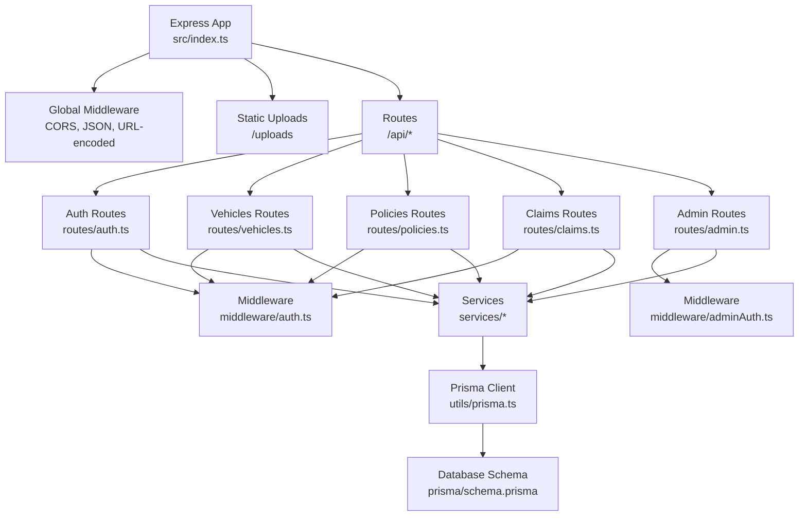
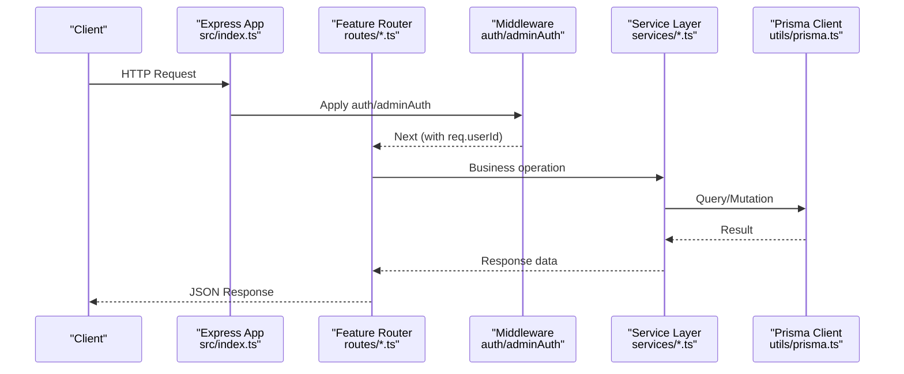
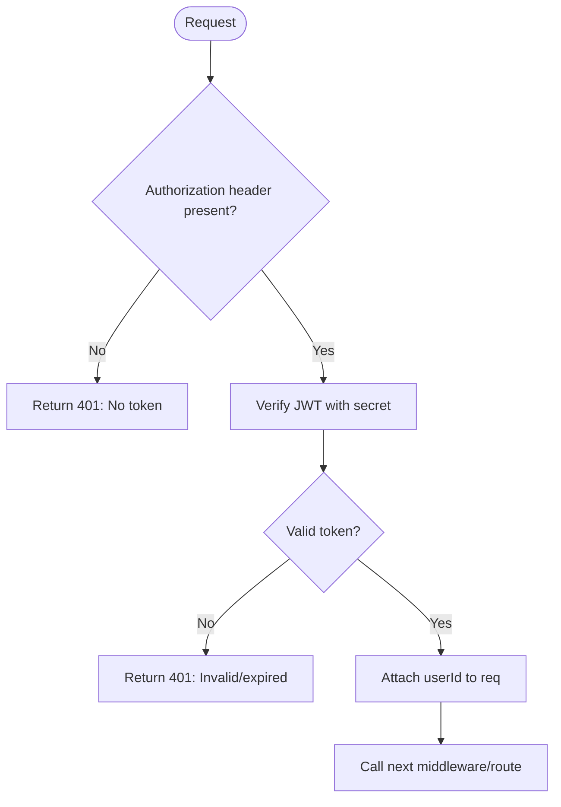
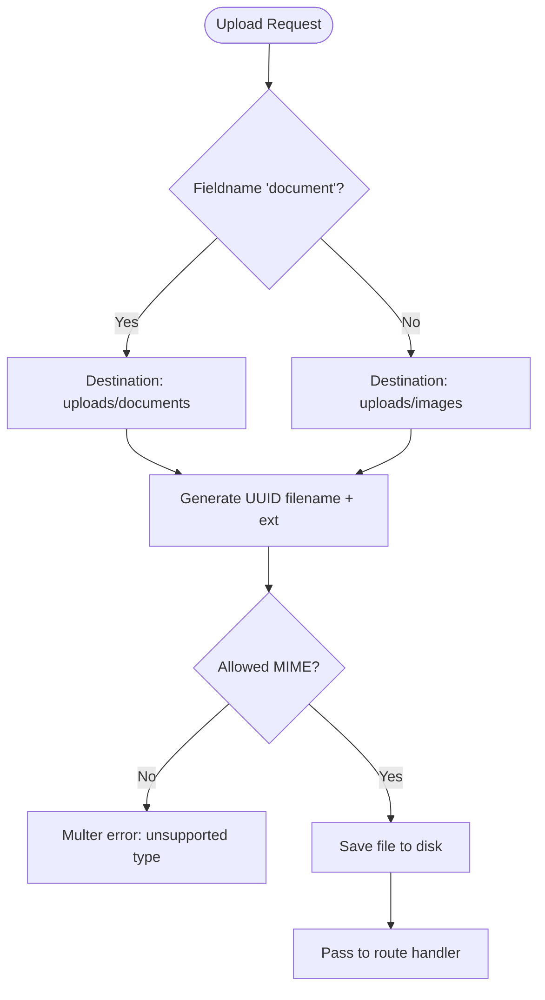
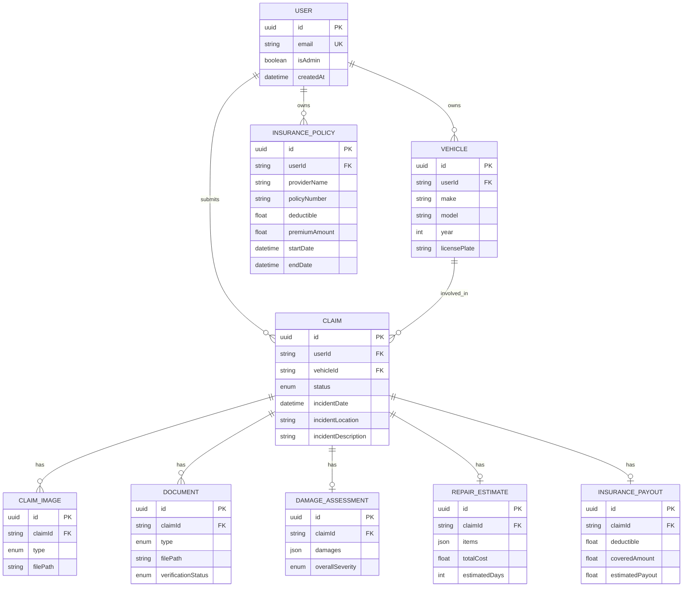
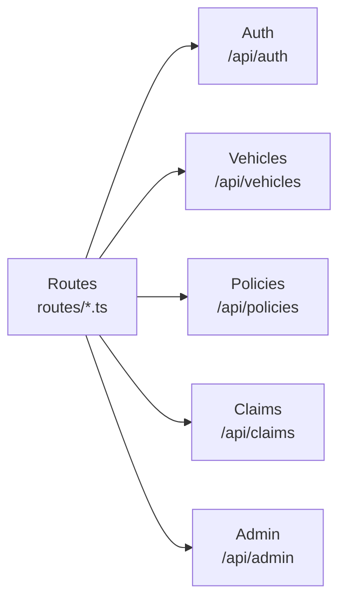
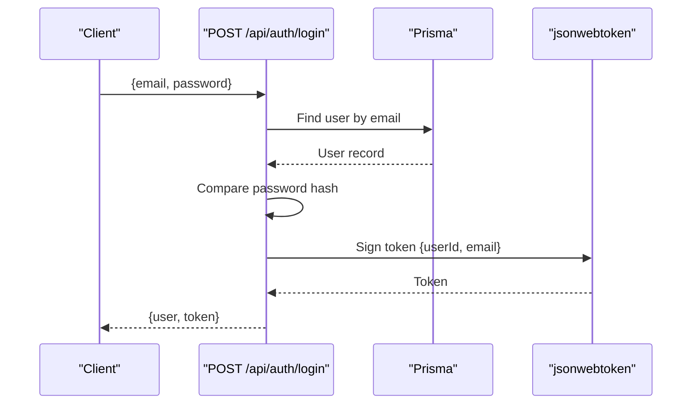
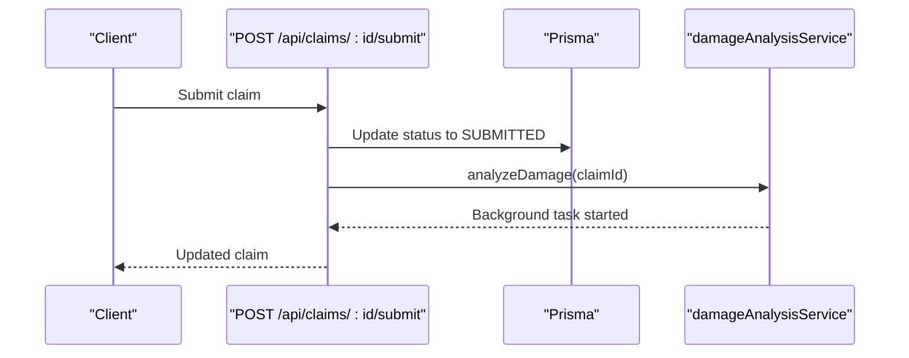
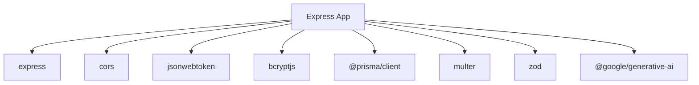

# Backend Documentation

<cite>
**Referenced Files in This Document**
- [index.ts](file://backend/src/index.ts)
- [package.json](file://backend/package.json)
- [schema.prisma](file://backend/prisma/schema.prisma)
- [auth.ts](file://backend/src/middleware/auth.ts)
- [adminAuth.ts](file://backend/src/middleware/adminAuth.ts)
- [errorHandler.ts](file://backend/src/middleware/errorHandler.ts)
- [upload.ts](file://backend/src/middleware/upload.ts)
- [auth.ts](file://backend/src/routes/auth.ts)
- [claims.ts](file://backend/src/routes/claims.ts)
- [vehicles.ts](file://backend/src/routes/vehicles.ts)
- [policies.ts](file://backend/src/routes/policies.ts)
- [admin.ts](file://backend/src/routes/admin.ts)
- [prisma.ts](file://backend/src/utils/prisma.ts)
- [index.ts](file://backend/src/types/index.ts)
</cite>

## Table of Contents
1. Introduction
2. Project Structure
3. Core Components
4. Architecture Overview
5. Detailed Component Analysis
6. Dependency Analysis
7. Performance Considerations
8. Troubleshooting Guide
9. Conclusion
10. Appendices

## Introduction
This document provides comprehensive backend documentation for the Express.js server architecture of the Smart Vehicle Insurance Claim System. It covers server setup, middleware chain (CORS, JSON parsing, authentication, error handling), route organization by feature modules, controller patterns within routes, service layer abstraction for business logic, JWT-based authentication with role-based authorization, file upload handling with Multer, input validation, error response patterns, logging strategies, database connection and query patterns via Prisma, and guidance for extending the API with new endpoints and business logic.

## Project Structure
The backend is organized into clear layers:
- Application entrypoint and global middleware configuration
- Feature-based route modules under routes/
- Reusable middleware under middleware/
- Business logic services under services/
- Shared types under types/
- Database schema and client utilities under prisma/ and utils/

**Diagram sources**
- [index.ts:1-49](file://backend/src/index.ts#L1-L49)
- [auth.ts:1-23](file://backend/src/middleware/auth.ts#L1-L23)
- [adminAuth.ts:1-27](file://backend/src/middleware/adminAuth.ts#L1-L27)
- [auth.ts:1-168](file://backend/src/routes/auth.ts#L1-L168)
- [vehicles.ts:1-169](file://backend/src/routes/vehicles.ts#L1-L169)
- [policies.ts:1-131](file://backend/src/routes/policies.ts#L1-L131)
- [claims.ts:1-450](file://backend/src/routes/claims.ts#L1-L450)
- [admin.ts:1-187](file://backend/src/routes/admin.ts#L1-L187)
- [prisma.ts:1-6](file://backend/src/utils/prisma.ts#L1-L6)
- [schema.prisma:1-202](file://backend/prisma/schema.prisma#L1-L202)

**Section sources**
- [index.ts:1-49](file://backend/src/index.ts#L1-L49)
- [package.json:1-43](file://backend/package.json#L1-L43)

## Core Components
- Server bootstrap and global middleware: CORS, JSON body parsing, URL-encoded parsing, static uploads directory serving, health check endpoint, and centralized error handler.
- Authentication middleware: Validates JWT tokens from Authorization header and attaches user context to requests.
- Admin authorization middleware: Extends authentication with admin role checks against the database.
- File upload middleware: Configures Multer storage, allowed MIME types, size limits, and subdirectories for images and documents.
- Error handling: Centralized error handler using a custom AppError class for consistent error responses.
- Route modules: Feature-scoped routers for auth, vehicles, policies, claims, and admin operations.
- Services: Business logic for damage analysis, repair estimates, document verification, vehicle detection, and claim assistant chat.
- Data access: Prisma client singleton for type-safe queries and relationships.

**Section sources**
- [index.ts:17-42](file://backend/src/index.ts#L17-L42)
- [auth.ts:5-22](file://backend/src/middleware/auth.ts#L5-L22)
- [adminAuth.ts:6-26](file://backend/src/middleware/adminAuth.ts#L6-L26)
- [upload.ts:1-54](file://backend/src/middleware/upload.ts#L1-L54)
- [errorHandler.ts:1-28](file://backend/src/middleware/errorHandler.ts#L1-L28)
- [prisma.ts:1-6](file://backend/src/utils/prisma.ts#L1-L6)

## Architecture Overview
The application follows a layered architecture:
- Entry point wires up middleware and mounts feature routes.
- Routes act as controllers, validating inputs and orchestrating calls to services.
- Services encapsulate business logic and external integrations (e.g., AI services).
- Prisma client abstracts database interactions with strong typing and relations.

**Diagram sources**
- [index.ts:17-42](file://backend/src/index.ts#L17-L42)
- [auth.ts:5-22](file://backend/src/middleware/auth.ts#L5-L22)
- [adminAuth.ts:6-26](file://backend/src/middleware/adminAuth.ts#L6-L26)
- [claims.ts:15-16](file://backend/src/routes/claims.ts#L15-L16)
- [prisma.ts:1-6](file://backend/src/utils/prisma.ts#L1-L6)

## Detailed Component Analysis

### Server Setup and Global Middleware
- Initializes Express app, loads environment variables, configures CORS with credentials, parses JSON and URL-encoded bodies, serves uploaded files statically, mounts API routes, defines a health endpoint, and registers the global error handler.
- Port is configurable via environment variable; default is 5000.

**Section sources**
- [index.ts:12-46](file://backend/src/index.ts#L12-L46)

### Authentication Middleware (JWT)
- Extracts Bearer token from Authorization header.
- Verifies token using JWT_SECRET and decodes payload.
- Attaches userId to request object for downstream handlers.
- Returns standardized 401 errors for missing or invalid tokens.

**Diagram sources**
- [auth.ts:5-22](file://backend/src/middleware/auth.ts#L5-L22)

**Section sources**
- [auth.ts:5-22](file://backend/src/middleware/auth.ts#L5-L22)
- [index.ts:17-23](file://backend/src/index.ts#L17-L23)

### Admin Authorization Middleware
- Ensures the authenticated user exists and has admin privileges by querying the User model.
- Returns 403 if not an admin; otherwise proceeds with userId attached.

**Section sources**
- [adminAuth.ts:6-26](file://backend/src/middleware/adminAuth.ts#L6-L26)
- [admin.ts:7-7](file://backend/src/routes/admin.ts#L7-L7)

### File Upload Handling with Multer
- Creates required directories for images and documents.
- Uses disk storage with UUID filenames and MIME filtering for images.
- Provides two upload configurations: one for image arrays and one for single documents.
- Enforces 10MB size limit per file.

**Diagram sources**
- [upload.ts:8-54](file://backend/src/middleware/upload.ts#L8-L54)

**Section sources**
- [upload.ts:1-54](file://backend/src/middleware/upload.ts#L1-L54)
- [claims.ts:195-233](file://backend/src/routes/claims.ts#L195-L233)
- [claims.ts:316-353](file://backend/src/routes/claims.ts#L316-L353)
- [vehicles.ts:15-32](file://backend/src/routes/vehicles.ts#L15-L32)

### Input Validation and Error Response Patterns
- Route handlers validate required fields and return 400 with descriptive messages when validation fails.
- Not found cases return 404.
- Unauthorized/forbidden handled by middleware returning 401/403.
- Centralized error handler catches unhandled exceptions and returns 500 with a generic message; domain-specific errors use AppError for custom status codes.

**Section sources**
- [auth.ts:11-59](file://backend/src/routes/auth.ts#L11-L59)
- [claims.ts:21-57](file://backend/src/routes/claims.ts#L21-L57)
- [vehicles.ts:34-63](file://backend/src/routes/vehicles.ts#L34-L63)
- [policies.ts:12-40](file://backend/src/routes/policies.ts#L12-L40)
- [errorHandler.ts:3-27](file://backend/src/middleware/errorHandler.ts#L3-L27)

### Logging Strategies
- Errors are logged to console.error in the central error handler and in route-level try/catch blocks for better observability during development.
- For production, consider structured logging (e.g., Winston/Pino) and log levels.

**Section sources**
- [errorHandler.ts:13-27](file://backend/src/middleware/errorHandler.ts#L13-L27)
- [claims.ts:53-56](file://backend/src/routes/claims.ts#L53-L56)
- [vehicles.ts:27-31](file://backend/src/routes/vehicles.ts#L27-L31)

### Database Connection and Query Patterns
- Prisma client is instantiated once and exported for reuse across routes and services.
- The schema defines core entities: User, Vehicle, InsurancePolicy, Claim, related images/documents, assessments, estimates, payouts, and chat messages.
- Queries commonly filter by userId to enforce ownership, include related entities for rich responses, and order results by creation date.

**Diagram sources**
- [schema.prisma:10-202](file://backend/prisma/schema.prisma#L10-L202)

**Section sources**
- [prisma.ts:1-6](file://backend/src/utils/prisma.ts#L1-L6)
- [schema.prisma:1-202](file://backend/prisma/schema.prisma#L1-L202)

### Route Organization and Controller Patterns
- Each feature module exports an Express Router mounted under /api/<feature>.
- Route handlers act as lightweight controllers: validate inputs, call services, manage transactions implicitly via Prisma, and format responses.
- Ownership checks are enforced at the route level using userId from authenticated requests.

**Diagram sources**
- [index.ts:29-34](file://backend/src/index.ts#L29-L34)
- [auth.ts:1-168](file://backend/src/routes/auth.ts#L1-L168)
- [vehicles.ts:1-169](file://backend/src/routes/vehicles.ts#L1-L169)
- [policies.ts:1-131](file://backend/src/routes/policies.ts#L1-L131)
- [claims.ts:1-450](file://backend/src/routes/claims.ts#L1-L450)
- [admin.ts:1-187](file://backend/src/routes/admin.ts#L1-L187)

**Section sources**
- [index.ts:29-34](file://backend/src/index.ts#L29-L34)
- [auth.ts:10-168](file://backend/src/routes/auth.ts#L10-L168)
- [vehicles.ts:10-169](file://backend/src/routes/vehicles.ts#L10-L169)
- [policies.ts:8-131](file://backend/src/routes/policies.ts#L8-L131)
- [claims.ts:15-450](file://backend/src/routes/claims.ts#L15-L450)
- [admin.ts:7-187](file://backend/src/routes/admin.ts#L7-L187)

### Authentication System: JWT Tokens, Role-Based Authorization, Session Management
- Registration and login create JWTs with userId and email, set to expire after 7 days.
- Protected routes require Bearer tokens; admin routes additionally verify admin flag in the database.
- Stateless sessions: no server-side session store; statelessness improves scalability.

**Diagram sources**
- [auth.ts:61-105](file://backend/src/routes/auth.ts#L61-L105)
- [auth.ts:48-54](file://backend/src/routes/auth.ts#L48-L54)

**Section sources**
- [auth.ts:10-105](file://backend/src/routes/auth.ts#L10-L105)
- [adminAuth.ts:6-26](file://backend/src/middleware/adminAuth.ts#L6-L26)

### Claims Workflow and Service Abstraction
- Create, list, retrieve, update, submit, analyze, estimate, upload images/documents, and chat endpoints are implemented in the claims router.
- Submitting a claim transitions status to SUBMITTED and triggers background AI damage analysis.
- Estimate generation requires prior damage assessment.
- Document upload supports multiple types and stores paths in the database.

**Diagram sources**
- [claims.ts:152-193](file://backend/src/routes/claims.ts#L152-L193)

**Section sources**
- [claims.ts:20-450](file://backend/src/routes/claims.ts#L20-L450)

### Vehicles and Policies CRUD
- Vehicles: register, detect via image, list, get, update, delete; ownership enforced by userId.
- Policies: create, list, get, update, delete; all protected by authentication.

**Section sources**
- [vehicles.ts:15-169](file://backend/src/routes/vehicles.ts#L15-L169)
- [policies.ts:12-131](file://backend/src/routes/policies.ts#L12-L131)

### Admin Endpoints
- Stats aggregation, user listing, claim listing with filters/search, detailed claim view, status updates, document listing, and approve/reject workflows.
- All admin routes are guarded by admin authorization middleware.

**Section sources**
- [admin.ts:11-187](file://backend/src/routes/admin.ts#L11-L187)

## Dependency Analysis
Key runtime dependencies include Express, CORS, JSON Web Tokens, bcryptjs, Prisma, Multer, Zod, and Google Generative AI. Development tooling includes TypeScript, tsx, and Nodemon.

**Diagram sources**
- [package.json:18-30](file://backend/package.json#L18-L30)

**Section sources**
- [package.json:1-43](file://backend/package.json#L1-L43)

## Performance Considerations
- Use Prisma’s select/include judiciously to minimize payload sizes and reduce over-fetching.
- Leverage background tasks for long-running operations like AI analysis to keep request latency low.
- Configure appropriate rate limiting and request size limits for production.
- Consider caching frequently accessed read-only data (e.g., admin stats) where appropriate.
- Ensure proper indexing on foreign keys and frequently filtered columns in the database.

[No sources needed since this section provides general guidance]

## Troubleshooting Guide
- Missing or invalid JWT: Ensure Authorization header uses Bearer scheme and token is signed with the correct secret.
- Upload failures: Verify file MIME types and size limits; ensure upload directories exist and are writable.
- Not found errors: Confirm resource ownership by checking userId filters and IDs.
- Centralized errors: Use AppError for expected errors with specific status codes; unexpected errors fall through to the global handler.

**Section sources**
- [auth.ts:5-22](file://backend/src/middleware/auth.ts#L5-L22)
- [upload.ts:30-47](file://backend/src/middleware/upload.ts#L30-L47)
- [errorHandler.ts:3-27](file://backend/src/middleware/errorHandler.ts#L3-L27)

## Conclusion
The backend implements a clean, modular Express architecture with robust authentication, role-based authorization, and well-structured routes. Services encapsulate business logic, while Prisma provides type-safe data access. File uploads are handled securely with Multer, and errors are consistently managed. This design facilitates easy extension with new endpoints and features.

[No sources needed since this section summarizes without analyzing specific files]

## Appendices

### Extending the API with New Endpoints
- Add a new feature router under routes/ and mount it in index.ts under /api/<feature>.
- Implement route handlers that validate inputs, call services, and return standardized JSON responses.
- Protect routes with authMiddleware or adminAuthMiddleware as needed.
- Define any new models in prisma/schema.prisma and run migrations.

**Section sources**
- [index.ts:29-34](file://backend/src/index.ts#L29-L34)
- [schema.prisma:1-202](file://backend/prisma/schema.prisma#L1-L202)

### Implementing Additional Business Logic
- Place reusable logic in services/ to keep routes thin and focused on HTTP concerns.
- Use Prisma transactions for multi-step writes requiring atomicity.
- Integrate external APIs (e.g., AI services) within services and handle retries/timeouts appropriately.

**Section sources**
- [claims.ts:183-186](file://backend/src/routes/claims.ts#L183-L186)
- [prisma.ts:1-6](file://backend/src/utils/prisma.ts#L1-L6)