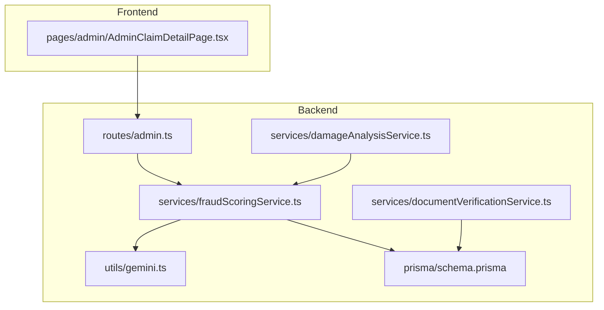
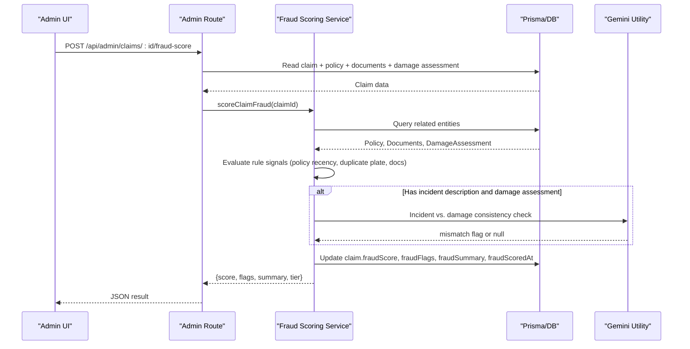
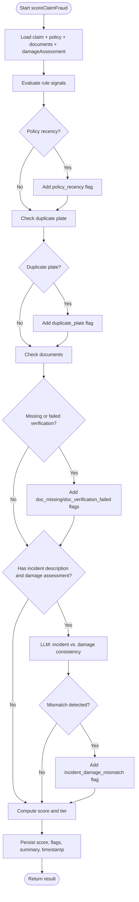
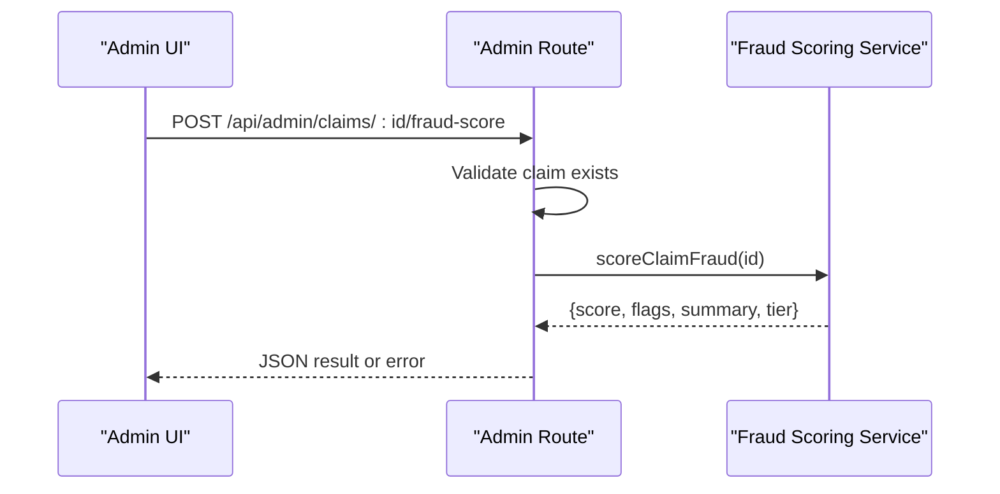
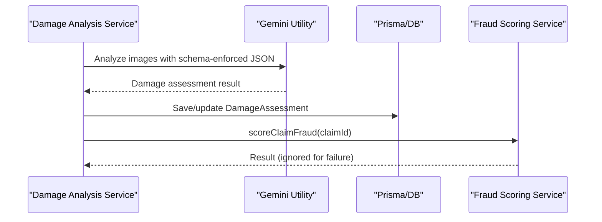
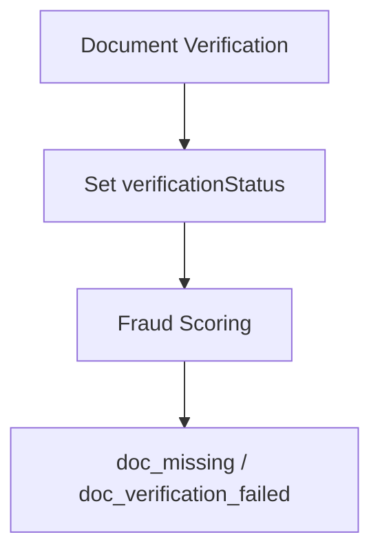
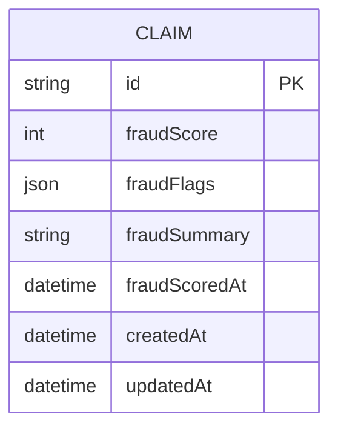
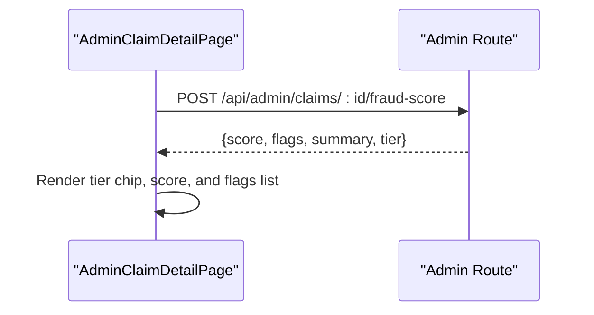
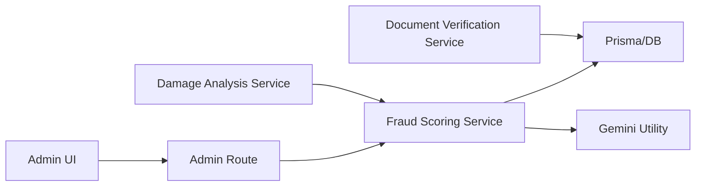

# AI-Powered Fraud Scoring Engine

<cite>
**Referenced Files in This Document**
- [fraudScoringService.ts](file://backend/src/services/fraudScoringService.ts)
- [admin.ts](file://backend/src/routes/admin.ts)
- [gemini.ts](file://backend/src/utils/gemini.ts)
- [damageAnalysisService.ts](file://backend/src/services/damageAnalysisService.ts)
- [documentVerificationService.ts](file://backend/src/services/documentVerificationService.ts)
- [schema.prisma](file://backend/prisma/schema.prisma)
- [index.ts](file://backend/src/index.ts)
- [AdminClaimDetailPage.tsx](file://frontend/src/pages/admin/AdminClaimDetailPage.tsx)
</cite>

## Table of Contents
1. [Introduction](#introduction)
2. [Project Structure](#project-structure)
3. [Core Components](#core-components)
4. [Architecture Overview](#architecture-overview)
5. [Detailed Component Analysis](#detailed-component-analysis)
6. [Dependency Analysis](#dependency-analysis)
7. [Performance Considerations](#performance-considerations)
8. [Troubleshooting Guide](#troubleshooting-guide)
9. [Conclusion](#conclusion)

## Introduction
This document explains the AI-powered fraud scoring engine for vehicle insurance claims. The system combines rule-based signals with an LLM-driven consistency check to compute a risk score and tier for each claim, persisting results for admin review and downstream workflows. It also describes how the scoring integrates with damage analysis and document verification, and how admins can trigger or re-run scoring from the UI.

## Project Structure
The fraud scoring feature spans backend services, routes, database schema, and frontend UI:
- Backend service computes scores using rules and LLM calls.
- Admin route exposes an endpoint to (re)score a claim.
- Damage analysis pipeline auto-triggers fraud scoring after analyzing images.
- Document verification contributes signals based on upload status and checks.
- Frontend displays risk tiers and allows admins to rescore claims.



**Diagram sources**
- [admin.ts:661-675](file://backend/src/routes/admin.ts#L661-L675)
- [fraudScoringService.ts:145-200](file://backend/src/services/fraudScoringService.ts#L145-L200)
- [gemini.ts:91-142](file://backend/src/utils/gemini.ts#L91-L142)
- [damageAnalysisService.ts:200-214](file://backend/src/services/damageAnalysisService.ts#L200-L214)
- [documentVerificationService.ts:40-98](file://backend/src/services/documentVerificationService.ts#L40-L98)
- [schema.prisma:129-164](file://backend/prisma/schema.prisma#L129-L164)
- [AdminClaimDetailPage.tsx:203-263](file://frontend/src/pages/admin/AdminClaimDetailPage.tsx#L203-L263)

**Section sources**
- [index.ts:1-81](file://backend/src/index.ts#L1-L81)
- [schema.prisma:129-164](file://backend/prisma/schema.prisma#L129-L164)

## Core Components
- Fraud scoring service: Computes risk score, flags, summary, and tier; persists results to the Claim model.
- Admin API route: Exposes POST /api/admin/claims/:id/fraud-score to trigger scoring.
- Gemini utility: Provides robust LLM calls with model fallbacks and timeouts.
- Damage analysis integration: Auto-invokes fraud scoring after image analysis.
- Document verification integration: Contributes signals when documents are missing or fail verification.
- Frontend admin panel: Displays risk tier and supports manual rescore.

Key responsibilities:
- Rule-based signals: policy recency, duplicate plate claims, document issues.
- LLM signal: incident vs. detected damage consistency.
- Persistence: update Claim fields for score, flags, summary, and timestamp.

**Section sources**
- [fraudScoringService.ts:4-15](file://backend/src/services/fraudScoringService.ts#L4-L15)
- [fraudScoringService.ts:22-73](file://backend/src/services/fraudScoringService.ts#L22-L73)
- [fraudScoringService.ts:100-135](file://backend/src/services/fraudScoringService.ts#L100-L135)
- [fraudScoringService.ts:145-200](file://backend/src/services/fraudScoringService.ts#L145-L200)
- [admin.ts:661-675](file://backend/src/routes/admin.ts#L661-L675)
- [gemini.ts:91-142](file://backend/src/utils/gemini.ts#L91-L142)
- [damageAnalysisService.ts:200-214](file://backend/src/services/damageAnalysisService.ts#L200-L214)
- [documentVerificationService.ts:40-98](file://backend/src/services/documentVerificationService.ts#L40-L98)
- [AdminClaimDetailPage.tsx:203-263](file://frontend/src/pages/admin/AdminClaimDetailPage.tsx#L203-L263)

## Architecture Overview
The scoring flow combines deterministic rules and an LLM decision into a single score and tier.



**Diagram sources**
- [admin.ts:661-675](file://backend/src/routes/admin.ts#L661-L675)
- [fraudScoringService.ts:145-200](file://backend/src/services/fraudScoringService.ts#L145-L200)
- [gemini.ts:91-142](file://backend/src/utils/gemini.ts#L91-L142)
- [schema.prisma:129-164](file://backend/prisma/schema.prisma#L129-L164)

## Detailed Component Analysis

### Fraud Scoring Service
Responsibilities:
- Load claim context (policy, documents, damage assessment).
- Compute rule-based signals:
  - Policy recency: flags if claim filed within a short window after policy start.
  - Duplicate plate: flags if the same license plate has multiple other claims.
  - Document signals: flags missing required documents or failed verification statuses.
- LLM-based signal:
  - Compare incident description with AI-detected damages to detect inconsistencies.
- Aggregate score:
  - Sum points from all flags, capped at 100.
  - Map score to tier: LOW/MEDIUM/HIGH.
- Persist results:
  - Update claim with score, flags, summary, and scored timestamp.



**Diagram sources**
- [fraudScoringService.ts:22-73](file://backend/src/services/fraudScoringService.ts#L22-L73)
- [fraudScoringService.ts:100-135](file://backend/src/services/fraudScoringService.ts#L100-L135)
- [fraudScoringService.ts:145-200](file://backend/src/services/fraudScoringService.ts#L145-L200)

**Section sources**
- [fraudScoringService.ts:22-73](file://backend/src/services/fraudScoringService.ts#L22-L73)
- [fraudScoringService.ts:100-135](file://backend/src/services/fraudScoringService.ts#L100-L135)
- [fraudScoringService.ts:145-200](file://backend/src/services/fraudScoringService.ts#L145-L200)

### Admin API Endpoint
- Endpoint: POST /api/admin/claims/:id/fraud-score
- Behavior:
  - Validates claim existence.
  - Invokes scoring service.
  - Returns computed result or error response.



**Diagram sources**
- [admin.ts:661-675](file://backend/src/routes/admin.ts#L661-L675)
- [fraudScoringService.ts:145-200](file://backend/src/services/fraudScoringService.ts#L145-L200)

**Section sources**
- [admin.ts:661-675](file://backend/src/routes/admin.ts#L661-L675)

### LLM Integration (Gemini Utility)
- Model cascade:
  - Attempts multiple models with fallbacks and timeouts.
  - Classifies errors to decide retry vs. next model vs. fatal.
- Structured output:
  - Supports responseMimeType and responseSchema for deterministic JSON parsing.
- Usage in fraud scoring:
  - Sends incident description and damage assessment to assess consistency.

```mermaid
classDiagram
class GeminiUtility {
+generateContentWithFallback(content, generationConfig) Promise~{text,modelUsed}~
+startChatWithFallback(history) Promise~{sendMessage,modelUsed}~
-getModel(modelName) GenerativeModel
-classifyError(err) FailureKind
-withTimeout(promise, ms) Promise
}
class FraudScoringService {
+scoreClaimFraud(claimId) Promise~FraudResult~
-incidentDamageMismatch(description, damageAssessment) Promise~FraudFlag|null~
}
FraudScoringService --> GeminiUtility : "uses"
```

**Diagram sources**
- [gemini.ts:91-142](file://backend/src/utils/gemini.ts#L91-L142)
- [fraudScoringService.ts:100-135](file://backend/src/services/fraudScoringService.ts#L100-L135)

**Section sources**
- [gemini.ts:91-142](file://backend/src/utils/gemini.ts#L91-L142)
- [fraudScoringService.ts:100-135](file://backend/src/services/fraudScoringService.ts#L100-L135)

### Damage Analysis Integration
- After analyzing images, the system:
  - Saves or updates damage assessment.
  - Auto-generates repair estimate.
  - Auto-scores the claim for fraud.



**Diagram sources**
- [damageAnalysisService.ts:120-214](file://backend/src/services/damageAnalysisService.ts#L120-L214)
- [gemini.ts:91-142](file://backend/src/utils/gemini.ts#L91-L142)
- [fraudScoringService.ts:145-200](file://backend/src/services/fraudScoringService.ts#L145-L200)

**Section sources**
- [damageAnalysisService.ts:120-214](file://backend/src/services/damageAnalysisService.ts#L120-L214)

### Document Verification Integration
- Verifies uploaded documents via LLM and sets verification status.
- Fraud scoring reads document types and verification statuses to add signals:
  - Missing required documents.
  - Failed verification statuses (ISSUES_FOUND, UNREADABLE, REJECTED).



**Diagram sources**
- [documentVerificationService.ts:40-98](file://backend/src/services/documentVerificationService.ts#L40-L98)
- [fraudScoringService.ts:53-73](file://backend/src/services/fraudScoringService.ts#L53-L73)

**Section sources**
- [documentVerificationService.ts:40-98](file://backend/src/services/documentVerificationService.ts#L40-L98)
- [fraudScoringService.ts:53-73](file://backend/src/services/fraudScoringService.ts#L53-L73)

### Data Model
The Claim entity stores fraud-related fields used by the scoring engine and admin UI.



**Diagram sources**
- [schema.prisma:129-164](file://backend/prisma/schema.prisma#L129-L164)

**Section sources**
- [schema.prisma:129-164](file://backend/prisma/schema.prisma#L129-L164)

### Frontend Admin Panel
- Displays current fraud risk tier and score.
- Allows admins to trigger scoring or re-scoring.
- Shows individual flags with point contributions.



**Diagram sources**
- [AdminClaimDetailPage.tsx:203-263](file://frontend/src/pages/admin/AdminClaimDetailPage.tsx#L203-L263)
- [admin.ts:661-675](file://backend/src/routes/admin.ts#L661-L675)

**Section sources**
- [AdminClaimDetailPage.tsx:203-263](file://frontend/src/pages/admin/AdminClaimDetailPage.tsx#L203-L263)

## Dependency Analysis
- Routes depend on services for business logic.
- Services depend on Prisma for data access and Gemini utility for LLM calls.
- Frontend depends on admin routes for triggering scoring.



**Diagram sources**
- [admin.ts:661-675](file://backend/src/routes/admin.ts#L661-L675)
- [fraudScoringService.ts:145-200](file://backend/src/services/fraudScoringService.ts#L145-L200)
- [gemini.ts:91-142](file://backend/src/utils/gemini.ts#L91-L142)
- [damageAnalysisService.ts:200-214](file://backend/src/services/damageAnalysisService.ts#L200-L214)
- [documentVerificationService.ts:40-98](file://backend/src/services/documentVerificationService.ts#L40-L98)

**Section sources**
- [admin.ts:661-675](file://backend/src/routes/admin.ts#L661-L675)
- [fraudScoringService.ts:145-200](file://backend/src/services/fraudScoringService.ts#L145-L200)
- [gemini.ts:91-142](file://backend/src/utils/gemini.ts#L91-L142)

## Performance Considerations
- LLM fallback cascade reduces latency and improves resilience by trying multiple models with timeouts and retries.
- Image handling limits (e.g., maximum number of images processed) help keep requests small and fast.
- Structured JSON responses via schema enforcement minimize parsing overhead and improve reliability.
- Auto-triggered scoring after damage analysis avoids extra user actions but should be monitored for load spikes.

[No sources needed since this section provides general guidance]

## Troubleshooting Guide
Common issues and resolutions:
- Missing environment variables at startup:
  - Ensure JWT_SECRET, GEMINI_API_KEY, DATABASE_URL are set before launching the server.
- LLM call failures:
  - The utility automatically falls back across models; persistent failures indicate auth or quota issues.
- No images for damage analysis:
  - Ensure claim has images; otherwise analysis will fail with a precondition error.
- Document verification parse errors:
  - If parsing fails, the system defaults to UNREADABLE and requires manual review.
- Admin scoring errors:
  - Nonexistent claim returns 404; transient AI errors return 502 with retry guidance.

**Section sources**
- [index.ts:19-26](file://backend/src/index.ts#L19-L26)
- [gemini.ts:91-142](file://backend/src/utils/gemini.ts#L91-L142)
- [damageAnalysisService.ts:120-140](file://backend/src/services/damageAnalysisService.ts#L120-L140)
- [documentVerificationService.ts:70-86](file://backend/src/services/documentVerificationService.ts#L70-L86)
- [admin.ts:661-675](file://backend/src/routes/admin.ts#L661-L675)

## Conclusion
The AI-powered fraud scoring engine blends deterministic rules with an LLM-based consistency check to produce actionable risk scores and tiers for insurance claims. It integrates tightly with damage analysis and document verification, persists results for admin review, and offers a simple admin workflow to trigger or re-run scoring. Robust LLM fallbacks and structured outputs ensure reliability under varying conditions.

[No sources needed since this section summarizes without analyzing specific files]