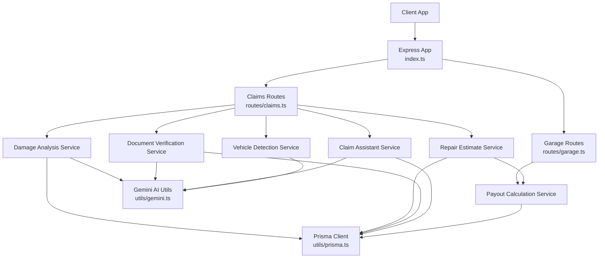
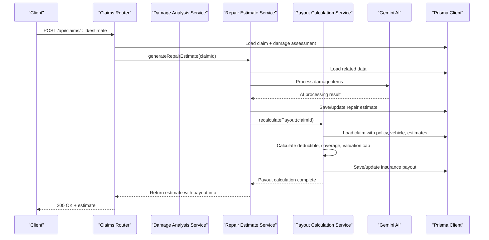
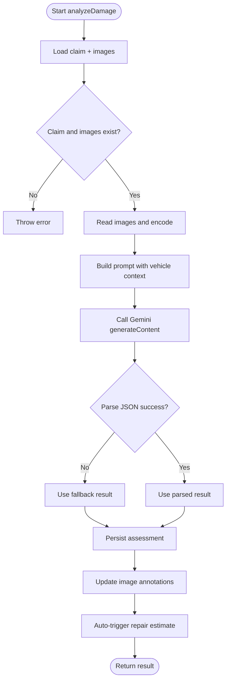
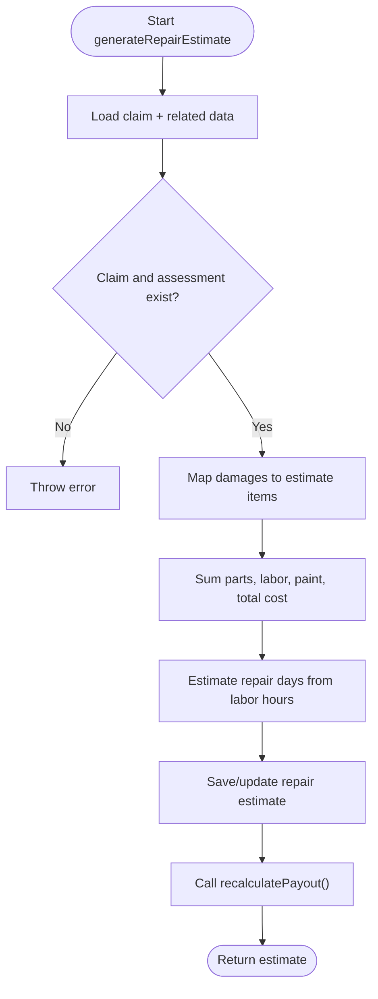
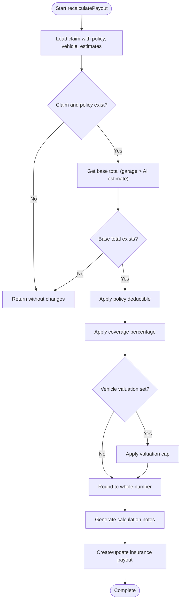
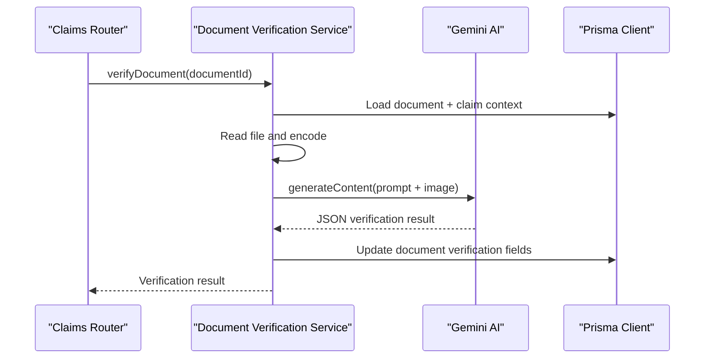
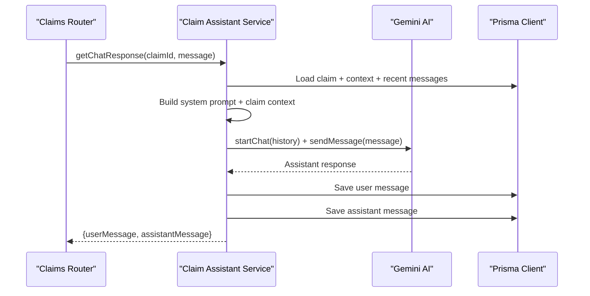
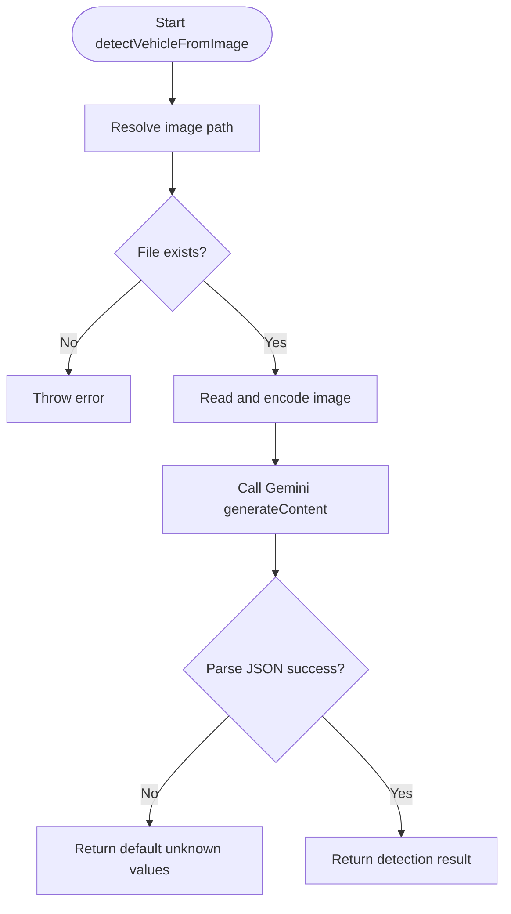
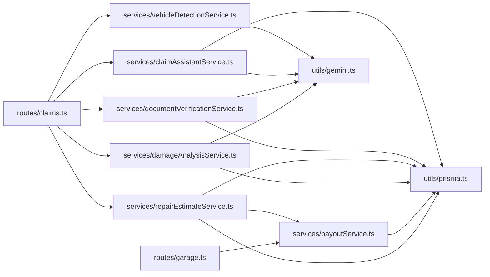

# Business Logic & Services

<cite>
**Referenced Files in This Document**
- [index.ts](file://backend/src/index.ts)
- [claims.ts](file://backend/src/routes/claims.ts)
- [garage.ts](file://backend/src/routes/garage.ts)
- [damageAnalysisService.ts](file://backend/src/services/damageAnalysisService.ts)
- [repairEstimateService.ts](file://backend/src/services/repairEstimateService.ts)
- [payoutService.ts](file://backend/src/services/payoutService.ts)
- [documentVerificationService.ts](file://backend/src/services/documentVerificationService.ts)
- [claimAssistantService.ts](file://backend/src/services/claimAssistantService.ts)
- [vehicleDetectionService.ts](file://backend/src/services/vehicleDetectionService.ts)
- [gemini.ts](file://backend/src/utils/gemini.ts)
- [prisma.ts](file://backend/src/utils/prisma.ts)
- [errorHandler.ts](file://backend/src/middleware/errorHandler.ts)
- [index.ts (types)](file://backend/src/types/index.ts)
</cite>

## Update Summary
**Changes Made**
- Added comprehensive documentation for the new Payout Calculation Service
- Updated architecture diagrams to include payout calculation flow
- Enhanced repair estimate service documentation with payout integration
- Added garage estimate prioritization logic documentation
- Updated dependency analysis to include payout service relationships

## Table of Contents
1. Introduction
2. Project Structure
3. Core Components
4. Architecture Overview
5. Detailed Component Analysis
6. Dependency Analysis
7. Performance Considerations
8. Troubleshooting Guide
9. Conclusion
10. Appendices

## Introduction
This document explains the business logic layer and service architecture of the Smart Vehicle Insurance Claim System. It focuses on how services implement a clear separation of concerns, integrate with AI capabilities, transform data, and handle errors. The system now includes a dedicated payout calculation service that implements core insurance logic for determining claim payouts, accounting for deductibles, coverage percentages, and vehicle valuation caps with garage estimate prioritization over AI repair estimates. You will find guidance on extending the service layer, composing services, testing strategies, and performance optimization techniques.

## Project Structure
The backend is organized around Express routes that delegate to domain-specific services. Each service encapsulates one area of business logic:
- Damage analysis: AI-powered inspection of vehicle images
- Repair estimation: Cost calculation from damage assessments
- **Payout calculation**: Core insurance logic for determining claim payouts with policy rules
- Document verification: AI-based validation of uploaded documents
- Claim assistant: Conversational support using claim context
- Vehicle detection: AI identification of vehicle details from images

**Diagram sources**
- [index.ts:25-45](file://backend/src/index.ts#L25-L45)
- [claims.ts:1-15](file://backend/src/routes/claims.ts#L1-L15)
- [garage.ts:1-8](file://backend/src/routes/garage.ts#L1-L8)
- [damageAnalysisService.ts:1-10](file://backend/src/services/damageAnalysisService.ts#L1-L10)
- [repairEstimateService.ts:1-5](file://backend/src/services/repairEstimateService.ts#L1-L5)
- [payoutService.ts:1-11](file://backend/src/services/payoutService.ts#L1-L11)
- [documentVerificationService.ts:1-6](file://backend/src/services/documentVerificationService.ts#L1-L6)
- [claimAssistantService.ts:1-5](file://backend/src/services/claimAssistantService.ts#L1-L5)
- [vehicleDetectionService.ts:1-5](file://backend/src/services/vehicleDetectionService.ts#L1-L5)
- [gemini.ts:1-12](file://backend/src/utils/gemini.ts#L1-L12)
- [prisma.ts:1-6](file://backend/src/utils/prisma.ts#L1-L6)

**Section sources**
- [index.ts:15-45](file://backend/src/index.ts#L15-L45)
- [claims.ts:1-15](file://backend/src/routes/claims.ts#L1-L15)
- [garage.ts:1-8](file://backend/src/routes/garage.ts#L1-L8)

## Core Components
- Damage Analysis Service: Reads claim images, calls AI to detect damages, persists results, updates image annotations, and triggers repair estimate generation.
- Repair Estimate Service: Transforms damage items into cost estimates using configurable pricing tables, calculates totals, and **integrates with payout calculation service**.
- **Payout Calculation Service**: Implements core insurance logic for determining claim payouts, accounting for deductibles, coverage percentages, and vehicle valuation caps with garage estimate prioritization over AI repair estimates.
- Document Verification Service: Validates uploaded documents via AI, extracts key information, and records verification status and recommendations.
- Claim Assistant Service: Builds rich context from claim data and chat history, then uses AI to provide conversational assistance.
- Vehicle Detection Service: Identifies vehicle make, model, year, color, and license plate from images via AI.

Key shared utilities:
- Gemini integration: Provides configured AI model access.
- Prisma client: Centralized database access.
- Error handling: Standardized error responses via middleware.

**Section sources**
- [damageAnalysisService.ts:50-153](file://backend/src/services/damageAnalysisService.ts#L50-L153)
- [repairEstimateService.ts:104-199](file://backend/src/services/repairEstimateService.ts#L104-L199)
- [payoutService.ts:11-67](file://backend/src/services/payoutService.ts#L11-L67)
- [documentVerificationService.ts:41-106](file://backend/src/services/documentVerificationService.ts#L41-L106)
- [claimAssistantService.ts:19-129](file://backend/src/services/claimAssistantService.ts#L19-L129)
- [vehicleDetectionService.ts:46-95](file://backend/src/services/vehicleDetectionService.ts#L46-L95)
- [gemini.ts:6-12](file://backend/src/utils/gemini.ts#L6-L12)
- [prisma.ts:1-6](file://backend/src/utils/prisma.ts#L1-L6)
- [errorHandler.ts:13-27](file://backend/src/middleware/errorHandler.ts#L13-L27)

## Architecture Overview
The system follows a layered architecture with enhanced payout calculation capabilities:
- Presentation: Express routes handle HTTP requests and parameter validation.
- Business Logic: Services encapsulate domain operations, orchestrate AI calls, persist results, and calculate insurance payouts.
- Data Access: Prisma client abstracts database interactions.
- External Integration: Gemini AI provides multimodal capabilities for vision and text.

**Diagram sources**
- [claims.ts:394-418](file://backend/src/routes/claims.ts#L394-L418)
- [repairEstimateService.ts:107-170](file://backend/src/services/repairEstimateService.ts#L107-L170)
- [payoutService.ts:11-67](file://backend/src/services/payoutService.ts#L11-L67)
- [gemini.ts:6-12](file://backend/src/utils/gemini.ts#L6-L12)
- [prisma.ts:1-6](file://backend/src/utils/prisma.ts#L1-L6)

## Detailed Component Analysis

### Damage Analysis Service
Responsibilities:
- Retrieve claim and associated images from the database.
- Prepare images for AI processing by reading files and encoding them.
- Build a prompt with vehicle context and send to AI.
- Parse structured JSON output; apply fallback if parsing fails.
- Persist damage assessment and update per-image annotations.
- Auto-trigger repair estimate generation after successful analysis.

Error handling:
- Throws when claim or images are missing.
- Catches AI parse failures and returns a safe default result.
- Logs background estimate generation errors without failing the request.

Performance considerations:
- Uses inline base64 images; consider streaming or external storage references for large batches.
- Avoids redundant AI calls by reusing existing assessments when possible.

Extensibility:
- Add new damage categories and severity mappings in prompts and downstream services.
- Introduce caching for repeated analyses on identical images.

**Diagram sources**
- [damageAnalysisService.ts:50-153](file://backend/src/services/damageAnalysisService.ts#L50-L153)

**Section sources**
- [damageAnalysisService.ts:50-153](file://backend/src/services/damageAnalysisService.ts#L50-L153)

### Repair Estimate Service
Responsibilities:
- Load claim, vehicle, damage assessment, and policy.
- Transform each damage item into an estimate line item using configurable parts/labor ranges and severity-based rates.
- Compute totals, labor hours, estimated days, and **integrate with payout calculation service**.
- Persist estimate and trigger payout recalculation.

Data transformation pipeline:
- DamageItem -> RepairEstimateItem (parts, labor, paint materials)
- Aggregate totals and derive estimated repair duration
- **Invoke payout calculation service for insurance deduction application**

Error handling:
- Throws when claim or damage assessment is missing.
- Gracefully handles missing policy by skipping payout calculation.

Optimization opportunities:
- Cache pricing tables and labor rates.
- Batch updates for multiple claims.

**Diagram sources**
- [repairEstimateService.ts:107-170](file://backend/src/services/repairEstimateService.ts#L107-L170)

**Section sources**
- [repairEstimateService.ts:107-170](file://backend/src/services/repairEstimateService.ts#L107-L170)

### Payout Calculation Service
**New Component** - Core insurance logic for determining claim payouts

Responsibilities:
- Load claim with policy, vehicle, and estimate data.
- Determine base estimate total with garage estimate prioritization over AI repair estimates.
- Apply policy deductible to reduce the base amount.
- Calculate covered amount based on policy coverage percentage.
- Apply vehicle valuation cap when set.
- Generate detailed notes explaining the payout calculation.
- Create or update insurance payout records.

Insurance Logic Implementation:
- **Garage Estimate Priority**: When a garage submits an estimate, it takes precedence over AI-generated estimates for payout calculations.
- **Deductible Application**: Subtracts policy deductible from the base estimate amount.
- **Coverage Percentage**: Applies the policy's coverage percentage to the deductible-adjusted amount.
- **Valuation Cap**: Caps the final payout at the vehicle's declared value when applicable.
- **Currency Formatting**: Uses Sri Lankan Rupees (Rs.) formatting for all monetary values.

Error handling:
- Silently returns when claim or policy is missing.
- Handles null estimate totals gracefully.
- Ensures non-negative payout amounts through Math.max operations.

Integration points:
- Called automatically after repair estimate generation.
- Called after garage estimate submission.
- Maintains transactional consistency with estimate updates.

**Diagram sources**
- [payoutService.ts:11-67](file://backend/src/services/payoutService.ts#L11-L67)

**Section sources**
- [payoutService.ts:11-67](file://backend/src/services/payoutService.ts#L11-L67)

### Document Verification Service
Responsibilities:
- Load document and related claim context.
- Read file from disk and encode for AI processing.
- Send document image with contextual prompt to AI.
- Parse structured JSON; apply fallback if parsing fails.
- Update document record with verification status and results.

Error handling:
- Throws when document or file not found.
- Returns a safe UNREADABLE state with recommendations on failure.

Integration points:
- Uses claim context (vehicle and user info) to improve accuracy.
- Persists verification outcomes for downstream workflows.

**Diagram sources**
- [documentVerificationService.ts:41-106](file://backend/src/services/documentVerificationService.ts#L41-L106)
- [claims.ts:379-397](file://backend/src/routes/claims.ts#L379-L397)

**Section sources**
- [documentVerificationService.ts:41-106](file://backend/src/services/documentVerificationService.ts#L41-L106)
- [claims.ts:379-397](file://backend/src/routes/claims.ts#L379-L397)

### Claim Assistant Service
Responsibilities:
- Load claim with full context (vehicle, policy, damage assessment, repair estimate, payout, documents).
- Build conversation history from stored chat messages.
- Compose system prompt and claim context for AI.
- Return assistant response and persist both user and assistant messages.

Design notes:
- Context assembly ensures concise, relevant answers grounded in claim data.
- Message persistence supports multi-turn conversations.

Error handling:
- Throws when claim is not found.
- Handles AI responses robustly; logs errors where applicable.

**Diagram sources**
- [claimAssistantService.ts:19-129](file://backend/src/services/claimAssistantService.ts#L19-L129)
- [claims.ts:423-447](file://backend/src/routes/claims.ts#L423-L447)

**Section sources**
- [claimAssistantService.ts:19-129](file://backend/src/services/claimAssistantService.ts#L19-L129)
- [claims.ts:423-447](file://backend/src/routes/claims.ts#L423-L447)

### Vehicle Detection Service
Responsibilities:
- Resolve image path and validate existence.
- Encode image and call AI to identify vehicle details.
- Parse structured JSON; return safe defaults on parse failure.

Usage patterns:
- Can be used during vehicle registration or claim creation to auto-fill vehicle details.

Error handling:
- Throws when image file is missing.
- Returns conservative defaults when AI cannot parse details.

**Diagram sources**
- [vehicleDetectionService.ts:46-95](file://backend/src/services/vehicleDetectionService.ts#L46-L95)

**Section sources**
- [vehicleDetectionService.ts:46-95](file://backend/src/services/vehicleDetectionService.ts#L46-L95)

## Dependency Analysis
Services depend on:
- Prisma client for persistent state
- Gemini utility for AI model access
- Types for shared interfaces
- **Payout calculation service for insurance logic**

Routes compose services and coordinate flows. The application bootstraps middleware and mounts route modules.

**Diagram sources**
- [claims.ts:1-15](file://backend/src/routes/claims.ts#L1-L15)
- [garage.ts:1-8](file://backend/src/routes/garage.ts#L1-L8)
- [damageAnalysisService.ts:1-6](file://backend/src/services/damageAnalysisService.ts#L1-L6)
- [repairEstimateService.ts:1-5](file://backend/src/services/repairEstimateService.ts#L1-L5)
- [payoutService.ts:1-2](file://backend/src/services/payoutService.ts#L1-L2)
- [documentVerificationService.ts:1-6](file://backend/src/services/documentVerificationService.ts#L1-L6)
- [claimAssistantService.ts:1-3](file://backend/src/services/claimAssistantService.ts#L1-L3)
- [vehicleDetectionService.ts:1-4](file://backend/src/services/vehicleDetectionService.ts#L1-L4)
- [gemini.ts:1-12](file://backend/src/utils/gemini.ts#L1-L12)
- [prisma.ts:1-6](file://backend/src/utils/prisma.ts#L1-L6)

**Section sources**
- [claims.ts:1-15](file://backend/src/routes/claims.ts#L1-L15)
- [garage.ts:1-8](file://backend/src/routes/garage.ts#L1-L8)
- [index.ts:25-45](file://backend/src/index.ts#L25-L45)

## Performance Considerations
- Asynchronous AI calls: Ensure non-blocking execution; use background tasks for long-running processes like damage analysis and document verification.
- Image handling: Minimize memory usage by streaming or chunking large images; avoid unnecessary base64 conversions where possible.
- Database queries: Use selective includes and indexes to reduce payload size and query time.
- Caching: Cache AI responses for identical inputs; cache pricing tables and configuration.
- Rate limiting: Protect AI endpoints against excessive requests.
- Concurrency: Parallelize independent operations (e.g., uploading multiple images) while respecting rate limits.
- **Payout calculation efficiency**: Leverage garage estimate prioritization to minimize redundant calculations and ensure consistent payout determinations.

[No sources needed since this section provides general guidance]

## Troubleshooting Guide
Common issues and resolutions:
- Missing environment variables: Ensure JWT_SECRET, GEMINI_API_KEY, DATABASE_URL are set at startup.
- File not found errors: Verify upload directories and paths; ensure files exist before AI calls.
- AI parsing failures: Implement robust fallbacks and log raw responses for debugging.
- Database connectivity: Health check endpoint can help confirm DB reachability.
- **Payout calculation issues**: Verify policy configuration, vehicle valuations, and estimate submissions for proper payout determination.

Error handling strategy:
- Centralized error handler standardizes responses and logs.
- Services throw descriptive errors for invalid states; routes catch and respond appropriately.
- **Payout service gracefully handles missing data without throwing errors for optimal workflow continuity**.

**Section sources**
- [index.ts:15-22](file://backend/src/index.ts#L15-L22)
- [index.ts:47-55](file://backend/src/index.ts#L47-L55)
- [errorHandler.ts:13-27](file://backend/src/middleware/errorHandler.ts#L13-L27)
- [payoutService.ts:22-26](file://backend/src/services/payoutService.ts#L22-L26)

## Conclusion
The service layer cleanly separates business logic from presentation, integrates AI capabilities through a unified utility, and persists state via Prisma. The addition of the dedicated payout calculation service enhances the system's ability to accurately determine insurance payouts with sophisticated logic including garage estimate prioritization, deductible application, coverage percentage calculation, and vehicle valuation capping. Services are composable, testable, and extensible. By following the patterns outlined here, you can add new capabilities while maintaining clear boundaries and robust error handling.

[No sources needed since this section summarizes without analyzing specific files]

## Appendices

### Service Composition Examples
- Submitting a claim triggers background damage analysis and subsequent repair estimate generation.
- **Repair estimate generation automatically triggers payout calculation with policy rules applied.**
- **Garage estimate submission replaces AI estimates and recalculates payouts with garage priority.**
- Uploading a document triggers verification and updates verification status for downstream workflows.
- Chat messages enrich the assistant's context with current claim state and history.

**Section sources**
- [claims.ts:152-193](file://backend/src/routes/claims.ts#L152-L193)
- [claims.ts:270-288](file://backend/src/routes/claims.ts#L270-L288)
- [claims.ts:290-314](file://backend/src/routes/claims.ts#L290-L314)
- [claims.ts:379-397](file://backend/src/routes/claims.ts#L379-L397)
- [claims.ts:423-447](file://backend/src/routes/claims.ts#L423-L447)
- [repairEstimateService.ts:159-161](file://backend/src/services/repairEstimateService.ts#L159-L161)
- [garage.ts:129-131](file://backend/src/routes/garage.ts#L129-L131)

### Testing Approaches
- Unit tests: Mock Prisma and Gemini utilities to isolate service logic.
- Integration tests: Use in-memory databases and stubbed AI responses to validate end-to-end flows.
- Contract tests: Validate request/response schemas and error shapes.
- Performance tests: Simulate concurrent uploads and AI calls to measure latency and throughput.
- **Payout calculation tests: Verify correct application of deductibles, coverage percentages, and valuation caps across different scenarios.**

[No sources needed since this section provides general guidance]

### Extending the Service Layer
Guidelines:
- Create a new service module with a single responsibility.
- Define types for inputs/outputs in shared types.
- Integrate with Gemini via the utility for AI features.
- Use Prisma for persistence and maintain transactional consistency.
- Expose endpoints in routes that compose services and handle errors.
- Maintain service boundaries: avoid cross-service coupling beyond well-defined interfaces.
- **Consider adding new insurance rule engines similar to the payout calculation service for future enhancements.**

**Section sources**
- [types/index.ts:12-51](file://backend/src/types/index.ts#L12-L51)
- [gemini.ts:6-12](file://backend/src/utils/gemini.ts#L6-L12)
- [prisma.ts:1-6](file://backend/src/utils/prisma.ts#L1-L6)
- [payoutService.ts:11-67](file://backend/src/services/payoutService.ts#L11-L67)