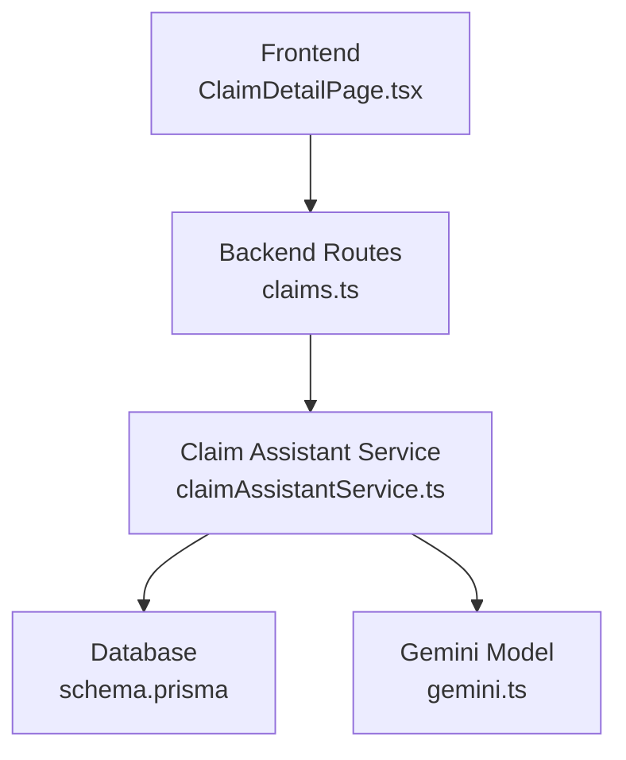
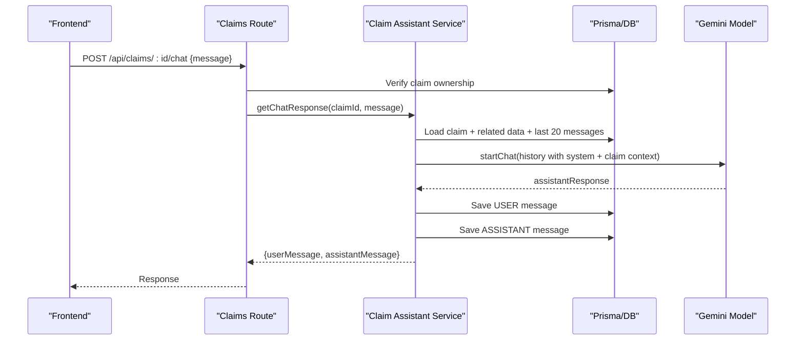
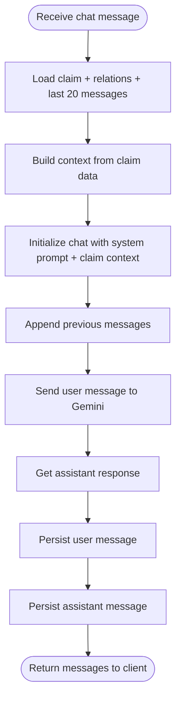
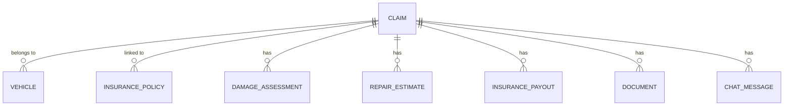
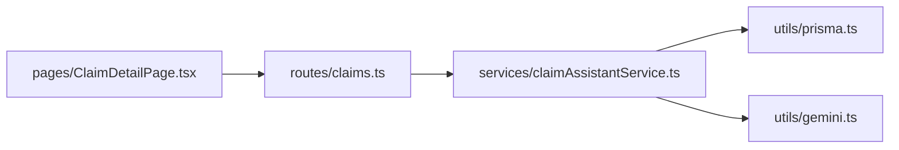
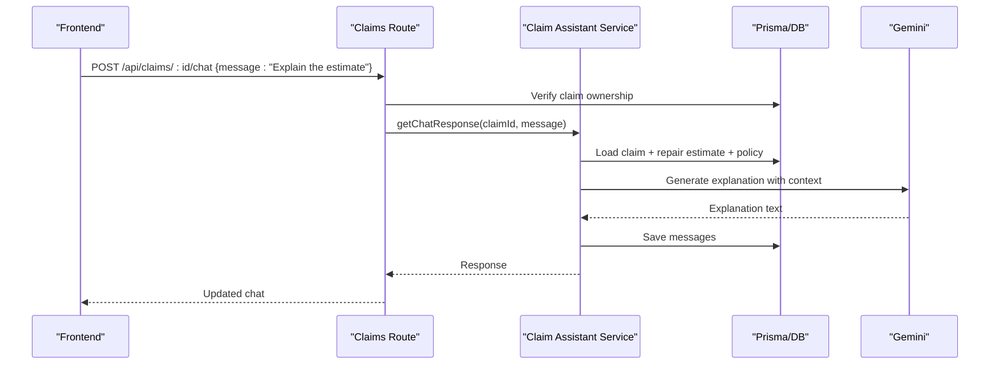

# Claim Assistant Service

<cite>
**Referenced Files in This Document**
- [claimAssistantService.ts](file://backend/src/services/claimAssistantService.ts)
- [claims.ts](file://backend/src/routes/claims.ts)
- [gemini.ts](file://backend/src/utils/gemini.ts)
- [schema.prisma](file://backend/prisma/schema.prisma)
- [index.ts (types)](file://backend/src/types/index.ts)
- [ClaimDetailPage.tsx](file://frontend/src/pages/ClaimDetailPage.tsx)
</cite>

## Table of Contents
1. [Introduction](#introduction)
2. [Project Structure](#project-structure)
3. [Core Components](#core-components)
4. [Architecture Overview](#architecture-overview)
5. [Detailed Component Analysis](#detailed-component-analysis)
6. [Dependency Analysis](#dependency-analysis)
7. [Performance Considerations](#performance-considerations)
8. [Troubleshooting Guide](#troubleshooting-guide)
9. [Conclusion](#conclusion)
10. [Appendices](#appendices)

## Introduction
This document explains the AI-powered Claim Assistant Service that provides intelligent, context-aware assistance for vehicle insurance claims. It covers how the chatbot answers claim-related queries, provides status updates and guidance, maintains conversation history, and integrates with claim data, policy information, and user history to deliver personalized responses. It also includes examples of common query patterns, response templates, escalation procedures, and guidance on customizing assistant behavior and adding domain-specific knowledge.

## Project Structure
The Claim Assistant Service is implemented as a backend service integrated into the Express routes and persisted via Prisma. The frontend exposes an interactive chat interface within the claim detail page.

**Diagram sources**
- [ClaimDetailPage.tsx:57-67](file://frontend/src/pages/ClaimDetailPage.tsx#L57-L67)
- [claims.ts:423-447](file://backend/src/routes/claims.ts#L423-L447)
- [claimAssistantService.ts:19-129](file://backend/src/services/claimAssistantService.ts#L19-L129)
- [gemini.ts:6-9](file://backend/src/utils/gemini.ts#L6-L9)
- [schema.prisma:71-94](file://backend/prisma/schema.prisma#L71-L94)

**Section sources**
- [claims.ts:423-447](file://backend/src/routes/claims.ts#L423-L447)
- [claimAssistantService.ts:19-129](file://backend/src/services/claimAssistantService.ts#L19-L129)
- [ClaimDetailPage.tsx:57-67](file://frontend/src/pages/ClaimDetailPage.tsx#L57-L67)

## Core Components
- Conversation management: Multi-turn dialogue per claim, persisted in ChatMessage records, loaded with recent history to maintain context.
- Context-aware response generation: Builds a rich claim context from related entities (vehicle, policy, damage assessment, repair estimate, payout, documents) and injects it into the model prompt.
- Claim state awareness: Uses current claim status, incident details, and document verification states to tailor guidance and next steps.
- Integration points: Prisma ORM for data access; Google Generative AI for natural language generation; Express routes for API exposure.

**Section sources**
- [claimAssistantService.ts:19-129](file://backend/src/services/claimAssistantService.ts#L19-L129)
- [schema.prisma:71-94](file://backend/prisma/schema.prisma#L71-L94)
- [schema.prisma:188-201](file://backend/prisma/schema.prisma#L188-L201)
- [gemini.ts:6-9](file://backend/src/utils/gemini.ts#L6-L9)

## Architecture Overview
The assistant follows a request-response flow:
- Frontend sends a message to the chat endpoint.
- Backend validates ownership and persists the user message.
- Service loads claim context and recent chat history, constructs a system prompt plus claim context, and calls Gemini.
- Gemini returns a response which is saved and returned to the client.

**Diagram sources**
- [claims.ts:423-447](file://backend/src/routes/claims.ts#L423-L447)
- [claimAssistantService.ts:19-129](file://backend/src/services/claimAssistantService.ts#L19-L129)
- [schema.prisma:71-94](file://backend/prisma/schema.prisma#L71-L94)
- [schema.prisma:188-201](file://backend/prisma/schema.prisma#L188-L201)
- [gemini.ts:6-9](file://backend/src/utils/gemini.ts#L6-L9)

## Detailed Component Analysis

### Conversation Management and Context-Aware Responses
- Loads the full claim with related entities and the last 20 chat messages to preserve multi-turn context.
- Constructs a structured context string including:
  - Claim status, vehicle info, incident date/location/description
  - Policy provider, coverage type, deductible
  - Damage assessment summary and individual damages
  - Repair estimate totals and estimated days
  - Insurance payout estimate and deductible
  - Required document statuses (LICENSE, REGISTRATION, ACCIDENT_REPORT)
- Initializes a chat session with a system prompt defining assistant responsibilities and tone, followed by claim context, then appends prior conversation history.
- Persists both user and assistant messages to enable persistent multi-turn conversations per claim.

**Diagram sources**
- [claimAssistantService.ts:19-129](file://backend/src/services/claimAssistantService.ts#L19-L129)

**Section sources**
- [claimAssistantService.ts:19-129](file://backend/src/services/claimAssistantService.ts#L19-L129)

### Data Models and Relationships
Key models involved in the assistant’s context:
- Claim: central entity with status, incident details, and relationships to vehicle, policy, images, assessments, estimates, payouts, documents, and chat messages.
- Vehicle: make/model/year/color used to personalize responses.
- InsurancePolicy: provider, coverage type, deductible used for payout explanations.
- DamageAssessment: overall severity and drivability assessment.
- RepairEstimate: itemized costs and total cost/time.
- InsurancePayout: estimated payout after deductible.
- Document: required types and verification status.
- ChatMessage: role (USER/ASSISTANT), content, timestamp per claim.

**Diagram sources**
- [schema.prisma:71-94](file://backend/prisma/schema.prisma#L71-L94)
- [schema.prisma:119-130](file://backend/prisma/schema.prisma#L119-L130)
- [schema.prisma:132-146](file://backend/prisma/schema.prisma#L132-L146)
- [schema.prisma:148-160](file://backend/prisma/schema.prisma#L148-L160)
- [schema.prisma:176-186](file://backend/prisma/schema.prisma#L176-L186)
- [schema.prisma:193-201](file://backend/prisma/schema.prisma#L193-L201)

**Section sources**
- [schema.prisma:71-94](file://backend/prisma/schema.prisma#L71-L94)
- [schema.prisma:188-201](file://backend/prisma/schema.prisma#L188-L201)

### API Endpoints for Chat
- GET /api/claims/:id/chat: Retrieves all chat messages for a claim in chronological order.
- POST /api/claims/:id/chat: Accepts a message, validates ownership, invokes the assistant service, persists messages, and returns both user and assistant messages.

Error handling:
- Returns 404 if claim not found.
- Returns 400 if message is missing.
- Returns 500 on internal errors.

**Section sources**
- [claims.ts:399-447](file://backend/src/routes/claims.ts#L399-L447)

### Frontend Chat Interface
- Displays claim details, progress checklist, suggestions, and a sticky chat panel.
- Sends user messages to the chat endpoint and refreshes claim data to render new messages.
- Provides quick message prompts to guide users.

**Section sources**
- [ClaimDetailPage.tsx:57-67](file://frontend/src/pages/ClaimDetailPage.tsx#L57-L67)
- [ClaimDetailPage.tsx:390-426](file://frontend/src/pages/ClaimDetailPage.tsx#L390-L426)

### Common Query Patterns and Response Templates
Examples of typical user queries and expected assistant behaviors:
- “What’s my claim status?”: Summarizes current status and next steps based on claim status and document verification.
- “Explain the estimate”: Breaks down parts vs labor, mentions deductible impact, and estimated repair time.
- “What documents do I need?”: Lists required documents and their verification status, guiding uploads if missing.
- “Is my car safe to drive?”: References drivability assessment and safety warnings when severe damage is detected.

These are generated dynamically using the constructed context and system prompt.

[No sources needed since this section summarizes behavior without quoting code]

### Escalation Procedures
- If the assistant is unsure or the issue requires human intervention, it advises contacting the insurance provider directly.
- For unreadable or problematic documents, the assistant suggests re-uploading clearer images and may trigger manual review workflows outside the chat.

**Section sources**
- [claimAssistantService.ts:4-17](file://backend/src/services/claimAssistantService.ts#L4-L17)

### Customizing Assistant Behavior
- System prompt customization: Modify the system prompt to adjust tone, scope, and responsibilities.
- Model selection: Change the Gemini model name in the utility to balance speed vs quality.
- Knowledge bases: Extend the context-building logic to include additional data sources (e.g., policy rules, repair shop catalogs) to inform responses.
- Domain-specific responses: Add conditional logic in context construction to emphasize different aspects based on claim type or damage category.

**Section sources**
- [claimAssistantService.ts:4-17](file://backend/src/services/claimAssistantService.ts#L4-L17)
- [gemini.ts:6-9](file://backend/src/utils/gemini.ts#L6-L9)

## Dependency Analysis
The assistant depends on:
- Express routes for HTTP endpoints and authorization.
- Prisma for data access and persistence.
- Google Generative AI for natural language generation.
- Frontend React components for user interaction.

**Diagram sources**
- [claims.ts:423-447](file://backend/src/routes/claims.ts#L423-L447)
- [claimAssistantService.ts:1-3](file://backend/src/services/claimAssistantService.ts#L1-L3)
- [gemini.ts:1-9](file://backend/src/utils/gemini.ts#L1-L9)
- [ClaimDetailPage.tsx:57-67](file://frontend/src/pages/ClaimDetailPage.tsx#L57-L67)

**Section sources**
- [claims.ts:423-447](file://backend/src/routes/claims.ts#L423-L447)
- [claimAssistantService.ts:1-3](file://backend/src/services/claimAssistantService.ts#L1-L3)
- [gemini.ts:1-9](file://backend/src/utils/gemini.ts#L1-L9)

## Performance Considerations
- Conversation history limit: Only the last 20 messages are included to control context size and reduce token usage.
- Database queries: Includes only necessary relations to minimize payload size.
- Model calls: Each chat message triggers a model call; consider batching or caching frequent responses for identical contexts.
- Error resilience: Fallbacks in other services demonstrate robust parsing and error handling; similar strategies can be applied to chat if needed.

[No sources needed since this section provides general guidance]

## Troubleshooting Guide
Common issues and resolutions:
- Claim not found: Ensure the claim exists and belongs to the authenticated user before sending chat messages.
- Missing message: Validate that the request body contains a non-empty message field.
- Chat retrieval failures: Check database connectivity and ensure ChatMessage records exist for the claim.
- Model integration errors: Verify environment variables for the Gemini API key and network access.

**Section sources**
- [claims.ts:423-447](file://backend/src/routes/claims.ts#L423-L447)
- [claimAssistantService.ts:36-38](file://backend/src/services/claimAssistantService.ts#L36-L38)

## Conclusion
The Claim Assistant Service delivers personalized, context-aware support throughout the claims lifecycle. By combining rich claim data, policy details, and conversation history with a configurable AI model, it provides clear guidance, status updates, and actionable recommendations. Extensibility points allow customization of assistant behavior, addition of domain-specific knowledge, and adaptation to different claim types.

[No sources needed since this section summarizes without analyzing specific files]

## Appendices

### Example Flow: User Asks About Estimate

**Diagram sources**
- [claims.ts:423-447](file://backend/src/routes/claims.ts#L423-L447)
- [claimAssistantService.ts:19-129](file://backend/src/services/claimAssistantService.ts#L19-L129)

### Adding New Knowledge Bases
- Extend context building in the assistant service to include additional data sources (e.g., policy rules, vendor catalogs).
- Update the system prompt to instruct the model to use the new knowledge base appropriately.
- Test with representative queries to ensure accurate and safe responses.

[No sources needed since this section provides conceptual guidance]