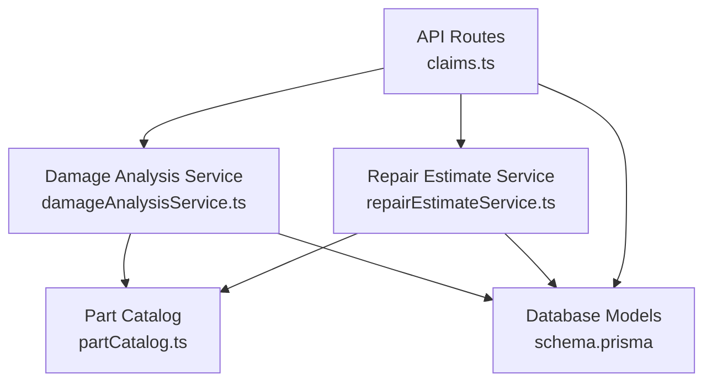
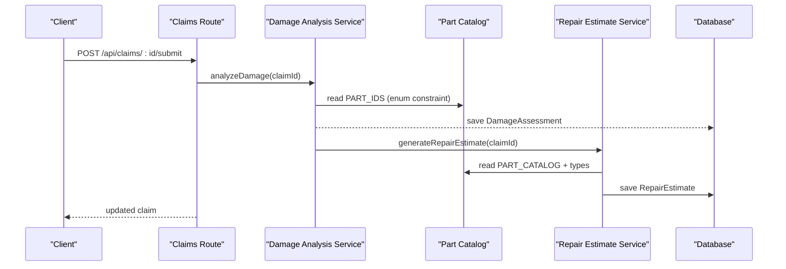
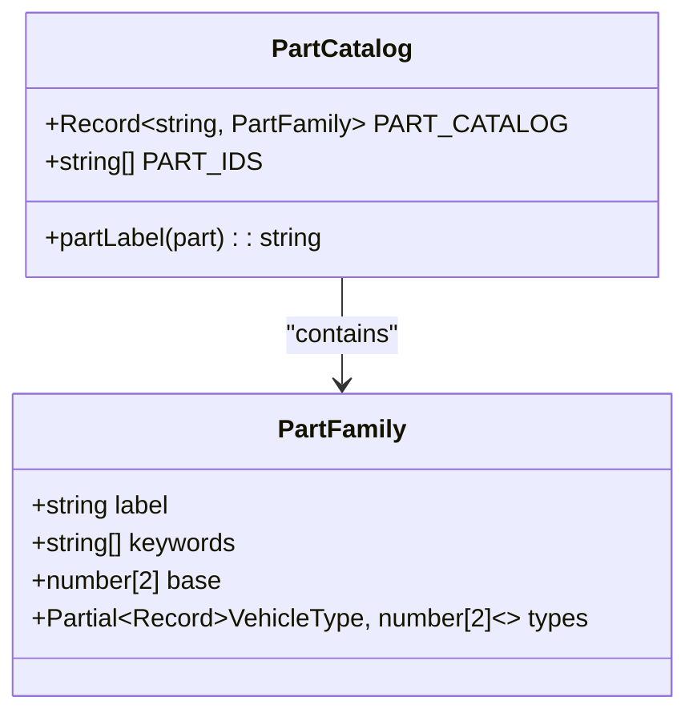
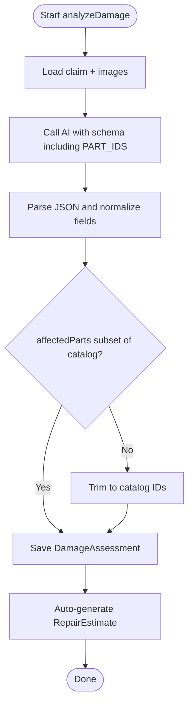
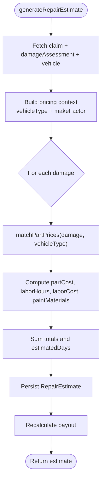
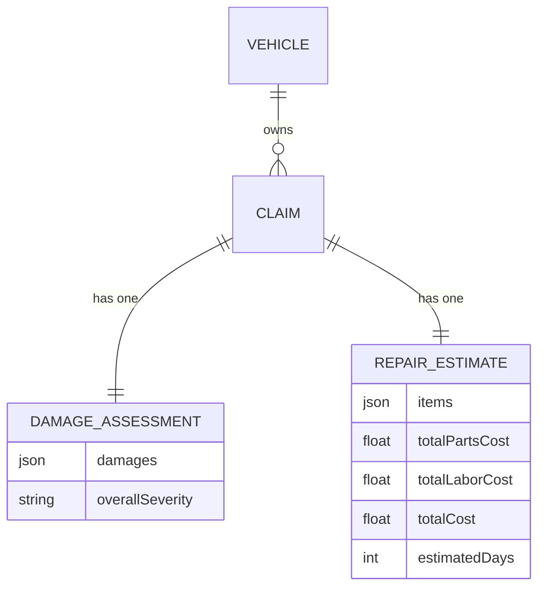
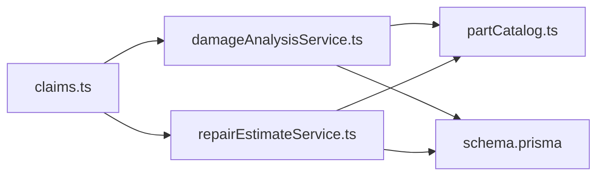

# Controlled Part Catalog System

<cite>
**Referenced Files in This Document**
- [partCatalog.ts](file://backend/src/services/partCatalog.ts)
- [repairEstimateService.ts](file://backend/src/services/repairEstimateService.ts)
- [damageAnalysisService.ts](file://backend/src/services/damageAnalysisService.ts)
- [claims.ts](file://backend/src/routes/claims.ts)
- [schema.prisma](file://backend/prisma/schema.prisma)
- [index.ts](file://backend/src/index.ts)
- [types/index.ts](file://backend/src/types/index.ts)
</cite>

## Table of Contents
1. [Introduction](#introduction)
2. [Project Structure](#project-structure)
3. [Core Components](#core-components)
4. [Architecture Overview](#architecture-overview)
5. [Detailed Component Analysis](#detailed-component-analysis)
6. [Dependency Analysis](#dependency-analysis)
7. [Performance Considerations](#performance-considerations)
8. [Troubleshooting Guide](#troubleshooting-guide)
9. [Conclusion](#conclusion)

## Introduction
This document explains the Controlled Part Catalog System used by the Smart Vehicle Insurance Claim System. The catalog is a single source of truth for vehicle parts, their price ranges, and labels. It constrains AI damage analysis to known parts, powers automated repair estimates, and ensures consistent display names across the system.

The catalog is not exposed as a standalone API; instead, it is consumed internally by:
- Damage analysis (to constrain AI output to valid part IDs)
- Repair estimate generation (to compute part costs based on vehicle type and make)
- Estimate line item labeling (for human-readable part names)

## Project Structure
The controlled part catalog lives in the backend services layer and integrates with claim processing routes and data models.

**Diagram sources**
- [claims.ts:364-415](file://backend/src/routes/claims.ts#L364-L415)
- [damageAnalysisService.ts:120-217](file://backend/src/services/damageAnalysisService.ts#L120-L217)
- [repairEstimateService.ts:170-244](file://backend/src/services/repairEstimateService.ts#L170-L244)
- [partCatalog.ts:1-57](file://backend/src/services/partCatalog.ts#L1-L57)
- [schema.prisma:129-216](file://backend/prisma/schema.prisma#L129-L216)

**Section sources**
- [index.ts:44-52](file://backend/src/index.ts#L44-L52)
- [claims.ts:364-415](file://backend/src/routes/claims.ts#L364-L415)

## Core Components
- Controlled Part Catalog: Defines allowed part IDs, keywords, base price ranges, and optional per-vehicle-type overrides.
- Damage Analysis Service: Enforces the catalog’s part list when parsing AI responses and stores normalized damage assessments.
- Repair Estimate Service: Uses the catalog to match parts to damages, compute costs, and persist estimates.
- Data Models: Store claims, damage assessments, and repair estimates that reference catalog-based parts.

Key responsibilities:
- Constrain AI outputs to safe, known parts
- Compute realistic cost estimates using vehicle class and premium make factors
- Provide readable labels for estimates and UIs

**Section sources**
- [partCatalog.ts:1-57](file://backend/src/services/partCatalog.ts#L1-L57)
- [damageAnalysisService.ts:18-39](file://backend/src/services/damageAnalysisService.ts#L18-L39)
- [repairEstimateService.ts:13-31](file://backend/src/services/repairEstimateService.ts#L13-L31)
- [schema.prisma:129-216](file://backend/prisma/schema.prisma#L129-L216)

## Architecture Overview
The catalog drives two critical flows:

1) AI Damage Analysis Flow
- Claims route triggers analysis
- Service calls AI with a schema that includes the catalog’s part IDs
- Response is parsed and normalized; only catalog-valid parts are kept
- Assessment is saved and an estimate is auto-generated

2) Repair Estimate Generation Flow
- Service reads the claim’s damage assessment
- For each damage, matches parts via exact ID or keyword fallback
- Computes part/labor/paint costs using vehicle class and make factors
- Persists estimate and recalculates payout

**Diagram sources**
- [claims.ts:243-286](file://backend/src/routes/claims.ts#L243-L286)
- [damageAnalysisService.ts:120-217](file://backend/src/services/damageAnalysisService.ts#L120-L217)
- [repairEstimateService.ts:170-244](file://backend/src/services/repairEstimateService.ts#L170-L244)
- [partCatalog.ts:19-51](file://backend/src/services/partCatalog.ts#L19-L51)
- [schema.prisma:189-216](file://backend/prisma/schema.prisma#L189-L216)

## Detailed Component Analysis

### Controlled Part Catalog
- Purpose: Canonical list of replaceable parts with price ranges and labels.
- Structure: Each entry has a label, keywords (for legacy matching), base price range, and optional per-vehicle-type ranges.
- Exports:
  - Allowed part IDs used to constrain AI responses
  - Label resolver for display names

**Diagram sources**
- [partCatalog.ts:12-56](file://backend/src/services/partCatalog.ts#L12-L56)

**Section sources**
- [partCatalog.ts:1-57](file://backend/src/services/partCatalog.ts#L1-L57)

### Damage Analysis Integration
- The AI response schema restricts affectedParts to the catalog’s part IDs.
- Parsing normalizes fields and filters affectedParts to only those present in the catalog.
- After saving the assessment, the system automatically generates a repair estimate.

**Diagram sources**
- [damageAnalysisService.ts:18-39](file://backend/src/services/damageAnalysisService.ts#L18-L39)
- [damageAnalysisService.ts:84-118](file://backend/src/services/damageAnalysisService.ts#L84-L118)
- [damageAnalysisService.ts:120-217](file://backend/src/services/damageAnalysisService.ts#L120-L217)
- [partCatalog.ts:51-56](file://backend/src/services/partCatalog.ts#L51-L56)

**Section sources**
- [damageAnalysisService.ts:18-39](file://backend/src/services/damageAnalysisService.ts#L18-L39)
- [damageAnalysisService.ts:84-118](file://backend/src/services/damageAnalysisService.ts#L84-L118)
- [damageAnalysisService.ts:120-217](file://backend/src/services/damageAnalysisService.ts#L120-L217)

### Repair Estimate Engine
- Matches parts per damage using:
  - Exact catalog ID from affectedParts
  - Keyword fallback against location/type text if no exact match
- Applies vehicle-class multipliers and premium-make uplifts
- Computes labor hours and paint materials based on damage type and severity
- Persists items and totals; recalculates insurance payout

**Diagram sources**
- [repairEstimateService.ts:13-31](file://backend/src/services/repairEstimateService.ts#L13-L31)
- [repairEstimateService.ts:73-120](file://backend/src/services/repairEstimateService.ts#L73-L120)
- [repairEstimateService.ts:128-168](file://backend/src/services/repairEstimateService.ts#L128-L168)
- [repairEstimateService.ts:170-244](file://backend/src/services/repairEstimateService.ts#L170-L244)

**Section sources**
- [repairEstimateService.ts:13-31](file://backend/src/services/repairEstimateService.ts#L13-L31)
- [repairEstimateService.ts:73-120](file://backend/src/services/repairEstimateService.ts#L73-L120)
- [repairEstimateService.ts:128-168](file://backend/src/services/repairEstimateService.ts#L128-L168)
- [repairEstimateService.ts:170-244](file://backend/src/services/repairEstimateService.ts#L170-L244)

### Data Model Relationships
- Claim links to DamageAssessment and RepairEstimate.
- DamageAssessment stores normalized damages with catalog-constrained affectedParts.
- RepairEstimate stores itemized costs derived from the catalog.

**Diagram sources**
- [schema.prisma:129-216](file://backend/prisma/schema.prisma#L129-L216)

**Section sources**
- [schema.prisma:129-216](file://backend/prisma/schema.prisma#L129-L216)

## Dependency Analysis
- Damage analysis depends on the catalog to constrain AI outputs.
- Repair estimation depends on the catalog for part pricing and labels.
- Both services depend on Prisma models for persistence.
- The claims route orchestrates these services.

**Diagram sources**
- [claims.ts:364-415](file://backend/src/routes/claims.ts#L364-L415)
- [damageAnalysisService.ts:120-217](file://backend/src/services/damageAnalysisService.ts#L120-L217)
- [repairEstimateService.ts:170-244](file://backend/src/services/repairEstimateService.ts#L170-L244)
- [partCatalog.ts:19-51](file://backend/src/services/partCatalog.ts#L19-L51)
- [schema.prisma:129-216](file://backend/prisma/schema.prisma#L129-L216)

**Section sources**
- [types/index.ts:7-13](file://backend/src/types/index.ts#L7-L13)
- [types/index.ts:20-51](file://backend/src/types/index.ts#L20-L51)

## Performance Considerations
- Catalog lookups are O(1) by ID and O(n) for keyword fallback; n equals the number of part families.
- Damage analysis limits images and damages to reduce AI payload and processing time.
- Repair estimate calculation is linear in the number of damages and uses simple arithmetic.
- Premium make detection is a short list check; negligible overhead.
- Database writes occur once per assessment and once per estimate.

Recommendations:
- Keep the catalog small and well-categorized to minimize keyword search space.
- Ensure damaged areas are described clearly to improve exact-match success and avoid keyword fallback.
- Batch operations where possible; current flows already batch image handling and estimate recalculation.

## Troubleshooting Guide
Common issues and resolutions:
- No images uploaded: Damage analysis requires at least one image. Upload full vehicle and close-up images before submitting.
- AI response parsing failure: If the model returns malformed JSON, the service throws an error. Retry after ensuring prompts and constraints are correct.
- No parts matched: If affectedParts is empty or invalid, the estimator falls back to damage-type ranges. Improve input descriptions or add accurate affectedParts.
- Estimate mismatch with garage quote: Estimates use market-calibrated ranges and may differ. Admin can set a final claimable value to override.

Operational checks:
- Health endpoint verifies database connectivity.
- Environment variables must be set for JWT, Gemini API key, and database URL.

**Section sources**
- [claims.ts:243-286](file://backend/src/routes/claims.ts#L243-L286)
- [claims.ts:364-415](file://backend/src/routes/claims.ts#L364-L415)
- [damageAnalysisService.ts:120-140](file://backend/src/services/damageAnalysisService.ts#L120-L140)
- [index.ts:19-26](file://backend/src/index.ts#L19-L26)
- [index.ts:54-62](file://backend/src/index.ts#L54-L62)

## Conclusion
The Controlled Part Catalog System centralizes part definitions and pricing logic to ensure consistent, auditable, and scalable claim processing. By constraining AI outputs and driving automated estimates, it reduces manual effort, improves accuracy, and provides a clear foundation for future enhancements such as dynamic pricing updates or expanded vehicle coverage.