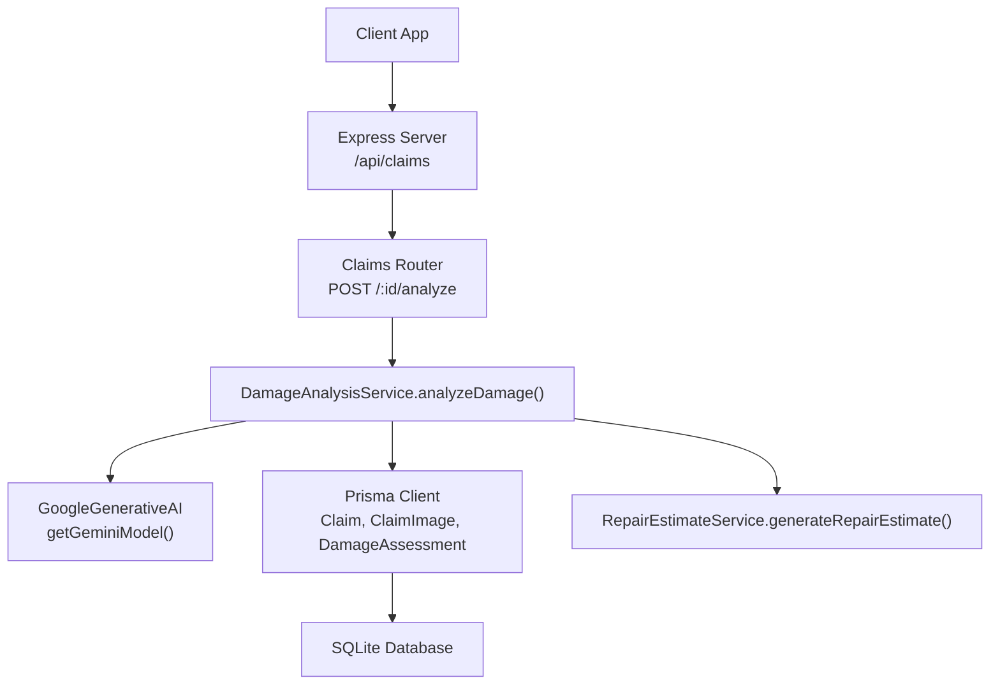
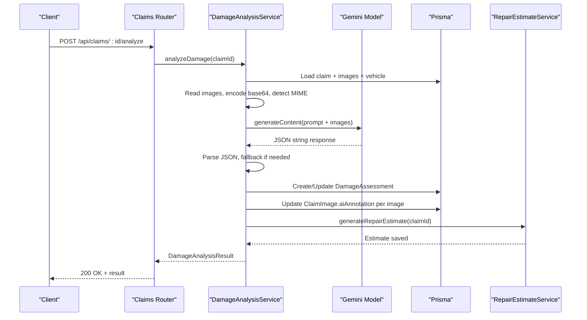
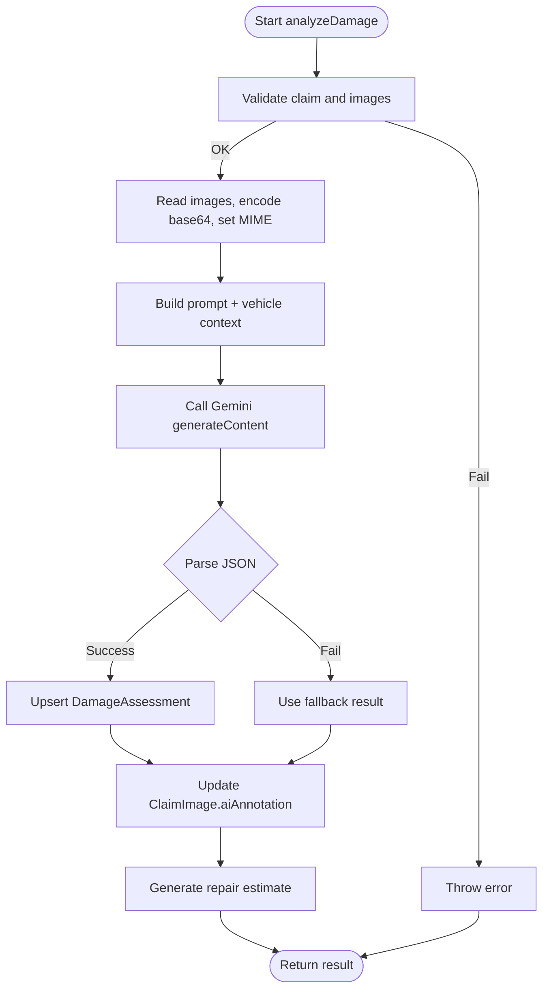
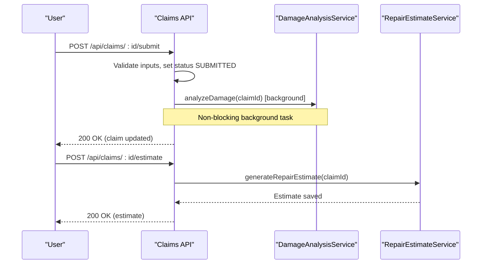
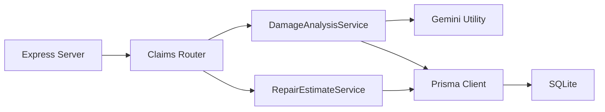

# Damage Analysis Service

<cite>
**Referenced Files in This Document**
- [damageAnalysisService.ts](file://backend/src/services/damageAnalysisService.ts)
- [gemini.ts](file://backend/src/utils/gemini.ts)
- [schema.prisma](file://backend/prisma/schema.prisma)
- [index.ts (types)](file://backend/src/types/index.ts)
- [claims.ts](file://backend/src/routes/claims.ts)
- [repairEstimateService.ts](file://backend/src/services/repairEstimateService.ts)
- [index.ts (server)](file://backend/src/index.ts)
</cite>

## Table of Contents
1. [Introduction](#introduction)
2. [Project Structure](#project-structure)
3. [Core Components](#core-components)
4. [Architecture Overview](#architecture-overview)
5. [Detailed Component Analysis](#detailed-component-analysis)
6. [Dependency Analysis](#dependency-analysis)
7. [Performance Considerations](#performance-considerations)
8. [Troubleshooting Guide](#troubleshooting-guide)
9. [Conclusion](#conclusion)
10. [Appendices](#appendices)

## Introduction
This document explains the Damage Analysis Service that processes vehicle images using Google Gemini AI to identify and classify damage types such as dents, scratches, cracks, broken lights, bumper damage, glass damage, and structural issues. It covers the image processing pipeline, prompt engineering strategies, severity assessment logic, JSON response parsing, Prisma database integration for storing assessments and annotating claim images, error handling and fallbacks, performance optimizations, and guidance for customizing detection parameters and extending new damage types.

## Project Structure
The backend exposes REST endpoints under /api/claims. The claims route triggers background or on-demand damage analysis, which reads uploaded images, calls Gemini, parses structured results, persists assessments, annotates images, and auto-generates repair estimates.



**Diagram sources**
- [claims.ts:270-288](file://backend/src/routes/claims.ts#L270-L288)
- [damageAnalysisService.ts:50-153](file://backend/src/services/damageAnalysisService.ts#L50-L153)
- [gemini.ts:6-9](file://backend/src/utils/gemini.ts#L6-L9)
- [schema.prisma:71-146](file://backend/prisma/schema.prisma#L71-L146)

**Section sources**
- [index.ts (server):25-45](file://backend/src/index.ts#L25-L45)
- [claims.ts:270-288](file://backend/src/routes/claims.ts#L270-L288)

## Core Components
- Damage Analysis Service: Orchestrates image reading, Gemini invocation, JSON parsing, persistence, image annotation updates, and automatic repair estimate generation.
- Gemini Utility: Provides a configured GoogleGenerativeAI model instance via environment variables.
- Types: Strongly typed interfaces for damage items and analysis results.
- Routes: Expose endpoints to trigger analysis and generate estimates.
- Repair Estimate Service: Converts damage assessments into itemized cost estimates and optional insurance payout calculations.
- Prisma Schema: Defines entities for claims, images, damage assessments, repair estimates, and related data.

**Section sources**
- [damageAnalysisService.ts:50-153](file://backend/src/services/damageAnalysisService.ts#L50-L153)
- [gemini.ts:6-9](file://backend/src/utils/gemini.ts#L6-L9)
- [index.ts (types):12-24](file://backend/src/types/index.ts#L12-L24)
- [claims.ts:270-314](file://backend/src/routes/claims.ts#L270-L314)
- [repairEstimateService.ts:104-199](file://backend/src/services/repairEstimateService.ts#L104-L199)
- [schema.prisma:71-146](file://backend/prisma/schema.prisma#L71-L146)

## Architecture Overview
The service follows a clear pipeline:
1. Route receives an analyze request for a specific claim.
2. Service loads claim with images and vehicle context from Prisma.
3. Images are read from disk and encoded as base64 inline data with MIME type detection.
4. A detailed prompt instructs Gemini to return a strict JSON schema describing damages, severity, drivability, and overall severity.
5. Gemini response is parsed; if parsing fails, a safe fallback result is used.
6. Assessment is persisted (create or update), and each claim image’s aiAnnotation field is updated based on image type.
7. Repair estimate generation is triggered automatically after successful analysis.



**Diagram sources**
- [claims.ts:270-288](file://backend/src/routes/claims.ts#L270-L288)
- [damageAnalysisService.ts:50-153](file://backend/src/services/damageAnalysisService.ts#L50-L153)
- [repairEstimateService.ts:104-199](file://backend/src/services/repairEstimateService.ts#L104-L199)

## Detailed Component Analysis

### Damage Analysis Pipeline
- Input validation: Ensures claim exists and has at least one image.
- Image preparation: Reads files from disk, determines MIME type by extension, encodes to base64, and builds inline data parts for Gemini.
- Prompt engineering: Uses a comprehensive prompt specifying damage categories, severity guidelines, and required JSON output format. Vehicle context is appended to improve relevance.
- AI call: Invokes Gemini with text prompt and image parts.
- Response parsing: Extracts JSON from possible markdown code blocks and parses to a typed structure; on failure, returns a minimal safe result indicating manual review.
- Persistence: Upserts DamageAssessment with damages, drivability assessment, overall severity, and raw AI response.
- Image annotations: Updates each ClaimImage’s aiAnnotation with relevant damages filtered by image type (full vs closeup).
- Post-processing: Automatically generates a repair estimate for the claim.



**Diagram sources**
- [damageAnalysisService.ts:50-153](file://backend/src/services/damageAnalysisService.ts#L50-L153)

**Section sources**
- [damageAnalysisService.ts:50-153](file://backend/src/services/damageAnalysisService.ts#L50-L153)

### Prompt Engineering Strategy
- Role and scope: Explicitly defines the AI as an automotive damage assessment expert.
- Categories: Enumerates target damage types including dents, scratches, cracks, broken lights, bumper damage, glass damage, wheel/tire damage, frame/structural damage, and other defects.
- Contextual guidance: Differentiates between full vehicle photos and damage closeups, requesting location descriptions and affected parts.
- Severity rubric: Provides clear MINOR/MODERATE/SEVERE definitions to standardize classification.
- Output contract: Enforces a strict JSON schema with fields for damages array, drivability assessment, and overall severity.
- Vehicle context: Appends make/model/year/color to ground the analysis.

**Section sources**
- [damageAnalysisService.ts:7-48](file://backend/src/services/damageAnalysisService.ts#L7-L48)

### Severity Assessment Algorithms
- AI-driven severity: The prompt includes severity guidelines; Gemini assigns severity per damage and an overall severity.
- Post-processing: The service stores both per-damage severity and overall severity in the database.
- Cost estimation linkage: Repair estimate service uses severity to select labor rates and paint/material costs, influencing total cost and estimated days.

**Section sources**
- [damageAnalysisService.ts:42-48](file://backend/src/services/damageAnalysisService.ts#L42-L48)
- [repairEstimateService.ts:48-58](file://backend/src/services/repairEstimateService.ts#L48-L58)

### JSON Response Parsing and Fallback
- Robust extraction: Attempts to extract JSON from markdown code fences before parsing.
- Typed result: Parses into a strongly-typed interface ensuring consistent downstream usage.
- Fallback behavior: On parse failure, logs the raw response and returns a minimal result indicating manual review, preventing pipeline breakage.

**Section sources**
- [damageAnalysisService.ts:85-103](file://backend/src/services/damageAnalysisService.ts#L85-L103)

### Prisma Integration and Data Models
- Entities involved:
  - Claim: Central entity linking user, vehicle, policy, images, assessments, estimates, payouts, documents, and chat messages.
  - ClaimImage: Stores image metadata, type (FULL_VEHICLE or DAMAGE_CLOSEUP), path, label, and aiAnnotation JSON.
  - DamageAssessment: Stores damages JSON, drivability assessment, overall severity, raw AI response, and timestamp.
  - RepairEstimate: Stores itemized costs, totals, and estimated days linked to assessment and claim.
- Relationships: One-to-many from Claim to images/documents/chat; one-to-one from Claim to DamageAssessment and RepairEstimate; optional InsurancePayout linked to RepairEstimate.

```mermaid
erDiagram
CLAIM {
uuid id PK
string userId FK
string vehicleId FK
string policyId FK
enum status
datetime incidentDate
string incidentLocation
string incidentDescription
string weatherConditions
boolean hasPoliceReport
datetime createdAt
datetime updatedAt
}
CLAIMIMAGE {
uuid id PK
string claimId FK
enum type
string filePath
string label
json aiAnnotation
datetime uploadedAt
}
DAMAGEASSESSMENT {
uuid id PK
string claimId UK FK
json damages
string drivabilityAssessment
enum overallSeverity
json aiRawResponse
datetime assessedAt
}
REPAIRESTIMATE {
uuid id PK
string claimId UK FK
string damageAssessmentId UK FK
json items
float totalPartsCost
float totalLaborCost
float totalCost
int estimatedDays
datetime createdAt
}
INSURANCEPAYOUT {
uuid id PK
string claimId UK FK
string repairEstimateId UK FK
float deductible
float coveredAmount
float estimatedPayout
string notes
datetime createdAt
}
VEHICLE {
uuid id PK
string userId FK
string make
string model
int year
string vin
string licensePlate
string color
int mileage
string photos
datetime createdAt
datetime updatedAt
}
USER {
uuid id PK
string email UK
string passwordHash
string firstName
string lastName
string phone
string address
boolean isAdmin
datetime createdAt
datetime updatedAt
}
USER ||--o{ VEHICLE : "owns"
USER ||--o{ CLAIM : "submits"
VEHICLE ||--o{ CLAIM : "involved in"
CLAIM ||--o{ CLAIMIMAGE : "has"
CLAIM ||--o| DAMAGEASSESSMENT : "has"
CLAIM ||--o| REPAIRESTIMATE : "has"
REPAIRESTIMATE ||--o| INSURANCEPAYOUT : "linked to"
```

**Diagram sources**
- [schema.prisma:10-25](file://backend/prisma/schema.prisma#L10-L25)
- [schema.prisma:27-43](file://backend/prisma/schema.prisma#L27-L43)
- [schema.prisma:71-94](file://backend/prisma/schema.prisma#L71-L94)
- [schema.prisma:101-130](file://backend/prisma/schema.prisma#L101-L130)
- [schema.prisma:132-160](file://backend/prisma/schema.prisma#L132-L160)

**Section sources**
- [schema.prisma:71-160](file://backend/prisma/schema.prisma#L71-L160)

### API Integration and Workflows
- Submitting a claim triggers background damage analysis asynchronously to avoid blocking the submit flow.
- Manual re-analysis can be requested via POST /api/claims/:id/analyze.
- After analysis, repair estimates can be generated via POST /api/claims/:id/estimate.



**Diagram sources**
- [claims.ts:152-193](file://backend/src/routes/claims.ts#L152-L193)
- [claims.ts:270-314](file://backend/src/routes/claims.ts#L270-L314)

**Section sources**
- [claims.ts:152-193](file://backend/src/routes/claims.ts#L152-L193)
- [claims.ts:270-314](file://backend/src/routes/claims.ts#L270-L314)

### Error Handling and Fallback Mechanisms
- Missing claim or images: Throws descriptive errors early.
- Gemini failures or malformed responses: Logs raw response and returns a safe fallback result indicating manual review.
- Background tasks: Errors in background analysis are caught and logged without failing the submit endpoint.
- Estimate generation: Errors during auto-generation are caught and logged, allowing the rest of the pipeline to continue.

**Section sources**
- [damageAnalysisService.ts:56-62](file://backend/src/services/damageAnalysisService.ts#L56-L62)
- [damageAnalysisService.ts:85-103](file://backend/src/services/damageAnalysisService.ts#L85-L103)
- [damageAnalysisService.ts:144-150](file://backend/src/services/damageAnalysisService.ts#L144-L150)
- [claims.ts:183-186](file://backend/src/routes/claims.ts#L183-L186)

### Performance Considerations
- Asynchronous background analysis: Submitting a claim does not block on AI processing, improving responsiveness.
- Efficient image handling: Reads files once and encodes to base64 inline data; MIME detection by extension avoids extra checks.
- Batched updates: Updates aiAnnotation per image in a loop; consider batching writes if image counts grow large.
- Environment limits: Ensure adequate memory and disk I/O capacity for multiple large images.
- Retry strategy: For transient Gemini errors, implement retries with exponential backoff at the Gemini call layer.

[No sources needed since this section provides general guidance]

### Customization and Extensibility
- Adding new damage types:
  - Extend the prompt to include the new category and ensure it aligns with severity guidelines.
  - Update the DamageItem type if necessary to capture additional attributes.
  - Add cost ranges and labor hours in the repair estimate service for accurate costing.
- Adjusting severity thresholds:
  - Refine severity definitions in the prompt to better match business rules.
  - Optionally add post-processing logic to adjust overall severity based on specific combinations of damages.
- Modifying image annotation logic:
  - Customize how damages are filtered per image type (e.g., map keywords like “close” vs “full”).
- Integrating additional services:
  - Hook into the pipeline after analysis to run third-party validations or notifications.

**Section sources**
- [damageAnalysisService.ts:7-48](file://backend/src/services/damageAnalysisService.ts#L7-L48)
- [index.ts (types):12-24](file://backend/src/types/index.ts#L12-L24)
- [repairEstimateService.ts:4-58](file://backend/src/services/repairEstimateService.ts#L4-L58)

## Dependency Analysis
- Express server mounts routes under /api/* and serves static uploads.
- Claims router depends on:
  - Prisma client for data access.
  - DamageAnalysisService for AI-based analysis.
  - RepairEstimateService for cost estimation.
  - Upload middleware for file handling.
- DamageAnalysisService depends on:
  - Gemini utility for model instantiation.
  - Prisma client for reading/writing claim-related data.
  - File system for reading uploaded images.
- RepairEstimateService depends on Prisma and uses deterministic cost tables to compute estimates.



**Diagram sources**
- [index.ts (server):25-45](file://backend/src/index.ts#L25-L45)
- [claims.ts:1-11](file://backend/src/routes/claims.ts#L1-L11)
- [damageAnalysisService.ts:1-5](file://backend/src/services/damageAnalysisService.ts#L1-L5)
- [gemini.ts:1-9](file://backend/src/utils/gemini.ts#L1-L9)

**Section sources**
- [index.ts (server):25-45](file://backend/src/index.ts#L25-L45)
- [claims.ts:1-11](file://backend/src/routes/claims.ts#L1-L11)

## Performance Considerations
- Use asynchronous background processing for AI tasks to reduce latency on user-facing endpoints.
- Cache frequently accessed claim metadata where appropriate to minimize repeated queries.
- Implement retry and timeout policies for Gemini calls to handle transient network issues.
- Monitor disk I/O when reading multiple large images; consider streaming or resizing images before encoding.
- Profile database write operations; batch updates if necessary to reduce round-trips.

[No sources needed since this section provides general guidance]

## Troubleshooting Guide
- No images to analyze: Ensure at least one image is uploaded before submitting or analyzing.
- Claim not found: Verify the claim ID and user authorization.
- Gemini API key missing: Confirm environment variable GEMINI_API_KEY is set at startup.
- JSON parse failures: Check the raw AI response stored in aiRawResponse for formatting issues; refine the prompt if needed.
- Background analysis failures: Inspect logs for background task errors; re-run manual analysis via the analyze endpoint.
- Estimate generation failures: Ensure a damage assessment exists; check logs for errors during cost calculation.

**Section sources**
- [damageAnalysisService.ts:56-62](file://backend/src/services/damageAnalysisService.ts#L56-L62)
- [damageAnalysisService.ts:85-103](file://backend/src/services/damageAnalysisService.ts#L85-L103)
- [index.ts (server):15-22](file://backend/src/index.ts#L15-L22)
- [claims.ts:183-186](file://backend/src/routes/claims.ts#L183-L186)

## Conclusion
The Damage Analysis Service integrates Google Gemini AI with a robust pipeline to classify vehicle damage, assess severity, persist results, annotate images, and generate repair estimates. Its design emphasizes reliability through fallbacks, asynchronous processing, and clear separation of concerns. By following the customization guidance, teams can extend damage categories, refine severity logic, and integrate additional services while maintaining performance and resilience.

[No sources needed since this section summarizes without analyzing specific files]

## Appendices

### API Endpoints Summary
- POST /api/claims/:id/submit: Submits a claim and triggers background damage analysis.
- POST /api/claims/:id/analyze: Manually triggers damage analysis and returns the result.
- POST /api/claims/:id/estimate: Generates a repair estimate based on existing damage assessment.

**Section sources**
- [claims.ts:152-193](file://backend/src/routes/claims.ts#L152-L193)
- [claims.ts:270-314](file://backend/src/routes/claims.ts#L270-L314)