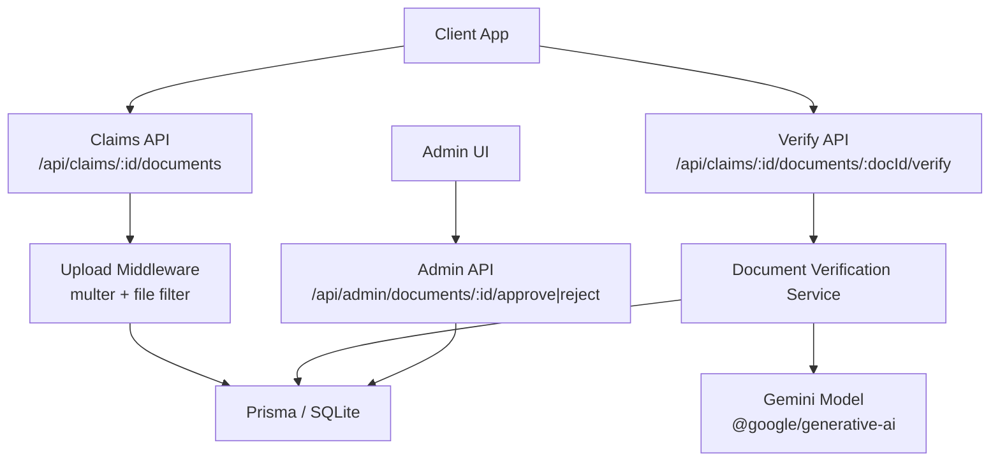
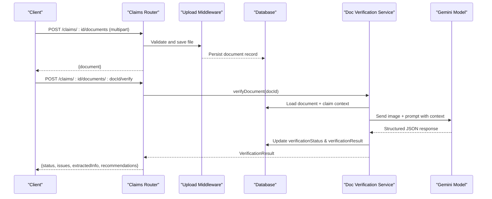
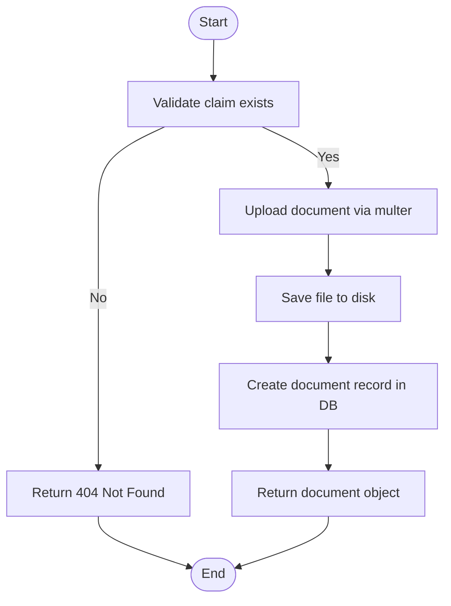
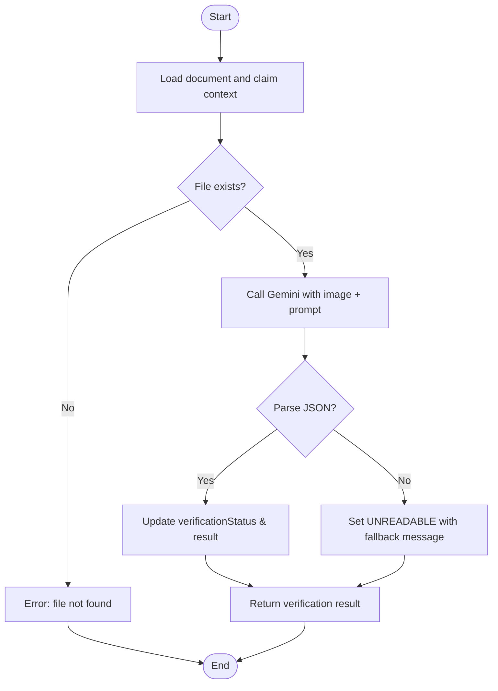
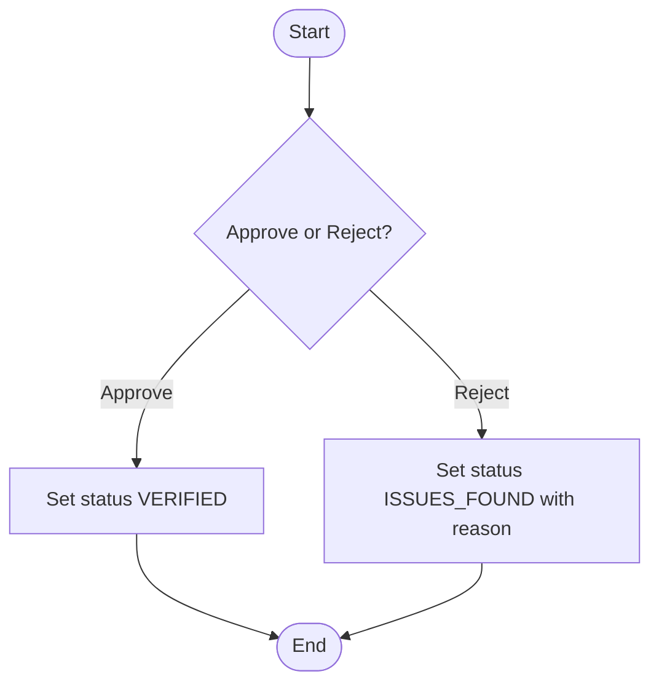
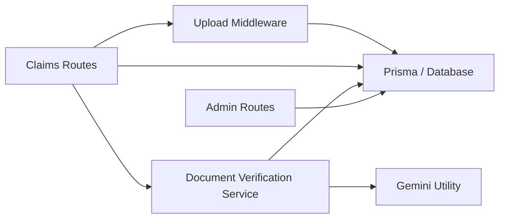

# Document Verification Service

<cite>
**Referenced Files in This Document**
- [documentVerificationService.ts](file://backend/src/services/documentVerificationService.ts)
- [claims.ts](file://backend/src/routes/claims.ts)
- [admin.ts](file://backend/src/routes/admin.ts)
- [upload.ts](file://backend/src/middleware/upload.ts)
- [gemini.ts](file://backend/src/utils/gemini.ts)
- [index.ts (types)](file://backend/src/types/index.ts)
- [schema.prisma](file://backend/prisma/schema.prisma)
- [package.json](file://backend/package.json)
</cite>

## Table of Contents
1. [Introduction](#introduction)
2. [Project Structure](#project-structure)
3. [Core Components](#core-components)
4. [Architecture Overview](#architecture-overview)
5. [Detailed Component Analysis](#detailed-component-analysis)
6. [Dependency Analysis](#dependency-analysis)
7. [Performance Considerations](#performance-considerations)
8. [Troubleshooting Guide](#troubleshooting-guide)
9. [Conclusion](#conclusion)
10. [Appendices](#appendices)

## Introduction
This document explains the Document Verification Service that validates insurance documents, claims forms, and supporting files for authenticity and completeness. It covers how documents are uploaded, verified via an AI model, and managed through user and admin workflows. It also outlines validation rules by document type, quality assessment criteria, rejection reasons, result structures, batch processing options, and integration points with external services. Guidance is provided for adding new document types, customizing validation rules, and handling edge cases.

## Project Structure
The backend exposes REST endpoints to upload documents and trigger verification. The verification service reads stored images, sends them to a generative AI model, parses structured results, and persists verification outcomes. Admin routes allow manual approval or rejection when needed.

**Diagram sources**
- [claims.ts:316-353](file://backend/src/routes/claims.ts#L316-L353)
- [claims.ts:379-397](file://backend/src/routes/claims.ts#L379-L397)
- [admin.ts:125-184](file://backend/src/routes/admin.ts#L125-L184)
- [upload.ts:17-53](file://backend/src/middleware/upload.ts#L17-L53)
- [documentVerificationService.ts:41-106](file://backend/src/services/documentVerificationService.ts#L41-L106)
- [gemini.ts:6-8](file://backend/src/utils/gemini.ts#L6-L8)

**Section sources**
- [claims.ts:316-353](file://backend/src/routes/claims.ts#L316-L353)
- [claims.ts:379-397](file://backend/src/routes/claims.ts#L379-L397)
- [admin.ts:125-184](file://backend/src/routes/admin.ts#L125-L184)
- [upload.ts:17-53](file://backend/src/middleware/upload.ts#L17-L53)
- [documentVerificationService.ts:41-106](file://backend/src/services/documentVerificationService.ts#L41-L106)
- [gemini.ts:6-8](file://backend/src/utils/gemini.ts#L6-L8)

## Core Components
- Document upload and storage middleware enforces allowed image formats and size limits, storing files under dedicated directories.
- Claims routes provide endpoints to upload documents and trigger verification per document.
- Document Verification Service orchestrates reading the file, invoking the AI model with context, parsing JSON results, and persisting verification status and details.
- Admin routes enable manual review actions to approve or reject documents.
- Types define the verification result structure used across the system.
- Prisma schema defines data models including Document, Claim, Vehicle, User, and enums for document types and verification statuses.

Key responsibilities:
- Validate uploads and persist metadata.
- Perform AI-based verification with contextual information.
- Persist verification outcomes and support manual overrides.

**Section sources**
- [upload.ts:17-53](file://backend/src/middleware/upload.ts#L17-L53)
- [claims.ts:316-353](file://backend/src/routes/claims.ts#L316-L353)
- [claims.ts:379-397](file://backend/src/routes/claims.ts#L379-L397)
- [documentVerificationService.ts:41-106](file://backend/src/services/documentVerificationService.ts#L41-L106)
- [admin.ts:151-184](file://backend/src/routes/admin.ts#L151-L184)
- [index.ts (types):45-50](file://backend/src/types/index.ts#L45-L50)
- [schema.prisma:162-186](file://backend/prisma/schema.prisma#L162-L186)

## Architecture Overview
The verification flow integrates three layers:
- API layer: Accepts uploads and verification requests; validates inputs and delegates to services.
- Service layer: Reads files, constructs prompts with claim context, calls the AI model, parses responses, and updates records.
- Data layer: Stores documents, claims, and verification results using Prisma over SQLite.

**Diagram sources**
- [claims.ts:316-353](file://backend/src/routes/claims.ts#L316-L353)
- [claims.ts:379-397](file://backend/src/routes/claims.ts#L379-L397)
- [documentVerificationService.ts:41-106](file://backend/src/services/documentVerificationService.ts#L41-L106)
- [gemini.ts:6-8](file://backend/src/utils/gemini.ts#L6-L8)

## Detailed Component Analysis

### Document Upload and Storage
- Allowed MIME types: JPEG, PNG, WebP, JPG.
- File size limit: 10 MB.
- Destination directories: images and documents under an uploads folder.
- Filenames are UUID-based with original extension preserved.

Validation rules enforced at upload time:
- Only supported image formats accepted.
- Size capped to prevent abuse.

Storage behavior:
- Documents saved under /uploads/documents/<uuid>.ext.
- Records created with claim association and default PENDING verification status.

**Section sources**
- [upload.ts:17-53](file://backend/src/middleware/upload.ts#L17-L53)
- [claims.ts:316-353](file://backend/src/routes/claims.ts#L316-L353)
- [schema.prisma:162-186](file://backend/prisma/schema.prisma#L162-L186)

### Document Type Detection and Validation Rules
The verification service uses a prompt that instructs the AI to identify the document type and check required fields based on the type. Supported document types include:
- LICENSE
- REGISTRATION
- ACCIDENT_REPORT
- REPAIR_ESTIMATE

For each type, the prompt specifies key information to look for:
- Driver’s License: full name, date of birth, license number, expiration date, photo presence.
- Vehicle Registration: vehicle make/model/year, VIN, owner name, registration date, expiration.
- Accident Report: date, location, parties involved, incident description, officer name/badge number.
- Repair Estimate: shop name, itemized parts/labor, total cost, vehicle info, date.

Quality checks and potential issues:
- Readability: clarity and legibility.
- Expiration: expired documents flagged.
- Missing required information.
- Signs of tampering or alteration.
- Inconsistencies in information.

These checks are performed by the AI model during verification and surfaced in the issues array of the result.

**Section sources**
- [documentVerificationService.ts:7-39](file://backend/src/services/documentVerificationService.ts#L7-L39)
- [schema.prisma:162-167](file://backend/prisma/schema.prisma#L162-L167)

### OCR Integration and Text Extraction
OCR is integrated via the generative AI model’s multimodal capabilities. The service:
- Reads the stored image file.
- Encodes it as base64 inline data with appropriate MIME type.
- Sends it along with a prompt that includes claim context (vehicle details and policyholder name).
- Parses the model’s structured JSON output containing extracted information and verification findings.

Note: There is no separate OCR library; text extraction is handled by the model’s vision capabilities.

**Section sources**
- [documentVerificationService.ts:57-74](file://backend/src/services/documentVerificationService.ts#L57-L74)
- [gemini.ts:6-8](file://backend/src/utils/gemini.ts#L6-L8)

### Watermark Verification and Tamper Detection
Watermark detection and explicit tamper detection are not implemented as separate algorithms. The verification prompt instructs the model to detect signs of tampering or alteration and flag inconsistencies. Results appear in the issues array and influence the overall status.

If automated parsing fails, the service defaults to UNREADABLE and recommends retrying with a clearer image.

**Section sources**
- [documentVerificationService.ts:7-39](file://backend/src/services/documentVerificationService.ts#L7-L39)
- [documentVerificationService.ts:78-94](file://backend/src/services/documentVerificationService.ts#L78-L94)

### Quality Assessment Criteria
Quality assessment is embedded in the verification prompt:
- Readability and legibility.
- Presence of required fields per document type.
- Detection of blurriness, darkness, or damage leading to UNREADABLE status.
- Identification of expired or missing information leading to ISSUES_FOUND.

These criteria determine the final status and guide recommendations.

**Section sources**
- [documentVerificationService.ts:7-39](file://backend/src/services/documentVerificationService.ts#L7-L39)

### Rejection Reasons and Statuses
Verification statuses:
- VERIFIED: Clear, complete, all required information present.
- ISSUES_FOUND: Readable but has issues such as expiration, missing info, inconsistencies, or suspected tampering.
- UNREADABLE: Too blurry, dark, or damaged to assess; may require manual review.

Rejection reasons are captured in the issues array and can be supplemented by admin actions.

**Section sources**
- [documentVerificationService.ts:24-39](file://backend/src/services/documentVerificationService.ts#L24-L39)
- [admin.ts:151-184](file://backend/src/routes/admin.ts#L151-L184)

### Verification Result Structure
The result returned by verification includes:
- status: one of VERIFIED, ISSUES_FOUND, UNREADABLE.
- issues: list of descriptive issues found.
- extractedInfo: key-value pairs of important information extracted from the document.
- recommendations: actionable guidance if issues are found.

This structure is persisted in the database and exposed via the API.

**Section sources**
- [index.ts (types):45-50](file://backend/src/types/index.ts#L45-L50)
- [documentVerificationService.ts:78-106](file://backend/src/services/documentVerificationService.ts#L78-L106)
- [schema.prisma:169-186](file://backend/prisma/schema.prisma#L169-L186)

### Batch Processing Capabilities
Batch verification is not built-in. To process multiple documents:
- Iterate over documents associated with a claim or set of claims.
- Call the verification endpoint for each document sequentially or concurrently with rate limiting.
- Optionally implement server-side concurrency control to avoid overwhelming the AI provider.

No dedicated batch endpoint exists in the current codebase.

[No sources needed since this section provides general guidance]

### Integration with External Verification Services
Integration point:
- Google Generative AI (Gemini) model is used for multimodal analysis and structured output.
- Configuration requires an API key environment variable.

Dependencies:
- @google/generative-ai package.
- Environment configuration via dotenv.

**Section sources**
- [gemini.ts:1-12](file://backend/src/utils/gemini.ts#L1-L12)
- [package.json:20-31](file://backend/package.json#L20-L31)

### End-to-End Workflows

#### Upload Workflow

**Diagram sources**
- [claims.ts:316-353](file://backend/src/routes/claims.ts#L316-L353)
- [upload.ts:17-53](file://backend/src/middleware/upload.ts#L17-L53)

#### Verification Workflow

**Diagram sources**
- [documentVerificationService.ts:41-106](file://backend/src/services/documentVerificationService.ts#L41-L106)

#### Admin Review Workflow

**Diagram sources**
- [admin.ts:151-184](file://backend/src/routes/admin.ts#L151-L184)

## Dependency Analysis
- Routes depend on middleware for uploads and on services for business logic.
- Services depend on Prisma for persistence and on the Gemini utility for AI integration.
- Types define shared interfaces consumed by services and routes.
- Schema defines entities and relationships used throughout.

**Diagram sources**
- [claims.ts:316-353](file://backend/src/routes/claims.ts#L316-L353)
- [claims.ts:379-397](file://backend/src/routes/claims.ts#L379-L397)
- [admin.ts:125-184](file://backend/src/routes/admin.ts#L125-L184)
- [documentVerificationService.ts:41-106](file://backend/src/services/documentVerificationService.ts#L41-L106)
- [gemini.ts:6-8](file://backend/src/utils/gemini.ts#L6-L8)

**Section sources**
- [claims.ts:316-353](file://backend/src/routes/claims.ts#L316-L353)
- [claims.ts:379-397](file://backend/src/routes/claims.ts#L379-L397)
- [admin.ts:125-184](file://backend/src/routes/admin.ts#L125-L184)
- [documentVerificationService.ts:41-106](file://backend/src/services/documentVerificationService.ts#L41-L106)
- [gemini.ts:6-8](file://backend/src/utils/gemini.ts#L6-L8)

## Performance Considerations
- File I/O: Reading images synchronously can block the event loop. Consider streaming or async reads for large batches.
- AI API latency: Each verification call incurs network latency; consider caching results and implementing retries with backoff.
- Concurrency: Avoid unbounded parallel calls to the AI provider; implement throttling or queues.
- Storage: Ensure adequate disk space and consider moving to cloud storage for scalability.
- Parsing overhead: Robust JSON parsing reduces retries; ensure consistent model outputs.

[No sources needed since this section provides general guidance]

## Troubleshooting Guide
Common issues and resolutions:
- Document file not found on disk: Ensure correct path mapping and that uploads directory exists.
- Failed to parse verification response: If the model returns unexpected content, the service falls back to UNREADABLE; reattempt with clearer images.
- Invalid document type: Only LICENSE, REGISTRATION, ACCIDENT_REPORT, REPAIR_ESTIMATE are accepted at upload time.
- Unsupported file format: Only JPEG, PNG, WebP, JPG are allowed; adjust client uploads accordingly.
- Manual review required: Use admin approve/reject endpoints to finalize decisions when automation is inconclusive.

Operational tips:
- Log errors around file paths and AI responses for diagnostics.
- Monitor pending documents via admin endpoints to triage issues.
- Validate environment variables for AI API keys and upload directories.

**Section sources**
- [documentVerificationService.ts:47-55](file://backend/src/services/documentVerificationService.ts#L47-L55)
- [documentVerificationService.ts:78-94](file://backend/src/services/documentVerificationService.ts#L78-L94)
- [claims.ts:333-338](file://backend/src/routes/claims.ts#L333-L338)
- [upload.ts:30-41](file://backend/src/middleware/upload.ts#L30-L41)
- [admin.ts:151-184](file://backend/src/routes/admin.ts#L151-L184)

## Conclusion
The Document Verification Service leverages a multimodal AI model to validate insurance documents, extract key information, and assess quality and authenticity. It integrates seamlessly with upload and admin workflows, providing clear statuses and actionable recommendations. While advanced features like watermark detection and dedicated OCR libraries are not implemented, the current approach offers flexible, context-aware verification suitable for most claim scenarios. Extensibility points exist for adding new document types, refining prompts, and integrating additional verification services.

[No sources needed since this section summarizes without analyzing specific files]

## Appendices

### Adding a New Document Type
Steps:
- Extend the DocumentType enum in the schema to include the new type.
- Regenerate Prisma client after schema changes.
- Update the upload route to accept the new type in the allowed list.
- Enhance the verification prompt to specify required fields and checks for the new type.
- Test end-to-end with sample documents.

**Section sources**
- [schema.prisma:162-167](file://backend/prisma/schema.prisma#L162-L167)
- [claims.ts:333-338](file://backend/src/routes/claims.ts#L333-L338)
- [documentVerificationService.ts:7-39](file://backend/src/services/documentVerificationService.ts#L7-L39)

### Customizing Validation Rules
- Modify the verification prompt to add or refine checks for readability, required fields, expiration, tampering, and inconsistencies.
- Adjust fallback behavior for parsing failures if needed.
- Introduce additional post-processing steps to normalize extractedInfo or enforce stricter business rules before persisting results.

**Section sources**
- [documentVerificationService.ts:7-39](file://backend/src/services/documentVerificationService.ts#L7-L39)
- [documentVerificationService.ts:78-94](file://backend/src/services/documentVerificationService.ts#L78-L94)

### Handling Edge Cases
- Unreadable images: Default to UNREADABLE and prompt users to re-upload clearer images.
- Missing files: Return explicit errors and guide administrators to verify storage paths.
- Inconsistent AI outputs: Implement robust parsing and fallback strategies; log raw responses for debugging.
- Rate limits or outages: Add retries with exponential backoff and circuit breakers at the service layer.

**Section sources**
- [documentVerificationService.ts:47-55](file://backend/src/services/documentVerificationService.ts#L47-L55)
- [documentVerificationService.ts:78-94](file://backend/src/services/documentVerificationService.ts#L78-L94)